<!-- [KFM_META_BLOCK_V2]
doc_id: kfm://contract/domains/atmosphere/air-station
title: contracts/domains/atmosphere/AirStation.md — AirStation Contract
type: contract
version: v0.2
status: draft
owners: OWNER_TBD — Atmosphere steward · Air-quality steward · Station/network steward · Contract steward · Evidence steward · Schema steward · Policy steward · Validation steward · Release steward · Docs steward
created: 2026-06-21
updated: 2026-06-21
policy_label: public; contracts; domains; atmosphere; air-station; semantic-contract; network-and-site-context; sensitive-lane
tags: [kfm, contracts, atmosphere, air, AirStation, station, network, site-context, network-and-site-context, siting, evidence, policy, validation, release, lifecycle, governance]
related:
  - ../../../docs/domains/atmosphere/README.md
  - ../../../docs/domains/atmosphere/CANONICAL_PATHS.md
  - ../../../docs/domains/atmosphere/OBJECT_FAMILY_MAP.md
  - ../../../docs/domains/atmosphere/POLICY.md
  - ../../../docs/domains/atmosphere/SENSITIVITY.md
  - ../../../docs/domains/atmosphere/SOURCE_FAMILIES.md
  - ../../../docs/domains/atmosphere/SOURCES.md
  - ../../../docs/domains/atmosphere/PIPELINE.md
  - ../../../docs/domains/atmosphere/API_CONTRACTS.md
  - ./AirObservation.md
  - ./PM25Observation.md
  - ./OzoneObservation.md
  - ./WeatherStation.md
  - ./WeatherObservation.md
  - ./WindField.md
  - ../../../schemas/contracts/v1/domains/atmosphere/AirStation.schema.json
  - ../../../policy/domains/atmosphere/
  - ../../../data/proofs/
  - ../../../release/
notes:
  - "Expanded from a planned-file scaffold into the object-level AirStation semantic contract."
  - "The paired schema is currently a PROPOSED scaffold with empty properties and additionalProperties enabled."
  - "docs/domains/atmosphere/OBJECT_FAMILY_MAP.md maps AirStation to NETWORK_AND_SITE_CONTEXT and says air observations attach to it."
  - "Atmosphere policy doctrine requires exact station siting to be generalized before public release."
  - "This contract defines air-station meaning; it does not authorize exact public coordinates, station ownership disclosure, observation truth, policy approval, evidence proof, public release, or health/safety guidance."
[/KFM_META_BLOCK_V2] -->

<a id="top"></a>

# AirStation Contract

> Semantic contract for `AirStation`, the Atmosphere/Air-domain object representing a governed monitoring station, station/network site, sensor site, or air-quality site context that air observations attach to. It records station/network meaning and lineage without making exact public siting, observation truth, station ownership exposure, evidence proof, or release approval authoritative by itself.

<p>
  
  
  
  
  
  
</p>

`contracts/domains/atmosphere/AirStation.md`

## Quick jumps

[Status](#status) · [Meaning](#meaning) · [Repo fit](#repo-fit) · [Station boundary](#station-boundary) · [Schema posture](#schema-posture) · [Accepted uses](#accepted-uses) · [Exclusions](#exclusions) · [Recommended fields](#recommended-fields) · [Invariants](#invariants) · [Lifecycle](#lifecycle) · [Validation](#validation) · [Evidence basis](#evidence-basis) · [Rollback](#rollback) · [Definition of done](#definition-of-done)

---

## Status

> [!IMPORTANT]
> **Status:** `draft` / semantic contract  
> **Owner:** `OWNER_TBD`  
> **Contract path:** `contracts/domains/atmosphere/AirStation.md`  
> **Schema path:** `schemas/contracts/v1/domains/atmosphere/AirStation.schema.json`  
> **Truth posture:** `CONFIRMED` target path, current update, paired scaffold schema, canonical-path lane, object-family map entry, network/site purpose row, station-siting policy row, adjacent expanded `AirObservation` contract, and uploaded authoring guidance. Validator behavior, fixtures, enforceable policy bundles, source registry behavior, evidence-bundle implementation, release workflow, API behavior, UI behavior, station registry behavior, and runtime behavior remain `NEEDS VERIFICATION`.

> [!CAUTION]
> This contract defines object meaning only. It does **not** authorize exact public coordinates, station ownership disclosure, station access disclosure, observation truth, sensor quality claims, policy approval, proof closure, public map release, or release of controlled Atmosphere/Air station/site products.

---

## Meaning

`AirStation` is the Atmosphere/Air-domain object for a governed station, monitoring site, network site, sensor node, station-location context, or comparable air-quality station record. Its knowledge character is `NETWORK_AND_SITE_CONTEXT`: station and siting metadata used to interpret observations, not an air-quality value by itself.

An air station may support:

- station/network identity for `AirObservation`, PM2.5, ozone, low-cost-sensor, or regulatory/archive records;
- source and network lineage for air-quality observations;
- public-safe station summaries when exact siting, ownership, rights, sensitivity, validation, and release gates allow;
- evidence packaging for claims about station identity, network membership, station class, source status, time span, siting class, or correction lineage;
- correction, supersession, decommissioning, relocation, merge/split, and rollback workflows.

It is not:

- an air-quality observation;
- a PM2.5 measurement;
- an ozone measurement;
- an AQI report;
- a low-cost-sensor reading by itself;
- a forecast/model field;
- a smoke or AOD proxy;
- an advisory or health/safety instruction;
- proof that any attached observation is true;
- permission to publish exact coordinates, private-land context, infrastructure-sensitive siting, station ownership, or access details;
- an EvidenceBundle;
- a PolicyDecision;
- a ReleaseManifest;
- public release approval.

---

## Repo fit

```text
contracts/
└── domains/
    └── atmosphere/
        ├── AirStation.md
        ├── AirObservation.md
        ├── PM25Observation.md
        └── OzoneObservation.md
```

Adjacent roots and object families:

| Root or object | Relationship |
|---|---|
| `../../../docs/domains/atmosphere/CANONICAL_PATHS.md` | Confirms the responsibility-root lane pattern for Atmosphere contracts and schemas. |
| `../../../docs/domains/atmosphere/OBJECT_FAMILY_MAP.md` | Lists `AirStation` as an owned Atmosphere object with `NETWORK_AND_SITE_CONTEXT` character. |
| `../../../docs/domains/atmosphere/POLICY.md` | States exact station siting must be generalized before public release. |
| `./AirObservation.md` | General air-quality observation family that attaches to `AirStation`. |
| `./PM25Observation.md`, `./OzoneObservation.md` | Specialized pollutant observation families that may attach to the station context. |
| `./WeatherStation.md` | Adjacent network/site-context family for meteorological station metadata. |
| `./WeatherObservation.md`, `./WindField.md` | Weather objects that may share station/network concepts but remain separate object families. |
| `../../../schemas/contracts/v1/domains/atmosphere/AirStation.schema.json` | Current scaffold schema. |
| `../../../policy/domains/atmosphere/` | Proposed enforceable policy bundle home; behavior not verified here. |
| `../../../data/proofs/` | EvidenceBundle/proof support. |
| `../../../release/` | Release, correction, supersession, and rollback authority. |

---

## Station boundary

`AirStation` must preserve the difference between station/site context, observation values, exact location, network ownership, evidence proof, policy, and release.

| Boundary | Rule |
|---|---|
| AirStation vs. AirObservation | The station is context; observations carry values and observation times. |
| AirStation vs. PM2.5/Ozone | Pollutant-specific measurements remain in pollutant-specific observation families. |
| AirStation vs. AQI/report | Station metadata is not a public AQI report or concentration value. |
| AirStation vs. exact public coordinates | Exact station siting is sensitive enough to require generalization before public release. |
| AirStation vs. station/network ownership | Ownership, operator, private-land, or infrastructure details may require rights/sensitivity review. |
| AirStation vs. sensor quality | Station identity does not prove instrument calibration, data quality, or observation validity. |
| AirStation vs. public release | Public display requires source rights, sensitivity review, validation, release record, correction path, and rollback target. |

---

## Schema posture

The paired schema found for this contract is:

```text
schemas/contracts/v1/domains/atmosphere/AirStation.schema.json
```

Current schema evidence:

| Schema fact | Status |
|---|---|
| Schema file exists | `CONFIRMED` |
| Schema title is `Airstation` | `CONFIRMED` |
| Schema status is `PROPOSED` | `CONFIRMED` |
| Schema properties are empty | `CONFIRMED` |
| `additionalProperties` is `true` | `CONFIRMED` |
| Schema `source_doc` points to `docs/domains/atmosphere/CANONICAL_PATHS.md` | `CONFIRMED` |
| Schema `contract_doc` points to this contract | `CONFIRMED` |
| Title casing aligned with object name `AirStation` | `NEEDS VERIFICATION` |
| Validator implementation | `UNKNOWN / NOT FOUND IN THIS TASK` |

This contract therefore defines semantic expectations for future schema, fixture, policy, and validator work. It does not claim that machine validation currently enforces those expectations.

---

## Accepted uses

| Use | Allowed? | Rule |
|---|---:|---|
| Defining the meaning of an air-station object | Yes | Must preserve station identity, network/site character, source, siting, evidence, sensitivity, policy, and release posture. |
| Linking air observations to a station | Yes | Observations remain separate value-bearing objects. |
| Supporting public-safe station labels or generalized locations | Conditional | Requires rights, sensitivity review, coordinate generalization, validation, release record, and rollback target. |
| Supporting evidence-packaged station-identity claims | Conditional | Requires EvidenceRef/EvidenceBundle support and clear claim scope. |
| Supporting network/operator/source lineage | Conditional | Must preserve rights, source role, and public-safety limits. |
| Treating AirStation as an observation value | No | Station metadata is context, not a measurement. |
| Publishing exact station coordinates by default | No | Exact siting must be generalized before public release. |
| Treating station identity as calibration/data-quality proof | No | Calibration, QA, and observation validity require separate evidence. |
| Treating station context as health/safety instruction | No | Advisory and health/safety outputs require authoritative source referral and separate policy. |
| Using schema validity as proof of truth | No | Schema shape is not evidence proof. |
| Treating this contract as release approval | No | Release authority remains separate. |

---

## Exclusions

| Does not belong in this contract | Correct home |
|---|---|
| Machine field shape | `../../../schemas/contracts/v1/domains/atmosphere/AirStation.schema.json`. |
| Validator implementation | `../../../tools/validators/...`. |
| Fixtures and tests | `../../../fixtures/domains/atmosphere/`, `../../../tests/domains/atmosphere/`, or policy test homes after verification. |
| Raw station registries, source downloads, station metadata payloads, coordinates, logs, or processing workspaces | `../../../data/raw/atmosphere/`, `../../../data/work/atmosphere/`, or `../../../data/quarantine/atmosphere/`, subject to lifecycle, rights, sensitivity, and validation rules. |
| Observation values | `./AirObservation.md`, `./PM25Observation.md`, `./OzoneObservation.md`, and paired schemas. |
| EvidenceBundle/proof content | `../../../data/proofs/`. |
| Source registry records | `../../../data/registry/sources/atmosphere/`. |
| Sensitivity, rights, admissibility, or release policy | `../../../policy/domains/atmosphere/` and `../../../policy/sensitivity/` after verification. |
| Release manifests, correction notices, rollback cards | `../../../release/`. |
| Public layer, UI, API, renderer, Focus Mode, notification, tile-service, or map implementation | Governed app/API/UI/layer roots. |

---

## Recommended fields

The current schema does not require these fields. They are `PROPOSED` semantic requirements for future schema/validator work:

| Field | Meaning |
|---|---|
| `air_station_id` | Stable deterministic or steward-assigned air-station identity. |
| `source_id` | Source descriptor or source family reference. |
| `source_role` | Required role/knowledge character; expected default is `NETWORK_AND_SITE_CONTEXT`. |
| `station_label` | Source-provided or normalized station name/label. |
| `station_code` | Source station code, site number, network ID, or normalized identifier. |
| `network_ref` | Monitoring network, operator, source family, or station group reference. |
| `operator_ref` | Operator/steward/agency reference where rights and sensitivity allow. |
| `station_type` | Regulatory, reference-grade, low-cost network node, mobile, temporary, research, community, or other reviewed type. |
| `station_status` | Active, inactive, decommissioned, relocated, historical, unknown, or needs verification. |
| `site_context_class` | Network/site context classification and sensitivity posture. |
| `exact_location_ref` | Internal exact geometry reference; not public by default. |
| `public_location_ref` | Public-safe generalized, redacted, binned, or centroided location reference where released. |
| `spatial_precision_class` | Exact, generalized, suppressed, centroided, binned, county/region, or denied precision posture. |
| `siting_summary` | Public-safe station siting summary when allowed. |
| `siting_sensitivity_reason` | Reason exact siting is restricted or generalized. |
| `temporal_scope` | Installation, activation, observation-coverage, decommissioning, relocation, retrieval, release, and correction times where material. |
| `freshness_state` | Current, stale, historical, superseded, relocated, corrected, or unknown. |
| `parameters_supported` | Pollutants or observation families associated with the station, as context only. |
| `instrument_refs` | Instrument, calibration, sensor, or platform references where modeled and rights allow. |
| `calibration_or_qa_refs` | Calibration, QA, audit, or quality-history references. |
| `rights_refs` | Rights, license, terms, or use-permission references. |
| `source_refs` | SourceDescriptor/source record references. |
| `source_roles` | Source roles supporting, contextualizing, or contesting the station record. |
| `evidence_refs` | EvidenceRef/EvidenceBundle references. |
| `observation_refs` | AirObservation, PM25Observation, OzoneObservation, or other observation references where linked after review. |
| `confidence_statement` | Bounded confidence, uncertainty, source limitation, or caveat statement. |
| `contradiction_refs` | Sources, station registries, relocation records, corrections, or claims that contest this station record. |
| `policy_state` | Policy posture or policy-decision reference. |
| `sensitivity_class` | Sensitivity/public-safety classification. |
| `review_refs` | Steward, source, policy, scientific, rights, or release review references. |
| `transform_refs` | SensitivityTransform or PublicationTransformReceipt references for public-safe derivatives. |
| `lineage_refs` | Prior, successor, relocation, merge, split, supersession, correction, or rollback records. |
| `release_refs` | Release/candidate linkage where applicable. |
| `correction_refs` | Correction/supersession/rollback lineage. |
| `spec_hash` | Integrity pin for the representation. |

---

## Invariants

`AirStation` must preserve these invariants:

- AirStation records are network/site context, not observation values;
- AirStation records are not PM2.5, ozone, AQI, model, AOD, smoke, or advisory objects;
- AirStation records are not evidence proof by themselves;
- exact station siting must not be public by default;
- public coordinates must be generalized, redacted, binned, suppressed, or otherwise transformed when policy requires;
- source role / knowledge character must remain explicit;
- station identity must remain distinct from AirObservation, PM2.5 Observation, Ozone Observation, WeatherStation, evidence, policy, release, correction, and rollback objects;
- raw station/source payloads and contract-level station summaries must remain separated;
- rights, source authority, station status, siting sensitivity, time fields, uncertainty, review posture, and lifecycle state must remain inspectable;
- stale, rights-unclear, source-ambiguous, exact-location-unsafe, or role-ambiguous station records fail closed or restrict public release;
- contradiction, relocation, merge/split, supersession, decommissioning, correction, and rollback lineage must remain traceable;
- schema validity is not evidence proof;
- public-facing use must be downstream of governed release artifacts and public-safe transforms;
- publication is a governed state transition, not a file move.

---

## Lifecycle

```mermaid
flowchart LR
  SRC[Station registry / network source] --> RAW[RAW station metadata]
  RAW -->|rights + source role + checksum| WORK[WORK normalization]
  WORK -->|schema + siting + policy gates| PROC[PROCESSED AirStation]
  PROC --> EVID[EvidenceBundle / station-identity claim support]
  EVID --> REVIEW[Steward / source / policy review]
  REVIEW -->|exact siting unsafe / unclear rights| HOLD[QUARANTINE / HOLD]
  REVIEW -->|accepted internal station| INTERNAL[Internal AirStation record]
  INTERNAL --> POLICY[Policy + sensitivity + precision screen]
  POLICY -->|public-safe station context| RELEASE[Release / correction / rollback records]
```



The contract defines the meaning of an air-station object. It does not replace source intake, source-role assignment, rights review, siting sensitivity review, exact-location storage controls, evidence resolution, schema validation, policy enforcement, transform receipts, release approval, correction, or rollback systems.

---

## Validation

Before relying on this contract, verify:

- schema fields beyond scaffold status;
- validator implementation and fixture coverage;
- canonical AirStation ID and deterministic identity rules;
- title/case consistency between `AirStation`, schema title `Airstation`, and any API/object registry;
- source role / knowledge-character enforcement;
- station-coordinate generalization and public-precision negative tests;
- rights gate behavior for station source products;
- station status, relocation, decommissioning, merge/split, and correction handling;
- station/network ownership and operator disclosure rules;
- calibration/QA/instrument relationship rules;
- source, installation, active, decommissioning, relocation, retrieval, release, and correction time separation;
- boundary between AirStation, AirObservation, PM2.5 Observation, Ozone Observation, WeatherStation, WeatherObservation, and WindField;
- transform, release, correction, supersession, withdrawal, and rollback linkage;
- no downstream surface treats this contract as an observation, exact public coordinate source, data-quality proof, health/safety instruction, or release approval.

---

## Evidence basis

| Source | Status | Supports | Limits |
|---|---|---|---|
| Prior `AirStation.md` scaffold | `CONFIRMED` | Target file existed as a planned-file scaffold and cited `docs/domains/atmosphere/CANONICAL_PATHS.md`. | Scaffold did not define authoritative semantics. |
| `AirStation.schema.json` | `CONFIRMED scaffold` | Schema exists, is `PROPOSED`, has empty properties, allows additional properties, and points to this contract. | Does not enforce full AirStation semantics. |
| `docs/domains/atmosphere/OBJECT_FAMILY_MAP.md` | `CONFIRMED repo evidence` | Lists `AirStation` as owned by Atmosphere/Air with `NETWORK_AND_SITE_CONTEXT` character and states air observations attach to it. | Per-object binding is noted as inferred pending ADR in the map itself. |
| `docs/domains/atmosphere/POLICY.md` | `CONFIRMED repo evidence` | States exact station siting must be generalized before public release and unresolved rights fail closed. | Enforceable bundle/test behavior remains unverified in this task. |
| `AirObservation.md` | `CONFIRMED adjacent contract` | Defines adjacent observation object as tied to AirStation/station-network context while keeping values separate. | Does not define AirStation schema enforcement. |
| Uploaded authoring prompt v2 | `CONFIRMED user-supplied guidance` | Requires evidence-grounded, implementation-honest Markdown with verification and rollback posture. | Authoring guidance, not implementation proof. |

---

## Rollback

Rollback is required if this contract is used to claim schema completeness, validator coverage, source-rights clearance, source-role enforcement, station-coordinate generalization enforcement, policy enforcement, release execution, API/UI behavior, station-registry behavior, EvidenceBundle proof, observation truth, calibration proof, exact public coordinate permission, public disclosure permission, or implementation maturity not verified in this task.

Rollback target: prior scaffold blob SHA `6cc999b19d716031b250a3d0184b2f96b245ca6f`.

---

## Definition of done

- [ ] Owners are confirmed and `OWNER_TBD` is replaced.
- [ ] AirStation vocabulary is reviewed by the Atmosphere steward, air-quality steward, station/network steward, evidence steward, policy steward, and release steward.
- [ ] Boundary between `AirStation`, `AirObservation`, `PM2.5 Observation`, `Ozone Observation`, `WeatherStation`, `WeatherObservation`, and `WindField` is accepted.
- [ ] Paired JSON Schema is expanded from scaffold status.
- [ ] Schema title/casing is reconciled with `AirStation` object-family name.
- [ ] Valid and invalid fixtures cover active, inactive, decommissioned, relocated, merged, split, rights-unclear, exact-location-unsafe, corrected, superseded, quarantined, release-candidate, public-safe generalized, and rollback states.
- [ ] Validator enforces source role, knowledge character, station refs, station status, siting sensitivity, public precision, time fields, rights refs, evidence refs, policy state, release refs, correction refs, and rollback refs.
- [ ] Negative tests deny AirStation as observation value, PM2.5 value, ozone value, AQI report, exact public coordinate source, health/safety instruction, or proof by itself.
- [ ] EvidenceBundle, PolicyDecision, ReviewRecord, PublicationTransformReceipt, ReleaseManifest, CorrectionNotice, and RollbackCard references are validated where required.
- [ ] API/UI surfaces prove they cannot treat AirStation as exact public coordinate authority, observation truth, data-quality proof, or release approval.
- [ ] Release and rollback dry-runs prove this contract cannot bypass publication gates.

## Status summary

`AirStation` is an Atmosphere/Air network-and-site-context object. It can support station identity, network lineage, observation attachment, station-status lineage, siting review, correction, and public-safe generalized display when rights, source role, evidence, validation, policy, transform, and release allow, but it is not an observation, not AQI, not a pollutant measurement, not data-quality proof, not exact public coordinate permission, not evidence proof, and not release approval.

<p align="right"><a href="#top">Back to top</a></p>
