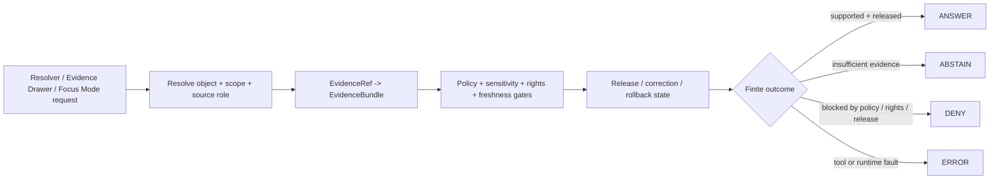

<!-- [KFM_META_BLOCK_V2]
doc_id: kfm://contract/domains/atmosphere/atmosphere-air-decision-envelope
title: contracts/domains/atmosphere/AtmosphereAirDecisionEnvelope.md — AtmosphereAirDecisionEnvelope Contract
type: contract
version: v0.2
status: draft
owners: OWNER_TBD — Atmosphere steward · API steward · Policy steward · Evidence steward · Schema steward · Validation steward · Release steward · Docs steward
created: 2026-06-21
updated: 2026-06-21
policy_label: public; contracts; domains; atmosphere; decision-envelope; semantic-contract; governed-api; finite-outcomes
tags: [kfm, contracts, atmosphere, air, decision-envelope, governed-api, answer, abstain, deny, error, evidence, policy, validation, release, lifecycle, governance]
related:
  - ../../../docs/domains/atmosphere/README.md
  - ../../../docs/domains/atmosphere/CANONICAL_PATHS.md
  - ../../../docs/domains/atmosphere/MISSING_OR_PLANNED_FILES.md
  - ../../../docs/domains/atmosphere/API_CONTRACTS.md
  - ../../../docs/domains/atmosphere/POLICY.md
  - ../../../docs/domains/atmosphere/PUBLICATION_POSTURE.md
  - ../../../docs/domains/atmosphere/OBJECT_FAMILY_MAP.md
  - ../../../docs/domains/atmosphere/VERIFICATION_BACKLOG.md
  - ./AirStation.md
  - ./AirObservation.md
  - ./PM25Observation.md
  - ./OzoneObservation.md
  - ./SmokeContext.md
  - ./AODRaster.md
  - ./ForecastContext.md
  - ./AdvisoryContext.md
  - ../../../schemas/contracts/v1/domains/atmosphere/atmosphere_air_decision_envelope.schema.json
  - ../../../policy/domains/atmosphere/
  - ../../../data/proofs/
  - ../../../release/
notes:
  - "Expanded from a planned-file scaffold into the Atmosphere/Air decision-envelope semantic contract."
  - "The CamelCase paired schema path schemas/contracts/v1/domains/atmosphere/AtmosphereAirDecisionEnvelope.schema.json was checked and returned Not Found in this task."
  - "docs/domains/atmosphere/MISSING_OR_PLANNED_FILES.md lists a proposed lower-case schema path for atmosphere_air_decision_envelope.schema.json."
  - "API_CONTRACTS.md identifies AtmosphereAirDecisionEnvelope as the DTO/schema family for the feature/detail resolver with ANSWER / ABSTAIN / DENY / ERROR outcomes."
  - "This contract defines decision-envelope meaning; it does not authorize policy bypass, evidence bypass, runtime route claims, public release, or health/safety guidance."
[/KFM_META_BLOCK_V2] -->

<a id="top"></a>

# AtmosphereAirDecisionEnvelope Contract

> Semantic contract for `AtmosphereAirDecisionEnvelope`, the Atmosphere/Air-domain decision envelope that carries finite resolver outcomes for governed feature/detail, Evidence Drawer, Focus Mode, or public-surface answer attempts. It records why the system may answer, abstain, deny, or error without turning generated language, raw source data, policy decisions, evidence pointers, map layers, or UI badges into sovereign truth.

<p>
  
  
  
  
  
  
</p>

`contracts/domains/atmosphere/AtmosphereAirDecisionEnvelope.md`

## Quick jumps

[Status](#status) · [Meaning](#meaning) · [Repo fit](#repo-fit) · [Decision boundary](#decision-boundary) · [Schema posture](#schema-posture) · [Outcome semantics](#outcome-semantics) · [Accepted uses](#accepted-uses) · [Exclusions](#exclusions) · [Recommended fields](#recommended-fields) · [Invariants](#invariants) · [Lifecycle](#lifecycle) · [Validation](#validation) · [Evidence basis](#evidence-basis) · [Rollback](#rollback) · [Definition of done](#definition-of-done)

---

## Status

> [!IMPORTANT]
> **Status:** `draft` / semantic contract  
> **Owner:** `OWNER_TBD`  
> **Contract path:** `contracts/domains/atmosphere/AtmosphereAirDecisionEnvelope.md`  
> **Expected schema path:** `schemas/contracts/v1/domains/atmosphere/atmosphere_air_decision_envelope.schema.json` (`PROPOSED` by planned-files register)  
> **Checked CamelCase schema path:** `schemas/contracts/v1/domains/atmosphere/AtmosphereAirDecisionEnvelope.schema.json` returned `Not Found` in this task.  
> **Truth posture:** `CONFIRMED` target path, current update, prior scaffold, planned-files row, API surface row, policy finite outcomes, publication-posture constraints, and uploaded authoring guidance. Schema existence, validator behavior, fixtures, enforceable policy bundles, exact API route, source registry behavior, evidence-bundle implementation, release workflow, UI behavior, Focus Mode behavior, and runtime behavior remain `NEEDS VERIFICATION`.

> [!CAUTION]
> This contract defines decision-envelope meaning only. It does **not** authorize a live API route, a generated answer, public release, life-safety guidance, source activation, policy bypass, evidence bypass, direct RAW/WORK access, or runtime implementation maturity.

---

## Meaning

`AtmosphereAirDecisionEnvelope` is the Atmosphere/Air-domain envelope for returning a finite, inspectable outcome from a governed resolver or answer attempt.

The envelope may be used by a future Atmosphere/Air feature/detail resolver, Evidence Drawer projection, Focus Mode answer, or related governed API surface to state:

- whether the system can answer;
- why it must abstain;
- why it must deny or hold;
- whether a system error occurred;
- which source-role, evidence, policy, freshness, sensitivity, release, correction, and rollback conditions shaped the result.

It is not:

- a raw source payload;
- an EvidenceBundle;
- a PolicyDecision by itself;
- a ReviewRecord;
- a ReleaseManifest;
- a public layer manifest;
- an observation, AQI report, model field, AOD raster, advisory, or station record;
- a substitute for official advisory or emergency authority;
- permission to answer without evidence, source role, policy state, release state, and citation support;
- proof that API routes, DTO classes, validators, fixtures, or runtime behavior currently exist.

---

## Repo fit

```text
contracts/
└── domains/
    └── atmosphere/
        ├── AtmosphereAirDecisionEnvelope.md
        ├── AirObservation.md
        ├── AODRaster.md
        ├── ForecastContext.md
        └── AdvisoryContext.md
```

Adjacent roots and object families:

| Root or object | Relationship |
|---|---|
| `../../../docs/domains/atmosphere/MISSING_OR_PLANNED_FILES.md` | Lists this contract as a proposed decision envelope for the feature/detail resolver. |
| `../../../docs/domains/atmosphere/API_CONTRACTS.md` | Identifies the proposed API surface and finite outcomes that this envelope is expected to carry. |
| `../../../docs/domains/atmosphere/POLICY.md` | Defines policy outcomes and anti-collapse DENY/RESTRICT/ABSTAIN behavior. |
| `../../../docs/domains/atmosphere/PUBLICATION_POSTURE.md` | Defines public-surface publication posture, blockers, and release requirements. |
| `../../../docs/domains/atmosphere/OBJECT_FAMILY_MAP.md` | Defines the object-family and knowledge-character vocabulary the decision envelope must preserve. |
| `./AirStation.md`, `./AirObservation.md` | Station and observation objects that the envelope may resolve or explain. |
| `./PM25Observation.md`, `./OzoneObservation.md` | Specialized pollutant objects where AQI/concentration collapse must be prevented. |
| `./SmokeContext.md`, `./AODRaster.md` | Smoke and remote-sensing objects where model/proxy/observation collapse must be prevented. |
| `./ForecastContext.md` | Model-context object; model fields must not become observations. |
| `./AdvisoryContext.md` | Advisory referral object; advisory context must not become life-safety instruction. |
| `../../../schemas/contracts/v1/domains/atmosphere/atmosphere_air_decision_envelope.schema.json` | Proposed machine-shape home from planned-files register; not verified as present in this task. |
| `../../../policy/domains/atmosphere/` | Proposed enforceable policy bundle home; behavior not verified here. |
| `../../../data/proofs/` | EvidenceBundle/proof support. |
| `../../../release/` | Release, correction, supersession, and rollback authority. |

---

## Decision boundary

`AtmosphereAirDecisionEnvelope` must preserve the boundary between runtime outcome, policy decision, evidence proof, release state, source record, object meaning, and generated explanation.

| Boundary | Rule |
|---|---|
| Decision envelope vs. PolicyDecision | PolicyDecision feeds the envelope; the envelope does not replace policy records or policy tests. |
| Decision envelope vs. EvidenceBundle | EvidenceBundle supports answerability; the envelope must cite or abstain rather than pretend to be proof. |
| Decision envelope vs. object contract | The envelope can reference objects; it does not define pollutant, station, forecast, advisory, or raster semantics. |
| Decision envelope vs. release manifest | The envelope may report release state; it does not approve publication. |
| Decision envelope vs. generated text | Generated explanation is downstream; it must remain evidence-subordinate. |
| Decision envelope vs. emergency/advisory authority | It must deny or redirect life-safety framing rather than issue instructions. |
| Decision envelope vs. implementation proof | A semantic contract does not prove API route, DTO, validator, or runtime existence. |

---

## Schema posture

The expected schema posture is currently conflicted and incomplete:

| Schema fact | Status |
|---|---|
| Contract file exists | `CONFIRMED` |
| Prior scaffold source pointed to `MISSING_OR_PLANNED_FILES.md` | `CONFIRMED` |
| Planned-files register lists `schemas/contracts/v1/domains/atmosphere/atmosphere_air_decision_envelope.schema.json` | `CONFIRMED proposed path` |
| Checked `schemas/contracts/v1/domains/atmosphere/AtmosphereAirDecisionEnvelope.schema.json` | `CONFIRMED Not Found in this task` |
| Lower-case planned schema path presence | `NEEDS VERIFICATION` |
| Validator implementation | `UNKNOWN / NOT FOUND IN THIS TASK` |
| Fixtures and negative tests | `UNKNOWN / NOT FOUND IN THIS TASK` |

This contract therefore defines semantic expectations for future schema, fixture, policy, and validator work. It does not claim that machine validation currently enforces those expectations.

---

## Outcome semantics

The envelope must carry finite outcomes. It should not let a public or AI surface silently drift into unsupported prose.

| Outcome | Meaning | Required posture |
|---|---|---|
| `ANSWER` | A bounded answer or payload can be returned. | Evidence, source role, policy, sensitivity, freshness, release state, and citation requirements have passed for the requested scope. |
| `ABSTAIN` | The system cannot support the requested claim. | Evidence, citation, source-role, time, or scope support is insufficient; no claim is made. |
| `DENY` | The requested output is blocked. | Policy, rights, sensitivity, source role, release state, life-safety boundary, or anti-collapse rule prevents the output. |
| `ERROR` | A tool/runtime/system fault occurred. | Treat fail-closed; do not answer from fallback generated language. |
| `HOLD` | A lifecycle/promotion gate blocks movement. | Keep prior lifecycle state; usually quarantine, rights review, stale-state, or steward review pending. |
| `RESTRICT` | Output may proceed only after transform/review. | Requires generalization, redaction, caveat, transform receipt, and release-review support. |

`ALLOW` / `PASS` may appear at ingest, validation, or promotion gates, but public/user-facing resolver envelopes should still collapse final response behavior to `ANSWER / ABSTAIN / DENY / ERROR` unless an accepted API contract says otherwise.

---

## Accepted uses

| Use | Allowed? | Rule |
|---|---:|---|
| Defining the meaning of the Atmosphere/Air finite decision envelope | Yes | Must preserve outcome, source-role, evidence, policy, release, correction, and rollback posture. |
| Returning a governed answer from a feature/detail resolver | Conditional | Exact route and DTO implementation remain `NEEDS VERIFICATION`; response must cite evidence and release state. |
| Returning an abstention | Yes | Required when evidence, source role, freshness, citation, or scope is insufficient. |
| Returning a denial | Yes | Required when policy, rights, sensitivity, release state, or anti-collapse rules block output. |
| Explaining why a decision occurred | Conditional | Explanation must be bounded, evidence-subordinate, and not a policy/evidence substitute. |
| Carrying life-safety instructions from advisory context | No | Advisory context is referral-only; redirect to authoritative source. |
| Converting AQI into concentration, AOD into PM2.5, or model fields into observations | No | Anti-collapse policies deny those presentations. |
| Bypassing release/policy/evidence gates because a response envelope exists | No | The envelope records gates; it does not bypass them. |
| Treating schema validity as truth proof | No | Schema shape is not evidence proof. |
| Treating this contract as route or runtime proof | No | Runtime behavior remains unverified unless tested. |

---

## Exclusions

| Does not belong in this contract | Correct home |
|---|---|
| Machine field shape | `../../../schemas/contracts/v1/domains/atmosphere/atmosphere_air_decision_envelope.schema.json` once verified or created. |
| Validator implementation | `../../../tools/validators/...`. |
| Fixtures and tests | `../../../fixtures/domains/atmosphere/`, `../../../tests/domains/atmosphere/`, or policy test homes after verification. |
| Policy rules | `../../../policy/domains/atmosphere/` and shared policy roots. |
| EvidenceBundle/proof content | `../../../data/proofs/`. |
| Source registry records | `../../../data/registry/sources/atmosphere/`. |
| Release manifests, correction notices, rollback cards | `../../../release/`. |
| Public layer, UI, API route, resolver implementation, Focus Mode implementation, notification, tile-service, or map implementation | Governed app/API/UI/layer roots after verification. |
| Object-specific semantics | Object contracts such as `AirObservation.md`, `AODRaster.md`, `ForecastContext.md`, and `AdvisoryContext.md`. |

---

## Recommended fields

The current machine shape is not verified. These are `PROPOSED` semantic requirements for future schema/validator work:

| Field | Meaning |
|---|---|
| `decision_envelope_id` | Stable deterministic or steward-assigned envelope identity. |
| `request_id` | Request, resolver call, or trace identifier. |
| `domain` | Expected `atmosphere` or `atmosphere/air` domain marker, consistent with accepted ADR/path policy. |
| `object_ref` | Referenced domain object, layer, feature, source, or query target. |
| `object_family` | AirStation, AirObservation, PM25Observation, OzoneObservation, SmokeContext, AODRaster, ForecastContext, AdvisoryContext, etc. |
| `knowledge_character` | Source role / knowledge character used to prevent collapse. |
| `outcome` | `ANSWER`, `ABSTAIN`, `DENY`, `ERROR`, or accepted finite resolver outcome. |
| `outcome_reason_code` | Machine-readable reason for answer, abstention, denial, hold, restriction, or error. |
| `human_summary` | Bounded public-safe explanation of the outcome. |
| `evidence_refs` | EvidenceRef/EvidenceBundle references used to support the decision. |
| `policy_refs` | PolicyDecision or policy-rule references used to support the decision. |
| `source_refs` | SourceDescriptor/source record references. |
| `source_roles` | Source roles supporting, contextualizing, or contesting the result. |
| `release_refs` | ReleaseManifest/candidate references where public output is involved. |
| `correction_refs` | CorrectionNotice/supersession/rollback lineage where applicable. |
| `rollback_refs` | RollbackCard or rollback target references. |
| `freshness_state` | Fresh, stale, expired, historical, superseded, corrected, or unknown. |
| `rights_state` | Rights resolved, unresolved, restricted, denied, unknown, or not applicable. |
| `sensitivity_state` | Public, generalized, restricted, quarantined, redacted, denied, or needs review. |
| `review_state` | Not reviewed, needs review, accepted, restricted, rejected, superseded, release-candidate, or withdrawn. |
| `disclosures` | Required public-surface disclosures: knowledge character, units, freshness, caveats, model uncertainty, advisory redirect, etc. |
| `abstain_detail` | Bounded explanation when outcome is `ABSTAIN`. |
| `deny_detail` | Bounded explanation when outcome is `DENY`, including policy/release blocker where safe to reveal. |
| `error_detail_ref` | Internal reference for error diagnosis; public message should remain safe and non-leaky. |
| `trace_refs` | Validation, resolver, AIReceipt, or audit-trace references where available. |
| `spec_hash` | Integrity pin for the envelope representation. |

---

## Invariants

`AtmosphereAirDecisionEnvelope` must preserve these invariants:

- resolver outcomes are finite and inspectable;
- the envelope is not proof by itself;
- generated language is not sovereign truth;
- EvidenceRef must resolve to EvidenceBundle before consequential claims are answered as authoritative;
- policy decisions feed outcomes but do not disappear into prose;
- source role / knowledge character must be explicit;
- AQI must not be collapsed into concentration;
- AOD must not be collapsed into PM2.5;
- model fields must not be collapsed into observations;
- low-cost sensor data must not be publicly released without caveats/correction/confidence/limitations;
- advisory context must not become life-safety instruction;
- stale, rights-unclear, source-role-unclear, evidence-missing, sensitivity-unresolved, or release-missing conditions block or restrict public promotion;
- public-facing use must be downstream of governed release artifacts and public-safe transforms;
- RAW, WORK, QUARANTINE, canonical/internal stores, and direct source-system outputs are not normal public paths;
- schema validity is not evidence proof;
- publication is a governed state transition, not a file move.

---

## Lifecycle



The contract defines the meaning of an Atmosphere/Air decision envelope. It does not replace source intake, source-role assignment, EvidenceBundle resolution, schema validation, policy enforcement, transform receipts, release approval, correction, rollback, route implementation, UI implementation, or AI receipt generation.

---

## Validation

Before relying on this contract, verify:

- whether the canonical schema should be CamelCase or lower-case, then create or update exactly one authoritative schema path;
- schema fields beyond planned status;
- validator implementation and fixture coverage;
- exact resolver route, DTO class, and API implementation;
- finite outcome enum and error semantics;
- source role / knowledge-character enforcement;
- EvidenceRef to EvidenceBundle resolution;
- policy decision references and reason-code vocabulary;
- release/correction/rollback reference requirements;
- freshness gate and stale-state handling;
- rights gate handling;
- sensitivity and redaction/generalization handling;
- negative tests for AQI/concentration, AOD/PM2.5, model/observation, low-cost caveats, advisory/life-safety, and source-role missing cases;
- no downstream surface treats this envelope as proof, route existence, generated-answer authority, policy bypass, release approval, or emergency guidance.

---

## Evidence basis

| Source | Status | Supports | Limits |
|---|---|---|---|
| Prior `AtmosphereAirDecisionEnvelope.md` scaffold | `CONFIRMED` | Target file existed as a planned-file scaffold and cited `docs/domains/atmosphere/MISSING_OR_PLANNED_FILES.md`. | Scaffold did not define authoritative semantics. |
| `schemas/contracts/v1/domains/atmosphere/AtmosphereAirDecisionEnvelope.schema.json` fetch | `CONFIRMED Not Found` | The CamelCase paired schema path checked in this task was absent. | Does not prove lower-case planned schema absence. |
| `docs/domains/atmosphere/MISSING_OR_PLANNED_FILES.md` | `CONFIRMED repo evidence` | Lists this contract as proposed and lists `atmosphere_air_decision_envelope.schema.json` as proposed machine shape. | Planning register, not implementation proof. |
| `docs/domains/atmosphere/API_CONTRACTS.md` | `CONFIRMED repo evidence` | Identifies `AtmosphereAirDecisionEnvelope` as the proposed DTO/schema family for feature/detail resolver with `ANSWER / ABSTAIN / DENY / ERROR`. | Exact route and implementation are explicitly unknown/proposed. |
| `docs/domains/atmosphere/POLICY.md` | `CONFIRMED repo evidence` | Defines finite policy outcomes and source-role/anti-collapse/freshness/sensitivity gates. | Enforceable bundle/test behavior remains unverified in this task. |
| `docs/domains/atmosphere/PUBLICATION_POSTURE.md` | `CONFIRMED repo evidence` | Confirms public promotion blockers, disclosures, release posture, and advisory/life-safety boundary. | Several implementation-shaped claims are marked proposed/unknown in the doc itself. |
| Uploaded authoring prompt v2 | `CONFIRMED user-supplied guidance` | Requires evidence-grounded, implementation-honest Markdown with verification and rollback posture. | Authoring guidance, not implementation proof. |

---

## Rollback

Rollback is required if this contract is used to claim schema existence, schema completeness, validator coverage, route existence, DTO implementation, source-role enforcement, policy enforcement, release execution, API/UI behavior, Focus Mode behavior, EvidenceBundle proof, public health guidance, emergency guidance, public disclosure permission, or implementation maturity not verified in this task.

Rollback target: prior scaffold blob SHA `06759c5c63c59e8244cbdfb1bc9e8f2c2bcb2b60`.

---

## Definition of done

- [ ] Owners are confirmed and `OWNER_TBD` is replaced.
- [ ] Canonical schema path is decided: CamelCase vs lower-case planned schema path.
- [ ] Exactly one paired JSON Schema is created or expanded from planned/scaffold status.
- [ ] Validator enforces finite outcomes and required decision-envelope fields.
- [ ] Fixtures cover `ANSWER`, `ABSTAIN`, `DENY`, `ERROR`, `HOLD`, and `RESTRICT` contexts.
- [ ] Negative fixtures cover AQI/concentration collapse, AOD/PM2.5 collapse, model/observation collapse, missing source role, low-cost caveat missing, advisory/life-safety misuse, stale source, unresolved rights, missing release state, and missing evidence.
- [ ] PolicyDecision, EvidenceBundle, ReviewRecord, PublicationTransformReceipt, ReleaseManifest, CorrectionNotice, and RollbackCard references are validated where required.
- [ ] Exact resolver route and DTO implementation are verified or kept explicitly `UNKNOWN`.
- [ ] API/UI/Focus Mode surfaces prove they cannot treat generated explanation, map badges, or this envelope as proof by themselves.
- [ ] Release and rollback dry-runs prove this contract cannot bypass publication gates.

## Status summary

`AtmosphereAirDecisionEnvelope` is a governed finite-outcome contract for Atmosphere/Air resolver behavior. It can support inspectable `ANSWER`, `ABSTAIN`, `DENY`, and `ERROR` outcomes when evidence, source role, policy, sensitivity, freshness, release, correction, and rollback state are available, but it is not proof, not a policy decision by itself, not a route implementation, not a release approval, not generated-answer authority, and not emergency or health/safety guidance.

<p align="right"><a href="#top">Back to top</a></p>
