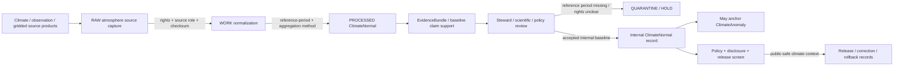

<!-- [KFM_META_BLOCK_V2]
doc_id: kfm://contract/domains/atmosphere/climate-normal
title: contracts/domains/atmosphere/ClimateNormal.md — ClimateNormal Contract
type: contract
version: v0.2
status: draft
owners: OWNER_TBD — Atmosphere steward · Climate steward · Baseline steward · Contract steward · Evidence steward · Schema steward · Policy steward · Validation steward · Release steward · Docs steward
created: 2026-06-21
updated: 2026-06-21
policy_label: public; contracts; domains; atmosphere; climate-normal; semantic-contract; climate-anomaly-context; baseline
tags: [kfm, contracts, atmosphere, air, ClimateNormal, climate, baseline, reference-period, climate-anomaly-context, evidence, policy, validation, release, lifecycle, governance]
related:
  - ../../../docs/domains/atmosphere/README.md
  - ../../../docs/domains/atmosphere/CANONICAL_PATHS.md
  - ../../../docs/domains/atmosphere/OBJECT_FAMILY_MAP.md
  - ../../../docs/domains/atmosphere/POLICY.md
  - ../../../docs/domains/atmosphere/PUBLICATION_POSTURE.md
  - ../../../docs/domains/atmosphere/SENSITIVITY.md
  - ../../../docs/domains/atmosphere/SOURCE_FAMILIES.md
  - ../../../docs/domains/atmosphere/SOURCES.md
  - ../../../docs/domains/atmosphere/PIPELINE.md
  - ../../../docs/domains/atmosphere/API_CONTRACTS.md
  - ./ClimateAnomaly.md
  - ./TemperatureObservation.md
  - ./PrecipitationObservation.md
  - ./WeatherObservation.md
  - ./ForecastContext.md
  - ./WindField.md
  - ./AtmosphereAirDecisionEnvelope.md
  - ../../../schemas/contracts/v1/domains/atmosphere/ClimateNormal.schema.json
  - ../../../policy/domains/atmosphere/
  - ../../../data/proofs/
  - ../../../release/
notes:
  - "Expanded from a planned-file scaffold into the object-level ClimateNormal semantic contract."
  - "The paired schema is currently a PROPOSED scaffold with empty properties and additionalProperties enabled."
  - "docs/domains/atmosphere/OBJECT_FAMILY_MAP.md maps Climate Normal to CLIMATE_ANOMALY_CONTEXT as a baseline object."
  - "The object-family purpose row says Climate Normal is a reference-period baseline and not an observation."
  - "Publication posture requires climate normal/anomaly context to carry aggregation receipt and baseline period disclosure."
  - "This contract defines climate-normal meaning; it does not authorize observation claims, anomaly claims, forecast claims, attribution claims, policy approval, evidence proof, public release, or health/safety guidance."
[/KFM_META_BLOCK_V2] -->

<a id="top"></a>

# ClimateNormal Contract

> Semantic contract for `ClimateNormal`, the Atmosphere/Air-domain object representing a governed reference-period climate baseline. It records baseline meaning, reference-period scope, aggregation lineage, and release posture without turning the normal into a raw observation, anomaly statement, forecast, attribution claim, evidence proof, public layer, or release approval by itself.

<p>
  
  
  
  
  
  
</p>

`contracts/domains/atmosphere/ClimateNormal.md`

## Quick jumps

[Status](#status) · [Meaning](#meaning) · [Repo fit](#repo-fit) · [Baseline boundary](#baseline-boundary) · [Schema posture](#schema-posture) · [Accepted uses](#accepted-uses) · [Exclusions](#exclusions) · [Recommended fields](#recommended-fields) · [Invariants](#invariants) · [Lifecycle](#lifecycle) · [Validation](#validation) · [Evidence basis](#evidence-basis) · [Rollback](#rollback) · [Definition of done](#definition-of-done)

---

## Status

> [!IMPORTANT]
> **Status:** `draft` / semantic contract  
> **Owner:** `OWNER_TBD`  
> **Contract path:** `contracts/domains/atmosphere/ClimateNormal.md`  
> **Schema path:** `schemas/contracts/v1/domains/atmosphere/ClimateNormal.schema.json`  
> **Truth posture:** `CONFIRMED` target path, current update, paired scaffold schema, canonical-path lane, object-family map entry, climate purpose row, publication-posture climate/anomaly disclosure rule, adjacent expanded `ClimateAnomaly` contract, and uploaded authoring guidance. Validator behavior, fixtures, enforceable policy bundles, source registry behavior, EvidenceBundle implementation, release workflow, API behavior, UI behavior, climate pipeline behavior, and runtime behavior remain `NEEDS VERIFICATION`.

> [!CAUTION]
> This contract defines object meaning only. It does **not** authorize publication, climate anomaly claims, climate attribution, trend proof, observation substitution, forecast substitution, source-rights clearance, policy approval, proof closure, public layer release, or health/safety guidance.

---

## Meaning

`ClimateNormal` is the Atmosphere/Air-domain object for a governed climate baseline over a declared reference period. Its knowledge character is `CLIMATE_ANOMALY_CONTEXT` in a baseline role: it is the reference against which a `ClimateAnomaly` or related climate-context statement may be compared.

A climate normal may support:

- baseline-relative climate context for public-safe maps, reports, or Focus Mode summaries;
- reference-period baselines for `ClimateAnomaly` records;
- aggregation-aware baseline values for temperature, precipitation, or other supported atmosphere/climate variables;
- evidence packaging for source lineage, baseline period, aggregation method, units, spatial scope, uncertainty, correction, and release posture;
- public-safe climate normal surfaces when rights, source role, baseline period, aggregation receipt, policy, validation, and release gates allow.

It is not:

- a raw weather observation;
- a raw station record;
- a climate anomaly by itself;
- a forecast or model field by default;
- a single event claim by itself;
- a climate attribution claim by itself;
- proof of cause, impact, hazard, damages, or trend significance by itself;
- an AQI report, AOD raster, smoke context, advisory, or air-quality measurement;
- an EvidenceBundle;
- a PolicyDecision;
- a ReleaseManifest;
- permission to publish baseline-unclear, source-role-unclear, rights-unclear, evidence-missing, stale, or release-missing climate claims.

---

## Repo fit

```text
contracts/
└── domains/
    └── atmosphere/
        ├── ClimateNormal.md
        ├── ClimateAnomaly.md
        ├── TemperatureObservation.md
        └── PrecipitationObservation.md
```

Adjacent roots and object families:

| Root or object | Relationship |
|---|---|
| `../../../docs/domains/atmosphere/CANONICAL_PATHS.md` | Confirms the responsibility-root lane pattern for Atmosphere contracts and schemas. |
| `../../../docs/domains/atmosphere/OBJECT_FAMILY_MAP.md` | Lists `Climate Normal` as an owned Atmosphere object with `CLIMATE_ANOMALY_CONTEXT` baseline character. |
| `../../../docs/domains/atmosphere/PUBLICATION_POSTURE.md` | Requires climate normal/anomaly context to carry aggregation receipt and baseline-period disclosure. |
| `../../../docs/domains/atmosphere/POLICY.md` | Defines source-role, anti-collapse, rights, freshness, sensitivity, and finite decision posture. |
| `./ClimateAnomaly.md` | Baseline-relative anomaly object that must anchor to a climate normal or reviewed baseline. |
| `./TemperatureObservation.md`, `./PrecipitationObservation.md`, `./WeatherObservation.md` | Observation/context families that may feed climate aggregation but must remain distinct from the normal. |
| `./ForecastContext.md`, `./WindField.md` | Model/context families that must not collapse into climate normal or observation semantics. |
| `./AtmosphereAirDecisionEnvelope.md` | Governed response envelope that may explain answer/abstain/deny/error posture for climate-normal questions. |
| `../../../schemas/contracts/v1/domains/atmosphere/ClimateNormal.schema.json` | Current scaffold schema. |
| `../../../policy/domains/atmosphere/` | Proposed enforceable policy bundle home; behavior not verified here. |
| `../../../data/proofs/` | EvidenceBundle/proof support. |
| `../../../release/` | Release, correction, supersession, and rollback authority. |

---

## Baseline boundary

`ClimateNormal` must preserve the difference between climate baseline, raw observation, climate anomaly, model/forecast, event claim, attribution claim, evidence proof, and release.

| Boundary | Rule |
|---|---|
| ClimateNormal vs. ClimateAnomaly | ClimateNormal defines the reference baseline; ClimateAnomaly records the deviation from that baseline. |
| ClimateNormal vs. observation | A normal is an aggregated/reference-period baseline, not a direct sensor reading. |
| ClimateNormal vs. weather event | A climate normal may contextualize conditions; it is not a discrete event/hazard truth claim by itself. |
| ClimateNormal vs. forecast/model field | Modeled or forecast context must remain labeled as model context and cannot be presented as a normal without governed method support. |
| ClimateNormal vs. attribution | A baseline does not prove cause, impact, damages, or trend significance without separate evidence and review. |
| ClimateNormal vs. public release | Public use requires rights, baseline period, aggregation receipt, evidence, policy, disclosure, release, correction path, and rollback target. |

---

## Schema posture

The paired schema found for this contract is:

```text
schemas/contracts/v1/domains/atmosphere/ClimateNormal.schema.json
```

Current schema evidence:

| Schema fact | Status |
|---|---|
| Schema file exists | `CONFIRMED` |
| Schema title is `Climatenormal` | `CONFIRMED` |
| Schema status is `PROPOSED` | `CONFIRMED` |
| Schema properties are empty | `CONFIRMED` |
| `additionalProperties` is `true` | `CONFIRMED` |
| Schema `source_doc` points to `docs/domains/atmosphere/CANONICAL_PATHS.md` | `CONFIRMED` |
| Schema `contract_doc` points to this contract | `CONFIRMED` |
| Title casing aligned with object name `ClimateNormal` | `NEEDS VERIFICATION` |
| Validator implementation | `UNKNOWN / NOT FOUND IN THIS TASK` |

This contract therefore defines semantic expectations for future schema, fixture, policy, and validator work. It does not claim that machine validation currently enforces those expectations.

---

## Accepted uses

| Use | Allowed? | Rule |
|---|---:|---|
| Defining the meaning of a climate-normal object | Yes | Must preserve baseline, reference period, aggregation, source role, evidence, policy, disclosure, and release posture. |
| Supporting ClimateAnomaly records | Yes | Climate anomalies must anchor to a climate normal or equivalent reviewed baseline before consequential use. |
| Supporting public-safe climate-normal visualization | Conditional | Requires rights, reference period, aggregation receipt, validation, policy, release record, disclosures, and rollback target. |
| Supporting evidence-packaged baseline claims | Conditional | Requires EvidenceRef/EvidenceBundle support and clear claim scope. |
| Comparing normals with observations or model context | Conditional | Must preserve knowledge character and avoid observation/model collapse. |
| Treating ClimateNormal as a raw observation | No | Climate normal is reference-period context, not an observed sensor value. |
| Treating ClimateNormal as climate anomaly | No | Anomaly meaning belongs to `ClimateAnomaly` or equivalent reviewed deviation object. |
| Treating ClimateNormal as climate attribution proof | No | Cause/impact/trend claims require separate evidence and review. |
| Publishing climate-normal context without baseline disclosure | No | Reference period and aggregation method must be visible before release. |
| Publishing rights-unclear climate-normal products | No | Fail closed through rights and release gates. |
| Using schema validity as proof of truth | No | Schema shape is not evidence proof. |
| Treating this contract as release approval | No | Release authority remains separate. |

---

## Exclusions

| Does not belong in this contract | Correct home |
|---|---|
| Machine field shape | `../../../schemas/contracts/v1/domains/atmosphere/ClimateNormal.schema.json`. |
| Validator implementation | `../../../tools/validators/...`. |
| Fixtures and tests | `../../../fixtures/domains/atmosphere/`, `../../../tests/domains/atmosphere/`, or policy test homes after verification. |
| Raw observations, gridded source files, normals datasets, climate products, source downloads, QA payloads, or processing workspaces | `../../../data/raw/atmosphere/`, `../../../data/work/atmosphere/`, or `../../../data/quarantine/atmosphere/`, subject to lifecycle, rights, freshness, and validation rules. |
| Climate anomaly semantics | `./ClimateAnomaly.md` and paired schema. |
| Observation values | `./TemperatureObservation.md`, `./PrecipitationObservation.md`, `./WeatherObservation.md`, and paired schemas. |
| Model fields or forecast context | `./ForecastContext.md`, `./WindField.md`, and paired schemas. |
| EvidenceBundle/proof content | `../../../data/proofs/`. |
| Source registry records | `../../../data/registry/sources/atmosphere/`. |
| Sensitivity, rights, admissibility, or release policy | `../../../policy/domains/atmosphere/` and `../../../policy/sensitivity/` after verification. |
| Release manifests, correction notices, rollback cards | `../../../release/`. |
| Public layer, UI, API, renderer, Focus Mode, notification, tile-service, or map implementation | Governed app/API/UI/layer roots. |

---

## Recommended fields

The current schema does not require these fields. They are `PROPOSED` semantic requirements for future schema/validator work:

| Field | Meaning |
|---|---|
| `climate_normal_id` | Stable deterministic or steward-assigned climate-normal identity. |
| `source_id` | Source descriptor or source family reference. |
| `source_role` | Required role/knowledge character; expected default is `CLIMATE_ANOMALY_CONTEXT` in a baseline role. |
| `normal_label` | Source-provided or normalized baseline label. |
| `normal_type` | Standard climate normal, gridded normal, station normal, regional normal, climatology baseline, or other reviewed type. |
| `reference_period` | Required baseline/reference period. |
| `parameter_name` | Temperature, precipitation, or other supported climate variable. |
| `parameter_code` | Source or normalized parameter code. |
| `normal_value` | Numeric, categorical, or structured normal/baseline value. |
| `unit` | Canonical unit or source unit with normalization state. |
| `aggregation_method` | Mean, sum, percentile, gridded aggregation, spatial aggregate, temporal aggregate, climatological method, or other reviewed method. |
| `aggregation_receipt_refs` | Aggregation receipt or processing evidence references required before publication. |
| `spatial_scope_ref` | Region, grid, station aggregate, county, basin, climate division, or other governed spatial scope. |
| `temporal_scope` | Source, reference-period, valid, retrieval, release, correction, and supersession times where material. |
| `qa_state` | Source QA, baseline QA, aggregation QA, confidence, uncertainty, or limitation marker. |
| `uncertainty_statement` | Bounded uncertainty, confidence, or limitation statement. |
| `rights_refs` | Rights, license, terms, or use-permission references. |
| `source_refs` | SourceDescriptor/source record references. |
| `source_roles` | Source roles supporting, contextualizing, or contesting the normal. |
| `evidence_refs` | EvidenceRef/EvidenceBundle references. |
| `related_anomaly_refs` | ClimateAnomaly references that use this normal as a baseline. |
| `related_observation_refs` | TemperatureObservation, PrecipitationObservation, WeatherObservation, or other references only as support/context. |
| `model_context_refs` | ForecastContext/WindField/climate-model context references where governed comparison is needed. |
| `confidence_statement` | Bounded confidence, uncertainty, quality, or limitation statement. |
| `contradiction_refs` | Source products, baselines, observations, methods, or claims that contest this normal. |
| `policy_state` | Policy posture or policy-decision reference. |
| `sensitivity_class` | Sensitivity/public-safety classification. |
| `review_refs` | Steward, source, policy, scientific, or release review references. |
| `transform_refs` | PublicationTransformReceipt or other transform receipt references for public-safe derivatives. |
| `lineage_refs` | Prior, successor, baseline update, reprocessing, correction, supersession, or rollback records. |
| `release_refs` | Release/candidate linkage where applicable. |
| `correction_refs` | Correction/supersession/rollback lineage. |
| `spec_hash` | Integrity pin for the representation. |

---

## Invariants

`ClimateNormal` must preserve these invariants:

- ClimateNormal records are reference-period baselines, not raw observations;
- ClimateNormal records may anchor ClimateAnomaly records but are not anomaly statements by themselves;
- ClimateNormal records are not forecasts, model fields, AQI reports, AOD masks, advisories, station records, or air-quality measurements;
- ClimateNormal records are not climate attribution proof by themselves;
- ClimateNormal records are not evidence proof by themselves;
- source role / knowledge character must remain explicit;
- reference period, aggregation method, units, uncertainty, rights, review posture, and lifecycle state must remain inspectable;
- public climate normal/anomaly context requires aggregation receipt and baseline-period disclosure;
- stale, rights-unclear, source-role-unclear, reference-period-missing, evidence-missing, or release-missing climate-normal products fail closed or restrict public release;
- contradiction, rejection, baseline revision, supersession, reprocessing, and correction lineage must remain traceable;
- schema validity is not evidence proof;
- public-facing use must be downstream of governed release artifacts and public-safe transforms;
- publication is a governed state transition, not a file move.

---

## Lifecycle



The contract defines the meaning of a climate-normal object. It does not replace source intake, source-role assignment, rights review, baseline calculation, aggregation, evidence resolution, schema validation, policy enforcement, transform receipts, release approval, correction, or rollback systems.

---

## Validation

Before relying on this contract, verify:

- schema fields beyond scaffold status;
- validator implementation and fixture coverage;
- canonical ClimateNormal ID and deterministic identity rules;
- title/case consistency between `ClimateNormal`, schema title `Climatenormal`, and any API/object registry;
- required reference-period behavior;
- source role / knowledge-character enforcement;
- aggregation receipt requirements;
- baseline/reference period disclosure rules;
- unit, parameter, QA, missing-value, and correction handling;
- rights gate behavior for source and derived products;
- source, reference period, valid, retrieval, release, correction, baseline revision, and supersession time separation;
- boundary between ClimateNormal, ClimateAnomaly, TemperatureObservation, PrecipitationObservation, WeatherObservation, ForecastContext, and WindField;
- transform, release, correction, supersession, withdrawal, and rollback linkage;
- no downstream surface treats this contract as raw observation, anomaly claim, forecast, attribution proof, health/safety guidance, or release approval.

---

## Evidence basis

| Source | Status | Supports | Limits |
|---|---|---|---|
| Prior `ClimateNormal.md` scaffold | `CONFIRMED` | Target file existed as a planned-file scaffold and cited `docs/domains/atmosphere/CANONICAL_PATHS.md`. | Scaffold did not define authoritative semantics. |
| `ClimateNormal.schema.json` | `CONFIRMED scaffold` | Schema exists, is `PROPOSED`, has empty properties, allows additional properties, and points to this contract. | Does not enforce full ClimateNormal semantics. |
| `docs/domains/atmosphere/OBJECT_FAMILY_MAP.md` | `CONFIRMED repo evidence` | Lists `Climate Normal` as owned by Atmosphere/Air with `CLIMATE_ANOMALY_CONTEXT` baseline character. | Per-object binding is noted as inferred pending ADR in the map itself. |
| `docs/domains/atmosphere/OBJECT_FAMILY_MAP.md` purpose row | `CONFIRMED repo evidence` | States Climate Normal is a reference-period baseline and not an observation. | Does not prove schema/validator enforcement. |
| `docs/domains/atmosphere/PUBLICATION_POSTURE.md` | `CONFIRMED repo evidence` | Requires climate normal/anomaly context to carry aggregation receipt and baseline-period disclosure, and blocks unresolved rights/source/evidence/sensitivity/release. | Does not prove release implementation. |
| `ClimateAnomaly.md` | `CONFIRMED adjacent contract` | Confirms the adjacent anomaly contract treats ClimateNormal as required baseline support. | Does not define or enforce the ClimateNormal schema. |
| Uploaded authoring prompt v2 | `CONFIRMED user-supplied guidance` | Requires evidence-grounded, implementation-honest Markdown with verification and rollback posture. | Authoring guidance, not implementation proof. |

---

## Rollback

Rollback is required if this contract is used to claim schema completeness, validator coverage, baseline calculation, source-rights clearance, source-role enforcement, aggregation enforcement, policy enforcement, release execution, API/UI behavior, climate pipeline behavior, EvidenceBundle proof, anomaly proof, attribution proof, public health guidance, public disclosure permission, or implementation maturity not verified in this task.

Rollback target: prior scaffold blob SHA `3cb1c092175faecd2e4427cdca963b162e6926da`.

---

## Definition of done

- [ ] Owners are confirmed and `OWNER_TBD` is replaced.
- [ ] ClimateNormal vocabulary is reviewed by the Atmosphere steward, climate steward, baseline steward, evidence steward, policy steward, and release steward.
- [ ] Boundary between `ClimateNormal`, `ClimateAnomaly`, `TemperatureObservation`, `PrecipitationObservation`, `WeatherObservation`, `ForecastContext`, and `WindField` is accepted.
- [ ] Paired JSON Schema is expanded from scaffold status.
- [ ] Schema title/casing is reconciled with `ClimateNormal` object-family name.
- [ ] Valid and invalid fixtures cover reference-period-present, reference-period-missing, aggregation-receipt-present, aggregation-receipt-missing, rights-unclear, source-role-missing, evidence-missing, corrected, superseded, quarantined, release-candidate, public-safe derivative, and rollback states.
- [ ] Validator enforces source role, knowledge character, reference period, time fields, units, aggregation receipts, rights refs, evidence refs, policy state, release refs, correction refs, and rollback refs.
- [ ] Negative tests deny ClimateNormal as raw observation, anomaly statement, forecast, model field, climate attribution proof, advisory instruction, or proof by itself.
- [ ] EvidenceBundle, PolicyDecision, ReviewRecord, PublicationTransformReceipt, ReleaseManifest, CorrectionNotice, and RollbackCard references are validated where required.
- [ ] API/UI surfaces prove they cannot treat ClimateNormal as observation, anomaly, forecast, attribution proof, health guidance, unsupported trend claim, or release approval.
- [ ] Release and rollback dry-runs prove this contract cannot bypass publication gates.

## Status summary

`ClimateNormal` is an Atmosphere/Air reference-period baseline object. It can support baseline explanation, climate-anomaly anchoring, aggregation-aware visualization, evidence packaging, correction, and public-safe display when the reference period, source role, rights, evidence, validation, policy, transform, release, and disclosures are available, but it is not a raw observation, not an anomaly statement, not a forecast, not climate attribution proof, not health/safety guidance, not evidence proof, and not release approval.

<p align="right"><a href="#top">Back to top</a></p>
