<!-- [KFM_META_BLOCK_V2]
doc_id: kfm://contract/domains/atmosphere/forecast-context
title: contracts/domains/atmosphere/ForecastContext.md — ForecastContext Contract
type: contract
version: v0.2
status: draft
owners: OWNER_TBD — Atmosphere steward · Forecast/model steward · Contract steward · Evidence steward · Schema steward · Policy steward · Validation steward · Release steward · Docs steward
created: 2026-06-21
updated: 2026-06-21
policy_label: public; contracts; domains; atmosphere; forecast-context; semantic-contract; atmospheric-model-field; model-context
tags: [kfm, contracts, atmosphere, air, ForecastContext, forecast, model-field, atmospheric-model-field, uncertainty, evidence, policy, validation, release, lifecycle, governance]
related:
  - ../../../docs/domains/atmosphere/README.md
  - ../../../docs/domains/atmosphere/CANONICAL_PATHS.md
  - ../../../docs/domains/atmosphere/OBJECT_FAMILY_MAP.md
  - ../../../docs/domains/atmosphere/POLICY.md
  - ../../../docs/domains/atmosphere/PUBLICATION_POSTURE.md
  - ../../../docs/domains/atmosphere/SENSITIVITY.md
  - ../../../docs/domains/atmosphere/SOURCE_FAMILIES.md
  - ../../../docs/domains/atmosphere/SOURCES.md
  - ../../../docs/domains/atmosphere/PIPELINE.md
  - ../../../docs/domains/atmosphere/API_CONTRACTS.md
  - ./WindField.md
  - ./SmokeContext.md
  - ./AODRaster.md
  - ./WeatherObservation.md
  - ./TemperatureObservation.md
  - ./PrecipitationObservation.md
  - ./AirObservation.md
  - ./AdvisoryContext.md
  - ./AtmosphereAirDecisionEnvelope.md
  - ../../../schemas/contracts/v1/domains/atmosphere/ForecastContext.schema.json
  - ../../../policy/domains/atmosphere/
  - ../../../data/proofs/
  - ../../../release/
notes:
  - "Expanded from a planned-file scaffold into the object-level ForecastContext semantic contract."
  - "The paired schema is currently a PROPOSED scaffold with empty properties and additionalProperties enabled."
  - "docs/domains/atmosphere/OBJECT_FAMILY_MAP.md maps Forecast Context to ATMOSPHERIC_MODEL_FIELD."
  - "The object-family purpose row says Forecast Context is a modeled atmospheric field used as context and is never an observation."
  - "Atmosphere policy doctrine denies presenting ATMOSPHERIC_MODEL_FIELD as OBSERVED_SENSOR observation."
  - "Publication posture requires model-field layers to carry model-run receipt and uncertainty disclosure."
  - "This contract defines forecast-context meaning; it does not authorize observation claims, advisory or life-safety guidance, policy approval, evidence proof, public release, or release approval."
[/KFM_META_BLOCK_V2] -->

<a id="top"></a>

# ForecastContext Contract

> Semantic contract for `ForecastContext`, the Atmosphere/Air-domain object representing a governed modeled atmospheric field, forecast context, model run context, or forecast-derived explanatory layer. It records model-context meaning, run lineage, uncertainty, and release posture without turning the forecast into an observation, advisory, life-safety instruction, evidence proof, public layer, or release approval by itself.

<p>
  
  
  
  
  
  
</p>

`contracts/domains/atmosphere/ForecastContext.md`

## Quick jumps

[Status](#status) · [Meaning](#meaning) · [Repo fit](#repo-fit) · [Forecast boundary](#forecast-boundary) · [Schema posture](#schema-posture) · [Accepted uses](#accepted-uses) · [Exclusions](#exclusions) · [Recommended fields](#recommended-fields) · [Invariants](#invariants) · [Lifecycle](#lifecycle) · [Validation](#validation) · [Evidence basis](#evidence-basis) · [Rollback](#rollback) · [Definition of done](#definition-of-done)

---

## Status

> [!IMPORTANT]
> **Status:** `draft` / semantic contract  
> **Owner:** `OWNER_TBD`  
> **Contract path:** `contracts/domains/atmosphere/ForecastContext.md`  
> **Schema path:** `schemas/contracts/v1/domains/atmosphere/ForecastContext.schema.json`  
> **Truth posture:** `CONFIRMED` target path, current update, paired scaffold schema, canonical-path lane, object-family map entry, model/advisory purpose row, policy anti-collapse rule, publication-posture model-field disclosure rule, and uploaded authoring guidance. Validator behavior, fixtures, enforceable policy bundles, source registry behavior, EvidenceBundle implementation, release workflow, API behavior, UI behavior, forecast/model pipeline behavior, and runtime behavior remain `NEEDS VERIFICATION`.

> [!CAUTION]
> This contract defines object meaning only. It does **not** authorize publication, model-as-observation claims, emergency or life-safety guidance, official forecast substitution, source-rights clearance, policy approval, proof closure, public layer release, or release of controlled Atmosphere/Air forecast products.

---

## Meaning

`ForecastContext` is the Atmosphere/Air-domain object for a governed modeled atmospheric field or forecast context. Its knowledge character is `ATMOSPHERIC_MODEL_FIELD`: a modeled representation or forecast-derived context, never an observed sensor reading by default.

A forecast context may support:

- model-run or forecast-run context for public-safe maps, reports, or Focus Mode summaries;
- comparison against observed sensors, weather observations, wind fields, smoke context, AOD masks, climate context, or advisory references;
- model-field visualization when model-run receipt, uncertainty, source role, rights, validation, policy, and release gates allow;
- evidence packaging for model source, run time, valid time, initialization time, forecast horizon, product lineage, uncertainty, correction, and release posture;
- correction, supersession, stale-state, reprocessing, and rollback workflows.

It is not:

- an observed sensor reading;
- a regulatory archive observation;
- a station record;
- an AQI report;
- a PM2.5 or ozone measurement;
- an AOD raster or remote-sensing mask by default;
- an official advisory or life-safety instruction;
- a proof of exposure, hazard, impact, damages, or health effect;
- a climate normal or anomaly by itself;
- an EvidenceBundle;
- a PolicyDecision;
- a ReleaseManifest;
- permission to publish stale, rights-unclear, source-role-unclear, uncertainty-missing, evidence-missing, or release-missing forecast/model products.

---

## Repo fit

```text
contracts/
└── domains/
    └── atmosphere/
        ├── ForecastContext.md
        ├── WindField.md
        ├── SmokeContext.md
        └── AdvisoryContext.md
```

Adjacent roots and object families:

| Root or object | Relationship |
|---|---|
| `../../../docs/domains/atmosphere/CANONICAL_PATHS.md` | Confirms the responsibility-root lane pattern for Atmosphere contracts and schemas. |
| `../../../docs/domains/atmosphere/OBJECT_FAMILY_MAP.md` | Lists `Forecast Context` as an owned Atmosphere object with `ATMOSPHERIC_MODEL_FIELD` character. |
| `../../../docs/domains/atmosphere/POLICY.md` | Defines the model-is-not-observation denial and source-role/freshness gates. |
| `../../../docs/domains/atmosphere/PUBLICATION_POSTURE.md` | Requires model-field layers to carry model-run receipt and uncertainty disclosure. |
| `./WindField.md` | Role-dependent weather/model family that may be observed or modeled depending on source role. |
| `./SmokeContext.md` | Smoke context may be a remote-sensing mask or model field depending on source. |
| `./AODRaster.md` | Remote-sensing mask/proxy; must not collapse into forecast or observation semantics. |
| `./WeatherObservation.md`, `./TemperatureObservation.md`, `./PrecipitationObservation.md` | Observed/context families that may be compared to forecasts but remain separate. |
| `./AirObservation.md` | Air-quality observed-sensor family; forecast context must not impersonate it. |
| `./AdvisoryContext.md` | Advisory referral object; forecast context does not become life-safety instruction. |
| `./AtmosphereAirDecisionEnvelope.md` | Governed response envelope that may explain answer/abstain/deny/error posture for forecast-context questions. |
| `../../../schemas/contracts/v1/domains/atmosphere/ForecastContext.schema.json` | Current scaffold schema. |
| `../../../policy/domains/atmosphere/` | Proposed enforceable policy bundle home; behavior not verified here. |
| `../../../data/proofs/` | EvidenceBundle/proof support. |
| `../../../release/` | Release, correction, supersession, and rollback authority. |

---

## Forecast boundary

`ForecastContext` must preserve the difference between modeled context, observed sensor readings, advisory referral, remote-sensing masks, climate context, evidence proof, and public release.

| Boundary | Rule |
|---|---|
| ForecastContext vs. observation | Forecast/model fields must not be presented as observed sensor readings. |
| ForecastContext vs. WindField | WindField can be observed or modeled depending on source role; model role must remain explicit. |
| ForecastContext vs. SmokeContext | SmokeContext may use forecast/model context, but source role decides whether it is mask or model field. |
| ForecastContext vs. AODRaster | AODRaster is a remote-sensing mask/proxy, not a model field unless separately modeled and reviewed. |
| ForecastContext vs. AdvisoryContext | Forecast context may inform an advisory reference; it does not create life-safety instructions. |
| ForecastContext vs. climate context | Forecast context is run/valid-time model context, not reference-period baseline or anomaly context. |
| ForecastContext vs. public release | Public use requires rights, model-run receipt, uncertainty, evidence, policy, release, correction path, and rollback target. |

---

## Schema posture

The paired schema found for this contract is:

```text
schemas/contracts/v1/domains/atmosphere/ForecastContext.schema.json
```

Current schema evidence:

| Schema fact | Status |
|---|---|
| Schema file exists | `CONFIRMED` |
| Schema title is `Forecastcontext` | `CONFIRMED` |
| Schema status is `PROPOSED` | `CONFIRMED` |
| Schema properties are empty | `CONFIRMED` |
| `additionalProperties` is `true` | `CONFIRMED` |
| Schema `source_doc` points to `docs/domains/atmosphere/CANONICAL_PATHS.md` | `CONFIRMED` |
| Schema `contract_doc` points to this contract | `CONFIRMED` |
| Title casing aligned with object name `ForecastContext` | `NEEDS VERIFICATION` |
| Validator implementation | `UNKNOWN / NOT FOUND IN THIS TASK` |

This contract therefore defines semantic expectations for future schema, fixture, policy, and validator work. It does not claim that machine validation currently enforces those expectations.

---

## Accepted uses

| Use | Allowed? | Rule |
|---|---:|---|
| Defining the meaning of a forecast/model-context object | Yes | Must preserve model source, run time, valid time, source role, uncertainty, evidence, policy, disclosure, and release posture. |
| Comparing forecasts with observations | Conditional | Must preserve knowledge character and avoid model-as-observation collapse. |
| Supporting public-safe model-field visualization | Conditional | Requires rights, model-run receipt, uncertainty, validation, policy, release record, disclosures, and rollback target. |
| Supporting evidence-packaged forecast-context claims | Conditional | Requires EvidenceRef/EvidenceBundle support and clear claim scope. |
| Linking forecast context to advisory context | Conditional | Advisory output remains referral-only and must not become KFM life-safety instruction. |
| Treating ForecastContext as an observation | No | Forecast context is a modeled field, not observed sensor data. |
| Treating ForecastContext as official advisory or emergency guidance | No | Advisory and life-safety outputs require authoritative source referral and separate policy. |
| Publishing forecast/model context without uncertainty disclosure | No | Model-run receipt and uncertainty must be visible before public release. |
| Publishing rights-unclear forecast products | No | Fail closed through rights and release gates. |
| Using schema validity as proof of truth | No | Schema shape is not evidence proof. |
| Treating this contract as release approval | No | Release authority remains separate. |

---

## Exclusions

| Does not belong in this contract | Correct home |
|---|---|
| Machine field shape | `../../../schemas/contracts/v1/domains/atmosphere/ForecastContext.schema.json`. |
| Validator implementation | `../../../tools/validators/...`. |
| Fixtures and tests | `../../../fixtures/domains/atmosphere/`, `../../../tests/domains/atmosphere/`, or policy test homes after verification. |
| Raw model products, GRIB/NetCDF/Zarr/COG exports, source downloads, model-run payloads, QA payloads, or processing workspaces | `../../../data/raw/atmosphere/`, `../../../data/work/atmosphere/`, or `../../../data/quarantine/atmosphere/`, subject to lifecycle, rights, freshness, and validation rules. |
| Observation values | `./AirObservation.md`, `./WeatherObservation.md`, `./TemperatureObservation.md`, `./PrecipitationObservation.md`, and paired schemas. |
| Remote-sensing masks | `./AODRaster.md`, `./SmokeContext.md` when in mask role, and paired schemas. |
| Advisory/referral semantics | `./AdvisoryContext.md` and paired schema. |
| Climate baseline/anomaly semantics | `./ClimateNormal.md`, `./ClimateAnomaly.md`, and paired schemas. |
| EvidenceBundle/proof content | `../../../data/proofs/`. |
| Source registry records | `../../../data/registry/sources/atmosphere/`. |
| Sensitivity, rights, admissibility, or release policy | `../../../policy/domains/atmosphere/` and `../../../policy/sensitivity/` after verification. |
| Release manifests, correction notices, rollback cards | `../../../release/`. |
| Public layer, UI, API, renderer, Focus Mode, notification, tile-service, or map implementation | Governed app/API/UI/layer roots. |

---

## Recommended fields

The current schema does not require these fields. They are `PROPOSED` semantic requirements for future schema/validator work:

| Field | Meaning |
|---|---|
| `forecast_context_id` | Stable deterministic or steward-assigned forecast-context identity. |
| `source_id` | Source descriptor or source family reference. |
| `source_role` | Required role/knowledge character; expected default is `ATMOSPHERIC_MODEL_FIELD`. |
| `model_name` | Source-provided or normalized model/product name. |
| `model_run_ref` | ModelRunReceipt, run manifest, source product, or processing receipt reference. |
| `run_time` | Initialization or model-run time. |
| `valid_time` | Valid/effective forecast time or interval. |
| `forecast_horizon` | Lead time or horizon relative to run time. |
| `parameter_name` | Modeled parameter name when supported. |
| `parameter_code` | Source or normalized parameter code. |
| `field_asset_refs` | Controlled references to model fields, rasters, grids, tiles, arrays, or derivative assets. |
| `unit` | Canonical unit or source unit with normalization state. |
| `spatial_scope_ref` | Region, grid, station aggregate, county, basin, or other governed spatial scope. |
| `temporal_scope` | Source, run, valid, retrieval, release, correction, and supersession times where material. |
| `uncertainty_refs` | Model uncertainty surface, ensemble spread, confidence layer, or source uncertainty reference. |
| `uncertainty_statement` | Bounded uncertainty, confidence, caveat, or limitation statement. |
| `freshness_state` | Fresh, stale, expired, historical, superseded, corrected, or unknown. |
| `rights_refs` | Rights, license, terms, or use-permission references. |
| `source_refs` | SourceDescriptor/source record references. |
| `source_roles` | Source roles supporting, contextualizing, or contesting the forecast context. |
| `evidence_refs` | EvidenceRef/EvidenceBundle references. |
| `related_observation_refs` | AirObservation, WeatherObservation, TemperatureObservation, PrecipitationObservation, or other observations used only for comparison/context. |
| `related_smoke_refs` | SmokeContext or AODRaster references where forecast/model comparison is governed. |
| `related_advisory_refs` | AdvisoryContext references where forecast context is linked to advisory referral. |
| `confidence_statement` | Bounded confidence, uncertainty, quality, or limitation statement. |
| `contradiction_refs` | Observations, source products, model runs, corrections, or claims that contest this forecast context. |
| `policy_state` | Policy posture or policy-decision reference. |
| `sensitivity_class` | Sensitivity/public-safety classification. |
| `review_refs` | Steward, source, policy, scientific, or release review references. |
| `transform_refs` | PublicationTransformReceipt or other transform receipt references for public-safe derivatives. |
| `lineage_refs` | Prior, successor, model-run update, reprocessing, correction, supersession, or rollback records. |
| `release_refs` | Release/candidate linkage where applicable. |
| `correction_refs` | Correction/supersession/rollback lineage. |
| `spec_hash` | Integrity pin for the representation. |

---

## Invariants

`ForecastContext` must preserve these invariants:

- ForecastContext records are modeled atmospheric fields, not raw observations;
- ForecastContext records are not AQI reports, AOD masks, station records, climate normals, climate anomalies, or advisories by themselves;
- ForecastContext records are not life-safety instructions;
- ForecastContext records are not evidence proof by themselves;
- source role / knowledge character must remain explicit;
- run time, valid time, forecast horizon, model-run receipt, units, uncertainty, rights, review posture, and lifecycle state must remain inspectable;
- public model-field layers require model-run receipt and uncertainty disclosure;
- stale, rights-unclear, source-role-unclear, model-run-missing, uncertainty-missing, evidence-missing, or release-missing forecast products fail closed or restrict public release;
- contradiction, rejection, model-run revision, supersession, reprocessing, correction, and rollback lineage must remain traceable;
- schema validity is not evidence proof;
- public-facing use must be downstream of governed release artifacts and public-safe transforms;
- publication is a governed state transition, not a file move.

---

## Lifecycle

```mermaid
flowchart LR
  SRC[Forecast / model source product] --> RAW[RAW atmosphere source capture]
  RAW -->|rights + source role + checksum| WORK[WORK normalization]
  WORK -->|model-run receipt + QA + uncertainty| PROC[PROCESSED ForecastContext]
  PROC --> EVID[EvidenceBundle / forecast-context claim support]
  EVID --> REVIEW[Steward / scientific / policy review]
  REVIEW -->|model-run missing / rights unclear| HOLD[QUARANTINE / HOLD]
  REVIEW -->|accepted internal model context| INTERNAL[Internal ForecastContext record]
  INTERNAL --> POLICY[Policy + disclosure + release screen]
  POLICY -->|public-safe model context| RELEASE[Release / correction / rollback records]
```



The contract defines the meaning of a forecast-context object. It does not replace source intake, source-role assignment, rights review, model-run receipt generation, uncertainty modeling, evidence resolution, schema validation, policy enforcement, transform receipts, release approval, correction, or rollback systems.

---

## Validation

Before relying on this contract, verify:

- schema fields beyond scaffold status;
- validator implementation and fixture coverage;
- canonical ForecastContext ID and deterministic identity rules;
- title/case consistency between `ForecastContext`, schema title `Forecastcontext`, and any API/object registry;
- source role / knowledge-character enforcement;
- `model_is_not_observation` negative tests;
- model-run receipt requirements;
- uncertainty disclosure requirements;
- run-time, valid-time, forecast-horizon, and retrieval/release/correction time separation;
- unit, parameter, QA, missing-value, and correction handling;
- rights gate behavior for source and derived products;
- boundary between ForecastContext, WindField, SmokeContext, AODRaster, AirObservation, WeatherObservation, ClimateNormal, ClimateAnomaly, and AdvisoryContext;
- transform, release, correction, supersession, withdrawal, and rollback linkage;
- no downstream surface treats this contract as raw observation, official advisory, emergency instruction, health/safety guidance, or release approval.

---

## Evidence basis

| Source | Status | Supports | Limits |
|---|---|---|---|
| Prior `ForecastContext.md` scaffold | `CONFIRMED` | Target file existed as a planned-file scaffold and cited `docs/domains/atmosphere/CANONICAL_PATHS.md`. | Scaffold did not define authoritative semantics. |
| `ForecastContext.schema.json` | `CONFIRMED scaffold` | Schema exists, is `PROPOSED`, has empty properties, allows additional properties, and points to this contract. | Does not enforce full ForecastContext semantics. |
| `docs/domains/atmosphere/OBJECT_FAMILY_MAP.md` | `CONFIRMED repo evidence` | Lists `Forecast Context` as owned by Atmosphere/Air with `ATMOSPHERIC_MODEL_FIELD` character. | Per-object binding is noted as inferred pending ADR in the map itself. |
| `docs/domains/atmosphere/OBJECT_FAMILY_MAP.md` purpose row | `CONFIRMED repo evidence` | States Forecast Context is a modeled atmospheric field used as context and never an observation. | Does not prove schema/validator enforcement. |
| `docs/domains/atmosphere/POLICY.md` | `CONFIRMED repo evidence` | States `model_is_not_observation` denial and source-role/freshness gate doctrine. | Enforceable bundle/test behavior remains unverified in this task. |
| `docs/domains/atmosphere/PUBLICATION_POSTURE.md` | `CONFIRMED repo evidence` | Requires model-field layers to carry model-run receipt and uncertainty, and blocks unresolved rights/source/evidence/sensitivity/release. | Does not prove release implementation. |
| Uploaded authoring prompt v2 | `CONFIRMED user-supplied guidance` | Requires evidence-grounded, implementation-honest Markdown with verification and rollback posture. | Authoring guidance, not implementation proof. |

---

## Rollback

Rollback is required if this contract is used to claim schema completeness, validator coverage, model-run receipt enforcement, source-rights clearance, source-role enforcement, uncertainty enforcement, policy enforcement, release execution, API/UI behavior, forecast/model pipeline behavior, EvidenceBundle proof, observation proof, advisory authority, public health guidance, public disclosure permission, or implementation maturity not verified in this task.

Rollback target: prior scaffold blob SHA `c9a63bf8f88705ebf8f8266795c70abccb20290f`.

---

## Definition of done

- [ ] Owners are confirmed and `OWNER_TBD` is replaced.
- [ ] ForecastContext vocabulary is reviewed by the Atmosphere steward, forecast/model steward, evidence steward, policy steward, and release steward.
- [ ] Boundary between `ForecastContext`, `WindField`, `SmokeContext`, `AODRaster`, `AirObservation`, `WeatherObservation`, `ClimateNormal`, `ClimateAnomaly`, and `AdvisoryContext` is accepted.
- [ ] Paired JSON Schema is expanded from scaffold status.
- [ ] Schema title/casing is reconciled with `ForecastContext` object-family name.
- [ ] Valid and invalid fixtures cover model-run-present, model-run-missing, uncertainty-present, uncertainty-missing, rights-unclear, source-role-missing, evidence-missing, stale, corrected, superseded, quarantined, release-candidate, public-safe derivative, and rollback states.
- [ ] Validator enforces source role, knowledge character, run time, valid time, forecast horizon, model-run receipts, uncertainty refs, rights refs, evidence refs, policy state, release refs, correction refs, and rollback refs.
- [ ] Negative tests deny ForecastContext as raw observation, observed sensor value, AQI report, PM2.5 value, advisory instruction, emergency guidance, or proof by itself.
- [ ] EvidenceBundle, PolicyDecision, ReviewRecord, PublicationTransformReceipt, ModelRunReceipt, ReleaseManifest, CorrectionNotice, and RollbackCard references are validated where required.
- [ ] API/UI surfaces prove they cannot treat ForecastContext as observation, official advisory, health guidance, unsupported event proof, or release approval.
- [ ] Release and rollback dry-runs prove this contract cannot bypass publication gates.

## Status summary

`ForecastContext` is an Atmosphere/Air atmospheric-model-field object. It can support forecast/model-run context, uncertainty-aware comparison, evidence packaging, correction, and public-safe model-field display when the model run, source role, rights, evidence, validation, policy, transform, release, and disclosures are available, but it is not a raw observation, not an advisory, not emergency or health/safety guidance, not evidence proof, and not release approval.

<p align="right"><a href="#top">Back to top</a></p>
