<!-- [KFM_META_BLOCK_V2]
doc_id: kfm://contract/domains/atmosphere/ozone-observation
title: contracts/domains/atmosphere/OzoneObservation.md — OzoneObservation Contract
type: contract
version: v0.2
status: draft
owners: OWNER_TBD — Atmosphere steward · Air-quality steward · Ozone steward · Contract steward · Evidence steward · Schema steward · Policy steward · Validation steward · Release steward · Docs steward
created: 2026-06-21
updated: 2026-06-21
policy_label: public; contracts; domains; atmosphere; ozone-observation; semantic-contract; observed-sensor; public-aqi-report; air-quality
tags: [kfm, contracts, atmosphere, air, OzoneObservation, ozone, observed-sensor, public-aqi-report, concentration, AQI, evidence, policy, validation, release, lifecycle, governance]
related:
  - ../../../docs/domains/atmosphere/README.md
  - ../../../docs/domains/atmosphere/CANONICAL_PATHS.md
  - ../../../docs/domains/atmosphere/OBJECT_FAMILY_MAP.md
  - ../../../docs/domains/atmosphere/POLICY.md
  - ../../../docs/domains/atmosphere/PUBLICATION_POSTURE.md
  - ../../../docs/domains/atmosphere/SENSITIVITY.md
  - ../../../docs/domains/atmosphere/SOURCE_FAMILIES.md
  - ../../../docs/domains/atmosphere/SOURCES.md
  - ../../../docs/domains/atmosphere/PIPELINE.md
  - ../../../docs/domains/atmosphere/API_CONTRACTS.md
  - ./AirStation.md
  - ./AirObservation.md
  - ./PM25Observation.md
  - ./AODRaster.md
  - ./SmokeContext.md
  - ./ForecastContext.md
  - ./AdvisoryContext.md
  - ./AtmosphereAirDecisionEnvelope.md
  - ../../../schemas/contracts/v1/domains/atmosphere/OzoneObservation.schema.json
  - ../../../policy/domains/atmosphere/
  - ../../../data/proofs/
  - ../../../release/
notes:
  - "Expanded from a planned-file scaffold into the object-level OzoneObservation semantic contract."
  - "The paired schema is currently a PROPOSED scaffold with empty properties and additionalProperties enabled."
  - "docs/domains/atmosphere/OBJECT_FAMILY_MAP.md maps Ozone Observation to OBSERVED_SENSOR / PUBLIC_AQI_REPORT depending on source role."
  - "The object-family purpose row says Ozone Observation is an ozone concentration reading and must preserve AQI/units discipline."
  - "Atmosphere policy doctrine denies presenting PUBLIC_AQI_REPORT as OBSERVED_SENSOR concentration."
  - "This contract defines ozone-observation meaning; it does not authorize AQI/concentration collapse, model-as-observation, advisory or life-safety guidance, policy approval, evidence proof, public release, or release approval."
[/KFM_META_BLOCK_V2] -->

<a id="top"></a>

# OzoneObservation Contract

> Semantic contract for `OzoneObservation`, the Atmosphere/Air-domain object representing a governed ozone concentration observation, ozone report, or ozone-related air-quality record. It preserves source-role discipline between observed-sensor concentration, agency AQI/report posture, and regulatory archive context without turning ozone values into generic air observations, model fields, advisories, health/safety guidance, evidence proof, or release approval by themselves.

<p>
  
  
  
  
  
  
</p>

`contracts/domains/atmosphere/OzoneObservation.md`

## Quick jumps

[Status](#status) · [Meaning](#meaning) · [Repo fit](#repo-fit) · [Ozone boundary](#ozone-boundary) · [Schema posture](#schema-posture) · [Accepted uses](#accepted-uses) · [Exclusions](#exclusions) · [Recommended fields](#recommended-fields) · [Invariants](#invariants) · [Lifecycle](#lifecycle) · [Validation](#validation) · [Evidence basis](#evidence-basis) · [Rollback](#rollback) · [Definition of done](#definition-of-done)

---

## Status

> [!IMPORTANT]
> **Status:** `draft` / semantic contract  
> **Owner:** `OWNER_TBD`  
> **Contract path:** `contracts/domains/atmosphere/OzoneObservation.md`  
> **Schema path:** `schemas/contracts/v1/domains/atmosphere/OzoneObservation.schema.json`  
> **Truth posture:** `CONFIRMED` target path, current update, paired scaffold schema, canonical-path lane, object-family map entry, ozone purpose row, atmosphere policy anti-collapse/caveat rows, adjacent expanded `AirObservation` contract, and uploaded authoring guidance. Validator behavior, fixtures, enforceable policy bundles, source registry behavior, EvidenceBundle implementation, release workflow, API behavior, UI behavior, ozone pipeline behavior, and runtime behavior remain `NEEDS VERIFICATION`.

> [!CAUTION]
> This contract defines object meaning only. It does **not** authorize publication, AQI/concentration substitution, source-role collapse, model-as-observation collapse, regulatory-exceedance proof, health/safety guidance, advisory issuance, policy approval, proof closure, or release of controlled Atmosphere/Air ozone products.

---

## Meaning

`OzoneObservation` is the Atmosphere/Air-domain object for a governed ozone-related air-quality record. Depending on source role, it may represent an `OBSERVED_SENSOR` ozone concentration, a `PUBLIC_AQI_REPORT` ozone report/index, or a governed regulatory/archive posture where that role is separately modeled and reviewed.

An ozone observation may support:

- ozone concentration records tied to an `AirStation` or station/network context;
- source-role-aware comparison with `AirObservation`, PM2.5, weather, smoke, AOD, model, or advisory context;
- public AQI/report display when the source is explicitly an agency/index/report role and not a raw concentration role;
- evidence packaging for claims about ozone value, source, source role, observed time, retrieval time, units, QA, freshness, correction, and release posture;
- public-safe display when source role, rights, units, QA, freshness, validation, policy, and release gates allow.

It is not:

- a generic `AirObservation` by default;
- a PM2.5 observation;
- an AQI report unless the source role explicitly admits `PUBLIC_AQI_REPORT`;
- a regulatory archive measurement unless the source role and evidence support that posture;
- a model field;
- an AOD raster or smoke mask;
- an advisory or life-safety instruction;
- proof of exposure, health effect, regulatory exceedance, damages, or impact by itself;
- an EvidenceBundle;
- a PolicyDecision;
- a ReleaseManifest;
- permission to disclose stale, rights-unclear, source-role-unclear, unit-unclear, station-location-sensitive, or unsupported health/action claims.

---

## Repo fit

```text
contracts/
└── domains/
    └── atmosphere/
        ├── OzoneObservation.md
        ├── AirObservation.md
        ├── AirStation.md
        └── PM25Observation.md
```

Adjacent roots and object families:

| Root or object | Relationship |
|---|---|
| `../../../docs/domains/atmosphere/CANONICAL_PATHS.md` | Confirms the responsibility-root lane pattern for Atmosphere contracts and schemas. |
| `../../../docs/domains/atmosphere/OBJECT_FAMILY_MAP.md` | Lists `Ozone Observation` as an owned air-quality object with role-dependent `OBSERVED_SENSOR` / `PUBLIC_AQI_REPORT` character. |
| `../../../docs/domains/atmosphere/POLICY.md` | Defines AQI/concentration denial, source-role requirement, low-cost caveats, freshness gates, and rights/sensitivity posture. |
| `./AirStation.md` | Station/network site context that ozone observations may attach to. |
| `./AirObservation.md` | General air-quality observation family; ozone specialization remains separate. |
| `./PM25Observation.md` | Parallel pollutant-specific observation family with the same AQI/units anti-collapse discipline. |
| `./AODRaster.md`, `./SmokeContext.md` | Remote-sensing/smoke context that may be compared but must not replace ozone observation semantics. |
| `./ForecastContext.md` | Model/context object; model fields must not be presented as ozone observations. |
| `./AdvisoryContext.md` | Advisory/referral context; ozone observations do not generate life-safety instructions. |
| `./AtmosphereAirDecisionEnvelope.md` | Governed response envelope that may explain answer/abstain/deny/error posture for ozone questions. |
| `../../../schemas/contracts/v1/domains/atmosphere/OzoneObservation.schema.json` | Current scaffold schema. |
| `../../../policy/domains/atmosphere/` | Proposed enforceable policy bundle home; behavior not verified here. |
| `../../../data/proofs/` | EvidenceBundle/proof support. |
| `../../../release/` | Release, correction, supersession, and rollback authority. |

---

## Ozone boundary

`OzoneObservation` must preserve the difference between ozone concentration, AQI/report role, regulatory/archive posture, general air observation, model field, advisory context, evidence proof, and release.

| Boundary | Rule |
|---|---|
| OzoneObservation vs. AirObservation | OzoneObservation carries pollutant-specific ozone semantics; AirObservation remains a general observation family. |
| OzoneObservation vs. PM2.5 | Ozone and PM2.5 are separate pollutant-specific object families with separate units, methods, QA, and report semantics. |
| OzoneObservation vs. AQI | AQI is a report/index posture, not a raw ozone concentration; source role must distinguish the two. |
| OzoneObservation vs. regulatory archive | Regulatory/archive posture requires source-role, vintage, issuing-authority, and evidence support. |
| OzoneObservation vs. model field | Modeled ozone or forecast context must remain labeled as model context, not observed sensor data. |
| OzoneObservation vs. advisory/health guidance | Ozone values may support context; they do not create emergency, medical, or life-safety instructions. |
| OzoneObservation vs. public release | Public display requires source rights, units, freshness, validation, policy, release record, correction path, and rollback target. |

---

## Schema posture

The paired schema found for this contract is:

```text
schemas/contracts/v1/domains/atmosphere/OzoneObservation.schema.json
```

Current schema evidence:

| Schema fact | Status |
|---|---|
| Schema file exists | `CONFIRMED` |
| Schema title is `Ozoneobservation` | `CONFIRMED` |
| Schema status is `PROPOSED` | `CONFIRMED` |
| Schema properties are empty | `CONFIRMED` |
| `additionalProperties` is `true` | `CONFIRMED` |
| Schema `source_doc` points to `docs/domains/atmosphere/CANONICAL_PATHS.md` | `CONFIRMED` |
| Schema `contract_doc` points to this contract | `CONFIRMED` |
| Title casing aligned with object name `OzoneObservation` | `NEEDS VERIFICATION` |
| Validator implementation | `UNKNOWN / NOT FOUND IN THIS TASK` |

This contract therefore defines semantic expectations for future schema, fixture, policy, and validator work. It does not claim that machine validation currently enforces those expectations.

---

## Accepted uses

| Use | Allowed? | Rule |
|---|---:|---|
| Defining the meaning of an ozone-observation object | Yes | Must preserve pollutant identity, source role, units, QA, evidence, policy, freshness, and release posture. |
| Linking OzoneObservation to AirStation | Yes | Observations remain value-bearing objects; station siting remains governed by station policy. |
| Linking OzoneObservation to AirObservation | Conditional | Must preserve ozone-specific semantics and avoid flattening to a generic observation. |
| Using ozone AQI/report values | Conditional | Requires `PUBLIC_AQI_REPORT` source role and must be labeled as AQI/report, not raw concentration. |
| Using ozone concentration values | Conditional | Requires observed-sensor or archive role, units, QA, source, time, and evidence support. |
| Supporting evidence-packaged ozone claims | Conditional | Requires EvidenceRef/EvidenceBundle support and clear claim scope. |
| Supporting public-safe display | Conditional | Requires source rights, freshness, validation, policy, release record, correction path, and rollback target. |
| Treating ozone AQI as concentration | No | AQI/report posture is separate from observed concentration. |
| Treating model ozone as observed ozone | No | Model/proxy families remain distinct. |
| Treating OzoneObservation as health/safety instruction | No | Advisory and health/safety outputs require authoritative source referral and separate policy. |
| Using schema validity as proof of truth | No | Schema shape is not evidence proof. |
| Treating this contract as release approval | No | Release authority remains separate. |

---

## Exclusions

| Does not belong in this contract | Correct home |
|---|---|
| Machine field shape | `../../../schemas/contracts/v1/domains/atmosphere/OzoneObservation.schema.json`. |
| Validator implementation | `../../../tools/validators/...`. |
| Fixtures and tests | `../../../fixtures/domains/atmosphere/`, `../../../tests/domains/atmosphere/`, or policy test homes after verification. |
| Raw sensor feeds, agency AQI feeds, station payloads, source downloads, QA payloads, logs, or processing workspaces | `../../../data/raw/atmosphere/`, `../../../data/work/atmosphere/`, or `../../../data/quarantine/atmosphere/`, subject to lifecycle, rights, freshness, and validation rules. |
| General air-quality observation semantics | `./AirObservation.md` and paired schema. |
| Station/network metadata | `./AirStation.md` and paired schema, with siting sensitivity controls. |
| PM2.5 specialization | `./PM25Observation.md` and paired schema. |
| Forecast/model fields | `./ForecastContext.md`, `./WindField.md`, and paired schemas where relevant. |
| EvidenceBundle/proof content | `../../../data/proofs/`. |
| Source registry records | `../../../data/registry/sources/atmosphere/`. |
| Sensitivity, rights, admissibility, or release policy | `../../../policy/domains/atmosphere/` and `../../../policy/sensitivity/` after verification. |
| Release manifests, correction notices, rollback cards | `../../../release/`. |
| Public layer, UI, API, renderer, Focus Mode, notification, tile-service, or map implementation | Governed app/API/UI/layer roots. |

---

## Recommended fields

The current schema does not require these fields. They are `PROPOSED` semantic requirements for future schema/validator work:

| Field | Meaning |
|---|---|
| `ozone_observation_id` | Stable deterministic or steward-assigned ozone-observation identity. |
| `source_id` | Source descriptor or source family reference. |
| `source_role` | Required role/knowledge character: `OBSERVED_SENSOR`, `PUBLIC_AQI_REPORT`, `REGULATORY_ARCHIVE`, or another reviewed role. |
| `air_station_ref` | AirStation or station/network context reference where applicable. |
| `parameter_name` | Expected ozone parameter name. |
| `parameter_code` | Source or normalized ozone parameter code. |
| `observed_value` | Numeric, categorical, or structured ozone value, subject to source role and units. |
| `aqi_value` | AQI/index value when source role is `PUBLIC_AQI_REPORT`; must not be treated as concentration. |
| `unit` | Canonical unit or source unit with normalization state. |
| `averaging_period` | Observation/report averaging interval or standard/source period. |
| `unit_normalization_state` | Native, normalized, converted, rejected, unknown, or needs verification. |
| `qa_state` | Source QA state, validation state, confidence, uncertainty, or limitation marker. |
| `regulatory_archive_state` | Archive vintage/status when source role is regulatory/archive. |
| `temporal_scope` | Source, observed, valid, retrieval, release, and correction time fields where material. |
| `freshness_state` | Fresh, stale, historical, superseded, corrected, or unknown. |
| `spatial_context_ref` | Station/site context reference; direct coordinates should remain governed by station policy. |
| `rights_refs` | Rights, license, terms, or use-permission references. |
| `source_refs` | SourceDescriptor/source record references. |
| `source_roles` | Source roles supporting, contextualizing, or contesting the observation/report. |
| `evidence_refs` | EvidenceRef/EvidenceBundle references. |
| `related_air_observation_refs` | AirObservation references where linked after review. |
| `related_pm25_refs` | PM25Observation references where comparison is governed. |
| `related_smoke_refs` | SmokeContext or AODRaster references where comparison is governed. |
| `model_context_refs` | ForecastContext/WindField references where comparison is governed. |
| `confidence_statement` | Bounded confidence, uncertainty, quality, or limitation statement. |
| `contradiction_refs` | Observations, source products, QA runs, model fields, or claims that contest this ozone record. |
| `policy_state` | Policy posture or policy-decision reference. |
| `sensitivity_class` | Sensitivity/public-safety classification. |
| `review_refs` | Steward, source, policy, scientific, or release review references. |
| `transform_refs` | SensitivityTransform or PublicationTransformReceipt references for public-safe derivatives. |
| `lineage_refs` | Prior, successor, supersession, correction, reprocessing, calibration, or rollback records. |
| `release_refs` | Release/candidate linkage where applicable. |
| `correction_refs` | Correction/supersession/rollback lineage. |
| `spec_hash` | Integrity pin for the representation. |

---

## Invariants

`OzoneObservation` must preserve these invariants:

- OzoneObservation records are ozone-specific air-quality objects, not generic observations by default;
- ozone concentration and ozone AQI/report values must not be collapsed;
- source role / knowledge character must remain explicit;
- OzoneObservation records are not PM2.5 observations, AQI reports unless explicitly source-roled, model fields, remote-sensing masks, or advisories by themselves;
- OzoneObservation records are not evidence proof by themselves;
- regulatory/archive posture requires source, time, issuing-authority, and vintage support;
- raw source/sensor/report payloads and contract-level summaries must remain separated;
- rights, freshness, QA, source role, unit normalization, averaging period, time fields, uncertainty, sensitivity, review posture, and lifecycle state must remain inspectable;
- stale, rights-unclear, QA-failed, role-ambiguous, unit-unclear, or evidence-missing products fail closed or restrict public release;
- contradiction, rejection, supersession, calibration, reprocessing, and correction lineage must remain traceable;
- schema validity is not evidence proof;
- public-facing use must be downstream of governed release artifacts and public-safe transforms;
- publication is a governed state transition, not a file move.

---

## Lifecycle

```mermaid
flowchart LR
  SRC[Ozone sensor / AQI / archive source payload] --> RAW[RAW atmosphere source capture]
  RAW -->|rights + source role + checksum| WORK[WORK normalization]
  WORK -->|schema + QA + units + policy gates| PROC[PROCESSED OzoneObservation]
  PROC --> EVID[EvidenceBundle / ozone claim support]
  EVID --> REVIEW[Steward / scientific / policy review]
  REVIEW -->|stale / unclear rights / role collapse| HOLD[QUARANTINE / HOLD]
  REVIEW -->|accepted internal| INTERNAL[Internal OzoneObservation record]
  INTERNAL --> POLICY[Policy + sensitivity + freshness screen]
  POLICY -->|public-safe transform| RELEASE[Release / correction / rollback records]
```



The contract defines the meaning of an ozone-observation object. It does not replace station governance, source intake, source-role assignment, rights review, unit normalization, QA, EvidenceBundle resolution, schema validation, policy enforcement, transform receipts, release approval, correction, or rollback systems.

---

## Validation

Before relying on this contract, verify:

- schema fields beyond scaffold status;
- validator implementation and fixture coverage;
- canonical OzoneObservation ID and deterministic identity rules;
- title/case consistency between `OzoneObservation`, schema title `Ozoneobservation`, and any API/object registry;
- source role / knowledge-character enforcement;
- AQI-as-concentration negative tests;
- model-as-observation negative tests where ozone interacts with model families;
- station-reference and station-siting sensitivity handling;
- rights gate behavior for source products;
- freshness gate behavior for source products;
- QA, unit, averaging-period, missing-value, calibration, and correction handling;
- source, observed, valid, retrieval, release, and correction time separation;
- boundary between OzoneObservation, AirObservation, AirStation, PM25Observation, AODRaster, SmokeContext, ForecastContext, WindField, and AdvisoryContext;
- transform, release, correction, supersession, withdrawal, and rollback linkage;
- no downstream surface treats this contract as generic AirObservation, PM2.5, AQI concentration, model field, health/safety instruction, or release approval.

---

## Evidence basis

| Source | Status | Supports | Limits |
|---|---|---|---|
| Prior `OzoneObservation.md` scaffold | `CONFIRMED` | Target file existed as a planned-file scaffold and cited `docs/domains/atmosphere/CANONICAL_PATHS.md`. | Scaffold did not define authoritative semantics. |
| `OzoneObservation.schema.json` | `CONFIRMED scaffold` | Schema exists, is `PROPOSED`, has empty properties, allows additional properties, and points to this contract. | Does not enforce full OzoneObservation semantics. |
| `docs/domains/atmosphere/OBJECT_FAMILY_MAP.md` | `CONFIRMED repo evidence` | Lists `Ozone Observation` as owned by Atmosphere/Air with role-dependent `OBSERVED_SENSOR` / `PUBLIC_AQI_REPORT` character. | Per-object binding is noted as inferred pending ADR in the map itself. |
| `docs/domains/atmosphere/OBJECT_FAMILY_MAP.md` purpose row | `CONFIRMED repo evidence` | States Ozone Observation is an ozone concentration reading with the same AQI/units discipline as PM2.5. | Does not prove schema/validator enforcement. |
| `docs/domains/atmosphere/POLICY.md` | `CONFIRMED repo evidence` | States AQI is not concentration, source role is required, low-cost caveats may restrict release, model is not observation, freshness gates apply, and unresolved rights hold/deny release. | Enforceable bundle/test behavior remains unverified in this task. |
| `AirObservation.md` | `CONFIRMED adjacent contract` | Confirms the adjacent general air observation contract keeps ozone specialization and AQI/report semantics separate. | Does not define or enforce the OzoneObservation schema. |
| Uploaded authoring prompt v2 | `CONFIRMED user-supplied guidance` | Requires evidence-grounded, implementation-honest Markdown with verification and rollback posture. | Authoring guidance, not implementation proof. |

---

## Rollback

Rollback is required if this contract is used to claim schema completeness, validator coverage, source-rights clearance, source-role enforcement, AQI/concentration enforcement, policy enforcement, freshness enforcement, release execution, API/UI behavior, ozone pipeline behavior, EvidenceBundle proof, regulatory exceedance proof, public health guidance, public disclosure permission, or implementation maturity not verified in this task.

Rollback target: prior scaffold blob SHA `6d124fd3a52cf6352131886009bc1676a1327c90`.

---

## Definition of done

- [ ] Owners are confirmed and `OWNER_TBD` is replaced.
- [ ] OzoneObservation vocabulary is reviewed by the Atmosphere steward, air-quality steward, ozone steward, evidence steward, policy steward, and release steward.
- [ ] Boundary between `OzoneObservation`, `AirObservation`, `AirStation`, `PM2.5 Observation`, `AODRaster`, `SmokeContext`, `ForecastContext`, `WindField`, and `AdvisoryContext` is accepted.
- [ ] Paired JSON Schema is expanded from scaffold status.
- [ ] Schema title/casing is reconciled with `OzoneObservation` object-family name.
- [ ] Valid and invalid fixtures cover observed-sensor, public-AQI-report, regulatory-archive, fresh, stale, rights-unclear, QA-failed, unit-invalid, role-missing, corrected, superseded, quarantined, release-candidate, public-safe derivative, and rollback states.
- [ ] Validator enforces source role, knowledge character, station refs, time fields, units, averaging period, QA flags, rights refs, evidence refs, policy state, release refs, correction refs, and rollback refs.
- [ ] Negative tests deny OzoneObservation as PM2.5, generic observation collapse, AQI-as-concentration, model field, remote-sensing proxy, advisory instruction, or proof by itself.
- [ ] EvidenceBundle, PolicyDecision, ReviewRecord, PublicationTransformReceipt, ReleaseManifest, CorrectionNotice, and RollbackCard references are validated where required.
- [ ] API/UI surfaces prove they cannot treat OzoneObservation as AQI concentration, model field, health guidance, unsupported regulatory-exceedance claim, or release approval.
- [ ] Release and rollback dry-runs prove this contract cannot bypass publication gates.

## Status summary

`OzoneObservation` is an Atmosphere/Air ozone-specific air-quality object. It can support ozone concentration records, ozone AQI/report posture, station-linked observation lineage, QA-aware comparison, evidence packaging, correction, and public-safe display when rights, source role, units, evidence, validation, policy, transform, and release allow, but it is not generic AirObservation by default, not PM2.5, not AQI concentration, not model output, not health/safety guidance, not evidence proof, and not release approval.

<p align="right"><a href="#top">Back to top</a></p>
