<!-- [KFM_META_BLOCK_V2]
doc_id: kfm://contract/domains/atmosphere/pm25-observation
title: contracts/domains/atmosphere/PM25Observation.md — PM25Observation Contract
type: contract
version: v0.2
status: draft
owners: OWNER_TBD — Atmosphere steward · Air-quality steward · PM2.5 steward · Contract steward · Evidence steward · Schema steward · Policy steward · Validation steward · Release steward · Docs steward
created: 2026-06-21
updated: 2026-06-21
policy_label: public; contracts; domains; atmosphere; pm25-observation; semantic-contract; observed-sensor; public-aqi-report; low-cost-sensor; air-quality
tags: [kfm, contracts, atmosphere, air, PM25Observation, PM2.5, particulate-matter, observed-sensor, public-aqi-report, low-cost-sensor, concentration, AQI, evidence, policy, validation, release, lifecycle, governance]
related:
  - ../../../docs/domains/atmosphere/README.md
  - ../../../docs/domains/atmosphere/CANONICAL_PATHS.md
  - ../../../docs/domains/atmosphere/OBJECT_FAMILY_MAP.md
  - ../../../docs/domains/atmosphere/POLICY.md
  - ../../../docs/domains/atmosphere/PUBLICATION_POSTURE.md
  - ../../../docs/domains/atmosphere/SENSITIVITY.md
  - ../../../docs/domains/atmosphere/SOURCE_FAMILIES.md
  - ../../../docs/domains/atmosphere/SOURCES.md
  - ../../../docs/domains/atmosphere/PIPELINE.md
  - ../../../docs/domains/atmosphere/API_CONTRACTS.md
  - ./AirStation.md
  - ./AirObservation.md
  - ./OzoneObservation.md
  - ./AODRaster.md
  - ./SmokeContext.md
  - ./ForecastContext.md
  - ./AdvisoryContext.md
  - ./AtmosphereAirDecisionEnvelope.md
  - ../../../schemas/contracts/v1/domains/atmosphere/PM25Observation.schema.json
  - ../../../policy/domains/atmosphere/
  - ../../../data/proofs/
  - ../../../release/
notes:
  - "Expanded from a planned-file scaffold into the object-level PM25Observation semantic contract."
  - "The paired schema is currently a PROPOSED scaffold with empty properties and additionalProperties enabled."
  - "docs/domains/atmosphere/OBJECT_FAMILY_MAP.md maps PM2.5 Observation to OBSERVED_SENSOR / PUBLIC_AQI_REPORT depending on source role."
  - "The object-family purpose row says PM2.5 Observation is a particulate concentration reading and must preserve AQI/units discipline."
  - "Atmosphere policy doctrine denies presenting PUBLIC_AQI_REPORT as OBSERVED_SENSOR concentration and restricts LOW_COST_SENSOR data without caveat/confidence/limitation support."
  - "This contract defines PM2.5-observation meaning; it does not authorize AQI/concentration collapse, low-cost overclaiming, model-as-observation, AOD-as-PM2.5, advisory or life-safety guidance, policy approval, evidence proof, public release, or release approval."
[/KFM_META_BLOCK_V2] -->

<a id="top"></a>

# PM25Observation Contract

> Semantic contract for `PM25Observation`, the Atmosphere/Air-domain object representing a governed PM2.5 particulate concentration observation, PM2.5 AQI/report record, low-cost sensor PM2.5 record, or regulatory/archive PM2.5 posture. It preserves source-role discipline between observed concentration, agency AQI/report posture, regulatory archive context, and caveated low-cost sensor data without turning PM2.5 values into generic air observations, AOD masks, model fields, advisories, health/safety guidance, evidence proof, or release approval by themselves.

<p>
  
  
  
  
  
  
  
</p>

`contracts/domains/atmosphere/PM25Observation.md`

## Quick jumps

[Status](#status) · [Meaning](#meaning) · [Repo fit](#repo-fit) · [PM2.5 boundary](#pm25-boundary) · [Schema posture](#schema-posture) · [Accepted uses](#accepted-uses) · [Exclusions](#exclusions) · [Recommended fields](#recommended-fields) · [Invariants](#invariants) · [Lifecycle](#lifecycle) · [Validation](#validation) · [Evidence basis](#evidence-basis) · [Rollback](#rollback) · [Definition of done](#definition-of-done)

---

## Status

> [!IMPORTANT]
> **Status:** `draft` / semantic contract  
> **Owner:** `OWNER_TBD`  
> **Contract path:** `contracts/domains/atmosphere/PM25Observation.md`  
> **Schema path:** `schemas/contracts/v1/domains/atmosphere/PM25Observation.schema.json`  
> **Truth posture:** `CONFIRMED` target path, current update, paired scaffold schema, canonical-path lane, object-family map entry, PM2.5 purpose row, atmosphere policy anti-collapse/caveat rows, adjacent expanded `OzoneObservation` contract, and uploaded authoring guidance. Validator behavior, fixtures, enforceable policy bundles, source registry behavior, EvidenceBundle implementation, release workflow, API behavior, UI behavior, PM2.5 pipeline behavior, and runtime behavior remain `NEEDS VERIFICATION`.

> [!CAUTION]
> This contract defines object meaning only. It does **not** authorize publication, AQI/concentration substitution, source-role collapse, low-cost-sensor overclaiming, AOD-as-PM2.5 collapse, model-as-observation collapse, regulatory-exceedance proof, health/safety guidance, advisory issuance, policy approval, proof closure, or release of controlled Atmosphere/Air PM2.5 products.

---

## Meaning

`PM25Observation` is the Atmosphere/Air-domain object for a governed PM2.5-related air-quality record. Depending on source role, it may represent an `OBSERVED_SENSOR` PM2.5 concentration, a `PUBLIC_AQI_REPORT` PM2.5 report/index, a `LOW_COST_SENSOR` PM2.5 record requiring caveats/correction/confidence/limitations, or a governed regulatory/archive posture where that role is separately modeled and reviewed.

A PM2.5 observation may support:

- particulate concentration records tied to an `AirStation` or station/network context;
- source-role-aware comparison with `AirObservation`, ozone, weather, smoke, AOD, model, or advisory context;
- public AQI/report display when the source is explicitly an agency/index/report role and not a raw concentration role;
- low-cost PM2.5 sensor use only when correction, caveat, confidence, limitation, and policy fields travel with the value;
- evidence packaging for claims about PM2.5 value, source, source role, observed time, retrieval time, units, QA, freshness, correction, and release posture;
- public-safe display when source role, rights, units, QA, freshness, validation, policy, and release gates allow.

It is not:

- a generic `AirObservation` by default;
- an ozone observation;
- an AQI report unless the source role explicitly admits `PUBLIC_AQI_REPORT`;
- a reference-grade concentration when the source role is low-cost and caveats/correction/confidence/limitations are missing;
- a regulatory archive measurement unless the source role and evidence support that posture;
- a model field;
- an AOD raster or smoke mask;
- an advisory or life-safety instruction;
- proof of exposure, health effect, regulatory exceedance, damages, or impact by itself;
- an EvidenceBundle;
- a PolicyDecision;
- a ReleaseManifest;
- permission to disclose stale, rights-unclear, source-role-unclear, unit-unclear, low-cost-caveat-missing, station-location-sensitive, or unsupported health/action claims.

---

## Repo fit

```text
contracts/
└── domains/
    └── atmosphere/
        ├── PM25Observation.md
        ├── AirObservation.md
        ├── AirStation.md
        └── OzoneObservation.md
```

Adjacent roots and object families:

| Root or object | Relationship |
|---|---|
| `../../../docs/domains/atmosphere/CANONICAL_PATHS.md` | Confirms the responsibility-root lane pattern for Atmosphere contracts and schemas. |
| `../../../docs/domains/atmosphere/OBJECT_FAMILY_MAP.md` | Lists `PM2.5 Observation` as an owned air-quality object with role-dependent `OBSERVED_SENSOR` / `PUBLIC_AQI_REPORT` character. |
| `../../../docs/domains/atmosphere/POLICY.md` | Defines AQI/concentration denial, AOD/PM2.5 denial, source-role requirement, low-cost caveats, freshness gates, and rights/sensitivity posture. |
| `./AirStation.md` | Station/network site context that PM2.5 observations may attach to. |
| `./AirObservation.md` | General air-quality observation family; PM2.5 specialization remains separate. |
| `./OzoneObservation.md` | Parallel pollutant-specific observation family with the same AQI/units anti-collapse discipline. |
| `./AODRaster.md`, `./SmokeContext.md` | Remote-sensing/smoke context that may be compared but must not replace PM2.5 observation semantics. |
| `./ForecastContext.md` | Model/context object; model fields must not be presented as PM2.5 observations. |
| `./AdvisoryContext.md` | Advisory/referral context; PM2.5 observations do not generate life-safety instructions. |
| `./AtmosphereAirDecisionEnvelope.md` | Governed response envelope that may explain answer/abstain/deny/error posture for PM2.5 questions. |
| `../../../schemas/contracts/v1/domains/atmosphere/PM25Observation.schema.json` | Current scaffold schema. |
| `../../../policy/domains/atmosphere/` | Proposed enforceable policy bundle home; behavior not verified here. |
| `../../../data/proofs/` | EvidenceBundle/proof support. |
| `../../../release/` | Release, correction, supersession, and rollback authority. |

---

## PM2.5 boundary

`PM25Observation` must preserve the difference between PM2.5 concentration, AQI/report role, regulatory/archive posture, low-cost sensor data, general air observation, remote-sensing mask, model field, advisory context, evidence proof, and release.

| Boundary | Rule |
|---|---|
| PM25Observation vs. AirObservation | PM25Observation carries pollutant-specific PM2.5 semantics; AirObservation remains a general observation family. |
| PM25Observation vs. OzoneObservation | PM2.5 and ozone are separate pollutant-specific object families with separate units, methods, QA, and report semantics. |
| PM25Observation vs. AQI | AQI is a report/index posture, not a raw PM2.5 concentration; source role must distinguish the two. |
| PM25Observation vs. low-cost sensor | Low-cost PM2.5 records require correction, caveat, confidence, limitation, and policy controls before public release. |
| PM25Observation vs. regulatory archive | Regulatory/archive posture requires source-role, vintage, issuing-authority, and evidence support. |
| PM25Observation vs. AODRaster | AOD is a remote-sensing mask/proxy and must not be presented as PM2.5. |
| PM25Observation vs. model field | Modeled PM2.5 or forecast context must remain labeled as model context, not observed sensor data. |
| PM25Observation vs. advisory/health guidance | PM2.5 values may support context; they do not create emergency, medical, or life-safety instructions. |
| PM25Observation vs. public release | Public display requires source rights, units, freshness, validation, policy, release record, correction path, and rollback target. |

---

## Schema posture

The paired schema found for this contract is:

```text
schemas/contracts/v1/domains/atmosphere/PM25Observation.schema.json
```

Current schema evidence:

| Schema fact | Status |
|---|---|
| Schema file exists | `CONFIRMED` |
| Schema title is `Pm25Observation` | `CONFIRMED` |
| Schema status is `PROPOSED` | `CONFIRMED` |
| Schema properties are empty | `CONFIRMED` |
| `additionalProperties` is `true` | `CONFIRMED` |
| Schema `source_doc` points to `docs/domains/atmosphere/CANONICAL_PATHS.md` | `CONFIRMED` |
| Schema `contract_doc` points to this contract | `CONFIRMED` |
| Title casing aligned with object name `PM25Observation` | `NEEDS VERIFICATION` |
| Validator implementation | `UNKNOWN / NOT FOUND IN THIS TASK` |

This contract therefore defines semantic expectations for future schema, fixture, policy, and validator work. It does not claim that machine validation currently enforces those expectations.

---

## Accepted uses

| Use | Allowed? | Rule |
|---|---:|---|
| Defining the meaning of a PM2.5-observation object | Yes | Must preserve pollutant identity, source role, units, QA, evidence, policy, freshness, caveats, and release posture. |
| Linking PM25Observation to AirStation | Yes | Observations remain value-bearing objects; station siting remains governed by station policy. |
| Linking PM25Observation to AirObservation | Conditional | Must preserve PM2.5-specific semantics and avoid flattening to a generic observation. |
| Using PM2.5 AQI/report values | Conditional | Requires `PUBLIC_AQI_REPORT` source role and must be labeled as AQI/report, not raw concentration. |
| Using PM2.5 concentration values | Conditional | Requires observed-sensor/archive role, units, QA, source, time, and evidence support. |
| Using low-cost PM2.5 values | Conditional | Requires `LOW_COST_SENSOR` role, caveat, correction/confidence/limitation fields, policy state, and review/release controls. |
| Supporting evidence-packaged PM2.5 claims | Conditional | Requires EvidenceRef/EvidenceBundle support and clear claim scope. |
| Supporting public-safe display | Conditional | Requires source rights, freshness, validation, policy, release record, correction path, and rollback target. |
| Treating PM2.5 AQI as concentration | No | AQI/report posture is separate from observed concentration. |
| Treating AOD as PM2.5 | No | AODRaster is a remote-sensing mask/proxy, not PM2.5. |
| Treating model PM2.5 as observed PM2.5 | No | Model/proxy families remain distinct. |
| Treating PM25Observation as health/safety instruction | No | Advisory and health/safety outputs require authoritative source referral and separate policy. |
| Using schema validity as proof of truth | No | Schema shape is not evidence proof. |
| Treating this contract as release approval | No | Release authority remains separate. |

---

## Exclusions

| Does not belong in this contract | Correct home |
|---|---|
| Machine field shape | `../../../schemas/contracts/v1/domains/atmosphere/PM25Observation.schema.json`. |
| Validator implementation | `../../../tools/validators/...`. |
| Fixtures and tests | `../../../fixtures/domains/atmosphere/`, `../../../tests/domains/atmosphere/`, or policy test homes after verification. |
| Raw sensor feeds, agency AQI feeds, station payloads, source downloads, QA payloads, logs, or processing workspaces | `../../../data/raw/atmosphere/`, `../../../data/work/atmosphere/`, or `../../../data/quarantine/atmosphere/`, subject to lifecycle, rights, freshness, and validation rules. |
| General air-quality observation semantics | `./AirObservation.md` and paired schema. |
| Station/network metadata | `./AirStation.md` and paired schema, with siting sensitivity controls. |
| Ozone specialization | `./OzoneObservation.md` and paired schema. |
| Remote-sensing masks and smoke context | `./AODRaster.md`, `./SmokeContext.md`, and paired schemas where relevant. |
| Forecast/model fields | `./ForecastContext.md`, `./WindField.md`, and paired schemas where relevant. |
| EvidenceBundle/proof content | `../../../data/proofs/`. |
| Source registry records | `../../../data/registry/sources/atmosphere/`. |
| Sensitivity, rights, admissibility, or release policy | `../../../policy/domains/atmosphere/` and `../../../policy/sensitivity/` after verification. |
| Release manifests, correction notices, rollback cards | `../../../release/`. |
| Public layer, UI, API, renderer, Focus Mode, notification, tile-service, or map implementation | Governed app/API/UI/layer roots. |

---

## Recommended fields

The current schema does not require these fields. They are `PROPOSED` semantic requirements for future schema/validator work:

| Field | Meaning |
|---|---|
| `pm25_observation_id` | Stable deterministic or steward-assigned PM2.5-observation identity. |
| `source_id` | Source descriptor or source family reference. |
| `source_role` | Required role/knowledge character: `OBSERVED_SENSOR`, `PUBLIC_AQI_REPORT`, `REGULATORY_ARCHIVE`, `LOW_COST_SENSOR`, or another reviewed role. |
| `air_station_ref` | AirStation or station/network context reference where applicable. |
| `parameter_name` | Expected PM2.5 / fine particulate parameter name. |
| `parameter_code` | Source or normalized PM2.5 parameter code. |
| `observed_value` | Numeric, categorical, or structured PM2.5 value, subject to source role and units. |
| `aqi_value` | AQI/index value when source role is `PUBLIC_AQI_REPORT`; must not be treated as concentration. |
| `unit` | Canonical unit or source unit with normalization state. |
| `averaging_period` | Observation/report averaging interval or standard/source period. |
| `unit_normalization_state` | Native, normalized, converted, rejected, unknown, or needs verification. |
| `qa_state` | Source QA state, validation state, confidence, uncertainty, or limitation marker. |
| `low_cost_sensor_caveat` | Required caveat/limitation field when `source_role` is `LOW_COST_SENSOR`. |
| `correction_or_calibration_refs` | Calibration, correction, QA, or adjustment references where applicable. |
| `regulatory_archive_state` | Archive vintage/status when source role is regulatory/archive. |
| `temporal_scope` | Source, observed, valid, retrieval, release, and correction time fields where material. |
| `freshness_state` | Fresh, stale, historical, superseded, corrected, or unknown. |
| `spatial_context_ref` | Station/site context reference; direct coordinates should remain governed by station policy. |
| `rights_refs` | Rights, license, terms, or use-permission references. |
| `source_refs` | SourceDescriptor/source record references. |
| `source_roles` | Source roles supporting, contextualizing, or contesting the observation/report. |
| `evidence_refs` | EvidenceRef/EvidenceBundle references. |
| `related_air_observation_refs` | AirObservation references where linked after review. |
| `related_ozone_refs` | OzoneObservation references where comparison is governed. |
| `related_smoke_refs` | SmokeContext or AODRaster references where comparison is governed. |
| `model_context_refs` | ForecastContext/WindField references where comparison is governed. |
| `confidence_statement` | Bounded confidence, uncertainty, quality, or limitation statement. |
| `contradiction_refs` | Observations, source products, QA runs, model fields, remote-sensing masks, or claims that contest this PM2.5 record. |
| `policy_state` | Policy posture or policy-decision reference. |
| `sensitivity_class` | Sensitivity/public-safety classification. |
| `review_refs` | Steward, source, policy, scientific, or release review references. |
| `transform_refs` | SensitivityTransform or PublicationTransformReceipt references for public-safe derivatives. |
| `lineage_refs` | Prior, successor, supersession, correction, reprocessing, calibration, or rollback records. |
| `release_refs` | Release/candidate linkage where applicable. |
| `correction_refs` | Correction/supersession/rollback lineage. |
| `spec_hash` | Integrity pin for the representation. |

---

## Invariants

`PM25Observation` must preserve these invariants:

- PM25Observation records are PM2.5-specific air-quality objects, not generic observations by default;
- PM2.5 concentration and PM2.5 AQI/report values must not be collapsed;
- source role / knowledge character must remain explicit;
- PM25Observation records are not ozone observations, AQI reports unless explicitly source-roled, model fields, remote-sensing masks, or advisories by themselves;
- PM25Observation records are not AODRaster or smoke-mask products;
- PM25Observation records are not evidence proof by themselves;
- low-cost sensor PM2.5 records require caveat/confidence/limitation controls before public release;
- regulatory/archive posture requires source, time, issuing-authority, and vintage support;
- raw source/sensor/report payloads and contract-level summaries must remain separated;
- rights, freshness, QA, source role, unit normalization, averaging period, time fields, uncertainty, sensitivity, review posture, and lifecycle state must remain inspectable;
- stale, rights-unclear, QA-failed, role-ambiguous, unit-unclear, low-cost-caveat-missing, or evidence-missing products fail closed or restrict public release;
- contradiction, rejection, supersession, calibration, reprocessing, and correction lineage must remain traceable;
- schema validity is not evidence proof;
- public-facing use must be downstream of governed release artifacts and public-safe transforms;
- publication is a governed state transition, not a file move.

---

## Lifecycle

```mermaid
flowchart LR
  SRC[PM2.5 sensor / AQI / low-cost / archive source payload] --> RAW[RAW atmosphere source capture]
  RAW -->|rights + source role + checksum| WORK[WORK normalization]
  WORK -->|schema + QA + units + caveat + policy gates| PROC[PROCESSED PM25Observation]
  PROC --> EVID[EvidenceBundle / PM2.5 claim support]
  EVID --> REVIEW[Steward / scientific / policy review]
  REVIEW -->|stale / unclear rights / role collapse / caveat missing| HOLD[QUARANTINE / HOLD]
  REVIEW -->|accepted internal| INTERNAL[Internal PM25Observation record]
  INTERNAL --> POLICY[Policy + sensitivity + freshness screen]
  POLICY -->|public-safe transform| RELEASE[Release / correction / rollback records]
```



The contract defines the meaning of a PM2.5-observation object. It does not replace station governance, source intake, source-role assignment, rights review, unit normalization, QA, low-cost correction/caveat handling, EvidenceBundle resolution, schema validation, policy enforcement, transform receipts, release approval, correction, or rollback systems.

---

## Validation

Before relying on this contract, verify:

- schema fields beyond scaffold status;
- validator implementation and fixture coverage;
- canonical PM25Observation ID and deterministic identity rules;
- title/case consistency between `PM25Observation`, schema title `Pm25Observation`, and any API/object registry;
- source role / knowledge-character enforcement;
- AQI-as-concentration negative tests;
- AOD-as-PM2.5 negative tests;
- model-as-observation negative tests where PM2.5 interacts with model families;
- low-cost sensor caveat negative tests;
- station-reference and station-siting sensitivity handling;
- rights gate behavior for source products;
- freshness gate behavior for source products;
- QA, unit, averaging-period, missing-value, calibration, correction, and caveat handling;
- source, observed, valid, retrieval, release, and correction time separation;
- boundary between PM25Observation, AirObservation, AirStation, OzoneObservation, AODRaster, SmokeContext, ForecastContext, WindField, and AdvisoryContext;
- transform, release, correction, supersession, withdrawal, and rollback linkage;
- no downstream surface treats this contract as generic AirObservation, ozone, AQI concentration, AOD-derived PM2.5, model field, health/safety instruction, or release approval.

---

## Evidence basis

| Source | Status | Supports | Limits |
|---|---|---|---|
| Prior `PM25Observation.md` scaffold | `CONFIRMED` | Target file existed as a planned-file scaffold and cited `docs/domains/atmosphere/CANONICAL_PATHS.md`. | Scaffold did not define authoritative semantics. |
| `PM25Observation.schema.json` | `CONFIRMED scaffold` | Schema exists, is `PROPOSED`, has empty properties, allows additional properties, and points to this contract. | Does not enforce full PM25Observation semantics. |
| `docs/domains/atmosphere/OBJECT_FAMILY_MAP.md` | `CONFIRMED repo evidence` | Lists `PM2.5 Observation` as owned by Atmosphere/Air with role-dependent `OBSERVED_SENSOR` / `PUBLIC_AQI_REPORT` character. | Per-object binding is noted as inferred pending ADR in the map itself. |
| `docs/domains/atmosphere/OBJECT_FAMILY_MAP.md` purpose row | `CONFIRMED repo evidence` | States PM2.5 Observation is a particulate concentration reading with `aqi_is_not_concentration` denial, canonical units, and no AQI aliasing. | Does not prove schema/validator enforcement. |
| `docs/domains/atmosphere/POLICY.md` | `CONFIRMED repo evidence` | States AQI is not concentration, AOD is not PM2.5, source role is required, low-cost caveats restrict release, model is not observation, freshness gates apply, and unresolved rights hold/deny release. | Enforceable bundle/test behavior remains unverified in this task. |
| `OzoneObservation.md` | `CONFIRMED adjacent contract` | Confirms the adjacent pollutant-specific observation pattern preserves AQI/report semantics and source-role discipline. | Does not define or enforce the PM25Observation schema. |
| Uploaded authoring prompt v2 | `CONFIRMED user-supplied guidance` | Requires evidence-grounded, implementation-honest Markdown with verification and rollback posture. | Authoring guidance, not implementation proof. |

---

## Rollback

Rollback is required if this contract is used to claim schema completeness, validator coverage, source-rights clearance, source-role enforcement, AQI/concentration enforcement, AOD/PM2.5 enforcement, low-cost caveat enforcement, policy enforcement, freshness enforcement, release execution, API/UI behavior, PM2.5 pipeline behavior, EvidenceBundle proof, regulatory exceedance proof, public health guidance, public disclosure permission, or implementation maturity not verified in this task.

Rollback target: prior scaffold blob SHA `6e075eb7e8e97c95350594ab935c05ba64207280`.

---

## Definition of done

- [ ] Owners are confirmed and `OWNER_TBD` is replaced.
- [ ] PM25Observation vocabulary is reviewed by the Atmosphere steward, air-quality steward, PM2.5 steward, evidence steward, policy steward, and release steward.
- [ ] Boundary between `PM25Observation`, `AirObservation`, `AirStation`, `OzoneObservation`, `AODRaster`, `SmokeContext`, `ForecastContext`, `WindField`, and `AdvisoryContext` is accepted.
- [ ] Paired JSON Schema is expanded from scaffold status.
- [ ] Schema title/casing is reconciled with `PM25Observation` object-family name.
- [ ] Valid and invalid fixtures cover observed-sensor, public-AQI-report, regulatory-archive, low-cost sensor, fresh, stale, rights-unclear, QA-failed, unit-invalid, caveat-missing, role-missing, corrected, superseded, quarantined, release-candidate, public-safe derivative, and rollback states.
- [ ] Validator enforces source role, knowledge character, station refs, time fields, units, averaging period, QA flags, low-cost caveats, correction refs, rights refs, evidence refs, policy state, release refs, correction refs, and rollback refs.
- [ ] Negative tests deny PM25Observation as ozone, generic observation collapse, AQI-as-concentration, AOD-as-PM2.5, model field, remote-sensing proxy, advisory instruction, or proof by itself.
- [ ] EvidenceBundle, PolicyDecision, ReviewRecord, PublicationTransformReceipt, ReleaseManifest, CorrectionNotice, and RollbackCard references are validated where required.
- [ ] API/UI surfaces prove they cannot treat PM25Observation as AQI concentration, AOD-derived PM2.5, model field, health guidance, unsupported regulatory-exceedance claim, or release approval.
- [ ] Release and rollback dry-runs prove this contract cannot bypass publication gates.

## Status summary

`PM25Observation` is an Atmosphere/Air PM2.5-specific air-quality object. It can support particulate concentration records, PM2.5 AQI/report posture, low-cost sensor caveated use, station-linked observation lineage, QA-aware comparison, evidence packaging, correction, and public-safe display when rights, source role, units, caveats, evidence, validation, policy, transform, and release allow, but it is not generic AirObservation by default, not ozone, not AQI concentration, not AOD-derived PM2.5, not model output, not health/safety guidance, not evidence proof, and not release approval.

<p align="right"><a href="#top">Back to top</a></p>
