<!-- [KFM_META_BLOCK_V2]
doc_id: kfm://contract/domains/atmosphere/precipitation-observation
title: contracts/domains/atmosphere/PrecipitationObservation.md — PrecipitationObservation Contract
type: contract
version: v0.2
status: draft
owners: OWNER_TBD — Atmosphere steward · Weather steward · Precipitation steward · Contract steward · Evidence steward · Schema steward · Policy steward · Validation steward · Release steward · Docs steward
created: 2026-06-21
updated: 2026-06-21
policy_label: public; contracts; domains; atmosphere; precipitation-observation; semantic-contract; observed-sensor; meteorological-context; weather
tags: [kfm, contracts, atmosphere, air, PrecipitationObservation, precipitation, weather, observed-sensor, meteorological-context, canonical-units, evidence, policy, validation, release, lifecycle, governance]
related:
  - ../../../docs/domains/atmosphere/README.md
  - ../../../docs/domains/atmosphere/CANONICAL_PATHS.md
  - ../../../docs/domains/atmosphere/OBJECT_FAMILY_MAP.md
  - ../../../docs/domains/atmosphere/POLICY.md
  - ../../../docs/domains/atmosphere/PUBLICATION_POSTURE.md
  - ../../../docs/domains/atmosphere/SENSITIVITY.md
  - ../../../docs/domains/atmosphere/SOURCE_FAMILIES.md
  - ../../../docs/domains/atmosphere/SOURCES.md
  - ../../../docs/domains/atmosphere/PIPELINE.md
  - ../../../docs/domains/atmosphere/API_CONTRACTS.md
  - ./WeatherStation.md
  - ./WeatherObservation.md
  - ./TemperatureObservation.md
  - ./WindField.md
  - ./ForecastContext.md
  - ./ClimateNormal.md
  - ./ClimateAnomaly.md
  - ./AtmosphereAirDecisionEnvelope.md
  - ../../../schemas/contracts/v1/domains/atmosphere/PrecipitationObservation.schema.json
  - ../../../policy/domains/atmosphere/
  - ../../../data/proofs/
  - ../../../release/
notes:
  - "Expanded from a planned-file scaffold into the object-level PrecipitationObservation semantic contract."
  - "The paired schema is currently a PROPOSED scaffold with empty properties and additionalProperties enabled."
  - "docs/domains/atmosphere/OBJECT_FAMILY_MAP.md maps Precipitation Observation to OBSERVED_SENSOR / METEOROLOGICAL_CONTEXT."
  - "The object-family purpose row says Precipitation Observation is a precipitation reading and requires canonical units."
  - "Atmosphere policy doctrine requires source role, denies model-as-observation collapse, applies freshness gates, and holds/denies unresolved rights."
  - "This contract defines precipitation-observation meaning; it does not authorize climate baseline/anomaly claims, forecast/model-as-observation, hazard/impact claims, policy approval, evidence proof, public release, or life-safety guidance."
[/KFM_META_BLOCK_V2] -->

<a id="top"></a>

# PrecipitationObservation Contract

> Semantic contract for `PrecipitationObservation`, the Atmosphere/Air-domain object representing a governed precipitation reading, precipitation amount/rate/intensity observation, or precipitation-related meteorological context record. It preserves source-role discipline between observed precipitation and supporting meteorological context without turning precipitation values into climate normals/anomalies, model fields, flood/hazard impacts, advisories, health/safety guidance, evidence proof, or release approval by themselves.

<p>
  
  
  
  
  
  
  
</p>

`contracts/domains/atmosphere/PrecipitationObservation.md`

## Quick jumps

[Status](#status) · [Meaning](#meaning) · [Repo fit](#repo-fit) · [Precipitation boundary](#precipitation-boundary) · [Schema posture](#schema-posture) · [Accepted uses](#accepted-uses) · [Exclusions](#exclusions) · [Recommended fields](#recommended-fields) · [Invariants](#invariants) · [Lifecycle](#lifecycle) · [Validation](#validation) · [Evidence basis](#evidence-basis) · [Rollback](#rollback) · [Definition of done](#definition-of-done)

---

## Status

> [!IMPORTANT]
> **Status:** `draft` / semantic contract  
> **Owner:** `OWNER_TBD`  
> **Contract path:** `contracts/domains/atmosphere/PrecipitationObservation.md`  
> **Schema path:** `schemas/contracts/v1/domains/atmosphere/PrecipitationObservation.schema.json`  
> **Truth posture:** `CONFIRMED` target path, current update, paired scaffold schema, canonical-path lane, object-family map entry, precipitation purpose row, atmosphere policy anti-collapse/freshness/rights rows, adjacent `WeatherObservation` scaffold, and uploaded authoring guidance. Validator behavior, fixtures, enforceable policy bundles, source registry behavior, EvidenceBundle implementation, release workflow, API behavior, UI behavior, precipitation pipeline behavior, and runtime behavior remain `NEEDS VERIFICATION`.

> [!CAUTION]
> This contract defines object meaning only. It does **not** authorize publication, canonical-unit enforcement, forecast/model-as-observation collapse, climate anomaly/baseline claims, flood/hazard event claims, exposure/impact claims, health/safety guidance, advisory issuance, policy approval, proof closure, or release of controlled Atmosphere/Air precipitation products.

---

## Meaning

`PrecipitationObservation` is the Atmosphere/Air-domain object for a governed precipitation-related weather record. Depending on source role, it may represent an `OBSERVED_SENSOR` precipitation reading or a `METEOROLOGICAL_CONTEXT` precipitation context record.

A precipitation observation may support:

- precipitation amount, rate, accumulation, intensity, type, or trace-state records tied to a `WeatherStation`, grid cell, source product, or station/network context;
- source-role-aware comparison with `WeatherObservation`, `TemperatureObservation`, `WindField`, `ForecastContext`, `ClimateNormal`, or `ClimateAnomaly` objects;
- evidence packaging for precipitation value, source, source role, observed time, retrieval time, valid time, unit, QA, freshness, correction, and release posture;
- public-safe display when source role, rights, canonical units, QA, freshness, validation, policy, and release gates allow.

It is not:

- a generic `WeatherObservation` by default;
- a temperature observation;
- a wind field;
- a forecast/model field;
- a climate normal or climate anomaly by itself;
- a flood, drought, storm, hazard, damage, infrastructure, crop-loss, or impact claim by itself;
- an advisory or life-safety instruction;
- proof of exposure, hazard, damages, regulatory exceedance, or event impact by itself;
- an EvidenceBundle;
- a PolicyDecision;
- a ReleaseManifest;
- permission to disclose stale, rights-unclear, source-role-unclear, unit-unclear, station-location-sensitive, or unsupported action/impact claims.

---

## Repo fit

```text
contracts/
└── domains/
    └── atmosphere/
        ├── PrecipitationObservation.md
        ├── WeatherObservation.md
        ├── TemperatureObservation.md
        └── WindField.md
```

Adjacent roots and object families:

| Root or object | Relationship |
|---|---|
| `../../../docs/domains/atmosphere/CANONICAL_PATHS.md` | Confirms the responsibility-root lane pattern for Atmosphere contracts and schemas. |
| `../../../docs/domains/atmosphere/OBJECT_FAMILY_MAP.md` | Lists `Precipitation Observation` as an owned weather object with `OBSERVED_SENSOR` / `METEOROLOGICAL_CONTEXT` character. |
| `../../../docs/domains/atmosphere/POLICY.md` | Defines source-role requirement, model-is-not-observation denial, freshness gates, unresolved-rights holds, and public tier transitions. |
| `./WeatherStation.md` | Weather station/network site context that precipitation observations may attach to. |
| `./WeatherObservation.md` | General weather-observation family; current adjacent file remains scaffold in this task. |
| `./TemperatureObservation.md` | Parallel weather observation family that must remain distinct. |
| `./WindField.md` | Role-dependent observed/model weather family that may be compared but must preserve source role. |
| `./ForecastContext.md` | Model/context object; model precipitation must not be presented as observed precipitation without explicit role and method support. |
| `./ClimateNormal.md`, `./ClimateAnomaly.md` | Climate baseline/anomaly objects that may aggregate/contextualize precipitation but must remain distinct. |
| `./AtmosphereAirDecisionEnvelope.md` | Governed response envelope that may explain answer/abstain/deny/error posture for precipitation questions. |
| `../../../schemas/contracts/v1/domains/atmosphere/PrecipitationObservation.schema.json` | Current scaffold schema. |
| `../../../policy/domains/atmosphere/` | Proposed enforceable policy bundle home; behavior not verified here. |
| `../../../data/proofs/` | EvidenceBundle/proof support. |
| `../../../release/` | Release, correction, supersession, and rollback authority. |

---

## Precipitation boundary

`PrecipitationObservation` must preserve the difference between observed precipitation, meteorological context, forecast/model precipitation, climate baseline/anomaly, hazards/impact claims, evidence proof, and release.

| Boundary | Rule |
|---|---|
| PrecipitationObservation vs. WeatherObservation | PrecipitationObservation carries precipitation-specific semantics; WeatherObservation remains a general weather-observation family. |
| PrecipitationObservation vs. TemperatureObservation | Precipitation and temperature are separate weather variables with separate units, methods, QA, and aggregation rules. |
| PrecipitationObservation vs. ForecastContext | Forecast/model precipitation must remain labeled as model context and not as observed precipitation. |
| PrecipitationObservation vs. ClimateNormal/ClimateAnomaly | Climate baselines/anomalies may use precipitation aggregates, but the precipitation observation is not the baseline or anomaly by itself. |
| PrecipitationObservation vs. hazards/event impacts | A precipitation reading does not prove flood, drought, damage, crop loss, infrastructure impact, or other hazards-lane truth by itself. |
| PrecipitationObservation vs. advisory/health guidance | Precipitation values may support context; they do not create emergency, medical, or life-safety instructions. |
| PrecipitationObservation vs. public release | Public display requires source rights, canonical units, freshness, validation, policy, release record, correction path, and rollback target. |

---

## Schema posture

The paired schema found for this contract is:

```text
schemas/contracts/v1/domains/atmosphere/PrecipitationObservation.schema.json
```

Current schema evidence:

| Schema fact | Status |
|---|---|
| Schema file exists | `CONFIRMED` |
| Schema title is `Precipitationobservation` | `CONFIRMED` |
| Schema status is `PROPOSED` | `CONFIRMED` |
| Schema properties are empty | `CONFIRMED` |
| `additionalProperties` is `true` | `CONFIRMED` |
| Schema `source_doc` points to `docs/domains/atmosphere/CANONICAL_PATHS.md` | `CONFIRMED` |
| Schema `contract_doc` points to this contract | `CONFIRMED` |
| Title casing aligned with object name `PrecipitationObservation` | `NEEDS VERIFICATION` |
| Validator implementation | `UNKNOWN / NOT FOUND IN THIS TASK` |

This contract therefore defines semantic expectations for future schema, fixture, policy, and validator work. It does not claim that machine validation currently enforces those expectations.

---

## Accepted uses

| Use | Allowed? | Rule |
|---|---:|---|
| Defining the meaning of a precipitation-observation object | Yes | Must preserve variable identity, source role, canonical units, QA, evidence, policy, freshness, and release posture. |
| Linking PrecipitationObservation to WeatherStation | Conditional | Station siting remains governed by station/network policy and may require generalization before public release. |
| Linking PrecipitationObservation to WeatherObservation | Conditional | Must preserve precipitation-specific semantics and avoid flattening to generic weather context. |
| Using precipitation as climate input | Conditional | Requires aggregation method, baseline/anomaly separation, evidence, review, and release controls. |
| Comparing observed precipitation with forecast/model context | Conditional | Must preserve source role and avoid model-as-observation collapse. |
| Supporting evidence-packaged precipitation claims | Conditional | Requires EvidenceRef/EvidenceBundle support and clear claim scope. |
| Supporting public-safe display | Conditional | Requires source rights, freshness, validation, policy, release record, correction path, and rollback target. |
| Treating forecast precipitation as observed precipitation | No | Model/context families remain distinct. |
| Treating precipitation as flood/impact proof | No | Hazards/event/impact claims require separate evidence and lane governance. |
| Treating PrecipitationObservation as health/safety instruction | No | Advisory and health/safety outputs require authoritative source referral and separate policy. |
| Using schema validity as proof of truth | No | Schema shape is not evidence proof. |
| Treating this contract as release approval | No | Release authority remains separate. |

---

## Exclusions

| Does not belong in this contract | Correct home |
|---|---|
| Machine field shape | `../../../schemas/contracts/v1/domains/atmosphere/PrecipitationObservation.schema.json`. |
| Validator implementation | `../../../tools/validators/...`. |
| Fixtures and tests | `../../../fixtures/domains/atmosphere/`, `../../../tests/domains/atmosphere/`, or policy test homes after verification. |
| Raw station feeds, gauge products, radar/gridded products, source downloads, QA payloads, logs, or processing workspaces | `../../../data/raw/atmosphere/`, `../../../data/work/atmosphere/`, or `../../../data/quarantine/atmosphere/`, subject to lifecycle, rights, freshness, and validation rules. |
| General weather-observation semantics | `./WeatherObservation.md` and paired schema. |
| Weather station/network metadata | `./WeatherStation.md` and paired schema, with siting sensitivity controls. |
| Temperature specialization | `./TemperatureObservation.md` and paired schema. |
| Wind observed/model specialization | `./WindField.md` and paired schema. |
| Forecast/model fields | `./ForecastContext.md` and paired schemas where relevant. |
| Climate baseline/anomaly semantics | `./ClimateNormal.md`, `./ClimateAnomaly.md`, and paired schemas. |
| Hazards, flood, drought, storm, damage, infrastructure, crop-loss, or impact truth claims | Governed hazards/impact domain contracts and release controls after verification. |
| EvidenceBundle/proof content | `../../../data/proofs/`. |
| Source registry records | `../../../data/registry/sources/atmosphere/`. |
| Sensitivity, rights, admissibility, or release policy | `../../../policy/domains/atmosphere/` and `../../../policy/sensitivity/` after verification. |
| Release manifests, correction notices, rollback cards | `../../../release/`. |
| Public layer, UI, API, renderer, Focus Mode, notification, tile-service, or map implementation | Governed app/API/UI/layer roots. |

---

## Recommended fields

The current schema does not require these fields. They are `PROPOSED` semantic requirements for future schema/validator work:

| Field | Meaning |
|---|---|
| `precipitation_observation_id` | Stable deterministic or steward-assigned precipitation-observation identity. |
| `source_id` | Source descriptor or source family reference. |
| `source_role` | Required role/knowledge character: `OBSERVED_SENSOR`, `METEOROLOGICAL_CONTEXT`, or another reviewed role. |
| `weather_station_ref` | WeatherStation or station/network context reference where applicable. |
| `parameter_name` | Precipitation amount, rate, intensity, type, accumulation, trace, snow water equivalent, or other reviewed parameter. |
| `parameter_code` | Source or normalized precipitation parameter code. |
| `observed_value` | Numeric, categorical, or structured precipitation value, subject to source role and units. |
| `unit` | Canonical unit or source unit with normalization state. |
| `accumulation_period` | Observation/report accumulation interval or source-defined period. |
| `measurement_method` | Gauge, radar estimate, gridded analysis, station report, manual report, automated sensor, or other reviewed method. |
| `precipitation_type` | Rain, snow, sleet, hail, mixed, trace, unknown, or source-coded type where supported. |
| `trace_state` | Trace, measurable, zero, missing, unknown, or not applicable. |
| `unit_normalization_state` | Native, normalized, converted, rejected, unknown, or needs verification. |
| `qa_state` | Source QA state, validation state, confidence, uncertainty, or limitation marker. |
| `temporal_scope` | Source, observed, valid, retrieval, release, and correction time fields where material. |
| `freshness_state` | Fresh, stale, historical, superseded, corrected, or unknown. |
| `spatial_context_ref` | Station/site, grid, basin, county, or region context reference; direct coordinates should remain governed by station policy. |
| `rights_refs` | Rights, license, terms, or use-permission references. |
| `source_refs` | SourceDescriptor/source record references. |
| `source_roles` | Source roles supporting, contextualizing, or contesting the observation/context. |
| `evidence_refs` | EvidenceRef/EvidenceBundle references. |
| `related_weather_refs` | WeatherObservation references where linked after review. |
| `related_temperature_refs` | TemperatureObservation references where comparison is governed. |
| `related_wind_refs` | WindField references where comparison is governed. |
| `model_context_refs` | ForecastContext references where comparison is governed. |
| `climate_context_refs` | ClimateNormal or ClimateAnomaly references where aggregation/baseline context is governed. |
| `confidence_statement` | Bounded confidence, uncertainty, quality, or limitation statement. |
| `contradiction_refs` | Observations, source products, QA runs, radar/model fields, or claims that contest this precipitation record. |
| `policy_state` | Policy posture or policy-decision reference. |
| `sensitivity_class` | Sensitivity/public-safety classification. |
| `review_refs` | Steward, source, policy, scientific, or release review references. |
| `transform_refs` | SensitivityTransform or PublicationTransformReceipt references for public-safe derivatives. |
| `lineage_refs` | Prior, successor, supersession, correction, reprocessing, calibration, or rollback records. |
| `release_refs` | Release/candidate linkage where applicable. |
| `correction_refs` | Correction/supersession/rollback lineage. |
| `spec_hash` | Integrity pin for the representation. |

---

## Invariants

`PrecipitationObservation` must preserve these invariants:

- PrecipitationObservation records are precipitation-specific weather objects, not generic observations by default;
- source role / knowledge character must remain explicit;
- precipitation observations must use canonical units or carry a visible unit-normalization state;
- PrecipitationObservation records are not temperature observations, wind fields, forecast context, climate normals, climate anomalies, advisories, or hazards/impact claims by themselves;
- forecast/model precipitation must not be presented as observed precipitation;
- climate baseline/anomaly meaning requires separate ClimateNormal/ClimateAnomaly support;
- precipitation records are not evidence proof by themselves;
- raw source/gauge/radar/gridded payloads and contract-level summaries must remain separated;
- rights, freshness, QA, source role, unit normalization, accumulation period, time fields, uncertainty, sensitivity, review posture, and lifecycle state must remain inspectable;
- stale, rights-unclear, QA-failed, role-ambiguous, unit-unclear, method-unclear, or evidence-missing products fail closed or restrict public release;
- contradiction, rejection, supersession, calibration, reprocessing, and correction lineage must remain traceable;
- schema validity is not evidence proof;
- public-facing use must be downstream of governed release artifacts and public-safe transforms;
- publication is a governed state transition, not a file move.

---

## Lifecycle

```mermaid
flowchart LR
  SRC[Precipitation station / gauge / radar / gridded source payload] --> RAW[RAW atmosphere source capture]
  RAW -->|rights + source role + checksum| WORK[WORK normalization]
  WORK -->|schema + QA + units + method + policy gates| PROC[PROCESSED PrecipitationObservation]
  PROC --> EVID[EvidenceBundle / precipitation claim support]
  EVID --> REVIEW[Steward / scientific / policy review]
  REVIEW -->|stale / unclear rights / model collapse / unit unclear| HOLD[QUARANTINE / HOLD]
  REVIEW -->|accepted internal| INTERNAL[Internal PrecipitationObservation record]
  INTERNAL --> POLICY[Policy + sensitivity + freshness screen]
  POLICY -->|public-safe transform| RELEASE[Release / correction / rollback records]
```



The contract defines the meaning of a precipitation-observation object. It does not replace station governance, source intake, source-role assignment, rights review, unit normalization, QA, method review, EvidenceBundle resolution, schema validation, policy enforcement, transform receipts, release approval, correction, or rollback systems.

---

## Validation

Before relying on this contract, verify:

- schema fields beyond scaffold status;
- validator implementation and fixture coverage;
- canonical PrecipitationObservation ID and deterministic identity rules;
- title/case consistency between `PrecipitationObservation`, schema title `Precipitationobservation`, and any API/object registry;
- source role / knowledge-character enforcement;
- model-as-observation negative tests where precipitation interacts with ForecastContext/WindField model families;
- climate-anomaly-as-observation negative tests;
- station-reference and station-siting sensitivity handling;
- rights gate behavior for source products;
- freshness gate behavior for source products;
- QA, unit, accumulation-period, method, missing-value, trace-state, calibration, and correction handling;
- source, observed, valid, retrieval, release, and correction time separation;
- boundary between PrecipitationObservation, WeatherObservation, WeatherStation, TemperatureObservation, WindField, ForecastContext, ClimateNormal, ClimateAnomaly, and AdvisoryContext;
- transform, release, correction, supersession, withdrawal, and rollback linkage;
- no downstream surface treats this contract as generic WeatherObservation, forecast/model field, climate anomaly proof, hazard/impact proof, health/safety instruction, or release approval.

---

## Evidence basis

| Source | Status | Supports | Limits |
|---|---|---|---|
| Prior `PrecipitationObservation.md` scaffold | `CONFIRMED` | Target file existed as a planned-file scaffold and cited `docs/domains/atmosphere/CANONICAL_PATHS.md`. | Scaffold did not define authoritative semantics. |
| `PrecipitationObservation.schema.json` | `CONFIRMED scaffold` | Schema exists, is `PROPOSED`, has empty properties, allows additional properties, and points to this contract. | Does not enforce full PrecipitationObservation semantics. |
| `docs/domains/atmosphere/OBJECT_FAMILY_MAP.md` | `CONFIRMED repo evidence` | Lists `Precipitation Observation` as owned by Atmosphere/Air with role-dependent `OBSERVED_SENSOR` / `METEOROLOGICAL_CONTEXT` character. | Per-object binding is noted as inferred pending ADR in the map itself. |
| `docs/domains/atmosphere/OBJECT_FAMILY_MAP.md` purpose row | `CONFIRMED repo evidence` | States Precipitation Observation is a precipitation reading and requires canonical units. | Does not prove schema/validator enforcement. |
| `docs/domains/atmosphere/POLICY.md` | `CONFIRMED repo evidence` | States source role is required, model is not observation, freshness gates apply, unresolved rights hold/deny release, and public tier upgrades require transform receipt plus review record. | Enforceable bundle/test behavior remains unverified in this task. |
| `WeatherObservation.md` scaffold | `CONFIRMED adjacent scaffold` | Confirms the adjacent general weather observation contract path exists as a scaffold. | Does not define or enforce the PrecipitationObservation schema. |
| Uploaded authoring prompt v2 | `CONFIRMED user-supplied guidance` | Requires evidence-grounded, implementation-honest Markdown with verification and rollback posture. | Authoring guidance, not implementation proof. |

---

## Rollback

Rollback is required if this contract is used to claim schema completeness, validator coverage, canonical-unit enforcement, source-rights clearance, source-role enforcement, policy enforcement, freshness enforcement, release execution, API/UI behavior, precipitation pipeline behavior, EvidenceBundle proof, climate anomaly proof, flood/hazard/impact proof, public health guidance, public disclosure permission, or implementation maturity not verified in this task.

Rollback target: prior scaffold blob SHA `9da54bb068ed5f9d70d8648faff46b152c67301f`.

---

## Definition of done

- [ ] Owners are confirmed and `OWNER_TBD` is replaced.
- [ ] PrecipitationObservation vocabulary is reviewed by the Atmosphere steward, weather steward, precipitation steward, evidence steward, policy steward, and release steward.
- [ ] Boundary between `PrecipitationObservation`, `WeatherObservation`, `WeatherStation`, `TemperatureObservation`, `WindField`, `ForecastContext`, `ClimateNormal`, `ClimateAnomaly`, and `AdvisoryContext` is accepted.
- [ ] Paired JSON Schema is expanded from scaffold status.
- [ ] Schema title/casing is reconciled with `PrecipitationObservation` object-family name.
- [ ] Valid and invalid fixtures cover observed-sensor, meteorological-context, station, gauge, radar/gridded, fresh, stale, rights-unclear, QA-failed, unit-invalid, method-missing, role-missing, corrected, superseded, quarantined, release-candidate, public-safe derivative, and rollback states.
- [ ] Validator enforces source role, knowledge character, station/spatial refs, time fields, units, accumulation period, method, QA flags, rights refs, evidence refs, policy state, release refs, correction refs, and rollback refs.
- [ ] Negative tests deny PrecipitationObservation as generic weather collapse, forecast/model field, climate anomaly proof, hazard/impact proof, advisory instruction, or proof by itself.
- [ ] EvidenceBundle, PolicyDecision, ReviewRecord, PublicationTransformReceipt, ReleaseManifest, CorrectionNotice, and RollbackCard references are validated where required.
- [ ] API/UI surfaces prove they cannot treat PrecipitationObservation as forecast/model field, climate anomaly proof, flood/hazard/impact proof, health guidance, unsupported event claim, or release approval.
- [ ] Release and rollback dry-runs prove this contract cannot bypass publication gates.

## Status summary

`PrecipitationObservation` is an Atmosphere/Air precipitation-specific weather object. It can support precipitation readings, canonical-unit weather context, station/gauge/radar/gridded lineage, QA-aware comparison, evidence packaging, correction, and public-safe display when rights, source role, units, evidence, validation, policy, transform, and release allow, but it is not generic WeatherObservation by default, not forecast/model output, not climate anomaly proof, not hazard/impact proof, not health/safety guidance, not evidence proof, and not release approval.

<p align="right"><a href="#top">Back to top</a></p>
