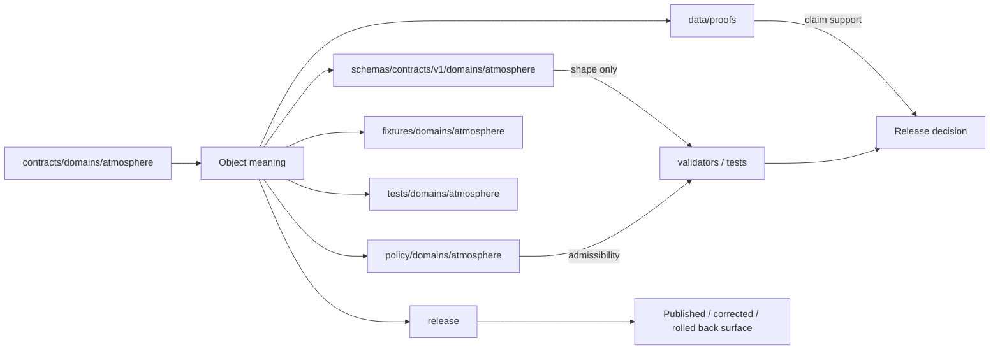
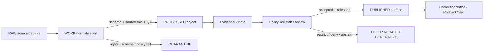

<!-- [KFM_META_BLOCK_V2]
doc_id: kfm://readme/contracts/domains/atmosphere
title: contracts/domains/atmosphere/README.md — Atmosphere Contract Lane README
type: readme
version: v0.2
status: draft
owners: OWNER_TBD — Atmosphere steward · Contract steward · Schema steward · Policy steward · Validation steward · Release steward · Docs steward
created: 2026-06-21
updated: 2026-06-21
policy_label: public; contracts; domains; atmosphere; semantic-contracts; readme
tags: [kfm, contracts, atmosphere, air, README, semantic-contracts, source-role, knowledge-character, evidence, policy, validation, release, lifecycle, governance]
related:
  - ../../../docs/domains/atmosphere/README.md
  - ../../../docs/domains/atmosphere/CANONICAL_PATHS.md
  - ../../../docs/domains/atmosphere/OBJECT_FAMILY_MAP.md
  - ../../../docs/domains/atmosphere/POLICY.md
  - ../../../docs/domains/atmosphere/PUBLICATION_POSTURE.md
  - ../../../docs/domains/atmosphere/MISSING_OR_PLANNED_FILES.md
  - ../../../docs/domains/atmosphere/VERIFICATION_BACKLOG.md
  - ../../../schemas/contracts/v1/domains/atmosphere/
  - ../../../policy/domains/atmosphere/
  - ../../../fixtures/domains/atmosphere/
  - ../../../tests/domains/atmosphere/
  - ../../../data/proofs/
  - ../../../release/
notes:
  - "Replaces a greenfield scaffold README with a contracts-lane landing page."
  - "This README orients maintainers to semantic contracts only; machine shapes remain in schemas/ and enforcement remains unverified unless tests/validators prove it."
  - "The Atmosphere lane uses contracts/domains/atmosphere/ as the semantic-contract home, matching current repo evidence and the canonical-path lane posture."
  - "Some object schemas remain PROPOSED scaffolds, some object contracts remain scaffolds, and schema filename casing/slug drift remains NEEDS VERIFICATION."
  - "Publication, correction, release, source activation, and public API/UI behavior are not proven by this README."
[/KFM_META_BLOCK_V2] -->

<a id="top"></a>

# Atmosphere Contract Lane

> Semantic-contract landing page for `contracts/domains/atmosphere/`: the Atmosphere/Air object-meaning layer for air quality, weather, smoke, AOD, climate context, model context, advisory context, and governed decision envelopes.

<p>
  
  
  
  
  
  
</p>

**Path:** `contracts/domains/atmosphere/`  
**Status:** `draft` / contracts-lane README  
**Owners:** `OWNER_TBD` — Atmosphere steward · Contract steward · Schema steward · Policy steward · Validation steward · Release steward · Docs steward  
**Primary job:** explain what the Atmosphere/Air semantic contracts mean, where they fit, and what they must never be used to bypass.

> [!IMPORTANT]
> Contract Markdown defines **object meaning**. It does not enforce machine shape, validate payloads, resolve rights, prove evidence, approve policy, publish layers, run APIs, or authorize public-health or life-safety guidance.

## Quick jumps

[Scope](#scope) · [Repo fit](#repo-fit) · [Accepted inputs](#accepted-inputs) · [Exclusions](#exclusions) · [Directory map](#directory-map) · [Object contracts](#object-contracts) · [Source-role guardrails](#source-role-guardrails) · [Lifecycle](#lifecycle) · [Validation](#validation) · [Release posture](#release-posture) · [Maintenance checklist](#maintenance-checklist) · [Evidence basis](#evidence-basis) · [Rollback](#rollback)

---

## Scope

This folder is the semantic-contract home for Atmosphere/Air objects. A file in this folder should answer:

- what the object means;
- what the object is **not**;
- which source-role / knowledge-character boundaries matter;
- which schemas, policy gates, evidence bundles, release records, correction records, and rollback records must remain separate;
- what validators and fixtures must eventually prove before implementation claims become safe.

This folder currently acts as a **contract meaning lane**, not a runtime implementation lane. It can be used by future schemas, validators, policy bundles, API DTOs, Evidence Drawer payloads, Focus Mode, and release manifests, but it must not be treated as proof that those systems are implemented.

---

## Repo fit

```text
contracts/
└── domains/
    └── atmosphere/
        ├── README.md                       # this file
        ├── AirStation.md                   # station / network site meaning
        ├── AirObservation.md               # general air-quality observation meaning
        ├── PM25Observation.md              # PM2.5-specific observation/report meaning
        ├── OzoneObservation.md             # ozone-specific observation/report meaning
        ├── SmokeContext.md                 # smoke context meaning
        ├── AODRaster.md                    # aerosol optical depth raster meaning
        ├── WeatherStation.md               # weather station / network site meaning
        ├── WeatherObservation.md           # general weather observation meaning
        ├── WindField.md                    # wind observed/model field meaning
        ├── PrecipitationObservation.md     # precipitation-specific weather meaning
        ├── TemperatureObservation.md       # temperature-specific weather meaning
        ├── ClimateNormal.md                # climate baseline meaning
        ├── ClimateAnomaly.md               # baseline-relative anomaly meaning
        ├── ForecastContext.md              # model / forecast context meaning
        ├── AdvisoryContext.md              # advisory referral context meaning
        └── AtmosphereAirDecisionEnvelope.md# resolver outcome envelope meaning
```

Neighboring responsibility roots:

| Responsibility root | Atmosphere lane | Role |
|---|---|---|
| `docs/` | `../../../docs/domains/atmosphere/` | Doctrine, placement, object-family map, policy posture, source families, publication posture, verification backlog. |
| `schemas/` | `../../../schemas/contracts/v1/domains/atmosphere/` | Machine-checkable shapes. Many observed schemas are still `PROPOSED` scaffolds. |
| `policy/` | `../../../policy/domains/atmosphere/` | Enforceable admissibility/release policy. Behavior remains `NEEDS VERIFICATION` until bundles/tests prove it. |
| `fixtures/` | `../../../fixtures/domains/atmosphere/` | Golden and negative fixtures for schema/policy validation after verification. |
| `tests/` | `../../../tests/domains/atmosphere/` | Proof of enforcement after validators and policy tests exist. |
| `data/proofs/` | `../../../data/proofs/` | EvidenceBundle/proof objects; contract Markdown is not evidence proof. |
| `release/` | `../../../release/` | Release manifests, correction notices, rollback cards, and publication decisions. |

> [!CAUTION]
> Do not create a parallel `contracts/air/`, `schemas/contracts/v1/air/`, or other second authority home from this README. The current lane uses `atmosphere/`; any alternate `air` segment or duplicate schema/contract authority requires ADR-backed resolution.

---

## Accepted inputs

This folder accepts Markdown semantic contracts for Atmosphere/Air object families when the file:

- defines object meaning and boundaries;
- references the paired schema path without pretending schema enforcement is complete;
- links to policy, evidence, release, correction, and rollback responsibilities;
- records source-role / knowledge-character anti-collapse rules;
- exposes validation gaps and definition-of-done items;
- avoids runtime, public API, tile, UI, or source-activation claims unless verified elsewhere.

Examples of acceptable contract content:

- `AirStation` as station/network context, not observation truth;
- `PM25Observation` as PM2.5-specific concentration/report context, not AQI-as-concentration;
- `AODRaster` as remote-sensing mask/proxy, not PM2.5;
- `ForecastContext` as atmospheric model field, not observed sensor value;
- `AdvisoryContext` as referral context, not life-safety instruction;
- `ClimateNormal` and `ClimateAnomaly` as baseline/anomaly context with aggregation and baseline disclosure requirements.

---

## Exclusions

| Do not put here | Correct home |
|---|---|
| JSON Schema or machine shape | `../../../schemas/contracts/v1/domains/atmosphere/`. |
| Rego/policy bundles | `../../../policy/domains/atmosphere/` and shared policy roots. |
| Fixtures and validation examples | `../../../fixtures/domains/atmosphere/`. |
| Tests and validator proof | `../../../tests/domains/atmosphere/` and validator tool roots after verification. |
| Raw, work, quarantine, processed, catalog, or published data | `../../../data/raw/atmosphere/`, `../../../data/work/atmosphere/`, `../../../data/quarantine/atmosphere/`, `../../../data/processed/atmosphere/`, catalog/published lanes after verification. |
| Source descriptors and source registry records | `../../../data/registry/sources/atmosphere/` or source-catalog roots after verification. |
| EvidenceBundle/proof records | `../../../data/proofs/`. |
| Release/correction/rollback decisions | `../../../release/`. |
| UI, map, tile, Focus Mode, Evidence Drawer, or API implementation | Governed app/API/UI/layer roots after verification. |
| Emergency/life-safety instructions | Official issuing authority and governed Hazards/emergency lanes; Atmosphere advisory context is referral-only. |

---

## Directory map

This README is a map for maintainers, not a claim that every target is complete.



The contract lane should make boundaries visible; it should not collapse them.

---

## Object contracts

The Atmosphere/Air object-family roster is 15 objects plus a resolver-envelope support contract.

| Object contract | Knowledge character / role | Current README posture |
|---|---|---|
| [`AirStation.md`](./AirStation.md) | `NETWORK_AND_SITE_CONTEXT` | Expanded semantic contract; station/network context, exact siting generalized before public release. |
| [`AirObservation.md`](./AirObservation.md) | `OBSERVED_SENSOR` | Expanded semantic contract; general air-quality observation, low-cost caveats when applicable. |
| [`PM25Observation.md`](./PM25Observation.md) | `OBSERVED_SENSOR` / `PUBLIC_AQI_REPORT` / role-dependent | Expanded semantic contract; PM2.5-specific, AQI is not concentration, low-cost caveats matter. |
| [`OzoneObservation.md`](./OzoneObservation.md) | `OBSERVED_SENSOR` / `PUBLIC_AQI_REPORT` / role-dependent | Expanded semantic contract; ozone-specific, AQI/report vs concentration preserved. |
| [`SmokeContext.md`](./SmokeContext.md) | `REMOTE_SENSING_MASK` / `ATMOSPHERIC_MODEL_FIELD` | Expanded semantic contract; source-dependent smoke context, not PM2.5 and not hazards/event/impact proof. |
| [`AODRaster.md`](./AODRaster.md) | `REMOTE_SENSING_MASK` | Expanded semantic contract; AOD is not PM2.5. |
| [`WeatherStation.md`](./WeatherStation.md) | `NETWORK_AND_SITE_CONTEXT` | Expanded semantic contract; weather station/network context, exact siting generalized before public release. |
| [`WeatherObservation.md`](./WeatherObservation.md) | `OBSERVED_SENSOR` / `METEOROLOGICAL_CONTEXT` | Expanded semantic contract; general meteorological observation, context-vs-primary role tagged. |
| [`WindField.md`](./WindField.md) | `OBSERVED_SENSOR` / `ATMOSPHERIC_MODEL_FIELD` | `NEEDS VERIFICATION` in this README unless expanded contract is inspected. |
| [`PrecipitationObservation.md`](./PrecipitationObservation.md) | `OBSERVED_SENSOR` / `METEOROLOGICAL_CONTEXT` | Expanded semantic contract; precipitation-specific, canonical units required. |
| [`TemperatureObservation.md`](./TemperatureObservation.md) | `OBSERVED_SENSOR` / `METEOROLOGICAL_CONTEXT` | Expanded semantic contract; temperature-specific, canonical units required. |
| [`ClimateNormal.md`](./ClimateNormal.md) | `CLIMATE_ANOMALY_CONTEXT` baseline | Expanded semantic contract; reference-period baseline, not observation. |
| [`ClimateAnomaly.md`](./ClimateAnomaly.md) | `CLIMATE_ANOMALY_CONTEXT` | Expanded semantic contract; must anchor to climate normal/baseline. |
| [`ForecastContext.md`](./ForecastContext.md) | `ATMOSPHERIC_MODEL_FIELD` | Expanded semantic contract; model field, not observation. |
| [`AdvisoryContext.md`](./AdvisoryContext.md) | `ALERT_AND_ADVISORY_CONTEXT` | Expanded semantic contract; referral-only, not life-safety instruction. |
| [`AtmosphereAirDecisionEnvelope.md`](./AtmosphereAirDecisionEnvelope.md) | finite resolver outcome envelope | Expanded semantic contract; answer/abstain/deny/error posture, not proof or route implementation. |

> [!NOTE]
> This table is a maintainer index. It must be re-checked after each contract expansion because file existence, schema status, naming/casing, and validator coverage can drift.

---

## Source-role guardrails

Atmosphere contracts use source roles / knowledge characters as anti-collapse controls.

| Guardrail | Contract impact |
|---|---|
| `AQI is not concentration` | `PM25Observation` and `OzoneObservation` must not present `PUBLIC_AQI_REPORT` as raw `OBSERVED_SENSOR` concentration. |
| `AOD is not PM2.5` | `AODRaster` and smoke/AOD comparisons must not become PM2.5 measurements. |
| `Model is not observation` | `ForecastContext`, model-role `WindField`, and model-role `SmokeContext` must not render as observations. |
| `Source role required` | Every Atmosphere/Air contract should require a knowledge-character/source-role posture before consequential use. |
| `Low-cost sensor caveats` | `LOW_COST_SENSOR` data requires correction, caveat, confidence, and limitation support before public release. |
| `Advisory is not life-safety` | `AdvisoryContext` must redirect to authoritative sources rather than issue instructions. |
| `Freshness gate` | Values past source cadence must restrict or abstain rather than silently publish as current. |
| `Rights unresolved` | Source products must hold/deny/quarantine until rights review resolves. |

---

## Lifecycle

Contracts participate in the KFM trust membrane by defining the semantic target of promotion; they are not themselves promotion.



> [!IMPORTANT]
> Publication is a governed state transition, not a file move. Contract Markdown may describe the transition; it does not execute it.

---

## Validation

Current validation posture for this README:

| Layer | Status | Required before stronger claims |
|---|---|---|
| Contract Markdown files | `PARTIAL / IN PROGRESS` | Expand remaining scaffolds and review boundary language. |
| JSON Schemas | `PROPOSED scaffolds observed for multiple objects` | Add fields, enums, examples, negative fixtures, and title/casing reconciliation. |
| Policy bundles | `NEEDS VERIFICATION` | Implement/verify source-role, AQI/concentration, AOD/PM2.5, model/observation, low-cost caveat, advisory/life-safety, freshness, rights rules. |
| Fixtures | `NEEDS VERIFICATION` | Add valid/invalid cases for each object family and anti-collapse rule. |
| Validators/tests | `NEEDS VERIFICATION` | Prove contracts and schemas are enforceable rather than descriptive. |
| Evidence/ref resolution | `NEEDS VERIFICATION` | Prove EvidenceRef resolves to EvidenceBundle before consequential claims. |
| Release/correction/rollback | `NEEDS VERIFICATION` | Prove public surfaces carry release record, correction path, and rollback target. |

Minimum validation checklist for this folder:

- [ ] Every object family has exactly one canonical semantic contract path.
- [ ] Every semantic contract points to exactly one accepted schema home, or the casing/slug conflict is logged.
- [ ] Every schema moves beyond empty scaffold before machine enforcement claims are made.
- [ ] Negative tests exist for every anti-collapse rule.
- [ ] Public release paths prove rights, sensitivity, policy, review, release, correction, and rollback support.
- [ ] No UI/API/Focus Mode surface treats contract Markdown as evidence proof.

---

## Release posture

Atmosphere products are mostly public-safe only after source role, rights, freshness, validation, policy, and release gates pass. Public surface requirements include:

| Product family | Required disclosure before public release |
|---|---|
| Observed sensor layers | Canonical units, monitor/station context, and observation/regulatory distinction. |
| Public AQI report layers | AQI label, not concentration; advisory disclaimer where applicable. |
| Regulatory archive layers | Issuing authority and archive vintage; not rendered as live observation. |
| Low-cost sensor layers | Correction, caveat, confidence, limitations, and calibration receipt. |
| Model-field layers | Model-run receipt and uncertainty; not rendered as observation. |
| Remote-sensing mask layers | Mask/proxy label and uncertainty; AOD is not PM2.5. |
| Climate/anomaly context | Aggregation receipt and baseline period. |
| Advisory layers | Referral only; redirect to official source; not life-safety instruction. |

Sensitive or rights-unclear outputs fail closed through generalization, redaction, quarantine, denial, abstention, or steward review.

---

## Maintenance checklist

Use this checklist when adding or revising any file in this folder:

- [ ] Confirm `contracts/domains/atmosphere/<Object>.md` is the correct semantic-contract home.
- [ ] Confirm the paired schema path and casing.
- [ ] Confirm the object-family name and knowledge-character mapping.
- [ ] Preserve `RAW -> WORK / QUARANTINE -> PROCESSED -> CATALOG / TRIPLET -> PUBLISHED` lifecycle language where material.
- [ ] Add or update `accepted uses`, `exclusions`, `recommended fields`, `invariants`, `validation`, `evidence basis`, and `rollback` where the file is implementation-significant.
- [ ] Keep policy, schema, fixture, test, release, proof, and data responsibilities in their own roots.
- [ ] Do not claim validator, API, UI, source activation, release, or runtime behavior without direct evidence.
- [ ] Update adjacent docs or add a follow-up note when a contract changes public meaning, source role, object boundary, or release posture.

---

## Evidence basis

| Source | Status | Supports | Limits |
|---|---|---|---|
| Prior `contracts/domains/atmosphere/README.md` | `CONFIRMED scaffold` | Existing path and prior greenfield-scaffold status. | Did not provide object-level contract navigation or evidence posture. |
| `docs/domains/atmosphere/CANONICAL_PATHS.md` | `CONFIRMED repo evidence` | Places `contracts/domains/atmosphere/` as the object-meaning lane and distinguishes contracts from schemas/policy. | Some lane paths in the doc were authored as proposed pending repo inspection; current README narrows claims to inspected evidence where possible. |
| `docs/domains/atmosphere/README.md` | `CONFIRMED repo evidence` | Defines Atmosphere domain scope, boundary, and non-emergency posture. | It is a docs-lane README, not the contract-lane README. |
| `docs/domains/atmosphere/OBJECT_FAMILY_MAP.md` | `CONFIRMED repo evidence` | Provides 15 object families and source-role / knowledge-character anti-collapse vocabulary. | Per-object bindings are marked inferred pending ADR in that doc. |
| `docs/domains/atmosphere/POLICY.md` | `CONFIRMED doctrine / NEEDS VERIFICATION enforcement` | Provides policy spine: AQI/concentration, AOD/PM2.5, model/observation, source-role, low-cost caveat, advisory/life-safety, freshness, rights. | Rego bundle/test enforcement remains unverified here. |
| `docs/domains/atmosphere/PUBLICATION_POSTURE.md` | `CONFIRMED repo evidence` | Provides public-viewing disclosure requirements and rights/sensitivity posture. | Does not prove release implementation. |
| Recently expanded object contracts | `CONFIRMED in current repo history for inspected files` | Several files in this folder have been expanded from scaffolds into semantic contracts. | This README does not prove that every object contract is expanded, reviewed, or schema-enforced. |
| Uploaded authoring prompt v2 | `CONFIRMED user-supplied guidance` | Requires evidence-grounded, visually polished, implementation-honest Markdown with verification and rollback posture. | Authoring guidance, not implementation proof. |

---

## Rollback

Rollback is required if this README is used to claim schema completeness, validator coverage, policy enforcement, source-rights clearance, release execution, API/UI behavior, runtime behavior, or publication maturity not verified by current repo evidence.

Rollback target: prior scaffold blob SHA `44f6629797ae3bea622673897f593681694f97c8`.

---

## Definition of done

- [ ] Owners are confirmed and `OWNER_TBD` is replaced.
- [ ] Remaining scaffold contracts are expanded or clearly marked as scaffolds.
- [ ] Schema casing/slug drift is resolved by ADR or recorded in a drift register.
- [ ] Every object contract has a paired schema with non-empty fields and negative examples.
- [ ] Policy bundles and tests prove anti-collapse rules.
- [ ] Fixtures cover valid, invalid, stale, rights-unclear, source-role-missing, caveat-missing, release-candidate, public-safe derivative, correction, and rollback states.
- [ ] Release/correction/rollback records are proven for public surfaces.
- [ ] API/UI/Focus Mode surfaces prove they consume governed interfaces and released artifacts, not raw/internal stores or generated language as truth.

<p align="right"><a href="#top">Back to top</a></p>
