<!-- [KFM_META_BLOCK_V2]
doc_id: kfm://contract/domains/atmosphere/smoke-context
title: contracts/domains/atmosphere/SmokeContext.md — SmokeContext Contract
type: contract
version: v0.2
status: draft
owners: OWNER_TBD — Atmosphere steward · Smoke/remote-sensing steward · Forecast/model steward · Hazards liaison · Contract steward · Evidence steward · Schema steward · Policy steward · Validation steward · Release steward · Docs steward
created: 2026-06-21
updated: 2026-06-21
policy_label: public; contracts; domains; atmosphere; smoke-context; semantic-contract; remote-sensing-mask; atmospheric-model-field; sensitive-cross-lane
tags: [kfm, contracts, atmosphere, air, SmokeContext, smoke, remote-sensing-mask, atmospheric-model-field, HMS, HRRR-Smoke, AOD, PM2.5, hazards, evidence, policy, validation, release, lifecycle, governance]
related:
  - ../../../docs/domains/atmosphere/README.md
  - ../../../docs/domains/atmosphere/CANONICAL_PATHS.md
  - ../../../docs/domains/atmosphere/OBJECT_FAMILY_MAP.md
  - ../../../docs/domains/atmosphere/POLICY.md
  - ../../../docs/domains/atmosphere/PUBLICATION_POSTURE.md
  - ../../../docs/domains/atmosphere/SENSITIVITY.md
  - ../../../docs/domains/atmosphere/SOURCE_FAMILIES.md
  - ../../../docs/domains/atmosphere/SOURCES.md
  - ../../../docs/domains/atmosphere/PIPELINE.md
  - ../../../docs/domains/atmosphere/API_CONTRACTS.md
  - ./AODRaster.md
  - ./ForecastContext.md
  - ./PM25Observation.md
  - ./AirObservation.md
  - ./WindField.md
  - ./AdvisoryContext.md
  - ./AtmosphereAirDecisionEnvelope.md
  - ../../../schemas/contracts/v1/domains/atmosphere/SmokeContext.schema.json
  - ../../../policy/domains/atmosphere/
  - ../../../data/proofs/
  - ../../../release/
notes:
  - "Expanded from a planned-file scaffold into the object-level SmokeContext semantic contract."
  - "The paired schema is currently a PROPOSED scaffold with empty properties and additionalProperties enabled."
  - "docs/domains/atmosphere/OBJECT_FAMILY_MAP.md maps SmokeContext to REMOTE_SENSING_MASK / ATMOSPHERIC_MODEL_FIELD depending on source role."
  - "The object-family purpose row says SmokeContext may represent HMS-style analysis as REMOTE_SENSING_MASK or HRRR-Smoke-style forecast as ATMOSPHERIC_MODEL_FIELD."
  - "Atmosphere policy doctrine denies AOD/remote-sensing mask as PM2.5, model-as-observation collapse, source-role-missing objects, and sensitive smoke/fire joins."
  - "Hazards owns its own smoke/fire event and impact truth; this Atmosphere contract provides context only."
  - "This contract defines smoke-context meaning; it does not authorize PM2.5 measurement claims, hazard/event/impact truth claims, life-safety guidance, policy approval, evidence proof, public release, or release approval."
[/KFM_META_BLOCK_V2] -->

<a id="top"></a>

# SmokeContext Contract

> Semantic contract for `SmokeContext`, the Atmosphere/Air-domain object representing governed smoke context from source-dependent remote-sensing analysis, modeled smoke forecast, plume/mask context, or smoke-related atmospheric support. It preserves the boundary between smoke context, AOD masks, PM2.5 observations, model fields, advisory context, hazards/event truth, evidence proof, and release approval.

<p>
  
  
  
  
  
  
  
</p>

`contracts/domains/atmosphere/SmokeContext.md`

## Quick jumps

[Status](#status) · [Meaning](#meaning) · [Repo fit](#repo-fit) · [Smoke boundary](#smoke-boundary) · [Schema posture](#schema-posture) · [Accepted uses](#accepted-uses) · [Exclusions](#exclusions) · [Recommended fields](#recommended-fields) · [Invariants](#invariants) · [Lifecycle](#lifecycle) · [Validation](#validation) · [Evidence basis](#evidence-basis) · [Rollback](#rollback) · [Definition of done](#definition-of-done)

---

## Status

> [!IMPORTANT]
> **Status:** `draft` / semantic contract  
> **Owner:** `OWNER_TBD`  
> **Contract path:** `contracts/domains/atmosphere/SmokeContext.md`  
> **Schema path:** `schemas/contracts/v1/domains/atmosphere/SmokeContext.schema.json`  
> **Truth posture:** `CONFIRMED` target path, current update, paired scaffold schema, canonical-path lane, object-family map entry, smoke purpose row, atmosphere policy anti-collapse/sensitivity rows, publication-posture disclosure requirements, and uploaded authoring guidance. Validator behavior, fixtures, enforceable policy bundles, source registry behavior, EvidenceBundle implementation, release workflow, API behavior, UI behavior, smoke pipeline behavior, Hazards cross-lane implementation, and runtime behavior remain `NEEDS VERIFICATION`.

> [!CAUTION]
> This contract defines object meaning only. It does **not** authorize publication, AOD-as-PM2.5 collapse, smoke-as-PM2.5 measurement claims, model-as-observation collapse, fire/hazard event truth, impact claims, life-safety guidance, advisory issuance, policy approval, proof closure, or release of controlled Atmosphere/Air smoke products.

---

## Meaning

`SmokeContext` is the Atmosphere/Air-domain object for governed smoke-related atmospheric context. Its knowledge character is source-dependent:

- `REMOTE_SENSING_MASK` when the source is an analysis/mask/proxy product, such as HMS-style smoke analysis or satellite-derived smoke/plume context;
- `ATMOSPHERIC_MODEL_FIELD` when the source is a forecast/model product, such as HRRR-Smoke-style modeled smoke context.

A smoke context may support:

- smoke mask/plume/analysis context for map layers, Evidence Drawer, Focus Mode, or source-role-aware summaries;
- modeled smoke forecast context when model-run and uncertainty posture are preserved;
- comparison with `AODRaster`, `PM25Observation`, `AirObservation`, `WindField`, `ForecastContext`, or `AdvisoryContext` without collapsing their meanings;
- evidence packaging for source role, source time, analysis/forecast time, retrieval time, geometry/raster asset, uncertainty, sensitivity, correction, and release posture;
- public-safe display when source role, rights, freshness, uncertainty, sensitivity, validation, policy, and release gates allow.

It is not:

- a PM2.5 measurement;
- an AQI report;
- an observed sensor reading by default;
- an AOD raster by itself;
- a model field unless the source role is explicitly `ATMOSPHERIC_MODEL_FIELD`;
- a hazards/fire event record;
- an exposure, health, damage, evacuation, infrastructure, crop-loss, or impact claim;
- an advisory or life-safety instruction;
- proof that smoke occurred at a person, asset, habitat, infrastructure, or event location;
- an EvidenceBundle;
- a PolicyDecision;
- a ReleaseManifest;
- permission to disclose stale, rights-unclear, source-role-unclear, sensitive-join, habitat/infrastructure-proximate, or unsupported health/action claims.

---

## Repo fit

```text
contracts/
└── domains/
    └── atmosphere/
        ├── SmokeContext.md
        ├── AODRaster.md
        ├── ForecastContext.md
        └── PM25Observation.md
```

Adjacent roots and object families:

| Root or object | Relationship |
|---|---|
| `../../../docs/domains/atmosphere/CANONICAL_PATHS.md` | Confirms the responsibility-root lane pattern for Atmosphere contracts and schemas. |
| `../../../docs/domains/atmosphere/OBJECT_FAMILY_MAP.md` | Lists `SmokeContext` as an owned remote-sensing/smoke object with source-dependent `REMOTE_SENSING_MASK` / `ATMOSPHERIC_MODEL_FIELD` character. |
| `../../../docs/domains/atmosphere/POLICY.md` | Defines source-role requirement, AOD/PM2.5 denial, model/observation denial, freshness gates, unresolved-rights holds, and smoke/fire sensitive-join posture. |
| `../../../docs/domains/atmosphere/PUBLICATION_POSTURE.md` | Requires remote-sensing masks to carry mask/proxy labels and model fields to carry model-run receipt and uncertainty before public release. |
| `./AODRaster.md` | Remote-sensing mask/proxy object; smoke context may relate to AOD but must not become PM2.5. |
| `./ForecastContext.md` | Forecast/model context object; smoke forecasts must carry model-field posture and uncertainty. |
| `./PM25Observation.md` | PM2.5-specific observation/report object; smoke context must not impersonate it. |
| `./AirObservation.md` | General air-quality observation family; smoke context may contextualize but not replace observations. |
| `./WindField.md` | Wind observed/model field that may contextualize smoke transport while preserving source role. |
| `./AdvisoryContext.md` | Advisory referral object; smoke context does not create life-safety instructions. |
| `./AtmosphereAirDecisionEnvelope.md` | Governed response envelope that may explain answer/abstain/deny/error posture for smoke-context questions. |
| `../../../schemas/contracts/v1/domains/atmosphere/SmokeContext.schema.json` | Current scaffold schema. |
| `../../../policy/domains/atmosphere/` | Proposed enforceable policy bundle home; behavior not verified here. |
| `../../../data/proofs/` | EvidenceBundle/proof support. |
| `../../../release/` | Release, correction, supersession, and rollback authority. |

---

## Smoke boundary

`SmokeContext` must preserve the difference between remote-sensing mask, modeled smoke forecast, PM2.5 observation, AOD proxy, advisory context, hazards/fire event truth, evidence proof, and public release.

| Boundary | Rule |
|---|---|
| SmokeContext vs. PM25Observation | Smoke context is not PM2.5. PM2.5 measurements require the PM2.5 object, source role, units, QA, and evidence. |
| SmokeContext vs. AODRaster | AOD is a remote-sensing mask/proxy and may support smoke context, but neither AOD nor smoke mask becomes PM2.5. |
| SmokeContext vs. ForecastContext | HRRR-Smoke-style products are model fields and must carry model-run receipt and uncertainty; they are not observations. |
| SmokeContext vs. observed sensor | Smoke context may explain or compare to observations; it does not become observed sensor data by default. |
| SmokeContext vs. AdvisoryContext | Smoke context may support advisory referral; it does not issue life-safety instructions. |
| SmokeContext vs. Hazards lane | Atmosphere owns smoke atmospheric context; Hazards owns event/impact truth, emergency posture, and hazards-specific claims. |
| SmokeContext vs. sensitive joins | Smoke/fire/AOD joins near sensitive habitat or infrastructure fail closed unless policy/review/release support public exposure. |
| SmokeContext vs. public release | Public display requires source rights, source role, freshness, uncertainty, sensitivity, validation, policy, release record, correction path, and rollback target. |

---

## Schema posture

The paired schema found for this contract is:

```text
schemas/contracts/v1/domains/atmosphere/SmokeContext.schema.json
```

Current schema evidence:

| Schema fact | Status |
|---|---|
| Schema file exists | `CONFIRMED` |
| Schema title is `Smokecontext` | `CONFIRMED` |
| Schema status is `PROPOSED` | `CONFIRMED` |
| Schema properties are empty | `CONFIRMED` |
| `additionalProperties` is `true` | `CONFIRMED` |
| Schema `source_doc` points to `docs/domains/atmosphere/CANONICAL_PATHS.md` | `CONFIRMED` |
| Schema `contract_doc` points to this contract | `CONFIRMED` |
| Title casing aligned with object name `SmokeContext` | `NEEDS VERIFICATION` |
| Validator implementation | `UNKNOWN / NOT FOUND IN THIS TASK` |

This contract therefore defines semantic expectations for future schema, fixture, policy, and validator work. It does not claim that machine validation currently enforces those expectations.

---

## Accepted uses

| Use | Allowed? | Rule |
|---|---:|---|
| Defining the meaning of a smoke-context object | Yes | Must preserve source role, geometry/raster/field scope, uncertainty, evidence, sensitivity, policy, freshness, and release posture. |
| Using HMS-style smoke analysis | Conditional | Treat as `REMOTE_SENSING_MASK`; must not become PM2.5 or observed sensor data. |
| Using HRRR-Smoke-style forecast/model output | Conditional | Treat as `ATMOSPHERIC_MODEL_FIELD`; must carry model-run receipt and uncertainty. |
| Comparing smoke context with PM2.5 observations | Conditional | Must preserve PM2.5 object semantics and avoid smoke/AOD-as-PM2.5 collapse. |
| Linking smoke context to AODRaster | Conditional | Must preserve mask/proxy labels and uncertainty. |
| Linking smoke context to advisory context | Conditional | Advisory output remains referral-only and must not become KFM life-safety instruction. |
| Supporting evidence-packaged smoke-context claims | Conditional | Requires EvidenceRef/EvidenceBundle support and clear claim scope. |
| Supporting public-safe display | Conditional | Requires source rights, freshness, sensitivity, validation, policy, release record, correction path, and rollback target. |
| Treating smoke context as PM2.5 | No | PM2.5 requires PM25Observation semantics and evidence. |
| Treating smoke forecast as observation | No | Model/proxy families remain distinct. |
| Treating smoke context as hazard/impact proof | No | Hazards/event/impact claims require separate domain governance and evidence. |
| Treating SmokeContext as health/safety instruction | No | Advisory and health/safety outputs require authoritative source referral and separate policy. |
| Using schema validity as proof of truth | No | Schema shape is not evidence proof. |
| Treating this contract as release approval | No | Release authority remains separate. |

---

## Exclusions

| Does not belong in this contract | Correct home |
|---|---|
| Machine field shape | `../../../schemas/contracts/v1/domains/atmosphere/SmokeContext.schema.json`. |
| Validator implementation | `../../../tools/validators/...`. |
| Fixtures and tests | `../../../fixtures/domains/atmosphere/`, `../../../tests/domains/atmosphere/`, or policy test homes after verification. |
| Raw HMS, HRRR-Smoke, satellite, raster, plume, hotspot, gridded, source download, QA payload, or processing workspace files | `../../../data/raw/atmosphere/`, `../../../data/work/atmosphere/`, or `../../../data/quarantine/atmosphere/`, subject to lifecycle, rights, freshness, sensitivity, and validation rules. |
| PM2.5 observation/measurement semantics | `./PM25Observation.md` and paired schema. |
| AOD raster semantics | `./AODRaster.md` and paired schema. |
| Forecast/model context semantics | `./ForecastContext.md`, `./WindField.md`, and paired schemas where relevant. |
| Advisory/referral semantics | `./AdvisoryContext.md` and paired schema. |
| Fire, smoke-hazard, emergency, exposure, damage, infrastructure, crop-loss, evacuation, or event/impact truth claims | Governed Hazards/event/impact domain contracts and release controls after verification. |
| EvidenceBundle/proof content | `../../../data/proofs/`. |
| Source registry records | `../../../data/registry/sources/atmosphere/`. |
| Sensitivity, rights, admissibility, or release policy | `../../../policy/domains/atmosphere/` and `../../../policy/sensitivity/` after verification. |
| Release manifests, correction notices, rollback cards | `../../../release/`. |
| Public layer, UI, API, renderer, Focus Mode, notification, tile-service, or map implementation | Governed app/API/UI/layer roots. |

---

## Recommended fields

The current schema does not require these fields. They are `PROPOSED` semantic requirements for future schema/validator work:

| Field | Meaning |
|---|---|
| `smoke_context_id` | Stable deterministic or steward-assigned smoke-context identity. |
| `source_id` | Source descriptor or source family reference. |
| `source_role` | Required role/knowledge character: `REMOTE_SENSING_MASK`, `ATMOSPHERIC_MODEL_FIELD`, or another reviewed role. |
| `source_product_type` | HMS analysis, HRRR-Smoke forecast, satellite plume/mask, model field, derived context, or other reviewed product type. |
| `smoke_context_type` | Plume, mask, density class, vertical column/smoke layer, near-surface smoke, forecast field, narrative context, or source-coded type. |
| `geometry_or_field_ref` | Controlled reference to polygon, raster, grid, tile, COG, PMTiles, array, or other derived asset. |
| `model_run_ref` | ModelRunReceipt or source model-run reference when role is `ATMOSPHERIC_MODEL_FIELD`. |
| `analysis_time` | Analysis time for mask/plume products where applicable. |
| `run_time` | Model initialization/run time where applicable. |
| `valid_time` | Valid/effective smoke-context time or interval. |
| `forecast_horizon` | Lead time where role is model/forecast. |
| `source_temporal_scope` | Source, retrieval, processing, release, and correction time fields where material. |
| `spatial_scope_ref` | Region, grid, tile, county, basin, plume geometry, or other governed spatial scope. |
| `uncertainty_refs` | Source uncertainty, model spread, quality field, confidence layer, or caveat reference. |
| `uncertainty_statement` | Bounded uncertainty, confidence, caveat, or limitation statement. |
| `freshness_state` | Fresh, stale, expired, historical, superseded, corrected, or unknown. |
| `sensitive_join_state` | Clear, restricted, redacted, generalized, quarantined, denied, or needs review for habitat/infrastructure/fire joins. |
| `rights_refs` | Rights, license, terms, or use-permission references. |
| `source_refs` | SourceDescriptor/source record references. |
| `source_roles` | Source roles supporting, contextualizing, or contesting the smoke context. |
| `evidence_refs` | EvidenceRef/EvidenceBundle references. |
| `related_aod_refs` | AODRaster references where smoke/AOD comparison is governed. |
| `related_pm25_refs` | PM25Observation references where comparison is governed. |
| `related_air_observation_refs` | AirObservation references where comparison is governed. |
| `model_context_refs` | ForecastContext or WindField references where comparison is governed. |
| `related_advisory_refs` | AdvisoryContext references where smoke context is linked to advisory referral. |
| `hazards_refs` | Hazards-lane event/impact references when cross-lane linkage is separately governed. |
| `confidence_statement` | Bounded confidence, uncertainty, quality, or limitation statement. |
| `contradiction_refs` | Observations, source products, model runs, masks, corrections, or claims that contest this smoke context. |
| `policy_state` | Policy posture or policy-decision reference. |
| `sensitivity_class` | Sensitivity/public-safety classification. |
| `review_refs` | Steward, source, policy, scientific, Hazards liaison, or release review references. |
| `transform_refs` | SensitivityTransform, RedactionReceipt, PublicationTransformReceipt, or other public-safe derivative references. |
| `lineage_refs` | Prior, successor, source update, model-run update, reprocessing, correction, supersession, or rollback records. |
| `release_refs` | Release/candidate linkage where applicable. |
| `correction_refs` | Correction/supersession/rollback lineage. |
| `spec_hash` | Integrity pin for the representation. |

---

## Invariants

`SmokeContext` must preserve these invariants:

- SmokeContext records are atmospheric context, not PM2.5 measurements;
- source role / knowledge character must remain explicit;
- smoke analysis/mask products must not be presented as PM2.5 observations;
- smoke forecast/model products must not be presented as observed sensor readings;
- AOD/smoke masks must not be collapsed into PM2.5;
- SmokeContext records are not hazards/event/impact truth claims by themselves;
- SmokeContext records are not advisory or life-safety instruction by themselves;
- SmokeContext records are not evidence proof by themselves;
- raw source/plume/raster/model payloads and contract-level summaries must remain separated;
- rights, freshness, QA, source role, analysis/model time, valid time, uncertainty, sensitivity, review posture, and lifecycle state must remain inspectable;
- stale, rights-unclear, QA-failed, role-ambiguous, uncertainty-missing, sensitive-join, or evidence-missing products fail closed or restrict public release;
- contradiction, rejection, supersession, source update, model-run update, reprocessing, and correction lineage must remain traceable;
- schema validity is not evidence proof;
- public-facing use must be downstream of governed release artifacts and public-safe transforms;
- publication is a governed state transition, not a file move.

---

## Lifecycle

```mermaid
flowchart LR
  SRC[Smoke analysis / satellite / model source payload] --> RAW[RAW atmosphere source capture]
  RAW -->|rights + source role + checksum| WORK[WORK normalization]
  WORK -->|schema + source role + uncertainty + sensitivity gates| PROC[PROCESSED SmokeContext]
  PROC --> EVID[EvidenceBundle / smoke-context claim support]
  EVID --> REVIEW[Steward / scientific / policy / hazards-liaison review]
  REVIEW -->|stale / unclear rights / sensitive join / role collapse| HOLD[QUARANTINE / HOLD]
  REVIEW -->|accepted internal| INTERNAL[Internal SmokeContext record]
  INTERNAL --> POLICY[Policy + sensitivity + freshness screen]
  POLICY -->|public-safe transform| RELEASE[Release / correction / rollback records]
```



The contract defines the meaning of a smoke-context object. It does not replace source intake, source-role assignment, rights review, mask/proxy labeling, model-run receipt generation, uncertainty modeling, sensitive cross-lane review, EvidenceBundle resolution, schema validation, policy enforcement, transform receipts, release approval, correction, or rollback systems.

---

## Validation

Before relying on this contract, verify:

- schema fields beyond scaffold status;
- validator implementation and fixture coverage;
- canonical SmokeContext ID and deterministic identity rules;
- title/case consistency between `SmokeContext`, schema title `Smokecontext`, and any API/object registry;
- source role / knowledge-character enforcement;
- smoke-as-PM2.5 negative tests;
- AOD-as-PM2.5 negative tests;
- model-as-observation negative tests where smoke interacts with ForecastContext/WindField model families;
- sensitive smoke/fire cross-lane negative tests;
- Hazards-lane ownership and linking behavior for event/impact claims;
- rights gate behavior for source products;
- freshness gate behavior for source products;
- uncertainty, mask/proxy label, model-run receipt, valid-time, missing-value, reprocessing, and correction handling;
- source, analysis, run, valid, retrieval, release, and correction time separation;
- boundary between SmokeContext, AODRaster, PM25Observation, AirObservation, ForecastContext, WindField, AdvisoryContext, and Hazards-lane event/impact objects;
- transform, release, correction, supersession, withdrawal, and rollback linkage;
- no downstream surface treats this contract as PM2.5, observed sensor value, forecast proof, hazard/impact proof, health/safety instruction, or release approval.

---

## Evidence basis

| Source | Status | Supports | Limits |
|---|---|---|---|
| Prior `SmokeContext.md` scaffold | `CONFIRMED` | Target file existed as a planned-file scaffold and cited `docs/domains/atmosphere/CANONICAL_PATHS.md`. | Scaffold did not define authoritative semantics. |
| `SmokeContext.schema.json` | `CONFIRMED scaffold` | Schema exists, is `PROPOSED`, has empty properties, allows additional properties, and points to this contract. | Does not enforce full SmokeContext semantics. |
| `docs/domains/atmosphere/OBJECT_FAMILY_MAP.md` | `CONFIRMED repo evidence` | Lists `SmokeContext` as owned by Atmosphere/Air with source-dependent `REMOTE_SENSING_MASK` / `ATMOSPHERIC_MODEL_FIELD` character. | Per-object binding is noted as inferred pending ADR in the map itself. |
| `docs/domains/atmosphere/OBJECT_FAMILY_MAP.md` purpose row | `CONFIRMED repo evidence` | States SmokeContext may be HMS analysis (`REMOTE_SENSING_MASK`) or HRRR-Smoke forecast (`ATMOSPHERIC_MODEL_FIELD`), source role is required, and Hazards owns event/impact. | Does not prove schema/validator enforcement. |
| `docs/domains/atmosphere/POLICY.md` | `CONFIRMED repo evidence` | States AOD is not PM2.5, model is not observation, source role is required, freshness gates apply, smoke/fire sensitive joins fail closed, and unresolved rights hold/deny release. | Enforceable bundle/test behavior remains unverified in this task. |
| `docs/domains/atmosphere/PUBLICATION_POSTURE.md` | `CONFIRMED repo evidence` | Requires model-field layers to carry model-run receipt/uncertainty, remote-sensing masks to be labeled as masks/proxies, and smoke/fire/AOD sensitive joins to fail closed. | Does not prove release implementation. |
| Uploaded authoring prompt v2 | `CONFIRMED user-supplied guidance` | Requires evidence-grounded, visually polished, implementation-honest Markdown with verification and rollback posture. | Authoring guidance, not implementation proof. |

---

## Rollback

Rollback is required if this contract is used to claim schema completeness, validator coverage, source-rights clearance, source-role enforcement, AOD/PM2.5 enforcement, smoke/PM2.5 enforcement, model/observation enforcement, sensitive-join enforcement, Hazards cross-lane implementation, policy enforcement, freshness enforcement, release execution, API/UI behavior, smoke pipeline behavior, EvidenceBundle proof, hazard/impact proof, public health guidance, public disclosure permission, or implementation maturity not verified in this task.

Rollback target: prior scaffold blob SHA `aef53811a0c991f58b3496a5f81151f2e1870f13`.

---

## Definition of done

- [ ] Owners are confirmed and `OWNER_TBD` is replaced.
- [ ] SmokeContext vocabulary is reviewed by the Atmosphere steward, smoke/remote-sensing steward, forecast/model steward, Hazards liaison, evidence steward, policy steward, and release steward.
- [ ] Boundary between `SmokeContext`, `AODRaster`, `PM25Observation`, `AirObservation`, `ForecastContext`, `WindField`, `AdvisoryContext`, and Hazards-lane smoke/fire event/impact objects is accepted.
- [ ] Paired JSON Schema is expanded from scaffold status.
- [ ] Schema title/casing is reconciled with `SmokeContext` object-family name.
- [ ] Valid and invalid fixtures cover remote-sensing-mask, atmospheric-model-field, HMS-style analysis, HRRR-Smoke-style forecast, fresh, stale, rights-unclear, role-missing, uncertainty-missing, sensitive-join, AOD/PM2.5 collapse, smoke/PM2.5 collapse, model/observation collapse, corrected, superseded, quarantined, release-candidate, public-safe derivative, and rollback states.
- [ ] Validator enforces source role, knowledge character, time fields, model-run receipt where needed, uncertainty refs, mask/proxy labels, rights refs, evidence refs, policy state, release refs, correction refs, and rollback refs.
- [ ] Negative tests deny SmokeContext as PM2.5, observed sensor value, AOD-derived PM2.5, model-as-observation, hazard/impact proof, advisory instruction, or proof by itself.
- [ ] EvidenceBundle, PolicyDecision, ReviewRecord, PublicationTransformReceipt, RedactionReceipt, ReleaseManifest, CorrectionNotice, and RollbackCard references are validated where required.
- [ ] API/UI surfaces prove they cannot treat SmokeContext as PM2.5, observed sensor value, hazard/impact proof, health guidance, unsupported event claim, or release approval.
- [ ] Release and rollback dry-runs prove this contract cannot bypass publication gates.

## Status summary

`SmokeContext` is an Atmosphere/Air source-dependent smoke-context object. It can support smoke masks, smoke analysis, modeled smoke forecast context, AOD/PM2.5 comparison, evidence packaging, correction, and public-safe display when rights, source role, uncertainty, evidence, validation, sensitivity, policy, transform, and release allow, but it is not PM2.5, not AQI, not an observation by default, not hazards/event/impact proof, not health/safety guidance, not evidence proof, and not release approval.

<p align="right"><a href="#top">Back to top</a></p>
