<!-- [KFM_META_BLOCK_V2]
doc_id: kfm://contract/domains/atmosphere/weather-station
title: contracts/domains/atmosphere/WeatherStation.md — WeatherStation Contract
type: contract
version: v0.2
status: draft
owners: OWNER_TBD — Atmosphere steward · Weather steward · Station/network steward · Contract steward · Evidence steward · Schema steward · Policy steward · Validation steward · Release steward · Docs steward
created: 2026-06-21
updated: 2026-06-21
policy_label: public; contracts; domains; atmosphere; weather-station; semantic-contract; network-and-site-context; weather
tags: [kfm, contracts, atmosphere, air, WeatherStation, weather, station, network, site, network-and-site-context, siting, evidence, policy, validation, release, lifecycle, governance]
related:
  - ../../../docs/domains/atmosphere/README.md
  - ../../../docs/domains/atmosphere/CANONICAL_PATHS.md
  - ../../../docs/domains/atmosphere/OBJECT_FAMILY_MAP.md
  - ../../../docs/domains/atmosphere/POLICY.md
  - ../../../docs/domains/atmosphere/PUBLICATION_POSTURE.md
  - ../../../docs/domains/atmosphere/SENSITIVITY.md
  - ../../../docs/domains/atmosphere/SOURCE_FAMILIES.md
  - ../../../docs/domains/atmosphere/SOURCES.md
  - ../../../docs/domains/atmosphere/PIPELINE.md
  - ../../../docs/domains/atmosphere/API_CONTRACTS.md
  - ./WeatherObservation.md
  - ./TemperatureObservation.md
  - ./PrecipitationObservation.md
  - ./WindField.md
  - ./ForecastContext.md
  - ./ClimateNormal.md
  - ./ClimateAnomaly.md
  - ./AdvisoryContext.md
  - ./AtmosphereAirDecisionEnvelope.md
  - ../../../schemas/contracts/v1/domains/atmosphere/WeatherStation.schema.json
  - ../../../policy/domains/atmosphere/
  - ../../../data/proofs/
  - ../../../release/
notes:
  - "Expanded from a planned-file scaffold into the object-level WeatherStation semantic contract."
  - "The paired schema is currently a PROPOSED scaffold with empty properties and additionalProperties enabled."
  - "docs/domains/atmosphere/OBJECT_FAMILY_MAP.md maps Weather Station to NETWORK_AND_SITE_CONTEXT."
  - "The object-family purpose row says Weather Station is a meteorological station/network site and carries the same exact-siting caveat as AirStation."
  - "Atmosphere policy doctrine requires exact station siting for Weather Station to be generalized before public release."
  - "This contract defines weather-station meaning; it does not authorize observation truth, exact public coordinates, station ownership/access disclosure, policy approval, evidence proof, public release, or life-safety guidance."
[/KFM_META_BLOCK_V2] -->

<a id="top"></a>

# WeatherStation Contract

> Semantic contract for `WeatherStation`, the Atmosphere/Air-domain object representing a governed meteorological station, weather network site, station-location context, or comparable weather-observation site record. It preserves station/network/site meaning without turning station metadata into weather observations, exact public coordinates, sensor quality proof, evidence proof, public layer release, or release approval by itself.

<p>
  
  
  
  
  
  
  
</p>

`contracts/domains/atmosphere/WeatherStation.md`

## Quick jumps

[Status](#status) · [Meaning](#meaning) · [Repo fit](#repo-fit) · [Station boundary](#station-boundary) · [Schema posture](#schema-posture) · [Accepted uses](#accepted-uses) · [Exclusions](#exclusions) · [Recommended fields](#recommended-fields) · [Invariants](#invariants) · [Lifecycle](#lifecycle) · [Validation](#validation) · [Evidence basis](#evidence-basis) · [Rollback](#rollback) · [Definition of done](#definition-of-done)

---

## Status

> [!IMPORTANT]
> **Status:** `draft` / semantic contract  
> **Owner:** `OWNER_TBD`  
> **Contract path:** `contracts/domains/atmosphere/WeatherStation.md`  
> **Schema path:** `schemas/contracts/v1/domains/atmosphere/WeatherStation.schema.json`  
> **Truth posture:** `CONFIRMED` target path, current update, paired scaffold schema, canonical-path lane, object-family map entry, network/site purpose row, station-siting policy row, adjacent expanded `AirStation` and `WeatherObservation` contract patterns, and uploaded authoring guidance. Validator behavior, fixtures, enforceable policy bundles, source registry behavior, EvidenceBundle implementation, release workflow, API behavior, UI behavior, station registry behavior, and runtime behavior remain `NEEDS VERIFICATION`.

> [!CAUTION]
> This contract defines object meaning only. It does **not** authorize exact public coordinates, station ownership disclosure, station access disclosure, observation truth, sensor quality claims, hazard/impact claims, policy approval, proof closure, public map release, or release of controlled Atmosphere/Air station/site products.

---

## Meaning

`WeatherStation` is the Atmosphere/Air-domain object for a governed meteorological station, network site, sensor node, station-location context, or comparable weather station record. Its knowledge character is `NETWORK_AND_SITE_CONTEXT`: station and siting metadata used to interpret observations, not a weather value by itself.

A weather station may support:

- station/network identity for `WeatherObservation`, `TemperatureObservation`, `PrecipitationObservation`, `WindField`, and related meteorological records;
- source and network lineage for weather observations and station-based climate aggregation;
- public-safe station summaries when exact siting, ownership, rights, sensitivity, validation, and release gates allow;
- evidence packaging for claims about station identity, network membership, station class, site status, source status, time span, siting class, relocation, decommissioning, or correction lineage;
- correction, supersession, decommissioning, relocation, merge/split, and rollback workflows.

It is not:

- a weather observation;
- a temperature reading;
- a precipitation reading;
- a wind observation or wind model field;
- a forecast/model field;
- a climate normal or climate anomaly;
- a hazard, impact, infrastructure, crop-loss, exposure, or damage claim;
- an advisory or health/safety instruction;
- proof that any attached observation is true;
- permission to publish exact coordinates, private-land context, infrastructure-sensitive siting, station ownership, or access details;
- an EvidenceBundle;
- a PolicyDecision;
- a ReleaseManifest;
- public release approval.

---

## Repo fit

```text
contracts/
└── domains/
    └── atmosphere/
        ├── WeatherStation.md
        ├── WeatherObservation.md
        ├── TemperatureObservation.md
        ├── PrecipitationObservation.md
        └── WindField.md
```

Adjacent roots and object families:

| Root or object | Relationship |
|---|---|
| `../../../docs/domains/atmosphere/CANONICAL_PATHS.md` | Confirms the responsibility-root lane pattern for Atmosphere contracts and schemas. |
| `../../../docs/domains/atmosphere/OBJECT_FAMILY_MAP.md` | Lists `Weather Station` as an owned network/site object with `NETWORK_AND_SITE_CONTEXT` character. |
| `../../../docs/domains/atmosphere/POLICY.md` | Requires exact station siting for AirStation and Weather Station to be generalized before public release; unresolved rights hold/deny release. |
| `./AirStation.md` | Adjacent network/site contract pattern for air-quality stations. |
| `./WeatherObservation.md` | General weather observation family that may attach to WeatherStation. |
| `./TemperatureObservation.md` | Temperature-specific observation family that may attach to WeatherStation. |
| `./PrecipitationObservation.md` | Precipitation-specific observation family that may attach to WeatherStation. |
| `./WindField.md` | Wind observed/model field family that may attach to WeatherStation when source role supports observed station data. |
| `./ForecastContext.md` | Model/context object; model grid/run context is not station metadata. |
| `./ClimateNormal.md`, `./ClimateAnomaly.md` | Climate context may use station-derived aggregates but must not become station metadata. |
| `./AdvisoryContext.md` | Advisory/referral object; station metadata does not generate life-safety instructions. |
| `./AtmosphereAirDecisionEnvelope.md` | Governed response envelope that may explain answer/abstain/deny/error posture for station questions. |
| `../../../schemas/contracts/v1/domains/atmosphere/WeatherStation.schema.json` | Current scaffold schema. |
| `../../../policy/domains/atmosphere/` | Proposed enforceable policy bundle home; behavior not verified here. |
| `../../../data/proofs/` | EvidenceBundle/proof support. |
| `../../../release/` | Release, correction, supersession, and rollback authority. |

---

## Station boundary

`WeatherStation` must preserve the difference between station/network site context, observations, model fields, climate context, hazards/impact claims, evidence proof, and public release.

| Boundary | Rule |
|---|---|
| WeatherStation vs. WeatherObservation | WeatherStation carries site/network context; WeatherObservation carries value/context. |
| WeatherStation vs. TemperatureObservation | Temperature values belong to the temperature object; WeatherStation only identifies the site/context. |
| WeatherStation vs. PrecipitationObservation | Precipitation values belong to the precipitation object; WeatherStation only identifies the site/context. |
| WeatherStation vs. WindField | Station wind observations may attach to a WeatherStation, but modeled wind remains model context. |
| WeatherStation vs. ForecastContext | Forecast/model runs are not station metadata unless explicitly represented as source context, and not as observed station data. |
| WeatherStation vs. ClimateNormal/ClimateAnomaly | Climate aggregates may reference station-derived data, but station metadata does not prove climate baseline/anomaly truth. |
| WeatherStation vs. hazards/impact claims | Station location or readings do not prove event impacts, damage, exposure, crop loss, or infrastructure effects. |
| WeatherStation vs. public release | Exact station siting, private-land context, infrastructure-sensitive context, ownership, and access details require generalization/restriction before public release. |

---

## Schema posture

The paired schema found for this contract is:

```text
schemas/contracts/v1/domains/atmosphere/WeatherStation.schema.json
```

Current schema evidence:

| Schema fact | Status |
|---|---|
| Schema file exists | `CONFIRMED` |
| Schema title is `Weatherstation` | `CONFIRMED` |
| Schema status is `PROPOSED` | `CONFIRMED` |
| Schema properties are empty | `CONFIRMED` |
| `additionalProperties` is `true` | `CONFIRMED` |
| Schema `source_doc` points to `docs/domains/atmosphere/CANONICAL_PATHS.md` | `CONFIRMED` |
| Schema `contract_doc` points to this contract | `CONFIRMED` |
| Title casing aligned with object name `WeatherStation` | `NEEDS VERIFICATION` |
| Validator implementation | `UNKNOWN / NOT FOUND IN THIS TASK` |

This contract therefore defines semantic expectations for future schema, fixture, policy, and validator work. It does not claim that machine validation currently enforces those expectations.

---

## Accepted uses

| Use | Allowed? | Rule |
|---|---:|---|
| Defining the meaning of a weather-station object | Yes | Must preserve site/network context, source role, siting sensitivity, evidence, policy, review, and release posture. |
| Linking WeatherStation to weather observations | Yes | May identify station context for WeatherObservation, TemperatureObservation, PrecipitationObservation, or observed WindField records. |
| Supporting public station summaries | Conditional | Requires rights, sensitivity, generalization, validation, policy, review, release record, correction path, and rollback target. |
| Supporting station lineage and corrections | Yes | Relocations, decommissioning, supersession, correction, and merge/split lineage should remain traceable. |
| Supporting evidence-packaged station identity claims | Conditional | Requires EvidenceRef/EvidenceBundle support and clear claim scope. |
| Publishing exact station coordinates | Restricted | Requires policy/review/release support; default public posture should generalize exact station siting. |
| Treating WeatherStation as a weather observation | No | Station metadata is not a value reading. |
| Treating WeatherStation as proof of attached observations | No | Observation truth requires observation object, source, QA, evidence, and policy support. |
| Treating WeatherStation as forecast/model context | No | Forecast/model fields remain in ForecastContext or role-specific objects. |
| Treating WeatherStation as hazard/impact proof | No | Hazards/event/impact claims require separate evidence and lane governance. |
| Using schema validity as proof of truth | No | Schema shape is not evidence proof. |
| Treating this contract as release approval | No | Release authority remains separate. |

---

## Exclusions

| Does not belong in this contract | Correct home |
|---|---|
| Machine field shape | `../../../schemas/contracts/v1/domains/atmosphere/WeatherStation.schema.json`. |
| Validator implementation | `../../../tools/validators/...`. |
| Fixtures and tests | `../../../fixtures/domains/atmosphere/`, `../../../tests/domains/atmosphere/`, or policy test homes after verification. |
| Raw station feeds, station metadata exports, network payloads, source downloads, QA payloads, logs, or processing workspaces | `../../../data/raw/atmosphere/`, `../../../data/work/atmosphere/`, or `../../../data/quarantine/atmosphere/`, subject to lifecycle, rights, freshness, and validation rules. |
| General weather-observation values | `./WeatherObservation.md` and paired schema. |
| Temperature values | `./TemperatureObservation.md` and paired schema. |
| Precipitation values | `./PrecipitationObservation.md` and paired schema. |
| Wind observed/model fields | `./WindField.md` and paired schema. |
| Forecast/model fields | `./ForecastContext.md` and paired schemas where relevant. |
| Climate baseline/anomaly semantics | `./ClimateNormal.md`, `./ClimateAnomaly.md`, and paired schemas. |
| Heat/cold, precipitation, wind, storm, flood, drought, crop-loss, health exposure, infrastructure, or impact truth claims | Governed hazards/impact domain contracts and release controls after verification. |
| EvidenceBundle/proof content | `../../../data/proofs/`. |
| Source registry records | `../../../data/registry/sources/atmosphere/`. |
| Sensitivity, rights, admissibility, or release policy | `../../../policy/domains/atmosphere/` and `../../../policy/sensitivity/` after verification. |
| Release manifests, correction notices, rollback cards | `../../../release/`. |
| Public layer, UI, API, renderer, Focus Mode, notification, tile-service, or map implementation | Governed app/API/UI/layer roots. |

---

## Recommended fields

The current schema does not require these fields. They are `PROPOSED` semantic requirements for future schema/validator work:

| Field | Meaning |
|---|---|
| `weather_station_id` | Stable deterministic or steward-assigned weather-station identity. |
| `source_id` | Source descriptor or source family reference. |
| `source_role` | Required role/knowledge character; expected default is `NETWORK_AND_SITE_CONTEXT`. |
| `station_code` | Source-provided station code or identifier. |
| `station_name` | Source-provided or normalized station name. |
| `network_name` | Source network or station network. |
| `station_type` | Automated station, cooperative observer, airport station, mesonet, gauge site, manual station, gridded representative site, or other reviewed type. |
| `station_status` | Active, inactive, historical, moved, decommissioned, merged, split, superseded, unknown, or needs verification. |
| `operational_period` | Station operating period or known source temporal coverage. |
| `siting_class` | Source or normalized siting class, exposure class, or metadata quality state where available. |
| `location_ref` | Governed location reference. Exact coordinates must remain controlled unless release allows generalization/disclosure. |
| `public_location_generalization` | Public-safe generalized point/area, withheld, redacted, or review-required state. |
| `coordinate_precision_policy` | Exact, generalized, withheld, redacted, or staged-access posture. |
| `ownership_or_operator_ref` | Source/operator reference where rights/sensitivity allow. |
| `access_sensitivity` | Public, restricted, private-land, infrastructure-sensitive, unknown, or needs review. |
| `qa_state` | Station metadata QA state, validation state, confidence, uncertainty, or limitation marker. |
| `temporal_scope` | Source, observed/operational, valid, retrieval, release, correction, relocation, and decommissioning time fields where material. |
| `freshness_state` | Fresh, stale, historical, superseded, corrected, or unknown. |
| `rights_refs` | Rights, license, terms, or use-permission references. |
| `source_refs` | SourceDescriptor/source record references. |
| `source_roles` | Source roles supporting, contextualizing, or contesting the station record. |
| `evidence_refs` | EvidenceRef/EvidenceBundle references. |
| `related_weather_observation_refs` | WeatherObservation references where linked after review. |
| `related_temperature_refs` | TemperatureObservation references where linked after review. |
| `related_precipitation_refs` | PrecipitationObservation references where linked after review. |
| `related_wind_refs` | WindField references where linked after review. |
| `related_climate_refs` | ClimateNormal or ClimateAnomaly references where station-derived context is governed. |
| `confidence_statement` | Bounded confidence, uncertainty, quality, or limitation statement. |
| `contradiction_refs` | Source records, station catalogs, observations, QA runs, relocation records, or claims that contest this station record. |
| `policy_state` | Policy posture or policy-decision reference. |
| `sensitivity_class` | Sensitivity/public-safety classification. |
| `review_refs` | Steward, source, policy, scientific, or release review references. |
| `transform_refs` | SensitivityTransform, coordinate generalization receipt, PublicationTransformReceipt, or other public-safe derivative references. |
| `lineage_refs` | Prior, successor, relocation, merge, split, correction, decommissioning, supersession, or rollback records. |
| `release_refs` | Release/candidate linkage where applicable. |
| `correction_refs` | Correction/supersession/rollback lineage. |
| `spec_hash` | Integrity pin for the representation. |

---

## Invariants

`WeatherStation` must preserve these invariants:

- WeatherStation records are network/site context, not weather observations;
- source role / knowledge character must remain explicit;
- exact station siting must be generalized, withheld, redacted, or review-gated before public release;
- station metadata does not prove attached WeatherObservation, TemperatureObservation, PrecipitationObservation, or WindField records are true;
- station ownership, operator, access, private-land, and infrastructure-sensitive details require rights/sensitivity review before public disclosure;
- WeatherStation records are not forecast/model fields, climate normals, climate anomalies, advisories, or hazards/impact claims by themselves;
- station records are not evidence proof by themselves;
- raw source/station/network payloads and contract-level summaries must remain separated;
- rights, freshness, QA, source role, location precision, time fields, sensitivity, review posture, and lifecycle state must remain inspectable;
- stale, rights-unclear, QA-failed, role-ambiguous, coordinate-precision-unclear, sensitivity-unclear, or evidence-missing products fail closed or restrict public release;
- contradiction, rejection, relocation, merge/split, decommissioning, supersession, and correction lineage must remain traceable;
- schema validity is not evidence proof;
- public-facing use must be downstream of governed release artifacts and public-safe transforms;
- publication is a governed state transition, not a file move.

---

## Lifecycle

```mermaid
flowchart LR
  SRC[Weather station / network metadata source] --> RAW[RAW atmosphere source capture]
  RAW -->|rights + source role + checksum| WORK[WORK normalization]
  WORK -->|schema + QA + siting policy gates| PROC[PROCESSED WeatherStation]
  PROC --> EVID[EvidenceBundle / station identity support]
  EVID --> REVIEW[Steward / source / policy review]
  REVIEW -->|unclear rights / exact siting / access sensitivity| HOLD[QUARANTINE / HOLD]
  REVIEW -->|accepted internal station context| INTERNAL[Internal WeatherStation record]
  INTERNAL --> POLICY[Policy + sensitivity + generalization screen]
  POLICY -->|public-safe station context| RELEASE[Release / correction / rollback records]
```



The contract defines the meaning of a weather-station object. It does not replace source intake, source-role assignment, rights review, station siting review, coordinate generalization, EvidenceBundle resolution, schema validation, policy enforcement, transform receipts, release approval, correction, or rollback systems.

---

## Validation

Before relying on this contract, verify:

- schema fields beyond scaffold status;
- validator implementation and fixture coverage;
- canonical WeatherStation ID and deterministic identity rules;
- title/case consistency between `WeatherStation`, schema title `Weatherstation`, and any API/object registry;
- source role / knowledge-character enforcement;
- exact-station-siting generalization tests;
- private-land, infrastructure-sensitive, ownership, and access-disclosure negative tests;
- relation rules between WeatherStation and WeatherObservation, TemperatureObservation, PrecipitationObservation, and WindField;
- station relocation, decommissioning, supersession, merge/split, and correction handling;
- rights gate behavior for source products;
- freshness/station-status gate behavior for source products;
- QA, location precision, missing-value, operator, network, and correction handling;
- source, operational, valid, retrieval, release, relocation, decommissioning, and correction time separation;
- boundary between WeatherStation, WeatherObservation, TemperatureObservation, PrecipitationObservation, WindField, ForecastContext, ClimateNormal, ClimateAnomaly, and AdvisoryContext;
- transform, release, correction, supersession, withdrawal, and rollback linkage;
- no downstream surface treats this contract as observation truth, exact public coordinates, hazard/impact proof, health/safety instruction, or release approval.

---

## Evidence basis

| Source | Status | Supports | Limits |
|---|---|---|---|
| Prior `WeatherStation.md` scaffold | `CONFIRMED` | Target file existed as a planned-file scaffold and cited `docs/domains/atmosphere/CANONICAL_PATHS.md`. | Scaffold did not define authoritative semantics. |
| `WeatherStation.schema.json` | `CONFIRMED scaffold` | Schema exists, is `PROPOSED`, has empty properties, allows additional properties, and points to this contract. | Does not enforce full WeatherStation semantics. |
| `docs/domains/atmosphere/OBJECT_FAMILY_MAP.md` | `CONFIRMED repo evidence` | Lists `Weather Station` as owned by Atmosphere/Air with `NETWORK_AND_SITE_CONTEXT` character. | Per-object binding is noted as inferred pending ADR in the map itself. |
| `docs/domains/atmosphere/OBJECT_FAMILY_MAP.md` purpose row | `CONFIRMED repo evidence` | States Weather Station is a meteorological station/network site with the same siting caveat as AirStation. | Does not prove schema/validator enforcement. |
| `docs/domains/atmosphere/POLICY.md` | `CONFIRMED repo evidence` | States exact station siting for Weather Station is `NETWORK_AND_SITE_CONTEXT` and must generalize coordinates before public release; unresolved rights hold/deny release. | Enforceable bundle/test behavior remains unverified in this task. |
| `AirStation.md` | `CONFIRMED adjacent contract` | Confirms the adjacent station/network contract pattern preserving station context, exact-siting restriction, and observation-proof separation. | Does not define or enforce the WeatherStation schema. |
| Uploaded authoring prompt v2 | `CONFIRMED user-supplied guidance` | Requires evidence-grounded, implementation-honest Markdown with verification and rollback posture. | Authoring guidance, not implementation proof. |

---

## Rollback

Rollback is required if this contract is used to claim schema completeness, validator coverage, exact-siting generalization enforcement, station identity proof, source-rights clearance, source-role enforcement, policy enforcement, release execution, API/UI behavior, station registry behavior, weather pipeline behavior, EvidenceBundle proof, observation truth, public coordinates, hazard/impact proof, public health guidance, public disclosure permission, or implementation maturity not verified in this task.

Rollback target: prior scaffold blob SHA `8231f7cde77a8ef2d373e39ebff42a1c1e5a3d9a`.

---

## Definition of done

- [ ] Owners are confirmed and `OWNER_TBD` is replaced.
- [ ] WeatherStation vocabulary is reviewed by the Atmosphere steward, weather steward, station/network steward, evidence steward, policy steward, and release steward.
- [ ] Boundary between `WeatherStation`, `WeatherObservation`, `TemperatureObservation`, `PrecipitationObservation`, `WindField`, `ForecastContext`, `ClimateNormal`, `ClimateAnomaly`, and `AdvisoryContext` is accepted.
- [ ] Paired JSON Schema is expanded from scaffold status.
- [ ] Schema title/casing is reconciled with `WeatherStation` object-family name.
- [ ] Valid and invalid fixtures cover active, inactive, historical, moved, decommissioned, merged, split, exact-siting-private, generalized-public, ownership-restricted, access-restricted, fresh, stale, rights-unclear, QA-failed, role-missing, corrected, superseded, quarantined, release-candidate, public-safe derivative, and rollback states.
- [ ] Validator enforces source role, knowledge character, station identity, station status, location precision, siting class, access/ownership sensitivity, time fields, rights refs, evidence refs, policy state, release refs, correction refs, and rollback refs.
- [ ] Negative tests deny WeatherStation as observation truth, exact public siting, forecast/model field, climate anomaly proof, hazard/impact proof, advisory instruction, or proof by itself.
- [ ] EvidenceBundle, PolicyDecision, ReviewRecord, SensitivityTransform, coordinate generalization receipt, PublicationTransformReceipt, ReleaseManifest, CorrectionNotice, and RollbackCard references are validated where required.
- [ ] API/UI surfaces prove they cannot treat WeatherStation as observation truth, exact public coordinates, health guidance, unsupported event claim, or release approval.
- [ ] Release and rollback dry-runs prove this contract cannot bypass publication gates.

## Status summary

`WeatherStation` is an Atmosphere/Air network/site-context object. It can support station identity, station lineage, observation attachment, station-derived climate aggregation context, correction, and public-safe generalized station display when rights, sensitivity, source role, evidence, validation, policy, transform, and release allow, but it is not a weather observation, not exact public coordinates by default, not sensor truth proof, not hazards/impact proof, not health/safety guidance, not evidence proof, and not release approval.

<p align="right"><a href="#top">Back to top</a></p>
