<!-- [KFM_META_BLOCK_V2]
doc_id: kfm://contract/domains/atmosphere/wind-field
title: contracts/domains/atmosphere/WindField.md — WindField Contract
type: contract
version: v0.2
status: draft
owners: OWNER_TBD — Atmosphere steward · Weather steward · Wind steward · Forecast/model steward · Contract steward · Evidence steward · Schema steward · Policy steward · Validation steward · Release steward · Docs steward
created: 2026-06-21
updated: 2026-06-21
policy_label: public; contracts; domains; atmosphere; wind-field; semantic-contract; observed-sensor; atmospheric-model-field; weather
tags: [kfm, contracts, atmosphere, air, WindField, wind, weather, observed-sensor, atmospheric-model-field, source-role, model-run, uncertainty, evidence, policy, validation, release, lifecycle, governance]
related:
  - ../../../docs/domains/atmosphere/README.md
  - ../../../docs/domains/atmosphere/CANONICAL_PATHS.md
  - ../../../docs/domains/atmosphere/OBJECT_FAMILY_MAP.md
  - ../../../docs/domains/atmosphere/POLICY.md
  - ../../../docs/domains/atmosphere/PUBLICATION_POSTURE.md
  - ../../../docs/domains/atmosphere/SENSITIVITY.md
  - ../../../docs/domains/atmosphere/SOURCE_FAMILIES.md
  - ../../../docs/domains/atmosphere/SOURCES.md
  - ../../../docs/domains/atmosphere/PIPELINE.md
  - ../../../docs/domains/atmosphere/API_CONTRACTS.md
  - ./WeatherStation.md
  - ./WeatherObservation.md
  - ./TemperatureObservation.md
  - ./PrecipitationObservation.md
  - ./ForecastContext.md
  - ./SmokeContext.md
  - ./ClimateNormal.md
  - ./ClimateAnomaly.md
  - ./AdvisoryContext.md
  - ./AtmosphereAirDecisionEnvelope.md
  - ../../../schemas/contracts/v1/domains/atmosphere/WindField.schema.json
  - ../../../policy/domains/atmosphere/
  - ../../../data/proofs/
  - ../../../release/
notes:
  - "Expanded from a planned-file scaffold into the object-level WindField semantic contract."
  - "The paired schema is currently a PROPOSED scaffold with empty properties and additionalProperties enabled."
  - "docs/domains/atmosphere/OBJECT_FAMILY_MAP.md maps WindField to OBSERVED_SENSOR / ATMOSPHERIC_MODEL_FIELD depending on role."
  - "The object-family purpose row says WindField is a wind speed/direction field — observed or modeled — and model role triggers model_is_not_observation denial."
  - "Atmosphere policy doctrine denies presenting ATMOSPHERIC_MODEL_FIELD as OBSERVED_SENSOR observation and requires source-role tagging."
  - "Publication posture requires model-field layers to carry model-run receipt and uncertainty and observed-sensor layers to carry canonical units and station/monitor context."
  - "This contract defines wind-field meaning; it does not authorize model-as-observation collapse, station-siting disclosure, climate baseline/anomaly claims, hazards/impact claims, policy approval, evidence proof, public release, or life-safety guidance."
[/KFM_META_BLOCK_V2] -->

<a id="top"></a>

# WindField Contract

> Semantic contract for `WindField`, the Atmosphere/Air-domain object representing a governed wind speed/direction field, station wind observation, gridded wind analysis, or modeled wind context. It preserves the role-dependent boundary between observed wind and atmospheric model field without turning wind context into station metadata, forecast truth, climate context, hazards/impact proof, advisory guidance, evidence proof, or release approval by itself.

<p>
  
  
  
  
  
  
  
</p>

`contracts/domains/atmosphere/WindField.md`

## Quick jumps

[Status](#status) · [Meaning](#meaning) · [Repo fit](#repo-fit) · [Wind boundary](#wind-boundary) · [Schema posture](#schema-posture) · [Accepted uses](#accepted-uses) · [Exclusions](#exclusions) · [Recommended fields](#recommended-fields) · [Invariants](#invariants) · [Lifecycle](#lifecycle) · [Validation](#validation) · [Evidence basis](#evidence-basis) · [Rollback](#rollback) · [Definition of done](#definition-of-done)

---

## Status

> [!IMPORTANT]
> **Status:** `draft` / semantic contract  
> **Owner:** `OWNER_TBD`  
> **Contract path:** `contracts/domains/atmosphere/WindField.md`  
> **Schema path:** `schemas/contracts/v1/domains/atmosphere/WindField.schema.json`  
> **Truth posture:** `CONFIRMED` target path, current update, paired scaffold schema, canonical-path lane, object-family map entry, wind purpose row, atmosphere policy anti-collapse/freshness/rights rows, publication-posture model-field and observed-sensor disclosure rows, and uploaded authoring guidance. Validator behavior, fixtures, enforceable policy bundles, source registry behavior, EvidenceBundle implementation, release workflow, API behavior, UI behavior, wind pipeline behavior, station registry behavior, and runtime behavior remain `NEEDS VERIFICATION`.

> [!CAUTION]
> This contract defines object meaning only. It does **not** authorize publication, model-as-observation collapse, exact station-coordinate disclosure, climate normal/anomaly claims, smoke-transport proof, hazard event or impact claims, health/safety guidance, advisory issuance, policy approval, proof closure, or release of controlled Atmosphere/Air wind products.

---

## Meaning

`WindField` is the Atmosphere/Air-domain object for a governed wind speed/direction field or wind context record. Its knowledge character is role-dependent:

- `OBSERVED_SENSOR` when the wind value comes from a station, sensor, or reviewed observed-source role;
- `ATMOSPHERIC_MODEL_FIELD` when the wind value comes from a model, forecast, reanalysis, gridded forecast, or other modeled field role.

A wind field may support:

- observed wind speed/direction records tied to a `WeatherStation` or station/network context;
- gridded/model wind context used for weather interpretation, smoke transport context, forecast comparison, or public map layers;
- source-role-aware comparison with `WeatherObservation`, `TemperatureObservation`, `PrecipitationObservation`, `ForecastContext`, `SmokeContext`, `ClimateNormal`, or `ClimateAnomaly` objects;
- evidence packaging for wind speed, direction, gust, vector components, source role, observed/run/valid time, units, QA, uncertainty, freshness, correction, and release posture;
- public-safe display when source role, rights, units, model-run receipt where needed, uncertainty, QA, freshness, validation, policy, and release gates allow.

It is not:

- a generic `WeatherObservation` by default when wind-specific vector semantics matter;
- a `WeatherStation` record or station metadata object;
- a forecast/model field unless the source role explicitly admits `ATMOSPHERIC_MODEL_FIELD`;
- an observed sensor reading when source role is model/forecast/reanalysis;
- a temperature or precipitation observation;
- a climate normal or climate anomaly by itself;
- a smoke, fire, storm, flood, drought, crop-loss, health exposure, infrastructure, damage, or impact claim by itself;
- an advisory or life-safety instruction;
- proof that wind caused a hazard, transport outcome, exposure, or damage;
- an EvidenceBundle;
- a PolicyDecision;
- a ReleaseManifest;
- permission to disclose stale, rights-unclear, source-role-unclear, unit-unclear, model-run-missing, uncertainty-missing, station-location-sensitive, or unsupported action/impact claims.

---

## Repo fit

```text
contracts/
└── domains/
    └── atmosphere/
        ├── WindField.md
        ├── WeatherObservation.md
        ├── WeatherStation.md
        └── ForecastContext.md
```

Adjacent roots and object families:

| Root or object | Relationship |
|---|---|
| `../../../docs/domains/atmosphere/CANONICAL_PATHS.md` | Confirms the responsibility-root lane pattern for Atmosphere contracts and schemas. |
| `../../../docs/domains/atmosphere/OBJECT_FAMILY_MAP.md` | Lists `WindField` as an owned weather object with role-dependent `OBSERVED_SENSOR` / `ATMOSPHERIC_MODEL_FIELD` character. |
| `../../../docs/domains/atmosphere/POLICY.md` | Defines model-is-not-observation denial, source-role requirement, freshness gates, unresolved-rights holds, and public tier transitions. |
| `../../../docs/domains/atmosphere/PUBLICATION_POSTURE.md` | Requires model-field layers to carry model-run receipt and uncertainty; observed-sensor layers require canonical units and station/monitor context. |
| `./WeatherStation.md` | Station/network site context that observed wind values may attach to. |
| `./WeatherObservation.md` | General weather observation family; WindField carries wind-specific vector semantics. |
| `./TemperatureObservation.md` | Parallel weather observation family that must remain distinct. |
| `./PrecipitationObservation.md` | Parallel weather observation family that must remain distinct. |
| `./ForecastContext.md` | Model/context object; modeled wind context may share model-field posture and must not become observation. |
| `./SmokeContext.md` | Smoke context may use wind as transport context, but wind does not prove smoke exposure or hazard impact. |
| `./ClimateNormal.md`, `./ClimateAnomaly.md` | Climate context may aggregate wind-related data only through separately reviewed baseline/anomaly support. |
| `./AdvisoryContext.md` | Advisory/referral object; wind values do not create life-safety instructions. |
| `./AtmosphereAirDecisionEnvelope.md` | Governed response envelope that may explain answer/abstain/deny/error posture for wind questions. |
| `../../../schemas/contracts/v1/domains/atmosphere/WindField.schema.json` | Current scaffold schema. |
| `../../../policy/domains/atmosphere/` | Proposed enforceable policy bundle home; behavior not verified here. |
| `../../../data/proofs/` | EvidenceBundle/proof support. |
| `../../../release/` | Release, correction, supersession, and rollback authority. |

---

## Wind boundary

`WindField` must preserve the difference between observed wind, modeled wind, station metadata, generalized weather context, forecast context, climate context, smoke/hazard context, evidence proof, and public release.

| Boundary | Rule |
|---|---|
| WindField vs. WeatherStation | WeatherStation carries station/network context; WindField carries wind value/vector context. |
| WindField vs. WeatherObservation | Use WindField when speed/direction/vector/gust/model-role semantics matter; WeatherObservation remains general meteorological context. |
| WindField vs. ForecastContext | Modeled wind belongs to `ATMOSPHERIC_MODEL_FIELD` posture and must not be presented as observed wind. |
| WindField vs. TemperatureObservation | Wind and temperature are separate weather variables with separate units, methods, QA, and derived-context rules. |
| WindField vs. PrecipitationObservation | Wind and precipitation are separate weather variables with separate units, methods, QA, and aggregation rules. |
| WindField vs. SmokeContext | Wind may contextualize smoke transport, but it does not prove smoke, exposure, PM2.5, or hazards/impact truth. |
| WindField vs. ClimateNormal/ClimateAnomaly | Climate baselines/anomalies may use aggregated wind context, but WindField is not the baseline or anomaly by itself. |
| WindField vs. hazards/event/impact claims | A wind field may contextualize a hazard; it does not prove damage, exposure, event impact, crop loss, health effect, or infrastructure impact by itself. |
| WindField vs. public release | Public display requires source rights, source role, units, freshness, model-run receipt/uncertainty when modeled, validation, policy, release record, correction path, and rollback target. |

---

## Schema posture

The paired schema found for this contract is:

```text
schemas/contracts/v1/domains/atmosphere/WindField.schema.json
```

Current schema evidence:

| Schema fact | Status |
|---|---|
| Schema file exists | `CONFIRMED` |
| Schema title is `Windfield` | `CONFIRMED` |
| Schema status is `PROPOSED` | `CONFIRMED` |
| Schema properties are empty | `CONFIRMED` |
| `additionalProperties` is `true` | `CONFIRMED` |
| Schema `source_doc` points to `docs/domains/atmosphere/CANONICAL_PATHS.md` | `CONFIRMED` |
| Schema `contract_doc` points to this contract | `CONFIRMED` |
| Title casing aligned with object name `WindField` | `NEEDS VERIFICATION` |
| Validator implementation | `UNKNOWN / NOT FOUND IN THIS TASK` |

This contract therefore defines semantic expectations for future schema, fixture, policy, and validator work. It does not claim that machine validation currently enforces those expectations.

---

## Accepted uses

| Use | Allowed? | Rule |
|---|---:|---|
| Defining the meaning of a wind-field object | Yes | Must preserve source role, observed/model boundary, units, vector semantics, QA, uncertainty, evidence, policy, freshness, and release posture. |
| Linking observed WindField to WeatherStation | Conditional | Station siting remains governed by station/network policy and may require generalization before public release. |
| Using WindField as observed sensor data | Conditional | Must label `OBSERVED_SENSOR`, carry units/time/source/QA, and preserve evidence support. |
| Using WindField as model field | Conditional | Must label `ATMOSPHERIC_MODEL_FIELD`, carry model-run receipt and uncertainty, and not render as observation. |
| Comparing observed wind with forecast/model context | Conditional | Must preserve source role and avoid model-as-observation collapse. |
| Supporting smoke or weather context | Conditional | Must remain context and not become smoke, exposure, hazard, or impact proof. |
| Supporting evidence-packaged wind claims | Conditional | Requires EvidenceRef/EvidenceBundle support and clear claim scope. |
| Supporting public-safe display | Conditional | Requires source rights, freshness, validation, policy, release record, correction path, and rollback target. |
| Treating modeled wind as observed wind | No | Model/context families remain distinct. |
| Treating wind as hazard/impact proof | No | Hazards/event/impact claims require separate evidence and lane governance. |
| Treating WindField as health/safety instruction | No | Advisory and health/safety outputs require authoritative source referral and separate policy. |
| Using schema validity as proof of truth | No | Schema shape is not evidence proof. |
| Treating this contract as release approval | No | Release authority remains separate. |

---

## Exclusions

| Does not belong in this contract | Correct home |
|---|---|
| Machine field shape | `../../../schemas/contracts/v1/domains/atmosphere/WindField.schema.json`. |
| Validator implementation | `../../../tools/validators/...`. |
| Fixtures and tests | `../../../fixtures/domains/atmosphere/`, `../../../tests/domains/atmosphere/`, or policy test homes after verification. |
| Raw station feeds, model fields, gridded products, source downloads, QA payloads, logs, or processing workspaces | `../../../data/raw/atmosphere/`, `../../../data/work/atmosphere/`, or `../../../data/quarantine/atmosphere/`, subject to lifecycle, rights, freshness, and validation rules. |
| Weather station/network metadata | `./WeatherStation.md` and paired schema, with siting sensitivity controls. |
| General weather-observation semantics | `./WeatherObservation.md` and paired schema. |
| Temperature specialization | `./TemperatureObservation.md` and paired schema. |
| Precipitation specialization | `./PrecipitationObservation.md` and paired schema. |
| Forecast/model context outside wind-specific semantics | `./ForecastContext.md` and paired schema. |
| Smoke context and remote-sensing mask semantics | `./SmokeContext.md`, `./AODRaster.md`, and paired schemas where relevant. |
| Climate baseline/anomaly semantics | `./ClimateNormal.md`, `./ClimateAnomaly.md`, and paired schemas. |
| Wind damage, storm, fire spread, smoke exposure, infrastructure, crop-loss, health exposure, or impact truth claims | Governed hazards/impact domain contracts and release controls after verification. |
| EvidenceBundle/proof content | `../../../data/proofs/`. |
| Source registry records | `../../../data/registry/sources/atmosphere/`. |
| Sensitivity, rights, admissibility, or release policy | `../../../policy/domains/atmosphere/` and `../../../policy/sensitivity/` after verification. |
| Release manifests, correction notices, rollback cards | `../../../release/`. |
| Public layer, UI, API, renderer, Focus Mode, notification, tile-service, or map implementation | Governed app/API/UI/layer roots. |

---

## Recommended fields

The current schema does not require these fields. They are `PROPOSED` semantic requirements for future schema/validator work:

| Field | Meaning |
|---|---|
| `wind_field_id` | Stable deterministic or steward-assigned wind-field identity. |
| `source_id` | Source descriptor or source family reference. |
| `source_role` | Required role/knowledge character: `OBSERVED_SENSOR`, `ATMOSPHERIC_MODEL_FIELD`, or another reviewed role. |
| `weather_station_ref` | WeatherStation or station/network context reference where observed wind is station-based. |
| `model_run_ref` | ModelRunReceipt or source model-run reference when role is `ATMOSPHERIC_MODEL_FIELD`. |
| `wind_field_type` | Station observation, gridded analysis, model forecast, reanalysis, vector field, gust field, transport context, or other reviewed type. |
| `speed_value` | Wind speed or scalar wind value, subject to source role and units. |
| `direction_value` | Wind direction, bearing, sector, or source-coded direction value. |
| `u_component` | East-west wind component where vector representation is used. |
| `v_component` | North-south wind component where vector representation is used. |
| `gust_value` | Wind gust value where source supports it. |
| `unit` | Canonical unit or source unit with normalization state. |
| `direction_unit` | Degrees, cardinal sector, source code, or normalized direction unit. |
| `measurement_height` | Measurement or model level/height above ground or pressure level where material. |
| `exposure_context` | Station exposure, surface context, grid context, terrain context, or other reviewed context. |
| `aggregation_period` | Instantaneous, average interval, gust interval, forecast interval, daily maximum, or source-defined period. |
| `unit_normalization_state` | Native, normalized, converted, rejected, unknown, or needs verification. |
| `qa_state` | Source QA state, validation state, confidence, uncertainty, or limitation marker. |
| `uncertainty_refs` | Model uncertainty, station uncertainty, ensemble spread, confidence layer, or caveat reference. |
| `temporal_scope` | Source, observed, run, valid, retrieval, release, and correction time fields where material. |
| `freshness_state` | Fresh, stale, historical, superseded, corrected, or unknown. |
| `spatial_context_ref` | Station/site, grid, county, region, vector-field footprint, or other governed spatial context. |
| `rights_refs` | Rights, license, terms, or use-permission references. |
| `source_refs` | SourceDescriptor/source record references. |
| `source_roles` | Source roles supporting, contextualizing, or contesting the wind field. |
| `evidence_refs` | EvidenceRef/EvidenceBundle references. |
| `related_weather_refs` | WeatherObservation references where linked after review. |
| `related_temperature_refs` | TemperatureObservation references where comparison is governed. |
| `related_precipitation_refs` | PrecipitationObservation references where comparison is governed. |
| `model_context_refs` | ForecastContext references where comparison is governed. |
| `smoke_context_refs` | SmokeContext references where wind is used as governed smoke-transport context. |
| `climate_context_refs` | ClimateNormal or ClimateAnomaly references where aggregation/baseline context is governed. |
| `advisory_context_refs` | AdvisoryContext references where wind context is linked to official referral. |
| `confidence_statement` | Bounded confidence, uncertainty, quality, or limitation statement. |
| `contradiction_refs` | Observations, source products, QA runs, model fields, or claims that contest this wind field. |
| `policy_state` | Policy posture or policy-decision reference. |
| `sensitivity_class` | Sensitivity/public-safety classification. |
| `review_refs` | Steward, source, policy, scientific, or release review references. |
| `transform_refs` | SensitivityTransform or PublicationTransformReceipt references for public-safe derivatives. |
| `lineage_refs` | Prior, successor, supersession, correction, reprocessing, calibration, model-run update, or rollback records. |
| `release_refs` | Release/candidate linkage where applicable. |
| `correction_refs` | Correction/supersession/rollback lineage. |
| `spec_hash` | Integrity pin for the representation. |

---

## Invariants

`WindField` must preserve these invariants:

- WindField records are wind-specific weather objects, not generic weather observations by default;
- source role / knowledge character must remain explicit;
- model-role wind fields must not be presented as observed wind;
- observed wind fields must carry station/source, units, time, QA, and evidence support;
- wind speed/direction/vector semantics must remain inspectable rather than flattened into unlabeled values;
- modeled wind requires model-run receipt and uncertainty before public model-field display;
- WindField records are not station metadata, forecast context, climate normals, climate anomalies, advisories, smoke proof, or hazards/impact claims by themselves;
- wind records are not evidence proof by themselves;
- raw source/station/gridded/model payloads and contract-level summaries must remain separated;
- rights, freshness, QA, source role, unit normalization, vector representation, measurement/model level, time fields, uncertainty, sensitivity, review posture, and lifecycle state must remain inspectable;
- stale, rights-unclear, QA-failed, role-ambiguous, unit-unclear, model-run-missing, uncertainty-missing, or evidence-missing products fail closed or restrict public release;
- contradiction, rejection, supersession, calibration, model-run update, reprocessing, and correction lineage must remain traceable;
- schema validity is not evidence proof;
- public-facing use must be downstream of governed release artifacts and public-safe transforms;
- publication is a governed state transition, not a file move.

---

## Lifecycle

```mermaid
flowchart LR
  SRC[Wind station / sensor / gridded / model source payload] --> RAW[RAW atmosphere source capture]
  RAW -->|rights + source role + checksum| WORK[WORK normalization]
  WORK -->|schema + QA + units + model-run/obs gates| PROC[PROCESSED WindField]
  PROC --> EVID[EvidenceBundle / wind claim support]
  EVID --> REVIEW[Steward / scientific / policy review]
  REVIEW -->|stale / unclear rights / model collapse / uncertainty missing| HOLD[QUARANTINE / HOLD]
  REVIEW -->|accepted internal| INTERNAL[Internal WindField record]
  INTERNAL --> POLICY[Policy + sensitivity + freshness screen]
  POLICY -->|public-safe transform| RELEASE[Release / correction / rollback records]
```



The contract defines the meaning of a wind-field object. It does not replace station governance, source intake, source-role assignment, rights review, unit normalization, model-run receipt generation, uncertainty modeling, QA, EvidenceBundle resolution, schema validation, policy enforcement, transform receipts, release approval, correction, or rollback systems.

---

## Validation

Before relying on this contract, verify:

- schema fields beyond scaffold status;
- validator implementation and fixture coverage;
- canonical WindField ID and deterministic identity rules;
- title/case consistency between `WindField`, schema title `Windfield`, and any API/object registry;
- source role / knowledge-character enforcement;
- model-as-observation negative tests;
- station-observation vs model-field branching behavior;
- model-run receipt and uncertainty requirements for modeled wind;
- station-reference and station-siting sensitivity handling for observed wind;
- rights gate behavior for source products;
- freshness gate behavior for source products;
- QA, unit, direction, vector component, measurement-height/model-level, missing-value, calibration, and correction handling;
- source, observed, run, valid, retrieval, release, and correction time separation;
- boundary between WindField, WeatherStation, WeatherObservation, TemperatureObservation, PrecipitationObservation, ForecastContext, SmokeContext, ClimateNormal, ClimateAnomaly, and AdvisoryContext;
- transform, release, correction, supersession, withdrawal, and rollback linkage;
- no downstream surface treats this contract as generic WeatherObservation, model-as-observation, smoke proof, climate anomaly proof, hazard/impact proof, health/safety instruction, or release approval.

---

## Evidence basis

| Source | Status | Supports | Limits |
|---|---|---|---|
| Prior `WindField.md` scaffold | `CONFIRMED` | Target file existed as a planned-file scaffold and cited `docs/domains/atmosphere/CANONICAL_PATHS.md`. | Scaffold did not define authoritative semantics. |
| `WindField.schema.json` | `CONFIRMED scaffold` | Schema exists, is `PROPOSED`, has empty properties, allows additional properties, and points to this contract. | Does not enforce full WindField semantics. |
| `docs/domains/atmosphere/OBJECT_FAMILY_MAP.md` | `CONFIRMED repo evidence` | Lists `WindField` as owned by Atmosphere/Air with role-dependent `OBSERVED_SENSOR` / `ATMOSPHERIC_MODEL_FIELD` character. | Per-object binding is noted as inferred pending ADR in the map itself. |
| `docs/domains/atmosphere/OBJECT_FAMILY_MAP.md` purpose row | `CONFIRMED repo evidence` | States WindField is a wind speed/direction field, observed or modeled, with `model_is_not_observation` denial when model role. | Does not prove schema/validator enforcement. |
| `docs/domains/atmosphere/POLICY.md` | `CONFIRMED repo evidence` | States model fields must not be presented as observations, source role is required, freshness gates apply, and unresolved rights hold/deny release. | Enforceable bundle/test behavior remains unverified in this task. |
| `docs/domains/atmosphere/PUBLICATION_POSTURE.md` | `CONFIRMED repo evidence` | Requires model-field layers to carry model-run receipt and uncertainty; observed sensor layers require canonical units and station/monitor context. | Does not prove release implementation. |
| Uploaded authoring prompt v2 | `CONFIRMED user-supplied guidance` | Requires evidence-grounded, implementation-honest Markdown with verification and rollback posture. | Authoring guidance, not implementation proof. |

---

## Rollback

Rollback is required if this contract is used to claim schema completeness, validator coverage, model/observation enforcement, model-run receipt enforcement, uncertainty enforcement, canonical-unit enforcement, station identity proof, source-rights clearance, source-role enforcement, policy enforcement, freshness enforcement, release execution, API/UI behavior, wind pipeline behavior, EvidenceBundle proof, smoke-transport proof, climate anomaly proof, hazard/impact proof, public health guidance, public disclosure permission, or implementation maturity not verified in this task.

Rollback target: prior scaffold blob SHA `d8a40afb791e799393dbc87d55386469f512d1fd`.

---

## Definition of done

- [ ] Owners are confirmed and `OWNER_TBD` is replaced.
- [ ] WindField vocabulary is reviewed by the Atmosphere steward, weather steward, wind steward, forecast/model steward, evidence steward, policy steward, and release steward.
- [ ] Boundary between `WindField`, `WeatherStation`, `WeatherObservation`, `TemperatureObservation`, `PrecipitationObservation`, `ForecastContext`, `SmokeContext`, `ClimateNormal`, `ClimateAnomaly`, and `AdvisoryContext` is accepted.
- [ ] Paired JSON Schema is expanded from scaffold status.
- [ ] Schema title/casing is reconciled with `WindField` object-family name.
- [ ] Valid and invalid fixtures cover observed-sensor, atmospheric-model-field, station wind, gridded wind, model forecast, reanalysis, fresh, stale, rights-unclear, QA-failed, unit-invalid, direction-invalid, model-run-missing, uncertainty-missing, role-missing, corrected, superseded, quarantined, release-candidate, public-safe derivative, and rollback states.
- [ ] Validator enforces source role, knowledge character, station refs, model-run refs, time fields, units, direction/vector semantics, measurement/model level, QA flags, uncertainty refs, rights refs, evidence refs, policy state, release refs, correction refs, and rollback refs.
- [ ] Negative tests deny WindField as generic weather collapse, model-as-observation, smoke proof, climate anomaly proof, hazard/impact proof, advisory instruction, or proof by itself.
- [ ] EvidenceBundle, PolicyDecision, ReviewRecord, ModelRunReceipt, PublicationTransformReceipt, ReleaseManifest, CorrectionNotice, and RollbackCard references are validated where required.
- [ ] API/UI surfaces prove they cannot treat WindField as model-as-observation, generic weather collapse, smoke/hazard/impact proof, health guidance, unsupported event claim, or release approval.
- [ ] Release and rollback dry-runs prove this contract cannot bypass publication gates.

## Status summary

`WindField` is an Atmosphere/Air wind-specific weather object. It can support observed station wind, gridded wind, modeled wind, vector/gust context, smoke/weather comparison, evidence packaging, correction, and public-safe display when rights, source role, units, model-run receipt where needed, uncertainty, evidence, validation, policy, transform, and release allow, but it is not generic WeatherObservation by default, not model-as-observation, not station metadata, not smoke proof, not climate anomaly proof, not hazards/impact proof, not health/safety guidance, not evidence proof, and not release approval.

<p align="right"><a href="#top">Back to top</a></p>
