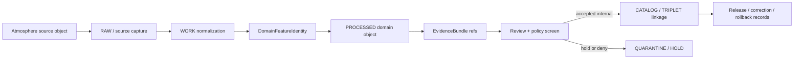

<!-- [KFM_META_BLOCK_V2]
doc_id: kfm://contract/domains/atmosphere/domain-feature-identity
title: contracts/domains/atmosphere/domain_feature_identity.md — DomainFeatureIdentity Contract
type: contract
version: v0.2
status: draft
owners: OWNER_TBD — Atmosphere steward · Identity steward · Contract steward · Evidence steward · Schema steward · Policy steward · Validation steward · Release steward · Docs steward
created: 2026-06-21
updated: 2026-06-21
policy_label: public; contracts; domains; atmosphere; domain-feature-identity; semantic-contract; identity; deterministic-id
tags: [kfm, contracts, atmosphere, air, domain-feature-identity, identity, deterministic-id, source-role, temporal-scope, normalized-digest, evidence, lifecycle, governance]
related:
  - ./README.md
  - ./AirStation.md
  - ./AirObservation.md
  - ./PM25Observation.md
  - ./OzoneObservation.md
  - ./SmokeContext.md
  - ./AODRaster.md
  - ./WeatherStation.md
  - ./WeatherObservation.md
  - ./WindField.md
  - ./PrecipitationObservation.md
  - ./TemperatureObservation.md
  - ./ClimateNormal.md
  - ./ClimateAnomaly.md
  - ./ForecastContext.md
  - ./AdvisoryContext.md
  - ../../../docs/domains/atmosphere/CANONICAL_PATHS.md
  - ../../../docs/domains/atmosphere/OBJECT_FAMILY_MAP.md
  - ../../../docs/domains/atmosphere/POLICY.md
  - ../../../docs/domains/atmosphere/PUBLICATION_POSTURE.md
  - ../../../schemas/contracts/v1/domains/atmosphere/domain_feature_identity.schema.json
  - ../../../fixtures/domains/atmosphere/domain_feature_identity/
  - ../../../tools/validators/domains/atmosphere/validate_domain_feature_identity.py
  - ../../../policy/domains/atmosphere/
  - ../../../data/registry/sources/atmosphere/
  - ../../../data/proofs/
  - ../../../release/
notes:
  - "Expanded from a greenfield scaffold into the Atmosphere/Air identity-support semantic contract."
  - "The paired schema is PROPOSED and currently requires only id while allowing additional properties."
  - "docs/domains/atmosphere/OBJECT_FAMILY_MAP.md proposes identity = source_id + object_role + temporal_scope + normalized_digest for all Atmosphere/Air objects."
  - "The object-family map treats object_role / knowledge character as part of identity so anti-collapse survives deduplication."
  - "This contract defines identity support; it does not define object payload meaning, evidence proof, policy approval, release approval, or public rendering by itself."
  - "The user-provided Markdown Authoring Agent v2 prompt is treated as authoring guidance for this revision, not as content to paste into the contract."
  - "The Focus Mode consent sentence belongs to Focus Mode / consent documentation and is referenced here only as an out-of-scope disposition."
[/KFM_META_BLOCK_V2] -->

<a id="top"></a>

# DomainFeatureIdentity Contract

> Semantic contract for `DomainFeatureIdentity`, the Atmosphere/Air identity-support object that names, scopes, versions, and links an Atmosphere feature across source role, object role, time, support geometry, normalized digest, evidence, lifecycle, release, correction, and rollback context. It is not an observation, model field, remote-sensing mask, advisory, proof object, policy decision, release artifact, or public data product by itself.

<p>
  
  
  
  
  
  
</p>

`contracts/domains/atmosphere/domain_feature_identity.md`

## Quick jumps

[Status](#status) · [Meaning](#meaning) · [Repo fit](#repo-fit) · [Schema posture](#schema-posture) · [Accepted uses](#accepted-uses) · [Exclusions](#exclusions) · [Recommended fields](#recommended-fields) · [Invariants](#invariants) · [Identity recipe](#identity-recipe) · [Lifecycle](#lifecycle) · [Authoring-prompt treatment](#authoring-prompt-treatment) · [Consent-pattern disposition](#consent-pattern-disposition) · [Validation](#validation) · [Evidence basis](#evidence-basis) · [Rollback](#rollback) · [Definition of done](#definition-of-done)

---

## Status

> [!IMPORTANT]
> **Status:** `draft` / semantic contract  
> **Owner:** `OWNER_TBD`  
> **Contract path:** `contracts/domains/atmosphere/domain_feature_identity.md`  
> **Schema path:** `schemas/contracts/v1/domains/atmosphere/domain_feature_identity.schema.json`  
> **Truth posture:** `CONFIRMED` target path, scaffold replacement, paired schema metadata, object-family roster, knowledge-character anti-collapse table, proposed identity rule, and six-time temporal discipline from the Atmosphere object-family map. Validator existence, fixture coverage, identity-derivation code, digest algorithm, policy enforcement, source registry behavior, EvidenceBundle implementation, release workflow, API behavior, UI behavior, and runtime behavior remain `NEEDS VERIFICATION`.

> [!CAUTION]
> This contract defines identity meaning only. It does **not** authorize observation claims, model claims, advisory claims, PM2.5/AQI/AOD conversion, climate attribution, station-location publication, source-rights clearance, policy approval, proof closure, public release, or health/safety guidance.

---

## Meaning

`DomainFeatureIdentity` is the Atmosphere/Air-domain identity carrier for governed Atmosphere objects.

It exists to answer:

- Which Atmosphere/Air object family does this feature belong to?
- Which source and source role contributed the feature identity?
- Which object role or knowledge character constrains the feature?
- Which temporal axes are part of identity and must not be collapsed?
- Which spatial/support scope, station/site context, grid, mask, or geometry reference is part of the identity?
- Which normalized payload digest or `spec_hash` pins the representation?
- Which evidence, policy, lifecycle, release, correction, supersession, and rollback context applies?

It is an identity-support contract. It is **not** the feature payload itself. Payload meaning stays in object-specific contracts such as `AirObservation`, `AODRaster`, `SmokeContext`, `WindField`, `ClimateNormal`, `ClimateAnomaly`, and `AdvisoryContext`.

---

## Repo fit

```text
contracts/
└── domains/
    └── atmosphere/
        ├── domain_feature_identity.md
        ├── AirObservation.md
        ├── AODRaster.md
        ├── ClimateNormal.md
        └── AdvisoryContext.md
```

Adjacent roots:

| Root | Relationship |
|---|---|
| `./README.md` | Atmosphere contract-lane orientation and object index. |
| `../../../docs/domains/atmosphere/OBJECT_FAMILY_MAP.md` | Object-family roster, knowledge-character anti-collapse vocabulary, proposed identity rule, and temporal discipline. |
| `../../../docs/domains/atmosphere/POLICY.md` | Source-role, anti-collapse, freshness, unresolved-rights, station siting, and finite-decision posture. |
| `../../../docs/domains/atmosphere/PUBLICATION_POSTURE.md` | Public-release disclosure, caveat, and source-role expectations. |
| `../../../schemas/contracts/v1/domains/atmosphere/domain_feature_identity.schema.json` | Current proposed schema. |
| `../../../fixtures/domains/atmosphere/domain_feature_identity/` | Fixture root declared by schema metadata; existence/coverage not verified here. |
| `../../../tools/validators/domains/atmosphere/validate_domain_feature_identity.py` | Validator path declared by schema metadata; existence/behavior not verified here. |
| `../../../policy/domains/atmosphere/` | Policy home; behavior not verified here. |
| `../../../data/registry/sources/atmosphere/` | SourceDescriptor/source-role support for Atmosphere sources. |
| `../../../data/proofs/` | EvidenceBundle/proof support. |
| `../../../release/` | Release, correction, supersession, and rollback authority. |

---

## Schema posture

The paired schema found for this contract is:

```text
schemas/contracts/v1/domains/atmosphere/domain_feature_identity.schema.json
```

Current schema evidence:

| Schema fact | Status |
|---|---|
| Schema file exists | `CONFIRMED` |
| `$id` points to `contracts/v1/domains/atmosphere/domain_feature_identity.schema.json` | `CONFIRMED` |
| Schema title is `domain_feature_identity` | `CONFIRMED` |
| Schema description says greenfield placeholder | `CONFIRMED` |
| Schema status is `PROPOSED` | `CONFIRMED` |
| Required fields | `id` only |
| Declared properties | `spec_hash`, `id`, `version` |
| `additionalProperties` | `true` |
| Schema metadata points to this contract | `CONFIRMED` |
| Fixture root is declared | `CONFIRMED metadata / coverage NEEDS VERIFICATION` |
| Validator path is declared | `CONFIRMED metadata / existence NEEDS VERIFICATION` |
| Policy root is declared | `CONFIRMED metadata / behavior NEEDS VERIFICATION` |

This contract therefore defines semantic expectations for future schema, fixture, validator, and policy work. It does not claim that machine validation currently enforces the full identity model.

---

## Accepted uses

| Use | Allowed? | Rule |
|---|---:|---|
| Carrying stable Atmosphere/Air feature identity | Yes | Must include source, source role, object role, time, scope, digest, and lineage context sufficient for audit. |
| Linking an Atmosphere object to evidence and source metadata | Yes | Must resolve through governed evidence/source records before consequential use. |
| Supporting deduplication or non-regression checks | Yes | Must preserve object role / knowledge character and temporal scope. |
| Supporting correction, supersession, rollback, or reprocessing lineage | Yes | Identity changes must be traceable. |
| Distinguishing observation from model/report/mask/advisory context | Yes | Object role and knowledge character are part of identity context. |
| Acting as AirObservation, AODRaster, SmokeContext, WindField, ClimateNormal, or AdvisoryContext payload | No | Object-specific contracts own payload meaning. |
| Acting as proof closure | No | EvidenceBundle/proof objects remain separate. |
| Acting as policy or release approval | No | PolicyDecision and ReleaseManifest families remain separate. |
| Acting as public-safe geometry or station-location approval | No | Public location disclosure is governed separately. |

---

## Exclusions

| Does not belong in `DomainFeatureIdentity` | Correct home |
|---|---|
| Full Atmosphere object payload | Object-specific contracts such as `AirObservation.md`, `AODRaster.md`, `SmokeContext.md`, `ForecastContext.md`, `ClimateNormal.md`, and `AdvisoryContext.md`. |
| Raw source payloads | `data/raw/atmosphere/`, `data/work/atmosphere/`, or `data/quarantine/atmosphere/` lifecycle roots after verification. |
| Source registry record | `../../../data/registry/sources/atmosphere/` or accepted source registry home. |
| EvidenceBundle/proof content | `../../../data/proofs/`. |
| JSON Schema shape | `../../../schemas/contracts/v1/domains/atmosphere/domain_feature_identity.schema.json`. |
| Validator code | `../../../tools/validators/domains/atmosphere/validate_domain_feature_identity.py` or accepted validator home. |
| Policy decisions | `../../../policy/domains/atmosphere/` and related policy roots. |
| Release, correction, supersession, rollback records | `../../../release/` and related contract families. |
| Public tiles, layers, API DTOs, UI components, or Focus Mode payloads | Governed app/API/UI/focus-mode roots. |
| Consent pattern content | `../../../docs/focus-mode/CONSENT_PATTERN.md` or accepted consent/focus-mode home. |

---

## Recommended fields

The current schema requires only `id`. The following fields are `PROPOSED` semantic requirements for future schema and validator work:

| Field | Meaning |
|---|---|
| `id` | Canonical Atmosphere feature identity. |
| `version` | Contract/object identity version. |
| `spec_hash` | Deterministic content hash or integrity pin. |
| `object_family` | Atmosphere object family, such as `AirObservation`, `AODRaster`, `WindField`, `ClimateNormal`, or `AdvisoryContext`. |
| `source_id` | SourceDescriptor/source identity that contributed the feature. |
| `source_role` | Role of the contributing source, such as regulatory, low-cost, model, advisory, remote-sensing, archive, or context role. |
| `object_role` | Observation, model field, public report, remote-sensing mask, baseline, anomaly, advisory, station context, or other accepted role. |
| `knowledge_character` | Anti-collapse character such as `OBSERVED_SENSOR`, `REMOTE_SENSING_MASK`, `ATMOSPHERIC_MODEL_FIELD`, `CLIMATE_ANOMALY_CONTEXT`, or `ALERT_AND_ADVISORY_CONTEXT`. |
| `support_geometry_ref` | Reference to the support geometry, station/site, grid, tile, mask, county, basin, or spatial scope. |
| `public_geometry_policy` | Public-safe geometry posture, especially for station siting or sensitive joins. |
| `temporal_scope` | Structured time scope preserving source, observed, valid, retrieval, release, and correction time where material. |
| `normalized_digest` | JCS-canonicalized payload digest or equivalent deterministic representation. |
| `evidence_refs` | EvidenceRef/EvidenceBundle links. |
| `source_refs` | SourceDescriptor/source registry links. |
| `policy_refs` | PolicyDecision or policy rule references. |
| `review_refs` | Steward, source, scientific, policy, or release review references. |
| `lifecycle_state` | RAW/WORK/QUARANTINE/PROCESSED/CATALOG/TRIPLET/PUBLISHED posture where used. |
| `release_refs` | Release/candidate linkage where applicable. |
| `correction_refs` | Correction, supersession, withdrawal, reprocessing, or rollback lineage. |
| `contradiction_refs` | Records that contest, supersede, or constrain the identity. |

---

## Invariants

`DomainFeatureIdentity` must preserve these invariants:

- identity is deterministic where practical;
- `object_role` / knowledge character is part of identity context and must not be silently upgraded;
- source role is part of identity context and must not be silently upgraded;
- temporal axes remain distinct where material;
- support geometry/scope must not be broadened without lineage and review;
- digest/spec-hash changes require reviewable correction or supersession lineage;
- identity does not prove the feature true;
- identity does not approve public release;
- identity does not collapse AQI into concentration, AOD into PM2.5, model into observation, or advisory into life-safety instruction;
- identity does not bypass station-location generalization or sensitivity controls;
- unresolved evidence, source, policy, rights, or release references keep consequential use in `NEEDS VERIFICATION`, `ABSTAIN`, `DENY`, or `ERROR` posture according to policy;
- public-facing use must remain downstream of governed release artifacts and public-safe transforms.

---

## Identity recipe

The Atmosphere object-family map proposes a deterministic basis for all Atmosphere/Air objects:

```text
identity = source_id + object_role + temporal_scope + normalized_digest
```

This contract adopts that as `PROPOSED` semantic guidance until schema, validator, fixture, and identity-derivation implementation are verified.

> [!NOTE]
> `object_role` carries the knowledge character into identity. The same physical value admitted as a sensor observation, model field, public report, remote-sensing mask, advisory context, or baseline context may require distinct identities by design.

Temporal axes that should remain distinct where material include:

| Time axis | Meaning |
|---|---|
| `source_time` | When the source asserts the value pertains. |
| `observed_time` | When the phenomenon was measured. |
| `valid_time` | The interval over which the value is valid. |
| `retrieval_time` | When KFM fetched the source payload. |
| `release_time` | When KFM published the derivative. |
| `correction_time` | When a correction was issued, if any. |

---

## Lifecycle



`DomainFeatureIdentity` can be created during normalization or object realization. It must remain traceable through corrections, reprocessing, role changes, source updates, public-safe transforms, and rollbacks.

---

## Authoring-prompt treatment

The user-provided **KFM Repository Markdown Authoring Agent — Full Operating Prompt v2** was applied as authoring guidance for this revision. It was not pasted into the contract as object content.

No-loss preservation outcome:

| Existing element | Disposition | Reason |
|---|---|---|
| Greenfield scaffold role | `REPLACE WITH FULL CONTRACT` | The paired schema points directly to this snake_case file, so it is not a lowercase alias. |
| Family/schema/status lines | `KEEP + EXPAND` | Preserved in meta/status/schema posture with stronger evidence labels. |
| Meaning/fields/invariants/lifecycle headings | `KEEP + FILL` | Scaffold headings became evidence-bounded contract sections. |
| Schema-vs-contract separation | `KEEP + STRENGTHEN` | Schema shape, policy, fixtures, validators, and release remain in their roots. |
| Open questions | `KEEP AS VALIDATION / DEFINITION OF DONE` | Open work is made reviewable. |
| Full authoring prompt text | `DO NOT PASTE` | It is operating guidance, not object semantics. |
| Focus Mode consent sentence | `ROUTE ELSEWHERE` | It belongs to Focus Mode / consent documentation. |

---

## Consent-pattern disposition

The user-provided sentence — “Here’s a compact, privacy-first consent pattern you can drop into KFM Focus Mode without bending doctrine...” — is **not** `DomainFeatureIdentity` semantics.

It belongs in Focus Mode / consent documentation because it concerns consent-bound rendering, not Atmosphere feature identity. The repository has a dedicated Focus Mode consent pattern note at:

```text
docs/focus-mode/CONSENT_PATTERN.md
```

This contract may link to that pattern when consent-bound identity rendering is relevant, but consent itself remains in consent / Focus Mode / policy responsibility roots.

---

## Validation

Before relying on this contract, verify:

- schema expansion beyond `id`, `version`, and `spec_hash`;
- validator path existence and behavior;
- fixture root existence and coverage;
- digest algorithm and canonicalization method;
- identity derivation code;
- object-family vocabulary acceptance;
- knowledge-character enum or controlled vocabulary;
- source-role enum or controlled vocabulary;
- temporal scope field shape;
- geometry/support-scope reference shape;
- station-location sensitivity handling;
- policy behavior for anti-collapse rules;
- release/correction/rollback references;
- EvidenceBundle reference resolution;
- API/UI behavior does not treat identity as proof, payload, policy approval, or release approval.

---

## Evidence basis

| Source | Status | Supports | Limits |
|---|---|---|---|
| `contracts/domains/atmosphere/domain_feature_identity.md` prior scaffold | `CONFIRMED repo evidence` | Target path existed as greenfield scaffold with meaning/fields/invariants/lifecycle placeholders. | Did not define authoritative semantics. |
| `schemas/contracts/v1/domains/atmosphere/domain_feature_identity.schema.json` | `CONFIRMED schema evidence` | Schema exists, is `PROPOSED`, points to this contract, declares fixture/validator/policy roots, requires `id`, and allows additional properties. | Does not enforce the full identity model. |
| `docs/domains/atmosphere/OBJECT_FAMILY_MAP.md` | `CONFIRMED repo evidence / doctrine-adjacent` | Supplies Atmosphere object roster, knowledge-character bindings, proposed identity rule, and temporal discipline. | Its own notes say field realization is proposed and older generation did not inspect mounted repo. |
| `contracts/domains/agriculture/domain_feature_identity.md` | `CONFIRMED adjacent pattern` | Provides an expanded sibling identity-contract pattern for another domain. | Agriculture-specific object examples do not define Atmosphere semantics. |
| `docs/focus-mode/CONSENT_PATTERN.md` | `CONFIRMED repo evidence` | Provides the Focus Mode consent pattern home for the pasted consent idea. | It is a draft documentation pattern; policy/runtime enforcement remains `NEEDS VERIFICATION`. |
| User-provided authoring prompt v2 | `CONFIRMED user-supplied guidance` | Requires evidence-grounded, implementation-honest, visually polished Markdown with no-loss preservation, validation, and rollback posture. | Prompt guidance, not repo implementation proof. |

---

## Rollback

Rollback if this file is used to claim schema completeness, validator coverage, fixture coverage, identity derivation implementation, digest algorithm selection, policy enforcement, EvidenceBundle implementation, source registry behavior, API/UI behavior, release maturity, or public rendering behavior not verified in this task.

Rollback target: prior scaffold blob SHA `9286adb9fe259a479c8f794abc2aa79fe273aec2`.

---

## Definition of done

- [ ] Owners are confirmed and `OWNER_TBD` is replaced.
- [ ] Object-family vocabulary is accepted for all 15 Atmosphere/Air object families.
- [ ] Knowledge-character vocabulary is accepted or linked to a canonical enum.
- [ ] Source-role vocabulary is accepted or linked to a canonical enum.
- [ ] Schema expands beyond the current placeholder fields.
- [ ] Validator exists and enforces identity invariants.
- [ ] Fixtures cover observed sensor, public report, remote-sensing mask, model field, climate baseline/anomaly, advisory context, and network/site context identity cases.
- [ ] Negative fixtures prove identity does not collapse model-as-observation, AOD-as-PM2.5, AQI-as-concentration, advisory-as-life-safety, climate-baseline-as-observation, or identity-as-release.
- [ ] Digest/canonicalization algorithm is selected and documented.
- [ ] Correction/supersession/rollback lineage is validated.
- [ ] API/UI behavior proves identity cannot be rendered as proof, payload, policy decision, or release approval.

<p align="right"><a href="#top">Back to top</a></p>
