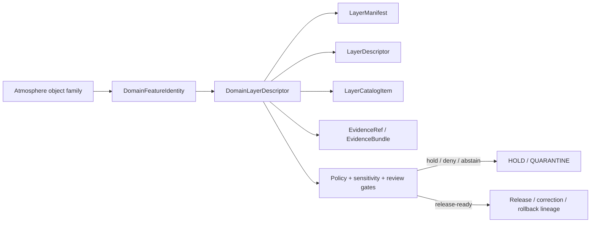

<!-- [KFM_META_BLOCK_V2]
doc_id: kfm://contract/domains/atmosphere/domain-layer-descriptor
title: contracts/domains/atmosphere/domain_layer_descriptor.md — DomainLayerDescriptor Contract
type: contract
version: v0.2
status: draft
owners: OWNER_TBD — Atmosphere steward · Layer steward · Contract steward · UI steward · Evidence steward · Schema steward · Policy steward · Validation steward · Release steward · Docs steward
created: 2026-06-21
updated: 2026-06-21
policy_label: public; contracts; domains; atmosphere; domain-layer-descriptor; semantic-contract; layer-boundary; release-aware; evidence-aware
tags: [kfm, contracts, atmosphere, air, domain-layer-descriptor, layer, map, source-role, evidence, policy, release, lifecycle, governance]
related:
  - ./README.md
  - ./domain_feature_identity.md
  - ./AirStation.md
  - ./AirObservation.md
  - ./PM25Observation.md
  - ./OzoneObservation.md
  - ./SmokeContext.md
  - ./AODRaster.md
  - ./WeatherStation.md
  - ./WeatherObservation.md
  - ./WindField.md
  - ./PrecipitationObservation.md
  - ./TemperatureObservation.md
  - ./ClimateNormal.md
  - ./ClimateAnomaly.md
  - ./ForecastContext.md
  - ./AdvisoryContext.md
  - ../../../contracts/data/layer_descriptor.md
  - ../../../contracts/data/layer_manifest.md
  - ../../../contracts/data/layer_catalog_item.md
  - ../../../docs/domains/atmosphere/CANONICAL_PATHS.md
  - ../../../docs/domains/atmosphere/OBJECT_FAMILY_MAP.md
  - ../../../docs/domains/atmosphere/POLICY.md
  - ../../../docs/domains/atmosphere/PUBLICATION_POSTURE.md
  - ../../../schemas/contracts/v1/domains/atmosphere/domain_layer_descriptor.schema.json
  - ../../../fixtures/domains/atmosphere/domain_layer_descriptor/
  - ../../../tools/validators/domains/atmosphere/validate_domain_layer_descriptor.py
  - ../../../policy/domains/atmosphere/
  - ../../../data/registry/layers/
  - ../../../data/registry/sources/atmosphere/
  - ../../../data/proofs/
  - ../../../release/
notes:
  - "Expanded from a greenfield scaffold into the Atmosphere/Air domain-layer-descriptor semantic contract."
  - "The paired schema is PROPOSED and currently requires only id while allowing additional properties."
  - "This domain contract is a layer meaning adapter and must not duplicate the generic LayerDescriptor, LayerManifest, or LayerCatalogItem contracts."
  - "Atmosphere layer descriptors must preserve object-family meaning, source role, knowledge character, evidence, policy, sensitivity, lifecycle, release, correction, and rollback boundaries."
  - "The user-provided Markdown Authoring Agent v2 prompt is treated as authoring guidance for this revision, not as content to paste into the contract."
  - "The Focus Mode consent sentence belongs to Focus Mode / consent documentation and is referenced here only as an out-of-scope disposition."
[/KFM_META_BLOCK_V2] -->

<a id="top"></a>

# DomainLayerDescriptor Contract

> Semantic contract for `DomainLayerDescriptor`, the Atmosphere/Air-domain descriptor that explains how an Atmosphere layer is identified, constrained, and handed to the governed layer stack while preserving Atmosphere object-family meaning, source role, knowledge character, evidence, policy, sensitivity, lifecycle, release, correction, and rollback boundaries.

<p>
  
  
  
  
  
  
</p>

`contracts/domains/atmosphere/domain_layer_descriptor.md`

## Quick jumps

[Status](#status) · [Meaning](#meaning) · [Repo fit](#repo-fit) · [Schema posture](#schema-posture) · [Accepted uses](#accepted-uses) · [Exclusions](#exclusions) · [Recommended fields](#recommended-fields) · [Invariants](#invariants) · [Layer boundary](#layer-boundary) · [Lifecycle](#lifecycle) · [Authoring-prompt treatment](#authoring-prompt-treatment) · [Consent-pattern disposition](#consent-pattern-disposition) · [Validation](#validation) · [Evidence basis](#evidence-basis) · [Rollback](#rollback) · [Definition of done](#definition-of-done) · [Status summary](#status-summary)

---

## Status

> [!IMPORTANT]
> **Status:** `draft` / semantic contract  
> **Owner:** `OWNER_TBD`  
> **Contract path:** `contracts/domains/atmosphere/domain_layer_descriptor.md`  
> **Schema path:** `schemas/contracts/v1/domains/atmosphere/domain_layer_descriptor.schema.json`  
> **Truth posture:** `CONFIRMED` target path, scaffold replacement, paired schema metadata, Atmosphere object-family roster, knowledge-character anti-collapse vocabulary, generic LayerDescriptor / LayerManifest / LayerCatalogItem contracts, and Atmosphere policy/publication posture. Validator existence, fixture coverage, layer registry behavior, policy enforcement, release workflow, tile/artifact generation, API behavior, UI behavior, Focus Mode behavior, and tests remain `NEEDS VERIFICATION`.

> [!CAUTION]
> This contract defines Atmosphere layer meaning only. It does **not** authorize raw data access, live source activation, renderer behavior, PM2.5/AQI/AOD conversion, advisory/life-safety use, station-location publication, proof closure, policy approval, public release, or runtime implementation claims.

---

## Meaning

`DomainLayerDescriptor` is the Atmosphere/Air-specific layer meaning adapter.

It describes how an Atmosphere layer should carry Atmosphere-domain meaning into the governed map/catalog layer stack. It may bind a layer to Atmosphere object families, source roles, knowledge characters, support scope, temporal context, sensitivity posture, evidence references, release posture, correction lineage, and public-safe display constraints.

It is narrower than the generic data-layer contracts:

- `LayerDescriptor` defines the renderer-facing layer descriptor boundary.
- `LayerManifest` defines the layer-version payload and release trust spine.
- `LayerCatalogItem` defines catalog/list metadata and trust-badge inputs.
- `DomainLayerDescriptor` defines Atmosphere-domain meaning and constraints that those layer surfaces must preserve.

It is not a layer payload, not a full renderer descriptor by itself, not a layer manifest, not a catalog item, not proof closure, not policy approval, and not release approval.

---

## Repo fit

```text
contracts/
└── domains/
    └── atmosphere/
        ├── README.md
        ├── domain_feature_identity.md
        └── domain_layer_descriptor.md
```

Adjacent roots:

| Root | Relationship |
|---|---|
| `./README.md` | Atmosphere semantic-contract directory boundary. |
| `./domain_feature_identity.md` | Atmosphere feature identity support. |
| `../../../contracts/data/layer_descriptor.md` | Generic renderer-boundary layer descriptor contract. |
| `../../../contracts/data/layer_manifest.md` | Generic layer-version manifest and trust-spine contract. |
| `../../../contracts/data/layer_catalog_item.md` | Generic catalog/list layer item and trust-badge input contract. |
| `../../../docs/domains/atmosphere/OBJECT_FAMILY_MAP.md` | Atmosphere object-family meanings, knowledge-character anti-collapse vocabulary, identity, and temporal discipline. |
| `../../../docs/domains/atmosphere/POLICY.md` | Source-role, anti-collapse, freshness, unresolved-rights, station siting, and finite-decision posture. |
| `../../../docs/domains/atmosphere/PUBLICATION_POSTURE.md` | Public-release disclosure, caveat, and source-role expectations. |
| `../../../schemas/contracts/v1/domains/atmosphere/domain_layer_descriptor.schema.json` | Current proposed schema. |
| `../../../fixtures/domains/atmosphere/domain_layer_descriptor/` | Fixture root declared by schema metadata; existence/coverage not verified here. |
| `../../../tools/validators/domains/atmosphere/validate_domain_layer_descriptor.py` | Validator path declared by schema metadata; existence/behavior not verified here. |
| `../../../policy/domains/atmosphere/` | Policy home; behavior not verified here. |
| `../../../data/registry/layers/` | Layer registry root; concrete entries not verified here. |
| `../../../data/registry/sources/atmosphere/` | Atmosphere source registry support. |
| `../../../data/proofs/` | EvidenceBundle/proof support. |
| `../../../release/` | Release, correction, supersession, and rollback authority. |

---

## Schema posture

The paired schema found for this contract is:

```text
schemas/contracts/v1/domains/atmosphere/domain_layer_descriptor.schema.json
```

Current schema evidence:

| Schema fact | Status |
|---|---|
| Schema file exists | `CONFIRMED` |
| `$id` points to `contracts/v1/domains/atmosphere/domain_layer_descriptor.schema.json` | `CONFIRMED` |
| Schema title is `domain_layer_descriptor` | `CONFIRMED` |
| Schema description says greenfield placeholder | `CONFIRMED` |
| Schema status is `PROPOSED` | `CONFIRMED` |
| Required fields | `id` only |
| Declared properties | `spec_hash`, `id`, `version` |
| `additionalProperties` | `true` |
| Schema metadata points to this contract | `CONFIRMED` |
| Fixture root is declared | `CONFIRMED metadata / coverage NEEDS VERIFICATION` |
| Validator path is declared | `CONFIRMED metadata / existence NEEDS VERIFICATION` |
| Policy root is declared | `CONFIRMED metadata / behavior NEEDS VERIFICATION` |

This contract therefore defines semantic expectations for future schema, fixture, validator, policy, registry, release, and UI work. It does not claim that machine validation currently enforces the full Atmosphere layer model.

---

## Accepted uses

| Use | Allowed? | Rule |
|---|---:|---|
| Binding an Atmosphere layer to Atmosphere object-family meaning | Yes | Must identify relevant object family or families. |
| Carrying source-role and knowledge-character constraints into a layer descriptor | Yes | Must preserve anti-collapse posture, e.g. AQI is not concentration and AOD is not PM2.5. |
| Supporting catalog, map, compare, export, or Focus Mode layer selection | Conditional | Must rely on governed release or review-approved candidate context and public-safe transforms. |
| Linking to generic LayerDescriptor / LayerManifest / LayerCatalogItem | Yes | Must not duplicate those object meanings. |
| Carrying public disclosure/caveat requirements | Yes | Must preserve source-role, freshness, model/observation, low-cost sensor, AOD, climate, advisory, and station-siting caveats. |
| Acting as the renderer descriptor by itself | No | Generic `LayerDescriptor` owns the renderer-facing contract. |
| Acting as the layer payload or manifest | No | `LayerManifest` and artifact roots own payload/version manifest. |
| Acting as proof or policy/release approval | No | Evidence and release authorities remain separate. |
| Acting as public station-location approval | No | Station-location disclosure is policy/release controlled. |
| Acting as health/safety or emergency instruction | No | Advisory layers are referral context, not life-safety instruction. |

---

## Exclusions

| Does not belong in `DomainLayerDescriptor` | Correct home |
|---|---|
| Full layer payload | Data lifecycle, artifact, tile, or released artifact roots. |
| Generic renderer-facing descriptor meaning | `../../../contracts/data/layer_descriptor.md`. |
| Layer-version manifest meaning | `../../../contracts/data/layer_manifest.md`. |
| Catalog/list layer metadata | `../../../contracts/data/layer_catalog_item.md`. |
| Full Atmosphere object payload | Object-specific contracts and data lifecycle roots. |
| Source registry record | `../../../data/registry/sources/atmosphere/` or accepted source registry home. |
| EvidenceBundle/proof content | `../../../data/proofs/`. |
| JSON Schema shape | `../../../schemas/contracts/v1/domains/atmosphere/domain_layer_descriptor.schema.json`. |
| Validator code | `../../../tools/validators/domains/atmosphere/validate_domain_layer_descriptor.py` or accepted validator home. |
| Policy decisions | `../../../policy/domains/atmosphere/` and related policy roots. |
| Release, correction, supersession, rollback records | `../../../release/` and related contract families. |
| Public UI implementation | Governed app/API/UI roots. |
| Consent pattern content | `../../../docs/focus-mode/CONSENT_PATTERN.md` or accepted consent/focus-mode home. |

---

## Recommended fields

The current schema requires only `id`. The following fields are `PROPOSED` semantic requirements for future schema and validator work:

| Field | Meaning |
|---|---|
| `id` | Canonical Atmosphere domain layer descriptor identity. |
| `version` | Contract/layer descriptor version. |
| `spec_hash` | Deterministic content hash or integrity pin. |
| `domain` | Should be `atmosphere` or `atmosphere-air` for this contract family after naming is resolved. |
| `layer_id` | Stable layer family identifier. |
| `layer_title` | Human-readable layer title for catalog/map surfaces. |
| `atmosphere_object_families` | Atmosphere object families represented by the layer. |
| `knowledge_characters` | Anti-collapse characters represented by the layer. |
| `domain_feature_identity_refs` | Links to Atmosphere feature identity records where applicable. |
| `layer_descriptor_ref` | Link to generic `LayerDescriptor`. |
| `layer_manifest_ref` | Link to generic `LayerManifest`. |
| `layer_catalog_item_ref` | Link to generic `LayerCatalogItem` where listed. |
| `source_role_summary` | Source-role posture represented by the layer. |
| `evidence_refs` | EvidenceRef/EvidenceBundle links. |
| `support_scope` | Spatial/support scope, generalized display scope, station/site scope, grid, mask, or tile scope. |
| `temporal_scope` | Time coverage, valid-time, observed-time, retrieval-time, release-time, or correction-time posture. |
| `freshness_state` | Freshness / stale / archive / modeled / advisory state where relevant. |
| `sensitivity_state` | Sensitivity/generalization/review posture. |
| `policy_state` | Policy posture or policy-decision reference. |
| `public_disclosure` | Required public caveats, such as AQI index, AOD proxy, model field, low-cost sensor, advisory referral, or climate baseline. |
| `release_ref` | Release or candidate release linkage. |
| `correction_refs` | Correction/supersession/rollback lineage where applicable. |

---

## Invariants

`DomainLayerDescriptor` must preserve these invariants:

- Atmosphere layer meaning remains distinct from generic renderer descriptor meaning;
- layer display is downstream of evidence, policy, review, public-safe transform, and release posture;
- source roles must stay visible and must not be silently upgraded;
- knowledge character must remain visible where it prevents collapse;
- observed sensor layers, public AQI reports, regulatory archives, low-cost sensors, remote-sensing masks, model fields, climate baselines/anomalies, and advisory contexts must remain distinguishable;
- AQI must not be presented as concentration;
- AOD must not be presented as PM2.5;
- model fields must not be presented as observations;
- climate anomalies must remain baseline-relative;
- advisories must remain referral context, not life-safety instructions;
- exact station/sensor siting must not be exposed as public-safe merely because a layer exists;
- unresolved rights, evidence, policy, source-role, freshness, or release references keep public use in hold, deny, abstain, or `NEEDS VERIFICATION` posture according to policy;
- domain layer descriptors must not bypass LayerManifest, LayerDescriptor, LayerCatalogItem, policy, evidence, or release boundaries;
- correction and rollback lineage must remain visible when layer meaning changes.

---

## Layer boundary

`DomainLayerDescriptor` is a domain meaning adapter.

| Boundary | Rule |
|---|---|
| Domain meaning | Atmosphere object-family semantics and anti-collapse rules live here. |
| Renderer handoff | Generic `LayerDescriptor` owns renderer-facing semantics. |
| Payload/version | Generic `LayerManifest` owns layer-version payload semantics. |
| Catalog listing | Generic `LayerCatalogItem` owns catalog/list and trust-badge semantics. |
| Evidence | EvidenceBundle/EvidenceRef remains separate. |
| Policy | PolicyDecision/policy roots remain separate. |
| Release | ReleaseManifest/PromotionDecision/rollback records remain separate. |
| Public UI | Public clients consume governed release/API/layer surfaces, not RAW/WORK/QUARANTINE/internal stores. |

---

## Lifecycle



The domain descriptor supports the layer stack. It does not replace payload validation, evidence resolution, source-role review, sensitivity review, policy decisions, release review, public-safe transforms, or rollback records.

---

## Authoring-prompt treatment

The user-provided **KFM Repository Markdown Authoring Agent — Full Operating Prompt v2** was applied as authoring guidance for this revision. It was not pasted into the contract as object content.

No-loss preservation outcome:

| Existing element | Disposition | Reason |
|---|---|---|
| Greenfield scaffold role | `REPLACE WITH FULL CONTRACT` | The paired schema points directly to this snake_case file, so it is not a lowercase alias. |
| Family/schema/status lines | `KEEP + EXPAND` | Preserved in meta/status/schema posture with stronger evidence labels. |
| Meaning/fields/invariants/lifecycle headings | `KEEP + FILL` | Scaffold headings became evidence-bounded contract sections. |
| Schema-vs-contract separation | `KEEP + STRENGTHEN` | Schema shape, policy, fixtures, validators, release, catalog, and UI remain in their roots. |
| Open questions | `KEEP AS VALIDATION / DEFINITION OF DONE` | Open work is made reviewable. |
| Full authoring prompt text | `DO NOT PASTE` | It is operating guidance, not object semantics. |
| Focus Mode consent sentence | `ROUTE ELSEWHERE` | It belongs to Focus Mode / consent documentation. |

---

## Consent-pattern disposition

The user-provided sentence — “Here’s a compact, privacy-first consent pattern you can drop into KFM Focus Mode without bending doctrine...” — is **not** `DomainLayerDescriptor` semantics.

It belongs in Focus Mode / consent documentation because it concerns consent-bound rendering, not Atmosphere layer meaning. The repository has a dedicated Focus Mode consent pattern note at:

```text
docs/focus-mode/CONSENT_PATTERN.md
```

This contract may link to that pattern when consent-bound Atmosphere layer rendering is relevant, but consent itself remains in consent / Focus Mode / policy responsibility roots.

---

## Validation

Before relying on this contract, verify:

- schema expansion beyond `id`, `version`, and `spec_hash`;
- validator path existence and behavior;
- fixture root existence and coverage;
- layer registry entries and naming rules;
- object-family vocabulary acceptance;
- knowledge-character enum or controlled vocabulary;
- source-role enum or controlled vocabulary;
- generic LayerDescriptor / LayerManifest / LayerCatalogItem references;
- EvidenceBundle reference resolution;
- policy behavior for anti-collapse rules;
- sensitivity behavior for exact station/sensor locations and sensitive joins;
- freshness behavior for live, archive, model, advisory, and stale layers;
- release/correction/rollback reference validation;
- API/UI behavior does not treat domain layer meaning as proof, payload, policy approval, or release approval;
- public clients cannot bypass governed APIs or released artifacts through this descriptor.

---

## Evidence basis

| Source | Status | Supports | Limits |
|---|---|---|---|
| `contracts/domains/atmosphere/domain_layer_descriptor.md` prior scaffold | `CONFIRMED repo evidence` | Target path existed as greenfield scaffold with meaning/fields/invariants/lifecycle placeholders. | Did not define authoritative semantics. |
| `schemas/contracts/v1/domains/atmosphere/domain_layer_descriptor.schema.json` | `CONFIRMED schema evidence` | Schema exists, is `PROPOSED`, points to this contract, declares fixture/validator/policy roots, requires `id`, and allows additional properties. | Does not enforce the full layer model. |
| `docs/domains/atmosphere/OBJECT_FAMILY_MAP.md` | `CONFIRMED repo evidence / doctrine-adjacent` | Supplies Atmosphere object roster, knowledge-character bindings, anti-collapse posture, proposed identity rule, and temporal discipline. | Its own notes say field realization is proposed and older generation did not inspect mounted repo. |
| `contracts/data/layer_descriptor.md` | `CONFIRMED generic layer contract` | Defines generic renderer-facing layer descriptor boundary. | Does not define Atmosphere-domain layer meaning. |
| `contracts/data/layer_manifest.md` | `CONFIRMED generic layer contract` | Defines layer-version manifest and trust-spine posture. | Does not define Atmosphere-domain layer meaning. |
| `contracts/data/layer_catalog_item.md` | `CONFIRMED generic layer contract` | Defines catalog/list layer item and trust-badge inputs. | Does not define Atmosphere-domain layer meaning. |
| `contracts/domains/agriculture/domain_layer_descriptor.md` | `CONFIRMED adjacent pattern` | Provides an expanded sibling domain-layer-descriptor pattern for another domain. | Agriculture-specific object examples do not define Atmosphere semantics. |
| `docs/focus-mode/CONSENT_PATTERN.md` | `CONFIRMED repo evidence` | Provides the Focus Mode consent pattern home for the pasted consent idea. | It is a draft documentation pattern; policy/runtime enforcement remains `NEEDS VERIFICATION`. |
| User-provided authoring prompt v2 | `CONFIRMED user-supplied guidance` | Requires evidence-grounded, implementation-honest, visually polished Markdown with no-loss preservation, validation, and rollback posture. | Prompt guidance, not repo implementation proof. |

---

## Rollback

Rollback if this file is used to claim schema completeness, validator coverage, fixture coverage, layer registry behavior, tile/artifact generation, policy enforcement, EvidenceBundle implementation, source registry behavior, API/UI behavior, Focus Mode behavior, release maturity, or public rendering behavior not verified in this task.

Rollback target: prior scaffold blob SHA `53a9625e6ba72142cf2d53dd876ea84b8cfe2249`.

---

## Definition of done

- [ ] Owners are confirmed and `OWNER_TBD` is replaced.
- [ ] Schema fields are defined beyond placeholder status.
- [ ] Validator and fixtures are implemented and verified.
- [ ] Atmosphere object-family vocabulary is accepted and linked.
- [ ] Knowledge-character vocabulary is accepted or linked to a canonical enum.
- [ ] Source-role vocabulary is accepted or linked to a canonical enum.
- [ ] Generic LayerDescriptor, LayerManifest, and LayerCatalogItem references are validated.
- [ ] Fixtures cover observed sensor, public AQI report, regulatory archive, low-cost sensor, remote-sensing mask, model field, climate baseline/anomaly, advisory context, and network/site context layers.
- [ ] Negative fixtures prove the descriptor cannot collapse AQI-as-concentration, AOD-as-PM2.5, model-as-observation, advisory-as-life-safety, climate-anomaly-as-observation, exact-station-location-as-public-safe, or layer-meaning-as-release.
- [ ] Evidence, policy, lifecycle, release, correction, and rollback references are testable.
- [ ] Downstream map/catalog/Focus Mode docs link to this contract as the accepted Atmosphere layer meaning boundary where appropriate.

---

## Status summary

`DomainLayerDescriptor` is the Atmosphere domain meaning boundary for layers. It is not the layer payload, not the full renderer descriptor, not the layer manifest, not a catalog item, not proof closure, not policy approval, not release approval, and not an implementation claim by itself.

<p align="right"><a href="#top">Back to top</a></p>
