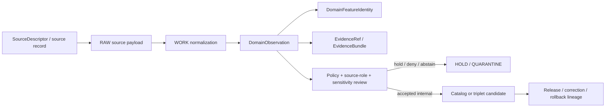

<!-- [KFM_META_BLOCK_V2]
doc_id: kfm://contract/domains/atmosphere/domain-observation
title: contracts/domains/atmosphere/domain_observation.md — DomainObservation Contract
type: contract
version: v0.2
status: draft
owners: OWNER_TBD — Atmosphere steward · Observation steward · Contract steward · Evidence steward · Schema steward · Policy steward · Validation steward · Release steward · Docs steward
created: 2026-06-21
updated: 2026-06-21
policy_label: public; contracts; domains; atmosphere; domain-observation; semantic-contract; observed-sensor; source-role-aware
tags: [kfm, contracts, atmosphere, air, domain-observation, observation, observed-sensor, source-role, temporal-scope, evidence, lifecycle, governance]
related:
  - ./README.md
  - ./domain_feature_identity.md
  - ./AirStation.md
  - ./AirObservation.md
  - ./PM25Observation.md
  - ./OzoneObservation.md
  - ./WeatherStation.md
  - ./WeatherObservation.md
  - ./WindField.md
  - ./PrecipitationObservation.md
  - ./TemperatureObservation.md
  - ./SmokeContext.md
  - ./AODRaster.md
  - ./ForecastContext.md
  - ./ClimateNormal.md
  - ./ClimateAnomaly.md
  - ./AdvisoryContext.md
  - ../../../docs/domains/atmosphere/CANONICAL_PATHS.md
  - ../../../docs/domains/atmosphere/OBJECT_FAMILY_MAP.md
  - ../../../docs/domains/atmosphere/POLICY.md
  - ../../../docs/domains/atmosphere/PUBLICATION_POSTURE.md
  - ../../../schemas/contracts/v1/domains/atmosphere/domain_observation.schema.json
  - ../../../fixtures/domains/atmosphere/domain_observation/
  - ../../../tools/validators/domains/atmosphere/validate_domain_observation.py
  - ../../../policy/domains/atmosphere/
  - ../../../data/registry/sources/atmosphere/
  - ../../../data/proofs/
  - ../../../release/
notes:
  - "Expanded from a greenfield scaffold into the Atmosphere/Air domain-observation semantic contract."
  - "The paired schema is PROPOSED and currently requires only id while allowing additional properties."
  - "This contract defines shared observation-envelope semantics; object-specific contracts still own object payload meaning."
  - "Atmosphere observation records must preserve source role, knowledge character, time axes, support scope, units, QA, evidence, policy, lifecycle, release, correction, and rollback boundaries."
  - "The user-provided Markdown Authoring Agent v2 prompt is treated as authoring guidance for this revision, not as content to paste into the contract."
  - "The Focus Mode consent sentence belongs to Focus Mode / consent documentation and is referenced here only as an out-of-scope disposition."
[/KFM_META_BLOCK_V2] -->

<a id="top"></a>

# DomainObservation Contract

> Semantic contract for `DomainObservation`, the shared Atmosphere/Air observation-envelope contract that records observation-like atmospheric records while preserving source role, knowledge character, station/support scope, time axes, units, quality posture, evidence, policy, lifecycle, release, correction, and rollback context.

<p>
  
  
  
  
  
  
</p>

`contracts/domains/atmosphere/domain_observation.md`

## Quick jumps

[Status](#status) · [Meaning](#meaning) · [Repo fit](#repo-fit) · [Schema posture](#schema-posture) · [Accepted uses](#accepted-uses) · [Exclusions](#exclusions) · [Recommended fields](#recommended-fields) · [Invariants](#invariants) · [Observation families](#observation-families) · [Lifecycle](#lifecycle) · [Authoring-prompt treatment](#authoring-prompt-treatment) · [Consent-pattern disposition](#consent-pattern-disposition) · [Validation](#validation) · [Evidence basis](#evidence-basis) · [Rollback](#rollback) · [Definition of done](#definition-of-done) · [Status summary](#status-summary)

---

## Status

> [!IMPORTANT]
> **Status:** `draft` / semantic contract  
> **Owner:** `OWNER_TBD`  
> **Contract path:** `contracts/domains/atmosphere/domain_observation.md`  
> **Schema path:** `schemas/contracts/v1/domains/atmosphere/domain_observation.schema.json`  
> **Truth posture:** `CONFIRMED` target path, scaffold replacement, paired schema metadata, Atmosphere object-family roster, knowledge-character anti-collapse vocabulary, identity/temporal discipline, and policy/publication posture. Validator existence, fixture coverage, observation-normalization code, source registry behavior, EvidenceBundle implementation, policy enforcement, release workflow, API behavior, UI behavior, and runtime behavior remain `NEEDS VERIFICATION`.

> [!CAUTION]
> `DomainObservation` does not make an observation true. It also does **not** convert AQI into concentration, AOD into PM2.5, model fields into observations, climate anomalies into raw observations, advisories into life-safety instructions, or station coordinates into public-safe locations.

---

## Meaning

`DomainObservation` is the shared Atmosphere/Air semantic wrapper for observation-like records.

It exists to carry the common semantics shared by Atmosphere observation families:

- source identity and source role;
- object family and knowledge character;
- measurement/report/context role;
- observed, valid, retrieval, release, and correction time axes;
- station, support geometry, grid cell, mask, or generalized support scope;
- parameter, unit, normalization, method, QA, freshness, and uncertainty posture;
- normalized digest and `spec_hash` integrity pin;
- evidence references;
- policy, sensitivity, rights, review, release, correction, and rollback context.

It is not a universal claim of truth. It is also not a schema, raw source record, SourceDescriptor, EvidenceBundle, PolicyDecision, ReleaseManifest, map layer, public API DTO, Focus Mode payload, or UI component.

Object-specific contracts still own the payload meaning. `DomainObservation` is the common envelope that prevents observation-like records from losing source role, time, evidence, and policy context while they move through KFM.

---

## Repo fit

```text
contracts/
└── domains/
    └── atmosphere/
        ├── README.md
        ├── domain_feature_identity.md
        ├── domain_layer_descriptor.md
        └── domain_observation.md
```

Adjacent roots:

| Root | Relationship |
|---|---|
| `./README.md` | Atmosphere semantic-contract directory boundary. |
| `./domain_feature_identity.md` | Atmosphere feature identity support. |
| `./AirObservation.md` | Air-quality observation object contract. |
| `./PM25Observation.md` and `./OzoneObservation.md` | Pollutant-specific observation/report contracts. |
| `./WeatherObservation.md` | General meteorological observation/context contract. |
| `./WindField.md` | Wind observation/model role-specific contract. |
| `./PrecipitationObservation.md` and `./TemperatureObservation.md` | Weather variable-specific observation contracts. |
| `../../../docs/domains/atmosphere/OBJECT_FAMILY_MAP.md` | Atmosphere object-family roster, knowledge-character anti-collapse vocabulary, identity, and temporal discipline. |
| `../../../docs/domains/atmosphere/POLICY.md` | Anti-collapse, fail-closed, rights/sensitivity/source-role policy doctrine. |
| `../../../docs/domains/atmosphere/PUBLICATION_POSTURE.md` | Public-release disclosure and block-on-unresolved posture. |
| `../../../schemas/contracts/v1/domains/atmosphere/domain_observation.schema.json` | Current proposed schema. |
| `../../../fixtures/domains/atmosphere/domain_observation/` | Fixture root declared by schema metadata; existence/coverage not verified here. |
| `../../../tools/validators/domains/atmosphere/validate_domain_observation.py` | Validator path declared by schema metadata; existence/behavior not verified here. |
| `../../../policy/domains/atmosphere/` | Policy home; behavior not verified here. |
| `../../../data/registry/sources/atmosphere/` | Atmosphere source registry support. |
| `../../../data/proofs/` | EvidenceBundle/proof support. |
| `../../../release/` | Release, correction, supersession, and rollback authority. |

---

## Schema posture

The paired schema found for this contract is:

```text
schemas/contracts/v1/domains/atmosphere/domain_observation.schema.json
```

Current schema evidence:

| Schema fact | Status |
|---|---|
| Schema file exists | `CONFIRMED` |
| `$id` points to `contracts/v1/domains/atmosphere/domain_observation.schema.json` | `CONFIRMED` |
| Schema title is `domain_observation` | `CONFIRMED` |
| Schema description says greenfield placeholder | `CONFIRMED` |
| Schema status is `PROPOSED` | `CONFIRMED` |
| Required fields | `id` only |
| Declared properties | `spec_hash`, `id`, `version` |
| `additionalProperties` | `true` |
| Schema metadata points to this contract | `CONFIRMED` |
| Fixture root is declared | `CONFIRMED metadata / coverage NEEDS VERIFICATION` |
| Validator path is declared | `CONFIRMED metadata / existence NEEDS VERIFICATION` |
| Policy root is declared | `CONFIRMED metadata / behavior NEEDS VERIFICATION` |

This contract therefore defines semantic expectations for future schema, fixture, validator, policy, source registry, EvidenceBundle, release, API, and UI work. It does not claim that machine validation currently enforces the full Atmosphere observation model.

---

## Accepted uses

| Use | Allowed? | Rule |
|---|---:|---|
| Carrying common Atmosphere observation semantics | Yes | Must preserve object family, source role, knowledge character, time, scope, units, QA, digest, and evidence posture. |
| Supporting object-family-specific observation contracts | Yes | DomainObservation may supply shared meaning; object contracts still own payload semantics. |
| Supporting validation, deduplication, freshness checks, or lineage checks | Yes | Must remain deterministic, source-role-aware, and version-aware. |
| Supporting review and release gates | Conditional | Must not replace PolicyDecision, EvidenceBundle, ReleaseManifest, or steward review. |
| Representing regulatory, archive, low-cost, public-report, or context observations | Conditional | Must carry role/caveat/disclosure state and must not upgrade source role. |
| Acting as proof closure | No | EvidenceBundle/proof objects remain separate. |
| Acting as policy approval or release approval | No | Policy and release authority remain separate. |
| Acting as model, mask, advisory, climate baseline, or climate anomaly object payload | No | Object-specific contracts own those meanings. |
| Acting as UI/map layer descriptor | No | Layer contracts own layer meaning and rendering boundaries. |

---

## Exclusions

| Does not belong in `DomainObservation` | Correct home |
|---|---|
| Full object-specific payload semantics | Object-family contracts such as `AirObservation.md`, `PM25Observation.md`, `OzoneObservation.md`, `WeatherObservation.md`, `WindField.md`, `PrecipitationObservation.md`, and `TemperatureObservation.md`. |
| Model-field payload semantics | `ForecastContext.md`, model-specific object contracts, and model-run receipts. |
| Remote-sensing mask/proxy payload semantics | `AODRaster.md` and `SmokeContext.md` where source role is mask/proxy/model. |
| Climate baseline/anomaly semantics | `ClimateNormal.md` and `ClimateAnomaly.md`. |
| Advisory/referral semantics | `AdvisoryContext.md`. |
| Station/network site metadata | `AirStation.md` and `WeatherStation.md`. |
| Source registry record | `../../../data/registry/sources/atmosphere/` or accepted source registry home. |
| EvidenceBundle/proof content | `../../../data/proofs/`. |
| JSON Schema shape | `../../../schemas/contracts/v1/domains/atmosphere/domain_observation.schema.json`. |
| Validator code | `../../../tools/validators/domains/atmosphere/validate_domain_observation.py` or accepted validator home. |
| Policy decisions | `../../../policy/domains/atmosphere/` and related policy roots. |
| Release, correction, supersession, rollback records | `../../../release/` and related contract families. |
| API/UI implementation | Governed app/API/UI roots. |
| Consent pattern content | `../../../docs/focus-mode/CONSENT_PATTERN.md` or accepted consent/focus-mode home. |

---

## Recommended fields

The current schema requires only `id`. The following fields are `PROPOSED` semantic requirements for future schema and validator work:

| Field | Meaning |
|---|---|
| `id` | Canonical observation identity. |
| `version` | Contract/object version. |
| `spec_hash` | Deterministic content hash or integrity pin. |
| `object_family` | Atmosphere object family represented by the observation. |
| `observation_kind` | Observed sensor, regulatory archive, low-cost sensor, public report, meteorological context, derived observation, or observation candidate. |
| `knowledge_character` | Anti-collapse character such as `OBSERVED_SENSOR`, `PUBLIC_AQI_REPORT`, `REGULATORY_ARCHIVE`, `LOW_COST_SENSOR`, or `METEOROLOGICAL_CONTEXT`. |
| `source_id` | SourceDescriptor/source identity. |
| `source_role` | Source role, such as regulatory monitor, low-cost sensor, public report, archive, context, or derived role. |
| `domain_feature_identity_ref` | Link to `DomainFeatureIdentity` where used. |
| `station_ref` | AirStation/WeatherStation or station context reference where applicable. |
| `support_geometry_ref` | Reference to station, grid, mask, generalized geometry, county, basin, or other support scope. |
| `parameter` | Observed or reported atmospheric parameter. |
| `value` | Measurement/report value or reference to normalized value payload. |
| `unit` | Canonical unit or original unit with normalization state. |
| `method` | Measurement, instrument, aggregation, estimation, or source method. |
| `quality_state` | QA/QC, confidence, calibration, validation, caveat, or uncertainty posture. |
| `temporal_scope` | Observed, valid, retrieval, release, and correction time context where material. |
| `freshness_state` | Fresh, stale, archive, corrected, provisional, or withdrawn state. |
| `normalized_digest` | Canonical digest of the observed representation. |
| `evidence_refs` | EvidenceRef/EvidenceBundle links. |
| `sensitivity_state` | Sensitivity/generalization/review posture. |
| `rights_state` | Rights/license/cadence posture where applicable. |
| `policy_state` | Policy posture or policy-decision reference. |
| `lifecycle_state` | RAW/WORK/QUARANTINE/PROCESSED/CATALOG/TRIPLET/PUBLISHED posture where used. |
| `release_ref` | Release or candidate release linkage where applicable. |
| `correction_refs` | Correction/supersession/rollback lineage where applicable. |

---

## Invariants

`DomainObservation` must preserve these invariants:

- source role must remain visible and must not be silently upgraded;
- knowledge character must remain visible where it prevents collapse;
- observed, valid, retrieval, release, and correction time must remain distinct where material;
- support geometry or support scope must be explicit where material;
- station/sensor location sensitivity must not be bypassed by observation identity;
- modeled, archive, low-cost, public-report, context, candidate, and observed records must remain distinguishable;
- AQI must not be presented as concentration;
- AOD or remote-sensing masks must not be presented as PM2.5 observations;
- model fields must not be presented as observations;
- climate anomalies must not be presented as raw observations;
- advisories must not be presented as life-safety instructions;
- a domain observation does not prove itself true;
- schema validity is not evidence proof;
- policy approval and release approval remain separate authority surfaces;
- unresolved evidence, source role, freshness, rights, sensitivity, or release references keep consequential use in `NEEDS VERIFICATION`, `ABSTAIN`, `DENY`, `HOLD`, or `ERROR` posture according to policy;
- correction and rollback lineage must remain visible when observation meaning changes.

---

## Observation families

The Atmosphere object-family map identifies several observation-like families that this shared contract may support:

| Family | Observation posture |
|---|---|
| `AirObservation` | Common air-quality observation envelope. |
| `PM25Observation` | Pollutant-specific observation/report/archive role must be preserved. |
| `OzoneObservation` | Pollutant-specific observation/report/archive role must be preserved. |
| `WeatherObservation` | General meteorological observation/context envelope. |
| `WindField` | Observation only when admitted as observed wind; model role remains model field. |
| `PrecipitationObservation` | Precipitation-specific weather observation/context. |
| `TemperatureObservation` | Temperature-specific weather observation/context. |

These families may cite `AirStation` or `WeatherStation` as station/network context, but station metadata is not itself a `DomainObservation`. `AODRaster`, `SmokeContext`, `ForecastContext`, `ClimateNormal`, `ClimateAnomaly`, and `AdvisoryContext` may relate to observations but are not observations by default.

---

## Lifecycle



The observation supports traceability and review. It does not replace evidence resolution, source-role review, policy review, release review, public-safe transformation, or rollback records.

---

## Authoring-prompt treatment

The user-provided **KFM Repository Markdown Authoring Agent — Full Operating Prompt v2** was applied as authoring guidance for this revision. It was not pasted into the contract as object content.

No-loss preservation outcome:

| Existing element | Disposition | Reason |
|---|---|---|
| Greenfield scaffold role | `REPLACE WITH FULL CONTRACT` | The paired schema points directly to this snake_case file, so it is not a lowercase alias. |
| Family/schema/status lines | `KEEP + EXPAND` | Preserved in meta/status/schema posture with stronger evidence labels. |
| Meaning/fields/invariants/lifecycle headings | `KEEP + FILL` | Scaffold headings became evidence-bounded contract sections. |
| Schema-vs-contract separation | `KEEP + STRENGTHEN` | Schema shape, policy, fixtures, validators, release, source registry, and UI remain in their roots. |
| Open questions | `KEEP AS VALIDATION / DEFINITION OF DONE` | Open work is made reviewable. |
| Full authoring prompt text | `DO NOT PASTE` | It is operating guidance, not object semantics. |
| Focus Mode consent sentence | `ROUTE ELSEWHERE` | It belongs to Focus Mode / consent documentation. |

---

## Consent-pattern disposition

The user-provided sentence — “Here’s a compact, privacy-first consent pattern you can drop into KFM Focus Mode without bending doctrine...” — is **not** `DomainObservation` semantics.

It belongs in Focus Mode / consent documentation because it concerns consent-bound rendering, not Atmosphere observation meaning. The repository has a dedicated Focus Mode consent pattern note at:

```text
docs/focus-mode/CONSENT_PATTERN.md
```

This contract may link to that pattern when consent-bound Atmosphere observation rendering is relevant, but consent itself remains in consent / Focus Mode / policy responsibility roots.

---

## Validation

Before relying on this contract, verify:

- schema expansion beyond `id`, `version`, and `spec_hash`;
- validator path existence and behavior;
- fixture root existence and coverage;
- object-family enum or registry acceptance;
- knowledge-character enum or controlled vocabulary;
- source-role enum or controlled vocabulary;
- parameter/unit normalization rules;
- QA/QC, caveat, calibration, uncertainty, and confidence fields;
- temporal fields map to accepted KFM time-kind vocabulary;
- support geometry and station references handle sensitivity/generalization;
- evidence references resolve where consequential;
- policy/release/correction references are validated where used;
- API/UI behavior does not treat observation envelope as proof, policy approval, release approval, or public-safe disclosure by itself.

---

## Evidence basis

| Source | Status | Supports | Limits |
|---|---|---|---|
| `contracts/domains/atmosphere/domain_observation.md` prior scaffold | `CONFIRMED repo evidence` | Target path existed as greenfield scaffold with meaning/fields/invariants/lifecycle placeholders. | Did not define authoritative semantics. |
| `schemas/contracts/v1/domains/atmosphere/domain_observation.schema.json` | `CONFIRMED schema evidence` | Schema exists, is `PROPOSED`, points to this contract, declares fixture/validator/policy roots, requires `id`, and allows additional properties. | Does not enforce the full observation model. |
| `docs/domains/atmosphere/OBJECT_FAMILY_MAP.md` | `CONFIRMED repo evidence / doctrine-adjacent` | Supplies Atmosphere object roster, knowledge-character bindings, anti-collapse posture, proposed identity rule, and temporal discipline. | Its own notes say field realization is proposed and older generation did not inspect mounted repo. |
| `docs/domains/atmosphere/POLICY.md` | `CONFIRMED doctrine-adjacent policy` | States deny-by-default/fail-closed posture and anti-collapse doctrine. | Human-facing policy doc; enforcement remains verification-bound. |
| `docs/domains/atmosphere/PUBLICATION_POSTURE.md` | `CONFIRMED doctrine-adjacent publication posture` | States publication blocks on unresolved rights/source-role/evidence/sensitivity/release and gives public viewing product disclosure expectations. | Routes, DTOs, and enforcement maturity remain proposed or unknown. |
| `contracts/domains/agriculture/domain_observation.md` | `CONFIRMED adjacent pattern` | Provides an expanded sibling DomainObservation pattern for another domain. | Agriculture-specific object examples do not define Atmosphere semantics. |
| `docs/focus-mode/CONSENT_PATTERN.md` | `CONFIRMED repo evidence` | Provides the Focus Mode consent pattern home for the pasted consent idea. | It is a draft documentation pattern; policy/runtime enforcement remains `NEEDS VERIFICATION`. |
| User-provided authoring prompt v2 | `CONFIRMED user-supplied guidance` | Requires evidence-grounded, implementation-honest, visually polished Markdown with no-loss preservation, validation, and rollback posture. | Prompt guidance, not repo implementation proof. |

---

## Rollback

Rollback if this file is used to claim schema completeness, validator coverage, fixture coverage, observation-normalization implementation, source registry behavior, EvidenceBundle implementation, policy enforcement, release behavior, API/UI behavior, Focus Mode behavior, public disclosure safety, or implementation maturity not verified in this task.

Rollback target: prior scaffold blob SHA `85134ee5d3b5b10e52a723ec4bfd0c8d7906a0ca`.

---

## Definition of done

- [ ] Owners are confirmed and `OWNER_TBD` is replaced.
- [ ] Schema fields are defined beyond placeholder status.
- [ ] Validator and fixtures are implemented and verified.
- [ ] Atmosphere object-family vocabulary is accepted and linked.
- [ ] Knowledge-character vocabulary is accepted or linked to a canonical enum.
- [ ] Source-role vocabulary is accepted or linked to a canonical enum.
- [ ] Parameter/unit normalization rules are accepted and tested.
- [ ] Fixtures cover observed sensor, public AQI report, regulatory archive, low-cost sensor, meteorological context, derived observation, candidate observation, station-linked observation, corrected observation, and withdrawn observation cases.
- [ ] Negative fixtures prove the observation envelope cannot collapse AQI-as-concentration, AOD-as-PM2.5, model-as-observation, climate-anomaly-as-observation, advisory-as-life-safety, exact-station-location-as-public-safe, schema-valid-as-evidence-proof, or observation-as-release.
- [ ] Evidence, policy, lifecycle, release, correction, and rollback references are testable.
- [ ] Downstream object contracts link to this contract as the accepted shared Atmosphere observation envelope where appropriate.

---

## Status summary

`DomainObservation` is the shared Atmosphere observation-envelope boundary. It is not a full object payload, not a model field, not a remote-sensing mask, not an advisory, not a climate baseline/anomaly, not a station record, not proof closure, not policy approval, not release approval, and not an implementation claim by itself.

<p align="right"><a href="#top">Back to top</a></p>
