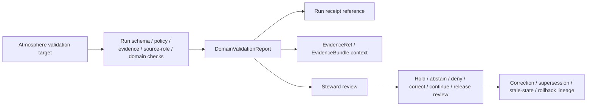

<!-- [KFM_META_BLOCK_V2]
doc_id: kfm://contract/domains/atmosphere/domain-validation-report
title: contracts/domains/atmosphere/domain_validation_report.md — DomainValidationReport Contract
type: contract
version: v0.2
status: draft
owners: OWNER_TBD — Atmosphere steward · Validation steward · Contract steward · Evidence steward · Schema steward · Policy steward · Release steward · Docs steward
created: 2026-06-21
updated: 2026-06-21
policy_label: public; contracts; domains; atmosphere; domain-validation-report; semantic-contract; validation; source-role-aware; release-aware
tags: [kfm, contracts, atmosphere, air, domain-validation-report, validation, evidence, policy, lifecycle, release, rollback, governance]
related:
  - ./README.md
  - ./domain_observation.md
  - ./domain_feature_identity.md
  - ./domain_layer_descriptor.md
  - ./AirObservation.md
  - ./PM25Observation.md
  - ./OzoneObservation.md
  - ./SmokeContext.md
  - ./AODRaster.md
  - ./WeatherObservation.md
  - ./WindField.md
  - ./PrecipitationObservation.md
  - ./TemperatureObservation.md
  - ./ClimateNormal.md
  - ./ClimateAnomaly.md
  - ./ForecastContext.md
  - ./AdvisoryContext.md
  - ../../../contracts/data/validation_report.md
  - ../../../docs/domains/atmosphere/OBJECT_FAMILY_MAP.md
  - ../../../docs/domains/atmosphere/POLICY.md
  - ../../../docs/domains/atmosphere/PUBLICATION_POSTURE.md
  - ../../../docs/focus-mode/CONSENT_PATTERN.md
  - ../../../schemas/contracts/v1/domains/atmosphere/domain_validation_report.schema.json
  - ../../../fixtures/domains/atmosphere/domain_validation_report/
  - ../../../tools/validators/domains/atmosphere/validate_domain_validation_report.py
  - ../../../policy/domains/atmosphere/
  - ../../../data/receipts/
  - ../../../data/proofs/
  - ../../../release/
notes:
  - "Expanded from a greenfield scaffold into the Atmosphere/Air domain-specific validation-report semantic contract."
  - "The paired schema is PROPOSED and currently requires only id while allowing additional properties."
  - "This contract is narrower than the generic data ValidationReport contract and must not collapse validation findings into proof, process receipts, policy approval, release approval, catalog truth, or source truth."
  - "Atmosphere validation must preserve anti-collapse checks: AQI is not concentration, AOD is not PM2.5, model fields are not observations, low-cost sensor output needs caveats, climate anomalies are baseline-relative, and advisories are not life-safety instructions."
  - "The user-provided Markdown Authoring Agent v2 prompt is treated as authoring guidance for this revision, not as content to paste into the contract."
  - "The Focus Mode consent sentence belongs to Focus Mode / consent documentation and is referenced here only as an out-of-scope disposition."
[/KFM_META_BLOCK_V2] -->

<a id="top"></a>

# DomainValidationReport Contract

> Semantic contract for `DomainValidationReport`, the Atmosphere/Air validation report that records whether an Atmosphere object, observation envelope, layer descriptor, source-derived candidate, policy-gated artifact, or release candidate satisfied Atmosphere-specific source-role, knowledge-character, unit, time, evidence, sensitivity, rights, publication, correction, and rollback checks.

<p>
  
  
  
  
  
  
</p>

`contracts/domains/atmosphere/domain_validation_report.md`

## Quick jumps

[Status](#status) · [Meaning](#meaning) · [Repo fit](#repo-fit) · [Schema posture](#schema-posture) · [Accepted uses](#accepted-uses) · [Exclusions](#exclusions) · [Recommended fields](#recommended-fields) · [Invariants](#invariants) · [Atmosphere validation checks](#atmosphere-validation-checks) · [Lifecycle](#lifecycle) · [Authoring-prompt treatment](#authoring-prompt-treatment) · [Consent-pattern disposition](#consent-pattern-disposition) · [Validation](#validation) · [Evidence basis](#evidence-basis) · [Rollback](#rollback) · [Definition of done](#definition-of-done) · [Status summary](#status-summary)

---

## Status

> [!IMPORTANT]
> **Status:** `draft` / semantic contract  
> **Owner:** `OWNER_TBD`  
> **Contract path:** `contracts/domains/atmosphere/domain_validation_report.md`  
> **Schema path:** `schemas/contracts/v1/domains/atmosphere/domain_validation_report.schema.json`  
> **Truth posture:** `CONFIRMED` target path, scaffold replacement, paired schema metadata, generic `ValidationReport` separation rules, Atmosphere object-family roster, knowledge-character vocabulary, policy posture, publication posture, and Focus Mode consent-pattern routing. Validator existence, fixture coverage, policy runtime behavior, proof integration, source registry behavior, release workflow, API behavior, UI behavior, and tests remain `NEEDS VERIFICATION`.

> [!CAUTION]
> A `DomainValidationReport` records validation findings. It is not source truth, proof closure, a process receipt, a PolicyDecision, a ReleaseManifest, a public-safety instruction, or a public promotion by itself.

---

## Meaning

`DomainValidationReport` is the Atmosphere/Air-specific wrapper for validation findings.

It records the outcome of checks that are meaningful to Atmosphere/Air domain objects and delivery candidates, including:

- source-role discipline;
- object-family membership;
- knowledge-character binding;
- deterministic identity inputs;
- unit normalization and parameter semantics;
- observed/valid/retrieval/release/correction time separation;
- station, support geometry, grid, mask, generalized location, or other support-scope posture;
- evidence reference resolution;
- rights, cadence, sensitivity, and public-safe transformation posture;
- policy/review implications;
- release, correction, supersession, stale-state, or rollback impact.

It is narrower than the generic `ValidationReport` contract. The generic contract defines validation-report meaning across KFM; this contract defines Atmosphere-specific checks and review context.

It is not proof closure by itself, not a process receipt by itself, not a catalog record, not policy approval, not release approval, and not source truth.

---

## Repo fit

```text
contracts/
└── domains/
    └── atmosphere/
        ├── README.md
        ├── domain_feature_identity.md
        ├── domain_layer_descriptor.md
        ├── domain_observation.md
        └── domain_validation_report.md
```

Adjacent roots:

| Root | Relationship |
|---|---|
| `./README.md` | Atmosphere semantic-contract directory boundary. |
| `./domain_observation.md` | Observation envelope that may be a validation target. |
| `./domain_feature_identity.md` | Identity carrier that may be a validation target. |
| `./domain_layer_descriptor.md` | Layer-meaning adapter that may be a validation target. |
| `./AirObservation.md`, `./PM25Observation.md`, `./OzoneObservation.md` | Air-quality object contracts with observation/report/archive/low-cost distinction. |
| `./WeatherObservation.md`, `./WindField.md`, `./PrecipitationObservation.md`, `./TemperatureObservation.md` | Weather observation/context object contracts. |
| `./SmokeContext.md`, `./AODRaster.md`, `./ForecastContext.md` | Mask/model/proxy object contracts that must not collapse into observations. |
| `./ClimateNormal.md`, `./ClimateAnomaly.md` | Baseline-relative climate context contracts. |
| `./AdvisoryContext.md` | Advisory/referral context, not life-safety instruction. |
| `../../../contracts/data/validation_report.md` | Generic KFM ValidationReport contract. |
| `../../../docs/domains/atmosphere/OBJECT_FAMILY_MAP.md` | Atmosphere object-family roster, knowledge-character bindings, identity, and time discipline. |
| `../../../docs/domains/atmosphere/POLICY.md` | Fail-closed policy and anti-collapse doctrine. |
| `../../../docs/domains/atmosphere/PUBLICATION_POSTURE.md` | Publication blocks, public viewing products, and release disclosure expectations. |
| `../../../schemas/contracts/v1/domains/atmosphere/domain_validation_report.schema.json` | Current proposed schema. |
| `../../../fixtures/domains/atmosphere/domain_validation_report/` | Fixture root declared by schema metadata; existence/coverage not verified here. |
| `../../../tools/validators/domains/atmosphere/validate_domain_validation_report.py` | Validator path declared by schema metadata; existence/behavior not verified here. |
| `../../../policy/domains/atmosphere/` | Policy home; runtime behavior not verified here. |
| `../../../data/receipts/` | Process memory; distinct from validation report findings. |
| `../../../data/proofs/` | EvidenceBundle/proof support. |
| `../../../release/` | Release, correction, supersession, stale-state, and rollback authority. |

---

## Schema posture

The paired schema found for this contract is:

```text
schemas/contracts/v1/domains/atmosphere/domain_validation_report.schema.json
```

Current schema evidence:

| Schema fact | Status |
|---|---|
| Schema file exists | `CONFIRMED` |
| `$id` points to `contracts/v1/domains/atmosphere/domain_validation_report.schema.json` | `CONFIRMED` |
| Schema title is `domain_validation_report` | `CONFIRMED` |
| Schema description says greenfield placeholder | `CONFIRMED` |
| Schema status is `PROPOSED` | `CONFIRMED` |
| Required fields | `id` only |
| Declared properties | `spec_hash`, `id`, `version` |
| `additionalProperties` | `true` |
| Schema metadata points to this contract | `CONFIRMED` |
| Fixture root is declared | `CONFIRMED metadata / coverage NEEDS VERIFICATION` |
| Validator path is declared | `CONFIRMED metadata / existence NEEDS VERIFICATION` |
| Policy root is declared | `CONFIRMED metadata / behavior NEEDS VERIFICATION` |

This contract therefore defines semantic expectations for future schema, fixture, validator, policy, proof, release, API, and UI work. It does not claim that machine validation currently enforces the full Atmosphere validation-report model.

---

## Accepted uses

| Use | Allowed? | Rule |
|---|---:|---|
| Recording Atmosphere-specific validation findings | Yes | Must identify target, rule/check, inputs, outcome, finding severity, and next action where available. |
| Supporting review of Atmosphere object-family contracts | Yes | Must preserve object family, source role, knowledge character, time, unit, scope, and evidence context. |
| Supporting proof or release review | Conditional | Must link proof/release context; report alone is not proof or release. |
| Supporting policy routing | Conditional | May state policy implications; must not become PolicyDecision. |
| Supporting correction, supersession, stale-state, or rollback | Yes | Must identify affected objects and changed findings. |
| Acting as process receipt | No | Run/process receipt belongs to receipt roots. |
| Acting as EvidenceBundle | No | EvidenceBundle/proof support remains separate. |
| Acting as PolicyDecision or ReleaseManifest | No | Policy and release authority remain separate. |
| Acting as source truth | No | Validation records findings; it does not make a target true. |
| Acting as emergency or life-safety instruction | No | Official advisory/emergency sources remain authoritative. |

---

## Exclusions

| Does not belong in `DomainValidationReport` | Correct home |
|---|---|
| Full Atmosphere object payload | Object-family contracts and data lifecycle roots. |
| Full validation run log or process receipt | `../../../data/receipts/` or accepted receipt root. |
| EvidenceBundle/proof content | `../../../data/proofs/`. |
| JSON Schema shape | `../../../schemas/contracts/v1/domains/atmosphere/domain_validation_report.schema.json`. |
| Validator code | `../../../tools/validators/domains/atmosphere/validate_domain_validation_report.py` or accepted validator home. |
| Policy decision | `../../../policy/domains/atmosphere/` and policy decision contracts. |
| Release, correction, supersession, stale-state, rollback records | `../../../release/` and related contract families. |
| Source registry record | `../../../data/registry/sources/atmosphere/` or accepted source registry home. |
| Public API/UI implementation | Governed app/API/UI roots. |
| Focus Mode consent pattern content | `../../../docs/focus-mode/CONSENT_PATTERN.md` or accepted consent/focus-mode home. |

---

## Recommended fields

The current schema does not require these fields. They are `PROPOSED` semantic requirements for future schema and validator work:

| Field | Meaning |
|---|---|
| `id` | Canonical domain validation report identity. |
| `version` | Contract/object version. |
| `spec_hash` | Integrity pin for the report itself. |
| `target_ref` | Atmosphere object, observation envelope, layer descriptor, source-derived candidate, receipt, proof pack, or release candidate being checked. |
| `target_type` | Target type such as `DomainObservation`, `DomainFeatureIdentity`, `DomainLayerDescriptor`, object-family contract instance, layer candidate, or release candidate. |
| `object_family` | Atmosphere object family involved where relevant. |
| `knowledge_character` | Knowledge-character binding involved where relevant. |
| `source_role` | Source role involved where relevant. |
| `rule_set_ref` | Atmosphere validator, schema, policy profile, or rule bundle used. |
| `validator_ref` | Validator identity and version. |
| `input_hashes` | Digests of validated target/input objects. |
| `run_receipt_ref` | Link to process receipt for the validation run. |
| `evidence_refs` | EvidenceRef/EvidenceBundle links involved in findings. |
| `findings` | Structured pass/warn/fail/abstain/error/review-needed findings. |
| `overall_outcome` | PASS, WARN, FAIL, ABSTAIN, ERROR, REVIEW_REQUIRED, HOLD, DENY, or equivalent accepted enum. |
| `anti_collapse_findings` | Findings about AQI/concentration, AOD/PM2.5, model/observation, climate/context, advisory/life-safety, and station-location collapse risks. |
| `unit_findings` | Findings about unit normalization and parameter compatibility. |
| `temporal_findings` | Findings about time-axis confusion or missing time context. |
| `support_scope_findings` | Findings about station/grid/mask/support-scope mismatch. |
| `rights_findings` | Rights/license/cadence findings where relevant. |
| `sensitivity_findings` | Sensitive station/sensor/location/generalization findings where relevant. |
| `policy_implications` | Policy impact notes, not policy approval. |
| `review_state` | Steward review posture. |
| `release_ref` | Release candidate or ReleaseManifest linkage where applicable. |
| `correction_refs` | Correction/supersession/stale-state/rollback linkage. |

---

## Invariants

`DomainValidationReport` must preserve these invariants:

- validation findings do not make the target true;
- schema validation proves shape, not source truth;
- evidence resolution is not policy approval;
- validation success is not policy approval;
- policy approval is not release approval;
- release approval is not proof closure;
- validation reports remain distinct from process receipts;
- every consequential finding must identify target, rule/spec, input version or digest, and outcome;
- missing evidence, source-role gaps, rights gaps, sensitivity gaps, freshness gaps, or unresolved references must remain visible;
- object family and knowledge character must remain visible where anti-collapse rules depend on them;
- model, mask, archive, low-cost, public report, climate, advisory, context, candidate, and observation records must remain distinguishable;
- changed validation findings after release require correction, supersession, stale-state, withdrawal, or rollback linkage where material.

---

## Atmosphere validation checks

The following check families are `PROPOSED` until schema and validator implementation are verified:

| Check family | What it verifies |
|---|---|
| `object_family_check` | Target object belongs to an accepted Atmosphere object family. |
| `knowledge_character_check` | Target carries an accepted knowledge character for its role. |
| `source_role_check` | Source role is present and not silently upgraded. |
| `identity_check` | Deterministic identity inputs are present and stable. |
| `temporal_scope_check` | Required time axes are present and not collapsed. |
| `unit_normalization_check` | Parameter units are canonical or normalization state is explicit. |
| `support_scope_check` | Station, grid, mask, county, basin, or generalized support scope is explicit where material. |
| `evidence_resolution_check` | EvidenceRef/EvidenceBundle references resolve where consequential. |
| `rights_cadence_check` | Rights, license, cadence, and freshness limits are visible. |
| `sensitivity_transform_check` | Exact station/sensor location or sensitive derived location exposure is generalized, redacted, held, or denied as required. |
| `aqi_not_concentration_check` | AQI/report values are not presented as raw concentration. |
| `aod_not_pm25_check` | AOD/remote-sensing masks are not presented as ground PM2.5 observations. |
| `model_not_observation_check` | Forecast/model fields are not presented as observations. |
| `low_cost_sensor_caveat_check` | Low-cost sensor public release carries correction, caveat, confidence, limitations, and calibration context. |
| `climate_context_check` | Climate normals/anomalies remain baseline-relative context. |
| `advisory_referral_check` | Advisories remain referral context and do not become life-safety instructions. |
| `policy_context_check` | Policy implications are recorded without becoming policy approval. |
| `release_context_check` | Release linkage is present where relevant without becoming release approval. |
| `correction_lineage_check` | Correction/supersession/stale-state/rollback references are present where needed. |

---

## Lifecycle



The report supports review. It does not replace run receipts, evidence resolution, policy decisions, release decisions, public-safe transformations, or rollback records.

---

## Authoring-prompt treatment

The user-provided **KFM Repository Markdown Authoring Agent — Full Operating Prompt v2** was applied as authoring guidance for this revision. It was not pasted into the contract as object content.

No-loss preservation outcome:

| Existing element | Disposition | Reason |
|---|---|---|
| Greenfield scaffold role | `REPLACE WITH FULL CONTRACT` | The paired schema points directly to this snake_case file, so it is not a lowercase alias. |
| Family/schema/status lines | `KEEP + EXPAND` | Preserved in meta/status/schema posture with stronger evidence labels. |
| Meaning/fields/invariants/lifecycle headings | `KEEP + FILL` | Scaffold headings became evidence-bounded contract sections. |
| Schema-vs-contract separation | `KEEP + STRENGTHEN` | Schema shape, policy, fixtures, validators, release, receipts, proofs, and UI remain in their roots. |
| Open questions | `KEEP AS VALIDATION / DEFINITION OF DONE` | Open work is made reviewable. |
| Full authoring prompt text | `DO NOT PASTE` | It is operating guidance, not object semantics. |
| Focus Mode consent sentence | `ROUTE ELSEWHERE` | It belongs to Focus Mode / consent documentation. |

---

## Consent-pattern disposition

The user-provided sentence — “Here’s a compact, privacy-first consent pattern you can drop into KFM Focus Mode without bending doctrine...” — is **not** `DomainValidationReport` semantics.

It belongs in Focus Mode / consent documentation because it concerns consent-bound rendering and consent gates, not Atmosphere validation-report meaning. The repository has a dedicated Focus Mode consent pattern note at:

```text
docs/focus-mode/CONSENT_PATTERN.md
```

A `DomainValidationReport` may record that a consent-related validation gate passed, failed, abstained, or required review where relevant, but consent remains necessary-not-sufficient and does not publish data by itself.

---

## Validation

Before relying on this contract, verify:

- schema fields are expanded beyond scaffold status;
- validator implementation exists and is wired to the accepted schema;
- fixtures cover PASS, WARN, FAIL, ABSTAIN, ERROR, HOLD, DENY, REVIEW_REQUIRED, corrected, superseded, stale-state, and rollback cases;
- Atmosphere object-family enum or registry is accepted;
- knowledge-character vocabulary is accepted and enforced;
- source-role vocabulary is accepted and enforced;
- temporal fields map to accepted KFM time-kind vocabulary;
- unit normalization and parameter compatibility are tested;
- evidence references resolve where consequential;
- rights, sensitivity, freshness, policy, release, correction, and rollback references are validated where used;
- process receipts remain separate from validation reports;
- validation reports do not become proof closure, policy approval, release approval, public-safe disclosure, public API truth, or UI trust badges.

---

## Evidence basis

| Source | Status | Supports | Limits |
|---|---|---|---|
| `contracts/domains/atmosphere/domain_validation_report.md` prior scaffold | `CONFIRMED repo evidence` | Target file existed and named paired schema. | Scaffold did not define authoritative semantics. |
| `schemas/contracts/v1/domains/atmosphere/domain_validation_report.schema.json` | `CONFIRMED schema evidence` | Schema exists, is `PROPOSED`, points to this contract, declares fixture/validator/policy roots, requires `id`, and allows additional properties. | Does not enforce full validation-report semantics. |
| `contracts/data/validation_report.md` | `CONFIRMED generic contract` | Defines validation-report meaning and separation from receipts, proofs, policy decisions, release decisions, source truth, and UI/API behavior. | Generic data-family contract; does not define Atmosphere-specific anti-collapse checks. |
| `docs/domains/atmosphere/OBJECT_FAMILY_MAP.md` | `CONFIRMED repo evidence / doctrine-adjacent` | Supplies Atmosphere object roster, knowledge-character bindings, identity, temporal discipline, and anti-collapse context. | Field realization remains proposed. |
| `docs/domains/atmosphere/POLICY.md` | `CONFIRMED doctrine-adjacent policy` | States deny-by-default/fail-closed posture and anti-collapse doctrine. | Human-facing policy doc; enforcement remains verification-bound. |
| `docs/domains/atmosphere/PUBLICATION_POSTURE.md` | `CONFIRMED doctrine-adjacent publication posture` | States publication blocks on unresolved rights/source-role/evidence/sensitivity/release and gives public viewing product disclosure expectations. | Routes, DTOs, and enforcement maturity remain proposed or unknown. |
| `contracts/domains/agriculture/domain_validation_report.md` | `CONFIRMED adjacent pattern` | Provides an expanded sibling DomainValidationReport pattern for another domain. | Agriculture-specific examples do not define Atmosphere semantics. |
| `docs/focus-mode/CONSENT_PATTERN.md` | `CONFIRMED repo evidence` | Provides the Focus Mode consent pattern home for the pasted consent idea and states consent is necessary but not sufficient. | It is a draft documentation pattern; policy/runtime enforcement remains `NEEDS VERIFICATION`. |
| User-provided authoring prompt v2 | `CONFIRMED user-supplied guidance` | Requires evidence-grounded, implementation-honest, visually polished Markdown with no-loss preservation, validation, and rollback posture. | Prompt guidance, not repo implementation proof. |

---

## Rollback

Rollback if this file is used to claim schema completeness, validator coverage, fixture coverage, policy enforcement, proof integration, source registry behavior, release behavior, API/UI behavior, Focus Mode behavior, consent enforcement, public disclosure safety, or implementation maturity not verified in this task.

Rollback target: prior scaffold blob SHA `5bfcbabf20ee20734f06f0ab59b9b9d0eefd58a4`.

---

## Definition of done

- [ ] Owners are confirmed and `OWNER_TBD` is replaced.
- [ ] Schema fields are defined beyond placeholder status.
- [ ] Validator and fixtures are implemented and verified.
- [ ] Generic `ValidationReport` compatibility is confirmed.
- [ ] Atmosphere object-family vocabulary is accepted and linked.
- [ ] Knowledge-character vocabulary is accepted or linked to a canonical enum.
- [ ] Source-role vocabulary is accepted or linked to a canonical enum.
- [ ] Parameter/unit normalization rules are accepted and tested.
- [ ] Fixtures cover observed sensor, public AQI report, regulatory archive, low-cost sensor, remote-sensing mask, model field, climate context, advisory context, station/location sensitivity, consent-gated rendering, corrected finding, superseded finding, stale finding, and rollback cases.
- [ ] Negative fixtures prove validation reports cannot collapse into proof closure, process receipt, policy approval, release approval, source truth, UI trust badge, public-safe disclosure, or emergency/life-safety instruction.
- [ ] Evidence, policy, lifecycle, release, correction, stale-state, and rollback references are testable.
- [ ] Downstream Atmosphere contracts link to this contract as the accepted domain-specific validation report where appropriate.

---

## Status summary

`DomainValidationReport` is the Atmosphere-specific validation-findings boundary. It is not a full object payload, not a run receipt, not EvidenceBundle closure, not source truth, not policy approval, not release approval, not an emergency instruction, not a public UI/API truth surface, and not an implementation claim by itself.

<p align="right"><a href="#top">Back to top</a></p>
