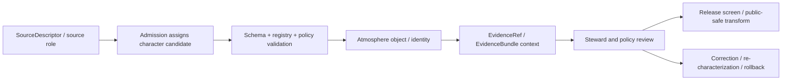

<!-- [KFM_META_BLOCK_V2]
doc_id: kfm://contract/domains/atmosphere/knowledge-character
title: contracts/domains/atmosphere/knowledge_character.md — KnowledgeCharacter Contract
type: contract
version: v0.2
status: draft
owners: OWNER_TBD — Atmosphere steward · Contract steward · Schema steward · Registry steward · Policy steward · Evidence steward · Release steward · Docs steward
created: 2026-06-21
updated: 2026-06-21
policy_label: public; contracts; domains; atmosphere; knowledge-character; semantic-contract; controlled-vocabulary; anti-collapse
tags: [kfm, contracts, atmosphere, air, knowledge-character, controlled-vocabulary, source-role, evidence, policy, validation, release, governance]
related:
  - ./README.md
  - ./domain_feature_identity.md
  - ./domain_layer_descriptor.md
  - ./domain_observation.md
  - ./domain_validation_report.md
  - ./AirObservation.md
  - ./PM25Observation.md
  - ./OzoneObservation.md
  - ./SmokeContext.md
  - ./AODRaster.md
  - ./ForecastContext.md
  - ./AdvisoryContext.md
  - ../../../docs/domains/atmosphere/KNOWLEDGE_CHARACTERS.md
  - ../../../docs/domains/atmosphere/KNOWLEDGE_CHARACTER_REGISTRY.md
  - ../../../docs/domains/atmosphere/OBJECT_FAMILY_MAP.md
  - ../../../docs/domains/atmosphere/POLICY.md
  - ../../../docs/domains/atmosphere/PUBLICATION_POSTURE.md
  - ../../../schemas/contracts/v1/domains/atmosphere/knowledge_character.schema.json
  - ../../../data/registry/sources/atmosphere/knowledge_character.json
  - ../../../policy/domains/atmosphere/
  - ../../../fixtures/domains/atmosphere/knowledge_character/
  - ../../../tools/validators/domains/atmosphere/validate_knowledge_character.py
notes:
  - "Expanded from a planned-path scaffold into the Atmosphere/Air KnowledgeCharacter semantic contract."
  - "The paired schema is PROPOSED and currently has empty properties with additionalProperties enabled."
  - "docs/domains/atmosphere/KNOWLEDGE_CHARACTERS.md is the canonical prose explainer; docs/domains/atmosphere/KNOWLEDGE_CHARACTER_REGISTRY.md is the controlled-vocabulary index."
  - "This contract defines object/contract meaning for a knowledge-character record; it does not replace the docs explainer, registry artifact, schema, policy, validators, fixtures, or release decisions."
  - "Canonical enum values and machine registry home remain open/ADR-class in the docs evidence."
  - "The user-provided Markdown Authoring Agent v2 prompt is treated as authoring guidance, not pasted content."
  - "The Focus Mode consent sentence belongs to Focus Mode / consent documentation and is out of scope for this contract."
[/KFM_META_BLOCK_V2] -->

<a id="top"></a>

# KnowledgeCharacter Contract

> Semantic contract for `KnowledgeCharacter`, the Atmosphere/Air-domain vocabulary record that states what epistemic kind an Atmosphere object is, and prevents observed, regulatory, modeled, remote-sensing, advisory, climate, derived, and site-context records from being silently collapsed into one another.

<p>
  
  
  
  
  
  
</p>

`contracts/domains/atmosphere/knowledge_character.md`

## Quick jumps

[Status](#status) · [Meaning](#meaning) · [Repo fit](#repo-fit) · [Schema posture](#schema-posture) · [Accepted uses](#accepted-uses) · [Exclusions](#exclusions) · [Vocabulary terms](#vocabulary-terms) · [Recommended fields](#recommended-fields) · [Invariants](#invariants) · [Lifecycle](#lifecycle) · [Validation](#validation) · [Authoring-prompt treatment](#authoring-prompt-treatment) · [Consent-pattern disposition](#consent-pattern-disposition) · [Evidence basis](#evidence-basis) · [Rollback](#rollback) · [Definition of done](#definition-of-done)

---

## Status

> [!IMPORTANT]
> **Status:** `draft` / semantic contract  
> **Owner:** `OWNER_TBD`  
> **Contract path:** `contracts/domains/atmosphere/knowledge_character.md`  
> **Schema path:** `schemas/contracts/v1/domains/atmosphere/knowledge_character.schema.json`  
> **Truth posture:** `CONFIRMED` target scaffold, paired schema metadata, vocabulary explainer, registry-index posture, object-family mapping, policy anti-collapse posture, and placeholder machine registry. Canonical enum values, validator behavior, fixture coverage, machine registry home, policy enforcement, API behavior, UI behavior, release workflow, and runtime behavior remain `NEEDS VERIFICATION`.

> [!CAUTION]
> `KnowledgeCharacter` is not a cosmetic display label. In the Atmosphere lane, knowledge character is an anti-collapse control. Missing, unknown, or contradictory character state should fail closed where it affects evidence, policy, release, or public interpretation.

---

## Meaning

`KnowledgeCharacter` identifies the epistemic kind of an Atmosphere/Air object.

It answers the question:

```text
What kind of knowledge is this record allowed to represent?
```

A knowledge character constrains whether a record may be interpreted as a direct observation, agency AQI report, regulatory archive, low-cost sensor reading, model field, remote-sensing mask, climate context, derived fusion product, meteorological context, advisory context, or station/network/site context.

The docs evidence states that knowledge character is constrained by source role, evidence, time, and release state. This contract carries that rule into the `contracts/` lane so schemas, validators, registries, and object contracts have a semantic boundary to point at.

It is not:

- the machine enum artifact by itself;
- the full prose explainer;
- the human registry index;
- the source registry;
- a PolicyDecision;
- a ReleaseManifest;
- a proof or EvidenceBundle;
- a permission to publish;
- a UI badge that can be edited independently of the governed object.

---

## Repo fit

```text
contracts/
└── domains/
    └── atmosphere/
        ├── knowledge_character.md
        ├── domain_feature_identity.md
        ├── domain_layer_descriptor.md
        ├── domain_observation.md
        └── domain_validation_report.md
```

Relationship to adjacent roots:

| Root | Relationship |
|---|---|
| `../../../docs/domains/atmosphere/KNOWLEDGE_CHARACTERS.md` | Canonical prose explainer for meaning, rationale, rules, anti-collapse behavior, lifecycle, and UI/API/AI exposure. |
| `../../../docs/domains/atmosphere/KNOWLEDGE_CHARACTER_REGISTRY.md` | Controlled-vocabulary index; intentionally avoids duplicating the explainer. |
| `../../../docs/domains/atmosphere/OBJECT_FAMILY_MAP.md` | Maps Atmosphere object families to primary or role-dependent knowledge characters. |
| `../../../docs/domains/atmosphere/POLICY.md` | Human-readable policy doctrine and fail-closed posture. |
| `../../../schemas/contracts/v1/domains/atmosphere/knowledge_character.schema.json` | Machine shape scaffold for this contract. |
| `../../../data/registry/sources/atmosphere/knowledge_character.json` | Placeholder machine-registry/location artifact; current content is not a complete registry. |
| `../../../policy/domains/atmosphere/` | Policy bundle home; runtime enforcement remains verification-bound. |
| `../../../fixtures/domains/atmosphere/knowledge_character/` | Proposed fixture home for positive and negative cases. |
| `../../../tools/validators/domains/atmosphere/validate_knowledge_character.py` | Proposed validator path; existence/behavior not verified here. |

---

## Schema posture

The paired schema found for this contract is:

```text
schemas/contracts/v1/domains/atmosphere/knowledge_character.schema.json
```

Current schema evidence:

| Schema fact | Status |
|---|---|
| Schema file exists | `CONFIRMED` |
| Schema title is `Knowledge Character` | `CONFIRMED` |
| Schema status is `PROPOSED` | `CONFIRMED` |
| Schema source doc is `docs/domains/atmosphere/MISSING_OR_PLANNED_FILES.md` | `CONFIRMED` |
| Schema contract doc points to this file | `CONFIRMED` |
| Schema properties are empty | `CONFIRMED` |
| `additionalProperties` is `true` | `CONFIRMED` |
| Machine enum values | `OPEN / NEEDS ADR` |
| Registry home | `OPEN / NEEDS ADR` |
| Validator implementation | `NEEDS VERIFICATION` |

This contract therefore defines semantic expectations. It does not claim the current schema enforces the complete vocabulary, anti-collapse behavior, identity behavior, or release behavior.

---

## Accepted uses

| Use | Allowed? | Rule |
|---|---:|---|
| Defining Atmosphere knowledge-character record meaning | Yes | Must preserve source role, evidence, time, and release-state constraints. |
| Supporting object-family contracts | Yes | Object contracts may reference this vocabulary for anti-collapse boundaries. |
| Supporting schema/validator design | Yes | Schema and validators should enforce accepted enum/registry rules once settled. |
| Supporting policy gates | Conditional | May inform deny/abstain/restrict behavior; it is not PolicyDecision. |
| Supporting release review | Conditional | Character state may be required for public release, but it is not release approval. |
| Re-characterizing a governed record in place | No | Character changes require correction/re-identity flow where identity is affected. |
| Treating a model field as an observation | No | `ATMOSPHERIC_MODEL_FIELD` must not collapse into `OBSERVED_SENSOR`. |
| Treating an AQI report as concentration | No | `PUBLIC_AQI_REPORT` is not raw concentration. |
| Treating AOD or satellite mask as ground PM2.5 | No | `REMOTE_SENSING_MASK` is not ground concentration. |
| Treating advisory context as life-safety instruction | No | `ALERT_AND_ADVISORY_CONTEXT` is referral context only. |

---

## Exclusions

| Does not belong here | Correct home |
|---|---|
| Full prose explainer and rationale | `../../../docs/domains/atmosphere/KNOWLEDGE_CHARACTERS.md`. |
| Controlled-vocabulary index surface | `../../../docs/domains/atmosphere/KNOWLEDGE_CHARACTER_REGISTRY.md`. |
| Machine-readable enum/registry artifact | Accepted registry home after ADR; current placeholder is `../../../data/registry/sources/atmosphere/knowledge_character.json`. |
| JSON Schema shape | `../../../schemas/contracts/v1/domains/atmosphere/knowledge_character.schema.json`. |
| Validator implementation | `../../../tools/validators/domains/atmosphere/validate_knowledge_character.py` or accepted validator home. |
| Policy decision logic | `../../../policy/domains/atmosphere/` and policy decision contracts. |
| Object-family payload fields | Object-specific contracts and schemas. |
| Source rights/cadence/source identity | Source registry and source catalog roots. |
| Release/correction/rollback authority | Release and correction object families. |
| Focus Mode consent pattern | `../../../docs/focus-mode/CONSENT_PATTERN.md` or accepted consent/focus-mode home. |

---

## Vocabulary terms

The docs evidence names the following Atmosphere knowledge-character terms. The exact machine enum casing and whether the umbrella phrase becomes a field name or enum value remain open.

| Term | Contract meaning | Primary collapse risk |
|---|---|---|
| `Knowledge character` | Umbrella concept / field discipline. | Treating character as optional display text. |
| `OBSERVED_SENSOR` | Direct instrument reading. | Model/report/aggregate presented as measured value. |
| `PUBLIC_AQI_REPORT` | Agency-published AQI report. | AQI presented as raw concentration. |
| `REGULATORY_ARCHIVE` | Archived regulatory measurement/determination. | Archive vintage presented as live value. |
| `LOW_COST_SENSOR` | Community/consumer-grade sensor reading. | Public release without correction, caveats, confidence, and limitations. |
| `ATMOSPHERIC_MODEL_FIELD` | NWP/chemical transport/reanalysis/forecast model field. | Model presented as observation. |
| `REMOTE_SENSING_MASK` | Satellite/remote-sensing raster, mask, or proxy. | AOD or mask presented as ground PM2.5. |
| `CLIMATE_ANOMALY_CONTEXT` | Baseline-relative climate normal/anomaly context. | Climate context presented as event observation. |
| `DERIVED_FUSION` | Multi-source derivative/fusion product. | Blended value presented as direct source observation. |
| `METEOROLOGICAL_CONTEXT` | Supporting weather/meteorological context. | Context variable presented as the primary claim. |
| `ALERT_AND_ADVISORY_CONTEXT` | Advisory/referral context. | Advisory context presented as KFM life-safety instruction. |
| `NETWORK_AND_SITE_CONTEXT` | Station, network, siting, or site metadata. | Precise site metadata exposed without review/generalization. |

---

## Recommended fields

The current schema does not require these fields. They are `PROPOSED` semantic requirements for future schema and validator work:

| Field | Meaning |
|---|---|
| `id` | Stable knowledge-character record identity. |
| `version` | Contract/object version. |
| `spec_hash` | Integrity pin for the record or registry snapshot. |
| `code` | Canonical machine value after enum ADR. |
| `label` | Human-readable term. |
| `status` | draft, accepted, deprecated, superseded, or retired. |
| `definition` | Short governed definition. |
| `source_role_constraints` | Allowed source-role relationships. |
| `required_evidence` | Evidence requirements before use in claims, release, or UI. |
| `required_time_fields` | Required time-kind discipline for this character. |
| `release_requirements` | Public release prerequisites and disclosures. |
| `forbidden_collapses` | Characters, object roles, or claim types this value must not impersonate. |
| `policy_refs` | Policy gates related to the character. |
| `validator_refs` | Validators and negative tests that enforce the character. |
| `object_family_refs` | Object families that can use the character. |
| `sensitivity_refs` | Sensitivity/generalization requirements where relevant. |
| `correction_rule` | How to correct or re-characterize a record. |
| `lineage_refs` | Change history, replacement, supersession, or migration references. |

---

## Invariants

`KnowledgeCharacter` must preserve these invariants:

- every governed Atmosphere object that depends on epistemic kind should carry one accepted character once schema/registry work is complete;
- missing or unknown character state remains visible and should fail closed where consequential;
- source role and knowledge character are related but distinct;
- a character is constrained by source role, evidence, time, and release state;
- character state must not be edited in place when identity depends on it;
- re-characterization requires correction, replacement identity, lineage, and rollback posture where material;
- schema validity is not source truth;
- vocabulary acceptance is not release approval;
- policy implications are not PolicyDecision by themselves;
- public rendering must not use character badges to imply proof, authority, or release state beyond the evidence.

---

## Lifecycle



The character travels with the governed object and constrains how the object may be interpreted. It does not replace source role, evidence resolution, validation reports, policy decisions, or release records.

---

## Validation

Before relying on this contract, verify:

- owners are confirmed;
- canonical enum values are accepted through ADR or registry decision;
- machine registry home is accepted;
- schema fields are expanded beyond placeholder status;
- validator implementation exists;
- fixtures cover every accepted term;
- negative fixtures deny AQI-as-concentration, AOD-as-PM2.5, model-as-observation, low-cost-sensor-without-caveat, advisory-as-life-safety, and site-context-without-generalization;
- object-family bindings are accepted or marked role-dependent;
- source-role/knowledge-character distinction is enforced;
- character changes require correction/re-identity lineage where identity depends on character;
- UI/API/AI exposure displays character without implying release or proof state.

---

## Authoring-prompt treatment

The user-provided **KFM Repository Markdown Authoring Agent — Full Operating Prompt v2** was applied as authoring guidance for this revision. It was not pasted into the contract as object content.

No-loss preservation outcome:

| Existing element | Disposition | Reason |
|---|---|---|
| Planned-path scaffold | `REPLACE WITH FULL CONTRACT` | The paired schema points directly to this contract path. |
| Source reference to verification backlog | `KEEP AS LINEAGE` | The scaffold source remains evidence for why the file exists. |
| Schema/policy/fixture/release separation note | `KEEP + EXPAND` | Preserves Directory Rules-style authority separation. |
| Canonical docs vocabulary | `KEEP + LINK` | Uses `KNOWLEDGE_CHARACTERS.md` and `KNOWLEDGE_CHARACTER_REGISTRY.md` instead of duplicating them wholesale. |
| Prompt text | `DO NOT PASTE` | It is operating guidance, not contract semantics. |
| Focus Mode consent sentence | `ROUTE ELSEWHERE` | It belongs to Focus Mode / consent docs. |

---

## Consent-pattern disposition

The pasted Focus Mode consent sentence is out of scope for this contract. Consent may be relevant when an Atmosphere object is rendered in Focus Mode, but `KnowledgeCharacter` only defines epistemic-kind semantics and anti-collapse behavior.

A consent gate may check knowledge character as one input, but consent remains necessary-not-sufficient and does not publish data by itself.

---

## Evidence basis

| Source | Status | Supports | Limits |
|---|---|---|---|
| Prior `contracts/domains/atmosphere/knowledge_character.md` scaffold | `CONFIRMED repo evidence` | Target file existed as planned-path scaffold. | Scaffold was not authoritative content. |
| `schemas/contracts/v1/domains/atmosphere/knowledge_character.schema.json` | `CONFIRMED schema evidence` | Schema exists, is `PROPOSED`, points to this contract, has empty properties, and allows additional properties. | Does not enforce vocabulary. |
| `docs/domains/atmosphere/KNOWLEDGE_CHARACTERS.md` | `CONFIRMED docs evidence` | Defines knowledge character as first-class identity/anti-collapse vocabulary and lists terms/guards. | Notes enum values and implementation remain open/proposed. |
| `docs/domains/atmosphere/KNOWLEDGE_CHARACTER_REGISTRY.md` | `CONFIRMED docs evidence` | States registry-index role, points to explainer, lists controlled vocabulary, and surfaces enum/home open questions. | Docs index, not machine artifact. |
| `data/registry/sources/atmosphere/knowledge_character.json` | `CONFIRMED placeholder` | Placeholder registry-like file exists. | Not a complete machine registry. |
| `docs/domains/atmosphere/OBJECT_FAMILY_MAP.md` | `CONFIRMED doctrine-adjacent doc` | Lists object-family mappings to primary/role-dependent knowledge characters. | Binding remains inferred/proposed where noted. |
| `docs/domains/atmosphere/POLICY.md` | `CONFIRMED policy-doc evidence` | States fail-closed posture and anti-collapse doctrine. | Enforceable policy bundle behavior remains unverified. |
| User-provided authoring prompt v2 | `CONFIRMED user-supplied guidance` | Requires evidence-grounded, implementation-honest Markdown with validation and rollback posture. | Prompt guidance, not implementation proof. |

---

## Rollback

Rollback if this contract is used to claim settled enum values, machine registry completion, validator enforcement, fixture coverage, policy runtime enforcement, release approval, proof closure, UI/API behavior, or implementation maturity that has not been verified.

Rollback target: prior scaffold blob SHA `4132a045269bbfac6a3f7b26e8fc93d748cdef1a`.

---

## Definition of done

- [ ] Owners are confirmed and `OWNER_TBD` is replaced.
- [ ] Canonical enum values are accepted.
- [ ] Machine registry home is accepted.
- [ ] Paired schema is expanded from placeholder status.
- [ ] Registry artifact is generated or manually governed from the accepted enum.
- [ ] Validator and fixtures exist.
- [ ] Negative tests prove anti-collapse denials.
- [ ] Object-family bindings are accepted or marked role-dependent.
- [ ] Source-role and knowledge-character interactions are tested.
- [ ] Re-characterization produces correction/re-identity lineage where required.
- [ ] Public UI/API/AI surfaces show character with evidence/release context and do not treat it as proof or release approval.

<p align="right"><a href="#top">Back to top</a></p>
