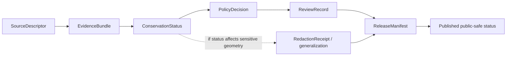

<!-- [KFM_META_BLOCK_V2]
doc_id: kfm://doc/contracts-domains-fauna-conservation-status
title: Conservation Status Contract
family: contracts/domains/fauna
type: semantic-contract
version: v0.2
status: draft; PROPOSED; NEEDS VERIFICATION before promotion
owners: OWNER_TBD — Fauna steward · Contract steward · Source steward · Sensitivity reviewer · Policy steward · Schema steward · Docs steward
created: 2026-06-21
updated: 2026-06-21
policy_label: public; semantic-contract; fauna; conservation-status; source-role-aware; sensitivity-aware; no-publication-authority
related:
  - ./README.md
  - ../../../docs/domains/fauna/README.md
  - ../../../docs/domains/fauna/SOURCES.md
  - ../../../docs/domains/fauna/SOURCE_ROLES.md
  - ../../../docs/domains/fauna/SENSITIVITY.md
  - ../../../docs/domains/fauna/SCHEMAS.md
  - ../../../schemas/contracts/v1/domains/fauna/conservation_status.schema.json
  - ../../../policy/domains/fauna/
  - ../../../policy/sensitivity/fauna/
  - ../../../data/registry/sources/fauna/
  - ../../../release/manifests/
tags: [kfm, contracts, fauna, conservation-status, regulatory, aggregate, source-role, sensitivity, geoprivacy, evidence, policy, release]
notes:
  - "Defines semantic meaning for Fauna conservation-status assertions; it does not define JSON Schema shape or release permission."
  - "The paired schema is currently a PROPOSED scaffold with empty properties and additionalProperties=true; field-level realization remains NEEDS VERIFICATION."
  - "A legal/conservation determination and a ranked conservation summary are different source-role cases; do not collapse regulatory, aggregate, observed, or modeled records."
  - "Sensitive occurrence exposure remains deny-by-default; status can drive sensitivity but does not itself permit public exact-location release."
  - "The user-provided Markdown Authoring Agent v2 prompt was treated as authoring guidance, not pasted into this contract."
[/KFM_META_BLOCK_V2] -->

<a id="top"></a>

# Conservation Status

> Semantic contract for Fauna conservation-status assertions: what status claims mean, which source roles can support them, how they influence sensitivity, and what they never prove by themselves.

<p>
  
  
  
  
  
  
</p>

`contracts/domains/fauna/conservation_status.md`

## Quick jumps

[Meaning](#meaning) · [Repo fit](#repo-fit) · [What this contract asserts](#what-this-contract-asserts) · [What it does not assert](#what-it-does-not-assert) · [Recommended semantics](#recommended-semantics) · [Source-role rules](#source-role-rules) · [Sensitivity and release](#sensitivity-and-release) · [Lifecycle](#lifecycle) · [Validation](#validation) · [Open questions](#open-questions) · [Rollback](#rollback)

---

## Meaning

`ConservationStatus` is a Fauna semantic object that records a **status assertion about a taxon or taxon-scope** from a named source, with provenance, source role, time scope, jurisdiction or assessment scope, and policy implications preserved.

It answers questions like:

- Which source asserted this status?
- Is the assertion a legal/regulatory determination, an aggregate rank, or another status-like source class?
- What taxon identity and jurisdiction/scope does it apply to?
- What temporal validity or assessment date bounds it?
- Does it influence sensitivity, review, public presentation, or release posture?

> [!IMPORTANT]
> A `ConservationStatus` is **not** an occurrence record. It does not prove the taxon was observed at a specific place or time. It may influence whether associated occurrence geometry is sensitive, but it never permits exact sensitive-location publication by itself.

---

## Repo fit

This contract lives in the Fauna semantic-contract lane. It defines meaning; it does not own schema shape, policy decisions, source registry records, fixtures, tests, data, or release manifests.

| Concern | Owning path | Status |
|---|---|---|
| Semantic meaning | `contracts/domains/fauna/conservation_status.md` | This file; draft contract |
| Machine shape | `schemas/contracts/v1/domains/fauna/conservation_status.schema.json` | PROPOSED scaffold; fields not yet defined |
| Source identity, rights, cadence, source role | `data/registry/sources/fauna/` | NEEDS VERIFICATION |
| Sensitivity / geoprivacy admissibility | `policy/sensitivity/fauna/`, `policy/domains/fauna/` | Policy-owned; current observed files include placeholders/scaffolds |
| Valid/invalid fixtures | `fixtures/domains/fauna/` | NEEDS VERIFICATION |
| Tests / validators | `tests/domains/fauna/`, `tools/validators/domains/fauna/` | NEEDS VERIFICATION |
| Release decisions | `release/manifests/`, `release/candidates/fauna/` | Release-owned; not controlled here |

The paired schema currently declares the intended schema identity and links back to this contract, but its `properties` object is empty and `additionalProperties` is true. Therefore this document uses **semantic recommendations**, not claims of implemented validation.

---

## What this contract asserts

A valid `ConservationStatus` contract instance should semantically assert:

1. **Status subject** — the taxon, taxon concept, population, unit, or jurisdictional scope being assessed.
2. **Status source** — the source descriptor, source role, and provenance chain supporting the assertion.
3. **Status class** — whether the assertion is regulatory, aggregate rank, administrative, candidate, or another governed status-bearing class.
4. **Temporal scope** — assessment date, effective date, revision date, version, or validity interval where known.
5. **Jurisdiction or assessment scope** — federal, state, county, watershed, reserve, global, state-rank, or other scoped context where applicable.
6. **Sensitivity implication** — whether the status contributes to deny-by-default, redaction, generalization, or steward-review posture.
7. **Citation posture** — how the claim should be cited or abstained from in public and AI-facing surfaces.

---

## What it does not assert

`ConservationStatus` must not be used as:

| Misuse | Why it is denied |
|---|---|
| An occurrence record | A status determination or rank does not prove a sighting, specimen, acoustic detection, telemetry hit, nest, den, roost, hibernaculum, or spawning site. |
| A public-location permission | Status may increase sensitivity; it never authorizes exact sensitive geometry. |
| A model output | A status record is not a habitat suitability raster, range model, or probability surface. |
| A taxonomic authority by itself | It references a taxon identity but does not replace taxon/crosswalk contracts. |
| A source descriptor | Rights, cadence, license, and source-role assignment live in source records. |
| A policy decision | Policy decides allow/deny/restrict/abstain; this contract defines meaning only. |
| A release state | Release manifests, review records, redaction receipts, correction notices, and rollback cards remain separate. |

> [!CAUTION]
> The most dangerous collapse is treating a conservation status as a confirmed occurrence. A listed or ranked taxon may be relevant to a place, but the status itself is not a place-time observation.

---

## Recommended semantics

The paired JSON Schema is still a scaffold, so the following fields are **PROPOSED semantic expectations** for a future reviewed schema or fixture set.

| Semantic field | Meaning | Required before promotion? |
|---|---|---|
| `id` | Deterministic status assertion identity | YES — unless schema adopts a different identity field |
| `taxon_ref` | Reference to a `Taxon` or taxon concept | YES |
| `taxon_crosswalk_ref` | Optional crosswalk when the source uses a different taxonomic backbone | SHOULD, when needed |
| `source_descriptor_ref` | Source identity, rights, cadence, and source role | YES |
| `source_role` | Canonical role for this assertion (`regulatory`, `aggregate`, etc.) | YES |
| `status_code` | Source-native status value or rank | YES |
| `status_label` | Human-readable label | SHOULD |
| `status_system` | Source/status vocabulary or ranking system | YES |
| `jurisdiction_scope` | Jurisdiction or assessment scope | YES, when applicable |
| `temporal_scope` | Effective, assessed, revised, or versioned time | YES |
| `evidence_ref` | Pointer to EvidenceBundle/EvidenceRef supporting the status assertion | YES before public or AI-authoritative use |
| `sensitivity_implication` | Whether status changes sensitivity/review/release posture | SHOULD |
| `policy_decision_ref` | Policy result when status affects publication | REQUIRED for release-affecting use |
| `review_record_ref` | Steward/domain review where needed | REQUIRED for sensitive/release-affecting use |
| `correction_notice_ref` | Correction lineage when status is superseded or fixed | SHOULD, when applicable |

### Identity guidance

`ConservationStatus` identity should be deterministic and scoped to avoid merging unlike claims:

```text
conservation_status_id = hash(
  taxon_identity + source_id + status_system + jurisdiction_scope + temporal_scope + source_native_status_id
)
```

This is a **PROPOSED identity recipe** until the paired schema and validator adopt a concrete algorithm.

---

## Source-role rules

Fauna source-role discipline is the controlling anti-collapse rule for this contract.

| Status source pattern | Canonical source role | Contract posture |
|---|---|---|
| Legal listing, designation, or formal conservation determination | `regulatory` | May support regulatory/contextual claims; never observed occurrence claims. |
| Global/state rank or summarized conservation rank | `aggregate` | May support sensitivity and summary claims; never per-place occurrence claims. |
| Agency roster or administrative compilation | `administrative` | May support administrative status context; needs evidence and rights checks. |
| Provisional imported status awaiting review | `candidate` | Must not publish as authoritative until promoted through review. |
| Generated/reconstructed status label | `synthetic` | Must carry reality-boundary disclosure; cannot be treated as observed or regulatory. |

A status-bearing source can be authoritative for a **status claim** while still being unusable for an **occurrence claim**. The claim class must travel with the source role.

---

## Sensitivity and release

Conservation status can affect public safety posture because rare, threatened, endangered, sensitive, or steward-controlled taxa may require redaction, generalization, aggregation, delayed release, or denial.

Rules:

- Sensitive exact occurrence geometry remains deny-by-default.
- A status record may justify review or higher sensitivity, but it does not release coordinates.
- A public status summary may be allowed while exact location details are denied.
- Re-identifying joins are blocked unless reviewed and receipted.
- Public clients receive only released, policy-safe representations through governed interfaces.

> [!WARNING]
> Do not include exact coordinates, nest/den/roost/hibernacula/spawning-site identifiers, transform radii, fuzzing parameters, private-land details, or steward-controlled record IDs in this contract or examples. Even documentation can become an exposure aid.

### Release dependency chain

A public-safe conservation-status presentation needs the release path appropriate to its significance:



---

## Lifecycle

| Phase | Expected handling |
|---|---|
| RAW | Imported status source records remain source-bound and unpublished. |
| WORK / QUARANTINE | Candidate status assertions are normalized, source-role-checked, rights-checked, and reviewed. |
| PROCESSED | Reviewed status assertion can receive deterministic identity and evidence references. |
| CATALOG / TRIPLET | Status can support inspectable claims, sensitivity decisions, and graph edges only with resolved evidence and source role. |
| PUBLISHED | Only public-safe status summaries or policy-approved representations are exposed. Exact sensitive locations remain denied unless separately transformed and released. |
| CORRECTION | Superseded, withdrawn, revised, or misclassified statuses require CorrectionNotice and rollback consideration. |

---

## Validation

Before this contract is promoted beyond draft:

- [ ] Define and review the paired schema fields in `schemas/contracts/v1/domains/fauna/conservation_status.schema.json`.
- [ ] Add valid and invalid fixtures for regulatory, aggregate, administrative, candidate, and synthetic status cases.
- [ ] Add negative tests proving status cannot be cited as observed occurrence evidence.
- [ ] Add sensitivity tests proving status-driven redaction/generalization policy blocks exact sensitive geometry.
- [ ] Confirm source descriptors for each admitted status source family.
- [ ] Confirm rights and terms for each source family before activation.
- [ ] Confirm public status rendering uses governed API/released artifacts only.
- [ ] Confirm correction and rollback behavior for superseded or withdrawn statuses.

---

## Open questions

| ID | Question | Status |
|---|---|---|
| OQ-FAUNA-CS-001 | Which status vocabularies are canonical for first implementation? | NEEDS VERIFICATION |
| OQ-FAUNA-CS-002 | Does `ConservationStatus` store source-native rank labels, normalized rank labels, or both? | PROPOSED — likely both, pending schema review |
| OQ-FAUNA-CS-003 | Which status values trigger sensitivity-tier changes, and where is that policy encoded? | NEEDS VERIFICATION in `policy/sensitivity/fauna/` |
| OQ-FAUNA-CS-004 | How are superseded or withdrawn statuses represented in correction lineage? | NEEDS VERIFICATION |
| OQ-FAUNA-CS-005 | Which public UI surfaces can show status summaries without exposing sensitive geometry? | NEEDS VERIFICATION |

---

## Evidence basis

| Source | Status | Supports | Limits |
|---|---|---|---|
| `contracts/domains/fauna/README.md` | CONFIRMED repo evidence | This lane owns semantic Markdown only and excludes schemas, policy, fixtures, tests, data, release, and UI/runtime code. | Does not define individual `ConservationStatus` fields. |
| `contracts/domains/fauna/conservation_status.md` prior version | CONFIRMED repo evidence | Target existed as a scaffold and named itself planned/expected. | Did not contain authoritative semantics. |
| `schemas/contracts/v1/domains/fauna/conservation_status.schema.json` | CONFIRMED repo evidence | Paired schema exists and links to this contract. | Schema is PROPOSED, has empty properties, and does not validate field-level semantics yet. |
| `docs/domains/fauna/SOURCES.md` | CONFIRMED repo evidence | Source-role is first-class identity; canonical role enum and anti-collapse rules. | Descriptor records and source rights remain outside this contract. |
| `docs/domains/fauna/SOURCE_ROLES.md` | CONFIRMED repo evidence | Distinguishes regulatory/aggregate/observed/modeled/candidate/synthetic role cases and warns against aggregator/source-role collapse. | Crosswalk, not final descriptor authority. |
| `docs/domains/fauna/SENSITIVITY.md` | CONFIRMED repo evidence | Sensitive Fauna surfaces fail closed; T4 defaults; geoprivacy, RedactionReceipt, ReviewRecord, PolicyDecision posture. | Binding policy remains outside contracts. |
| `docs/domains/fauna/SCHEMAS.md` | CONFIRMED repo evidence | Shape/meaning/policy/proof split and schema-home separation. | Does not implement the paired schema. |

---

## Rollback

Rollback if this contract is used to publish unsupported status claims, infer occurrence evidence from regulatory or aggregate status, expose sensitive exact geometry, bypass source-role review, or treat the scaffolded schema as implemented validation.

Rollback target: prior scaffold blob SHA `55cfb4103a634205faa38275e4b8b1d57ab0557a`.

<p align="right"><a href="#top">Back to top</a></p>
