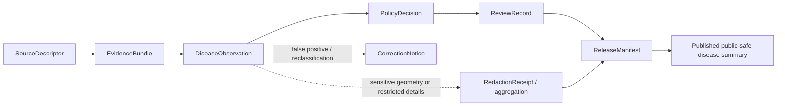

<!-- [KFM_META_BLOCK_V2]
doc_id: kfm://doc/contracts-domains-fauna-disease-observation
title: Disease Observation Contract
family: contracts/domains/fauna
type: semantic-contract
version: v0.2
status: draft; PROPOSED; NEEDS VERIFICATION before promotion
owners: OWNER_TBD — Fauna steward · Wildlife-health steward · Contract steward · Source steward · Sensitivity reviewer · Policy steward · Schema steward · Docs steward
created: 2026-06-21
updated: 2026-06-21
policy_label: public; semantic-contract; fauna; disease-observation; wildlife-health; source-role-aware; sensitivity-aware; no-publication-authority
tags: [kfm, contracts, fauna, disease-observation, wildlife-health, pathogen, surveillance, source-role, sensitivity, geoprivacy, evidence, policy, release]
related:
  - ./README.md
  - ./conservation_status.md
  - ../../../docs/domains/fauna/README.md
  - ../../../docs/domains/fauna/SOURCES.md
  - ../../../docs/domains/fauna/SOURCE_ROLES.md
  - ../../../docs/domains/fauna/SENSITIVITY.md
  - ../../../docs/domains/fauna/SCHEMAS.md
  - ../../../schemas/contracts/v1/domains/fauna/disease_observation.schema.json
  - ../../../policy/domains/fauna/
  - ../../../policy/sensitivity/fauna/
  - ../../../data/registry/sources/fauna/
  - ../../../fixtures/domains/fauna/
  - ../../../tests/domains/fauna/
  - ../../../release/manifests/
notes:
  - "Defines semantic meaning for Fauna disease/pathogen surveillance observations; it does not define JSON Schema shape or release permission."
  - "The paired schema is currently a PROPOSED scaffold with empty properties and additionalProperties=true; field-level realization remains NEEDS VERIFICATION."
  - "A disease observation is not a clinical diagnosis, public-health alert, veterinary advice, mortality proof, occurrence proof, or enforcement trigger by itself."
  - "Sensitive taxa, exact sites, outbreak-like clusters, private-land context, stewardship records, and re-identifying joins remain deny-by-default unless reviewed, transformed, receipted, and released."
  - "The user-provided Markdown Authoring Agent v2 prompt was treated as authoring guidance, not pasted into this contract."
[/KFM_META_BLOCK_V2] -->

<a id="top"></a>

# Disease Observation

> Semantic contract for Fauna disease/pathogen surveillance observations: what a disease observation means, what source roles can support it, how it relates to mortality and occurrence evidence, and which sensitivity and release controls must remain in force.

<p>
  
  
  
  
  
  
</p>

`contracts/domains/fauna/disease_observation.md`

## Quick jumps

[Meaning](#meaning) · [Repo fit](#repo-fit) · [What this contract asserts](#what-this-contract-asserts) · [What it does not assert](#what-it-does-not-assert) · [Recommended semantics](#recommended-semantics) · [Source-role rules](#source-role-rules) · [Sensitivity and release](#sensitivity-and-release) · [Lifecycle](#lifecycle) · [Validation](#validation) · [Open questions](#open-questions) · [Evidence basis](#evidence-basis) · [Rollback](#rollback)

---

## Meaning

`DiseaseObservation` is a Fauna semantic object that records **source-bound evidence of disease, pathogen, syndrome, toxin, parasite, abnormal condition, or surveillance finding** associated with an animal taxon, individual, sample, carcass, site, monitoring event, or aggregate surveillance unit.

It answers questions like:

- What disease/pathogen/syndrome condition was observed or reported?
- Which taxon, host, sample, site, or monitoring event does the record concern?
- Which source asserted the observation, and with what source role?
- What method, diagnostic confidence, or evidence class supports the assertion?
- What spatial and temporal scope can be safely cited?
- Does the record create sensitivity, geoprivacy, rights, stewardship, or release restrictions?

> [!IMPORTANT]
> A `DiseaseObservation` is **evidence of a disease/pathogen-related observation**, not a public-health alert, clinical diagnosis, veterinary recommendation, enforcement trigger, population-level impact claim, or proof that an exact location can be published.

---

## Repo fit

This contract lives in the Fauna semantic-contract lane. It defines meaning; it does not own schema shape, policy decisions, source registry records, fixtures, tests, data, release manifests, public alerting, or UI behavior.

| Concern | Owning path | Status |
|---|---|---|
| Semantic meaning | `contracts/domains/fauna/disease_observation.md` | This file; draft contract |
| Machine shape | `schemas/contracts/v1/domains/fauna/disease_observation.schema.json` | PROPOSED scaffold; fields not yet defined |
| Source identity, rights, cadence, source role | `data/registry/sources/fauna/` | NEEDS VERIFICATION |
| Sensitivity / geoprivacy admissibility | `policy/sensitivity/fauna/`, `policy/domains/fauna/` | Policy-owned; current observed files include placeholders/scaffolds |
| Valid/invalid fixtures | `fixtures/domains/fauna/` | NEEDS VERIFICATION |
| Tests / validators | `tests/domains/fauna/`, `tools/validators/domains/fauna/` | NEEDS VERIFICATION |
| Release decisions | `release/manifests/`, `release/candidates/fauna/` | Release-owned; not controlled here |

The paired schema currently declares the intended schema identity and links back to this contract, but its `properties` object is empty and `additionalProperties` is true. Therefore this document uses **semantic recommendations**, not claims of implemented validation.

---

## What this contract asserts

A valid `DiseaseObservation` contract instance should semantically assert:

1. **Observation subject** — the taxon, individual, sample, carcass, monitoring event, site, or aggregate unit being observed.
2. **Disease/pathogen concept** — the condition, pathogen, syndrome, toxin, parasite, diagnostic category, or source-native code being reported.
3. **Evidence class** — lab-confirmed, field-observed, suspected, negative test, environmental detection, mortality-associated finding, report-only, or other governed evidence type.
4. **Source role** — observed, regulatory, aggregate, administrative, candidate, synthetic, or modeled where applicable.
5. **Method and confidence** — diagnostic method, specimen/sample basis, observation method, confidence, uncertainty, or limitations when available.
6. **Spatial and temporal scope** — the safe geometry/time scope that can support a claim, not necessarily the raw exact location/time.
7. **Sensitivity implication** — whether the record triggers steward review, geoprivacy, embargo, aggregation, delayed publication, denial, or restricted access.
8. **Citation posture** — how the claim should be cited or abstained from in public and AI-facing surfaces.

---

## What it does not assert

`DiseaseObservation` must not be used as:

| Misuse | Why it is denied |
|---|---|
| A clinical diagnosis | KFM is not a medical, veterinary, diagnostic, or treatment authority. |
| A public-health or emergency alert | Alerts belong to qualified external authorities; KFM may cite released evidence but must not act as the alerting source. |
| A mortality proof by itself | Disease context and mortality evidence are related but not identical; mortality needs its own evidence and contract. |
| A species occurrence record by itself | A disease record can reference a host/taxon, but it does not automatically prove a public occurrence at exact place/time. |
| A population impact conclusion | Disease presence does not prove population decline, outbreak severity, spread, crop/livestock impact, or ecosystem effect without additional evidence. |
| A public-location permission | Disease-sensitive or steward-controlled locations can remain restricted even when the disease summary is releasable. |
| A source descriptor | Rights, cadence, license, and source-role assignment live in source records. |
| A policy decision or release state | Policy, review, redaction, release, correction, and rollback remain separate object families. |

> [!CAUTION]
> Disease observations can be high-risk even when biologically important. Exact locations, private-land context, steward-controlled records, rare taxa, outbreak-like clusters, and re-identifying joins must fail closed until policy, review, transform, receipt, and release support exist.

---

## Recommended semantics

The paired JSON Schema is still a scaffold, so the following fields are **PROPOSED semantic expectations** for a future reviewed schema or fixture set.

| Semantic field | Meaning | Required before promotion? |
|---|---|---|
| `id` | Deterministic disease-observation identity | YES — unless schema adopts a different identity field |
| `taxon_ref` | Reference to a `Taxon` or host taxon concept | SHOULD, when host/taxon is known |
| `observation_subject_ref` | Individual, sample, carcass, monitoring event, site, or aggregate unit | YES |
| `disease_concept` | Source-native or normalized disease/pathogen/syndrome concept | YES |
| `disease_concept_system` | Vocabulary, authority, source list, or local code system | SHOULD |
| `evidence_class` | Confirmed, suspected, negative, environmental, report-only, etc. | YES |
| `method` | Lab, field, passive report, necropsy, molecular assay, visual syndrome, environmental sampling, etc. | SHOULD |
| `confidence` | Source-stated confidence, uncertainty, or limitation | SHOULD |
| `source_descriptor_ref` | Source identity, rights, cadence, and source role | YES |
| `source_role` | Canonical role for the assertion | YES |
| `observed_time` | When the observation/sample/event happened | YES when known |
| `source_time` | Source payload vintage or retrieval time | SHOULD |
| `geometry_ref` | Safe spatial scope, not necessarily raw exact geometry | SHOULD |
| `evidence_ref` | Pointer to EvidenceBundle/EvidenceRef supporting the disease observation | YES before public or AI-authoritative use |
| `sensitivity_implication` | Whether the record changes release/review posture | SHOULD |
| `policy_decision_ref` | Policy result when disease observation affects publication | REQUIRED for release-affecting use |
| `review_record_ref` | Steward/domain review where needed | REQUIRED for sensitive/release-affecting use |
| `redaction_receipt_ref` | Generalization/redaction receipt for public-safe geometry | REQUIRED when raw geometry is transformed or withheld |
| `correction_notice_ref` | Correction lineage for false positives, reclassifications, or withdrawn reports | SHOULD, when applicable |

### Identity guidance

`DiseaseObservation` identity should be deterministic and scoped to avoid merging unlike records:

```text
disease_observation_id = hash(
  source_id + source_native_record_id + observation_subject + disease_concept + temporal_scope + normalized_digest
)
```

This is a **PROPOSED identity recipe** until the paired schema and validator adopt a concrete algorithm.

---

## Source-role rules

Fauna source-role discipline is the controlling anti-collapse rule for this contract.

| Disease-observation source pattern | Canonical source role | Contract posture |
|---|---|---|
| Lab-confirmed sample, necropsy result, field survey, or observed pathogen/syndrome event | `observed` | Can support a disease-observation claim if evidence and rights resolve. |
| Formal disease designation, quarantine zone, agency order, or regulatory determination | `regulatory` | Can support regulatory context; not an observed event by itself. |
| Summarized surveillance dashboard, count, rate, county/state rollup, or published aggregate | `aggregate` | Can support aggregate summary claims; not exact event or site truth. |
| Agency roster, case table, or administrative compilation | `administrative` | Requires source-role and rights checks before use. |
| Imported, watcher-detected, or unreviewed disease hit | `candidate` | Must not publish as authoritative until promoted through review. |
| Modeled spread, suitability, risk surface, or predicted pathogen distribution | `modeled` | Must carry model identity, ModelRunReceipt/uncertainty where adopted; never observed. |
| Generated or reconstructed historical disease statement | `synthetic` | Must carry reality-boundary disclosure; cannot be treated as observed or regulatory. |

A source can be authoritative for a **regulatory disease boundary** while being unusable for an **observed case**. A dashboard can be useful for **aggregate context** while being unusable for exact location claims.

---

## Sensitivity and release

Disease observations can affect public safety posture because they may involve sensitive taxa, exact site geometry, private land, steward-controlled records, disease clusters, pathogen-sensitive records, or misleading public-health/veterinary implications.

Rules:

- Sensitive exact occurrence or site geometry remains deny-by-default.
- Disease context may justify review, embargo, aggregation, delayed publication, or denial.
- Public summaries may be allowed while exact host/sample/site details remain denied.
- Negative tests and suspected cases require clear evidence class and limitation language.
- Re-identifying joins are blocked unless reviewed and receipted.
- KFM does not issue health, veterinary, livestock, or emergency guidance.
- Public clients receive only released, policy-safe representations through governed interfaces.

> [!WARNING]
> Do not include exact sensitive locations, private-land identifiers, nest/den/roost/hibernacula/spawning-site identifiers, sample-chain details that identify restricted sites, transform radii, fuzzing parameters, steward-controlled record IDs, or instructions for locating disease-affected wildlife in this contract or examples.

### Release dependency chain

A public-safe disease-observation presentation needs the release path appropriate to its significance:



---

## Lifecycle

| Phase | Expected handling |
|---|---|
| RAW | Imported disease reports, lab payloads, surveillance extracts, or field notes remain source-bound and unpublished. |
| WORK / QUARANTINE | Candidate disease observations are normalized, source-role-checked, evidence-checked, rights-checked, and sensitivity-reviewed. |
| PROCESSED | Reviewed disease observation can receive deterministic identity, evidence references, method/confidence context, and policy posture. |
| CATALOG / TRIPLET | Disease observation can support inspectable claims and graph edges only with resolved evidence, source role, and safe spatial/temporal scope. |
| PUBLISHED | Only public-safe summaries or policy-approved representations are exposed; exact sensitive locations and restricted details remain denied unless separately transformed and released. |
| CORRECTION | False positives, lab updates, disease reclassification, duplicate reports, withdrawn records, or corrected host/taxon assignments require CorrectionNotice and rollback consideration. |

---

## Validation

Before this contract is promoted beyond draft:

- [ ] Define and review the paired schema fields in `schemas/contracts/v1/domains/fauna/disease_observation.schema.json`.
- [ ] Add valid and invalid fixtures for observed, regulatory, aggregate, administrative, candidate, modeled, and synthetic disease cases.
- [ ] Add negative tests proving disease observation cannot be cited as clinical diagnosis, public-health alert, mortality proof, occurrence proof, or population-impact conclusion.
- [ ] Add sensitivity tests proving exact sensitive geometry and restricted disease details fail closed.
- [ ] Confirm source descriptors for each admitted disease/pathogen surveillance source family.
- [ ] Confirm rights, license, cadence, and redistribution terms for each source family before activation.
- [ ] Confirm public disease rendering uses governed API/released artifacts only.
- [ ] Confirm correction and rollback behavior for false positives, reclassifications, duplicate records, or withdrawn disease reports.

---

## Open questions

| ID | Question | Status |
|---|---|---|
| OQ-FAUNA-DIS-001 | Which disease/pathogen vocabularies are canonical for first implementation? | NEEDS VERIFICATION |
| OQ-FAUNA-DIS-002 | Which evidence classes are admitted: confirmed, suspected, negative, environmental, report-only, or other? | PROPOSED — pending schema/policy review |
| OQ-FAUNA-DIS-003 | Which disease/pathogen conditions trigger sensitivity-tier changes, embargo, or aggregation? | NEEDS VERIFICATION in `policy/sensitivity/fauna/` |
| OQ-FAUNA-DIS-004 | How are false positives, lab updates, and disease reclassifications represented in correction lineage? | NEEDS VERIFICATION |
| OQ-FAUNA-DIS-005 | Which public UI surfaces can show disease summaries without creating public-health, veterinary, or exact-location implications? | NEEDS VERIFICATION |
| OQ-FAUNA-DIS-006 | How should disease observations link to mortality observations without collapsing the two object families? | NEEDS VERIFICATION |

---

## Evidence basis

| Source | Status | Supports | Limits |
|---|---|---|---|
| `contracts/domains/fauna/README.md` | CONFIRMED repo evidence | This lane owns semantic Markdown only and lists `disease_observation.md` under observation/evidence meaning contracts. | Does not define individual `DiseaseObservation` fields. |
| `contracts/domains/fauna/disease_observation.md` prior version | CONFIRMED repo evidence | Target existed as a scaffold and named itself planned/expected. | Did not contain authoritative semantics. |
| `schemas/contracts/v1/domains/fauna/disease_observation.schema.json` | CONFIRMED repo evidence | Paired schema exists and links to this contract. | Schema is PROPOSED, has empty properties, and does not validate field-level semantics yet. |
| `docs/domains/fauna/SOURCE_ROLES.md` | CONFIRMED repo evidence | Distinguishes observed, regulatory, aggregate, administrative, candidate, modeled, and synthetic role cases and warns against source-role collapse. | Crosswalk, not final descriptor authority. |
| `docs/domains/fauna/SENSITIVITY.md` | CONFIRMED repo evidence | Sensitive Fauna surfaces fail closed; T4 defaults; geoprivacy, RedactionReceipt, ReviewRecord, PolicyDecision posture. | Binding policy remains outside contracts. |
| `docs/domains/fauna/SCHEMAS.md` | CONFIRMED repo evidence | Shape/meaning/policy/proof split; schema-home separation; lists DiseaseObservation schema as proposed pathogen surveillance evidence. | Does not implement the paired schema. |

---

## Rollback

Rollback if this contract is used to publish unsupported disease claims, infer clinical diagnosis or public-health alert authority, infer occurrence or mortality proof without separate evidence, expose sensitive exact geometry, bypass source-role review, or treat the scaffolded schema as implemented validation.

Rollback target: prior scaffold blob SHA `b17e1c9f31fdbbaeedad3b63f48359766faa3496`.

<p align="right"><a href="#top">Back to top</a></p>
