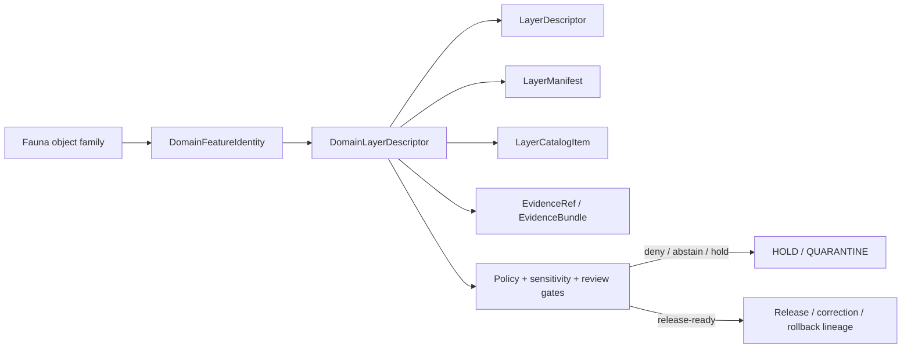

<!-- [KFM_META_BLOCK_V2]
doc_id: kfm://doc/contracts-domains-fauna-domain-layer-descriptor
title: Fauna Domain Layer Descriptor Contract
type: semantic-contract
version: v0.2
status: draft; PROPOSED; NEEDS VERIFICATION before promotion
owners: OWNER_TBD — Fauna steward · Layer steward · Contract steward · Source steward · Sensitivity reviewer · Policy steward · Schema steward · Validation steward · Release steward · Docs steward
created: 2026-06-21
updated: 2026-06-21
policy_label: public; semantic-contract; fauna; domain-layer-descriptor; map-layer; release-aware; sensitivity-aware; no-publication-authority
tags: [kfm, contracts, fauna, domain-layer-descriptor, layer, map, catalog, source-role, sensitivity, geoprivacy, evidence, policy, release, governance]
related:
  - ./README.md
  - ./domain_feature_identity.md
  - ./conservation_status.md
  - ./disease_observation.md
  - ../../../contracts/data/layer_descriptor.md
  - ../../../contracts/data/layer_manifest.md
  - ../../../contracts/data/layer_catalog_item.md
  - ../../../docs/domains/fauna/README.md
  - ../../../docs/domains/fauna/SOURCES.md
  - ../../../docs/domains/fauna/SOURCE_ROLES.md
  - ../../../docs/domains/fauna/SENSITIVITY.md
  - ../../../docs/domains/fauna/SCHEMAS.md
  - ../../../schemas/contracts/v1/domains/fauna/domain_layer_descriptor.schema.json
  - ../../../data/registry/layers/
  - ../../../data/registry/sources/fauna/
  - ../../../policy/domains/fauna/
  - ../../../policy/sensitivity/fauna/
  - ../../../fixtures/domains/fauna/domain_layer_descriptor/
  - ../../../tests/domains/fauna/
  - ../../../release/manifests/
notes:
  - "Expanded from a greenfield scaffold into a Fauna layer-meaning semantic contract."
  - "The paired schema is a PROPOSED stub requiring only id and allowing additional properties; full field enforcement remains NEEDS VERIFICATION."
  - "This domain contract is a Fauna-specific layer meaning adapter and must not duplicate generic LayerDescriptor, LayerManifest, or LayerCatalogItem authority."
  - "Fauna layer descriptors must preserve object-family meaning, source role, evidence, sensitivity, geoprivacy, lifecycle, release, correction, and rollback boundaries."
  - "The user-provided Markdown Authoring Agent v2 prompt was treated as authoring guidance, not pasted into this contract."
[/KFM_META_BLOCK_V2] -->

# Fauna Domain Layer Descriptor

> Semantic contract for the Fauna-domain layer descriptor: the object that carries Fauna meaning, source-role posture, sensitivity posture, evidence references, release constraints, and public-safe display limits into governed map, catalog, and layer-selection surfaces.

  
  
  
  
  
  

`contracts/domains/fauna/domain_layer_descriptor.md`

## Quick jumps

[Status](#status) · [Meaning](#meaning) · [Repo fit](#repo-fit) · [Schema posture](#schema-posture) · [Accepted uses](#accepted-uses) · [Exclusions](#exclusions) · [Recommended semantics](#recommended-semantics) · [Layer boundary](#layer-boundary) · [Invariants](#invariants) · [Lifecycle](#lifecycle) · [Validation](#validation) · [Open questions](#open-questions) · [Evidence basis](#evidence-basis) · [Rollback](#rollback)

---

## Status

> [!IMPORTANT]
> **Status:** `draft` / semantic contract  
> **Contract path:** `contracts/domains/fauna/domain_layer_descriptor.md`  
> **Schema path:** `schemas/contracts/v1/domains/fauna/domain_layer_descriptor.schema.json`  
> **Truth posture:** target path, prior scaffold, paired schema metadata, Fauna contract-lane split, Fauna schema-home split, source-role crosswalk, and sensitivity doctrine are CONFIRMED from current repo evidence. Full field validation, fixtures, validators, policy behavior, layer registry behavior, release workflow, public API behavior, rendered UI behavior, and runtime enforcement remain NEEDS VERIFICATION.

> [!CAUTION]
> This contract defines Fauna layer meaning only. It does **not** authorize raw data access, exact sensitive-location display, layer payload generation, renderer behavior, policy approval, public release, proof closure, or KFM-as-alert/enforcement behavior.

---

## Meaning

`DomainLayerDescriptor` is the Fauna-specific layer meaning adapter.

It describes how a Fauna layer should carry domain meaning into governed map/catalog/layer-selection surfaces while preserving:

- object-family meaning;
- source role;
- taxonomic, occurrence, range, status, disease, mortality, monitoring, invasive-species, or sensitive-site scope;
- spatial/support scope and geoprivacy posture;
- temporal scope;
- evidence references;
- sensitivity tier or review posture;
- policy and release references;
- correction and rollback lineage.

It is narrower than the generic data-layer contracts:

- `LayerDescriptor` owns renderer-facing layer descriptor semantics.
- `LayerManifest` owns released/candidate layer-version payload and trust-spine semantics.
- `LayerCatalogItem` owns catalog/list metadata and trust-badge inputs.
- `DomainLayerDescriptor` owns Fauna-domain meaning and constraints that those layer surfaces must preserve.

A Fauna layer descriptor is therefore a **meaning adapter**, not a layer payload, not a release manifest, not proof closure, not policy approval, not a source registry record, and not a public-safe location permission.

---

## Repo fit

The Fauna contract README places semantic meaning in `contracts/domains/fauna/` while keeping machine shape, policy, source registry, fixtures, tests, data lifecycle, and release decisions in separate responsibility roots.

| Responsibility | Fauna lane path | This contract's role |
|---|---|---|
| Fauna layer meaning | `contracts/domains/fauna/domain_layer_descriptor.md` | Owned here |
| Generic renderer boundary | `contracts/data/layer_descriptor.md` | Linked only; not duplicated |
| Layer-version manifest | `contracts/data/layer_manifest.md` | Linked only; not duplicated |
| Catalog/list metadata | `contracts/data/layer_catalog_item.md` | Linked only; not duplicated |
| Machine schema shape | `schemas/contracts/v1/domains/fauna/domain_layer_descriptor.schema.json` | Linked only |
| Layer registry | `data/registry/layers/` | Required downstream registry home |
| Source identity and source role | `data/registry/sources/fauna/` | Required upstream source support |
| Sensitivity and geoprivacy policy | `policy/sensitivity/fauna/`, `policy/domains/fauna/` | Required admissibility gate |
| Evidence/proof support | `data/proofs/`, `tests/domains/fauna/`, `fixtures/domains/fauna/` | Required before consequential use |
| Release/correction/rollback | `release/`, correction contracts, receipts | Required downstream governance |

This split prevents a Fauna layer descriptor from quietly becoming a schema, payload, source registry, policy bundle, release manifest, public truth store, or UI implementation.

---

## Schema posture

The paired schema currently exists as a **PROPOSED stub**.

| Schema fact | Current evidence |
|---|---|
| Schema file path | `schemas/contracts/v1/domains/fauna/domain_layer_descriptor.schema.json` |
| Schema title | `domain_layer_descriptor` |
| Declared properties | `spec_hash`, `id`, `version` |
| Required fields | `id` only |
| Additional properties | `true` |
| Fixture root | `fixtures/domains/fauna/domain_layer_descriptor/` in schema metadata |
| Validator path | `tools/validators/domains/fauna/validate_domain_layer_descriptor.py` in schema metadata |
| Policy path | `policy/domains/fauna/` in schema metadata |

Because the schema is not field-complete, this contract defines **semantic expectations** for future schema, fixtures, validators, policy tests, layer-registry entries, release checks, and UI/API use. It does not claim the current schema enforces the full Fauna layer model.

---

## Accepted uses

| Use | Allowed? | Rule |
|---|---:|---|
| Binding a map/catalog layer to Fauna object-family meaning | Yes | Must identify the Fauna object family or families represented. |
| Carrying source-role posture into a layer descriptor | Yes | Must preserve observed, regulatory, aggregate, administrative, candidate, modeled, or synthetic distinctions. |
| Carrying sensitivity or geoprivacy posture | Yes | Must preserve fail-closed handling for sensitive taxa, exact sites, steward-controlled records, and re-identifying joins. |
| Supporting governed map/catalog/Focus Mode layer selection | Conditional | Requires released or review-approved candidate context and public-safe transforms. |
| Linking to generic layer contracts | Yes | Must not duplicate `LayerDescriptor`, `LayerManifest`, or `LayerCatalogItem` meaning. |
| Carrying public caveats and disclosure requirements | Yes | Must retain caveats for model layers, aggregate status layers, restricted exact geometry, candidate layers, and source-role limits. |
| Acting as renderer descriptor by itself | No | Generic `LayerDescriptor` owns renderer-facing semantics. |
| Acting as layer payload or manifest | No | `LayerManifest` and artifact roots own payload/version manifest. |
| Acting as proof or policy/release approval | No | Evidence and release authorities remain separate. |
| Acting as exact sensitive-location approval | No | Sensitivity policy, RedactionReceipt, ReviewRecord, PolicyDecision, and ReleaseManifest govern exposure. |

---

## Exclusions

| Does not belong in `DomainLayerDescriptor` | Correct home |
|---|---|
| Full layer payload, tiles, PMTiles, GeoParquet, rasters, vectors, or feature data | Data lifecycle, artifact, tile, or release roots |
| Generic renderer-facing descriptor meaning | `contracts/data/layer_descriptor.md` |
| Layer-version manifest meaning | `contracts/data/layer_manifest.md` |
| Catalog/list layer metadata | `contracts/data/layer_catalog_item.md` |
| Full Fauna object payload | Object-family contracts and data lifecycle roots |
| Source descriptor, source license, cadence, or rights record | `data/registry/sources/fauna/` |
| EvidenceBundle/proof content | Evidence/proof roots |
| JSON Schema shape | `schemas/contracts/v1/domains/fauna/domain_layer_descriptor.schema.json` |
| Validator code | `tools/validators/domains/fauna/validate_domain_layer_descriptor.py` after verification |
| Policy decisions | `policy/domains/fauna/`, `policy/sensitivity/fauna/` |
| Release, correction, supersession, rollback records | Release/correction/rollback homes |
| Public UI/API implementation | Governed app/API/UI/focus-mode roots |

> [!WARNING]
> Do not include exact sensitive species locations, nest/den/roost/hibernacula/spawning-site coordinates, restricted steward record IDs, private-parcel joins, redaction radii, fuzzing parameters, or transform recipes in layer descriptors intended for public or semi-public surfaces.

---

## Recommended semantics

The current schema requires only `id`. The following fields are PROPOSED semantic expectations for a reviewed schema and fixture suite.

| Field | Meaning |
|---|---|
| `id` | Canonical Fauna domain layer descriptor identity. |
| `version` | Contract/layer descriptor version. |
| `spec_hash` | Deterministic content hash or integrity pin. |
| `domain` | Should identify `fauna` as the domain segment. |
| `layer_id` | Stable layer-family identifier. |
| `layer_title` | Human-readable layer title for governed map/catalog surfaces. |
| `fauna_object_families` | Fauna object families represented by the layer. |
| `domain_feature_identity_refs` | Links to Fauna feature identity records where applicable. |
| `layer_descriptor_ref` | Link to generic `LayerDescriptor`. |
| `layer_manifest_ref` | Link to generic `LayerManifest`. |
| `layer_catalog_item_ref` | Link to generic `LayerCatalogItem` where listed. |
| `source_role_summary` | Source-role posture represented by the layer. |
| `evidence_refs` | EvidenceRef/EvidenceBundle links. |
| `support_scope` | Spatial/support scope, generalized display scope, range unit, survey unit, administrative unit, grid, tile, or released geometry scope. |
| `temporal_scope` | Observed, valid, source, retrieval, release, and correction time posture. |
| `sensitivity_state` | Sensitivity tier, rank, review, denial, aggregation, redaction, embargo, or restriction posture. |
| `policy_state` | Policy posture or PolicyDecision reference. |
| `public_disclosure` | Required public caveats for sensitive records, aggregate ranks, modeled range, candidate layers, disease context, or source-role limitations. |
| `release_ref` | Release or candidate release linkage. |
| `correction_refs` | Correction/supersession/rollback lineage where applicable. |

---

## Layer boundary

`DomainLayerDescriptor` is a domain meaning adapter.

| Boundary | Rule |
|---|---|
| Domain meaning | Fauna object-family semantics and anti-collapse rules live here. |
| Renderer handoff | Generic `LayerDescriptor` owns renderer-facing semantics. |
| Payload/version | Generic `LayerManifest` owns layer-version payload semantics. |
| Catalog listing | Generic `LayerCatalogItem` owns catalog/list and trust-badge semantics. |
| Evidence | EvidenceBundle/EvidenceRef remains separate. |
| Policy | PolicyDecision and policy roots remain separate. |
| Sensitivity | Sensitive-location handling, redaction, aggregation, and denial remain policy/review/receipt decisions. |
| Release | ReleaseManifest, PromotionDecision, and rollback records remain separate. |
| Public UI | Public clients consume governed release/API/layer surfaces, not RAW/WORK/QUARANTINE/internal stores. |

---

## Invariants

`DomainLayerDescriptor` must preserve these invariants:

- Fauna layer meaning remains distinct from generic renderer descriptor meaning.
- Layer display is downstream of evidence, source role, rights, sensitivity, policy, review, release, and public-safe transform posture.
- Source roles must stay visible and must not be silently upgraded.
- Regulatory status, aggregate rank, observed occurrence, modeled range, candidate ingest, administrative roster, and synthetic reconstruction must remain distinguishable.
- Existence is not exact location.
- A well-sourced record can still be unsafe to publish.
- Sensitive taxa, exact sites, steward-controlled records, and re-identifying joins fail closed until reviewed, transformed, receipted, and released.
- Domain layer descriptors must not bypass LayerManifest, LayerDescriptor, LayerCatalogItem, policy, evidence, source registry, review, redaction, or release boundaries.
- Candidate layers must not appear as published truth.
- Correction and rollback lineage must remain visible when layer meaning changes.

---

## Lifecycle

The domain descriptor supports the layer stack. It does not replace payload validation, evidence resolution, source-role review, sensitivity review, policy decisions, release review, public-safe transforms, or rollback records.

---

## Validation

Before this contract is promoted beyond draft:

- [ ] Expand the paired schema beyond `id`, `version`, and `spec_hash`.
- [ ] Confirm validator path existence and behavior.
- [ ] Add valid fixtures for occurrence, sensitive site, conservation status, disease observation, mortality observation, range/model, monitoring event, invasive-species, and public-safe aggregate layer cases.
- [ ] Add invalid fixtures proving source-role collapse, exact sensitive-location leakage, candidate-as-published, and release-bypass cases fail.
- [ ] Confirm layer registry entry shape and naming rules.
- [ ] Confirm object-family vocabulary acceptance.
- [ ] Confirm source-role enum or controlled vocabulary.
- [ ] Confirm generic LayerDescriptor / LayerManifest / LayerCatalogItem references.
- [ ] Confirm EvidenceBundle reference resolution.
- [ ] Confirm policy and sensitivity behavior for T0–T4 or accepted tier/rank scheme.
- [ ] Confirm release, redaction, correction, and rollback reference validation.
- [ ] Confirm public clients cannot bypass governed APIs or released artifacts through this descriptor.

---

## Open questions

| ID | Question | Status |
|---|---|---|
| OQ-FAUNA-DLD-001 | Which Fauna layer families are admitted in the first reviewed layer registry? | NEEDS VERIFICATION |
| OQ-FAUNA-DLD-002 | Which public caveat language is mandatory for aggregate rank, modeled range, disease, invasive-species, and candidate layers? | NEEDS VERIFICATION |
| OQ-FAUNA-DLD-003 | Should sensitivity tier/rank be embedded in the descriptor or only linked by policy/release references? | NEEDS VERIFICATION |
| OQ-FAUNA-DLD-004 | What exact relationship should domain descriptors have to generic LayerDescriptor, LayerManifest, and LayerCatalogItem records? | NEEDS VERIFICATION |
| OQ-FAUNA-DLD-005 | Which generalized geometries can appear in public layer selection without re-identification risk? | NEEDS VERIFICATION |
| OQ-FAUNA-DLD-006 | How are layer descriptors corrected when taxonomic names split/lump or source-role assignments change? | NEEDS VERIFICATION |

---

## Evidence basis

| Source | Status | Supports | Limits |
|---|---|---|---|
| `contracts/domains/fauna/domain_layer_descriptor.md` prior version | CONFIRMED repo evidence | Target existed as a greenfield scaffold. | Did not define authoritative semantics. |
| `schemas/contracts/v1/domains/fauna/domain_layer_descriptor.schema.json` | CONFIRMED repo evidence | Paired schema exists, points to this contract, declares `spec_hash`, `id`, and `version`, and requires `id`. | Schema is a PROPOSED stub and allows additional properties. |
| `contracts/domains/fauna/README.md` | CONFIRMED repo evidence | Fauna contract lane owns semantic meaning and excludes schema, policy, data, fixtures, tests, source registry, and release decisions. | Does not define this specific layer descriptor. |
| `docs/domains/fauna/SCHEMAS.md` | CONFIRMED repo evidence | Explains the meaning/shape/admissibility/proof split and schema-home rule. | Does not implement validator behavior. |
| `docs/domains/fauna/SOURCE_ROLES.md` | CONFIRMED repo evidence | Provides source-role anti-collapse vocabulary and examples. | Crosswalk only; per-source assignments belong to SourceDescriptor records. |
| `docs/domains/fauna/SENSITIVITY.md` | CONFIRMED repo evidence | Establishes fail-closed sensitive Fauna posture and geoprivacy concerns. | Binding policy remains outside this contract. |
| `contracts/data/layer_descriptor.md` | CONFIRMED repo evidence | Defines generic renderer-facing layer descriptor boundary. | Does not define Fauna-domain layer meaning. |

---

## Rollback

Rollback if this file is used to claim implemented layer validation, bypass the generic layer contract stack, expose sensitive Fauna locations, treat candidate or modeled layers as published truth, collapse source roles, or publish without evidence, policy, review, release, correction, and rollback support.

Rollback target: prior scaffold blob SHA `b7a3790409237b78ecd2fc3e2f0a8a27bd5d5435`.

<a href="#top">Back to top</a>

