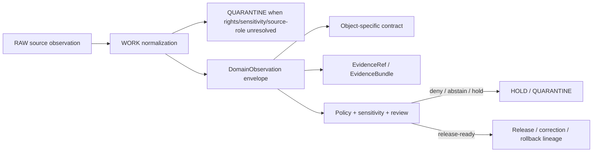

<!-- [KFM_META_BLOCK_V2]
doc_id: kfm://doc/contracts-domains-fauna-domain-observation
title: Fauna Domain Observation Contract
type: semantic-contract
version: v0.2
status: draft; PROPOSED; NEEDS VERIFICATION before promotion
owners: OWNER_TBD — Fauna steward · Observation steward · Contract steward · Source steward · Sensitivity reviewer · Policy steward · Schema steward · Validation steward · Release steward · Docs steward
created: 2026-06-21
updated: 2026-06-21
policy_label: public; semantic-contract; fauna; observation-envelope; source-role-aware; sensitivity-aware; no-publication-authority
tags: [kfm, contracts, fauna, domain-observation, observation, evidence, source-role, temporal-scope, geoprivacy, sensitivity, policy, release, governance]
related:
  - ./README.md
  - ./domain_feature_identity.md
  - ./domain_layer_descriptor.md
  - ./conservation_status.md
  - ./disease_observation.md
  - ../../../docs/domains/fauna/README.md
  - ../../../docs/domains/fauna/SOURCES.md
  - ../../../docs/domains/fauna/SOURCE_ROLES.md
  - ../../../docs/domains/fauna/SENSITIVITY.md
  - ../../../docs/domains/fauna/SCHEMAS.md
  - ../../../schemas/contracts/v1/domains/fauna/domain_observation.schema.json
  - ../../../data/registry/sources/fauna/
  - ../../../policy/domains/fauna/
  - ../../../policy/sensitivity/fauna/
  - ../../../fixtures/domains/fauna/domain_observation/
  - ../../../tests/domains/fauna/
  - ../../../release/manifests/
notes:
  - "Expanded from a greenfield scaffold into a Fauna shared observation-envelope semantic contract."
  - "The paired schema is a PROPOSED stub requiring only id and allowing additional properties; full field enforcement remains NEEDS VERIFICATION."
  - "This contract defines shared observation meaning only; object-specific contracts still own occurrence, disease, mortality, monitoring, invasive-species, range, status, and sensitive-site payload meaning."
  - "Fauna observations must preserve source role, observation subject, evidence class, temporal scope, support geometry, sensitivity, policy, release, correction, and rollback boundaries."
  - "The user-provided Markdown Authoring Agent v2 prompt was treated as authoring guidance, not pasted into this contract."
[/KFM_META_BLOCK_V2] -->

# Fauna Domain Observation

> Shared semantic contract for Fauna observation-like records: the envelope that preserves source role, observation subject, evidence class, time, support geometry, sensitivity posture, policy state, release state, correction lineage, and rollback context across Fauna object-family contracts.

  
  
  
  
  
  

`contracts/domains/fauna/domain_observation.md`

## Quick jumps

[Status](#status) · [Meaning](#meaning) · [Repo fit](#repo-fit) · [Schema posture](#schema-posture) · [Accepted uses](#accepted-uses) · [Exclusions](#exclusions) · [Recommended semantics](#recommended-semantics) · [Observation families](#observation-families) · [Invariants](#invariants) · [Lifecycle](#lifecycle) · [Validation](#validation) · [Open questions](#open-questions) · [Evidence basis](#evidence-basis) · [Rollback](#rollback)

---

## Status

> [!IMPORTANT]
> **Status:** `draft` / semantic contract  
> **Contract path:** `contracts/domains/fauna/domain_observation.md`  
> **Schema path:** `schemas/contracts/v1/domains/fauna/domain_observation.schema.json`  
> **Truth posture:** target path, prior scaffold, paired schema metadata, Fauna contract-lane split, Fauna schema-home split, source-role crosswalk, and sensitivity doctrine are CONFIRMED from current repo evidence. Full field validation, fixtures, validators, policy behavior, source registry behavior, EvidenceBundle resolution, release workflow, public API behavior, rendered UI behavior, and runtime enforcement remain NEEDS VERIFICATION.

> [!CAUTION]
> `DomainObservation` does not make an observation true. It also does **not** authorize public release, exact sensitive-location display, clinical/veterinary conclusions, emergency alerts, enforcement actions, public-safe occurrence claims, or downstream map/API/UI behavior.

---

## Meaning

`DomainObservation` is the shared Fauna semantic envelope for observation-like records.

It carries the common meaning needed by Fauna observation/evidence object families, including:

- occurrence evidence;
- monitoring events;
- disease/pathogen observations;
- mortality observations;
- invasive-species observations;
- survey detections and non-detections;
- specimen/sample/acoustic/camera/tracking observations;
- candidate watcher/ingest observations;
- aggregate or administrative observation summaries where a source uses observation-like records.

It exists to preserve the context that makes a Fauna observation reviewable:

- source identity and source role;
- observation subject and taxonomic scope;
- evidence class and observation method;
- observed, valid, source, retrieval, release, and correction time roles;
- raw geometry, support geometry, generalized geometry, or spatial support scope;
- sensitivity, rights, geoprivacy, steward-control, and re-identification posture;
- normalized digest and `spec_hash` integrity pin;
- EvidenceRef/EvidenceBundle links;
- policy, review, release, correction, and rollback context.

It is not a universal claim of truth. Object-specific contracts still own object payload meaning. `DomainObservation` is the common envelope that prevents observation-like records from losing source role, time, evidence, geometry scope, and policy context while they move through KFM.

---

## Repo fit

The Fauna contract README places semantic meaning in `contracts/domains/fauna/` while keeping machine shape, policy, source registry, fixtures, tests, data lifecycle, and release decisions in separate responsibility roots.

| Responsibility | Fauna lane path | This contract's role |
|---|---|---|
| Shared observation meaning | `contracts/domains/fauna/domain_observation.md` | Owned here |
| Object-specific observation meaning | `contracts/domains/fauna/*.md` | Referenced, not replaced |
| Feature identity | `contracts/domains/fauna/domain_feature_identity.md` | Linked identity support |
| Layer meaning | `contracts/domains/fauna/domain_layer_descriptor.md` | Downstream layer support |
| Machine schema shape | `schemas/contracts/v1/domains/fauna/domain_observation.schema.json` | Linked only |
| Source identity and source role | `data/registry/sources/fauna/` | Required upstream support |
| Sensitivity and geoprivacy policy | `policy/sensitivity/fauna/`, `policy/domains/fauna/` | Required admissibility gate |
| Evidence/proof support | `data/proofs/`, `tests/domains/fauna/`, `fixtures/domains/fauna/` | Required before consequential use |
| Release/correction/rollback | `release/`, correction contracts, receipts | Required downstream governance |

This split prevents a shared observation envelope from quietly becoming a schema, source registry, policy bundle, release manifest, public truth store, clinical/veterinary authority, alerting system, or UI implementation.

---

## Schema posture

The paired schema currently exists as a **PROPOSED stub**.

| Schema fact | Current evidence |
|---|---|
| Schema file path | `schemas/contracts/v1/domains/fauna/domain_observation.schema.json` |
| Schema title | `domain_observation` |
| Declared properties | `spec_hash`, `id`, `version` |
| Required fields | `id` only |
| Additional properties | `true` |
| Fixture root | `fixtures/domains/fauna/domain_observation/` in schema metadata |
| Validator path | `tools/validators/domains/fauna/validate_domain_observation.py` in schema metadata |
| Policy path | `policy/domains/fauna/` in schema metadata |

Because the schema is not field-complete, this contract defines **semantic expectations** for future schema, fixtures, validators, policy tests, source registry links, release checks, and API/UI use. It does not claim the current schema enforces the full Fauna observation model.

---

## Accepted uses

| Use | Allowed? | Rule |
|---|---:|---|
| Carrying common Fauna observation semantics | Yes | Must preserve source, source role, subject, evidence class, time, support scope, sensitivity, digest, and evidence posture. |
| Supporting object-family-specific observation contracts | Yes | DomainObservation may supply shared meaning; object contracts still own payload semantics. |
| Supporting dedupe, merge, freshness checks, lineage checks, or correction checks | Yes | Must remain deterministic, source-role-aware, and version-aware. |
| Supporting review and release gates | Conditional | Must not replace PolicyDecision, EvidenceBundle, ReleaseManifest, steward review, or RedactionReceipt. |
| Representing observed, aggregate, regulatory, administrative, candidate, modeled, or synthetic source roles | Conditional | Must carry role/caveat/disclosure state and must not upgrade source role. |
| Acting as proof closure | No | EvidenceBundle/proof objects remain separate. |
| Acting as policy approval or release approval | No | Policy and release authority remain separate. |
| Acting as exact public occurrence permission | No | Sensitive or exact geometry remains policy/review/release controlled. |
| Acting as clinical, veterinary, emergency, or enforcement authority | No | KFM may cite governed evidence but must not become those authorities. |
| Acting as UI/map layer descriptor | No | Layer contracts own layer meaning and rendering boundaries. |

---

## Exclusions

| Does not belong in `DomainObservation` | Correct home |
|---|---|
| Full occurrence payload semantics | `occurrence_evidence.md`, `occurrence_public.md`, `occurrence_restricted.md`, or future reviewed occurrence contracts |
| Disease/pathogen payload semantics | `disease_observation.md` |
| Mortality payload semantics | `mortality_observation.md` or future reviewed mortality contract |
| Monitoring event payload semantics | `monitoring_event.md` or future reviewed monitoring contract |
| Conservation status or status rank meaning | `conservation_status.md` |
| Sensitive site semantics | `sensitive_site.md` or accepted sensitive-site contract |
| Range, habitat, model, suitability, or richness payload semantics | Range/model object contracts and model-run receipts |
| Source descriptor, license, cadence, or source-role assignment | `data/registry/sources/fauna/` |
| EvidenceBundle/proof content | Evidence/proof roots |
| JSON Schema shape | `schemas/contracts/v1/domains/fauna/domain_observation.schema.json` |
| Validator code | `tools/validators/domains/fauna/validate_domain_observation.py` after verification |
| Policy decisions | `policy/domains/fauna/`, `policy/sensitivity/fauna/` |
| Release, correction, supersession, rollback records | Release/correction/rollback homes |
| Public UI/API implementation | Governed app/API/UI/focus-mode roots |

> [!WARNING]
> Do not include exact sensitive species locations, nests, dens, roosts, hibernacula, spawning sites, restricted steward records, private-land joins, telemetry detail, redaction radii, fuzzing parameters, or transform recipes in observation envelopes intended for public or semi-public surfaces.

---

## Recommended semantics

The current schema requires only `id`. The following fields are PROPOSED semantic expectations for a reviewed schema and fixture suite.

| Field | Meaning |
|---|---|
| `id` | Canonical Fauna observation identity. |
| `version` | Contract/object version. |
| `spec_hash` | Deterministic content hash or integrity pin. |
| `object_family` | Fauna object family represented by the observation. |
| `observation_kind` | Occurrence, disease, mortality, monitoring, invasive-species, specimen/sample, acoustic, camera, telemetry, administrative, candidate, modeled, synthetic, or aggregate observation kind. |
| `source_id` | SourceDescriptor/source identity. |
| `source_role` | Canonical role such as observed, regulatory, aggregate, modeled, administrative, candidate, or synthetic. |
| `source_native_id` | Source-native record, event, observation, sample, or catalog id where available and safe. |
| `domain_feature_identity_ref` | Link to `DomainFeatureIdentity` where used. |
| `subject_ref` | Taxon, individual, sample, carcass, event, site, population, route, or aggregate unit being observed. |
| `taxon_ref` | Taxon or authority-taxonomy reference when material. |
| `evidence_class` | Field observation, specimen, acoustic detection, camera trap, lab result, report-only, negative detection, modeled derivation, administrative record, or other governed class. |
| `method` | Measurement, survey, diagnostic, instrument, protocol, aggregation, reconstruction, or source-native method. |
| `quality_state` | QA/QC, confidence, uncertainty, limitation, verification, or caveat posture. |
| `support_geometry_ref` | Reference to raw, restricted, generalized, aggregated, grid, survey unit, administrative unit, range unit, or public-safe geometry. |
| `temporal_scope` | Observed, valid, source, retrieval, release, and correction time context where material. |
| `sensitivity_state` | Sensitivity tier/rank, denial, generalization, redaction, embargo, steward review, or restriction posture. |
| `policy_refs` | PolicyDecision, sensitivity rule, or admissibility reference. |
| `evidence_refs` | EvidenceRef/EvidenceBundle links required before cite-or-answer behavior. |
| `release_ref` | Release or candidate release linkage. |
| `correction_refs` | Correction/supersession/rollback lineage where applicable. |

---

## Observation families

`DomainObservation` supplies common envelope semantics; object-specific contracts own payload meaning.

| Family | Shared envelope support | Object-specific owner |
|---|---|---|
| Occurrence evidence | Source role, subject, evidence class, time, support geometry, sensitivity | Occurrence-specific contracts |
| Disease/pathogen observation | Subject, condition, method, evidence class, confidence, sensitivity | `disease_observation.md` |
| Mortality observation | Subject, event scope, evidence class, time, location sensitivity | Mortality-specific contract when reviewed |
| Monitoring event | Survey effort, protocol, observed/non-detected status, source role | Monitoring-specific contract when reviewed |
| Invasive-species observation | Observation source, private-parcel risk, evidence class, release caveats | Invasive-specific contract when reviewed |
| Specimen/sample/acoustic/camera/telemetry | Detection method, source-native id, QA, spatial/time support | Method-specific or occurrence contract when reviewed |
| Candidate ingest/watch record | Candidate state, source/native id, no published edge | Candidate/ingest governance roots |
| Aggregate/admin/model/synthetic record | Role and caveat preservation | Object-specific and model/administrative contracts |

---

## Invariants

`DomainObservation` must preserve these invariants:

1. **Observation is not proof closure.** Evidence must resolve before consequential claims are answered, exported, or published.
2. **Observation is not release.** A valid observation can remain T4, quarantined, restricted, embargoed, or unpublished.
3. **Source role is observation-significant.** Observed, regulatory, aggregate, administrative, candidate, modeled, and synthetic records must not be silently merged.
4. **Time roles remain separate.** Observed time, valid time, source time, retrieval time, release time, and correction time must not be collapsed.
5. **Existence is not exact location.** A record may exist while exact geometry remains denied.
6. **Well-sourced can still be unsafe.** Source quality never overrides sensitivity, rights, steward control, or re-identification risk.
7. **Object-specific meaning remains separate.** Shared envelope semantics do not replace occurrence, disease, mortality, monitoring, conservation status, sensitive-site, range, or layer contracts.
8. **Derived and synthetic observations stay labeled.** Modeled or synthetic content cannot be promoted into observed reality without explicit evidence and review.
9. **Correction and rollback lineage remains visible.** Duplicates, false positives, taxonomic changes, withdrawn records, and sensitivity changes must remain auditable.

---

## Lifecycle

The observation envelope supports normalization and review. It does not replace object payload validation, evidence resolution, source-role review, sensitivity review, policy decisions, redaction/aggregation receipts, release review, public-safe transforms, or rollback records.

---

## Validation

Before this contract is promoted beyond draft:

- [ ] Expand the paired schema beyond `id`, `version`, and `spec_hash`.
- [ ] Confirm validator path existence and behavior.
- [ ] Add valid fixtures for occurrence, disease, mortality, monitoring, invasive species, specimen/sample, acoustic/camera/telemetry, candidate, aggregate, administrative, modeled, and synthetic observation cases.
- [ ] Add invalid fixtures proving source-role collapse, time-role collapse, exact sensitive-location leakage, candidate-as-published, model-as-observed, synthetic-as-observed, and release-bypass cases fail.
- [ ] Confirm source-role enum or controlled vocabulary.
- [ ] Confirm sensitivity tier/rank handling and geoprivacy behavior.
- [ ] Confirm EvidenceBundle reference resolution.
- [ ] Confirm policy and release reference validation.
- [ ] Confirm object-family contract references and domain feature identity links.
- [ ] Confirm public clients cannot bypass governed APIs or released artifacts through this envelope.

---

## Open questions

| ID | Question | Status |
|---|---|---|
| OQ-FAUNA-DOBS-001 | Which observation families are admitted in the first reviewed schema? | NEEDS VERIFICATION |
| OQ-FAUNA-DOBS-002 | Which evidence classes should become controlled vocabulary? | NEEDS VERIFICATION |
| OQ-FAUNA-DOBS-003 | Should `sensitivity_state` be required on every observation or only on records that trigger policy review? | NEEDS VERIFICATION |
| OQ-FAUNA-DOBS-004 | How should negative detections and non-detections be represented without implying absence beyond survey scope? | NEEDS VERIFICATION |
| OQ-FAUNA-DOBS-005 | How should source-native ids be stored when they reveal restricted sources, exact sites, or private-land context? | NEEDS VERIFICATION |
| OQ-FAUNA-DOBS-006 | Which corrections create a new observation identity versus updating lineage on an existing identity? | NEEDS VERIFICATION |

---

## Evidence basis

| Source | Status | Supports | Limits |
|---|---|---|---|
| `contracts/domains/fauna/domain_observation.md` prior version | CONFIRMED repo evidence | Target existed as a greenfield scaffold. | Did not define authoritative semantics. |
| `schemas/contracts/v1/domains/fauna/domain_observation.schema.json` | CONFIRMED repo evidence | Paired schema exists, points to this contract, declares `spec_hash`, `id`, and `version`, and requires `id`. | Schema is a PROPOSED stub and allows additional properties. |
| `contracts/domains/fauna/README.md` | CONFIRMED repo evidence | Fauna contract lane owns semantic meaning and excludes schema, policy, data, fixtures, tests, source registry, and release decisions. | Does not define this specific observation envelope. |
| `docs/domains/fauna/SCHEMAS.md` | CONFIRMED repo evidence | Explains the meaning/shape/admissibility/proof split and schema-home rule. | Does not implement validator behavior. |
| `docs/domains/fauna/SOURCE_ROLES.md` | CONFIRMED repo evidence | Provides source-role anti-collapse vocabulary and examples. | Crosswalk only; per-source assignments belong to SourceDescriptor records. |
| `docs/domains/fauna/SENSITIVITY.md` | CONFIRMED repo evidence | Establishes fail-closed sensitive Fauna posture and geoprivacy concerns. | Binding policy remains outside this contract. |
| `contracts/domains/fauna/disease_observation.md` | CONFIRMED repo evidence | Shows a Fauna object-specific observation contract and its boundary against clinical/alert/release meanings. | Disease-specific semantics do not define all observation families. |

---

## Rollback

Rollback if this file is used to claim implemented observation validation, publish exact sensitive locations, collapse source roles or time roles, treat modeled/synthetic/candidate records as observed published truth, or publish without evidence, rights, sensitivity, policy, review, release, correction, and rollback support.

Rollback target: prior scaffold blob SHA `88684d6378284786541a12ac7eef6b3bee95c014`.

<a href="#top">Back to top</a>

