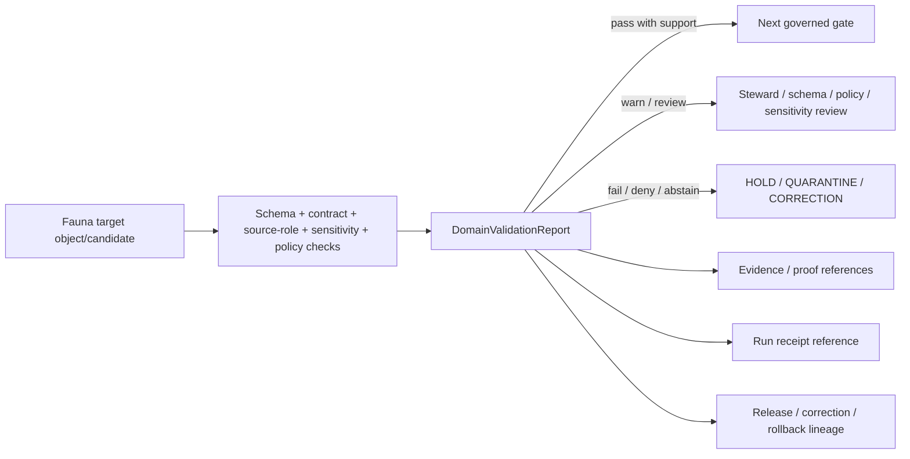

<!-- [KFM_META_BLOCK_V2]
doc_id: kfm://doc/contracts-domains-fauna-domain-validation-report
title: Fauna Domain Validation Report Contract
type: semantic-contract
version: v0.2
status: draft; PROPOSED; NEEDS VERIFICATION before promotion
owners: OWNER_TBD — Fauna steward · Validation steward · Contract steward · Source steward · Sensitivity reviewer · Policy steward · Schema steward · Release steward · Docs steward
created: 2026-06-21
updated: 2026-06-21
policy_label: public; semantic-contract; fauna; validation-report; source-role-aware; sensitivity-aware; release-aware; no-publication-authority
tags: [kfm, contracts, fauna, domain-validation-report, validation, evidence, source-role, sensitivity, geoprivacy, policy, release, correction, rollback, governance]
related:
  - ./README.md
  - ./domain_feature_identity.md
  - ./domain_layer_descriptor.md
  - ./domain_observation.md
  - ./conservation_status.md
  - ./disease_observation.md
  - ../../../contracts/data/validation_report.md
  - ../../../docs/domains/fauna/README.md
  - ../../../docs/domains/fauna/SOURCES.md
  - ../../../docs/domains/fauna/SOURCE_ROLES.md
  - ../../../docs/domains/fauna/SENSITIVITY.md
  - ../../../docs/domains/fauna/SCHEMAS.md
  - ../../../schemas/contracts/v1/domains/fauna/domain_validation_report.schema.json
  - ../../../data/registry/sources/fauna/
  - ../../../policy/domains/fauna/
  - ../../../policy/sensitivity/fauna/
  - ../../../fixtures/domains/fauna/domain_validation_report/
  - ../../../tests/domains/fauna/
  - ../../../data/proofs/
  - ../../../data/receipts/
  - ../../../release/manifests/
notes:
  - "Expanded from a greenfield scaffold into a Fauna-specific validation-report semantic contract."
  - "The paired schema is a PROPOSED stub requiring only id and allowing additional properties; full field enforcement remains NEEDS VERIFICATION."
  - "This contract is narrower than the generic data ValidationReport contract and must not collapse validation findings into proof closure, process receipts, policy approval, release approval, source truth, or catalog truth."
  - "Fauna validation reports must preserve object-family boundaries, source role, evidence, rights, sensitivity, geoprivacy, release blockers, correction, and rollback context."
  - "The user-provided Markdown Authoring Agent v2 prompt was treated as authoring guidance, not pasted into this contract."
[/KFM_META_BLOCK_V2] -->

# Fauna Domain Validation Report

> Semantic contract for Fauna-domain validation findings: the report object that records what Fauna object, layer, observation envelope, source-derived candidate, policy-gated artifact, or release candidate was checked, which rules were applied, what passed or failed, and what review, correction, quarantine, denial, or release work remains.

  
  
  
  
  
  

`contracts/domains/fauna/domain_validation_report.md`

## Quick jumps

[Status](#status) · [Meaning](#meaning) · [Repo fit](#repo-fit) · [Schema posture](#schema-posture) · [Accepted uses](#accepted-uses) · [Exclusions](#exclusions) · [Recommended semantics](#recommended-semantics) · [Fauna validation checks](#fauna-validation-checks) · [Invariants](#invariants) · [Lifecycle](#lifecycle) · [Validation](#validation) · [Open questions](#open-questions) · [Evidence basis](#evidence-basis) · [Rollback](#rollback)

---

## Status

> [!IMPORTANT]
> **Status:** `draft` / semantic contract  
> **Contract path:** `contracts/domains/fauna/domain_validation_report.md`  
> **Schema path:** `schemas/contracts/v1/domains/fauna/domain_validation_report.schema.json`  
> **Truth posture:** target path, prior scaffold, paired schema metadata, Fauna contract-lane split, Fauna schema-home split, generic ValidationReport boundary, source-role crosswalk, and sensitivity doctrine are CONFIRMED from current repo evidence. Full field validation, fixtures, validators, policy runtime behavior, proof integration, source registry behavior, release workflow, API behavior, UI behavior, and test coverage remain NEEDS VERIFICATION.

> [!CAUTION]
> A `DomainValidationReport` records validation findings. It is **not** proof closure, a process receipt, source truth, policy approval, release approval, clinical/veterinary authority, emergency alerting, or permission to publish exact sensitive Fauna locations.

---

## Meaning

`DomainValidationReport` is the Fauna-specific validation finding object.

It records the outcome of checks that are meaningful to Fauna-domain contracts, schemas, candidates, observations, layer descriptors, source-derived records, policy-gated artifacts, and release candidates.

It answers questions like:

- What target was checked?
- Which rule set, schema, validator, policy profile, source-role rule, sensitivity rule, or release gate was applied?
- Which inputs, source records, evidence references, identities, digests, or candidate artifacts were used?
- Which findings passed, warned, failed, abstained, errored, or require human review?
- Which findings block promotion, require quarantine, require correction, trigger redaction/generalization, or allow movement to the next governed gate?
- Which correction, supersession, stale-state, or rollback context is affected?

It is narrower than the generic `ValidationReport` contract. The generic data contract defines validation-report meaning across KFM; this contract defines **Fauna-specific validation meaning** and the review context needed for biodiversity, sensitive-location, source-role, geoprivacy, rights, public-release, and object-family checks.

---

## Repo fit

The Fauna contract README places semantic meaning in `contracts/domains/fauna/` while keeping machine shape, policy, source registry, fixtures, tests, data lifecycle, receipts, proofs, and release decisions in separate responsibility roots.

| Responsibility | Fauna lane path | This contract's role |
|---|---|---|
| Fauna validation-report meaning | `contracts/domains/fauna/domain_validation_report.md` | Owned here |
| Generic validation-report meaning | `contracts/data/validation_report.md` | Linked; not duplicated |
| Machine schema shape | `schemas/contracts/v1/domains/fauna/domain_validation_report.schema.json` | Linked only |
| Validation fixtures | `fixtures/domains/fauna/domain_validation_report/` | Required proof support; not owned here |
| Validator code | `tools/validators/domains/fauna/validate_domain_validation_report.py` | Declared by schema; behavior NEEDS VERIFICATION |
| Source identity and source role | `data/registry/sources/fauna/` | Required upstream support |
| Sensitivity and geoprivacy policy | `policy/sensitivity/fauna/`, `policy/domains/fauna/` | Required admissibility gate |
| Process receipts | `data/receipts/` | Distinct from validation findings |
| Evidence/proof support | `data/proofs/`, tests, fixtures | Required before consequential use |
| Release/correction/rollback | `release/`, correction contracts, receipts | Required downstream governance |

This split prevents a validation report from quietly becoming a schema, proof object, process receipt, source descriptor, policy decision, release manifest, public truth store, or UI/API implementation.

---

## Schema posture

The paired schema currently exists as a **PROPOSED stub**.

| Schema fact | Current evidence |
|---|---|
| Schema file path | `schemas/contracts/v1/domains/fauna/domain_validation_report.schema.json` |
| Schema title | `domain_validation_report` |
| Declared properties | `spec_hash`, `id`, `version` |
| Required fields | `id` only |
| Additional properties | `true` |
| Fixture root | `fixtures/domains/fauna/domain_validation_report/` in schema metadata |
| Validator path | `tools/validators/domains/fauna/validate_domain_validation_report.py` in schema metadata |
| Policy path | `policy/domains/fauna/` in schema metadata |

Because the schema is not field-complete, this contract defines **semantic expectations** for future schema, fixtures, validators, policy tests, proof links, release checks, and API/UI use. It does not claim the current schema enforces the full Fauna validation-report model.

---

## Accepted uses

| Use | Allowed? | Rule |
|---|---:|---|
| Recording Fauna-specific validation findings | Yes | Must identify target, rule/check, inputs, outcome, severity, and next action where available. |
| Supporting review of Fauna object-family contracts | Yes | Must preserve object family, source role, evidence, time, geometry scope, sensitivity, rights, and release context. |
| Supporting proof or release review | Conditional | Must link proof/release context; report alone is not proof or release. |
| Supporting policy routing | Conditional | May state policy implications; must not become PolicyDecision. |
| Supporting correction, supersession, stale-state, or rollback | Yes | Must identify affected targets and changed findings. |
| Recording geoprivacy or sensitivity findings | Yes | Must not reveal restricted locations or transform recipes in public-facing report text. |
| Acting as process receipt | No | Run/process receipt belongs to receipt roots. |
| Acting as EvidenceBundle | No | EvidenceBundle/proof support remains separate. |
| Acting as PolicyDecision or ReleaseManifest | No | Policy and release authority remain separate. |
| Acting as source truth | No | Validation records findings; it does not make a target true. |
| Acting as emergency, clinical, veterinary, or enforcement instruction | No | KFM may cite governed evidence but must not become those authorities. |

---

## Exclusions

| Does not belong in `DomainValidationReport` | Correct home |
|---|---|
| Full Fauna object payload | Object-family contracts and data lifecycle roots |
| Full validation run log or process receipt | `data/receipts/` or accepted receipt root |
| EvidenceBundle/proof content | `data/proofs/` |
| JSON Schema shape | `schemas/contracts/v1/domains/fauna/domain_validation_report.schema.json` |
| Validator implementation | `tools/validators/domains/fauna/validate_domain_validation_report.py` after verification |
| Policy decision | `policy/domains/fauna/`, `policy/sensitivity/fauna/`, and policy decision contracts |
| Release, correction, supersession, stale-state, rollback records | Release/correction/rollback homes |
| Source descriptor, license, cadence, rights, or source-role assignment | `data/registry/sources/fauna/` |
| Public API/UI implementation | Governed app/API/UI/focus-mode roots |
| Clinical/veterinary/public-health alerting guidance | External qualified authorities; KFM citation surfaces only after governance |

> [!WARNING]
> Do not include exact sensitive species locations, nests, dens, roosts, hibernacula, spawning sites, restricted steward records, private-land joins, telemetry detail, redaction radii, fuzzing parameters, transform recipes, or other re-identification aids in validation reports intended for public or semi-public surfaces.

---

## Recommended semantics

The current schema requires only `id`. The following fields are PROPOSED semantic expectations for a reviewed schema and fixture suite.

| Field | Meaning |
|---|---|
| `id` | Canonical Fauna validation-report identity. |
| `version` | Contract/object version. |
| `spec_hash` | Deterministic content hash or integrity pin for the report. |
| `target_ref` | Object, observation envelope, layer descriptor, source-derived candidate, proof pack, policy candidate, or release candidate being checked. |
| `target_type` | Target family such as `DomainObservation`, `DomainFeatureIdentity`, `DomainLayerDescriptor`, object-family contract instance, layer candidate, source candidate, or release candidate. |
| `object_family` | Fauna object family involved where relevant. |
| `source_role` | Source role involved in validation. |
| `source_descriptor_ref` | SourceDescriptor/source registry reference where relevant. |
| `rule_set_ref` | Schema, validator, policy profile, sensitivity profile, or rule bundle used. |
| `validator_ref` | Validator identity and version. |
| `input_hashes` | Digests of validated target/input objects. |
| `run_receipt_ref` | Link to process receipt for the validation run, when present. |
| `evidence_refs` | EvidenceRef/EvidenceBundle links involved in findings. |
| `findings` | Structured pass/warn/fail/abstain/error/review-needed findings. |
| `overall_outcome` | PASS, WARN, FAIL, ABSTAIN, ERROR, REVIEW_REQUIRED, HOLD, DENY, or equivalent accepted enum. |
| `source_role_findings` | Findings about source-role collapse or unsupported source-role upgrades. |
| `sensitivity_findings` | Findings about sensitivity, geoprivacy, steward-control, private-land, embargo, or restricted join risk. |
| `rights_findings` | Findings about license, redistribution, attribution, cadence, or rights clearance. |
| `evidence_findings` | Findings about unresolved EvidenceRef/EvidenceBundle, weak citation support, or cite-or-abstain posture. |
| `release_blockers` | Findings that block promotion or public release. |
| `correction_refs` | Correction, supersession, duplicate, false-positive, stale-state, or rollback links. |
| `review_refs` | Steward, source, sensitivity, schema, policy, or release review records. |

---

## Fauna validation checks

A Fauna-domain validation report should support at least these check families before promotion.

| Check family | What it protects |
|---|---|
| Object-family membership | Prevents a validation target from claiming the wrong Fauna contract family. |
| Schema-home split | Prevents schema shape from being treated as contract meaning, policy, or proof. |
| Source-role anti-collapse | Keeps regulatory, aggregate, observed, modeled, administrative, candidate, and synthetic roles distinct. |
| Observation-envelope completeness | Ensures observation-like records carry subject, source role, time, support geometry, evidence class, and sensitivity context. |
| Sensitive-location fail-closed behavior | Blocks public exposure of exact sensitive occurrences, sensitive sites, steward-controlled records, and re-identifying joins. |
| Rights and source activation | Blocks live source activation or redistribution when rights, license, cadence, attribution, or source role are unresolved. |
| Evidence resolution | Enforces cite-or-abstain by requiring EvidenceRef/EvidenceBundle support before authoritative claims. |
| Policy/review/release linkage | Ensures PolicyDecision, ReviewRecord, RedactionReceipt, ReleaseManifest, and rollback references are present when needed. |
| Derived/synthetic/model disclosure | Prevents modeled or synthetic records from being promoted into observed reality. |
| Emergency/clinical/veterinary boundary | Prevents KFM from acting as an alert, diagnosis, treatment, enforcement, or public-health authority. |

---

## Invariants

`DomainValidationReport` must preserve these invariants:

1. **Findings are not truth.** A validation report records checks; it does not make the target true.
2. **Findings are not proof closure.** EvidenceBundle/proof records remain separate.
3. **Findings are not process receipts.** Run/process receipts remain separate object families.
4. **Findings are not policy approval.** PolicyDecision remains separate.
5. **Findings are not release approval.** ReleaseManifest/PromotionDecision remains separate.
6. **Well-sourced can still fail.** Source quality never overrides sensitivity, rights, geoprivacy, review, or release posture.
7. **Unresolved means closed.** Missing rights, source role, sensitivity, evidence, review, or release state blocks promotion or requires ABSTAIN/DENY/HOLD.
8. **Sensitive details stay out of public reports.** Public or semi-public validation reports must not expose restricted geometry, private-land joins, steward records, or transform parameters.
9. **Correction and rollback remain visible.** Failed validation, stale reports, false positives, duplicate merges, source withdrawal, taxonomic corrections, and sensitivity changes require auditable lineage.

---

## Lifecycle

The validation report supports review and routing. It does not replace object payload validation, evidence resolution, source-role review, sensitivity review, policy decisions, redaction/aggregation receipts, release review, public-safe transforms, correction notices, or rollback records.

---

## Validation

Before this contract is promoted beyond draft:

- [ ] Expand the paired schema beyond `id`, `version`, and `spec_hash`.
- [ ] Confirm validator path existence and behavior.
- [ ] Add valid fixtures for object-family validation, observation-envelope validation, sensitivity validation, source-role validation, policy/release validation, and correction/rollback validation.
- [ ] Add invalid fixtures proving schema/contract/policy/proof collapse fails.
- [ ] Add invalid fixtures proving sensitive-location leakage, re-identifying joins, candidate-as-published, model-as-observed, synthetic-as-observed, and release-bypass cases fail.
- [ ] Confirm allowed outcome vocabulary.
- [ ] Confirm EvidenceBundle reference resolution behavior.
- [ ] Confirm PolicyDecision, ReviewRecord, RedactionReceipt, ReleaseManifest, CorrectionNotice, and rollback reference behavior.
- [ ] Confirm public validation-report rendering redacts restricted details.
- [ ] Confirm reports can expire, become stale, be superseded, and be corrected.

---

## Open questions

| ID | Question | Status |
|---|---|---|
| OQ-FAUNA-DVR-001 | Which outcome enum is canonical for Fauna validation reports? | NEEDS VERIFICATION |
| OQ-FAUNA-DVR-002 | Which findings are release blockers versus review warnings? | NEEDS VERIFICATION |
| OQ-FAUNA-DVR-003 | Should sensitivity validation reports store exact sensitive reasons, or only safe reason codes? | NEEDS VERIFICATION |
| OQ-FAUNA-DVR-004 | How are validation reports invalidated when source descriptors, taxonomic concepts, policy rules, or release manifests change? | NEEDS VERIFICATION |
| OQ-FAUNA-DVR-005 | Should validation reports be public, reviewer-only, or split into public summary and restricted detail records? | NEEDS VERIFICATION |
| OQ-FAUNA-DVR-006 | Which validation failures automatically create CorrectionNotice or RollbackCard candidates? | NEEDS VERIFICATION |

---

## Evidence basis

| Source | Status | Supports | Limits |
|---|---|---|---|
| `contracts/domains/fauna/domain_validation_report.md` prior version | CONFIRMED repo evidence | Target existed as a greenfield scaffold. | Did not define authoritative semantics. |
| `schemas/contracts/v1/domains/fauna/domain_validation_report.schema.json` | CONFIRMED repo evidence | Paired schema exists, points to this contract, declares `spec_hash`, `id`, and `version`, and requires `id`. | Schema is a PROPOSED stub and allows additional properties. |
| `contracts/domains/fauna/README.md` | CONFIRMED repo evidence | Fauna contract lane owns semantic meaning and excludes schema, policy, data, fixtures, tests, source registry, and release decisions. | Does not define this specific validation-report contract. |
| `contracts/data/validation_report.md` | CONFIRMED repo evidence | Generic ValidationReport is findings/review support and not proof closure, receipt, catalog record, policy approval, or release approval. | Generic data contract does not define Fauna-specific validation checks. |
| `docs/domains/fauna/SCHEMAS.md` | CONFIRMED repo evidence | Explains the meaning/shape/admissibility/proof split and schema-home rule. | Does not implement validator behavior. |
| `docs/domains/fauna/SOURCE_ROLES.md` | CONFIRMED repo evidence | Provides source-role anti-collapse vocabulary and examples. | Crosswalk only; per-source assignments belong to SourceDescriptor records. |
| `docs/domains/fauna/SENSITIVITY.md` | CONFIRMED repo evidence | Establishes fail-closed sensitive Fauna posture and geoprivacy concerns. | Binding policy remains outside this contract. |
| User-provided Markdown Authoring Agent v2 prompt | CONFIRMED user-provided guidance | Authoring guidance for grounded, repo-aware Markdown. | It is not repository implementation evidence and was not pasted into the contract. |

---

## Rollback

Rollback if this file is used to claim implemented validation enforcement, publish exact sensitive locations, collapse validation findings into proof/receipts/policy/release, treat modeled/synthetic/candidate records as observed published truth, or publish without evidence, rights, sensitivity, policy, review, release, correction, and rollback support.

Rollback target: prior scaffold blob SHA `86be1ab8143208ebce4958609e2cb9e181b57318`.

<a href="#top">Back to top</a>

