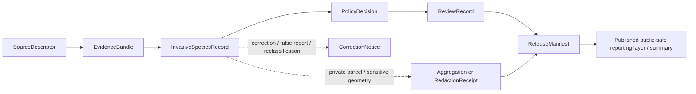

<!-- [KFM_META_BLOCK_V2]
doc_id: kfm://doc/contracts-domains-fauna-invasive-species-record
title: Invasive Species Record Contract
type: semantic-contract
version: v0.2
status: draft; PROPOSED; NEEDS VERIFICATION before promotion
owners: OWNER_TBD — Fauna steward · Invasive-species steward · Contract steward · Source steward · Sensitivity reviewer · Policy steward · Schema steward · Validation steward · Release steward · Docs steward
created: 2026-06-21
updated: 2026-06-21
policy_label: public; semantic-contract; fauna; invasive-species-record; source-role-aware; sensitivity-aware; private-parcel-aware; no-publication-authority
tags: [kfm, contracts, fauna, invasive-species, occurrence, monitoring, source-role, sensitivity, private-parcel, geoprivacy, evidence, policy, release, correction, rollback]
related:
  - ./README.md
  - ./domain_observation.md
  - ./domain_feature_identity.md
  - ./domain_layer_descriptor.md
  - ./domain_validation_report.md
  - ./conservation_status.md
  - ./disease_observation.md
  - ../../../docs/domains/fauna/README.md
  - ../../../docs/domains/fauna/SOURCES.md
  - ../../../docs/domains/fauna/SOURCE_ROLES.md
  - ../../../docs/domains/fauna/SENSITIVITY.md
  - ../../../docs/domains/fauna/SCHEMAS.md
  - ../../../schemas/contracts/v1/domains/fauna/invasive_species_record.schema.json
  - ../../../data/registry/sources/fauna/
  - ../../../policy/domains/fauna/
  - ../../../policy/sensitivity/fauna/
  - ../../../fixtures/domains/fauna/invasive_species_record/
  - ../../../tests/domains/fauna/
  - ../../../release/manifests/
notes:
  - "Expanded from a planned-path scaffold into a Fauna invasive-species semantic contract."
  - "The paired schema is a PROPOSED scaffold with empty properties and additionalProperties=true; field-level realization remains NEEDS VERIFICATION."
  - "InvasiveSpeciesRecord is an observation/report/context object, not enforcement authority, treatment advice, landowner disclosure permission, or public alert authority."
  - "Private-parcel detail, sensitive taxa, exact occurrence geometry, monitoring sites, steward-controlled records, and re-identifying joins remain deny-by-default unless policy, review, transform, receipt, and release support exist."
  - "The user-provided Markdown Authoring Agent v2 prompt was treated as authoring guidance, not pasted into this contract."
[/KFM_META_BLOCK_V2] -->

# Invasive Species Record

> Semantic contract for Fauna invasive-species records: what an invasive-species assertion means, what source roles can support it, how it relates to observations and public reporting, and which privacy, sensitivity, rights, release, and correction controls must remain in force.

  
  
  
  
  
  

`contracts/domains/fauna/invasive_species_record.md`

## Quick jumps

[Status](#status) · [Meaning](#meaning) · [Repo fit](#repo-fit) · [Schema posture](#schema-posture) · [What this contract asserts](#what-this-contract-asserts) · [What it does not assert](#what-it-does-not-assert) · [Recommended semantics](#recommended-semantics) · [Source-role rules](#source-role-rules) · [Sensitivity and release](#sensitivity-and-release) · [Lifecycle](#lifecycle) · [Validation](#validation) · [Open questions](#open-questions) · [Evidence basis](#evidence-basis) · [Rollback](#rollback)

---

## Status

> [!IMPORTANT]
> **Status:** `draft` / semantic contract  
> **Contract path:** `contracts/domains/fauna/invasive_species_record.md`  
> **Schema path:** `schemas/contracts/v1/domains/fauna/invasive_species_record.schema.json`  
> **Truth posture:** target path, prior scaffold, paired schema metadata, Fauna contract-lane split, Fauna schema-home split, source-role crosswalk, and sensitivity/private-parcel doctrine are CONFIRMED from current repo evidence. Full field validation, fixtures, validators, source registry behavior, policy runtime behavior, release workflow, API behavior, UI behavior, and test coverage remain NEEDS VERIFICATION.

> [!CAUTION]
> `InvasiveSpeciesRecord` does not make KFM an enforcement, control, treatment, eradication, inspection, landowner-notification, or emergency alert authority. It can support a governed invasive-species claim only when evidence, source role, rights, sensitivity, review, release, correction, and rollback support resolve.

---

## Meaning

`InvasiveSpeciesRecord` is a Fauna semantic object that records **source-bound evidence or governed context about a non-native, invasive, nuisance, prohibited, regulated, watch-list, or management-relevant animal taxon** within a defined spatial, temporal, jurisdictional, or monitoring scope.

It answers questions like:

- Which taxon, population, host, life stage, or source-native category is being asserted?
- Is the record an observed detection, public report, regulatory listing, administrative management record, aggregate map, modeled risk, candidate ingest, or synthetic reconstruction?
- Which source asserted it, with what rights, cadence, and source role?
- What spatial and temporal scope can be safely cited?
- Does the record touch private-parcel detail, sensitive taxa, monitoring sites, steward-controlled records, or re-identifying joins?
- Which evidence, policy, review, release, correction, and rollback references must resolve before display?

It is not the same as a general species occurrence. It is a status/evidence/context record whose invasive-species meaning depends on source role, jurisdictional or management context, evidence class, and release posture.

---

## Repo fit

The Fauna contract README places semantic meaning in `contracts/domains/fauna/` while keeping machine shape, policy, source registry, fixtures, tests, data lifecycle, and release decisions in separate responsibility roots.

| Responsibility | Fauna lane path | This contract's role |
|---|---|---|
| Invasive-species meaning | `contracts/domains/fauna/invasive_species_record.md` | Owned here |
| Observation envelope | `contracts/domains/fauna/domain_observation.md` | Shared observation context; not replaced |
| Feature identity | `contracts/domains/fauna/domain_feature_identity.md` | Identity support; not replaced |
| Layer meaning | `contracts/domains/fauna/domain_layer_descriptor.md` | Downstream layer support |
| Machine schema shape | `schemas/contracts/v1/domains/fauna/invasive_species_record.schema.json` | Linked only |
| Source identity and source role | `data/registry/sources/fauna/` | Required upstream support |
| Sensitivity and private-parcel policy | `policy/sensitivity/fauna/`, `policy/domains/fauna/` | Required admissibility gate |
| Evidence/proof support | `data/proofs/`, `tests/domains/fauna/`, `fixtures/domains/fauna/` | Required before consequential use |
| Release/correction/rollback | `release/`, correction contracts, receipts | Required downstream governance |

This split prevents an invasive-species record from quietly becoming a source descriptor, policy decision, enforcement instruction, treatment recommendation, public alert, release manifest, schema, fixture, test, or UI implementation.

---

## Schema posture

The paired schema currently exists as a **PROPOSED scaffold**.

| Schema fact | Current evidence |
|---|---|
| Schema file path | `schemas/contracts/v1/domains/fauna/invasive_species_record.schema.json` |
| Schema title | `Invasive Species Record` |
| Declared properties | none yet |
| Required fields | none declared |
| Additional properties | `true` |
| Schema status | `PROPOSED` |
| Source document | `docs/domains/fauna/CANONICAL_PATHS.md` |
| Contract document | `contracts/domains/fauna/invasive_species_record.md` |

Because the schema is empty and permissive, this contract defines **semantic expectations** for future schema, fixtures, validators, policy tests, source registry links, release checks, and API/UI use. It does not claim current machine enforcement.

---

## What this contract asserts

A valid `InvasiveSpeciesRecord` contract instance should semantically assert:

1. **Taxon or category subject** — the animal taxon, taxon concept, population, life stage, or source-native category being asserted.
2. **Invasive/species-status context** — the source-native basis for treating the record as invasive, nuisance, regulated, watch-list, prohibited, established, detected, managed, or risk-relevant.
3. **Source role** — observed, regulatory, aggregate, administrative, candidate, modeled, synthetic, or another reviewed role.
4. **Evidence class** — direct detection, public report, specimen, sensor/camera/acoustic record, agency roster, regulatory list, treatment/management record, modeled risk, or aggregate summary.
5. **Spatial support** — exact, generalized, administrative, grid, route, waterbody, survey unit, private-parcel-sensitive, or public-safe support scope.
6. **Temporal scope** — observed, valid, source, retrieval, release, and correction time posture.
7. **Sensitivity/release posture** — whether private-parcel detail, sensitive taxa, monitoring sites, steward records, or re-identifying joins require denial, aggregation, redaction, embargo, or reviewer access.
8. **Citation posture** — how public/AI surfaces cite, caveat, or abstain from invasive-species claims.

---

## What it does not assert

`InvasiveSpeciesRecord` must not be used as:

| Misuse | Why it is denied |
|---|---|
| Enforcement authority | KFM is not an inspection, enforcement, eradication, quarantine, or legal-notice authority. |
| Treatment or control advice | Management actions require qualified external authority and local context. |
| Public emergency alert | KFM may cite released evidence but must not become alert authority. |
| Guaranteed establishment proof | A single detection or candidate record may not prove establishment, spread, or impact. |
| Species occurrence proof by itself | A regulatory list or aggregate layer does not prove a place-time occurrence. |
| Private-parcel disclosure permission | Landowner/parcel detail may require aggregation, redaction, rights review, or denial. |
| Habitat or impact conclusion | Habitat suitability, crop/livestock impacts, ecological impacts, or spread risk require additional evidence/model contracts. |
| Policy decision or release state | Policy, review, redaction, release, correction, and rollback remain separate object families. |

> [!WARNING]
> The highest-risk collapse is treating a public report, agency list, or modeled risk surface as a precise, publishable, parcel-level invasive-species occurrence. Source role, evidence class, geometry support, rights, and release posture must travel with the claim.

---

## Recommended semantics

The paired JSON Schema is still a scaffold, so the following fields are **PROPOSED semantic expectations** for a future reviewed schema or fixture set.

| Field | Meaning |
|---|---|
| `id` | Canonical invasive-species record identity. |
| `version` | Contract/object version. |
| `spec_hash` | Deterministic content hash or integrity pin. |
| `taxon_ref` | Reference to a `Taxon` or source-native taxon concept. |
| `taxon_crosswalk_ref` | Crosswalk when source taxonomy differs from accepted KFM taxon identity. |
| `invasive_status_context` | Source-native invasive/nuisance/prohibited/watch-list/regulated/management context. |
| `record_kind` | Detection, public report, regulatory list, administrative record, treatment/management event, aggregate summary, modeled risk, candidate, or synthetic record. |
| `source_descriptor_ref` | Source identity, rights, cadence, and source role. |
| `source_role` | Canonical source role for the assertion. |
| `evidence_class` | Specimen, observation, photo/audio/camera, public report, agency roster, model, aggregate, etc. |
| `source_native_id` | Source-native key where safe and permissible. |
| `domain_observation_ref` | Shared observation envelope if the record is observation-like. |
| `domain_feature_identity_ref` | Stable identity reference where used. |
| `support_geometry_ref` | Raw/restricted/generalized/aggregate support geometry reference. |
| `private_parcel_flag` | Whether parcel/landowner/private-property exposure risk exists. |
| `temporal_scope` | Observed, valid, source, retrieval, release, and correction time posture. |
| `evidence_refs` | EvidenceRef/EvidenceBundle links. |
| `policy_decision_ref` | Policy result when the record affects publication. |
| `review_record_ref` | Steward/source/sensitivity/release review record. |
| `redaction_receipt_ref` | Generalization, aggregation, or suppression receipt when public geometry differs from raw support. |
| `release_ref` | Release or candidate release linkage. |
| `correction_refs` | Correction/supersession/rollback lineage. |

---

## Source-role rules

| Source pattern | Canonical source role | Contract posture |
|---|---|---|
| Field detection, specimen, photo/audio/camera record, eDNA/sample record, or verified observation | `observed` | Can support observation-like claims if evidence, rights, and sensitivity resolve. |
| Prohibited species list, state/federal invasive designation, quarantine or regulated status | `regulatory` | Can support regulatory/status context; not an observed place-time event by itself. |
| County/state grid map, dashboard, rollup, heat map, or compiled reporting layer | `aggregate` | Can support summary claims; not exact occurrence or parcel truth. |
| Agency roster, permit register, management/treatment table, inspection table | `administrative` | Requires source-role, rights, and release checks; not automatically observed truth. |
| Watcher/ingest/public report awaiting review | `candidate` | Must not publish as authoritative until reviewed/promoted. |
| Suitability, spread risk, predicted distribution, habitat/risk surface | `modeled` | Must carry model identity, uncertainty, and model-run receipt where adopted; never observed. |
| Generated or reconstructed invasive statement | `synthetic` | Requires reality-boundary disclosure; never observed reality. |

---

## Sensitivity and release

Fauna sensitivity docs identify `InvasiveSpeciesRecord` as generally `T0 / T1` with private-parcel detail denied unless aggregated. This contract preserves that posture but does not itself decide release.

Rules:

- Public reporting layers may be acceptable when evidence, rights, and release state support them.
- Private-parcel or landowner detail must be aggregated or otherwise withheld where it creates exposure risk.
- Sensitive taxa, exact sensitive occurrences, sensitive sites, steward-controlled records, and re-identifying joins remain deny-by-default.
- Candidate reports must not appear as confirmed occurrences.
- Modeled risk must not appear as observed occurrence.
- KFM must not issue enforcement, treatment, quarantine, or public alert instructions.
- Public clients receive only released, policy-safe representations through governed interfaces.

### Public-safe release chain

---

## Lifecycle

| Phase | Expected handling |
|---|---|
| RAW | Source reports, lists, detections, management tables, or model outputs remain source-bound and unpublished. |
| WORK / QUARANTINE | Candidate records are normalized, source-role checked, rights checked, sensitivity/private-parcel reviewed, and evidence-linked. |
| PROCESSED | Reviewed records receive deterministic identity, evidence references, geometry support, and policy posture. |
| CATALOG / TRIPLET | Records can support inspectable claims and graph edges only with resolved evidence, source role, and safe scope. |
| PUBLISHED | Only public-safe summaries, reporting layers, or policy-approved representations are exposed. |
| CORRECTION | Misidentifications, false reports, duplicate reports, taxonomic corrections, changed invasive status, withdrawn source records, or updated model surfaces require correction and rollback consideration. |

---

## Validation

Before this contract is promoted beyond draft:

- [ ] Define and review the paired schema fields in `schemas/contracts/v1/domains/fauna/invasive_species_record.schema.json`.
- [ ] Add fixtures for observed detection, regulatory listing, aggregate map, administrative management record, candidate public report, modeled risk surface, and synthetic reconstruction cases.
- [ ] Add negative tests proving regulatory/aggregate/modeled/candidate records cannot be cited as observed occurrence truth.
- [ ] Add private-parcel and sensitive-location tests proving public output is aggregated/redacted/denied when required.
- [ ] Confirm source descriptors, rights, license, cadence, attribution, and source-role assignments for admitted source families.
- [ ] Confirm public display uses governed APIs/released artifacts only.
- [ ] Confirm correction and rollback behavior for false reports, misidentifications, taxonomic corrections, duplicate reports, source withdrawals, and model updates.

---

## Open questions

| ID | Question | Status |
|---|---|---|
| OQ-FAUNA-ISR-001 | Which invasive-species vocabularies and source-native categories are accepted for v1? | NEEDS VERIFICATION |
| OQ-FAUNA-ISR-002 | Which source roles are allowed to drive public reporting layers? | NEEDS VERIFICATION |
| OQ-FAUNA-ISR-003 | What private-parcel aggregation rule is canonical for public invasive-species display? | NEEDS VERIFICATION |
| OQ-FAUNA-ISR-004 | How are treatment/management records represented without becoming advice or enforcement? | NEEDS VERIFICATION |
| OQ-FAUNA-ISR-005 | How are false public reports, misidentifications, and taxonomic changes corrected? | NEEDS VERIFICATION |
| OQ-FAUNA-ISR-006 | Which invasive-species records should route to Hazards or Agriculture-adjacent lanes rather than Fauna? | NEEDS VERIFICATION |

---

## Evidence basis

| Source | Status | Supports | Limits |
|---|---|---|---|
| `contracts/domains/fauna/invasive_species_record.md` prior version | CONFIRMED repo evidence | Target existed as a planned-path scaffold. | Did not define authoritative semantics. |
| `schemas/contracts/v1/domains/fauna/invasive_species_record.schema.json` | CONFIRMED repo evidence | Paired schema exists, points to this contract, and is PROPOSED. | Schema has empty properties and does not validate field-level semantics yet. |
| `contracts/domains/fauna/README.md` | CONFIRMED repo evidence | Fauna contract lane owns semantic meaning and excludes schema, policy, data, fixtures, tests, source registry, release, and UI code. | Does not define this specific invasive-species record. |
| `docs/domains/fauna/SCHEMAS.md` | CONFIRMED repo evidence | Explains meaning/shape/admissibility/proof split and schema-home rule. | Does not implement the paired schema. |
| `docs/domains/fauna/SOURCE_ROLES.md` | CONFIRMED repo evidence | Provides source-role anti-collapse vocabulary and examples. | Crosswalk only; per-source assignments belong to SourceDescriptor records. |
| `docs/domains/fauna/SENSITIVITY.md` | CONFIRMED repo evidence | Identifies invasive-species private-parcel detail as a T0/T1 concern requiring aggregation where implicated. | Binding policy remains outside this contract. |
| User-provided Markdown Authoring Agent v2 prompt | CONFIRMED user-provided guidance | Authoring guidance for grounded, repo-aware Markdown. | It is not repository implementation evidence and was not pasted into the contract. |

---

## Rollback

Rollback if this file is used to claim implemented schema validation, publish private-parcel detail, expose sensitive exact geometry, collapse regulatory/aggregate/modeled/candidate/synthetic records into observed occurrence truth, issue treatment/enforcement/alert instructions, or publish without evidence, rights, sensitivity, policy, review, release, correction, and rollback support.

Rollback target: prior scaffold blob SHA `fdf13639ba5ac20411f0a58d45ed592d2a1d6622`.

<a href="#top">Back to top</a>

