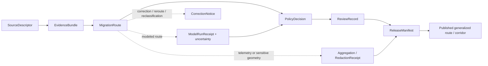

<!-- [KFM_META_BLOCK_V2]
doc_id: kfm://doc/contracts-domains-fauna-migration-route
title: Migration Route Contract
type: semantic-contract
version: v0.2
status: draft; PROPOSED; NEEDS VERIFICATION before promotion
owners: OWNER_TBD — Fauna steward · Migration/connectivity steward · Contract steward · Source steward · Sensitivity reviewer · Policy steward · Schema steward · Validation steward · Release steward · Docs steward
created: 2026-06-21
updated: 2026-06-21
policy_label: public; semantic-contract; fauna; migration-route; connectivity; movement-corridor; source-role-aware; sensitivity-aware; no-publication-authority
tags: [kfm, contracts, fauna, migration-route, corridor, connectivity, movement, telemetry, range, source-role, sensitivity, geoprivacy, evidence, policy, release, correction, rollback]
related:
  - ./README.md
  - ./domain_feature_identity.md
  - ./domain_layer_descriptor.md
  - ./domain_observation.md
  - ./domain_validation_report.md
  - ./invasive_species_record.md
  - ./conservation_status.md
  - ./disease_observation.md
  - ../../../docs/domains/fauna/README.md
  - ../../../docs/domains/fauna/SOURCES.md
  - ../../../docs/domains/fauna/SOURCE_ROLES.md
  - ../../../docs/domains/fauna/SENSITIVITY.md
  - ../../../docs/domains/fauna/SCHEMAS.md
  - ../../../schemas/contracts/v1/domains/fauna/migration_route.schema.json
  - ../../../data/registry/sources/fauna/
  - ../../../policy/domains/fauna/
  - ../../../policy/sensitivity/fauna/
  - ../../../fixtures/domains/fauna/migration_route/
  - ../../../tests/domains/fauna/
  - ../../../release/manifests/
notes:
  - "Expanded from a planned-path scaffold into a Fauna migration-route semantic contract."
  - "The paired schema is a PROPOSED scaffold with empty properties and additionalProperties=true; field-level realization remains NEEDS VERIFICATION."
  - "MigrationRoute is route/corridor/connectivity meaning, not proof of exact animal travel, telemetry disclosure permission, habitat suitability, public-safe exact geometry, or a release decision."
  - "Telemetry, roost/nest/den/hibernacula/spawning context, rare-taxon movement corridors, sensitive stopovers, steward-controlled records, private-land joins, and re-identifying joins remain deny-by-default unless policy, review, transform, receipt, and release support exist."
  - "The user-provided Markdown Authoring Agent v2 prompt was treated as authoring guidance, not pasted into this contract."
[/KFM_META_BLOCK_V2] -->

# Migration Route

> Semantic contract for Fauna migration-route and movement-corridor records: what a route/corridor assertion means, what source roles can support it, how it relates to observation, range, telemetry, model, and layer objects, and which sensitivity and release controls must remain in force.

  
  
  
  
  
  

`contracts/domains/fauna/migration_route.md`

## Quick jumps

[Status](#status) · [Meaning](#meaning) · [Repo fit](#repo-fit) · [Schema posture](#schema-posture) · [What this contract asserts](#what-this-contract-asserts) · [What it does not assert](#what-it-does-not-assert) · [Recommended semantics](#recommended-semantics) · [Source-role rules](#source-role-rules) · [Sensitivity and release](#sensitivity-and-release) · [Lifecycle](#lifecycle) · [Validation](#validation) · [Open questions](#open-questions) · [Evidence basis](#evidence-basis) · [Rollback](#rollback)

---

## Status

> [!IMPORTANT]
> **Status:** `draft` / semantic contract  
> **Contract path:** `contracts/domains/fauna/migration_route.md`  
> **Schema path:** `schemas/contracts/v1/domains/fauna/migration_route.schema.json`  
> **Truth posture:** target path, prior scaffold, paired schema metadata, Fauna contract-lane split, Fauna schema-home split, source-role crosswalk, and sensitivity doctrine are CONFIRMED from current repo evidence. Full field validation, fixtures, validators, source registry behavior, model-run receipt behavior, policy runtime behavior, release workflow, API behavior, UI behavior, and test coverage remain NEEDS VERIFICATION.

> [!CAUTION]
> `MigrationRoute` does not prove an individual animal traveled an exact path. It does **not** authorize telemetry disclosure, public exact-route display, sensitive stopover exposure, habitat or hazard claims, land-access conclusions, enforcement action, or release approval.

---

## Meaning

`MigrationRoute` is a Fauna semantic object that records **source-bound route, corridor, pathway, movement, connectivity, flyway, passage, seasonal movement, dispersal, stopover, or migration-support meaning** for an animal taxon, population, group, modeled unit, aggregate record, or reviewed route layer.

It answers questions like:

- Which taxon, population, life stage, season, or movement unit does the route concern?
- Is the route observed, modeled, aggregated, regulatory/administrative, candidate, or synthetic?
- Which source asserted it, with what source role, rights, cadence, and evidence support?
- What spatial support is represented: exact track, generalized corridor, buffered line, raster corridor, administrative segment, waterbody/river reach, flyway unit, stopover complex, or public-safe aggregate?
- Which temporal scope applies: season, migration window, observed track interval, model run, source version, release, or correction time?
- Does the route touch telemetry, sensitive taxa, exact sites, private land, steward-controlled records, or re-identifying joins?
- Which evidence, model-run, policy, review, release, correction, and rollback references must resolve before display?

It is not the same as a raw telemetry track, general occurrence, habitat suitability model, range polygon, or released map layer. It is a governed route/corridor meaning object whose claim class depends on source role, evidence class, spatial support, temporal scope, sensitivity, and release posture.

---

## Repo fit

The Fauna contract README places semantic meaning in `contracts/domains/fauna/` while keeping machine shape, policy, source registry, fixtures, tests, data lifecycle, and release decisions in separate responsibility roots.

| Responsibility | Fauna lane path | This contract's role |
|---|---|---|
| Migration-route meaning | `contracts/domains/fauna/migration_route.md` | Owned here |
| Observation envelope | `contracts/domains/fauna/domain_observation.md` | Shared observation context; not replaced |
| Feature identity | `contracts/domains/fauna/domain_feature_identity.md` | Identity support; not replaced |
| Layer meaning | `contracts/domains/fauna/domain_layer_descriptor.md` | Downstream layer support |
| Machine schema shape | `schemas/contracts/v1/domains/fauna/migration_route.schema.json` | Linked only |
| Source identity and source role | `data/registry/sources/fauna/` | Required upstream support |
| Sensitivity and geoprivacy policy | `policy/sensitivity/fauna/`, `policy/domains/fauna/` | Required admissibility gate |
| Evidence/proof/model support | `data/proofs/`, model receipts, tests, fixtures | Required before consequential use |
| Release/correction/rollback | `release/`, correction contracts, receipts | Required downstream governance |

This split prevents a migration-route contract from quietly becoming raw telemetry, a route payload, a habitat model, a public map layer, a source descriptor, a policy decision, a release manifest, a schema, fixture, test, or UI implementation.

---

## Schema posture

The paired schema currently exists as a **PROPOSED scaffold**.

| Schema fact | Current evidence |
|---|---|
| Schema file path | `schemas/contracts/v1/domains/fauna/migration_route.schema.json` |
| Schema title | `Migration Route` |
| Declared properties | none yet |
| Required fields | none declared |
| Additional properties | `true` |
| Schema status | `PROPOSED` |
| Source document | `docs/domains/fauna/CANONICAL_PATHS.md` |
| Contract document | `contracts/domains/fauna/migration_route.md` |

Because the schema is empty and permissive, this contract defines **semantic expectations** for future schema, fixtures, validators, policy tests, source registry links, model-run receipts, release checks, and API/UI use. It does not claim current machine enforcement.

---

## What this contract asserts

A valid `MigrationRoute` contract instance should semantically assert:

1. **Movement subject** — the taxon, population, cohort, individual-group abstraction, life stage, season, or source-native movement unit being represented.
2. **Route class** — observed track, generalized corridor, aggregate flyway, modeled corridor, administrative route, candidate route, synthetic reconstruction, or another reviewed route class.
3. **Source role** — observed, aggregate, modeled, regulatory, administrative, candidate, synthetic, or another reviewed role.
4. **Evidence or model basis** — telemetry-derived, observation-derived, expert-reviewed, agency-designated, literature-derived, model-run-derived, aggregate reporting, or candidate ingest basis.
5. **Spatial support** — raw restricted geometry, generalized corridor, buffered line, polygon corridor, raster corridor, administrative/flyway unit, stopover complex, river reach, or public-safe layer reference.
6. **Temporal scope** — migration season, route validity interval, observed track time, model run time, source vintage, release, and correction time posture.
7. **Sensitivity/release posture** — whether exact route details, telemetry, sensitive stopovers, private land, or re-identifying joins require denial, aggregation, redaction, embargo, or reviewer-only access.
8. **Citation posture** — how public and AI surfaces cite, caveat, abstain, or disclose route uncertainty and source-role limits.

---

## What it does not assert

`MigrationRoute` must not be used as:

| Misuse | Why it is denied |
|---|---|
| Raw telemetry release | Telemetry records can reveal sensitive sites, private land, individual movement, or steward-controlled data. |
| Exact animal path proof | A generalized corridor or modeled route is not an exact travel path. |
| Occurrence proof by itself | A route/corridor does not prove a place-time observation unless supported by separate occurrence evidence. |
| Habitat suitability conclusion | Migration support and habitat suitability are related but distinct; habitat/model claims need their own evidence and contracts. |
| Public access or land-use conclusion | Route geometry does not imply public access, ownership, easement, or land-use permission. |
| Enforcement or emergency authority | KFM does not issue enforcement, warning, or emergency movement guidance. |
| Sensitive-location permission | Routes may encode nests, dens, roosts, hibernacula, stopovers, spawning areas, or restricted corridors. |
| Policy decision or release state | Policy, review, redaction, release, correction, and rollback remain separate object families. |

> [!WARNING]
> The highest-risk collapse is treating a restricted telemetry track or modeled corridor as a precise public route layer. Source role, evidence class, geometry support, uncertainty, rights, sensitivity, and release posture must travel with the claim.

---

## Recommended semantics

The paired JSON Schema is still a scaffold, so the following fields are **PROPOSED semantic expectations** for a future reviewed schema or fixture set.

| Field | Meaning |
|---|---|
| `id` | Canonical migration-route identity. |
| `version` | Contract/object version. |
| `spec_hash` | Deterministic content hash or integrity pin. |
| `taxon_ref` | Reference to a `Taxon`, taxon concept, population, or source-native movement subject. |
| `route_class` | Observed, generalized, aggregate, modeled, administrative, candidate, synthetic, or other reviewed route class. |
| `source_descriptor_ref` | Source identity, rights, cadence, and source role. |
| `source_role` | Canonical source role for the assertion. |
| `evidence_class` | Telemetry-derived, observation-derived, literature-derived, model-derived, agency-designated, aggregate, candidate, synthetic, etc. |
| `model_run_ref` | Model run receipt/reference when route is modeled or derived. |
| `domain_feature_identity_ref` | Stable identity reference where used. |
| `domain_observation_refs` | Observation envelope references when route is derived from observations. |
| `support_geometry_ref` | Raw/restricted/generalized/aggregate route geometry reference. |
| `public_geometry_ref` | Public-safe route/corridor geometry, if released. |
| `temporal_scope` | Season, observed, valid, source, model-run, retrieval, release, and correction time posture. |
| `uncertainty` | Confidence, resolution, model uncertainty, route-width caveat, or source limitation. |
| `sensitivity_state` | Sensitivity tier/rank, denial, generalization, redaction, embargo, steward review, or restriction posture. |
| `evidence_refs` | EvidenceRef/EvidenceBundle links. |
| `policy_decision_ref` | Policy result when the route affects publication. |
| `review_record_ref` | Steward/source/sensitivity/release review record. |
| `redaction_receipt_ref` | Generalization, aggregation, or suppression receipt when public geometry differs from raw support. |
| `release_ref` | Release or candidate release linkage. |
| `correction_refs` | Correction/supersession/rollback lineage. |

---

## Source-role rules

| Source pattern | Canonical source role | Contract posture |
|---|---|---|
| Direct telemetry or tracked movement records | `observed` or restricted observed subtype | Can support route derivation only with rights, sensitivity, and release controls; raw telemetry usually remains restricted. |
| Field observations aggregated into route evidence | `observed` / `aggregate` depending on unit | Must not become exact route truth unless evidence and method support it. |
| Flyway, corridor, critical-habitat, or formally designated route unit | `regulatory` or `administrative` | Can support context/designation claims; not observed travel proof by itself. |
| Public atlas, dashboard, or summarized route layer | `aggregate` | Can support summary/corridor claims; not exact movement or sensitive-site truth. |
| Movement or connectivity model output | `modeled` | Must carry model identity, uncertainty, and model-run receipt where adopted; never observed. |
| Ingested but unreviewed route candidate | `candidate` | Must not publish as authoritative until reviewed/promoted. |
| Generated/reconstructed historical route | `synthetic` | Requires reality-boundary disclosure; never observed reality. |

---

## Sensitivity and release

Migration-route records can expose sensitive taxa, exact movement corridors, private land, nesting/roosting/denning/hibernacula/spawning/stopover sites, telemetry records, steward-controlled datasets, or re-identifying joins.

Rules:

- Raw telemetry and exact sensitive route geometry default to deny/hold until reviewed.
- Public route layers require generalized, aggregated, or otherwise public-safe geometry.
- Route existence may sometimes be public while exact route geometry remains denied.
- Candidate or model-derived routes must not appear as observed migration truth.
- Sensitive stopovers, breeding/resting sites, and private-land joins require review and redaction/aggregation.
- Public clients receive only released, policy-safe representations through governed interfaces.

### Public-safe release chain

---

## Lifecycle

| Phase | Expected handling |
|---|---|
| RAW | Telemetry, route lines, route polygons, corridor rasters, expert notes, or source route layers remain source-bound and unpublished. |
| WORK / QUARANTINE | Candidate routes are normalized, source-role checked, rights checked, sensitivity reviewed, generalized/held as needed, and evidence-linked. |
| PROCESSED | Reviewed route receives deterministic identity, evidence/model references, geometry support, uncertainty, and policy posture. |
| CATALOG / TRIPLET | Route can support inspectable claims and graph edges only with resolved evidence, source role, safe spatial/temporal scope, and uncertainty. |
| PUBLISHED | Only public-safe generalized corridors, aggregates, or policy-approved representations are exposed. |
| CORRECTION | Rerouted corridors, taxonomic corrections, source withdrawals, duplicate lines, changed model runs, or sensitivity changes require correction and rollback consideration. |

---

## Validation

Before this contract is promoted beyond draft:

- [ ] Define and review the paired schema fields in `schemas/contracts/v1/domains/fauna/migration_route.schema.json`.
- [ ] Add fixtures for telemetry-derived route, generalized route, aggregate flyway, regulatory/designated route, modeled corridor, candidate route, and synthetic reconstruction cases.
- [ ] Add negative tests proving raw telemetry and sensitive exact routes cannot be public without redaction/aggregation/release.
- [ ] Add negative tests proving modeled, aggregate, regulatory, candidate, and synthetic routes cannot be cited as observed exact movement.
- [ ] Confirm source descriptors, rights, license, cadence, attribution, and source-role assignments for admitted route source families.
- [ ] Confirm model-run receipt and uncertainty behavior for modeled/derived routes.
- [ ] Confirm public display uses governed APIs/released artifacts only.
- [ ] Confirm correction and rollback behavior for reroutes, model updates, taxonomic changes, source withdrawals, and duplicate routes.

---

## Open questions

| ID | Question | Status |
|---|---|---|
| OQ-FAUNA-MR-001 | Which route classes are admitted for v1: telemetry-derived, aggregate flyway, modeled corridor, regulatory/designated corridor, synthetic reconstruction? | NEEDS VERIFICATION |
| OQ-FAUNA-MR-002 | What public-safe geometry generalization rule is canonical for route display? | NEEDS VERIFICATION |
| OQ-FAUNA-MR-003 | Which movement sources require permanent restricted handling because re-identification risk is too high? | NEEDS VERIFICATION |
| OQ-FAUNA-MR-004 | How should route uncertainty, route width, or model confidence be represented? | NEEDS VERIFICATION |
| OQ-FAUNA-MR-005 | Which route records should route to Habitat, Hydrology, Roads/Rail/Trade, or Hazards-adjacent lanes rather than Fauna? | NEEDS VERIFICATION |
| OQ-FAUNA-MR-006 | How are model-run changes, reroutes, and source withdrawals corrected and rolled back? | NEEDS VERIFICATION |

---

## Evidence basis

| Source | Status | Supports | Limits |
|---|---|---|---|
| `contracts/domains/fauna/migration_route.md` prior version | CONFIRMED repo evidence | Target existed as a planned-path scaffold. | Did not define authoritative semantics. |
| `schemas/contracts/v1/domains/fauna/migration_route.schema.json` | CONFIRMED repo evidence | Paired schema exists, points to this contract, and is PROPOSED. | Schema has empty properties and does not validate field-level semantics yet. |
| `contracts/domains/fauna/README.md` | CONFIRMED repo evidence | Fauna contract lane owns semantic meaning and excludes schema, policy, data, fixtures, tests, source registry, release, and UI code. | Does not define this specific migration-route contract. |
| `docs/domains/fauna/SCHEMAS.md` | CONFIRMED repo evidence | Explains meaning/shape/admissibility/proof split and schema-home rule. | Does not implement the paired schema. |
| `docs/domains/fauna/SOURCE_ROLES.md` | CONFIRMED repo evidence | Provides source-role anti-collapse vocabulary and examples. | Crosswalk only; per-source assignments belong to SourceDescriptor records. |
| `docs/domains/fauna/SENSITIVITY.md` | CONFIRMED repo evidence | Establishes fail-closed sensitive Fauna posture for exact sites, sensitive occurrences, steward-controlled records, and re-identifying joins. | Binding route-generalization policy remains outside this contract. |
| User-provided Markdown Authoring Agent v2 prompt | CONFIRMED user-provided guidance | Authoring guidance for grounded, repo-aware Markdown. | It is not repository implementation evidence and was not pasted into the contract. |

---

## Rollback

Rollback if this file is used to claim implemented schema validation, publish raw telemetry, expose exact sensitive routes or stopovers, collapse modeled/aggregate/regulatory/candidate/synthetic routes into observed exact movement, bypass model-run/evidence/source-role checks, or publish without evidence, rights, sensitivity, policy, review, release, correction, and rollback support.

Rollback target: prior scaffold blob SHA `ce06abd1061f2a7fb81ef750119c67439f8b5d9e`.

<a href="#top">Back to top</a>

