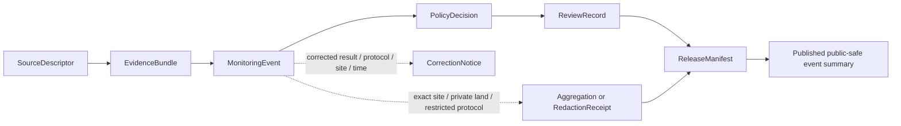

<!-- [KFM_META_BLOCK_V2]
doc_id: kfm://doc/contracts-domains-fauna-monitoring-event
title: Monitoring Event Contract
type: semantic-contract
version: v0.2
status: draft; PROPOSED; NEEDS VERIFICATION before promotion
owners: OWNER_TBD — Fauna steward · Monitoring/survey steward · Contract steward · Source steward · Sensitivity reviewer · Policy steward · Schema steward · Validation steward · Release steward · Docs steward
created: 2026-06-21
updated: 2026-06-21
policy_label: public; semantic-contract; fauna; monitoring-event; survey-effort; source-role-aware; sensitivity-aware; no-publication-authority
tags: [kfm, contracts, fauna, monitoring-event, survey, effort, detection, non-detection, source-role, sensitivity, geoprivacy, evidence, policy, release, correction, rollback]
related:
  - ./README.md
  - ./domain_observation.md
  - ./domain_feature_identity.md
  - ./domain_layer_descriptor.md
  - ./domain_validation_report.md
  - ./migration_route.md
  - ./invasive_species_record.md
  - ./disease_observation.md
  - ./conservation_status.md
  - ../../../docs/domains/fauna/README.md
  - ../../../docs/domains/fauna/SOURCES.md
  - ../../../docs/domains/fauna/SOURCE_ROLES.md
  - ../../../docs/domains/fauna/SENSITIVITY.md
  - ../../../docs/domains/fauna/SCHEMAS.md
  - ../../../schemas/contracts/v1/domains/fauna/monitoring_event.schema.json
  - ../../../data/registry/sources/fauna/
  - ../../../policy/domains/fauna/
  - ../../../policy/sensitivity/fauna/
  - ../../../fixtures/domains/fauna/monitoring_event/
  - ../../../tests/domains/fauna/
  - ../../../release/manifests/
notes:
  - "Expanded from a planned-path scaffold into a Fauna monitoring-event semantic contract."
  - "The paired schema is a PROPOSED scaffold with empty properties and additionalProperties=true; field-level realization remains NEEDS VERIFICATION."
  - "MonitoringEvent is survey/monitoring effort and event context, not automatic occurrence proof, absence proof, population estimate, enforcement authority, or public release permission."
  - "Monitoring sites, sensitive taxa, exact survey locations, non-public protocols, steward-controlled records, private-land joins, and re-identifying joins remain deny-by-default unless policy, review, transform, receipt, and release support exist."
  - "The user-provided Markdown Authoring Agent v2 prompt was treated as authoring guidance, not pasted into this contract."
[/KFM_META_BLOCK_V2] -->

# Monitoring Event

> Semantic contract for Fauna monitoring and survey events: what a monitoring event means, what source roles can support it, how effort/detection/non-detection context is preserved, and which sensitivity, evidence, policy, release, correction, and rollback controls must remain visible.

  
  
  
  
  
  

`contracts/domains/fauna/monitoring_event.md`

## Quick jumps

[Status](#status) · [Meaning](#meaning) · [Repo fit](#repo-fit) · [Schema posture](#schema-posture) · [What this contract asserts](#what-this-contract-asserts) · [What it does not assert](#what-it-does-not-assert) · [Recommended semantics](#recommended-semantics) · [Source-role rules](#source-role-rules) · [Sensitivity and release](#sensitivity-and-release) · [Lifecycle](#lifecycle) · [Validation](#validation) · [Open questions](#open-questions) · [Evidence basis](#evidence-basis) · [Rollback](#rollback)

---

## Status

> [!IMPORTANT]
> **Status:** `draft` / semantic contract  
> **Contract path:** `contracts/domains/fauna/monitoring_event.md`  
> **Schema path:** `schemas/contracts/v1/domains/fauna/monitoring_event.schema.json`  
> **Truth posture:** target path, prior scaffold, paired schema metadata, Fauna contract-lane split, Fauna schema-home split, source-role crosswalk, and sensitivity doctrine are CONFIRMED from current repo evidence. Full field validation, fixtures, validators, source registry behavior, protocol registry behavior, policy runtime behavior, release workflow, API behavior, UI behavior, and test coverage remain NEEDS VERIFICATION.

> [!CAUTION]
> `MonitoringEvent` records survey or monitoring context. It does **not** automatically prove occurrence, absence, abundance, trend, population status, compliance, enforcement, or public-safe site disclosure.

---

## Meaning

`MonitoringEvent` is a Fauna semantic object that records **source-bound monitoring, survey, sampling, station visit, transect, route, point count, camera deployment, acoustic deployment, eDNA/sample event, trap check, nest/roost count, mortality survey, disease surveillance event, or other governed survey effort**.

It answers questions like:

- What monitoring or survey effort occurred?
- Which source, program, protocol, method, observer, instrument, or organization asserted the event?
- Which taxa, target group, site, transect, route, sample, station, project, or monitoring unit was involved?
- Was the event a detection, non-detection, effort-only visit, sample collection, instrument deployment, aggregate survey, or candidate/unreviewed record?
- What observed, valid, source, retrieval, release, or correction time applies?
- What spatial support is represented, and is it safe to expose?
- Which evidence, source role, sensitivity, policy, review, release, correction, and rollback references must resolve before citation or display?

It is not itself the full payload for occurrence, disease, mortality, invasive-species, sensitive-site, or range claims. Those object-family contracts own their payload meanings. `MonitoringEvent` preserves the effort/event envelope so observation-like claims do not lose protocol, method, time, source role, geometry scope, evidence, and review context.

---

## Repo fit

The Fauna contract README places semantic meaning in `contracts/domains/fauna/` while keeping machine shape, policy, source registry, fixtures, tests, data lifecycle, and release decisions in separate responsibility roots.

| Responsibility | Fauna lane path | This contract's role |
|---|---|---|
| Monitoring-event meaning | `contracts/domains/fauna/monitoring_event.md` | Owned here |
| Shared observation envelope | `contracts/domains/fauna/domain_observation.md` | Linked; not replaced |
| Feature identity | `contracts/domains/fauna/domain_feature_identity.md` | Identity support; not replaced |
| Layer meaning | `contracts/domains/fauna/domain_layer_descriptor.md` | Downstream layer support |
| Machine schema shape | `schemas/contracts/v1/domains/fauna/monitoring_event.schema.json` | Linked only |
| Source identity, protocol, rights, cadence, source role | `data/registry/sources/fauna/` and any accepted protocol/source registry | Required upstream support; NEEDS VERIFICATION |
| Sensitivity and geoprivacy policy | `policy/sensitivity/fauna/`, `policy/domains/fauna/` | Required admissibility gate |
| Evidence/proof support | `data/proofs/`, tests, fixtures | Required before consequential use |
| Release/correction/rollback | `release/`, correction contracts, receipts | Required downstream governance |

This split prevents a monitoring-event contract from quietly becoming a schema, source descriptor, protocol registry, public survey-site layer, proof object, policy decision, release manifest, fixture, test, or UI implementation.

---

## Schema posture

The paired schema currently exists as a **PROPOSED scaffold**.

| Schema fact | Current evidence |
|---|---|
| Schema file path | `schemas/contracts/v1/domains/fauna/monitoring_event.schema.json` |
| Schema title | `Monitoring Event` |
| Declared properties | none yet |
| Required fields | none declared |
| Additional properties | `true` |
| Schema status | `PROPOSED` |
| Source document | `docs/domains/fauna/MISSING_OR_PLANNED_FILES.md` |
| Contract document | `contracts/domains/fauna/monitoring_event.md` |

Because the schema is empty and permissive, this contract defines **semantic expectations** for future schema, fixtures, validators, policy tests, source/protocol registry links, release checks, and API/UI use. It does not claim current machine enforcement.

---

## What this contract asserts

A valid `MonitoringEvent` contract instance should semantically assert:

1. **Event identity** — the monitoring/survey event, visit, deployment, sample, route, transect, station, or source-native event being represented.
2. **Monitoring purpose** — survey, inventory, trend monitoring, detection/non-detection, sample collection, disease surveillance, mortality survey, invasive-species monitoring, sensitive-site check, or other reviewed purpose.
3. **Source role** — observed, aggregate, administrative, candidate, modeled, synthetic, regulatory, or another reviewed role where applicable.
4. **Protocol/method basis** — survey protocol, gear, observation method, instrument, sampling design, effort unit, or source-native method.
5. **Subject/scope** — target taxon, taxon group, site, route, transect, station, sample, monitoring unit, or aggregate unit.
6. **Effort and result posture** — effort-only, detected, not detected, zero count, presence-only, count, abundance estimate, sample collected, instrument active/inactive, or unknown outcome where supported.
7. **Spatial and temporal scope** — event geometry/support, safe public geometry, observed time, effort duration, valid time, source time, retrieval time, release time, and correction time.
8. **Sensitivity/release posture** — whether exact site, route, observer, protocol, private-land, sensitive taxa, steward-controlled records, or re-identifying joins require denial, aggregation, redaction, embargo, or reviewer access.

---

## What it does not assert

`MonitoringEvent` must not be used as:

| Misuse | Why it is denied |
|---|---|
| Occurrence proof by itself | A monitoring event may contain or link detections, but occurrence evidence needs its own evidence class and object-family meaning. |
| Absence proof beyond survey scope | A non-detection is bounded by method, effort, time, target, detectability, and spatial support. |
| Population estimate by itself | Counts/effort require model, protocol, and analysis context before trend or abundance claims. |
| Sensitive-site publication permission | Monitoring may occur at nests, dens, roosts, hibernacula, spawning sites, or restricted survey stations. |
| Protocol registry | Protocol details and source governance belong in registry/source/protocol homes after verification. |
| Enforcement or compliance authority | KFM does not issue enforcement, compliance, inspection, or management orders. |
| Release state | Policy, review, redaction, release, correction, and rollback remain separate object families. |
| Clinical/veterinary or emergency guidance | Disease/mortality monitoring may be cited only as governed evidence, not advice or alert authority. |

> [!WARNING]
> The highest-risk collapse is treating a survey visit or non-detection as unrestricted public occurrence/absence truth. Method, effort, detectability, source role, evidence class, safe spatial scope, and release posture must travel with the claim.

---

## Recommended semantics

The paired JSON Schema is still a scaffold, so the following fields are **PROPOSED semantic expectations** for a future reviewed schema or fixture set.

| Field | Meaning |
|---|---|
| `id` | Canonical monitoring-event identity. |
| `version` | Contract/object version. |
| `spec_hash` | Deterministic content hash or integrity pin. |
| `event_kind` | Survey visit, point count, transect, route, station check, sample event, deployment, trap check, nest/roost count, mortality survey, disease surveillance event, etc. |
| `monitoring_purpose` | Inventory, trend, detection/non-detection, occupancy, sample collection, disease, mortality, invasive-species, sensitive-site review, or other purpose. |
| `source_descriptor_ref` | Source identity, rights, cadence, and source role. |
| `source_role` | Canonical source role for the assertion. |
| `source_native_id` | Source-native event, visit, protocol, sample, deployment, or record id where safe and permissible. |
| `protocol_ref` | Protocol/method reference where adopted. |
| `domain_observation_ref` | Shared observation envelope when the event produces observation-like records. |
| `domain_feature_identity_ref` | Stable identity reference where used. |
| `target_taxon_refs` | Taxon or taxon-group references when applicable. |
| `site_or_route_ref` | Site, station, transect, route, grid, survey unit, administrative unit, or generalized support reference. |
| `effort` | Duration, distance, area, traps, nights, sample count, observer count, instrument deployment, or source-native effort. |
| `result_summary` | Detection, non-detection, effort-only, count, sample collected, instrument state, or unknown outcome. |
| `detectability_context` | Method limits, seasonal limits, weather/context limits, uncertainty, or quality posture where available. |
| `observed_time` | When the event occurred. |
| `temporal_scope` | Observed, valid, source, retrieval, release, and correction time posture. |
| `support_geometry_ref` | Raw/restricted/generalized/aggregate spatial support reference. |
| `public_geometry_ref` | Public-safe event geometry, if released. |
| `sensitivity_state` | Sensitivity tier/rank, denial, generalization, redaction, embargo, steward review, or restriction posture. |
| `evidence_refs` | EvidenceRef/EvidenceBundle links. |
| `policy_decision_ref` | Policy result when the event affects publication. |
| `review_record_ref` | Steward/source/sensitivity/release review record. |
| `redaction_receipt_ref` | Generalization, aggregation, or suppression receipt when public geometry differs from raw support. |
| `release_ref` | Release or candidate release linkage. |
| `correction_refs` | Correction/supersession/rollback lineage. |

---

## Source-role rules

| Source pattern | Canonical source role | Contract posture |
|---|---|---|
| Field survey, point count, transect, route survey, sample event, camera/acoustic/trap deployment, or direct monitoring visit | `observed` | Can support event/effort claims if evidence, method, rights, and sensitivity resolve. |
| Survey roster, permit register, program schedule, station table, agency monitoring database, or administrative event list | `administrative` | Can support administrative event context; not necessarily observed detection truth. |
| Summarized monitoring dashboard, count rollup, effort grid, annual summary, or aggregate survey product | `aggregate` | Can support summary claims; not exact event or site truth. |
| Regulatory monitoring requirement or formally designated survey obligation | `regulatory` | Can support regulatory context; not an observed event by itself. |
| Watcher/ingest event awaiting review | `candidate` | Must not publish as authoritative until reviewed/promoted. |
| Modeled/simulated survey effort, predicted route, or derived occupancy/effort surface | `modeled` | Must carry model identity, uncertainty, and model-run receipt where adopted; never observed event truth. |
| Generated or reconstructed historical event | `synthetic` | Requires reality-boundary disclosure; never observed reality. |

---

## Sensitivity and release

Monitoring events can expose exact sensitive sites, private land, observer identity, restricted protocols, rare taxa, nests, dens, roosts, hibernacula, spawning sites, telemetry/sensor stations, steward-controlled records, or re-identifying joins.

Rules:

- Exact sensitive monitoring locations default to deny/hold until reviewed.
- Public event summaries require generalized, aggregated, or otherwise public-safe geometry when sensitive.
- Non-detections require method/effort/detectability caveats before public inference.
- Candidate events must not appear as reviewed survey events.
- Administrative schedules and survey rosters must not be treated as detections.
- Public clients receive only released, policy-safe representations through governed interfaces.

### Public-safe release chain

---

## Lifecycle

| Phase | Expected handling |
|---|---|
| RAW | Field sheets, survey exports, station visits, deployment logs, samples, rosters, or dashboard extracts remain source-bound and unpublished. |
| WORK / QUARANTINE | Candidate events are normalized, source-role checked, rights checked, method/effort checked, sensitivity reviewed, and evidence-linked. |
| PROCESSED | Reviewed events receive deterministic identity, evidence references, protocol/method context, safe support geometry, and policy posture. |
| CATALOG / TRIPLET | Event can support inspectable claims and graph edges only with resolved evidence, source role, safe spatial/temporal scope, and method caveats. |
| PUBLISHED | Only public-safe summaries, effort context, or policy-approved representations are exposed. |
| CORRECTION | Corrected counts, detections/non-detections, method changes, site corrections, duplicate events, source withdrawals, or sensitivity changes require correction and rollback consideration. |

---

## Validation

Before this contract is promoted beyond draft:

- [ ] Define and review the paired schema fields in `schemas/contracts/v1/domains/fauna/monitoring_event.schema.json`.
- [ ] Add fixtures for survey visit, point count, transect, route survey, sample collection, camera/acoustic/trap deployment, non-detection, administrative roster, aggregate summary, candidate event, modeled event, and synthetic reconstruction cases.
- [ ] Add negative tests proving administrative, aggregate, modeled, candidate, and synthetic events cannot be cited as observed detection truth.
- [ ] Add negative tests proving non-detection cannot be cited as absence beyond method/effort/scope.
- [ ] Add sensitive-site and private-land tests proving public output is aggregated/redacted/denied when required.
- [ ] Confirm source descriptors, protocol references, rights, license, cadence, attribution, and source-role assignments for admitted event source families.
- [ ] Confirm public display uses governed APIs/released artifacts only.
- [ ] Confirm correction and rollback behavior for corrected counts, corrected times/sites, duplicated events, protocol changes, source withdrawals, and sensitivity updates.

---

## Open questions

| ID | Question | Status |
|---|---|---|
| OQ-FAUNA-ME-001 | Which monitoring event kinds are admitted for v1? | NEEDS VERIFICATION |
| OQ-FAUNA-ME-002 | Where should protocol/method references live: source registry, protocol registry, or object-specific contract references? | NEEDS VERIFICATION |
| OQ-FAUNA-ME-003 | Which effort units and detectability caveats are required before public non-detection claims? | NEEDS VERIFICATION |
| OQ-FAUNA-ME-004 | What public-safe generalization rule is canonical for sensitive monitoring sites? | NEEDS VERIFICATION |
| OQ-FAUNA-ME-005 | Which monitoring records should route to Disease, Mortality, Invasive Species, Habitat, or Hydrology-adjacent lanes instead of plain Fauna monitoring? | NEEDS VERIFICATION |
| OQ-FAUNA-ME-006 | How are corrected counts, corrected detections, protocol changes, and duplicate events represented in correction lineage? | NEEDS VERIFICATION |

---

## Evidence basis

| Source | Status | Supports | Limits |
|---|---|---|---|
| `contracts/domains/fauna/monitoring_event.md` prior version | CONFIRMED repo evidence | Target existed as a planned-path scaffold. | Did not define authoritative semantics. |
| `schemas/contracts/v1/domains/fauna/monitoring_event.schema.json` | CONFIRMED repo evidence | Paired schema exists, points to this contract, and is PROPOSED. | Schema has empty properties and does not validate field-level semantics yet. |
| `contracts/domains/fauna/README.md` | CONFIRMED repo evidence | Fauna contract lane owns semantic meaning; monitoring events are observation/evidence meaning contracts and must preserve source role, evidence, time, geometry, sensitivity, and correction path. | Does not define this specific monitoring event. |
| `docs/domains/fauna/SCHEMAS.md` | CONFIRMED repo evidence | Explains meaning/shape/admissibility/proof split and lists `MonitoringEvent` as proposed monitoring/survey observation event with source attribution and site-dependent sensitivity. | Does not implement the paired schema. |
| `docs/domains/fauna/SOURCE_ROLES.md` | CONFIRMED repo evidence | Provides source-role anti-collapse vocabulary and examples. | Crosswalk only; per-source assignments belong to SourceDescriptor records. |
| `docs/domains/fauna/SENSITIVITY.md` | CONFIRMED repo evidence | Establishes fail-closed sensitive Fauna posture for exact sites, sensitive occurrences, steward-controlled records, and re-identifying joins. | Binding monitoring-site policy remains outside this contract. |
| User-provided Markdown Authoring Agent v2 prompt | CONFIRMED user-provided guidance | Authoring guidance for grounded, repo-aware Markdown. | It is not repository implementation evidence and was not pasted into the contract. |

---

## Rollback

Rollback if this file is used to claim implemented schema validation, publish exact sensitive monitoring locations, collapse monitoring effort into occurrence proof or absence proof, treat administrative/aggregate/modeled/candidate/synthetic events as observed detection truth, or publish without evidence, rights, sensitivity, policy, review, release, correction, and rollback support.

Rollback target: prior scaffold blob SHA `1a2186ea4d7af4f84572c230e2a546ab3a6125d8`.

<a href="#top">Back to top</a>

