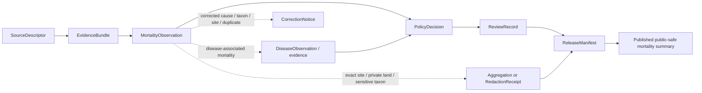

<!-- [KFM_META_BLOCK_V2]
doc_id: kfm://doc/contracts-domains-fauna-mortality-observation
title: Mortality Observation Contract
type: semantic-contract
version: v0.2
status: draft; PROPOSED; NEEDS VERIFICATION before promotion
owners: OWNER_TBD — Fauna steward · Mortality steward · Wildlife-health steward · Contract steward · Source steward · Sensitivity reviewer · Policy steward · Schema steward · Validation steward · Release steward · Docs steward
created: 2026-06-21
updated: 2026-06-21
policy_label: public; semantic-contract; fauna; mortality-observation; wildlife-health; source-role-aware; sensitivity-aware; no-publication-authority
tags: [kfm, contracts, fauna, mortality-observation, mortality, carcass, wildlife-health, source-role, sensitivity, geoprivacy, evidence, policy, release, correction, rollback]
related:
  - ./README.md
  - ./domain_observation.md
  - ./domain_feature_identity.md
  - ./domain_layer_descriptor.md
  - ./domain_validation_report.md
  - ./monitoring_event.md
  - ./disease_observation.md
  - ./invasive_species_record.md
  - ./conservation_status.md
  - ../../../docs/domains/fauna/README.md
  - ../../../docs/domains/fauna/SOURCES.md
  - ../../../docs/domains/fauna/SOURCE_ROLES.md
  - ../../../docs/domains/fauna/SENSITIVITY.md
  - ../../../docs/domains/fauna/SCHEMAS.md
  - ../../../schemas/contracts/v1/domains/fauna/mortality_observation.schema.json
  - ../../../data/registry/sources/fauna/
  - ../../../policy/domains/fauna/
  - ../../../policy/sensitivity/fauna/
  - ../../../fixtures/domains/fauna/mortality_observation/
  - ../../../tests/domains/fauna/
  - ../../../release/manifests/
notes:
  - "Expanded from a planned-path scaffold into a Fauna mortality-observation semantic contract."
  - "The paired schema is a PROPOSED scaffold with empty properties and additionalProperties=true; field-level realization remains NEEDS VERIFICATION."
  - "MortalityObservation is mortality evidence and event context, not automatic cause-of-death proof, disease proof, occurrence proof, population-impact conclusion, public alerting, enforcement authority, or release permission."
  - "Carcass locations, sensitive taxa, exact sites, disease-adjacent details, roadkill/private-land joins, steward-controlled records, and re-identifying joins remain deny-by-default unless policy, review, transform, receipt, and release support exist."
  - "The user-provided Markdown Authoring Agent v2 prompt was treated as authoring guidance, not pasted into this contract."
[/KFM_META_BLOCK_V2] -->

# Mortality Observation

> Semantic contract for Fauna mortality observations: what a mortality event or carcass-related record means, what source roles can support it, how it relates to occurrence, disease, monitoring, hazards, and impact claims, and which sensitivity, evidence, policy, release, correction, and rollback controls must remain visible.

  
  
  
  
  
  

`contracts/domains/fauna/mortality_observation.md`

## Quick jumps

[Status](#status) · [Meaning](#meaning) · [Repo fit](#repo-fit) · [Schema posture](#schema-posture) · [What this contract asserts](#what-this-contract-asserts) · [What it does not assert](#what-it-does-not-assert) · [Recommended semantics](#recommended-semantics) · [Source-role rules](#source-role-rules) · [Sensitivity and release](#sensitivity-and-release) · [Lifecycle](#lifecycle) · [Validation](#validation) · [Open questions](#open-questions) · [Evidence basis](#evidence-basis) · [Rollback](#rollback)

---

## Status

> [!IMPORTANT]
> **Status:** `draft` / semantic contract  
> **Contract path:** `contracts/domains/fauna/mortality_observation.md`  
> **Schema path:** `schemas/contracts/v1/domains/fauna/mortality_observation.schema.json`  
> **Truth posture:** target path, prior scaffold, paired schema metadata, Fauna contract-lane split, Fauna schema-home split, source-role crosswalk, and sensitivity doctrine are CONFIRMED from current repo evidence. Full field validation, fixtures, validators, source registry behavior, cause-class vocabulary, policy runtime behavior, release workflow, API behavior, UI behavior, and test coverage remain NEEDS VERIFICATION.

> [!CAUTION]
> `MortalityObservation` records mortality-related evidence. It does **not** automatically prove cause of death, disease presence, population impact, hazard causation, occurrence at public-safe precision, enforcement/compliance status, emergency alerting, or release approval.

---

## Meaning

`MortalityObservation` is a Fauna semantic object that records **source-bound evidence of animal death, carcass discovery, mortality event, mortality survey finding, mortality count, roadkill record, disease-adjacent mortality, hazard-adjacent mortality, or other governed mortality context**.

It answers questions like:

- What mortality evidence was observed, reported, summarized, modeled, or imported?
- Which taxon, individual, carcass, sample, event, monitoring event, road segment, waterbody, site, or aggregate unit does the record concern?
- Which source asserted it, with what source role, rights, cadence, evidence class, and limitations?
- What cause-of-death language, if any, is asserted by the source and with what confidence?
- What spatial and temporal scope can be cited without exposing sensitive taxa, private land, steward-controlled data, or re-identifying joins?
- Which evidence, disease, hazard, monitoring, policy, review, release, correction, and rollback references must resolve before display?

It is not the same as a disease observation, occurrence evidence, hazard impact conclusion, population trend, public health alert, or enforcement record. It is a mortality-evidence contract whose claim class depends on source role, evidence class, cause confidence, spatial support, temporal scope, sensitivity, and release posture.

---

## Repo fit

The Fauna contract README places semantic meaning in `contracts/domains/fauna/` while keeping machine shape, policy, source registry, fixtures, tests, data lifecycle, and release decisions in separate responsibility roots.

| Responsibility | Fauna lane path | This contract's role |
|---|---|---|
| Mortality-observation meaning | `contracts/domains/fauna/mortality_observation.md` | Owned here |
| Shared observation envelope | `contracts/domains/fauna/domain_observation.md` | Linked; not replaced |
| Disease observation meaning | `contracts/domains/fauna/disease_observation.md` | Related health context; not replaced |
| Monitoring event meaning | `contracts/domains/fauna/monitoring_event.md` | Survey/effort context; not replaced |
| Feature identity | `contracts/domains/fauna/domain_feature_identity.md` | Identity support; not replaced |
| Machine schema shape | `schemas/contracts/v1/domains/fauna/mortality_observation.schema.json` | Linked only |
| Source identity and source role | `data/registry/sources/fauna/` | Required upstream support |
| Sensitivity and geoprivacy policy | `policy/sensitivity/fauna/`, `policy/domains/fauna/` | Required admissibility gate |
| Evidence/proof support | `data/proofs/`, tests, fixtures | Required before consequential use |
| Release/correction/rollback | `release/`, correction contracts, receipts | Required downstream governance |

This split prevents a mortality-observation contract from quietly becoming a schema, cause-of-death classifier, disease proof, hazard impact proof, source descriptor, public alert, enforcement instruction, policy decision, release manifest, fixture, test, or UI implementation.

---

## Schema posture

The paired schema currently exists as a **PROPOSED scaffold**.

| Schema fact | Current evidence |
|---|---|
| Schema file path | `schemas/contracts/v1/domains/fauna/mortality_observation.schema.json` |
| Schema title | `Mortality Observation` |
| Declared properties | none yet |
| Required fields | none declared |
| Additional properties | `true` |
| Schema status | `PROPOSED` |
| Source document | `docs/domains/fauna/CANONICAL_PATHS.md` |
| Contract document | `contracts/domains/fauna/mortality_observation.md` |

Because the schema is empty and permissive, this contract defines **semantic expectations** for future schema, fixtures, validators, policy tests, source registry links, release checks, and API/UI use. It does not claim current machine enforcement.

---

## What this contract asserts

A valid `MortalityObservation` contract instance should semantically assert:

1. **Mortality subject** — the taxon, individual, carcass, sample, event, survey unit, road segment, waterbody, site, or aggregate unit being represented.
2. **Mortality evidence class** — direct carcass observation, roadkill report, necropsy/lab-associated finding, mortality survey, mortality count, agency record, aggregate summary, modeled estimate, candidate report, or synthetic reconstruction.
3. **Source role** — observed, aggregate, administrative, regulatory, candidate, modeled, synthetic, or another reviewed role.
4. **Cause posture** — unknown, suspected, source-stated, confirmed by qualified method, disease-associated, collision-associated, toxicological, environmental, predation, human-caused, or other reviewed category where supported.
5. **Evidence and method basis** — field observation, specimen/sample, necropsy, photo, report-only, sensor/camera, survey protocol, lab result, modeled estimate, or source-native evidence class.
6. **Spatial and temporal scope** — mortality location/support, public-safe geometry, discovery time, estimated death time, event interval, source time, retrieval time, release time, and correction time.
7. **Sensitivity/release posture** — whether exact carcass location, sensitive taxon, private land, road segment, disease-adjacent details, steward-controlled records, or re-identifying joins require denial, aggregation, redaction, embargo, or reviewer access.
8. **Citation posture** — how public and AI surfaces cite, caveat, abstain, or disclose mortality uncertainty and source-role limits.

---

## What it does not assert

`MortalityObservation` must not be used as:

| Misuse | Why it is denied |
|---|---|
| Cause-of-death proof by itself | Mortality evidence can record a suspected or source-stated cause, but cause requires qualified evidence and confidence. |
| Disease proof by itself | Disease context belongs to `disease_observation.md` or linked evidence; mortality is not automatically pathogen evidence. |
| Occurrence proof at public precision | A mortality record can indicate presence/death, but exact geometry may remain denied and evidence class must resolve. |
| Population impact conclusion | Mortality count does not prove trend, decline, outbreak severity, or ecosystem impact without additional analysis. |
| Hazard causation proof | Road, weather, toxin, infrastructure, predation, or disease context needs independent evidence before causation claims. |
| Public-health, veterinary, or emergency alert | KFM may cite governed evidence but must not become alert or advice authority. |
| Enforcement or legal conclusion | Mortality evidence does not prove violation, liability, ownership, or legal responsibility. |
| Policy decision or release state | Policy, review, redaction, release, correction, and rollback remain separate object families. |

> [!WARNING]
> The highest-risk collapse is treating a carcass report as confirmed cause, disease proof, public exact occurrence, or hazard impact. Cause posture, evidence class, source role, geometry support, sensitivity, and release posture must travel with the claim.

---

## Recommended semantics

The paired JSON Schema is still a scaffold, so the following fields are **PROPOSED semantic expectations** for a future reviewed schema or fixture set.

| Field | Meaning |
|---|---|
| `id` | Canonical mortality-observation identity. |
| `version` | Contract/object version. |
| `spec_hash` | Deterministic content hash or integrity pin. |
| `taxon_ref` | Reference to a `Taxon` or source-native taxon concept. |
| `mortality_subject_ref` | Individual, carcass, sample, event, survey unit, road segment, site, waterbody, or aggregate unit. |
| `mortality_evidence_class` | Direct observation, roadkill report, carcass survey, necropsy, lab-associated, aggregate count, modeled estimate, candidate report, etc. |
| `source_descriptor_ref` | Source identity, rights, cadence, and source role. |
| `source_role` | Canonical source role for the assertion. |
| `source_native_id` | Source-native event/report/sample/carcass id where safe and permissible. |
| `domain_observation_ref` | Shared observation envelope when used. |
| `monitoring_event_ref` | Monitoring/survey event reference where mortality was detected through effort. |
| `disease_observation_ref` | Disease/pathogen reference where mortality is disease-associated. |
| `cause_posture` | Unknown, suspected, source-stated, confirmed, mixed, modeled, or not-assessed cause posture. |
| `cause_concept` | Source-native or normalized mortality cause category when supported. |
| `method` | Field observation, necropsy, lab test, photo, passive report, survey, model, administrative record, etc. |
| `confidence` | Source-stated confidence, uncertainty, QA/QC, or limitation. |
| `observed_time` | Discovery, observation, or report time. |
| `estimated_death_time` | Estimated mortality time when stated and bounded. |
| `temporal_scope` | Observed, estimated, valid, source, retrieval, release, and correction time posture. |
| `support_geometry_ref` | Raw/restricted/generalized/aggregate spatial support reference. |
| `public_geometry_ref` | Public-safe geometry if released. |
| `sensitivity_state` | Sensitivity tier/rank, denial, generalization, redaction, embargo, steward review, or restriction posture. |
| `evidence_refs` | EvidenceRef/EvidenceBundle links. |
| `policy_decision_ref` | Policy result when the record affects publication. |
| `review_record_ref` | Steward/source/sensitivity/release review record. |
| `redaction_receipt_ref` | Generalization, aggregation, or suppression receipt when public geometry differs from raw support. |
| `release_ref` | Release or candidate release linkage. |
| `correction_refs` | Correction/supersession/rollback lineage. |

---

## Source-role rules

| Source pattern | Canonical source role | Contract posture |
|---|---|---|
| Field carcass observation, roadkill observation, survey mortality finding, specimen/carcass record, or necropsy-associated record | `observed` | Can support mortality-event claims if evidence, method, rights, and sensitivity resolve. |
| Agency mortality roster, incident table, roadkill database, permit register, carcass collection table, or administrative compilation | `administrative` | Can support administrative mortality context; not necessarily direct observation truth. |
| Summarized mortality dashboard, count rollup, annual report, spatial aggregate, or published rate | `aggregate` | Can support summary claims; not exact event or site truth. |
| Formal determination, regulatory mortality threshold, agency order, or legal designation | `regulatory` | Can support regulatory context; not an observed mortality event by itself. |
| Watcher/ingest or public report awaiting review | `candidate` | Must not publish as authoritative until reviewed/promoted. |
| Modeled mortality estimate, predicted risk, or derived surface | `modeled` | Must carry model identity, uncertainty, and model-run receipt where adopted; never observed event truth. |
| Generated/reconstructed historical mortality statement | `synthetic` | Requires reality-boundary disclosure; never observed reality. |

---

## Sensitivity and release

Mortality observations can expose exact sensitive taxa, private land, road segments, carcass locations, disease-adjacent details, nest/den/roost/hibernacula/spawning-site context, steward-controlled records, or re-identifying joins.

Rules:

- Exact sensitive mortality locations default to deny/hold until reviewed.
- Public mortality summaries require generalized, aggregated, or otherwise public-safe geometry when sensitive.
- Cause-of-death fields require explicit evidence class, method, confidence, and limitation posture.
- Disease-associated mortality must not become disease proof unless linked evidence supports that claim.
- Candidate events must not appear as reviewed mortality events.
- Administrative rosters and aggregate dashboards must not be treated as direct observations.
- Public clients receive only released, policy-safe representations through governed interfaces.

### Public-safe release chain

---

## Lifecycle

| Phase | Expected handling |
|---|---|
| RAW | Carcass reports, roadkill exports, mortality survey records, necropsy tables, lab-associated records, or dashboards remain source-bound and unpublished. |
| WORK / QUARANTINE | Candidate mortality records are normalized, source-role checked, rights checked, evidence/cause checked, sensitivity reviewed, and linked to supporting records. |
| PROCESSED | Reviewed records receive deterministic identity, evidence references, method/cause/confidence context, safe support geometry, and policy posture. |
| CATALOG / TRIPLET | Mortality records can support inspectable claims and graph edges only with resolved evidence, source role, safe spatial/temporal scope, and cause caveats. |
| PUBLISHED | Only public-safe summaries, counts, generalized events, or policy-approved representations are exposed. |
| CORRECTION | Misidentifications, duplicate carcass reports, corrected cause, lab updates, taxonomic corrections, source withdrawals, or sensitivity changes require correction and rollback consideration. |

---

## Validation

Before this contract is promoted beyond draft:

- [ ] Define and review the paired schema fields in `schemas/contracts/v1/domains/fauna/mortality_observation.schema.json`.
- [ ] Add fixtures for field carcass record, roadkill record, mortality survey finding, necropsy-associated record, administrative roster, aggregate summary, candidate public report, modeled estimate, and synthetic reconstruction cases.
- [ ] Add negative tests proving administrative, aggregate, modeled, candidate, and synthetic records cannot be cited as direct observed mortality truth.
- [ ] Add negative tests proving cause-of-death and disease claims cannot be asserted without qualifying evidence.
- [ ] Add sensitive-site, sensitive-taxon, private-land, and re-identifying-join tests proving public output is aggregated/redacted/denied when required.
- [ ] Confirm source descriptors, rights, license, cadence, attribution, and source-role assignments for admitted mortality source families.
- [ ] Confirm public display uses governed APIs/released artifacts only.
- [ ] Confirm correction and rollback behavior for corrected cause, corrected taxon, corrected site/time, duplicate carcass reports, source withdrawals, lab updates, and sensitivity updates.

---

## Open questions

| ID | Question | Status |
|---|---|---|
| OQ-FAUNA-MORT-001 | Which mortality evidence classes are admitted for v1? | NEEDS VERIFICATION |
| OQ-FAUNA-MORT-002 | Which cause categories are allowed, and how are unknown/suspected/source-stated/confirmed causes represented? | NEEDS VERIFICATION |
| OQ-FAUNA-MORT-003 | How should roadkill records route across Fauna, Roads/Rail/Trade, Hazards, and public safety boundaries? | NEEDS VERIFICATION |
| OQ-FAUNA-MORT-004 | Which mortality records trigger disease-observation linkage or wildlife-health review? | NEEDS VERIFICATION |
| OQ-FAUNA-MORT-005 | What public-safe generalization rule is canonical for sensitive mortality locations? | NEEDS VERIFICATION |
| OQ-FAUNA-MORT-006 | How are duplicate carcass reports, corrected causes, lab updates, and taxonomic corrections represented in correction lineage? | NEEDS VERIFICATION |

---

## Evidence basis

| Source | Status | Supports | Limits |
|---|---|---|---|
| `contracts/domains/fauna/mortality_observation.md` prior version | CONFIRMED repo evidence | Target existed as a planned-path scaffold. | Did not define authoritative semantics. |
| `schemas/contracts/v1/domains/fauna/mortality_observation.schema.json` | CONFIRMED repo evidence | Paired schema exists, points to this contract, and is PROPOSED. | Schema has empty properties and does not validate field-level semantics yet. |
| `contracts/domains/fauna/README.md` | CONFIRMED repo evidence | Fauna contract lane owns semantic meaning; mortality observations are observation/evidence meaning contracts and must preserve source role, evidence, time, geometry, sensitivity, and correction path. | Does not define this specific mortality observation. |
| `docs/domains/fauna/SCHEMAS.md` | CONFIRMED repo evidence | Explains meaning/shape/admissibility/proof split and lists `MortalityObservation` as a proposed recorded mortality event with source attribution and taxon-dependent sensitivity. | Does not implement the paired schema. |
| `docs/domains/fauna/SOURCE_ROLES.md` | CONFIRMED repo evidence | Provides source-role anti-collapse vocabulary and examples. | Crosswalk only; per-source assignments belong to SourceDescriptor records. |
| `docs/domains/fauna/SENSITIVITY.md` | CONFIRMED repo evidence | Establishes fail-closed sensitive Fauna posture for exact sites, sensitive occurrences, steward-controlled records, and re-identifying joins. | Binding mortality-location policy remains outside this contract. |
| User-provided Markdown Authoring Agent v2 prompt | CONFIRMED user-provided guidance | Authoring guidance for grounded, repo-aware Markdown. | It is not repository implementation evidence and was not pasted into the contract. |

---

## Rollback

Rollback if this file is used to claim implemented schema validation, publish exact sensitive mortality locations, infer cause-of-death or disease proof without evidence, collapse mortality evidence into occurrence/population-impact/hazard-causation proof, treat administrative/aggregate/modeled/candidate/synthetic records as direct observed mortality truth, or publish without evidence, rights, sensitivity, policy, review, release, correction, and rollback support.

Rollback target: prior scaffold blob SHA `84f855e59f43b89b5c086a7de2fcdaadbafd2686`.

<a href="#top">Back to top</a>

