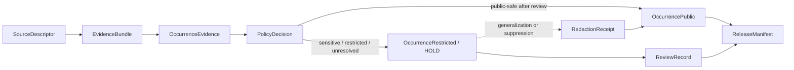

<!-- [KFM_META_BLOCK_V2]
doc_id: kfm://doc/contracts-domains-fauna-occurrence-evidence
title: Occurrence Evidence Contract
type: semantic-contract
version: v0.2
status: draft; PROPOSED; NEEDS VERIFICATION before promotion
owners: OWNER_TBD — Fauna steward · Occurrence steward · Evidence steward · Contract steward · Source steward · Sensitivity reviewer · Policy steward · Schema steward · Validation steward · Release steward · Docs steward
created: 2026-06-21
updated: 2026-06-21
policy_label: public; semantic-contract; fauna; occurrence-evidence; pre-sensitivity-split; source-role-aware; sensitivity-aware; no-publication-authority
tags: [kfm, contracts, fauna, occurrence-evidence, observation, evidence, source-role, sensitivity, geoprivacy, redaction, policy, release, correction, rollback]
related:
  - ./README.md
  - ./domain_observation.md
  - ./domain_feature_identity.md
  - ./domain_layer_descriptor.md
  - ./domain_validation_report.md
  - ./monitoring_event.md
  - ./mortality_observation.md
  - ./disease_observation.md
  - ./invasive_species_record.md
  - ./conservation_status.md
  - ../../../docs/domains/fauna/README.md
  - ../../../docs/domains/fauna/SOURCES.md
  - ../../../docs/domains/fauna/SOURCE_ROLES.md
  - ../../../docs/domains/fauna/SENSITIVITY.md
  - ../../../docs/domains/fauna/SCHEMAS.md
  - ../../../schemas/contracts/v1/domains/fauna/occurrence_evidence.schema.json
  - ../../../schemas/contracts/v1/domains/fauna/occurrence_restricted.schema.json
  - ../../../schemas/contracts/v1/domains/fauna/occurrence_public.schema.json
  - ../../../data/registry/sources/fauna/
  - ../../../policy/domains/fauna/
  - ../../../policy/sensitivity/fauna/
  - ../../../fixtures/domains/fauna/occurrence_evidence/
  - ../../../tests/domains/fauna/
  - ../../../release/manifests/
notes:
  - "Expanded from a planned-path scaffold into a Fauna occurrence-evidence semantic contract."
  - "The paired schema is a PROPOSED scaffold with empty properties and additionalProperties=true; field-level realization remains NEEDS VERIFICATION."
  - "OccurrenceEvidence is the source-bound observational record before the sensitivity split; it is not automatically OccurrencePublic or OccurrenceRestricted."
  - "Exact sensitive occurrence geometry, sensitive taxa, sensitive sites, steward-controlled records, private-land joins, and re-identifying joins remain deny-by-default unless policy, review, transform, receipt, and release support exist."
  - "The user-provided Markdown Authoring Agent v2 prompt was treated as authoring guidance, not pasted into this contract."
[/KFM_META_BLOCK_V2] -->

# Occurrence Evidence

> Semantic contract for Fauna source-bound occurrence evidence: the pre-publication observation record that can support a place/time/taxon occurrence claim only when source role, evidence, geometry, sensitivity, policy, review, release, correction, and rollback support resolve.

  
  
  
  
  
  

`contracts/domains/fauna/occurrence_evidence.md`

## Quick jumps

[Status](#status) · [Meaning](#meaning) · [Repo fit](#repo-fit) · [Schema posture](#schema-posture) · [What this contract asserts](#what-this-contract-asserts) · [What it does not assert](#what-it-does-not-assert) · [Recommended semantics](#recommended-semantics) · [Source-role rules](#source-role-rules) · [Sensitivity split](#sensitivity-split) · [Lifecycle](#lifecycle) · [Validation](#validation) · [Open questions](#open-questions) · [Evidence basis](#evidence-basis) · [Rollback](#rollback)

---

## Status

> [!IMPORTANT]
> **Status:** `draft` / semantic contract  
> **Contract path:** `contracts/domains/fauna/occurrence_evidence.md`  
> **Schema path:** `schemas/contracts/v1/domains/fauna/occurrence_evidence.schema.json`  
> **Truth posture:** target path, prior scaffold, paired schema metadata, Fauna contract-lane split, Fauna schema-home split, source-role crosswalk, and sensitivity doctrine are CONFIRMED from current repo evidence. Full field validation, fixtures, validators, source registry behavior, policy runtime behavior, redaction/generalization behavior, release workflow, API behavior, UI behavior, and test coverage remain NEEDS VERIFICATION.

> [!CAUTION]
> `OccurrenceEvidence` is not a public occurrence object. It does **not** authorize exact geometry exposure, prove public-safe display, collapse candidate/model/aggregate records into observed reality, or bypass the `OccurrenceRestricted` / `OccurrencePublic` sensitivity split.

---

## Meaning

`OccurrenceEvidence` is a Fauna semantic object that records **source-bound evidence that an animal taxon, individual, sign, specimen, sample, detection, report, or observation was associated with a place/time/support scope**.

It answers questions like:

- Which taxon, taxon concept, individual, sample, detection, sign, specimen, or source-native subject is involved?
- Which source asserted the occurrence-like evidence, with what source role, rights, cadence, and limits?
- What evidence class supports the record: field observation, specimen, acoustic detection, camera trap, telemetry, eDNA/sample, public report, administrative record, aggregate summary, model output, or synthetic reconstruction?
- What observed, valid, source, retrieval, release, or correction time applies?
- What geometry/support exists, and is it raw, restricted, generalized, aggregate, or public-safe?
- Does taxon/site/source context trigger sensitive-location, steward-control, private-land, embargo, or re-identification risk?
- Which EvidenceRef/EvidenceBundle, PolicyDecision, ReviewRecord, RedactionReceipt, ReleaseManifest, CorrectionNotice, and rollback references must resolve before use?

It is the **pre-sensitivity-split occurrence record**. Public and restricted occurrence contracts or schemas decide how it becomes an `OccurrenceRestricted`, `OccurrencePublic`, or non-public hold after policy and review.

---

## Repo fit

The Fauna contract README places semantic meaning in `contracts/domains/fauna/` while keeping machine shape, policy, source registry, fixtures, tests, data lifecycle, and release decisions in separate responsibility roots.

| Responsibility | Fauna lane path | This contract's role |
|---|---|---|
| Source-bound occurrence meaning | `contracts/domains/fauna/occurrence_evidence.md` | Owned here |
| Public occurrence meaning | `contracts/domains/fauna/occurrence_public.md` when reviewed | Downstream public-safe meaning; not replaced here |
| Restricted occurrence meaning | `contracts/domains/fauna/occurrence_restricted.md` when reviewed | Downstream restricted meaning; not replaced here |
| Shared observation envelope | `contracts/domains/fauna/domain_observation.md` | Linked; not replaced |
| Feature identity | `contracts/domains/fauna/domain_feature_identity.md` | Identity support; not replaced |
| Machine schema shape | `schemas/contracts/v1/domains/fauna/occurrence_evidence.schema.json` | Linked only |
| Source identity and source role | `data/registry/sources/fauna/` | Required upstream support |
| Sensitivity and geoprivacy policy | `policy/sensitivity/fauna/`, `policy/domains/fauna/` | Required admissibility gate |
| Evidence/proof support | `data/proofs/`, tests, fixtures | Required before consequential use |
| Release/correction/rollback | `release/`, correction contracts, receipts | Required downstream governance |

This split prevents an occurrence-evidence contract from quietly becoming a schema, source descriptor, public occurrence object, sensitive-site disclosure, redaction receipt, policy decision, release manifest, proof object, fixture, test, or UI implementation.

---

## Schema posture

The paired schema currently exists as a **PROPOSED scaffold**.

| Schema fact | Current evidence |
|---|---|
| Schema file path | `schemas/contracts/v1/domains/fauna/occurrence_evidence.schema.json` |
| Schema title | `Occurrence Evidence` |
| Declared properties | none yet |
| Required fields | none declared |
| Additional properties | `true` |
| Schema status | `PROPOSED` |
| Source document | `docs/domains/fauna/CANONICAL_PATHS.md` |
| Contract document | `contracts/domains/fauna/occurrence_evidence.md` |

Because the schema is empty and permissive, this contract defines **semantic expectations** for future schema, fixtures, validators, policy tests, redaction tests, source registry links, release checks, and API/UI use. It does not claim current machine enforcement.

---

## What this contract asserts

A valid `OccurrenceEvidence` contract instance should semantically assert:

1. **Occurrence subject** — the taxon, taxon concept, individual, sign, specimen, sample, detection, public report, or source-native occurrence-like unit.
2. **Evidence class** — field observation, specimen, acoustic detection, camera record, telemetry fix, eDNA/sample, photo/audio report, administrative record, aggregate summary, model output, candidate ingest, or synthetic reconstruction.
3. **Source role** — observed, aggregate, administrative, regulatory, modeled, candidate, synthetic, or another reviewed role.
4. **Source identity and rights posture** — SourceDescriptor/source registry reference, source-native id, attribution, cadence, license, and redistribution limits where applicable.
5. **Spatial support** — raw/restricted point, line, polygon, grid, route, survey unit, administrative unit, generalized geometry, aggregate geometry, or public-safe geometry reference.
6. **Temporal scope** — observed, valid, source, retrieval, release, and correction time posture.
7. **Sensitivity posture** — whether taxon/site/source context creates T4 denial, T1 generalization, reviewer-only handling, steward-controlled restriction, private-land risk, or re-identifying-join risk.
8. **Citation posture** — how public and AI surfaces cite, caveat, abstain, or disclose occurrence-evidence support and source-role limits.

---

## What it does not assert

`OccurrenceEvidence` must not be used as:

| Misuse | Why it is denied |
|---|---|
| Public occurrence by itself | Public occurrence requires policy, review, redaction/generalization if needed, ReleaseManifest, and safe geometry. |
| Restricted occurrence by itself | Restricted handling is a governed state, not just raw geometry presence. |
| Exact sensitive-location permission | Sensitive taxa, sites, steward records, and re-identifying joins fail closed until reviewed and receipted. |
| Taxonomic authority by itself | Occurrence evidence references taxon concepts; taxon identity/crosswalk contracts own taxonomic meaning. |
| Conservation status proof | Conservation status comes from status/regulatory/rank contracts, not mere occurrence. |
| Disease, mortality, monitoring, migration, or invasive-species proof | Related claims require their own object-family evidence and contracts. |
| Model-as-observation | Modeled output can provide modeled context but cannot become observed occurrence. |
| Population trend, abundance, habitat, access, ownership, or hazard conclusion | These require separate evidence, model, policy, or domain contracts. |
| Policy decision or release state | Policy, review, redaction, release, correction, and rollback remain separate object families. |

> [!WARNING]
> The highest-risk collapse is treating source-bound occurrence evidence as a public map point. Occurrence evidence can be real, well sourced, and still unsafe or illegal to publish at exact geometry.

---

## Recommended semantics

The paired JSON Schema is still a scaffold, so the following fields are **PROPOSED semantic expectations** for a future reviewed schema or fixture set.

| Field | Meaning |
|---|---|
| `id` | Canonical occurrence-evidence identity. |
| `version` | Contract/object version. |
| `spec_hash` | Deterministic content hash or integrity pin. |
| `taxon_ref` | Reference to a `Taxon` or source-native taxon concept. |
| `taxon_crosswalk_ref` | Crosswalk when source taxonomy differs from accepted KFM taxon identity. |
| `occurrence_subject_ref` | Individual, specimen, sample, sign, detection, report, or source-native occurrence unit. |
| `evidence_class` | Observation, specimen, acoustic, camera, telemetry, eDNA/sample, public report, administrative, aggregate, modeled, candidate, synthetic, etc. |
| `source_descriptor_ref` | Source identity, rights, cadence, attribution, and source role. |
| `source_role` | Canonical source role for the assertion. |
| `source_native_id` | Source-native observation/record/event/sample/catalog id where safe and permissible. |
| `domain_observation_ref` | Shared observation envelope when used. |
| `domain_feature_identity_ref` | Stable identity reference where used. |
| `monitoring_event_ref` | Monitoring/survey effort reference where applicable. |
| `observed_time` | When the observation/evidence was observed or collected. |
| `source_time` | Source version, payload, retrieval, or publication time. |
| `temporal_scope` | Observed, valid, source, retrieval, release, and correction time posture. |
| `support_geometry_ref` | Raw/restricted/generalized/aggregate spatial support reference. |
| `public_geometry_ref` | Public-safe geometry if released. |
| `sensitivity_state` | Sensitivity tier/rank, denial, generalization, redaction, embargo, steward review, or restriction posture. |
| `evidence_refs` | EvidenceRef/EvidenceBundle links. |
| `policy_decision_ref` | Policy result when the record affects publication. |
| `review_record_ref` | Steward/source/sensitivity/release review record. |
| `redaction_receipt_ref` | Generalization, aggregation, or suppression receipt when public geometry differs from raw support. |
| `release_ref` | Release or candidate release linkage. |
| `correction_refs` | Correction/supersession/rollback lineage. |

---

## Source-role rules

| Source pattern | Canonical source role | Contract posture |
|---|---|---|
| Field observation, specimen, acoustic detection, camera record, telemetry fix, sample/eDNA record, or other direct evidence | `observed` | Can support occurrence-evidence claims if evidence, method, rights, and sensitivity resolve. |
| Agency roster, permit register, administrative table, museum catalog extract, or compiled record list | `administrative` | Can support administrative occurrence context; not automatically direct observation truth. |
| Published atlas, dashboard, county/grid rollup, density/richness surface, or aggregated occurrence product | `aggregate` | Can support summary claims; not exact event or site truth. |
| Regulatory presence/designation, critical habitat, legal status area, or official boundary | `regulatory` | Can support regulatory context; not an observed occurrence by itself. |
| Watcher/ingest/public report awaiting review | `candidate` | Must not publish as authoritative until reviewed/promoted. |
| Habitat suitability, range model, predicted occurrence, or derived probability surface | `modeled` | Must carry model identity, uncertainty, and model-run receipt where adopted; never observed occurrence truth. |
| Generated or reconstructed historical occurrence statement | `synthetic` | Requires reality-boundary disclosure; never observed reality. |

---

## Sensitivity split

Occurrence evidence sits before the public/restricted split.

Rules:

- Exact sensitive occurrence geometry defaults to restricted/hold.
- Public occurrence requires policy decision, review state, and release state.
- Generalized public geometry requires RedactionReceipt or accepted aggregation/generalization receipt.
- Candidate, modeled, aggregate, administrative, and synthetic records must not be silently promoted into observed public occurrence.
- Public clients receive only released, policy-safe representations through governed interfaces.

---

## Lifecycle

| Phase | Expected handling |
|---|---|
| RAW | Source observations, specimens, detections, reports, samples, or catalog records remain source-bound and unpublished. |
| WORK / QUARANTINE | Candidate occurrence evidence is normalized, taxon-crosswalked, source-role checked, rights checked, sensitivity reviewed, and evidence-linked. |
| PROCESSED | Reviewed occurrence evidence receives deterministic identity, evidence references, source role, safe support geometry, and policy posture. |
| CATALOG / TRIPLET | Occurrence evidence can support inspectable claims and graph edges only with resolved evidence, source role, safe spatial/temporal scope, and sensitivity posture. |
| PUBLISHED | Only `OccurrencePublic` or other policy-approved public-safe representation is exposed; sensitive records remain restricted/held unless transformed and released. |
| CORRECTION | Misidentifications, false positives, duplicate records, taxonomic corrections, source withdrawals, geometry corrections, or sensitivity changes require correction and rollback consideration. |

---

## Validation

Before this contract is promoted beyond draft:

- [ ] Define and review the paired schema fields in `schemas/contracts/v1/domains/fauna/occurrence_evidence.schema.json`.
- [ ] Add fixtures for observed field observation, specimen, acoustic/camera detection, telemetry/sample record, administrative record, aggregate product, regulatory context, candidate report, modeled occurrence, and synthetic reconstruction.
- [ ] Add negative tests proving administrative, aggregate, regulatory, modeled, candidate, and synthetic records cannot be cited as observed occurrence truth.
- [ ] Add sensitive-taxon, sensitive-site, private-land, steward-controlled, and re-identifying-join tests proving public output is restricted/redacted/denied when required.
- [ ] Confirm source descriptors, rights, license, cadence, attribution, and source-role assignments for admitted occurrence source families.
- [ ] Confirm public/restricted split behavior into `OccurrenceRestricted` and `OccurrencePublic`.
- [ ] Confirm RedactionReceipt/ReviewRecord/PolicyDecision/ReleaseManifest behavior for public output.
- [ ] Confirm correction and rollback behavior for misidentification, false positive, duplicate, taxonomic correction, source withdrawal, geometry correction, and sensitivity update.

---

## Open questions

| ID | Question | Status |
|---|---|---|
| OQ-FAUNA-OE-001 | Which occurrence evidence classes are admitted for v1? | NEEDS VERIFICATION |
| OQ-FAUNA-OE-002 | Which source-native ids can be stored directly, hashed, or restricted behind EvidenceRef? | NEEDS VERIFICATION |
| OQ-FAUNA-OE-003 | What exact rule splits `OccurrenceEvidence` into `OccurrenceRestricted` versus `OccurrencePublic`? | NEEDS VERIFICATION |
| OQ-FAUNA-OE-004 | Which redaction/generalization receipts are canonical for public occurrence release? | NEEDS VERIFICATION |
| OQ-FAUNA-OE-005 | How are false positives, misidentifications, duplicate observations, and taxonomic splits/lumps represented in correction lineage? | NEEDS VERIFICATION |
| OQ-FAUNA-OE-006 | Which occurrence evidence cases should route to Monitoring, Disease, Mortality, Invasive Species, Range, Habitat, or Hydrology-adjacent lanes? | NEEDS VERIFICATION |

---

## Evidence basis

| Source | Status | Supports | Limits |
|---|---|---|---|
| `contracts/domains/fauna/occurrence_evidence.md` prior version | CONFIRMED repo evidence | Target existed as a planned-path scaffold. | Did not define authoritative semantics. |
| `schemas/contracts/v1/domains/fauna/occurrence_evidence.schema.json` | CONFIRMED repo evidence | Paired schema exists, points to this contract, and is PROPOSED. | Schema has empty properties and does not validate field-level semantics yet. |
| `contracts/domains/fauna/README.md` | CONFIRMED repo evidence | Fauna contract lane owns semantic meaning; occurrence evidence is an observation/evidence meaning contract and must preserve source role, evidence, time, geometry, sensitivity, and correction path. | Does not define this specific occurrence-evidence contract. |
| `docs/domains/fauna/SCHEMAS.md` | CONFIRMED repo evidence | Explains meaning/shape/admissibility/proof split and lists `OccurrenceEvidence` as source-bound observational record before the sensitivity split. | Does not implement the paired schema. |
| `docs/domains/fauna/SOURCE_ROLES.md` | CONFIRMED repo evidence | Provides source-role anti-collapse vocabulary and examples. | Crosswalk only; per-source assignments belong to SourceDescriptor records. |
| `docs/domains/fauna/SENSITIVITY.md` | CONFIRMED repo evidence | Establishes fail-closed sensitive Fauna posture for exact sensitive occurrences, sensitive sites, steward-controlled records, and re-identifying joins. | Binding occurrence-release policy remains outside this contract. |
| User-provided Markdown Authoring Agent v2 prompt | CONFIRMED user-provided guidance | Authoring guidance for grounded, repo-aware Markdown. | It is not repository implementation evidence and was not pasted into the contract. |

---

## Rollback

Rollback if this file is used to claim implemented schema validation, publish exact sensitive occurrence geometry, collapse occurrence evidence into public occurrence, treat administrative/aggregate/regulatory/modeled/candidate/synthetic records as observed occurrence truth, bypass the `OccurrenceRestricted` / `OccurrencePublic` split, or publish without evidence, rights, sensitivity, policy, review, release, correction, and rollback support.

Rollback target: prior scaffold blob SHA `f338b6eb9ccf94604607af8b9ad729e2c24c3591`.

<a href="#top">Back to top</a>

