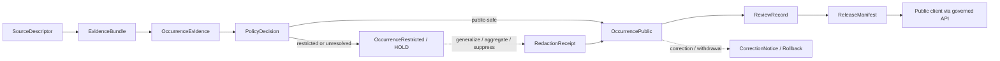

<!-- [KFM_META_BLOCK_V2]
doc_id: kfm://doc/contracts-domains-fauna-occurrence-public
title: Occurrence Public Contract
type: semantic-contract
version: v0.2
status: draft; PROPOSED; NEEDS VERIFICATION before promotion
owners: OWNER_TBD — Fauna steward · Occurrence steward · Public-release steward · Redaction steward · Contract steward · Source steward · Sensitivity reviewer · Policy steward · Schema steward · Validation steward · Release steward · Docs steward
created: 2026-06-21
updated: 2026-06-21
policy_label: public; semantic-contract; fauna; occurrence-public; public-safe-occurrence; redaction-aware; source-role-aware; sensitivity-aware; release-gated
tags: [kfm, contracts, fauna, occurrence-public, occurrence, public-safe, redaction, generalization, evidence, source-role, sensitivity, policy, release, correction, rollback]
related:
  - ./README.md
  - ./occurrence_evidence.md
  - ./occurrence_restricted.md
  - ./domain_observation.md
  - ./domain_feature_identity.md
  - ./domain_layer_descriptor.md
  - ./domain_validation_report.md
  - ./monitoring_event.md
  - ./sensitive_site.md
  - ../../../docs/domains/fauna/README.md
  - ../../../docs/domains/fauna/SOURCES.md
  - ../../../docs/domains/fauna/SOURCE_ROLES.md
  - ../../../docs/domains/fauna/SENSITIVITY.md
  - ../../../docs/domains/fauna/SCHEMAS.md
  - ../../../schemas/contracts/v1/domains/fauna/occurrence_public.schema.json
  - ../../../schemas/contracts/v1/domains/fauna/occurrence_evidence.schema.json
  - ../../../schemas/contracts/v1/domains/fauna/occurrence_restricted.schema.json
  - ../../../data/registry/sources/fauna/
  - ../../../policy/domains/fauna/
  - ../../../policy/sensitivity/fauna/
  - ../../../fixtures/domains/fauna/occurrence_public/
  - ../../../tests/domains/fauna/
  - ../../../release/manifests/
notes:
  - "Expanded from a planned-path scaffold into a Fauna public-safe occurrence semantic contract."
  - "The paired schema is a PROPOSED scaffold with empty properties and additionalProperties=true; field-level realization remains NEEDS VERIFICATION."
  - "OccurrencePublic is a released or release-candidate public-safe representation downstream of OccurrenceEvidence, not raw occurrence evidence and not exact sensitive geometry."
  - "Exact sensitive occurrence geometry, sensitive sites, steward-controlled records, private-land joins, transform parameters, and re-identifying joins remain denied unless policy, review, redaction receipt, release, and rollback support exist."
  - "The user-provided Markdown Authoring Agent v2 prompt was treated as authoring guidance, not pasted into this contract."
[/KFM_META_BLOCK_V2] -->

# Occurrence Public

> Semantic contract for public-safe Fauna occurrence records: the released or release-candidate representation that can appear in public clients only after source role, evidence, sensitivity, policy, review, redaction/generalization, release, correction, and rollback support resolve.

  
  
  
  
  
  

`contracts/domains/fauna/occurrence_public.md`

## Quick jumps

[Status](#status) · [Meaning](#meaning) · [Repo fit](#repo-fit) · [Schema posture](#schema-posture) · [What this contract asserts](#what-this-contract-asserts) · [What it does not assert](#what-it-does-not-assert) · [Recommended semantics](#recommended-semantics) · [Source-role rules](#source-role-rules) · [Public-safe release path](#public-safe-release-path) · [Lifecycle](#lifecycle) · [Validation](#validation) · [Open questions](#open-questions) · [Evidence basis](#evidence-basis) · [Rollback](#rollback)

---

## Status

> [!IMPORTANT]
> **Status:** `draft` / semantic contract  
> **Contract path:** `contracts/domains/fauna/occurrence_public.md`  
> **Schema path:** `schemas/contracts/v1/domains/fauna/occurrence_public.schema.json`  
> **Truth posture:** target path, prior scaffold, paired schema metadata, Fauna contract-lane split, Fauna schema-home split, source-role crosswalk, sensitivity doctrine, and OccurrenceEvidence pre-sensitivity-split posture are CONFIRMED from current repo evidence. Full field validation, fixtures, validators, redaction behavior, source registry behavior, policy runtime behavior, release workflow, API behavior, UI behavior, and test coverage remain NEEDS VERIFICATION.

> [!CAUTION]
> `OccurrencePublic` is not raw occurrence evidence and is not exact sensitive-location permission. It is only the public-safe occurrence representation that remains after evidence, rights, sensitivity, policy, review, redaction/generalization, release, correction, and rollback requirements are satisfied.

---

## Meaning

`OccurrencePublic` is the Fauna semantic object for an occurrence record that is **safe for public or semi-public display at an approved granularity**.

It answers questions like:

- Which source-bound `OccurrenceEvidence` record or evidence bundle supports the public-safe occurrence?
- What taxon or taxon concept may be shown publicly?
- What public geometry or spatial support may be shown without exposing sensitive taxa, sensitive sites, private land, steward-controlled records, or re-identifying joins?
- What time scope may be shown publicly?
- What source role, evidence class, caveat, review state, redaction/generalization receipt, policy decision, release manifest, correction lineage, and rollback target support the public representation?
- Which details were withheld, generalized, aggregated, or abstained from public display?

It is downstream of `OccurrenceEvidence`. It may be derived from unrestricted occurrence evidence, or from restricted evidence that has been generalized, aggregated, suppressed, or otherwise transformed into a safe public representation.

---

## Repo fit

The Fauna contract README places semantic meaning in `contracts/domains/fauna/` while keeping machine shape, policy, source registry, fixtures, tests, data lifecycle, and release decisions in separate responsibility roots.

| Responsibility | Fauna lane path | This contract's role |
|---|---|---|
| Public-safe occurrence meaning | `contracts/domains/fauna/occurrence_public.md` | Owned here |
| Source-bound occurrence evidence | `contracts/domains/fauna/occurrence_evidence.md` | Required upstream support; not replaced |
| Restricted occurrence meaning | `contracts/domains/fauna/occurrence_restricted.md` when reviewed | Restricted/held sibling; not replaced |
| Shared observation envelope | `contracts/domains/fauna/domain_observation.md` | Linked; not replaced |
| Feature identity | `contracts/domains/fauna/domain_feature_identity.md` | Identity support; not replaced |
| Machine schema shape | `schemas/contracts/v1/domains/fauna/occurrence_public.schema.json` | Linked only |
| Source identity and source role | `data/registry/sources/fauna/` | Required upstream support |
| Sensitivity and geoprivacy policy | `policy/sensitivity/fauna/`, `policy/domains/fauna/` | Required admissibility gate |
| Evidence/proof support | `data/proofs/`, tests, fixtures | Required before consequential use |
| Redaction/generalization receipt | `correction/`, `release/`, or accepted receipt root | Required when geometry/detail was transformed; home NEEDS VERIFICATION |
| Release/correction/rollback | `release/`, correction contracts, receipts | Required downstream governance |

This split prevents a public occurrence contract from quietly becoming raw occurrence evidence, a sensitive-site disclosure, schema, source descriptor, policy decision, redaction receipt, release manifest, proof object, fixture, test, or UI implementation.

---

## Schema posture

The paired schema currently exists as a **PROPOSED scaffold**.

| Schema fact | Current evidence |
|---|---|
| Schema file path | `schemas/contracts/v1/domains/fauna/occurrence_public.schema.json` |
| Schema title | `Occurrence Public` |
| Declared properties | none yet |
| Required fields | none declared |
| Additional properties | `true` |
| Schema status | `PROPOSED` |
| Source document | `docs/domains/fauna/CANONICAL_PATHS.md` |
| Contract document | `contracts/domains/fauna/occurrence_public.md` |

Because the schema is empty and permissive, this contract defines **semantic expectations** for future schema, fixtures, validators, redaction tests, policy tests, source registry links, release checks, and API/UI use. It does not claim current machine enforcement.

---

## What this contract asserts

A valid `OccurrencePublic` contract instance should semantically assert:

1. **Public occurrence subject** — the taxon, taxon concept, public-safe observation subject, or source-bound occurrence support that may be exposed.
2. **Upstream evidence** — the `OccurrenceEvidence`, EvidenceRef, EvidenceBundle, source descriptor, source role, and evidence class supporting the public representation.
3. **Public geometry support** — the point, grid, administrative unit, generalized geometry, aggregated geometry, suppressed geometry statement, or public-safe spatial unit that may be shown.
4. **Redaction/generalization posture** — whether public geometry or metadata differs from raw support and which receipt/review/policy records justify that difference.
5. **Temporal scope** — the public-safe observed, valid, source, retrieval, release, and correction time posture.
6. **Release state** — the release manifest, review record, policy decision, and rollback target supporting public display.
7. **Caveat posture** — source role, uncertainty, withheld detail, sensitivity reason code, or public explanation needed to avoid overclaiming.
8. **Correction posture** — whether the public occurrence was corrected, superseded, withdrawn, stale, or rolled back.

---

## What it does not assert

`OccurrencePublic` must not be used as:

| Misuse | Why it is denied |
|---|---|
| Raw occurrence evidence | Raw/source-bound evidence stays in `OccurrenceEvidence` and lifecycle data roots. |
| Exact sensitive occurrence | Sensitive occurrence geometry belongs to restricted/held flows unless transformed and released. |
| Sensitive site disclosure | Nests, dens, roosts, hibernacula, spawning sites, steward-controlled sites, and restricted sites remain fail-closed. |
| Redaction recipe disclosure | Public records must not expose transform radii, fuzzing parameters, suppressed exact coordinates, or re-identifying details. |
| Policy approval by itself | PolicyDecision and ReviewRecord remain separate. |
| Release approval by itself | ReleaseManifest/PromotionDecision remains separate. |
| Taxonomic authority by itself | Taxon and taxon-crosswalk contracts own taxonomic meaning. |
| Disease, mortality, monitoring, migration, or invasive-species proof | Related claims require their own object-family contracts and evidence. |
| Population, abundance, trend, habitat, land-access, ownership, or hazard conclusion | These require additional evidence, models, or domain contracts. |

> [!WARNING]
> The public-safe representation must be the safest representation that still answers the public/steward need. It is not a reward for source quality and must never leak exact restricted geometry through joins, metadata, stable identifiers, or transform hints.

---

## Recommended semantics

The paired JSON Schema is still a scaffold, so the following fields are **PROPOSED semantic expectations** for a future reviewed schema or fixture set.

| Field | Meaning |
|---|---|
| `id` | Canonical public occurrence identity. |
| `version` | Contract/object version. |
| `spec_hash` | Deterministic content hash or integrity pin. |
| `occurrence_evidence_ref` | Link to source-bound `OccurrenceEvidence`. |
| `evidence_refs` | EvidenceRef/EvidenceBundle links supporting the public representation. |
| `taxon_ref` | Public-safe taxon or taxon concept reference. |
| `taxon_public_label` | Public label when exact taxon detail is safe to expose. |
| `source_descriptor_ref` | Source identity, rights, cadence, attribution, and source role. |
| `source_role` | Canonical source role for the supporting assertion. |
| `evidence_class` | Observation/specimen/acoustic/camera/eDNA/aggregate/model/candidate-derived where safely described. |
| `public_geometry_ref` | Public-safe geometry or spatial support reference. |
| `public_geometry_type` | Point, generalized point, grid, administrative unit, polygon, range unit, withheld statement, or other reviewed type. |
| `raw_geometry_ref` | Restricted pointer only, if allowed; never public exact coordinates in public outputs. |
| `redaction_receipt_ref` | Required when public geometry/detail is generalized, aggregated, or suppressed. |
| `policy_decision_ref` | Policy result authorizing public-safe representation. |
| `review_record_ref` | Steward/source/sensitivity/release review record. |
| `release_ref` | ReleaseManifest or candidate release linkage. |
| `temporal_scope` | Public-safe observed, valid, source, retrieval, release, and correction time posture. |
| `sensitivity_state` | Public-safe sensitivity tier/rank, reason code, withholding statement, or restricted-flow pointer. |
| `public_caveats` | Caveats required for source role, evidence class, spatial precision, temporal scope, uncertainty, or withheld details. |
| `correction_refs` | Correction/supersession/rollback lineage. |

---

## Source-role rules

| Source pattern | Public occurrence posture |
|---|---|
| `observed` field/specimen/acoustic/camera/eDNA evidence | May support public occurrence only when rights, sensitivity, redaction, review, and release resolve. |
| `administrative` catalog/roster/table record | Can support public context only with caveats; not automatically direct observed truth. |
| `aggregate` atlas/dashboard/grid/product | Can support public summary occurrence only at aggregate support; not exact event or site truth. |
| `regulatory` presence/designation/boundary | Can support public regulatory context; not observed occurrence by itself. |
| `candidate` public report or watcher ingest | Must not be published as authoritative occurrence until promoted or clearly labeled as candidate in an approved public flow. |
| `modeled` predicted occurrence/range/suitability | Must not be displayed as observed occurrence; requires model identity and uncertainty. |
| `synthetic` generated/reconstructed occurrence | Requires reality-boundary disclosure and cannot be observed occurrence truth. |

---

## Public-safe release path

Rules:

- Public occurrence requires upstream evidence and source-role support.
- Public occurrence requires policy and review support.
- Public occurrence requires release support.
- Public occurrence requires redaction/generalization receipt when derived from restricted or sensitive support.
- Public occurrence must not expose raw restricted coordinates, transform parameters, private-land joins, steward-controlled details, or sensitive site identifiers.
- Public clients consume governed released representations only.

---

## Lifecycle

| Phase | Expected handling |
|---|---|
| RAW | Source occurrence evidence remains source-bound and unpublished. |
| WORK / QUARANTINE | Candidate public representation is assessed for rights, source role, sensitivity, redaction/generalization, policy, review, and release readiness. |
| PROCESSED | Public-safe occurrence receives deterministic identity, evidence references, public geometry, caveats, redaction/review/policy support, and release posture. |
| CATALOG / TRIPLET | Public occurrence can support inspectable public claims and graph edges only with resolved evidence, source role, policy, review, release, and correction context. |
| PUBLISHED | Only released public-safe representation is exposed through governed interfaces. |
| CORRECTION | Misidentification, false positive, duplicate, taxonomic correction, geometry correction, source withdrawal, sensitivity change, or release withdrawal requires correction and rollback consideration. |

---

## Validation

Before this contract is promoted beyond draft:

- [ ] Define and review the paired schema fields in `schemas/contracts/v1/domains/fauna/occurrence_public.schema.json`.
- [ ] Add fixtures for unrestricted public occurrence, generalized sensitive occurrence, aggregate public occurrence, withheld-geometry public statement, candidate-denied case, modeled-denied case, and synthetic-disclosure case.
- [ ] Add negative tests proving exact sensitive geometry, transform parameters, steward-controlled details, private-land joins, and re-identifying joins cannot appear in public output.
- [ ] Add negative tests proving administrative, aggregate, regulatory, modeled, candidate, and synthetic records cannot be silently promoted into observed public occurrence.
- [ ] Confirm linkage to `OccurrenceEvidence`, `OccurrenceRestricted`, PolicyDecision, ReviewRecord, RedactionReceipt, ReleaseManifest, CorrectionNotice, and rollback records.
- [ ] Confirm source descriptors, rights, license, cadence, attribution, and source-role assignments for admitted public occurrence source families.
- [ ] Confirm public display uses governed APIs/released artifacts only.
- [ ] Confirm correction and rollback behavior for misidentification, false positive, duplicate, taxonomic correction, geometry correction, source withdrawal, sensitivity update, and release withdrawal.

---

## Open questions

| ID | Question | Status |
|---|---|---|
| OQ-FAUNA-OP-001 | Which public geometry types are admitted for v1? | NEEDS VERIFICATION |
| OQ-FAUNA-OP-002 | Which redaction/generalization receipts are canonical for public occurrence release? | NEEDS VERIFICATION |
| OQ-FAUNA-OP-003 | How much sensitivity reason detail can be public without aiding re-identification? | NEEDS VERIFICATION |
| OQ-FAUNA-OP-004 | Can candidate public reports ever appear in public flows, and if so under what explicit label and review state? | NEEDS VERIFICATION |
| OQ-FAUNA-OP-005 | How should public occurrences be invalidated when source records, taxonomy, sensitivity, or release state changes? | NEEDS VERIFICATION |
| OQ-FAUNA-OP-006 | Which public occurrence cases should route to Monitoring, Disease, Mortality, Invasive Species, Range, Habitat, or Hydrology-adjacent lanes? | NEEDS VERIFICATION |

---

## Evidence basis

| Source | Status | Supports | Limits |
|---|---|---|---|
| `contracts/domains/fauna/occurrence_public.md` prior version | CONFIRMED repo evidence | Target existed as a planned-path scaffold. | Did not define authoritative semantics. |
| `schemas/contracts/v1/domains/fauna/occurrence_public.schema.json` | CONFIRMED repo evidence | Paired schema exists, points to this contract, and is PROPOSED. | Schema has empty properties and does not validate field-level semantics yet. |
| `contracts/domains/fauna/README.md` | CONFIRMED repo evidence | Fauna contract lane owns semantic meaning; public occurrence belongs to sensitive-location meaning and must fail closed around exact sensitive locations and transform parameters. | Does not define this specific public occurrence contract. |
| `docs/domains/fauna/SCHEMAS.md` | CONFIRMED repo evidence | Explains meaning/shape/admissibility/proof split and lists `OccurrencePublic` as public-safe occurrence after generalization/redaction. | Does not implement the paired schema. |
| `contracts/domains/fauna/occurrence_evidence.md` | CONFIRMED repo evidence | Defines occurrence evidence as source-bound pre-sensitivity-split support, not public occurrence or exact-geometry release. | Does not define final public occurrence shape. |
| `docs/domains/fauna/SOURCE_ROLES.md` | CONFIRMED repo evidence | Provides source-role anti-collapse vocabulary and examples. | Crosswalk only; per-source assignments belong to SourceDescriptor records. |
| `docs/domains/fauna/SENSITIVITY.md` | CONFIRMED repo evidence | Establishes fail-closed sensitive Fauna posture for exact sensitive occurrences, sensitive sites, steward-controlled records, and re-identifying joins. | Binding occurrence-release policy remains outside this contract. |
| User-provided Markdown Authoring Agent v2 prompt | CONFIRMED user-provided guidance | Authoring guidance for grounded, repo-aware Markdown. | It is not repository implementation evidence and was not pasted into the contract. |

---

## Rollback

Rollback if this file is used to claim implemented schema validation, publish raw/source-bound occurrence evidence, expose exact sensitive occurrence geometry, leak transform parameters, collapse occurrence evidence into public occurrence without policy/review/release, treat administrative/aggregate/regulatory/modeled/candidate/synthetic records as observed public occurrence truth, or publish without evidence, rights, sensitivity, policy, review, redaction receipt, release, correction, and rollback support.

Rollback target: prior scaffold blob SHA `aac1c62242d6913d864e2a639726ee8b9fc3bad7`.

<a href="#top">Back to top</a>

