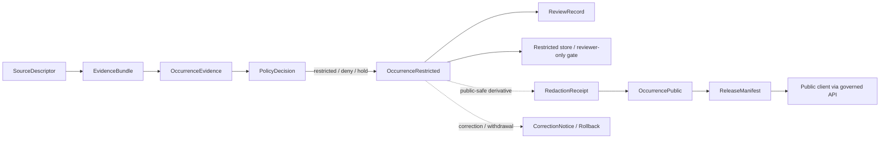

<!-- [KFM_META_BLOCK_V2]
doc_id: kfm://doc/contracts-domains-fauna-occurrence-restricted
title: Occurrence Restricted Contract
type: semantic-contract
version: v0.2
status: draft; PROPOSED; NEEDS VERIFICATION before promotion
owners: OWNER_TBD — Fauna steward · Occurrence steward · Restricted-data steward · Redaction steward · Contract steward · Source steward · Sensitivity reviewer · Policy steward · Schema steward · Validation steward · Release steward · Docs steward
created: 2026-06-21
updated: 2026-06-21
policy_label: restricted; semantic-contract; fauna; occurrence-restricted; sensitive-location; redaction-aware; source-role-aware; sensitivity-aware; release-gated
tags: [kfm, contracts, fauna, occurrence-restricted, occurrence, sensitive-location, restricted, redaction, generalization, evidence, source-role, sensitivity, policy, review, release, correction, rollback]
related:
  - ./README.md
  - ./occurrence_evidence.md
  - ./occurrence_public.md
  - ./sensitive_site.md
  - ./domain_observation.md
  - ./domain_feature_identity.md
  - ./domain_layer_descriptor.md
  - ./domain_validation_report.md
  - ./monitoring_event.md
  - ../../../docs/domains/fauna/README.md
  - ../../../docs/domains/fauna/SOURCES.md
  - ../../../docs/domains/fauna/SOURCE_ROLES.md
  - ../../../docs/domains/fauna/SENSITIVITY.md
  - ../../../docs/domains/fauna/SCHEMAS.md
  - ../../../schemas/contracts/v1/domains/fauna/occurrence_restricted.schema.json
  - ../../../schemas/contracts/v1/domains/fauna/occurrence_evidence.schema.json
  - ../../../schemas/contracts/v1/domains/fauna/occurrence_public.schema.json
  - ../../../data/registry/sources/fauna/
  - ../../../policy/domains/fauna/
  - ../../../policy/sensitivity/fauna/
  - ../../../fixtures/domains/fauna/occurrence_restricted/
  - ../../../tests/domains/fauna/
  - ../../../release/manifests/
notes:
  - "Expanded from a planned-path scaffold into a Fauna restricted-occurrence semantic contract."
  - "The paired schema is a PROPOSED scaffold with empty properties and additionalProperties=true; field-level realization remains NEEDS VERIFICATION."
  - "OccurrenceRestricted is the restricted/held occurrence representation downstream of OccurrenceEvidence; it is not public output and not a redaction recipe."
  - "Exact sensitive occurrence geometry, sensitive sites, steward-controlled records, private-land joins, transform parameters, and re-identifying joins remain denied unless policy, review, restricted-access controls, redaction receipt, release, and rollback support exist."
  - "The user-provided Markdown Authoring Agent v2 prompt was treated as authoring guidance, not pasted into this contract."
[/KFM_META_BLOCK_V2] -->

# Occurrence Restricted

> Semantic contract for restricted Fauna occurrence records: the held or restricted representation for occurrence evidence whose raw geometry, taxon/site context, source terms, steward control, or re-identification risk prevents normal public release.

  
  
  
  
  
  

`contracts/domains/fauna/occurrence_restricted.md`

## Quick jumps

[Status](#status) · [Meaning](#meaning) · [Repo fit](#repo-fit) · [Schema posture](#schema-posture) · [What this contract asserts](#what-this-contract-asserts) · [What it does not assert](#what-it-does-not-assert) · [Recommended semantics](#recommended-semantics) · [Source-role rules](#source-role-rules) · [Restricted handling path](#restricted-handling-path) · [Lifecycle](#lifecycle) · [Validation](#validation) · [Open questions](#open-questions) · [Evidence basis](#evidence-basis) · [Rollback](#rollback)

---

## Status

> [!IMPORTANT]
> **Status:** `draft` / semantic contract  
> **Contract path:** `contracts/domains/fauna/occurrence_restricted.md`  
> **Schema path:** `schemas/contracts/v1/domains/fauna/occurrence_restricted.schema.json`  
> **Truth posture:** target path, prior scaffold, paired schema metadata, Fauna contract-lane split, Fauna schema-home split, source-role crosswalk, sensitivity doctrine, OccurrenceEvidence pre-sensitivity-split posture, and OccurrencePublic public-safe posture are CONFIRMED from current repo evidence. Full field validation, fixtures, validators, restricted-access behavior, redaction behavior, source registry behavior, policy runtime behavior, release workflow, API behavior, UI behavior, and test coverage remain NEEDS VERIFICATION.

> [!CAUTION]
> `OccurrenceRestricted` is not public output. It is a restricted or held representation that preserves evidence and auditability while preventing exact sensitive occurrence data from reaching normal public clients.

---

## Meaning

`OccurrenceRestricted` is the Fauna semantic object for an occurrence record that must remain **restricted, held, embargoed, reviewer-only, steward-controlled, or transformed before public exposure**.

It answers questions like:

- Which upstream `OccurrenceEvidence` record or EvidenceBundle supports the restricted occurrence?
- Why is the occurrence restricted: sensitive taxon, sensitive site, exact location, private land, steward control, license terms, embargo, re-identification risk, candidate state, source-role limits, or unresolved policy/review state?
- Which raw or restricted geometry/support exists, and which parts must never appear in public output?
- Which policy decision, review record, sensitivity rule, source descriptor, rights record, redaction/generalization receipt, release manifest, correction notice, and rollback target govern access?
- Is a public-safe `OccurrencePublic` representation available, denied, delayed, generalized, aggregated, suppressed, or still pending review?

It is downstream of `OccurrenceEvidence` and adjacent to `OccurrencePublic`. A restricted occurrence may remain permanently restricted, may be used only in reviewer/steward workflows, or may emit a public-safe derived occurrence after redaction/generalization and release.

---

## Repo fit

The Fauna contract README places semantic meaning in `contracts/domains/fauna/` while keeping machine shape, policy, source registry, fixtures, tests, data lifecycle, and release decisions in separate responsibility roots.

| Responsibility | Fauna lane path | This contract's role |
|---|---|---|
| Restricted occurrence meaning | `contracts/domains/fauna/occurrence_restricted.md` | Owned here |
| Source-bound occurrence evidence | `contracts/domains/fauna/occurrence_evidence.md` | Required upstream support; not replaced |
| Public occurrence meaning | `contracts/domains/fauna/occurrence_public.md` | Public-safe sibling/downstream representation; not replaced |
| Sensitive-site meaning | `contracts/domains/fauna/sensitive_site.md` when reviewed | Related site-class meaning; not replaced |
| Shared observation envelope | `contracts/domains/fauna/domain_observation.md` | Linked; not replaced |
| Feature identity | `contracts/domains/fauna/domain_feature_identity.md` | Identity support; not replaced |
| Machine schema shape | `schemas/contracts/v1/domains/fauna/occurrence_restricted.schema.json` | Linked only |
| Source identity and source role | `data/registry/sources/fauna/` | Required upstream support |
| Sensitivity and geoprivacy policy | `policy/sensitivity/fauna/`, `policy/domains/fauna/` | Required admissibility gate |
| Evidence/proof support | `data/proofs/`, tests, fixtures | Required before consequential use |
| Release/correction/rollback | `release/`, correction contracts, receipts | Required downstream governance |

This split prevents a restricted occurrence contract from quietly becoming public occurrence output, raw lifecycle data, sensitive-site disclosure, schema, source descriptor, policy decision, redaction recipe, release manifest, proof object, fixture, test, or UI implementation.

---

## Schema posture

The paired schema currently exists as a **PROPOSED scaffold**.

| Schema fact | Current evidence |
|---|---|
| Schema file path | `schemas/contracts/v1/domains/fauna/occurrence_restricted.schema.json` |
| Schema title | `Occurrence Restricted` |
| Declared properties | none yet |
| Required fields | none declared |
| Additional properties | `true` |
| Schema status | `PROPOSED` |
| Source document | `docs/domains/fauna/CANONICAL_PATHS.md` |
| Contract document | `contracts/domains/fauna/occurrence_restricted.md` |

Because the schema is empty and permissive, this contract defines **semantic expectations** for future schema, fixtures, validators, restricted-access tests, redaction tests, policy tests, source registry links, release checks, and API/UI use. It does not claim current machine enforcement.

---

## What this contract asserts

A valid `OccurrenceRestricted` contract instance should semantically assert:

1. **Restricted occurrence subject** — the taxon, occurrence subject, sample, detection, sign, specimen, or source-native occurrence-like unit being protected.
2. **Upstream evidence** — the `OccurrenceEvidence`, EvidenceRef, EvidenceBundle, source descriptor, source role, and evidence class supporting the restricted record.
3. **Restriction basis** — sensitive taxon, exact sensitive site, steward-controlled record, private-land exposure, source terms, embargo, re-identification risk, candidate state, unresolved review, or policy denial.
4. **Restricted support geometry** — raw or restricted geometry reference, sensitive support unit, withheld site reference, or restricted geometry class. Public text must not expose the protected coordinates or transform parameters.
5. **Access posture** — reviewer-only, steward-only, embargoed, denied, quarantine, hold, public-safe derivative available, or permanent restricted state.
6. **Public-derivative posture** — whether an `OccurrencePublic` record exists, can be derived, has been denied, or remains pending review.
7. **Governance references** — policy decision, review record, sensitivity rule, redaction/generalization receipt, release record, correction notice, and rollback target where applicable.
8. **Correction posture** — whether the restricted occurrence was corrected, superseded, withdrawn, stale, or rolled back.

---

## What it does not assert

`OccurrenceRestricted` must not be used as:

| Misuse | Why it is denied |
|---|---|
| Public occurrence | Public-safe occurrence belongs to `OccurrencePublic` after policy/review/release. |
| Redaction recipe | Restricted records must not expose transform radii, fuzzing parameters, or suppression logic in public metadata. |
| Sensitive site publication | Nests, dens, roosts, hibernacula, spawning sites, and steward-controlled sites remain fail-closed. |
| Public map layer payload | Public clients must use released public-safe representations only. |
| Permanent proof of taxon status | Occurrence evidence does not automatically imply conservation status, abundance, trend, or population health. |
| Disease, mortality, monitoring, migration, or invasive-species proof | Related claims require their own object-family contracts and evidence. |
| Policy approval by itself | PolicyDecision and ReviewRecord remain separate. |
| Release approval by itself | ReleaseManifest/PromotionDecision remains separate. |

> [!WARNING]
> Restricted occurrence records are audit-preserving, not transparency theater. They must keep enough traceability for governed review while preventing exact sensitive details from leaking through fields, joins, stable IDs, logs, map tiles, summaries, or AI responses.

---

## Recommended semantics

The paired JSON Schema is still a scaffold, so the following fields are **PROPOSED semantic expectations** for a future reviewed schema or fixture set.

| Field | Meaning |
|---|---|
| `id` | Canonical restricted occurrence identity. |
| `version` | Contract/object version. |
| `spec_hash` | Deterministic content hash or integrity pin. |
| `occurrence_evidence_ref` | Link to source-bound `OccurrenceEvidence`. |
| `occurrence_public_ref` | Link to derived `OccurrencePublic`, when available. |
| `evidence_refs` | EvidenceRef/EvidenceBundle links supporting the restricted representation. |
| `taxon_ref` | Restricted taxon or taxon concept reference. |
| `source_descriptor_ref` | Source identity, rights, cadence, attribution, and source role. |
| `source_role` | Canonical source role for the supporting assertion. |
| `evidence_class` | Observation/specimen/acoustic/camera/eDNA/aggregate/model/candidate-derived where safely described. |
| `restricted_geometry_ref` | Restricted pointer to raw/exact/support geometry. Must not be exposed publicly. |
| `restricted_geometry_class` | Exact point, sensitive site, route, polygon, private parcel, steward-controlled location, withheld geometry, or other reviewed class. |
| `public_geometry_status` | None, pending, denied, generalized, aggregated, withheld, or released. |
| `restriction_basis` | Controlled reason codes for why the record is restricted. |
| `sensitivity_state` | Sensitivity tier/rank, T4 state, review state, embargo, steward-control, or restriction posture. |
| `policy_decision_ref` | Policy result authorizing hold/restriction/denial/public-safe derivative. |
| `review_record_ref` | Steward/source/sensitivity/release review record. |
| `redaction_receipt_ref` | Generalization, aggregation, or suppression receipt if a public derivative exists. |
| `release_ref` | Release/candidate release linkage for any public-safe derivative. |
| `temporal_scope` | Restricted/public-safe observed, valid, source, retrieval, release, embargo, and correction time posture. |
| `access_controls_ref` | Access-control or reviewer/steward gate reference, when adopted. |
| `correction_refs` | Correction/supersession/rollback lineage. |

---

## Source-role rules

| Source pattern | Restricted occurrence posture |
|---|---|
| `observed` field/specimen/acoustic/camera/eDNA/telemetry evidence | May support restricted occurrence when exact location, taxon/site, or source terms require hold/restriction. |
| `administrative` catalog/roster/table record | Can require restriction if source terms, site detail, steward-control, or private-land joins are implicated. |
| `aggregate` atlas/dashboard/grid/product | Usually safer, but still restricted if aggregation leaks sensitive sites or re-identification is possible. |
| `regulatory` presence/designation/boundary | May be public or restricted depending on legal/source constraints and sensitive-location risk. |
| `candidate` public report or watcher ingest | Hold/restrict until reviewed; do not publish as authoritative occurrence. |
| `modeled` predicted occurrence/range/suitability | Must not be treated as observed; may require restriction if it reveals sensitive sites or protected knowledge. |
| `synthetic` generated/reconstructed occurrence | Requires reality-boundary disclosure and may require restriction if it reconstructs sensitive locations. |

---

## Restricted handling path

Rules:

- Restricted occurrence requires upstream evidence and source-role support.
- Restricted occurrence requires policy and review support appropriate to sensitivity.
- Public access is denied unless a separate public-safe derivative is reviewed and released.
- Redaction/generalization receipts describe safe derived output, not public release of raw restricted data.
- Restricted records must not expose exact sensitive coordinates, transform parameters, private-land joins, steward-controlled details, or sensitive site identifiers in public or semi-public contexts.
- Public clients consume governed released representations only.

---

## Lifecycle

| Phase | Expected handling |
|---|---|
| RAW | Source occurrence evidence remains source-bound and unpublished. |
| WORK / QUARANTINE | Candidate restricted representation is assessed for rights, source role, sensitivity, access control, redaction/generalization possibility, policy, review, and release readiness. |
| PROCESSED | Restricted occurrence receives deterministic identity, evidence references, restricted geometry reference, restriction basis, review/policy support, and public-derivative posture. |
| CATALOG / TRIPLET | Restricted occurrence may support internal/reviewer graph edges only when access and policy permit; public graph edges must use public-safe derivatives. |
| PUBLISHED | Restricted record is not published as normal public data; only released public-safe derivatives may appear in public clients. |
| CORRECTION | Misidentification, false positive, duplicate, taxonomic correction, geometry correction, source withdrawal, sensitivity change, embargo change, or release withdrawal requires correction and rollback consideration. |

---

## Validation

Before this contract is promoted beyond draft:

- [ ] Define and review the paired schema fields in `schemas/contracts/v1/domains/fauna/occurrence_restricted.schema.json`.
- [ ] Add fixtures for sensitive taxon exact point, sensitive site, private-land record, steward-controlled record, source-term restricted record, candidate-held record, modeled-sensitive reconstruction, and aggregate-leakage case.
- [ ] Add negative tests proving exact sensitive geometry, transform parameters, steward-controlled details, private-land joins, access-control hints, and re-identifying joins cannot appear in public output.
- [ ] Add negative tests proving restricted records cannot be served to public clients without public-safe derivative release.
- [ ] Confirm linkage to `OccurrenceEvidence`, `OccurrencePublic`, PolicyDecision, ReviewRecord, RedactionReceipt, ReleaseManifest, CorrectionNotice, and rollback records.
- [ ] Confirm source descriptors, rights, license, cadence, attribution, and source-role assignments for admitted restricted occurrence source families.
- [ ] Confirm reviewer/steward access behavior and logging before any restricted API/path is used.
- [ ] Confirm correction and rollback behavior for misidentification, false positive, duplicate, taxonomic correction, geometry correction, source withdrawal, sensitivity update, embargo update, and release withdrawal.

---

## Open questions

| ID | Question | Status |
|---|---|---|
| OQ-FAUNA-OR-001 | Which controlled restriction-basis codes are canonical for v1? | NEEDS VERIFICATION |
| OQ-FAUNA-OR-002 | Which access-control object family owns reviewer/steward access gates? | NEEDS VERIFICATION |
| OQ-FAUNA-OR-003 | Which redaction/generalization receipts are canonical for public derivatives? | NEEDS VERIFICATION |
| OQ-FAUNA-OR-004 | How much restriction reason detail can be visible to non-steward reviewers without aiding re-identification? | NEEDS VERIFICATION |
| OQ-FAUNA-OR-005 | How should restricted occurrences be invalidated when source records, taxonomy, sensitivity, or release state changes? | NEEDS VERIFICATION |
| OQ-FAUNA-OR-006 | Which restricted occurrence cases must remain permanently denied rather than producing `OccurrencePublic` derivatives? | NEEDS VERIFICATION |

---

## Evidence basis

| Source | Status | Supports | Limits |
|---|---|---|---|
| `contracts/domains/fauna/occurrence_restricted.md` prior version | CONFIRMED repo evidence | Target existed as a planned-path scaffold. | Did not define authoritative semantics. |
| `schemas/contracts/v1/domains/fauna/occurrence_restricted.schema.json` | CONFIRMED repo evidence | Paired schema exists, points to this contract, and is PROPOSED. | Schema has empty properties and does not validate field-level semantics yet. |
| `contracts/domains/fauna/README.md` | CONFIRMED repo evidence | Fauna contract lane owns semantic meaning; restricted occurrence belongs to sensitive-location meaning and must fail closed around exact sensitive locations and transform parameters. | Does not define this specific restricted occurrence contract. |
| `docs/domains/fauna/SCHEMAS.md` | CONFIRMED repo evidence | Explains meaning/shape/admissibility/proof split and lists `OccurrenceRestricted` as sensitive occurrence where geometry/metadata fail closed. | Does not implement the paired schema. |
| `contracts/domains/fauna/occurrence_evidence.md` | CONFIRMED repo evidence | Defines occurrence evidence as source-bound pre-sensitivity-split support. | Does not define restricted access controls. |
| `contracts/domains/fauna/occurrence_public.md` | CONFIRMED repo evidence | Defines public occurrence as downstream public-safe representation after review/redaction/release. | Does not define restricted record shape. |
| `docs/domains/fauna/SOURCE_ROLES.md` | CONFIRMED repo evidence | Provides source-role anti-collapse vocabulary and examples. | Crosswalk only; per-source assignments belong to SourceDescriptor records. |
| `docs/domains/fauna/SENSITIVITY.md` | CONFIRMED repo evidence | Establishes fail-closed sensitive Fauna posture for exact sensitive occurrences, sensitive sites, steward-controlled records, and re-identifying joins. | Binding occurrence-restriction policy remains outside this contract. |
| User-provided Markdown Authoring Agent v2 prompt | CONFIRMED user-provided guidance | Authoring guidance for grounded, repo-aware Markdown. | It is not repository implementation evidence and was not pasted into the contract. |

---

## Rollback

Rollback if this file is used to claim implemented schema validation, publish restricted occurrence records, expose exact sensitive occurrence geometry, leak transform parameters or access hints, collapse restricted occurrence into public occurrence without policy/review/redaction/release, treat administrative/aggregate/regulatory/modeled/candidate/synthetic records as observed public occurrence truth, or publish without evidence, rights, sensitivity, policy, review, redaction receipt, release, correction, and rollback support.

Rollback target: prior scaffold blob SHA `b46ff8b806f189421124fb9235cd690525379171`.

<a href="#top">Back to top</a>

