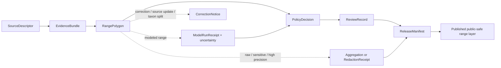

<!-- [KFM_META_BLOCK_V2]
doc_id: kfm://doc/contracts-domains-fauna-range-polygon
title: Range Polygon Contract
type: semantic-contract
version: v0.2
status: draft; PROPOSED; NEEDS VERIFICATION before promotion
owners: OWNER_TBD — Fauna steward · Range steward · Model steward · Contract steward · Source steward · Sensitivity reviewer · Policy steward · Schema steward · Validation steward · Release steward · Docs steward
created: 2026-06-21
updated: 2026-06-21
policy_label: public; semantic-contract; fauna; range-polygon; aggregate-range; model-aware; source-role-aware; sensitivity-aware; no-publication-authority
tags: [kfm, contracts, fauna, range-polygon, range, distribution, aggregate-geometry, modeled-range, source-role, sensitivity, geoprivacy, evidence, policy, release, correction, rollback]
related:
  - ./README.md
  - ./seasonal_range.md
  - ./migration_route.md
  - ./occurrence_evidence.md
  - ./occurrence_public.md
  - ./occurrence_restricted.md
  - ./domain_feature_identity.md
  - ./domain_layer_descriptor.md
  - ./domain_validation_report.md
  - ../../../docs/domains/fauna/README.md
  - ../../../docs/domains/fauna/SOURCES.md
  - ../../../docs/domains/fauna/SOURCE_ROLES.md
  - ../../../docs/domains/fauna/SENSITIVITY.md
  - ../../../docs/domains/fauna/SCHEMAS.md
  - ../../../schemas/contracts/v1/domains/fauna/range_polygon.schema.json
  - ../../../schemas/contracts/v1/domains/fauna/seasonal_range.schema.json
  - ../../../schemas/contracts/v1/domains/fauna/migration_route.schema.json
  - ../../../data/registry/sources/fauna/
  - ../../../policy/domains/fauna/
  - ../../../policy/sensitivity/fauna/
  - ../../../fixtures/domains/fauna/range_polygon/
  - ../../../tests/domains/fauna/
  - ../../../release/manifests/
notes:
  - "Expanded from a planned-path scaffold into a Fauna range-polygon semantic contract."
  - "The paired schema is a PROPOSED scaffold with empty properties and additionalProperties=true; field-level realization remains NEEDS VERIFICATION."
  - "RangePolygon is aggregated species range geometry, not occurrence proof, exact location proof, habitat suitability proof, migration-route proof, or public release permission."
  - "Raw exact range geometry, sensitive taxa, range polygons derived from sensitive occurrences, private-land joins, steward-controlled records, and re-identifying joins remain deny-by-default unless policy, review, aggregation/redaction receipt, release, and rollback support exist."
  - "The user-provided Markdown Authoring Agent v2 prompt was treated as authoring guidance, not pasted into this contract."
[/KFM_META_BLOCK_V2] -->

# Range Polygon

> Semantic contract for Fauna range polygons: what an aggregated species range geometry means, which source roles can support it, how it differs from occurrence evidence, seasonal range, migration route, habitat suitability, and model output, and which sensitivity, evidence, policy, release, correction, and rollback controls must remain visible.

  
  
  
  
  
  

`contracts/domains/fauna/range_polygon.md`

## Quick jumps

[Status](#status) · [Meaning](#meaning) · [Repo fit](#repo-fit) · [Schema posture](#schema-posture) · [What this contract asserts](#what-this-contract-asserts) · [What it does not assert](#what-it-does-not-assert) · [Recommended semantics](#recommended-semantics) · [Source-role rules](#source-role-rules) · [Sensitivity and release](#sensitivity-and-release) · [Lifecycle](#lifecycle) · [Validation](#validation) · [Open questions](#open-questions) · [Evidence basis](#evidence-basis) · [Rollback](#rollback)

---

## Status

> [!IMPORTANT]
> **Status:** `draft` / semantic contract  
> **Contract path:** `contracts/domains/fauna/range_polygon.md`  
> **Schema path:** `schemas/contracts/v1/domains/fauna/range_polygon.schema.json`  
> **Truth posture:** target path, prior scaffold, paired schema metadata, Fauna contract-lane split, Fauna schema-home split, source-role crosswalk, object-family listing, and sensitivity doctrine are CONFIRMED from current repo evidence. Full field validation, fixtures, validators, source registry behavior, model-run receipt behavior, aggregation/redaction behavior, policy runtime behavior, release workflow, API behavior, UI behavior, and test coverage remain NEEDS VERIFICATION.

> [!CAUTION]
> `RangePolygon` is not occurrence evidence. It does **not** prove a taxon was observed at every point inside the polygon, does not authorize exact sensitive occurrence exposure, and does not replace habitat suitability, seasonal range, migration route, or model-run contracts.

---

## Meaning

`RangePolygon` is a Fauna semantic object that records **aggregated species range geometry** for an animal taxon, taxon concept, population, management unit, source-native unit, or modeled/compiled distribution unit.

It answers questions like:

- Which taxon, taxon concept, population, or source-native unit does the range describe?
- Is the polygon an observed/compiled range, regulatory/admin range, aggregate atlas range, modeled range, candidate range, synthetic reconstruction, or public-safe generalized range?
- Which source asserted the range, with what source role, rights, cadence, evidence/model basis, and limitations?
- Which spatial support is represented: polygon, multipolygon, grid-derived range, generalized range, administrative range unit, buffered envelope, convex hull, atlas unit, or model-derived range?
- Which temporal scope applies: valid time, season, source vintage, model run, retrieval time, release time, or correction time?
- Does the range derive from sensitive occurrence records, private-land joins, steward-controlled records, or re-identifying source combinations?
- Which EvidenceRef, ModelRunReceipt, PolicyDecision, ReviewRecord, RedactionReceipt/AggregationReceipt, ReleaseManifest, CorrectionNotice, and rollback references must resolve before use?

It is not a raw occurrence layer. It is a range geometry contract whose claim class depends on source role, evidence/model basis, spatial support, temporal scope, uncertainty, sensitivity, and release posture.

---

## Repo fit

The Fauna contract README places semantic meaning in `contracts/domains/fauna/` while keeping machine shape, policy, source registry, fixtures, tests, data lifecycle, and release decisions in separate responsibility roots.

| Responsibility | Fauna lane path | This contract's role |
|---|---|---|
| Range-polygon meaning | `contracts/domains/fauna/range_polygon.md` | Owned here |
| Seasonal range meaning | `contracts/domains/fauna/seasonal_range.md` when reviewed | Temporal subset; not replaced here |
| Migration route meaning | `contracts/domains/fauna/migration_route.md` | Corridor/route meaning; not replaced |
| Occurrence evidence | `contracts/domains/fauna/occurrence_evidence.md` | Evidence input; not replaced |
| Public/restricted occurrence | `contracts/domains/fauna/occurrence_public.md`, `occurrence_restricted.md` | Related but not replaced |
| Feature identity | `contracts/domains/fauna/domain_feature_identity.md` | Identity support; not replaced |
| Layer meaning | `contracts/domains/fauna/domain_layer_descriptor.md` | Downstream layer support |
| Machine schema shape | `schemas/contracts/v1/domains/fauna/range_polygon.schema.json` | Linked only |
| Source identity and source role | `data/registry/sources/fauna/` | Required upstream support |
| Sensitivity and geoprivacy policy | `policy/sensitivity/fauna/`, `policy/domains/fauna/` | Required admissibility gate |
| Evidence/model/proof support | `data/proofs/`, model receipts, tests, fixtures | Required before consequential use |
| Release/correction/rollback | `release/`, correction contracts, receipts | Required downstream governance |

This split prevents a range-polygon contract from quietly becoming occurrence evidence, habitat truth, model proof, raw geometry release, source descriptor, policy decision, redaction recipe, release manifest, fixture, test, or UI implementation.

---

## Schema posture

The paired schema currently exists as a **PROPOSED scaffold**.

| Schema fact | Current evidence |
|---|---|
| Schema file path | `schemas/contracts/v1/domains/fauna/range_polygon.schema.json` |
| Schema title | `Range Polygon` |
| Declared properties | none yet |
| Required fields | none declared |
| Additional properties | `true` |
| Schema status | `PROPOSED` |
| Source document | `docs/domains/fauna/CANONICAL_PATHS.md` |
| Contract document | `contracts/domains/fauna/range_polygon.md` |

Because the schema is empty and permissive, this contract defines **semantic expectations** for future schema, fixtures, validators, policy tests, aggregation/redaction tests, source registry links, model-run receipts, release checks, and API/UI use. It does not claim current machine enforcement.

---

## What this contract asserts

A valid `RangePolygon` contract instance should semantically assert:

1. **Range subject** — the taxon, taxon concept, population, management unit, source-native unit, or modeled/compiled unit represented.
2. **Range class** — compiled range, observed aggregate, regulatory/admin unit, modeled range, atlas range, candidate range, synthetic reconstruction, or public-safe generalized range.
3. **Source role** — aggregate, modeled, regulatory, administrative, observed-derived, candidate, synthetic, or another reviewed role.
4. **Evidence/model basis** — occurrence-derived, expert-reviewed, agency-designated, literature-derived, atlas-derived, model-run-derived, source-native range, or synthetic reconstruction.
5. **Spatial support** — polygon, multipolygon, generalized polygon, grid-derived polygon, administrative unit, range envelope, raster-derived polygon, withheld geometry, or public-safe geometry reference.
6. **Temporal scope** — valid period, season if any, source vintage, model run time, retrieval time, release time, and correction time posture.
7. **Sensitivity/release posture** — whether raw geometry, range derivation, source terms, sensitive taxa, private-land joins, or re-identifying source combinations require denial, aggregation, redaction, embargo, or reviewer access.
8. **Citation posture** — how public and AI surfaces cite, caveat, abstain, or disclose range uncertainty, source-role limits, and model/aggregation limits.

---

## What it does not assert

`RangePolygon` must not be used as:

| Misuse | Why it is denied |
|---|---|
| Occurrence proof | Range means possible/known/compiled distribution support; it does not prove observation at a place/time. |
| Absence proof outside the polygon | Range boundaries are source/model artifacts and do not prove absence beyond them. |
| Exact sensitive occurrence map | Range polygons may derive from sensitive observations; public geometry must be generalized/aggregated as needed. |
| Habitat suitability proof | Range and habitat suitability are related but distinct; suitability requires model/habitat evidence. |
| Migration route or corridor proof | Movement corridors require `migration_route.md` or related route/model evidence. |
| Seasonal range by default | Seasonal subsets require explicit temporal/seasonal scope and a seasonal-range contract. |
| Model proof by itself | Modeled ranges require model identity, uncertainty, and model-run receipt where adopted. |
| Land access, ownership, or management authority | Range geometry does not imply public access, ownership, jurisdiction, or management permission. |
| Policy decision or release state | Policy, review, redaction, release, correction, and rollback remain separate object families. |

> [!WARNING]
> The highest-risk collapse is treating range geometry as a public-safe occurrence surface. Range polygons can be useful and well sourced while still unsafe to publish at raw precision or misleading if presented as observation truth.

---

## Recommended semantics

The paired JSON Schema is still a scaffold, so the following fields are **PROPOSED semantic expectations** for a future reviewed schema or fixture set.

| Field | Meaning |
|---|---|
| `id` | Canonical range-polygon identity. |
| `version` | Contract/object version. |
| `spec_hash` | Deterministic content hash or integrity pin. |
| `taxon_ref` | Reference to a `Taxon` or source-native taxon concept. |
| `range_subject_ref` | Population, management unit, source-native range unit, or modeled unit where applicable. |
| `range_class` | Compiled, aggregate, regulatory/admin, modeled, atlas-derived, candidate, synthetic, public-safe generalized, etc. |
| `source_descriptor_ref` | Source identity, rights, cadence, attribution, and source role. |
| `source_role` | Canonical source role for the range assertion. |
| `source_native_id` | Source-native range/map/layer id where safe and permissible. |
| `domain_feature_identity_ref` | Stable identity reference where used. |
| `occurrence_evidence_refs` | Occurrence evidence references when the range is occurrence-derived. |
| `model_run_ref` | Model run receipt/reference when the range is modeled or derived. |
| `support_geometry_ref` | Raw/restricted/source geometry reference. |
| `public_geometry_ref` | Public-safe geometry, if released. |
| `geometry_derivation` | Generalized, aggregated, rasterized, buffered, hull-derived, clipped, modeled, expert-drawn, source-native, etc. |
| `temporal_scope` | Valid, seasonal, source, model-run, retrieval, release, and correction time posture. |
| `uncertainty` | Confidence, resolution, boundary precision, model uncertainty, or source limitation. |
| `sensitivity_state` | Sensitivity tier/rank, denial, generalization, redaction, embargo, steward review, or restriction posture. |
| `evidence_refs` | EvidenceRef/EvidenceBundle links. |
| `policy_decision_ref` | Policy result when the range affects publication. |
| `review_record_ref` | Steward/source/sensitivity/release review record. |
| `redaction_receipt_ref` | Generalization, aggregation, or suppression receipt when public geometry differs from raw support. |
| `release_ref` | Release or candidate release linkage. |
| `correction_refs` | Correction/supersession/rollback lineage. |

---

## Source-role rules

| Source pattern | Canonical source role | Contract posture |
|---|---|---|
| Atlas range, county/grid rollup, compiled distribution polygon, public dashboard range | `aggregate` | Can support range summary claims; not exact occurrence truth. |
| Agency-designated range, official boundary, critical habitat/range unit, management unit | `regulatory` or `administrative` | Can support designation/context claims; not observed occurrence by itself. |
| Occurrence-derived range compiled from direct observations | `aggregate` with observed evidence references | Must preserve occurrence evidence links and sensitivity redaction; not every polygon point is observed. |
| Habitat/range/distribution model output | `modeled` | Must carry model identity, uncertainty, and model-run receipt where adopted; never observed occurrence truth. |
| Watcher/ingest or unreviewed range candidate | `candidate` | Must not publish as authoritative until reviewed/promoted. |
| Generated/reconstructed historical range | `synthetic` | Requires reality-boundary disclosure; never observed reality. |

---

## Sensitivity and release

Fauna schema docs list `RangePolygon` as `T1`, and Fauna sensitivity docs state raw exact range geometry is denied by default until aggregated/generalized public-safe release support exists.

Rules:

- Raw/source range geometry defaults to review before public use.
- Public range layers require generalized, aggregated, or otherwise public-safe geometry when sensitive.
- Ranges derived from sensitive occurrence evidence must not leak source occurrence locations through boundary precision, metadata, joins, or stable IDs.
- Modeled ranges must not be displayed as observed occurrence.
- Candidate ranges must not appear as reviewed/public truth.
- Public clients receive only released, policy-safe representations through governed interfaces.

### Public-safe release chain

---

## Lifecycle

| Phase | Expected handling |
|---|---|
| RAW | Source range polygons, atlas layers, model outputs, expert-drawn ranges, or compiled boundaries remain source-bound and unpublished. |
| WORK / QUARANTINE | Candidate ranges are normalized, source-role checked, rights checked, sensitivity reviewed, model/evidence-linked, and generalized/held as needed. |
| PROCESSED | Reviewed range receives deterministic identity, evidence/model references, geometry support, uncertainty, sensitivity state, and policy posture. |
| CATALOG / TRIPLET | Range can support inspectable claims and graph edges only with resolved evidence/source role, safe spatial/temporal scope, and caveats. |
| PUBLISHED | Only public-safe generalized/aggregated/released ranges are exposed. |
| CORRECTION | Source layer updates, taxonomic splits/lumps, model reruns, geometry corrections, false range inclusions, or sensitivity changes require correction and rollback consideration. |

---

## Validation

Before this contract is promoted beyond draft:

- [ ] Define and review the paired schema fields in `schemas/contracts/v1/domains/fauna/range_polygon.schema.json`.
- [ ] Add fixtures for aggregate atlas range, agency/admin range unit, occurrence-derived range, modeled range, candidate range, synthetic historical range, and public-safe generalized range.
- [ ] Add negative tests proving range polygons cannot be cited as occurrence proof, absence proof, habitat suitability proof, migration route proof, or public exact sensitive-location proof.
- [ ] Add sensitive-occurrence-derived range tests proving raw/source geometry is aggregated/redacted/denied when required.
- [ ] Confirm source descriptors, rights, license, cadence, attribution, and source-role assignments for admitted range sources.
- [ ] Confirm model-run receipt and uncertainty behavior for modeled/derived ranges.
- [ ] Confirm public display uses governed APIs/released artifacts only.
- [ ] Confirm correction and rollback behavior for source updates, geometry corrections, taxonomic changes, model reruns, source withdrawals, and sensitivity updates.

---

## Open questions

| ID | Question | Status |
|---|---|---|
| OQ-FAUNA-RP-001 | Which range classes are admitted for v1: aggregate, regulatory/admin, occurrence-derived, modeled, candidate, synthetic? | NEEDS VERIFICATION |
| OQ-FAUNA-RP-002 | What geometry derivation methods are accepted and how are they recorded? | NEEDS VERIFICATION |
| OQ-FAUNA-RP-003 | Which public-safe generalization or aggregation receipt is canonical for range polygons? | NEEDS VERIFICATION |
| OQ-FAUNA-RP-004 | How are taxonomic splits/lumps reflected in range identity and correction lineage? | NEEDS VERIFICATION |
| OQ-FAUNA-RP-005 | Which range polygons require model-run receipts versus source-layer receipts? | NEEDS VERIFICATION |
| OQ-FAUNA-RP-006 | Which range cases should route to Habitat, Hydrology, MigrationRoute, SeasonalRange, or cross-domain lane docs? | NEEDS VERIFICATION |

---

## Evidence basis

| Source | Status | Supports | Limits |
|---|---|---|---|
| `contracts/domains/fauna/range_polygon.md` prior version | CONFIRMED repo evidence | Target existed as a planned-path scaffold. | Did not define authoritative semantics. |
| `schemas/contracts/v1/domains/fauna/range_polygon.schema.json` | CONFIRMED repo evidence | Paired schema exists, points to this contract, and is PROPOSED. | Schema has empty properties and does not validate field-level semantics yet. |
| `contracts/domains/fauna/README.md` | CONFIRMED repo evidence | Fauna contract lane owns range/model meaning and requires observed, modeled, aggregate, and synthetic roles to remain separate. | Does not define this specific range-polygon contract. |
| `docs/domains/fauna/SCHEMAS.md` | CONFIRMED repo evidence | Explains meaning/shape/admissibility/proof split and lists `RangePolygon` as aggregated species range geometry with T1 sensitivity. | Does not implement the paired schema. |
| `docs/domains/fauna/SOURCE_ROLES.md` | CONFIRMED repo evidence | Provides source-role anti-collapse vocabulary and examples. | Crosswalk only; per-source assignments belong to SourceDescriptor records. |
| `docs/domains/fauna/SENSITIVITY.md` | CONFIRMED repo evidence | Establishes fail-closed sensitive Fauna posture and states RangePolygon raw exact geometry is denied until aggregated/generalized public-safe release support exists. | Binding range-generalization policy remains outside this contract. |
| User-provided Markdown Authoring Agent v2 prompt | CONFIRMED user-provided guidance | Authoring guidance for grounded, repo-aware Markdown. | It is not repository implementation evidence and was not pasted into the contract. |

---

## Rollback

Rollback if this file is used to claim implemented schema validation, publish raw/exact sensitive range geometry, treat a range polygon as occurrence proof, absence proof, habitat suitability proof, migration route proof, or observed reality, bypass model-run/evidence/source-role checks, or publish without evidence, rights, sensitivity, policy, review, aggregation/redaction receipt, release, correction, and rollback support.

Rollback target: prior scaffold blob SHA `bb4776fcd6a4f54793943c916903c519998743ac`.

<a href="#top">Back to top</a>

