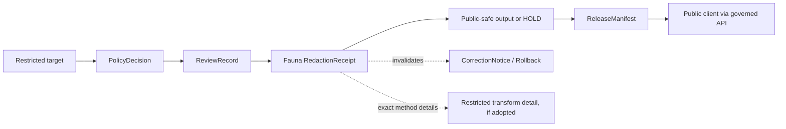

<!-- [KFM_META_BLOCK_V2]
doc_id: kfm://doc/contracts-domains-fauna-redaction-receipt
title: Fauna Redaction Receipt Contract
type: semantic-contract
version: v0.2
status: draft; PROPOSED; CONFLICTED placement; NEEDS VERIFICATION before promotion
owners: OWNER_TBD — Fauna steward · Redaction steward · Receipt steward · Sensitivity reviewer · Policy steward · Release steward · Contract steward · Schema steward · Validation steward · Docs steward
created: 2026-06-21
updated: 2026-06-21
policy_label: restricted; semantic-contract; fauna; redaction-receipt; receipt; geoprivacy; sensitivity; release-gated; no-cross-domain-authority
tags: [kfm, contracts, fauna, redaction-receipt, receipt, geoprivacy, redaction, generalization, suppression, sensitivity, evidence, policy, review, release, correction, rollback]
related:
  - ./README.md
  - ./occurrence_evidence.md
  - ./occurrence_restricted.md
  - ./occurrence_public.md
  - ./range_polygon.md
  - ./migration_route.md
  - ./monitoring_event.md
  - ./sensitive_site.md
  - ./domain_layer_descriptor.md
  - ./domain_validation_report.md
  - ../../../docs/domains/fauna/SENSITIVITY.md
  - ../../../docs/domains/fauna/SCHEMAS.md
  - ../../../docs/atlases/receipt-catalog.md
  - ../../../schemas/contracts/v1/domains/fauna/redaction_receipt.schema.json
  - ../../../policy/domains/fauna/
  - ../../../policy/sensitivity/fauna/
  - ../../../fixtures/domains/fauna/redaction_receipt/
  - ../../../tests/domains/fauna/
  - ../../../release/manifests/
notes:
  - "Expanded from a planned-path scaffold into a Fauna redaction-receipt semantic contract."
  - "Placement is CONFLICTED / NEEDS VERIFICATION: Fauna docs note RedactionReceipt is cross-cutting and may belong under a shared correction/receipt schema home pending ADR-S-03."
  - "The paired Fauna schema exists but is a PROPOSED scaffold with empty properties and additionalProperties=true; field-level realization remains NEEDS VERIFICATION."
  - "This file describes Fauna-specific redaction receipt meaning only; it must not duplicate or override cross-domain receipt, policy, review, release, correction, or rollback authority."
  - "The user-provided Markdown Authoring Agent v2 prompt was treated as authoring guidance, not pasted into this contract."
[/KFM_META_BLOCK_V2] -->

# Fauna Redaction Receipt

> Semantic contract for Fauna redaction receipts: the audit record that says a sensitive Fauna object was transformed, withheld, generalized, aggregated, masked, or suppressed before any public or semi-public representation was allowed.

  
  
  
  
  
  
  

`contracts/domains/fauna/redaction_receipt.md`

## Quick jumps

[Status](#status) · [Meaning](#meaning) · [Repo fit](#repo-fit) · [Placement conflict](#placement-conflict) · [Schema posture](#schema-posture) · [What this contract asserts](#what-this-contract-asserts) · [What it does not assert](#what-it-does-not-assert) · [Recommended semantics](#recommended-semantics) · [Fauna redaction cases](#fauna-redaction-cases) · [Lifecycle](#lifecycle) · [Validation](#validation) · [Open questions](#open-questions) · [Evidence basis](#evidence-basis) · [Rollback](#rollback)

---

## Status

> [!IMPORTANT]
> **Status:** `draft` / semantic contract  
> **Contract path:** `contracts/domains/fauna/redaction_receipt.md`  
> **Schema path:** `schemas/contracts/v1/domains/fauna/redaction_receipt.schema.json`  
> **Truth posture:** target path, prior scaffold, paired schema metadata, Fauna contract-lane split, Fauna schema-home split, receipt-catalog RedactionReceipt purpose, sensitivity doctrine, and open receipt-schema-home conflict are CONFIRMED from current repo evidence. Full field validation, fixtures, validators, receipt runtime emission, receipt signature behavior, policy runtime behavior, review workflow, release workflow, API behavior, UI behavior, and test coverage remain NEEDS VERIFICATION.

> [!CAUTION]
> `RedactionReceipt` is a receipt, not the redaction policy. It records that a public-safe transformation occurred; it does not decide that the transformation was allowed, sufficient, rights-cleared, reviewed, released, or safe by itself.

---

## Meaning

A Fauna `RedactionReceipt` records a **public-safe transformation or withholding action** applied to a Fauna object, claim, geometry, attribute, layer, export, story, or public display candidate because of sensitivity, rights, policy, or re-identification risk.

It answers questions like:

- What target was redacted, generalized, aggregated, suppressed, masked, fuzzed, delayed, withheld, or transformed?
- Which policy decision, sensitivity rule, review record, source descriptor, evidence bundle, and release candidate triggered the transformation?
- Which public-safe output was produced, if any?
- Which restricted content was not released?
- What kind of transform occurred without exposing the transform parameters that would allow reversal or re-identification?
- Which reviewer, tool, pipeline, or steward action emitted the receipt?
- Which downstream `OccurrencePublic`, range layer, story export, catalog/triplet edge, or release manifest depends on the receipt?
- What correction, rollback, or invalidation is required if the policy, source, taxon, geometry, or release state changes?

For Fauna, this receipt most often protects sensitive occurrences, exact sites, steward-controlled records, telemetry, migration routes, raw range geometry, monitoring locations, private-land joins, and re-identifying cross-source joins.

---

## Repo fit

The Fauna contract README allows publication-support meaning only when it does not duplicate cross-domain release/correction authority. This file therefore defines **Fauna-specific redaction receipt meaning**, not the global receipt object family.

| Responsibility | Owning root or lane | This file's role |
|---|---|---|
| Fauna redaction receipt meaning | `contracts/domains/fauna/redaction_receipt.md` | Domain-specific semantics only |
| Cross-domain receipt doctrine | `docs/atlases/receipt-catalog.md` and receipt doctrine | Governing lineage; not replaced here |
| Machine schema shape | `schemas/contracts/v1/domains/fauna/redaction_receipt.schema.json` currently exists | CONFLICTED / NEEDS VERIFICATION because receipt schema home is open |
| Policy decision | `policy/domains/fauna/`, `policy/sensitivity/fauna/` | Decides allow/restrict/deny/hold; receipt does not decide |
| Review record | Review/governance records | Confirms steward/sensitivity/release review where required |
| Release manifest | `release/` | Publishes only public-safe outputs and rollback targets |
| Restricted source/evidence | data/evidence/lifecycle roots | Input; not duplicated here |
| Fixtures and tests | `fixtures/domains/fauna/`, `tests/domains/fauna/` | Prove the receipt behavior; not owned here |

This split prevents a Fauna redaction receipt from becoming a policy decision, redaction recipe, sensitive-coordinate leak, release manifest, global receipt schema, source descriptor, proof object, fixture, test, or UI implementation.

---

## Placement conflict

> [!WARNING]
> **CONFLICTED / NEEDS VERIFICATION:** The current repo contains `schemas/contracts/v1/domains/fauna/redaction_receipt.schema.json`, and the target contract path exists under `contracts/domains/fauna/`. However, Fauna schema documentation says `redaction_receipt.schema.json` is shown under `correction/` as a cross-cutting receipt family, not under `domains/fauna/`, and that the exact receipt schema home is open under ADR-S-03.

Safe interpretation until ADR resolution:

- This file can describe **Fauna-specific redaction receipt semantics**.
- It must not claim to be the global `RedactionReceipt` authority.
- It must not create a parallel schema authority.
- A future ADR or migration may move receipt schemas/contracts into a shared receipt/correction root.
- Any release workflow depending on this file remains NEEDS VERIFICATION.

---

## Schema posture

The paired Fauna schema currently exists as a **PROPOSED scaffold**.

| Schema fact | Current evidence |
|---|---|
| Schema file path | `schemas/contracts/v1/domains/fauna/redaction_receipt.schema.json` |
| Schema title | `Redaction Receipt` |
| Declared properties | none yet |
| Required fields | none declared |
| Additional properties | `true` |
| Schema status | `PROPOSED` |
| Source document | `docs/domains/fauna/CANONICAL_PATHS.md` |
| Contract document | `contracts/domains/fauna/redaction_receipt.md` |
| Placement posture | CONFLICTED / NEEDS VERIFICATION pending receipt-home ADR |

Because the schema is empty, permissive, and placement-sensitive, this contract defines **semantic expectations** only. It does not claim current machine enforcement or final schema-home authority.

---

## What this contract asserts

A valid Fauna `RedactionReceipt` should semantically assert:

1. **Target identity** — the Fauna object, evidence, layer, export, claim, geometry, attribute, or public candidate that was transformed or withheld.
2. **Restriction basis** — sensitivity, rights, source terms, private-land risk, steward-control, embargo, policy denial, re-identification risk, or review limitation.
3. **Transformation class** — generalized, aggregated, masked, fuzzed, withheld, suppressed, delayed, attribute-redacted, geometry-redacted, taxon-labeled, or metadata-redacted.
4. **Public-safe output identity** — the public-safe object, layer, geometry, story/export record, or claim that depends on the receipt, if any.
5. **Non-disclosure boundary** — the receipt must prove a transformation without exposing exact coordinates, transform radii, fuzzing seeds, suppression thresholds, or reverse-engineering details.
6. **Policy/review/release links** — PolicyDecision, ReviewRecord, ReleaseManifest, and rollback targets required before any public output is trusted.
7. **Evidence and source links** — EvidenceRef/EvidenceBundle, SourceDescriptor, source role, and input digests used to bind the transformation to its source support.
8. **Correction posture** — invalidation, supersession, rollback, or re-redaction needed when source, taxonomy, sensitivity, geometry, policy, or release state changes.

---

## What it does not assert

`RedactionReceipt` must not be used as:

| Misuse | Why it is denied |
|---|---|
| Redaction policy | Policy roots decide what must be denied, generalized, aggregated, or held. |
| Release approval | ReleaseManifest/PromotionDecision governs publication; a receipt alone does not publish. |
| Review approval | ReviewRecord records steward/sensitivity/release review; a receipt alone is not review. |
| Evidence proof | EvidenceBundle/proof records support the underlying claim; a receipt only pins a transform/withholding action. |
| Transform recipe disclosure | Public receipts must not reveal reversible transform parameters or exact suppressed geometry. |
| Sensitive-data access grant | Restricted source data remains governed by access controls and policy. |
| OccurrencePublic by itself | A public-safe occurrence requires the public object, policy decision, review, release, and rollback support. |
| Cross-domain receipt schema authority | Receipt schema home remains ADR-sensitive and cross-cutting. |

> [!CAUTION]
> A redaction receipt can make a bad publication look well documented if policy and review did not actually approve the output. Receipts pin that a transform happened; they do not make a transform safe.

---

## Recommended semantics

The paired JSON Schema is still a scaffold, so the following fields are **PROPOSED semantic expectations** for a future reviewed schema or shared receipt schema.

| Field | Meaning |
|---|---|
| `id` | Canonical redaction receipt identity. |
| `version` | Contract/object version. |
| `spec_hash` | Deterministic content hash or integrity pin for receipt inputs/config/output. |
| `receipt_scope` | Fauna-domain, cross-domain, export, layer, occurrence, range, route, site, story, or API response scope. |
| `target_ref` | Restricted target object, claim, geometry, layer, export, or evidence being transformed. |
| `target_type` | OccurrenceRestricted, OccurrenceEvidence, SensitiveSite, RangePolygon, MigrationRoute, MonitoringEvent, LayerManifest candidate, export, etc. |
| `input_hashes` | Digests of restricted source inputs without exposing restricted content. |
| `output_ref` | Public-safe object/layer/export/claim produced, if any. |
| `output_hash` | Digest of the public-safe output. |
| `redaction_class` | Generalization, aggregation, suppression, masking, attribute removal, geometry transform, withholding, delay/embargo, or mixed. |
| `safe_method_label` | Public-safe label for what happened, without reversible parameters. |
| `restricted_method_ref` | Restricted internal reference to exact transform details, if such a record is adopted. |
| `policy_decision_ref` | Policy decision authorizing or requiring the transform/withholding. |
| `review_record_ref` | Steward/source/sensitivity/release review record. |
| `source_descriptor_refs` | Source records whose rights/sensitivity/source-role rules affected redaction. |
| `evidence_refs` | EvidenceRef/EvidenceBundle links involved in the target claim. |
| `sensitivity_state` | Sensitivity tier/rank, reason code, review state, or restriction posture. |
| `release_ref` | ReleaseManifest or candidate release linkage for public-safe output. |
| `invalidates` | Objects, tiles, layers, claims, stories, exports, or triplet edges invalidated by this redaction/correction. |
| `correction_refs` | Correction/supersession/rollback lineage. |

---

## Fauna redaction cases

| Case | Receipt posture |
|---|---|
| Sensitive occurrence exact geometry | Receipt should prove public geometry is generalized/aggregated/suppressed without exposing raw coordinates or parameters. |
| Sensitive site | Receipt should preserve that exact nest/den/roost/hibernacula/spawning geometry was denied or transformed. |
| Range polygon from sensitive evidence | Receipt should show range geometry was aggregated/generalized enough to avoid reverse-engineering source occurrences. |
| Migration route or telemetry-derived corridor | Receipt should show raw telemetry/exact route was withheld and public corridor is safe. |
| Monitoring site or survey station | Receipt should show exact site/station details were withheld, generalized, or reviewer-gated. |
| Private-land or steward-controlled record | Receipt should show public output removed landowner/steward-controlled exposure risk. |
| Re-identifying join | Receipt should show the join output was denied, aggregated, or routed through steward review. |
| Export/story/atlas snapshot | Receipt should bind public text/map/table output to the exact redaction state at export time. |

---

## Lifecycle

| Phase | Expected handling |
|---|---|
| RAW | Sensitive source geometry/attributes remain source-bound and unpublished. |
| WORK / QUARANTINE | Candidate public output is evaluated for rights, sensitivity, source role, re-identification risk, policy, review, and redaction need. |
| PROCESSED | Redaction receipt records the transformation or withholding outcome with hashes, safe method labels, policy/review links, and output linkage. |
| CATALOG / TRIPLET | Public graph/catalog edges may reference only public-safe outputs and receipt summaries, not restricted content or transform recipes. |
| PUBLISHED | Only released public-safe outputs are exposed; receipt may be public-summary-only if detailed receipt would aid re-identification. |
| CORRECTION | Policy changes, source withdrawals, taxonomy changes, geometry corrections, false positives, or release withdrawals may invalidate the receipt and require re-redaction or rollback. |

---

## Validation

Before this contract is promoted beyond draft:

- [ ] Resolve ADR-S-03 or successor on cross-domain receipt schema home.
- [ ] Decide whether Fauna retains a domain-specific `redaction_receipt.md` or migrates to a shared receipt contract with Fauna profile fields.
- [ ] Define and review schema fields in the final accepted schema home.
- [ ] Add fixtures for sensitive occurrence, sensitive site, range polygon, migration route, monitoring site, private-land record, steward-controlled record, re-identifying join, and export/story snapshot cases.
- [ ] Add negative tests proving exact coordinates, transform radii, fuzzing seeds, suppression thresholds, access hints, and private/steward details cannot appear in public receipt views.
- [ ] Confirm PolicyDecision, ReviewRecord, EvidenceBundle, SourceDescriptor, ReleaseManifest, CorrectionNotice, and RollbackCard reference behavior.
- [ ] Confirm public receipt summaries are safe while restricted receipt details remain access-controlled.
- [ ] Confirm re-redaction and rollback behavior when source, policy, sensitivity, taxonomy, geometry, or release state changes.

---

## Open questions

| ID | Question | Status |
|---|---|---|
| OQ-FAUNA-RR-001 | Is `redaction_receipt.md` retained under `contracts/domains/fauna/` or migrated to a shared receipt/correction contract home? | CONFLICTED / NEEDS VERIFICATION |
| OQ-FAUNA-RR-002 | Which schema home is canonical for RedactionReceipt after ADR-S-03? | CONFLICTED / NEEDS VERIFICATION |
| OQ-FAUNA-RR-003 | Which receipt fields are public-safe versus restricted-reviewer-only? | NEEDS VERIFICATION |
| OQ-FAUNA-RR-004 | Which redaction method labels are accepted without leaking reversible transform details? | NEEDS VERIFICATION |
| OQ-FAUNA-RR-005 | How are receipt invalidation, re-redaction, and rollback chained across layers, exports, stories, and triplet edges? | NEEDS VERIFICATION |
| OQ-FAUNA-RR-006 | Can a receipt record permanent denial with no public-safe output, or should that be a distinct denial/PolicyDecision-only path? | NEEDS VERIFICATION |

---

## Evidence basis

| Source | Status | Supports | Limits |
|---|---|---|---|
| `contracts/domains/fauna/redaction_receipt.md` prior version | CONFIRMED repo evidence | Target existed as a planned-path scaffold. | Did not define authoritative semantics. |
| `schemas/contracts/v1/domains/fauna/redaction_receipt.schema.json` | CONFIRMED repo evidence | Paired Fauna schema exists, points to this contract, and is PROPOSED. | Schema has empty properties and placement may be conflicted pending receipt-home ADR. |
| `contracts/domains/fauna/README.md` | CONFIRMED repo evidence | Fauna contract lane may carry publication-support meaning if it does not duplicate cross-domain release/correction authority. | Does not resolve receipt schema home. |
| `docs/domains/fauna/SCHEMAS.md` | CONFIRMED repo evidence | Explains meaning/shape/admissibility/proof split and notes RedactionReceipt as cross-cutting under correction/receipt concerns. | Does not implement the paired schema. |
| `docs/atlases/receipt-catalog.md` | CONFIRMED repo evidence | Defines RedactionReceipt purpose as recording public-safe removal/masking/fuzzing/withholding for sensitivity, rights, or policy. | Carrier-only/navigation doc; final authority remains Atlas/ADR/schema. |
| `docs/domains/fauna/SENSITIVITY.md` | CONFIRMED repo evidence | Establishes fail-closed sensitive Fauna posture requiring redaction/aggregation/review before public promotion. | Binding policy remains outside this contract. |
| User-provided Markdown Authoring Agent v2 prompt | CONFIRMED user-provided guidance | Authoring guidance for grounded, repo-aware Markdown. | It is not repository implementation evidence and was not pasted into the contract. |

---

## Rollback

Rollback if this file is used to claim final receipt schema placement, duplicate global receipt authority, publish exact sensitive content, expose reversible transform details, replace PolicyDecision/ReviewRecord/ReleaseManifest, or release public outputs without evidence, source-role, rights, sensitivity, policy, review, redaction receipt, correction, and rollback support.

Rollback target: prior scaffold blob SHA `b235a453d4a12a8296e47df47d609bfd4784b40c`.

<a href="#top">Back to top</a>

