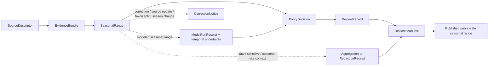

<!-- [KFM_META_BLOCK_V2]
doc_id: kfm://doc/contracts-domains-fauna-seasonal-range
title: Seasonal Range Contract
type: semantic-contract
version: v0.2
status: draft; PROPOSED; NEEDS VERIFICATION before promotion
owners: OWNER_TBD — Fauna steward · Range steward · Seasonal/temporal steward · Model steward · Contract steward · Source steward · Sensitivity reviewer · Policy steward · Schema steward · Validation steward · Release steward · Docs steward
created: 2026-06-21
updated: 2026-06-21
policy_label: public; semantic-contract; fauna; seasonal-range; temporal-scope; aggregate-range; model-aware; source-role-aware; sensitivity-aware; no-publication-authority
tags: [kfm, contracts, fauna, seasonal-range, range, distribution, temporal-scope, seasonality, aggregate-geometry, modeled-range, source-role, sensitivity, geoprivacy, evidence, policy, release, correction, rollback]
related:
  - ./README.md
  - ./range_polygon.md
  - ./migration_route.md
  - ./occurrence_evidence.md
  - ./occurrence_public.md
  - ./occurrence_restricted.md
  - ./domain_feature_identity.md
  - ./domain_layer_descriptor.md
  - ./domain_validation_report.md
  - ./redaction_receipt.md
  - ../../../docs/domains/fauna/README.md
  - ../../../docs/domains/fauna/SOURCES.md
  - ../../../docs/domains/fauna/SOURCE_ROLES.md
  - ../../../docs/domains/fauna/SENSITIVITY.md
  - ../../../docs/domains/fauna/SCHEMAS.md
  - ../../../schemas/contracts/v1/domains/fauna/seasonal_range.schema.json
  - ../../../schemas/contracts/v1/domains/fauna/range_polygon.schema.json
  - ../../../schemas/contracts/v1/domains/fauna/migration_route.schema.json
  - ../../../data/registry/sources/fauna/
  - ../../../policy/domains/fauna/
  - ../../../policy/sensitivity/fauna/
  - ../../../fixtures/domains/fauna/seasonal_range/
  - ../../../tests/domains/fauna/
  - ../../../release/manifests/
notes:
  - "Expanded from a planned-path scaffold into a Fauna seasonal-range semantic contract."
  - "The paired schema is a PROPOSED scaffold with empty properties and additionalProperties=true; field-level realization remains NEEDS VERIFICATION."
  - "SeasonalRange is a temporally scoped subset or variant of range meaning, not full-year range by default, occurrence proof, migration-route proof, habitat suitability proof, or public release permission."
  - "Raw exact seasonal geometry, seasonal ranges derived from sensitive occurrences, sensitive taxa, private-land joins, steward-controlled records, and re-identifying joins remain deny-by-default unless policy, review, aggregation/redaction receipt, release, and rollback support exist."
  - "The user-provided Markdown Authoring Agent v2 prompt was treated as authoring guidance, not pasted into this contract."
[/KFM_META_BLOCK_V2] -->

# Seasonal Range

> Semantic contract for Fauna seasonal range records: what a temporally scoped species range means, how it relates to range polygons and migration routes, what source roles can support it, and which sensitivity, evidence, policy, release, correction, and rollback controls must remain visible.

  
  
  
  
  
  

`contracts/domains/fauna/seasonal_range.md`

## Quick jumps

[Status](#status) · [Meaning](#meaning) · [Repo fit](#repo-fit) · [Schema posture](#schema-posture) · [What this contract asserts](#what-this-contract-asserts) · [What it does not assert](#what-it-does-not-assert) · [Recommended semantics](#recommended-semantics) · [Source-role rules](#source-role-rules) · [Sensitivity and release](#sensitivity-and-release) · [Lifecycle](#lifecycle) · [Validation](#validation) · [Open questions](#open-questions) · [Evidence basis](#evidence-basis) · [Rollback](#rollback)

---

## Status

> [!IMPORTANT]
> **Status:** `draft` / semantic contract  
> **Contract path:** `contracts/domains/fauna/seasonal_range.md`  
> **Schema path:** `schemas/contracts/v1/domains/fauna/seasonal_range.schema.json`  
> **Truth posture:** target path, prior scaffold, paired schema metadata, Fauna contract-lane split, Fauna schema-home split, source-role crosswalk, object-family listing, and sensitivity doctrine are CONFIRMED from current repo evidence. Full field validation, fixtures, validators, source registry behavior, model-run receipt behavior, temporal-window validation, aggregation/redaction behavior, policy runtime behavior, release workflow, API behavior, UI behavior, and test coverage remain NEEDS VERIFICATION.

> [!CAUTION]
> `SeasonalRange` is not occurrence evidence. It does **not** prove a taxon was observed at every place inside the seasonal polygon, does not prove absence outside the range, does not authorize exact sensitive geometry exposure, and does not replace full-year range, migration route, habitat suitability, or model-run contracts.

---

## Meaning

`SeasonalRange` is a Fauna semantic object that records **a species range, distribution, or range subset tied to an explicit seasonal or recurring temporal scope**.

It answers questions like:

- Which taxon, taxon concept, population, management unit, source-native unit, or modeled unit does the seasonal range describe?
- Which season or time window applies: breeding, nesting, wintering, summering, migration staging, stopover, spawning, denning, roosting, juvenile dispersal, drought-year range, monthly/quarterly window, or source-native season?
- Is the seasonal range observed-derived, aggregate, regulatory/admin, modeled, candidate, synthetic, or public-safe generalized?
- Which source asserted it, with what source role, rights, cadence, evidence/model basis, season definition, and limitations?
- Which spatial support is represented: polygon, multipolygon, grid-derived seasonal range, generalized range, administrative unit, range envelope, raster-derived polygon, or withheld/public-safe geometry?
- Which temporal roles apply: observed time, valid season, source vintage, model run time, retrieval time, release time, and correction time?
- Does the seasonal range derive from sensitive occurrence records, sensitive sites, private-land joins, steward-controlled records, telemetry, or re-identifying source combinations?
- Which EvidenceRef, ModelRunReceipt, PolicyDecision, ReviewRecord, RedactionReceipt/AggregationReceipt, ReleaseManifest, CorrectionNotice, and rollback references must resolve before use?

It is not a raw occurrence layer or a plain range polygon. It is a temporal range contract whose claim class depends on source role, evidence/model basis, spatial support, seasonal definition, temporal validity, uncertainty, sensitivity, and release posture.

---

## Repo fit

The Fauna contract README places semantic meaning in `contracts/domains/fauna/` while keeping machine shape, policy, source registry, fixtures, tests, data lifecycle, and release decisions in separate responsibility roots.

| Responsibility | Fauna lane path | This contract's role |
|---|---|---|
| Seasonal-range meaning | `contracts/domains/fauna/seasonal_range.md` | Owned here |
| General range-polygon meaning | `contracts/domains/fauna/range_polygon.md` | Parent/adjacent range meaning; not replaced |
| Migration route meaning | `contracts/domains/fauna/migration_route.md` | Corridor/route meaning; not replaced |
| Occurrence evidence | `contracts/domains/fauna/occurrence_evidence.md` | Evidence input; not replaced |
| Public/restricted occurrence | `contracts/domains/fauna/occurrence_public.md`, `occurrence_restricted.md` | Related but not replaced |
| Feature identity | `contracts/domains/fauna/domain_feature_identity.md` | Identity support; not replaced |
| Layer meaning | `contracts/domains/fauna/domain_layer_descriptor.md` | Downstream layer support |
| Machine schema shape | `schemas/contracts/v1/domains/fauna/seasonal_range.schema.json` | Linked only |
| Source identity and source role | `data/registry/sources/fauna/` | Required upstream support |
| Sensitivity and geoprivacy policy | `policy/sensitivity/fauna/`, `policy/domains/fauna/` | Required admissibility gate |
| Evidence/model/proof support | `data/proofs/`, model receipts, tests, fixtures | Required before consequential use |
| Release/correction/rollback | `release/`, correction contracts, receipts | Required downstream governance |

This split prevents a seasonal-range contract from quietly becoming occurrence evidence, habitat truth, migration route proof, model proof, raw geometry release, source descriptor, policy decision, redaction recipe, release manifest, fixture, test, or UI implementation.

---

## Schema posture

The paired schema currently exists as a **PROPOSED scaffold**.

| Schema fact | Current evidence |
|---|---|
| Schema file path | `schemas/contracts/v1/domains/fauna/seasonal_range.schema.json` |
| Schema title | `Seasonal Range` |
| Declared properties | none yet |
| Required fields | none declared |
| Additional properties | `true` |
| Schema status | `PROPOSED` |
| Source document | `docs/domains/fauna/CANONICAL_PATHS.md` |
| Contract document | `contracts/domains/fauna/seasonal_range.md` |

Because the schema is empty and permissive, this contract defines **semantic expectations** for future schema, fixtures, validators, temporal-window tests, policy tests, aggregation/redaction tests, source registry links, model-run receipts, release checks, and API/UI use. It does not claim current machine enforcement.

---

## What this contract asserts

A valid `SeasonalRange` contract instance should semantically assert:

1. **Seasonal range subject** — the taxon, taxon concept, population, management unit, source-native seasonal unit, or modeled unit represented.
2. **Season class** — breeding, nesting, wintering, summering, staging, migration, stopover, spawning, denning, roosting, dispersal, source-native season, or other reviewed temporal class.
3. **Range class** — seasonal subset of compiled range, observed-derived aggregate, regulatory/admin unit, modeled seasonal range, atlas-derived range, candidate range, synthetic reconstruction, or public-safe generalized seasonal range.
4. **Source role** — aggregate, modeled, regulatory, administrative, observed-derived, candidate, synthetic, or another reviewed role.
5. **Evidence/model basis** — occurrence-derived, expert-reviewed, agency-designated, literature-derived, atlas-derived, model-run-derived, source-native seasonal range, telemetry-derived generalized product, or synthetic reconstruction.
6. **Spatial support** — polygon, multipolygon, generalized polygon, grid-derived polygon, administrative unit, seasonal range envelope, raster-derived polygon, withheld geometry, or public-safe geometry reference.
7. **Temporal scope** — explicit season definition, recurrence rule, validity interval, source vintage, model run time, retrieval time, release time, and correction time posture.
8. **Sensitivity/release posture** — whether raw geometry, season/site context, sensitive taxa, private-land joins, telemetry-derived support, or re-identifying source combinations require denial, aggregation, redaction, embargo, or reviewer access.

---

## What it does not assert

`SeasonalRange` must not be used as:

| Misuse | Why it is denied |
|---|---|
| Full-year range by default | Seasonal range is valid only for its explicit temporal scope. |
| Occurrence proof | Seasonal range does not prove observation at a place/time inside the polygon. |
| Absence proof outside the seasonal polygon | Boundaries are source/model artifacts and do not prove absence beyond them. |
| Exact sensitive occurrence or site map | Seasonal ranges may derive from sensitive observations, breeding sites, stopovers, telemetry, or steward-controlled data. |
| Habitat suitability proof | Seasonal range and habitat suitability are related but distinct; suitability requires model/habitat evidence. |
| Migration route or corridor proof | Movement corridors require `migration_route.md` or related route/model evidence. |
| Model proof by itself | Modeled seasonal ranges require model identity, uncertainty, and model-run receipt where adopted. |
| Land access, ownership, or management authority | Seasonal range geometry does not imply public access, ownership, jurisdiction, or management permission. |
| Policy decision or release state | Policy, review, redaction, release, correction, and rollback remain separate object families. |

> [!WARNING]
> The highest-risk collapse is treating a seasonal range as a current, exact, public-safe occurrence surface. Seasonal range can be useful and well sourced while still temporally narrow, uncertain, modeled, generalized, or unsafe to publish at raw precision.

---

## Recommended semantics

The paired JSON Schema is still a scaffold, so the following fields are **PROPOSED semantic expectations** for a future reviewed schema or fixture set.

| Field | Meaning |
|---|---|
| `id` | Canonical seasonal-range identity. |
| `version` | Contract/object version. |
| `spec_hash` | Deterministic content hash or integrity pin. |
| `taxon_ref` | Reference to a `Taxon` or source-native taxon concept. |
| `seasonal_range_subject_ref` | Population, management unit, source-native seasonal range unit, or modeled unit where applicable. |
| `season_class` | Breeding, nesting, wintering, migration, stopover, spawning, denning, roosting, dispersal, source-native, or other reviewed class. |
| `season_definition` | Source-native season, date range, recurrence, month set, hydrologic/climate season, or reviewed temporal definition. |
| `range_class` | Compiled, aggregate, regulatory/admin, modeled, atlas-derived, candidate, synthetic, public-safe generalized, etc. |
| `source_descriptor_ref` | Source identity, rights, cadence, attribution, and source role. |
| `source_role` | Canonical source role for the range assertion. |
| `source_native_id` | Source-native seasonal range/map/layer id where safe and permissible. |
| `domain_feature_identity_ref` | Stable identity reference where used. |
| `range_polygon_ref` | Parent or related `RangePolygon`, if applicable. |
| `occurrence_evidence_refs` | Occurrence evidence references when the seasonal range is occurrence-derived. |
| `model_run_ref` | Model run receipt/reference when the seasonal range is modeled or derived. |
| `support_geometry_ref` | Raw/restricted/source geometry reference. |
| `public_geometry_ref` | Public-safe geometry, if released. |
| `geometry_derivation` | Generalized, aggregated, rasterized, buffered, hull-derived, clipped, modeled, expert-drawn, source-native, etc. |
| `temporal_scope` | Observed, valid, seasonal, source, model-run, retrieval, release, and correction time posture. |
| `uncertainty` | Confidence, resolution, boundary precision, seasonal uncertainty, model uncertainty, or source limitation. |
| `sensitivity_state` | Sensitivity tier/rank, denial, generalization, redaction, embargo, steward review, or restriction posture. |
| `evidence_refs` | EvidenceRef/EvidenceBundle links. |
| `policy_decision_ref` | Policy result when the seasonal range affects publication. |
| `review_record_ref` | Steward/source/sensitivity/release review record. |
| `redaction_receipt_ref` | Generalization, aggregation, or suppression receipt when public geometry differs from raw support. |
| `release_ref` | Release or candidate release linkage. |
| `correction_refs` | Correction/supersession/rollback lineage. |

---

## Source-role rules

| Source pattern | Canonical source role | Contract posture |
|---|---|---|
| Seasonal atlas range, seasonal county/grid rollup, winter/breeding distribution product | `aggregate` | Can support seasonal range summary claims; not exact occurrence truth. |
| Agency-designated seasonal range, breeding/wintering area, management unit, critical seasonal habitat unit | `regulatory` or `administrative` | Can support designation/context claims; not observed occurrence by itself. |
| Seasonal range compiled from direct observations | `aggregate` with observed evidence references | Must preserve occurrence evidence links, season definition, and sensitivity redaction. |
| Seasonal range/distribution model output | `modeled` | Must carry model identity, uncertainty, temporal window, and model-run receipt where adopted; never observed occurrence truth. |
| Watcher/ingest or unreviewed seasonal range candidate | `candidate` | Must not publish as authoritative until reviewed/promoted. |
| Generated/reconstructed historical seasonal range | `synthetic` | Requires reality-boundary disclosure; never observed reality. |

---

## Sensitivity and release

Fauna schema docs list `SeasonalRange` as `T1`, and Fauna sensitivity docs state T1 content is public-safe only after generalization, aggregation, redaction, or equivalent reviewed transform.

Rules:

- Raw/source seasonal range geometry defaults to review before public use.
- Public seasonal range layers require explicit temporal scope and public-safe geometry.
- Seasonal ranges derived from sensitive occurrence evidence must not leak source occurrence locations through boundary precision, metadata, joins, season labels, or stable IDs.
- Breeding/nesting/denning/roosting/hibernacula/spawning/stopover seasonal ranges may trigger stronger restrictions when they reveal sensitive sites.
- Modeled seasonal ranges must not be displayed as observed occurrence.
- Candidate seasonal ranges must not appear as reviewed/public truth.
- Public clients receive only released, policy-safe representations through governed interfaces.

### Public-safe release chain

---

## Lifecycle

| Phase | Expected handling |
|---|---|
| RAW | Source seasonal polygons, seasonal atlas layers, model outputs, expert-drawn seasonal ranges, or compiled seasonal boundaries remain source-bound and unpublished. |
| WORK / QUARANTINE | Candidate seasonal ranges are normalized, source-role checked, rights checked, temporal-scope checked, sensitivity reviewed, evidence/model-linked, and generalized/held as needed. |
| PROCESSED | Reviewed seasonal range receives deterministic identity, evidence/model references, temporal scope, geometry support, uncertainty, sensitivity state, and policy posture. |
| CATALOG / TRIPLET | Seasonal range can support inspectable claims and graph edges only with resolved evidence/source role, safe spatial/temporal scope, and caveats. |
| PUBLISHED | Only public-safe generalized/aggregated/released seasonal ranges are exposed. |
| CORRECTION | Source layer updates, temporal-window corrections, taxonomic splits/lumps, model reruns, geometry corrections, false range inclusions, or sensitivity changes require correction and rollback consideration. |

---

## Validation

Before this contract is promoted beyond draft:

- [ ] Define and review the paired schema fields in `schemas/contracts/v1/domains/fauna/seasonal_range.schema.json`.
- [ ] Add fixtures for breeding range, winter range, migration/staging range, occurrence-derived seasonal range, modeled seasonal range, candidate range, synthetic historical range, and public-safe generalized seasonal range.
- [ ] Add negative tests proving seasonal ranges cannot be cited as full-year range, occurrence proof, absence proof, habitat suitability proof, migration route proof, or public exact sensitive-location proof.
- [ ] Add temporal-window tests proving every seasonal range has explicit season/valid-time scope.
- [ ] Add sensitive-occurrence-derived and sensitive-site-adjacent range tests proving raw/source geometry is aggregated/redacted/denied when required.
- [ ] Confirm source descriptors, rights, license, cadence, attribution, and source-role assignments for admitted seasonal range sources.
- [ ] Confirm model-run receipt and uncertainty behavior for modeled/derived seasonal ranges.
- [ ] Confirm public display uses governed APIs/released artifacts only.
- [ ] Confirm correction and rollback behavior for source updates, temporal-window corrections, geometry corrections, taxonomic changes, model reruns, source withdrawals, and sensitivity updates.

---

## Open questions

| ID | Question | Status |
|---|---|---|
| OQ-FAUNA-SR-001 | Which seasonal classes are admitted for v1? | NEEDS VERIFICATION |
| OQ-FAUNA-SR-002 | What canonical representation should encode seasons: enum, recurrence rule, date range, month set, source-native season, or all of these? | NEEDS VERIFICATION |
| OQ-FAUNA-SR-003 | Which seasonal ranges require stronger restrictions because they expose breeding, nesting, denning, roosting, hibernacula, spawning, or stopover sites? | NEEDS VERIFICATION |
| OQ-FAUNA-SR-004 | Which public-safe generalization or aggregation receipt is canonical for seasonal ranges? | NEEDS VERIFICATION |
| OQ-FAUNA-SR-005 | Which seasonal ranges require model-run receipts versus source-layer receipts? | NEEDS VERIFICATION |
| OQ-FAUNA-SR-006 | Which seasonal range cases should route to Habitat, Hydrology, MigrationRoute, RangePolygon, or cross-domain lane docs? | NEEDS VERIFICATION |

---

## Evidence basis

| Source | Status | Supports | Limits |
|---|---|---|---|
| `contracts/domains/fauna/seasonal_range.md` prior version | CONFIRMED repo evidence | Target existed as a planned-path scaffold. | Did not define authoritative semantics. |
| `schemas/contracts/v1/domains/fauna/seasonal_range.schema.json` | CONFIRMED repo evidence | Paired schema exists, points to this contract, and is PROPOSED. | Schema has empty properties and does not validate field-level semantics yet. |
| `contracts/domains/fauna/README.md` | CONFIRMED repo evidence | Fauna contract lane owns range/model meaning and requires observed, modeled, aggregate, and synthetic roles to remain separate. | Does not define this specific seasonal-range contract. |
| `docs/domains/fauna/SCHEMAS.md` | CONFIRMED repo evidence | Explains meaning/shape/admissibility/proof split and lists `SeasonalRange` as a seasonal subset of range with explicit temporal scope and T1 sensitivity. | Does not implement the paired schema. |
| `docs/domains/fauna/SOURCE_ROLES.md` | CONFIRMED repo evidence | Provides source-role anti-collapse vocabulary and examples. | Crosswalk only; per-source assignments belong to SourceDescriptor records. |
| `docs/domains/fauna/SENSITIVITY.md` | CONFIRMED repo evidence | Establishes fail-closed sensitive Fauna posture and states T1 content is public-safe only after generalization, aggregation, redaction, or equivalent reviewed transform. | Binding seasonal-range policy remains outside this contract. |
| User-provided Markdown Authoring Agent v2 prompt | CONFIRMED user-provided guidance | Authoring guidance for grounded, repo-aware Markdown. | It is not repository implementation evidence and was not pasted into the contract. |

---

## Rollback

Rollback if this file is used to claim implemented schema validation, publish raw/exact sensitive seasonal range geometry, treat a seasonal range as full-year range, occurrence proof, absence proof, habitat suitability proof, migration route proof, or observed reality, bypass temporal-scope/model-run/evidence/source-role checks, or publish without evidence, rights, sensitivity, policy, review, aggregation/redaction receipt, release, correction, and rollback support.

Rollback target: prior scaffold blob SHA `cb2b72607bdfeaddb8ec55c783cec90bdaa35608`.

<a href="#top">Back to top</a>

