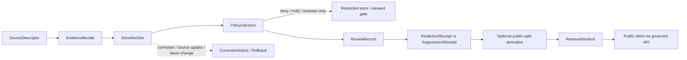

<!-- [KFM_META_BLOCK_V2]
doc_id: kfm://doc/contracts-domains-fauna-sensitive-site
title: Sensitive Site Contract
type: semantic-contract
version: v0.2
status: draft; PROPOSED; NEEDS VERIFICATION before promotion
owners: OWNER_TBD — Fauna steward · Sensitive-site steward · Geoprivacy steward · Contract steward · Source steward · Sensitivity reviewer · Policy steward · Schema steward · Validation steward · Release steward · Docs steward
created: 2026-06-21
updated: 2026-06-21
policy_label: restricted; semantic-contract; fauna; sensitive-site; T4-default; source-role-aware; geoprivacy; no-publication-authority
tags: [kfm, contracts, fauna, sensitive-site, nest, den, roost, hibernacula, spawning-site, occurrence-restricted, geoprivacy, redaction, evidence, policy, review, release, correction, rollback]
related:
  - ./README.md
  - ./occurrence_evidence.md
  - ./occurrence_restricted.md
  - ./occurrence_public.md
  - ./redaction_receipt.md
  - ./domain_observation.md
  - ./domain_feature_identity.md
  - ./domain_layer_descriptor.md
  - ./domain_validation_report.md
  - ./monitoring_event.md
  - ./migration_route.md
  - ./seasonal_range.md
  - ../../../docs/domains/fauna/README.md
  - ../../../docs/domains/fauna/SOURCES.md
  - ../../../docs/domains/fauna/SOURCE_ROLES.md
  - ../../../docs/domains/fauna/SENSITIVITY.md
  - ../../../docs/domains/fauna/SCHEMAS.md
  - ../../../schemas/contracts/v1/domains/fauna/sensitive_site.schema.json
  - ../../../schemas/contracts/v1/domains/fauna/occurrence_restricted.schema.json
  - ../../../data/registry/sources/fauna/
  - ../../../policy/domains/fauna/
  - ../../../policy/sensitivity/fauna/
  - ../../../fixtures/domains/fauna/sensitive_site/
  - ../../../tests/domains/fauna/
  - ../../../release/manifests/
notes:
  - "Expanded from a planned-path scaffold into a Fauna sensitive-site semantic contract."
  - "The paired schema is a PROPOSED scaffold with empty properties and additionalProperties=true; field-level realization remains NEEDS VERIFICATION."
  - "SensitiveSite is a T4-default restricted site-class object; it is not public occurrence, not redaction permission, not habitat/range proof, and not enforcement or access authority."
  - "Exact nests, dens, roosts, hibernacula, spawning sites, sensitive stopovers, steward-controlled sites, private-land joins, and re-identifying joins remain deny-by-default unless policy, review, receipt, release, and rollback support exist."
  - "The user-provided Markdown Authoring Agent v2 prompt was treated as authoring guidance, not pasted into this contract."
[/KFM_META_BLOCK_V2] -->

# Sensitive Site

> Semantic contract for Fauna sensitive-site records: the restricted site-class object for nests, dens, roosts, hibernacula, spawning sites, sensitive stopovers, steward-controlled sites, or other exact locations whose disclosure could harm taxa, habitats, landowners, stewards, or cultural/governance obligations.

  
  
  
  
  
  

`contracts/domains/fauna/sensitive_site.md`

## Quick jumps

[Status](#status) · [Meaning](#meaning) · [Repo fit](#repo-fit) · [Schema posture](#schema-posture) · [What this contract asserts](#what-this-contract-asserts) · [What it does not assert](#what-it-does-not-assert) · [Recommended semantics](#recommended-semantics) · [Source-role rules](#source-role-rules) · [Sensitivity and release](#sensitivity-and-release) · [Lifecycle](#lifecycle) · [Validation](#validation) · [Open questions](#open-questions) · [Evidence basis](#evidence-basis) · [Rollback](#rollback)

---

## Status

> [!IMPORTANT]
> **Status:** `draft` / semantic contract  
> **Contract path:** `contracts/domains/fauna/sensitive_site.md`  
> **Schema path:** `schemas/contracts/v1/domains/fauna/sensitive_site.schema.json`  
> **Truth posture:** target path, prior scaffold, paired schema metadata, Fauna contract-lane split, Fauna schema-home split, object-family listing, source-role crosswalk, and sensitivity doctrine are CONFIRMED from current repo evidence. Full field validation, fixtures, validators, access-control behavior, source registry behavior, policy runtime behavior, redaction/generalization behavior, release workflow, API behavior, UI behavior, and test coverage remain NEEDS VERIFICATION.

> [!CAUTION]
> `SensitiveSite` is not public occurrence output. It is the fail-closed restricted site object for exact sensitive locations and must not be exposed to normal public clients.

---

## Meaning

`SensitiveSite` is a Fauna semantic object that records **a site whose exact location, identity, metadata, or join context is sensitive by default**.

Typical sensitive-site classes include:

- nest sites;
- dens;
- roosts;
- hibernacula;
- spawning sites;
- breeding sites;
- nursery or maternity sites;
- sensitive stopovers;
- steward-controlled wildlife sites;
- private-land sites where disclosure could create harm or rights exposure;
- source-native site records whose joins could re-identify protected locations.

It answers questions like:

- What kind of sensitive site is being represented?
- Which taxon, taxon group, population, site class, monitoring event, or occurrence evidence supports it?
- Which source asserted it, with what source role, rights, cadence, and steward-control posture?
- Which exact geometry or support scope is restricted?
- Which public-safe representation, if any, may be generated through suppression, generalization, aggregation, or delayed release?
- Which PolicyDecision, ReviewRecord, RedactionReceipt, ReleaseManifest, CorrectionNotice, and rollback references must resolve before any derivative appears?

It is not a public map feature. It is a restricted governance object whose normal posture is hold, deny, reviewer-only, steward-only, or public-safe derivative after explicit policy and review.

---

## Repo fit

The Fauna contract README places semantic meaning in `contracts/domains/fauna/` while keeping machine shape, policy, source registry, fixtures, tests, data lifecycle, and release decisions in separate responsibility roots.

| Responsibility | Fauna lane path | This contract's role |
|---|---|---|
| Sensitive-site meaning | `contracts/domains/fauna/sensitive_site.md` | Owned here |
| Restricted occurrence meaning | `contracts/domains/fauna/occurrence_restricted.md` | Related restricted occurrence flow; not replaced |
| Public occurrence meaning | `contracts/domains/fauna/occurrence_public.md` | Public-safe derivative only; not replaced |
| Occurrence evidence | `contracts/domains/fauna/occurrence_evidence.md` | Possible evidence input; not replaced |
| Redaction receipt | `contracts/domains/fauna/redaction_receipt.md` or shared receipt home after ADR | Transform/withholding support; not replaced |
| Monitoring event | `contracts/domains/fauna/monitoring_event.md` | Survey/source context; not replaced |
| Migration and seasonal range | `migration_route.md`, `seasonal_range.md` | Related but not site truth |
| Machine schema shape | `schemas/contracts/v1/domains/fauna/sensitive_site.schema.json` | Linked only |
| Source identity and source role | `data/registry/sources/fauna/` | Required upstream support |
| Sensitivity and geoprivacy policy | `policy/sensitivity/fauna/`, `policy/domains/fauna/` | Required admissibility gate |
| Evidence/proof support | `data/proofs/`, tests, fixtures | Required before consequential use |
| Release/correction/rollback | `release/`, correction contracts, receipts | Required downstream governance |

This split prevents a sensitive-site contract from quietly becoming public geometry, occurrence proof, redaction receipt, policy decision, release manifest, source descriptor, raw data, fixture, test, or UI implementation.

---

## Schema posture

The paired schema currently exists as a **PROPOSED scaffold**.

| Schema fact | Current evidence |
|---|---|
| Schema file path | `schemas/contracts/v1/domains/fauna/sensitive_site.schema.json` |
| Schema title | `Sensitive Site` |
| Declared properties | none yet |
| Required fields | none declared |
| Additional properties | `true` |
| Schema status | `PROPOSED` |
| Source document | `docs/domains/fauna/CANONICAL_PATHS.md` |
| Contract document | `contracts/domains/fauna/sensitive_site.md` |

Because the schema is empty and permissive, this contract defines **semantic expectations** for future schema, fixtures, validators, restricted-access tests, redaction tests, policy tests, source registry links, release checks, and API/UI use. It does not claim current machine enforcement.

---

## What this contract asserts

A valid `SensitiveSite` contract instance should semantically assert:

1. **Site subject** — the site, occurrence support, monitoring unit, taxon/site relation, source-native site id, or steward-controlled site unit being protected.
2. **Site class** — nest, den, roost, hibernacula, spawning site, breeding site, nursery site, stopover, steward-controlled site, private-land-sensitive site, or other reviewed class.
3. **Restriction basis** — sensitive taxon, exact site risk, source terms, rights, steward control, private land, embargo, public-harm risk, or re-identification risk.
4. **Source role** — observed, administrative, aggregate, regulatory, candidate, modeled, synthetic, or another reviewed role.
5. **Evidence basis** — occurrence evidence, monitoring event, field record, source roster, agency/steward record, telemetry-derived site, model-derived candidate, or synthetic reconstruction.
6. **Restricted support geometry** — exact coordinates, site polygon, site unit, route/stopover, support geometry reference, or withheld geometry class.
7. **Public-derivative posture** — none, denied, pending, generalized, aggregated, suppressed, delayed, or released through a reviewed public-safe representation.
8. **Governance references** — EvidenceBundle, SourceDescriptor, PolicyDecision, ReviewRecord, RedactionReceipt, ReleaseManifest, CorrectionNotice, and rollback target where applicable.

---

## What it does not assert

`SensitiveSite` must not be used as:

| Misuse | Why it is denied |
|---|---|
| Public map feature | Sensitive sites are T4-default and not normal public output. |
| Occurrence proof by itself | A site record may support occurrence context, but occurrence claims require `OccurrenceEvidence` and policy-aware handling. |
| Redaction approval | PolicyDecision, ReviewRecord, RedactionReceipt, and ReleaseManifest remain separate. |
| Redaction recipe | Do not expose transform parameters, suppressed coordinates, access hints, or reverse-engineering details. |
| Habitat suitability, range, or migration proof | Sensitive site is site-class meaning; habitat/range/route claims require separate contracts and evidence. |
| Land access or ownership conclusion | Site geometry does not imply access, ownership, easement, or management permission. |
| Enforcement or alert authority | KFM does not issue enforcement, emergency, poaching, public-safety, or intervention instructions. |
| Steward consent substitute | Rights-holder/steward review and policy records remain separate and must be explicit. |

> [!WARNING]
> The highest-risk collapse is allowing a sensitive site to leak through derived layers, stable IDs, nearby public joins, metadata, AI summaries, map tiles, or receipt details even when the raw coordinate field is hidden.

---

## Recommended semantics

The paired JSON Schema is still a scaffold, so the following fields are **PROPOSED semantic expectations** for a future reviewed schema or fixture set.

| Field | Meaning |
|---|---|
| `id` | Canonical sensitive-site identity. |
| `version` | Contract/object version. |
| `spec_hash` | Deterministic content hash or integrity pin. |
| `site_class` | Nest, den, roost, hibernacula, spawning site, breeding site, nursery, stopover, steward-controlled site, private-land-sensitive site, etc. |
| `taxon_ref` | Taxon or taxon concept reference when safe and required. |
| `site_subject_ref` | Source-native site, occurrence, monitoring unit, support geometry, or steward-controlled id. |
| `source_descriptor_ref` | Source identity, rights, cadence, attribution, and source role. |
| `source_role` | Canonical source role for the site assertion. |
| `source_native_id` | Restricted source-native site id where safe and permissible. |
| `evidence_refs` | EvidenceRef/EvidenceBundle links supporting the site record. |
| `occurrence_evidence_refs` | Related occurrence evidence references. |
| `monitoring_event_refs` | Related monitoring or survey event references. |
| `restricted_geometry_ref` | Restricted pointer to exact/site geometry. Must not be exposed publicly. |
| `restricted_geometry_class` | Exact point, polygon, route, site unit, private parcel, steward-controlled location, or withheld geometry. |
| `public_geometry_status` | None, denied, pending, generalized, aggregated, withheld, delayed, or released. |
| `restriction_basis` | Controlled reason code for why the site is restricted. |
| `sensitivity_state` | T4/T3/T2/T1/T0 posture, sensitivity rank, embargo, steward-control, or restriction state. |
| `policy_decision_ref` | Policy result authorizing hold/restriction/denial/public-safe derivative. |
| `review_record_ref` | Steward/source/sensitivity/release review record. |
| `redaction_receipt_ref` | Generalization, aggregation, suppression, withholding, or delayed-release receipt if a public derivative exists. |
| `release_ref` | Release/candidate release linkage for any public-safe derivative. |
| `temporal_scope` | Observed, valid, source, retrieval, embargo, release, and correction time posture. |
| `access_controls_ref` | Access-control or reviewer/steward gate reference, when adopted. |
| `correction_refs` | Correction/supersession/rollback lineage. |

---

## Source-role rules

| Source pattern | Canonical source role | Contract posture |
|---|---|---|
| Direct nest/den/roost/hibernacula/spawning field observation | `observed` | Restricted by default; public derivative only after policy/review/redaction/release. |
| Agency/steward sensitive-site roster or restricted site database | `administrative` | Restricted by source terms and site risk; not public by default. |
| Protected area or legally designated sensitive unit | `regulatory` or `administrative` | Can support designation/context claims; exact sensitive details may still be denied. |
| Aggregated sensitive-site summary | `aggregate` | May support public summary only if aggregation cannot re-identify exact sites. |
| Watcher/ingest or unreviewed site candidate | `candidate` | Hold/restrict until reviewed; public edge forbidden. |
| Model-derived sensitive-site likelihood or reconstructed site | `modeled` or `synthetic` | Must not become observed reality; may still be restricted if it reveals likely protected locations. |

---

## Sensitivity and release

Fauna schema docs list `SensitiveSite` as a nest/den/roost/hibernacula/spawning record with T4 sensitivity, and Fauna sensitivity docs identify sensitive sites as T4 default with release only through generalization/suppression plus receipt and review.

Rules:

- Exact sensitive site geometry is denied by default.
- Public release of exact sensitive site geometry is not normal and should be treated as DENY unless a policy path explicitly overrides it.
- Public-safe derivatives must use suppression, aggregation, generalization, delay, or other reviewed transform where allowed.
- Receipts must prove public-safe transformation without revealing reversible parameters.
- Existence may sometimes be releasable while exact location remains denied, but only with steward review.
- Public clients receive only released, policy-safe representations through governed interfaces.

### Restricted handling chain

---

## Lifecycle

| Phase | Expected handling |
|---|---|
| RAW | Source site records, field notes, coordinates, telemetry-derived sites, steward rosters, or monitoring records remain source-bound and unpublished. |
| WORK / QUARANTINE | Candidate sensitive sites are normalized, source-role checked, rights checked, sensitivity reviewed, steward-controlled status checked, and held/restricted by default. |
| PROCESSED | Reviewed sensitive site receives deterministic identity, evidence references, restriction basis, restricted geometry reference, access posture, and policy/review state. |
| CATALOG / TRIPLET | Sensitive site may support internal/reviewer graph edges only when access and policy permit; public graph edges must use public-safe derivatives. |
| PUBLISHED | Sensitive site itself is not normally published; only released public-safe derivatives or existence statements may appear. |
| CORRECTION | Misidentification, false positive, duplicate site, changed site status, taxonomic correction, geometry correction, source withdrawal, embargo update, or sensitivity change requires correction and rollback consideration. |

---

## Validation

Before this contract is promoted beyond draft:

- [ ] Define and review the paired schema fields in `schemas/contracts/v1/domains/fauna/sensitive_site.schema.json`.
- [ ] Add fixtures for nest, den, roost, hibernacula, spawning site, stopover, steward-controlled site, private-land-sensitive site, candidate site, model-derived likely site, and aggregate public summary cases.
- [ ] Add negative tests proving exact sensitive geometry, source-native restricted ids, transform parameters, access hints, private-land joins, steward-controlled details, and re-identifying joins cannot appear in public output.
- [ ] Add tests proving sensitive sites cannot be served to public clients without public-safe derivative release.
- [ ] Confirm linkage to OccurrenceEvidence, OccurrenceRestricted, OccurrencePublic, PolicyDecision, ReviewRecord, RedactionReceipt, ReleaseManifest, CorrectionNotice, and rollback records.
- [ ] Confirm source descriptors, rights, license, cadence, attribution, and source-role assignments for admitted sensitive-site source families.
- [ ] Confirm reviewer/steward access behavior and audit logging before any restricted API/path is used.
- [ ] Confirm correction and rollback behavior for misidentification, false positive, duplicate, taxonomic correction, geometry correction, source withdrawal, embargo update, sensitivity update, and release withdrawal.

---

## Open questions

| ID | Question | Status |
|---|---|---|
| OQ-FAUNA-SS-001 | Which controlled sensitive-site classes are canonical for v1? | NEEDS VERIFICATION |
| OQ-FAUNA-SS-002 | Which access-control object family owns steward/reviewer access gates? | NEEDS VERIFICATION |
| OQ-FAUNA-SS-003 | Which public-safe derivatives are allowed for sensitive sites: existence statement, generalized area, aggregate count, delayed release, or none? | NEEDS VERIFICATION |
| OQ-FAUNA-SS-004 | How much restriction reason detail can be visible to non-steward reviewers without aiding re-identification? | NEEDS VERIFICATION |
| OQ-FAUNA-SS-005 | Which sensitive site classes must remain T4 forever rather than producing public derivatives? | NEEDS VERIFICATION |
| OQ-FAUNA-SS-006 | How are changed site status, seasonal activity, abandonment, or reoccupation represented in correction lineage? | NEEDS VERIFICATION |

---

## Evidence basis

| Source | Status | Supports | Limits |
|---|---|---|---|
| `contracts/domains/fauna/sensitive_site.md` prior version | CONFIRMED repo evidence | Target existed as a planned-path scaffold. | Did not define authoritative semantics. |
| `schemas/contracts/v1/domains/fauna/sensitive_site.schema.json` | CONFIRMED repo evidence | Paired schema exists, points to this contract, and is PROPOSED. | Schema has empty properties and does not validate field-level semantics yet. |
| `contracts/domains/fauna/README.md` | CONFIRMED repo evidence | Fauna contract lane owns sensitive-location meaning and requires exact sensitive locations and transform parameters to fail closed. | Does not define this specific sensitive-site contract. |
| `docs/domains/fauna/SCHEMAS.md` | CONFIRMED repo evidence | Explains meaning/shape/admissibility/proof split and lists `SensitiveSite` as nest/den/roost/hibernacula/spawning record with T4 sensitivity. | Does not implement the paired schema. |
| `docs/domains/fauna/SOURCE_ROLES.md` | CONFIRMED repo evidence | Provides source-role anti-collapse vocabulary and examples. | Crosswalk only; per-source assignments belong to SourceDescriptor records. |
| `docs/domains/fauna/SENSITIVITY.md` | CONFIRMED repo evidence | Establishes fail-closed sensitive Fauna posture and identifies SensitiveSite as T4 default, released only through generalization/suppression plus receipt and review. | Binding sensitive-site policy remains outside this contract. |
| User-provided Markdown Authoring Agent v2 prompt | CONFIRMED user-provided guidance | Authoring guidance for grounded, repo-aware Markdown. | It is not repository implementation evidence and was not pasted into the contract. |

---

## Rollback

Rollback if this file is used to claim implemented schema validation, publish exact sensitive site geometry, leak source-native restricted ids or transform parameters, collapse sensitive site into public occurrence, treat administrative/aggregate/regulatory/modeled/candidate/synthetic records as public observed site truth, or publish without evidence, rights, sensitivity, policy, review, redaction receipt, release, correction, and rollback support.

Rollback target: prior scaffold blob SHA `d994cfdbabfab3f2fa654483bf75e031d6a83f93`.

<a href="#top">Back to top</a>

