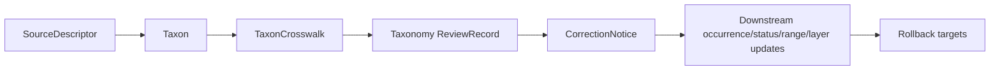

<!-- [KFM_META_BLOCK_V2]
doc_id: kfm://doc/contracts-domains-fauna-taxon
title: Taxon Contract
type: semantic-contract
version: v0.2
status: draft; PROPOSED; NEEDS VERIFICATION before promotion
owners: OWNER_TBD — Fauna steward · Taxonomy steward · Contract steward · Source steward · Schema steward · Validation steward · Policy steward · Release steward · Docs steward
created: 2026-06-21
updated: 2026-06-21
policy_label: public; semantic-contract; fauna; taxon; taxonomic-identity; source-role-aware; evidence-aware; time-aware
tags: [kfm, contracts, fauna, taxon, taxonomy, taxonomic-identity, nomenclature, source-role, evidence, temporal-scope, crosswalk, correction, rollback]
related:
  - ./README.md
  - ./taxon_crosswalk.md
  - ./conservation_status.md
  - ./occurrence_evidence.md
  - ./domain_feature_identity.md
  - ./domain_validation_report.md
  - ../../../docs/domains/fauna/SOURCE_ROLES.md
  - ../../../docs/domains/fauna/SENSITIVITY.md
  - ../../../docs/domains/fauna/SCHEMAS.md
  - ../../../schemas/contracts/v1/domains/fauna/taxon.schema.json
  - ../../../schemas/contracts/v1/domains/fauna/taxon_crosswalk.schema.json
  - ../../../data/registry/sources/fauna/
  - ../../../policy/domains/fauna/
  - ../../../fixtures/domains/fauna/taxon/
  - ../../../tests/domains/fauna/
  - ../../../release/manifests/
notes:
  - "Expanded from a planned-path scaffold into a Fauna taxon semantic contract."
  - "The paired schema is a PROPOSED scaffold with empty properties and additionalProperties=true; field-level realization remains NEEDS VERIFICATION."
  - "Taxon is animal taxonomic identity scoped by source role, evidence, and time; it is not occurrence evidence, conservation/legal status, range, habitat, sensitive-site, or release authority."
  - "Taxonomic changes, source-native names, synonyms, splits/lumps, and authority disagreements require crosswalk, evidence, correction, and rollback support before claims are promoted."
[/KFM_META_BLOCK_V2] -->

# Taxon

> Semantic contract for Fauna taxonomic identity: what an animal taxon means inside KFM, how source authority and source role scope the name, and which crosswalk, evidence, temporal, correction, and rollback controls must remain visible.

  
  
  
  
  
  

`contracts/domains/fauna/taxon.md`

## Quick jumps

[Status](#status) · [Meaning](#meaning) · [Repo fit](#repo-fit) · [Schema posture](#schema-posture) · [Assertions](#assertions) · [Exclusions](#exclusions) · [Recommended semantics](#recommended-semantics) · [Source-role rules](#source-role-rules) · [Taxonomic change handling](#taxonomic-change-handling) · [Validation](#validation) · [Evidence basis](#evidence-basis) · [Rollback](#rollback)

---

## Status

> [!IMPORTANT]
> **Status:** `draft` / semantic contract  
> **Contract path:** `contracts/domains/fauna/taxon.md`  
> **Schema path:** `schemas/contracts/v1/domains/fauna/taxon.schema.json`  
> **Truth posture:** target path, prior scaffold, paired schema metadata, Fauna contract-lane split, Fauna schema-home split, object-family listing, source-role crosswalk, and sensitivity doctrine are CONFIRMED from current repo evidence. Full field validation, fixtures, validators, source registry behavior, authority-taxonomy integration, crosswalk behavior, correction behavior, release workflow, API behavior, UI behavior, and test coverage remain NEEDS VERIFICATION.

> [!CAUTION]
> `Taxon` defines taxonomic identity meaning. It does **not** prove a species occurred anywhere, assign conservation/legal status, define range, authorize sensitive-location release, or make KFM the taxonomic authority of record.

---

## Meaning

`Taxon` is a Fauna semantic object that records **animal taxonomic identity scoped by source role, source authority, evidence, naming context, and time**.

It answers questions like:

- Which animal taxon, taxon concept, source-native taxon, scientific name, common name, synonym, or candidate concept is being referenced?
- Which checklist, registry, agency, dataset, or source-native vocabulary supplied the name?
- Is the assertion accepted, synonymized, deprecated, disputed, source-native, candidate, model-suggested, or mapped through a crosswalk?
- Which source-native identifier, rank, parent concept, source version, and review/correction state apply?
- Which `TaxonCrosswalk`, EvidenceRef/EvidenceBundle, SourceDescriptor, ReviewRecord, CorrectionNotice, and rollback references must resolve before downstream claims are trusted?

A `Taxon` is a naming/concept anchor for Fauna objects. It lets occurrence, range, conservation status, disease, mortality, invasive species, migration, monitoring, and sensitive-site objects refer to animal identity without confusing identity with occurrence, status, location, population condition, or release state.

---

## Repo fit

The Fauna contract README places object-family semantic meaning in `contracts/domains/fauna/` while keeping machine shape, policy, source registry, fixtures, tests, lifecycle data, and release decisions in separate responsibility roots.

| Responsibility | Fauna lane path | This contract's role |
|---|---|---|
| Taxonomic identity meaning | `contracts/domains/fauna/taxon.md` | Owned here |
| Taxonomic crosswalk meaning | `contracts/domains/fauna/taxon_crosswalk.md` | Mapping between authority taxonomies; not replaced |
| Conservation/legal status meaning | `contracts/domains/fauna/conservation_status.md` | Status/rank meaning; not replaced |
| Occurrence evidence | `contracts/domains/fauna/occurrence_evidence.md` | Uses taxon identity; not replaced |
| Feature identity | `contracts/domains/fauna/domain_feature_identity.md` | Deterministic feature identity support; not replaced |
| Machine schema shape | `schemas/contracts/v1/domains/fauna/taxon.schema.json` | Linked only |
| Source identity and source role | `data/registry/sources/fauna/` | Required upstream support |
| Policy and sensitivity | `policy/domains/fauna/`, `policy/sensitivity/fauna/` | Required when taxon context affects release or redaction |
| Fixtures and tests | `fixtures/domains/fauna/`, `tests/domains/fauna/` | Required proof support; not owned here |
| Release/correction/rollback | `release/`, correction contracts, receipts | Required downstream governance |

This split prevents a taxon contract from becoming a taxonomy database, source descriptor, occurrence record, status record, redaction policy, release manifest, schema, fixture, test, or UI implementation.

---

## Schema posture

The paired schema currently exists as a **PROPOSED scaffold**.

| Schema fact | Current evidence |
|---|---|
| Schema file path | `schemas/contracts/v1/domains/fauna/taxon.schema.json` |
| Schema title | `Taxon` |
| Declared properties | none yet |
| Required fields | none declared |
| Additional properties | `true` |
| Schema status | `PROPOSED` |
| Source document | `docs/domains/fauna/CANONICAL_PATHS.md` |
| Contract document | `contracts/domains/fauna/taxon.md` |

Because the schema is empty and permissive, this contract defines **semantic expectations** for future schema, fixtures, validators, source-registry links, crosswalk behavior, correction behavior, policy tests, release checks, and API/UI use. It does not claim current machine enforcement.

---

## Assertions

A reviewed `Taxon` should semantically assert:

1. **Taxonomic subject** — the animal taxon, source-native taxon, scientific name, common name, synonym, or candidate concept.
2. **Authority/source basis** — the checklist, registry, agency, dataset, or evidence source that supplied or supports the identity.
3. **Rank and hierarchy posture** — species, subspecies, genus, family, higher rank, uncertain rank, hybrid, complex, group, or source-native rank.
4. **Name status** — accepted, synonym, deprecated, disputed, misapplied, source-native, candidate, model-suggested, or superseded state.
5. **Temporal scope** — source version, naming validity period, retrieval time, correction time, and supersession time where applicable.
6. **Crosswalk posture** — whether mapping to another authority taxonomy is exact, broad, narrow, related, disputed, missing, or unknown.
7. **Governance references** — SourceDescriptor, EvidenceBundle, ReviewRecord, CorrectionNotice, rollback target, and policy reference where taxon identity affects downstream release.

---

## Exclusions

| Misuse | Why it is denied |
|---|---|
| Occurrence evidence | A taxon identity does not prove the taxon occurred anywhere. |
| Conservation or legal status | Legal/conservation classification belongs to status contracts and authority source records. |
| Range or habitat claim | Range, habitat, seasonal range, and migration claims require their own object contracts and evidence. |
| Sensitive-site disclosure | Taxon identity may drive sensitivity, but exact sensitive locations remain separate and fail closed. |
| Taxonomic authority of record | KFM can cite authority sources and crosswalks, but KFM itself is not the biological naming authority. |
| Source descriptor | Rights, cadence, source role, and activation state belong in source registry records. |
| Taxon crosswalk | Mappings across authority taxonomies belong to `taxon_crosswalk.md`. |
| Release approval | PolicyDecision, ReviewRecord, ReleaseManifest, and rollback remain separate object families. |

---

## Recommended semantics

The paired JSON Schema is still a scaffold, so the following fields are **PROPOSED semantic expectations** for a future reviewed schema or fixture set.

| Field | Meaning |
|---|---|
| `id` | Canonical taxon identity. |
| `version` | Contract/object version. |
| `spec_hash` | Deterministic content hash or integrity pin. |
| `taxon_concept_id` | Stable concept id for this taxon within KFM or source scope. |
| `scientific_name` | Scientific name as asserted by source or reviewed authority. |
| `canonical_name` | Normalized/canonical name where review supports it. |
| `common_names` | Public/common names with language/source attribution where supported. |
| `rank` | Taxonomic rank or source-native rank. |
| `parent_taxon_ref` | Parent taxon concept where known. |
| `authority_ref` | Taxonomic authority/source reference. |
| `source_descriptor_ref` | Source identity, rights, cadence, attribution, and source role. |
| `source_role` | Canonical source role for the identity assertion. |
| `source_native_id` | Source-native taxon id where safe and permissible. |
| `name_status` | Accepted, synonym, deprecated, disputed, misapplied, candidate, model-suggested, synthetic, superseded, etc. |
| `taxon_crosswalk_refs` | Crosswalks to admitted authority taxonomies. |
| `temporal_scope` | Source version, valid time, retrieval time, correction time, and supersession time posture. |
| `evidence_refs` | EvidenceRef/EvidenceBundle links supporting taxon identity or crosswalk review. |
| `sensitivity_driver` | Whether this taxon can trigger sensitivity, redaction, or review rules downstream. |
| `review_record_ref` | Steward/source/taxonomy review record. |
| `policy_refs` | Policy references when taxon identity affects release or redaction. |
| `correction_refs` | Correction/supersession/rollback lineage for name changes, splits, lumps, or misidentifications. |

---

## Source-role rules

| Source pattern | Canonical source role | Contract posture |
|---|---|---|
| Authority checklist, scientific taxonomy registry, agency taxonomy list, legal taxonomy source | `regulatory` or `administrative` depending on assertion | Can support identity/status context; must not become occurrence proof. |
| Conservation/status rank source | `aggregate` or `regulatory` depending on assertion | Can drive sensitivity/status context; status/rank meaning belongs to conservation-status contracts. |
| Field observation that supplies a name | `observed` | Can support a source-used name but does not resolve accepted taxonomy by itself. |
| Context dataset with species-like labels | not Fauna truth by default | Context joins must remain governed and cannot silently become taxon authority. |
| Taxonomy model, classifier, or automated identification | `modeled` | Requires model identity, uncertainty, and review; cannot become accepted taxonomy without review. |
| Ingested but unreviewed taxon string | `candidate` | Must not be promoted into accepted identity without review/crosswalk. |
| Generated or reconstructed taxon statement | `synthetic` | Requires reality-boundary disclosure; never source authority. |

---

## Taxonomic change handling

Rules:

- Source-native names are preserved; they are not overwritten silently.
- Splits, lumps, synonymizations, misidentifications, and authority disagreements require crosswalk/correction lineage.
- Downstream occurrence, status, range, monitoring, disease, mortality, invasive, and sensitive-site claims may need invalidation or re-review when taxon identity changes.
- If authority disagreement is unresolved, public answers should cite the scoped authority or abstain from asserting a single accepted identity.

---

## Lifecycle

| Phase | Expected handling |
|---|---|
| RAW | Source taxon strings, source-native ids, authority labels, and common names remain source-bound. |
| WORK / QUARANTINE | Candidate taxon identities are normalized, source-role checked, authority scoped, crosswalked, and held when uncertain. |
| PROCESSED | Reviewed taxon identities receive deterministic identity, source/evidence/crosswalk references, temporal scope, and correction posture. |
| CATALOG / TRIPLET | Taxon identities can support inspectable graph/catalog references only with source, authority, crosswalk, and time scope preserved. |
| PUBLISHED | Public labels and taxon references are exposed only with appropriate source/caveat posture and without implying occurrence/status/location. |
| CORRECTION | Splits, lumps, synonyms, misidentifications, source corrections, and authority changes require correction and rollback consideration. |

---

## Validation

Before this contract is promoted beyond draft:

- [ ] Define and review the paired schema fields in `schemas/contracts/v1/domains/fauna/taxon.schema.json`.
- [ ] Add fixtures for accepted species, subspecies, synonym, disputed taxon, source-native taxon, candidate taxon string, model-suggested identification, and synthetic reconstruction cases.
- [ ] Add negative tests proving taxon identity cannot be used as occurrence proof, conservation status proof, range proof, or release approval.
- [ ] Add crosswalk tests proving authority ids, source-native ids, and reviewed KFM concepts remain distinct.
- [ ] Confirm source descriptors, rights, cadence, attribution, source role, and authority/source scope for admitted taxonomy sources.
- [ ] Confirm correction and rollback behavior for taxonomic split, lump, synonym, misidentification, authority update, and source withdrawal.
- [ ] Confirm downstream occurrence/status/range/layer invalidation behavior when taxon identity changes.
- [ ] Confirm public labels do not hide unresolved authority conflict.

---

## Evidence basis

| Source | Status | Supports | Limits |
|---|---|---|---|
| `contracts/domains/fauna/taxon.md` prior version | CONFIRMED repo evidence | Target existed as a planned-path scaffold. | Did not define authoritative semantics. |
| `schemas/contracts/v1/domains/fauna/taxon.schema.json` | CONFIRMED repo evidence | Paired schema exists, points to this contract, and is PROPOSED. | Schema has empty properties and does not validate field-level semantics yet. |
| `contracts/domains/fauna/README.md` | CONFIRMED repo evidence | Fauna contract lane owns object-family meaning; Taxon belongs here and contracts must define meaning, claim support, exclusions, lifecycle, and links. | Does not define this specific taxon contract. |
| `docs/domains/fauna/SCHEMAS.md` | CONFIRMED repo evidence | Explains meaning/shape/admissibility/proof split and lists `Taxon` as animal taxonomic identity scoped by source role, evidence, and time with T0 sensitivity. | Does not implement the paired schema. |
| `docs/domains/fauna/SOURCE_ROLES.md` | CONFIRMED repo evidence | Provides source-role anti-collapse vocabulary and examples. | Crosswalk only; per-source assignments belong to SourceDescriptor records. |
| `docs/domains/fauna/SENSITIVITY.md` | CONFIRMED repo evidence | Establishes sensitivity/release doctrine that source quality never overrides sensitivity and that unresolved release context blocks public promotion. | Does not define taxon identity fields. |
| `contracts/domains/fauna/taxon_crosswalk.md` prior version | CONFIRMED repo evidence | Crosswalk target exists as a planned-path scaffold. | Does not define authoritative crosswalk semantics yet. |
| User-provided Markdown Authoring Agent v2 prompt | CONFIRMED user-provided guidance | Authoring guidance for grounded, repo-aware Markdown. | It is not repository implementation evidence and was not pasted into the contract. |

---

## Rollback

Rollback if this file is used to claim implemented schema validation, make KFM the taxonomic authority, collapse taxon identity into occurrence/status/range/release claims, silently overwrite source-native names, hide taxonomic disagreement, or publish downstream claims without evidence, source-role, authority scope, sensitivity, policy, review, correction, and rollback support.

Rollback target: prior scaffold blob SHA `617b2566a5d75ec133ad35f96a4eca7a98a66a87`.

<a href="#top">Back to top</a>

