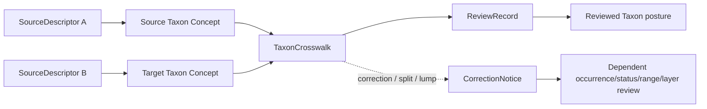

<!-- [KFM_META_BLOCK_V2]
doc_id: kfm://doc/contracts-domains-fauna-taxon-crosswalk
title: Taxon Crosswalk Contract
type: semantic-contract
version: v0.2
status: draft; PROPOSED; NEEDS VERIFICATION before promotion
owners: OWNER_TBD — Fauna steward · Taxonomy steward · Crosswalk steward · Contract steward · Source steward · Schema steward · Validation steward · Policy steward · Release steward · Docs steward
created: 2026-06-21
updated: 2026-06-21
policy_label: public; semantic-contract; fauna; taxon-crosswalk; taxonomy-mapping; source-role-aware; evidence-aware; time-aware
tags: [kfm, contracts, fauna, taxon-crosswalk, taxonomy, mapping, authority-taxonomy, source-role, evidence, temporal-scope, correction, rollback]
related:
  - ./README.md
  - ./taxon.md
  - ./conservation_status.md
  - ./occurrence_evidence.md
  - ./domain_feature_identity.md
  - ./domain_validation_report.md
  - ../../../docs/domains/fauna/SOURCE_ROLES.md
  - ../../../docs/domains/fauna/SENSITIVITY.md
  - ../../../docs/domains/fauna/SCHEMAS.md
  - ../../../schemas/contracts/v1/domains/fauna/taxon_crosswalk.schema.json
  - ../../../schemas/contracts/v1/domains/fauna/taxon.schema.json
  - ../../../data/registry/sources/fauna/
  - ../../../policy/domains/fauna/
  - ../../../fixtures/domains/fauna/taxon_crosswalk/
  - ../../../tests/domains/fauna/
  - ../../../release/manifests/
notes:
  - "Expanded from a planned-path scaffold into a Fauna taxon-crosswalk semantic contract."
  - "The paired schema is a PROPOSED scaffold with empty properties and additionalProperties=true; field-level realization remains NEEDS VERIFICATION."
  - "TaxonCrosswalk maps between authority/source taxon concepts; it is not accepted taxonomy by itself, not occurrence evidence, not conservation/legal status, and not release authority."
  - "Taxonomic splits, lumps, synonyms, source-native ids, and authority disagreements require evidence, review, correction, and rollback support before downstream claims are promoted."
[/KFM_META_BLOCK_V2] -->

# Taxon Crosswalk

> Semantic contract for Fauna taxonomic mapping: how KFM records relationships between source-native taxon concepts, authority taxonomies, reviewed KFM taxon concepts, and downstream claims without erasing uncertainty, source role, or time scope.

  
  
  
  
  
  

`contracts/domains/fauna/taxon_crosswalk.md`

## Quick jumps

[Status](#status) · [Meaning](#meaning) · [Repo fit](#repo-fit) · [Schema posture](#schema-posture) · [Assertions](#assertions) · [Exclusions](#exclusions) · [Recommended semantics](#recommended-semantics) · [Mapping rules](#mapping-rules) · [Lifecycle](#lifecycle) · [Validation](#validation) · [Evidence basis](#evidence-basis) · [Rollback](#rollback)

---

## Status

> [!IMPORTANT]
> **Status:** `draft` / semantic contract  
> **Contract path:** `contracts/domains/fauna/taxon_crosswalk.md`  
> **Schema path:** `schemas/contracts/v1/domains/fauna/taxon_crosswalk.schema.json`  
> **Truth posture:** target path, prior scaffold, paired schema metadata, Fauna contract-lane split, Fauna schema-home split, object-family listing, Taxon sibling contract, source-role crosswalk, and sensitivity doctrine are CONFIRMED from current repo evidence. Full field validation, fixtures, validators, source registry behavior, authority-taxonomy integration, crosswalk review behavior, correction behavior, release workflow, API behavior, UI behavior, and test coverage remain NEEDS VERIFICATION.

> [!CAUTION]
> `TaxonCrosswalk` is a mapping record. It does **not** make KFM the taxonomic authority, does not prove occurrence, does not assign conservation/legal status, and does not silently convert source-native names into accepted names.

---

## Meaning

`TaxonCrosswalk` records a reviewed or candidate relationship between **two or more taxon concepts or taxon identifiers**.

It answers questions like:

- Which source-native taxon, authority taxon, or KFM taxon concept is being mapped?
- Which authority or source supplied each side of the mapping?
- Is the relationship exact, broad, narrow, related, synonym, parent/child, no-match, disputed, deprecated, candidate, or superseded?
- Which source version, retrieval time, review time, and correction time apply?
- Which evidence, reviewer, source descriptor, and correction records support the mapping?
- Which downstream objects may need re-review if the mapping changes?

A crosswalk preserves taxonomic ambiguity instead of hiding it. It allows KFM to cite one source using one vocabulary while relating it to another source, authority, or reviewed KFM concept without pretending all taxonomies agree.

---

## Repo fit

The Fauna contract README places object-family semantic meaning in `contracts/domains/fauna/` while keeping machine shape, policy, source registry, fixtures, tests, lifecycle data, and release decisions in separate responsibility roots.

| Responsibility | Fauna lane path | This contract's role |
|---|---|---|
| Taxon mapping meaning | `contracts/domains/fauna/taxon_crosswalk.md` | Owned here |
| Taxonomic identity meaning | `contracts/domains/fauna/taxon.md` | Defines taxon concept/name meaning; not replaced |
| Conservation/legal status meaning | `contracts/domains/fauna/conservation_status.md` | Status/rank meaning; not replaced |
| Occurrence evidence | `contracts/domains/fauna/occurrence_evidence.md` | May depend on crosswalked identity; not replaced |
| Feature identity | `contracts/domains/fauna/domain_feature_identity.md` | Deterministic feature identity support; not replaced |
| Machine schema shape | `schemas/contracts/v1/domains/fauna/taxon_crosswalk.schema.json` | Linked only |
| Source identity and source role | `data/registry/sources/fauna/` | Required upstream support |
| Policy and sensitivity | `policy/domains/fauna/`, `policy/sensitivity/fauna/` | Required when mapping changes affect release or redaction |
| Fixtures and tests | `fixtures/domains/fauna/`, `tests/domains/fauna/` | Required proof support; not owned here |
| Release/correction/rollback | `release/`, correction contracts, receipts | Required downstream governance |

This split prevents a crosswalk contract from becoming a taxonomy database, accepted taxonomy authority, source descriptor, occurrence record, status record, release manifest, schema, fixture, test, or UI implementation.

---

## Schema posture

The paired schema currently exists as a **PROPOSED scaffold**.

| Schema fact | Current evidence |
|---|---|
| Schema file path | `schemas/contracts/v1/domains/fauna/taxon_crosswalk.schema.json` |
| Schema title | `Taxon Crosswalk` |
| Declared properties | none yet |
| Required fields | none declared |
| Additional properties | `true` |
| Schema status | `PROPOSED` |
| Source document | `docs/domains/fauna/CANONICAL_PATHS.md` |
| Contract document | `contracts/domains/fauna/taxon_crosswalk.md` |

Because the schema is empty and permissive, this contract defines **semantic expectations** for future schema, fixtures, validators, authority-source links, correction behavior, policy tests, release checks, and API/UI use. It does not claim current machine enforcement.

---

## Assertions

A reviewed `TaxonCrosswalk` should semantically assert:

1. **Mapping subject** — the source and target taxon concepts, identifiers, names, or source-native strings being related.
2. **Source/authority basis** — which source descriptor, checklist, registry, agency, or authority supplied each concept.
3. **Relationship type** — exact, broad, narrow, related, synonym, parent/child, no-match, disputed, candidate, deprecated, or superseded.
4. **Confidence and review posture** — whether the mapping is reviewed, candidate, model-suggested, conflicting, or unresolved.
5. **Temporal scope** — source versions, valid time, retrieval time, review time, correction time, and supersession time.
6. **Governance references** — EvidenceBundle, SourceDescriptor, ReviewRecord, CorrectionNotice, rollback target, and policy reference when mapping affects release.
7. **Downstream effect** — which occurrence, status, range, monitoring, disease, mortality, invasive, sensitive-site, or layer objects may depend on the mapping.

---

## Exclusions

| Misuse | Why it is denied |
|---|---|
| Accepted taxonomy by itself | Crosswalks relate concepts; accepted identity belongs to reviewed `Taxon` posture and cited authority scope. |
| Occurrence evidence | A mapping does not prove the taxon occurred anywhere. |
| Conservation or legal status | Legal/conservation classification belongs to status contracts and authority source records. |
| Source descriptor | Rights, cadence, source role, and activation state belong in source registry records. |
| Silent overwrite | Source-native names and ids must remain auditable, not overwritten by a normalized label. |
| Model-as-truth | Model-suggested mappings require review and cannot become accepted without evidence. |
| Release approval | PolicyDecision, ReviewRecord, ReleaseManifest, and rollback remain separate object families. |

---

## Recommended semantics

The paired JSON Schema is still a scaffold, so the following fields are **PROPOSED semantic expectations** for a future reviewed schema or fixture set.

| Field | Meaning |
|---|---|
| `id` | Canonical taxon-crosswalk identity. |
| `version` | Contract/object version. |
| `spec_hash` | Deterministic content hash or integrity pin. |
| `source_taxon_ref` | Source-side taxon concept or source-native taxon reference. |
| `target_taxon_ref` | Target-side taxon concept or reviewed KFM taxon reference. |
| `source_authority_ref` | Source-side authority, checklist, registry, or source descriptor. |
| `target_authority_ref` | Target-side authority, checklist, registry, or source descriptor. |
| `source_native_id` | Source-side native id when safe and permissible. |
| `target_native_id` | Target-side native id when safe and permissible. |
| `relationship_type` | Exact, broad, narrow, related, synonym, parent, child, no-match, disputed, candidate, superseded. |
| `confidence` | Reviewed confidence, uncertainty, or limitation. |
| `review_state` | Candidate, reviewed, conflicted, superseded, rejected, or pending. |
| `temporal_scope` | Source versions, valid time, retrieval time, review time, correction time, and supersession time. |
| `evidence_refs` | EvidenceRef/EvidenceBundle links supporting mapping review. |
| `source_descriptor_refs` | Source records that define each authority/source context. |
| `review_record_ref` | Taxonomy/source review record. |
| `policy_refs` | Policy references when mapping affects release, redaction, or public labels. |
| `downstream_dependency_refs` | Optional links to dependent objects or invalidation targets. |
| `correction_refs` | Correction/supersession/rollback lineage for splits, lumps, synonyms, or mapping errors. |

---

## Mapping rules

| Situation | Required posture |
|---|---|
| Exact match | Preserve both source ids and names; do not erase source-native identity. |
| Synonym | Record synonym relationship and authority scope; do not treat as occurrence/status proof. |
| Split or lump | Mark downstream occurrence/status/range/layer dependencies for re-review. |
| Broad or narrow match | Carry caveats in public labels and downstream claims. |
| Disputed match | Cite scoped authority or abstain from asserting a single accepted concept. |
| Candidate/model-suggested match | Keep out of authoritative public claims until reviewed. |
| No match | Preserve the source-native taxon; do not invent a target. |

---

## Lifecycle

| Phase | Expected handling |
|---|---|
| RAW | Source-native taxon ids, labels, authority exports, and candidate mappings remain source-bound. |
| WORK / QUARANTINE | Candidate mappings are normalized, source-role checked, authority scoped, reviewed, and held when uncertain. |
| PROCESSED | Reviewed crosswalks receive deterministic identity, source/evidence references, relationship type, temporal scope, and correction posture. |
| CATALOG / TRIPLET | Crosswalks can support inspectable graph/catalog relations only with source, authority, relationship type, and time scope preserved. |
| PUBLISHED | Public labels may use crosswalked identity only with caveats and without hiding unresolved authority conflict. |
| CORRECTION | Splits, lumps, synonyms, misidentifications, source corrections, authority changes, and mapping errors require correction and rollback consideration. |

---

## Validation

Before this contract is promoted beyond draft:

- [ ] Define and review the paired schema fields in `schemas/contracts/v1/domains/fauna/taxon_crosswalk.schema.json`.
- [ ] Add fixtures for exact match, synonym, broad match, narrow match, no match, disputed match, split/lump, candidate mapping, and model-suggested mapping.
- [ ] Add negative tests proving crosswalks cannot be used as occurrence proof, conservation status proof, accepted taxonomy by themselves, or release approval.
- [ ] Add tests proving source-native ids and reviewed KFM taxon concepts remain distinct.
- [ ] Confirm source descriptors, rights, cadence, attribution, source role, and authority/source scope for admitted taxonomy sources.
- [ ] Confirm correction and rollback behavior for mapping errors, authority updates, splits, lumps, synonym changes, and source withdrawals.
- [ ] Confirm downstream occurrence/status/range/layer invalidation behavior when crosswalk relationships change.
- [ ] Confirm public labels do not hide unresolved authority conflict.

---

## Evidence basis

| Source | Status | Supports | Limits |
|---|---|---|---|
| `contracts/domains/fauna/taxon_crosswalk.md` prior version | CONFIRMED repo evidence | Target existed as a planned-path scaffold. | Did not define authoritative semantics. |
| `schemas/contracts/v1/domains/fauna/taxon_crosswalk.schema.json` | CONFIRMED repo evidence | Paired schema exists, points to this contract, and is PROPOSED. | Schema has empty properties and does not validate field-level semantics yet. |
| `contracts/domains/fauna/README.md` | CONFIRMED repo evidence | Fauna contract lane owns object-family meaning; TaxonCrosswalk belongs here and contracts must define meaning, claim support, exclusions, lifecycle, and links. | Does not define this specific crosswalk contract. |
| `docs/domains/fauna/SCHEMAS.md` | CONFIRMED repo evidence | Lists `TaxonCrosswalk` as mapping between authority taxonomies with T0 sensitivity. | Does not implement the paired schema. |
| `contracts/domains/fauna/taxon.md` | CONFIRMED repo evidence | Defines Taxon as taxonomic identity anchor and distinguishes it from crosswalk, occurrence, status, and release claims. | Does not define crosswalk relationship vocabulary. |
| `docs/domains/fauna/SOURCE_ROLES.md` | CONFIRMED repo evidence | Provides source-role anti-collapse vocabulary and examples. | Crosswalk only; per-source assignments belong to SourceDescriptor records. |
| `docs/domains/fauna/SENSITIVITY.md` | CONFIRMED repo evidence | Establishes that source quality never overrides sensitivity and unresolved release context blocks public promotion. | Does not define crosswalk fields. |
| User-provided Markdown Authoring Agent v2 prompt | CONFIRMED user-provided guidance | Authoring guidance for grounded, repo-aware Markdown. | It is not repository implementation evidence and was not pasted into the contract. |

---

## Rollback

Rollback if this file is used to claim implemented schema validation, make KFM the taxonomic authority, collapse mappings into occurrence/status/range/release claims, silently overwrite source-native names, hide taxonomic disagreement, or publish downstream claims without evidence, source-role, authority scope, sensitivity, policy, review, correction, and rollback support.

Rollback target: prior scaffold blob SHA `d81cd1f54d679a5e95e26915ab7574d0a0a08692`.

<a href="#top">Back to top</a>

