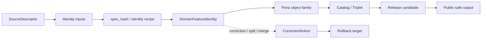

<!-- [KFM_META_BLOCK_V2]
doc_id: kfm://doc/contracts-domains-flora-domain-feature-identity
title: Flora Domain Feature Identity Contract
type: semantic-contract
version: v0.2
status: draft; PROPOSED; NEEDS VERIFICATION before promotion
owners: OWNER_TBD — Flora steward · Identity steward · Contract steward · Source steward · Schema steward · Validation steward · Policy steward · Release steward · Docs steward
created: 2026-06-21
updated: 2026-06-21
policy_label: public; semantic-contract; flora; domain-feature-identity; deterministic-identity; evidence-aware; source-role-aware; sensitivity-aware
tags: [kfm, contracts, flora, domain-feature-identity, identity, deterministic-id, spec-hash, source-role, evidence, lifecycle, correction, rollback]
related:
  - ./README.md
  - ./plant_taxon.md
  - ./flora_taxon_crosswalk.md
  - ./flora_occurrence.md
  - ./rare_plant_record.md
  - ./specimen_record.md
  - ./vegetation_community.md
  - ./botanical_survey.md
  - ./redaction_receipt.md
  - ../../../docs/domains/flora/CANONICAL_PATHS.md
  - ../../../docs/domains/flora/OBJECT_FAMILIES.md
  - ../../../schemas/contracts/v1/domains/flora/domain_feature_identity.schema.json
  - ../../../data/registry/sources/flora/
  - ../../../policy/domains/flora/
  - ../../../policy/sensitivity/flora/
  - ../../../fixtures/domains/flora/domain_feature_identity/
  - ../../../tests/domains/flora/
  - ../../../release/manifests/
notes:
  - "Expanded from a greenfield scaffold into a Flora domain-feature identity semantic contract."
  - "The paired schema currently defines only id, version, and spec_hash; additional field-level realization remains PROPOSED / NEEDS VERIFICATION."
  - "DomainFeatureIdentity is deterministic identity and lineage support for Flora objects; it is not source truth, occurrence proof, taxonomic authority, sensitivity approval, or release authority."
[/KFM_META_BLOCK_V2] -->

# Flora Domain Feature Identity

> Semantic contract for deterministic identity of Flora domain features: how KFM keeps plant taxa, occurrences, specimens, rare-plant records, vegetation communities, botanical surveys, restoration plantings, range polygons, and related Flora objects stable across source refreshes, corrections, redactions, and releases.

  
  
  
  
  

`contracts/domains/flora/domain_feature_identity.md`

## Quick jumps

[Status](#status) · [Meaning](#meaning) · [Repo fit](#repo-fit) · [Schema posture](#schema-posture) · [Assertions](#assertions) · [Exclusions](#exclusions) · [Recommended semantics](#recommended-semantics) · [Identity rules](#identity-rules) · [Lifecycle](#lifecycle) · [Validation](#validation) · [Evidence basis](#evidence-basis) · [Rollback](#rollback)

---

## Status

> [!IMPORTANT]
> **Status:** `draft` / semantic contract  
> **Contract path:** `contracts/domains/flora/domain_feature_identity.md`  
> **Schema path:** `schemas/contracts/v1/domains/flora/domain_feature_identity.schema.json`  
> **Truth posture:** target path, prior scaffold, paired schema metadata, Flora lane pattern, object-family inventory, source-role enum, lifecycle posture, and rare-plant sensitivity posture are CONFIRMED from current repo evidence. Full identity recipe, field-level schema shape beyond `id`, `version`, `spec_hash`, fixtures, validators, source registry records, policy runtime behavior, release workflow, API behavior, UI behavior, and test coverage remain NEEDS VERIFICATION.

> [!CAUTION]
> `DomainFeatureIdentity` is an identity support object. It does **not** make a source claim true, does not prove a plant occurrence, does not resolve taxonomy by itself, does not authorize rare-plant geometry exposure, and does not publish anything.

---

## Meaning

`DomainFeatureIdentity` records the **stable identity and lineage posture** for a Flora domain feature across ingest, normalization, review, correction, redaction, release, and rollback.

It answers questions like:

- What Flora object or feature is being identified?
- Which source-native identifiers, source descriptors, hashes, object-family keys, and temporal facets contributed to its identity?
- Which version of the identity is current, superseded, corrected, split, merged, quarantined, or released?
- Which downstream records depend on this identity?
- Which correction, rollback, source refresh, taxonomy update, geoprivacy decision, or release state can invalidate it?

Identity is necessary for auditability, deduplication, correction, and repeatable joins. It is not sovereign truth; evidence, source role, policy, review, and release state still determine what can be claimed or published.

---

## Repo fit

The Flora lane follows the responsibility-root pattern: contracts define semantic meaning, schemas define machine shape, policy gates admissibility/release, fixtures/tests prove behavior, and data/release roots carry lifecycle and publication state.

| Responsibility | Path or root | This contract's role |
|---|---|---|
| Identity meaning | `contracts/domains/flora/domain_feature_identity.md` | Owned here |
| Machine schema shape | `schemas/contracts/v1/domains/flora/domain_feature_identity.schema.json` | Linked only |
| Source identity and rights | `data/registry/sources/flora/` | Required source context; not replaced |
| Flora object-family contracts | `contracts/domains/flora/*.md` | Use identity; not replaced |
| Policy and sensitivity | `policy/domains/flora/`, `policy/sensitivity/flora/` | Decide release/admissibility; not replaced |
| Fixtures and tests | `fixtures/domains/flora/`, `tests/domains/flora/` | Required proof support; not owned here |
| Release/correction/rollback | `release/`, correction records, receipts | Required downstream governance |

This split prevents an identity contract from becoming a source descriptor, occurrence record, taxonomic authority, rare-plant release decision, schema, fixture, test, or UI implementation.

---

## Schema posture

The paired schema currently exists and is **PROPOSED**.

| Schema fact | Current evidence |
|---|---|
| Schema file path | `schemas/contracts/v1/domains/flora/domain_feature_identity.schema.json` |
| Schema title | `domain_feature_identity` |
| Declared properties | `spec_hash`, `id`, `version` |
| Required fields | `id` |
| Additional properties | `true` |
| Schema status | `PROPOSED` |
| Contract document | `contracts/domains/flora/domain_feature_identity.md` |
| Fixtures root | `fixtures/domains/flora/domain_feature_identity/` |
| Validator path | `tools/validators/domains/flora/validate_domain_feature_identity.py` |
| Policy root | `policy/domains/flora/` |

Because the schema is currently minimal and permissive, this contract defines semantic expectations for future schema hardening, fixtures, validators, identity recipe review, policy tests, release checks, and API/UI use. It does not claim current machine enforcement.

---

## Assertions

A reviewed `DomainFeatureIdentity` should semantically assert:

1. **Feature family** — the Flora object family being identified: plant taxon, occurrence, rare-plant record, specimen, vegetation community, botanical survey, range polygon, restoration planting, or other reviewed family.
2. **Identity basis** — source-native id, source descriptor, normalized object key, geometry/time/taxon facets where allowed, and content hash or identity recipe version.
3. **Version posture** — current, superseded, corrected, split, merged, quarantined, released, withdrawn, or rollback target.
4. **Evidence linkage** — EvidenceRef/EvidenceBundle or source descriptor references required to interpret the identity.
5. **Sensitivity posture** — whether identity fields can expose rare-plant, steward-controlled, private-land, or culturally sensitive plant knowledge through joins or stable IDs.
6. **Downstream dependency** — which catalog, triplet, layer, release, or correction records depend on this identity.
7. **Rollback posture** — how to locate the prior identity state or safe previous version when correction or rollback is required.

---

## Exclusions

| Misuse | Why it is denied |
|---|---|
| Source truth | Stable identity does not make source content correct. |
| Occurrence proof | A feature id does not prove plant presence or absence. |
| Taxonomic authority | Taxon meaning and crosswalks remain separate. |
| Rare-plant release permission | Identity does not override sensitivity, geoprivacy, policy, review, or release gates. |
| Redaction receipt | Redaction/generalization receipts remain separate. |
| Release manifest | Promotion and publication remain governed release decisions. |
| Public join key for sensitive records | Stable ids must not leak restricted locations or steward-controlled knowledge through joins. |

---

## Recommended semantics

The paired schema currently names only `id`, `version`, and `spec_hash`. The following fields are **PROPOSED semantic expectations** for future schema/profile work.

| Field | Meaning |
|---|---|
| `id` | Canonical Flora feature identity. |
| `version` | Object or identity contract version. |
| `spec_hash` | Deterministic content hash or integrity pin. |
| `feature_family` | Flora object family being identified. |
| `source_descriptor_ref` | Source identity, rights, cadence, attribution, and source role context. |
| `source_native_id` | Source-native id when safe and permissible. |
| `identity_recipe` | Named recipe used to derive the id. |
| `identity_recipe_version` | Version of the identity recipe. |
| `identity_inputs_hash` | Hash of identity inputs without exposing restricted values. |
| `taxon_ref` | Taxon or source-native taxon reference where identity depends on taxon. |
| `geometry_ref` | Restricted or public-safe geometry reference where identity depends on geometry. |
| `temporal_scope` | Source, observed, valid, retrieval, release, and correction time posture. |
| `sensitivity_state` | Whether identity fields are public, restricted, generalized, or withheld. |
| `evidence_refs` | EvidenceRef/EvidenceBundle links. |
| `review_record_ref` | Identity/source/taxonomy/sensitivity review record. |
| `release_ref` | Release or candidate release linkage when identity appears in public output. |
| `correction_refs` | Correction/supersession/rollback lineage. |

---

## Identity rules

| Rule | Required posture |
|---|---|
| Deterministic where practical | Same reviewed inputs should produce the same identity unless recipe version changes. |
| Source-native identity preserved | Do not overwrite source ids; store/refer to them with source context. |
| Identity recipe is reviewable | Hash inputs and recipe version must be auditable before promotion. |
| Sensitivity cannot be hidden by hashing | Hashes or stable IDs must not become re-identification keys for rare plants or steward-controlled records. |
| Correction creates lineage | Splits, merges, duplicate removal, taxonomic correction, geometry correction, and source withdrawal must produce correction/rollback lineage. |
| Release uses public-safe ids | Public outputs must not expose restricted internal ids when doing so would aid sensitive joins. |

---

## Lifecycle

| Phase | Expected handling |
|---|---|
| RAW | Source-native identifiers and raw inputs remain source-bound. |
| WORK / QUARANTINE | Candidate identities are normalized, deduplicated, source-role checked, sensitivity reviewed, and held when uncertain. |
| PROCESSED | Reviewed identities receive deterministic ids, hash/integrity support, evidence links, sensitivity posture, and correction posture. |
| CATALOG / TRIPLET | Identities can support graph/catalog references only with source, evidence, and time scope preserved. |
| PUBLISHED | Only public-safe ids and released derivatives appear in public surfaces. |
| CORRECTION | Duplicate, split, merge, taxonomy change, geometry change, source withdrawal, or sensitivity update requires correction and rollback lineage. |

---

## Validation

Before this contract is promoted beyond draft:

- [ ] Define and review the full identity recipe for each Flora object family.
- [ ] Harden the paired schema beyond `id`, `version`, and `spec_hash` when the recipe is accepted.
- [ ] Add fixtures for stable identity, duplicate detection, split, merge, supersession, source withdrawal, rare-plant restricted identity, and public-safe identity cases.
- [ ] Add negative tests proving identity cannot be used as occurrence proof, source truth, taxonomy authority, rare-plant release permission, or release approval.
- [ ] Confirm `spec_hash` behavior and rollback target behavior across source refreshes.
- [ ] Confirm public IDs cannot be used to reconstruct exact rare-plant locations, private-land joins, or steward-controlled records.
- [ ] Confirm validators and fixtures exist at the paths named by the schema before claiming enforcement.

---

## Evidence basis

| Source | Status | Supports | Limits |
|---|---|---|---|
| `contracts/domains/flora/domain_feature_identity.md` prior version | CONFIRMED repo evidence | Target existed as a greenfield scaffold. | Did not define authoritative semantics. |
| `schemas/contracts/v1/domains/flora/domain_feature_identity.schema.json` | CONFIRMED repo evidence | Paired schema exists with `id`, `version`, `spec_hash`, fixture root, validator path, policy root, and PROPOSED status. | Schema is minimal and permissive; validator/test implementation is not confirmed. |
| `docs/domains/flora/CANONICAL_PATHS.md` | CONFIRMED repo evidence | Confirms Flora lane pattern, object families, source-role enum, lifecycle invariant, and sensitivity posture. | Many concrete paths remain PROPOSED until repo verification. |
| `docs/domains/flora/OBJECT_FAMILIES.md` | CONFIRMED repo evidence | Confirms Flora object-family list and that field shape, source rights, and release decisions are outside the register. | Does not define feature identity fields. |
| `contracts/domains/flora/README.md` | CONFIRMED repo evidence | Confirms this root is the Flora contracts home and should not duplicate generic/cross-domain materials. | README is itself a greenfield scaffold. |
| User-provided Markdown Authoring Agent v2 prompt | CONFIRMED user-provided guidance | Authoring guidance for grounded, repo-aware Markdown. | It is not repository implementation evidence and was not pasted into this contract. |

---

## Rollback

Rollback if this file is used to claim implemented identity validation, treat stable identity as source truth, expose sensitive join keys, publish rare-plant locations, bypass source-role/evidence/policy/review/release gates, or hide correction and rollback lineage.

Rollback target: prior scaffold blob SHA `e200d6cb508660cc2b140b563de2d6c5616948cb`.

<a href="#top">Back to top</a>

