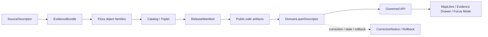

<!-- [KFM_META_BLOCK_V2]
doc_id: kfm://doc/contracts-domains-flora-domain-layer-descriptor
title: Flora Domain Layer Descriptor Contract
type: semantic-contract
version: v0.2
status: draft; PROPOSED; NEEDS VERIFICATION before promotion
owners: OWNER_TBD — Flora steward · Layer steward · Map steward · Contract steward · Source steward · Schema steward · Validation steward · Policy steward · Release steward · Docs steward
created: 2026-06-21
updated: 2026-06-21
policy_label: public; semantic-contract; flora; domain-layer-descriptor; map-layer; public-safe; source-role-aware; sensitivity-aware; no-truth-authority
tags: [kfm, contracts, flora, domain-layer-descriptor, layer, map, maplibre, public-safe, evidence, policy, release, redaction, correction, rollback]
related:
  - ./README.md
  - ./domain_feature_identity.md
  - ./flora_occurrence.md
  - ./rare_plant_record.md
  - ./vegetation_community.md
  - ./range_polygon.md
  - ./habitat_association.md
  - ./botanical_survey.md
  - ./redaction_receipt.md
  - ../../../docs/domains/flora/CANONICAL_PATHS.md
  - ../../../docs/domains/flora/OBJECT_FAMILIES.md
  - ../../../docs/domains/flora/MAP_UI_CONTRACTS.md
  - ../../../schemas/contracts/v1/domains/flora/domain_layer_descriptor.schema.json
  - ../../../data/registry/sources/flora/
  - ../../../policy/domains/flora/
  - ../../../policy/sensitivity/flora/
  - ../../../fixtures/domains/flora/domain_layer_descriptor/
  - ../../../tests/domains/flora/
  - ../../../release/manifests/
notes:
  - "Expanded from a greenfield scaffold into a Flora domain-layer descriptor semantic contract."
  - "The paired schema currently defines only id, version, and spec_hash; additional field-level realization remains PROPOSED / NEEDS VERIFICATION."
  - "DomainLayerDescriptor is domain layer meaning and map/public surface metadata; it is not canonical truth, not source data, not a LayerManifest replacement, not policy approval, and not release authority."
[/KFM_META_BLOCK_V2] -->

# Flora Domain Layer Descriptor

> Semantic contract for Flora domain-layer descriptors: how KFM describes Flora map/view layers as public-safe, evidence-backed, policy-aware renderable products without turning layers, tiles, styles, or UI surfaces into sovereign truth.

  
  
  
  
  

`contracts/domains/flora/domain_layer_descriptor.md`

## Quick jumps

[Status](#status) · [Meaning](#meaning) · [Repo fit](#repo-fit) · [Schema posture](#schema-posture) · [Assertions](#assertions) · [Exclusions](#exclusions) · [Recommended semantics](#recommended-semantics) · [Layer rules](#layer-rules) · [Lifecycle](#lifecycle) · [Validation](#validation) · [Evidence basis](#evidence-basis) · [Rollback](#rollback)

---

## Status

> [!IMPORTANT]
> **Status:** `draft` / semantic contract  
> **Contract path:** `contracts/domains/flora/domain_layer_descriptor.md`  
> **Schema path:** `schemas/contracts/v1/domains/flora/domain_layer_descriptor.schema.json`  
> **Truth posture:** target path, prior scaffold, paired schema metadata, Flora lane pattern, object-family inventory, source-role enum, lifecycle posture, rare-plant sensitivity posture, and Flora map-surface doctrine are CONFIRMED from current repo evidence. Full layer descriptor recipe, field-level schema shape beyond `id`, `version`, `spec_hash`, fixtures, validators, source registry records, policy runtime behavior, release workflow, governed API behavior, UI behavior, and test coverage remain NEEDS VERIFICATION.

> [!CAUTION]
> `DomainLayerDescriptor` describes how a Flora layer should be understood and rendered. It does **not** make a layer canonical truth, does not authorize rare-plant geometry exposure, does not replace `LayerManifest`, `StyleManifest`, `TileArtifactManifest`, `MapReleaseManifest`, policy, review, release, or EvidenceBundle resolution.

---

## Meaning

`DomainLayerDescriptor` records the **domain meaning, claim posture, display intent, evidence hooks, sensitivity posture, and release dependency** for a Flora layer or layer-like public product.

It answers questions like:

- What Flora object family or families does the layer summarize or expose?
- What does the layer claim: occurrence summary, rare-plant generalized layer, vegetation community, invasive plant layer, phenology layer, range polygon, habitat association, botanical survey effort, restoration planting, or another reviewed product?
- Which source roles, evidence bundles, redaction receipts, policy decisions, review records, release manifests, and rollback targets support the layer?
- What should public users understand about spatial precision, temporal scope, generalization, uncertainty, and withheld detail?
- Which map/UI consumers may render it, and what trust-visible states must be shown?

A layer descriptor is interpretive metadata. It gives a renderable layer context, caveats, provenance hooks, and safety posture, but the underlying evidence and release artifacts remain the authority.

---

## Repo fit

The Flora lane follows the responsibility-root pattern: contracts define semantic meaning, schemas define machine shape, policy gates admissibility/release, fixtures/tests prove behavior, and data/release roots carry lifecycle and publication state.

| Responsibility | Path or root | This contract's role |
|---|---|---|
| Flora layer meaning | `contracts/domains/flora/domain_layer_descriptor.md` | Owned here |
| Machine schema shape | `schemas/contracts/v1/domains/flora/domain_layer_descriptor.schema.json` | Linked only |
| Feature identity support | `contracts/domains/flora/domain_feature_identity.md` | Stable identity support; not replaced |
| Map/UI contracts | cross-cutting map/ui contract homes | LayerManifest/StyleManifest/TileArtifactManifest/MapReleaseManifest remain cross-cutting |
| Flora object-family contracts | `contracts/domains/flora/*.md` | Layer inputs; not replaced |
| Source identity and rights | `data/registry/sources/flora/` | Required source context; not replaced |
| Policy and sensitivity | `policy/domains/flora/`, `policy/sensitivity/flora/` | Decide release/admissibility; not replaced |
| Release artifacts | `release/`, `data/published/layers/flora/` | Govern public exposure; not replaced |

This split prevents a Flora layer descriptor from becoming canonical data, source truth, schema, style spec, tile manifest, map release manifest, policy decision, redaction receipt, fixture, test, or UI implementation.

---

## Schema posture

The paired schema currently exists and is **PROPOSED**.

| Schema fact | Current evidence |
|---|---|
| Schema file path | `schemas/contracts/v1/domains/flora/domain_layer_descriptor.schema.json` |
| Schema title | `domain_layer_descriptor` |
| Declared properties | `spec_hash`, `id`, `version` |
| Required fields | `id` |
| Additional properties | `true` |
| Schema status | `PROPOSED` |
| Contract document | `contracts/domains/flora/domain_layer_descriptor.md` |
| Fixtures root | `fixtures/domains/flora/domain_layer_descriptor/` |
| Validator path | `tools/validators/domains/flora/validate_domain_layer_descriptor.py` |
| Policy root | `policy/domains/flora/` |

Because the schema is currently minimal and permissive, this contract defines semantic expectations for future schema hardening, fixtures, validators, layer descriptor review, policy tests, release checks, governed API contracts, and MapLibre/UI use. It does not claim current machine enforcement.

---

## Assertions

A reviewed `DomainLayerDescriptor` should semantically assert:

1. **Layer identity** — the Flora layer, product, view, tile set, queryable surface, story surface, or Focus Mode layer being described.
2. **Layer family** — occurrence, rare plant, specimen summary, vegetation community, invasive plant, phenology, range, habitat association, botanical survey effort, restoration planting, or mixed layer.
3. **Claim posture** — what the layer may say and what it must caveat or abstain from saying.
4. **Evidence posture** — EvidenceBundle, source descriptors, source roles, validation reports, redaction receipts, and release records required to interpret the layer.
5. **Sensitivity posture** — whether exact geometry, rare-plant records, steward-controlled records, culturally sensitive plant knowledge, or private-land joins are withheld, generalized, aggregated, or denied.
6. **Temporal posture** — observed/source/valid/retrieval/release/correction time scope shown to users.
7. **UI trust posture** — badges, caveats, stale/generalized/denied states, evidence drawer hooks, and correction/rollback surfaces that must remain visible.

---

## Exclusions

| Misuse | Why it is denied |
|---|---|
| Canonical truth | Layers are downstream renderable products, not source-of-truth stores. |
| Raw data access | Public layers must not read RAW, WORK, QUARANTINE, or internal canonical stores. |
| Release approval | ReleaseManifest/PromotionDecision governs publication; a descriptor alone does not publish. |
| Policy approval | PolicyDecision and ReviewRecord remain separate. |
| Style or tile manifest | Cross-cutting map contracts own style/tile/release manifest shapes. |
| Evidence proof | EvidenceBundle and validation/proof records support claims; a layer descriptor only references them. |
| Rare-plant disclosure | Exact sensitive plant locations remain fail-closed unless governed public-safe release support exists. |
| UI implementation | MapLibre/runtime/UI code lives outside this contract. |

---

## Recommended semantics

The paired schema currently names only `id`, `version`, and `spec_hash`. The following fields are **PROPOSED semantic expectations** for future schema/profile work.

| Field | Meaning |
|---|---|
| `id` | Canonical Flora layer descriptor identity. |
| `version` | Object or descriptor contract version. |
| `spec_hash` | Deterministic content hash or integrity pin. |
| `layer_key` | Stable layer key or source-native layer id, if safe. |
| `layer_family` | Flora object family or mixed layer family. |
| `display_title` | Public-safe layer title. |
| `summary` | Public-safe layer description and caveat summary. |
| `source_descriptor_refs` | Source identity, rights, cadence, attribution, and source-role references. |
| `source_roles` | Canonical source roles represented in the layer. |
| `evidence_refs` | EvidenceRef/EvidenceBundle links backing layer claims. |
| `validation_report_refs` | Validation reports required for the layer. |
| `redaction_receipt_refs` | Generalization, aggregation, suppression, or withholding receipts supporting public-safe output. |
| `release_ref` | ReleaseManifest or candidate release linkage. |
| `public_artifact_refs` | Public-safe tile/vector/raster/layer artifact references. |
| `sensitivity_state` | Public, generalized, aggregated, withheld, denied, stewarded, or restricted posture. |
| `temporal_scope` | Observed, source, valid, retrieval, release, stale, and correction time posture. |
| `trust_badges` | Trust-visible UI state labels required at render time. |
| `evidence_drawer_ref` | Evidence Drawer payload or resolver reference where adopted. |
| `correction_refs` | Correction/supersession/rollback lineage. |

---

## Layer rules

| Rule | Required posture |
|---|---|
| Layer is downstream | A descriptor can point to released products but must not replace evidence, catalog, triplet, or source records. |
| Public-safe only | Public-facing layers must be released, policy-safe, and redacted/generalized when needed. |
| Source roles remain visible | Observed, regulatory, modeled, aggregate, administrative, candidate, and synthetic roles must not collapse into one layer truth claim. |
| Sensitive joins fail closed | Rare-plant, steward-controlled, private-land, or culturally sensitive plant joins must deny, generalize, aggregate, or route to review. |
| UI needs evidence hooks | Evidence Drawer / Focus Mode must resolve evidence before consequential claims are rendered. |
| Style is not meaning | Visual style may communicate state, but it is not the evidence, policy, or release record. |

---

## Lifecycle

| Phase | Expected handling |
|---|---|
| RAW | No layer descriptor should expose or depend directly on raw source data for public display. |
| WORK / QUARANTINE | Candidate layer definitions are assembled, source-role checked, sensitivity reviewed, and held when unsafe. |
| PROCESSED | Reviewed descriptors link to evidence, validation, redaction, public artifacts, release posture, and correction posture. |
| CATALOG / TRIPLET | Descriptor-supported layer claims can point to catalog/triplet records only with evidence and source-role context preserved. |
| PUBLISHED | Only released public-safe descriptors and artifacts are served to public clients through governed interfaces. |
| CORRECTION | Source refresh, redaction change, tile rebuild, schema change, release withdrawal, or evidence correction requires descriptor invalidation or rollback. |

---

## Validation

Before this contract is promoted beyond draft:

- [ ] Define and review the full layer descriptor field set for Flora.
- [ ] Harden the paired schema beyond `id`, `version`, and `spec_hash` when the descriptor profile is accepted.
- [ ] Add fixtures for public occurrence summary, rare-plant generalized layer, vegetation community layer, invasive plant layer, phenology layer, range layer, botanical survey effort layer, and restoration planting layer.
- [ ] Add negative tests proving descriptors cannot publish raw data, bypass release, hide source roles, or expose exact rare-plant/steward-controlled locations.
- [ ] Confirm `spec_hash` behavior and rollback target behavior across source refreshes, tile rebuilds, and release updates.
- [ ] Confirm validators and fixtures exist at the paths named by the schema before claiming enforcement.
- [ ] Confirm MapLibre/Evidence Drawer/Focus Mode surfaces consume governed APIs and released artifacts only.

---

## Evidence basis

| Source | Status | Supports | Limits |
|---|---|---|---|
| `contracts/domains/flora/domain_layer_descriptor.md` prior version | CONFIRMED repo evidence | Target existed as a greenfield scaffold. | Did not define authoritative semantics. |
| `schemas/contracts/v1/domains/flora/domain_layer_descriptor.schema.json` | CONFIRMED repo evidence | Paired schema exists with `id`, `version`, `spec_hash`, fixture root, validator path, policy root, and PROPOSED status. | Schema is minimal and permissive; validator/test implementation is not confirmed. |
| `docs/domains/flora/CANONICAL_PATHS.md` | CONFIRMED repo evidence | Confirms Flora lane pattern, object families, source-role enum, lifecycle invariant, and sensitivity posture. | Many concrete paths remain PROPOSED until repo verification. |
| `docs/domains/flora/MAP_UI_CONTRACTS.md` | CONFIRMED repo evidence | Confirms Flora map surfaces are PUBLISHED-only consumers, not truth surfaces, and must use governed APIs, EvidenceBundle, policy, validation, and public-safe transforms. | It is doctrine/spec guidance; implementation routes remain NEEDS VERIFICATION. |
| `contracts/domains/flora/README.md` | CONFIRMED repo evidence | Confirms this root is the Flora contracts home and should not duplicate generic/cross-domain materials. | README is itself a greenfield scaffold. |
| User-provided Markdown Authoring Agent v2 prompt | CONFIRMED user-provided guidance | Authoring guidance for grounded, repo-aware Markdown. | It is not repository implementation evidence and was not pasted into this contract. |

---

## Rollback

Rollback if this file is used to claim implemented layer validation, treat map layers as canonical truth, publish raw/internal data, expose sensitive Flora joins, bypass source-role/evidence/policy/review/release gates, replace LayerManifest/StyleManifest/TileArtifactManifest/MapReleaseManifest, or hide correction and rollback lineage.

Rollback target: prior scaffold blob SHA `15f92f7c854701273835fbf04e9f9c2a7d3dcc28`.

<a href="#top">Back to top</a>

