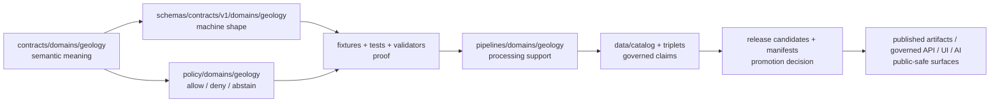

<!-- [KFM_META_BLOCK_V2]
doc_id: kfm://doc/contracts-domains-geology-readme
title: Geology Contracts README
type: directory-readme
version: v0.2
status: draft; active-maintenance; PROPOSED / NEEDS VERIFICATION before promotion
owners:
  - OWNER_TBD — Geology domain steward
  - OWNER_TBD — Contract steward
  - OWNER_TBD — Schema steward
  - OWNER_TBD — Policy steward
  - OWNER_TBD — Validation steward
  - OWNER_TBD — Release steward
  - OWNER_TBD — Docs steward
created: 2026-06-21
updated: 2026-06-21
policy_label: public-with-gates; contracts-root; geology; semantic-contracts; source-role-aware; release-gated; anti-collapse
tags: [kfm, contracts, geology, README, semantic-contracts, object-families, natural-resources, source-role, sensitivity, validation, release, correction, rollback]
related:
  - ../../../docs/domains/geology/README.md
  - ../../../docs/domains/geology/SCOPE.md
  - ../../../docs/domains/geology/OBJECT_FAMILIES.md
  - ../../../docs/domains/geology/CANONICAL_PATHS.md
  - ../../../docs/domains/geology/sublanes/README.md
  - ../../../docs/domains/geology/sublanes/natural_resources.md
  - ../../../docs/domains/geology/sublanes/boreholes-wells.md
  - ../../../schemas/contracts/v1/domains/geology/
  - ../../../policy/domains/geology/
  - ../../../fixtures/domains/geology/
  - ../../../tests/domains/geology/
  - ../../../data/registry/sources/geology/
  - ../../../pipelines/domains/geology/
  - ../../../release/manifests/geology/
notes:
  - "Replaces a greenfield scaffold README that over-broadly placed schemas, policies, fixtures, tests, packages, pipelines, registries, and lifecycle artifacts under contracts/."
  - "This README is a directory landing page for semantic Markdown contracts only. Machine shape, policy, fixtures, tests, pipelines, source registry, lifecycle data, and release artifacts remain in their responsibility roots."
  - "Several Geology contract/schema names remain CONFLICTED or NEEDS VERIFICATION because docs and schema scaffolds use mixed PascalCase, lower-case, short-form, and Reference-form spellings."
  - "No runtime, CI, validator, policy engine, release manifest, or public API behavior is claimed here unless separately verified."
[/KFM_META_BLOCK_V2] -->

<a id="top"></a>

# Geology Contracts

> Semantic-contract landing page for KFM's Geology and Natural Resources lane — the place where object-family **meaning** is documented before schemas, policies, validators, pipelines, releases, maps, APIs, or AI surfaces can safely use those objects.

<p>
  
  
  
  
  
  
  
</p>

**Path:** `contracts/domains/geology/README.md`  
**Status:** `draft` / active-maintenance / contract-lane orientation  
**Owners:** `OWNER_TBD` — Geology domain steward · Contract steward · Schema steward · Policy steward · Validation steward · Release steward · Docs steward  
**Last updated:** 2026-06-21

> [!IMPORTANT]
> This directory owns **semantic Markdown contracts only**. It does not own JSON Schema, policy decisions, fixtures, tests, source registries, lifecycle data, pipeline code, release manifests, map tiles, API payloads, UI views, or AI answers. Those belong in their responsibility roots.

## Quick jumps

[Scope](#scope) · [Repo fit](#repo-fit) · [What belongs here](#what-belongs-here) · [What does not belong here](#what-does-not-belong-here) · [Contract map](#contract-map) · [Naming drift](#naming-drift) · [Trust path](#trust-path) · [Maintenance checklist](#maintenance-checklist) · [Validation](#validation) · [Rollback](#rollback) · [Open questions](#open-questions)

---

## Scope

`contracts/domains/geology/` is the semantic-contract home for Geology object-family meaning.

A file in this directory should answer questions like:

- What does this Geology object family mean?
- What evidence and source role may support it?
- What adjacent objects must it not collapse into?
- Which fields are likely needed by future schema work?
- Which policy, sensitivity, validation, release, correction, and rollback gates matter?

It should **not** pretend that implementation exists. A contract can define meaning before schema enforcement, policy tests, source registry activation, pipeline runtime, or release workflow are complete.

---

## Repo fit

| Responsibility | Home | Geology lane role |
|---|---|---|
| Domain doctrine and orientation | `docs/domains/geology/` | Human-facing scope, object-family reference, canonical paths, sublanes, source-role notes |
| Semantic object meaning | `contracts/domains/geology/` | **This directory** — Markdown contracts for object-family meaning |
| Machine-checkable shape | `schemas/contracts/v1/domains/geology/` | JSON Schema and schema fixtures; separate authority root |
| Policy decisions | `policy/domains/geology/`, `policy/sensitivity/geology/` | Allow/deny/restrict/abstain rules and sensitivity gates |
| Validation proof | `tests/domains/geology/`, `tools/validators/` | Tests and validators proving contracts/schemas/policies are enforceable |
| Examples and fixtures | `fixtures/domains/geology/` | Valid, invalid, sensitive, quarantine, and release-candidate examples |
| Source identity and roles | `data/registry/sources/geology/` | SourceDescriptor records, rights, cadence, source roles, authority limits |
| Executable processing | `pipelines/domains/geology/` | Ingest/normalize/validate/catalog/release-support logic, not semantic authority |
| Lifecycle data | `data/raw`, `data/work`, `data/quarantine`, `data/processed`, `data/catalog`, `data/triplets`, `data/published` | State-managed data; not contract documentation |
| Publication decisions | `release/candidates/geology/`, `release/manifests/geology/` | Promotion, release, correction, and rollback artifacts |

> [!WARNING]
> Do not create a repo-root `geology/` folder for convenience. Geology appears as a lane segment inside responsibility roots, not as a root-level authority bucket.

---

## What belongs here

Accepted content:

| Belongs here | Examples | Notes |
|---|---|---|
| Object-family meaning | `GeologicUnit.md`, `Lithology.md`, `MineralOccurrence.md` | Defines semantic meaning and anti-collapse boundaries. |
| Contract-level field proposals | “Recommended semantics” tables | PROPOSED until a schema enforces them. |
| Source-role rules | Observed vs aggregate vs modeled posture | Must not replace SourceDescriptor. |
| Sensitivity and release posture | Public-safe vs restricted/default-generalized behavior | Must not replace policy. |
| Contract validation backlogs | Fixture/test/schema checklists | Must not claim tests already exist. |
| Correction and rollback requirements | Rollback triggers and affected refs | Must connect to release/correction roots later. |
| Sublane contract grouping docs | `sublanes/README.md`, `sublanes/surficial/README.md` | Organizational only; no new authority root. |

---

## What does not belong here

| Does not belong here | Correct home | Why |
|---|---|---|
| JSON Schema files | `schemas/contracts/v1/domains/geology/` | Schemas define machine shape. |
| Policy rules | `policy/domains/geology/`, `policy/sensitivity/geology/` | Policy decides allow/deny/restrict/abstain. |
| Fixtures | `fixtures/domains/geology/` | Examples are test/support data, not semantic contracts. |
| Tests | `tests/domains/geology/` | Tests prove behavior. Contracts describe meaning. |
| Validators and tools | `tools/validators/` or accepted tool root | Executable validation does not live in contract docs. |
| Source descriptors | `data/registry/sources/geology/` | Source identity, rights, cadence, and authority limits are registry facts. |
| RAW/WORK/QUARANTINE/PROCESSED data | `data/<lifecycle-state>/...` | Lifecycle state is governed data, not documentation. |
| Pipeline code | `pipelines/domains/geology/` | Runtime transform logic is separate from object meaning. |
| Release manifests | `release/manifests/geology/` | Publication is a governed state transition, not a file move. |
| Tiles, maps, API responses, AI summaries | Governed UI/API/release roots | Delivery surfaces are downstream carriers, not sovereign truth. |

---

## Contract map

The Geology object-family roster is currently a **union** of source lists because the doctrine surfaces spelling and membership drift. This README keeps that drift visible rather than pretending the names are settled.

### Foundational geology

| Contract | Meaning | Status posture |
|---|---|---|
| [`GeologicUnit.md`](./GeologicUnit.md) | Mapped bedrock geologic unit or source map-unit assertion. | Expanded; schema path NEEDS VERIFICATION. |
| [`Lithology.md`](./Lithology.md) | Rock/sediment material-character descriptor for units, samples, and intervals. | Expanded; schema path NEEDS VERIFICATION. |
| [`StratigraphicInterval.md`](./StratigraphicInterval.md) | Named interval with bounded contacts and age model. | Expected / NEEDS VERIFICATION unless expanded separately. |
| [`GeologicAge.md`](./GeologicAge.md) | Chronostratigraphic/geochronologic age binding. | Expanded; membership drift surfaced. |
| `StructureFeature.md` or `FaultStructure.md` | Faults, folds, joints, lineaments, structural elements. | CONFLICTED naming; needs ADR/schema decision. |
| [`CrossSection.md`](./CrossSection.md) | 2D/2.5D interpretive subsurface section. | Expanded; interpretation/reality boundary required. |
| [`GeologyBoundaryVersion.md`](./GeologyBoundaryVersion.md) | Versioned boundary geometry and replacement lineage. | Expanded; own-schema vs metadata question open. |

### Subsurface and observation evidence

| Contract | Meaning | Status posture |
|---|---|---|
| [`BoreholeReference.md`](./BoreholeReference.md) | Borehole/well-like subsurface point reference. | Expanded; exact location restricted/default-generalized. |
| `WellLogReference.md` | Subsurface log series tied to a borehole. | Expected / NEEDS VERIFICATION unless expanded separately. |
| [`CoreSample.md`](./CoreSample.md) | Physical core/cuttings/sample evidence. | Expanded; schema path NEEDS VERIFICATION. |
| [`GeophysicalObservation.md`](./GeophysicalObservation.md) | Gravity, magnetic, seismic, or related survey product evidence. | Expanded; observed/modelled distinction required. |
| [`GeochemistrySample.md`](./GeochemistrySample.md) | Geochemical sample/analyte evidence. | Expanded; naming drift surfaced. |
| [`HydrostratigraphicUnit.md`](./HydrostratigraphicUnit.md) | Geology↔Hydrology bridge/context unit. | Expanded; Hydrology measurement ownership remains outside Geology. |

### Natural resources and operations

| Contract | Meaning | Status posture |
|---|---|---|
| [`MineralOccurrence.md`](./MineralOccurrence.md) | Reported mineral presence; not deposit or estimate. | Expanded; schema casing/path drift surfaced. |
| [`ResourceDeposit.md`](./ResourceDeposit.md) | Named or delineated deposit body; not an estimate. | Expected / NEEDS VERIFICATION unless expanded separately. |
| `ResourceEstimate.md` | Modeled or compiled quantity/classification; not occurrence/deposit. | §E/§C member; §B drift; NEEDS VERIFICATION. |
| [`ExtractionSite.md`](./ExtractionSite.md) | Physical extraction site context; not permit/title/operator proof. | Expanded; active/sensitive detail restricted/generalized. |
| `ReclamationRecord.md` | Reclamation status/plan/observation record. | Expected / NEEDS VERIFICATION unless expanded separately. |

### Contract sublanes

| Path | Role | Status posture |
|---|---|---|
| [`sublanes/README.md`](./sublanes/README.md) | Contract-side sublane orientation for Geology. | Organizational only; not a new authority root. |
| [`sublanes/surficial/README.md`](./sublanes/surficial/README.md) | Surficial contract-sublane orientation. | Organizational only; contract meaning only. |

---

## Naming drift

The Geology lane currently has several known naming and placement conflicts. Do not resolve these by tone or filename preference.

| Drift | Current posture | Required handling |
|---|---|---|
| `Borehole` vs `BoreholeReference` | CONFLICTED / reference form used by some docs | Preserve requested path; record drift in contract/schema notes. |
| `Well Log` vs `Well LogReference` | CONFLICTED | Do not invent canonical casing without ADR/schema decision. |
| `Fault Structure` vs `StructureFeature` | CONFLICTED | Treat as naming reconciliation, not identity rotation. |
| `Geochemistry Sample` vs `GeochemistrySampleReference` / `GeochemistrySample` | CONFLICTED | Surface in contract and schema notes. |
| `Resource Deposit` vs `ResourceEstimate` membership | CONFLICTED | Occurrence/deposit/estimate anti-collapse remains mandatory. |
| `GeologyBoundaryVersion` own schema vs metadata-on-unit | OPEN / NEEDS VERIFICATION | Route to ADR or schema PR. |
| PascalCase contract files vs lower-case schema pointers | CONFLICTED in at least `MineralOccurrence` | Do not create parallel authority; reconcile by ADR/schema PR. |

> [!IMPORTANT]
> A spelling mismatch does not automatically create a new object identity. Treat the mismatch as a drift item until a schema PR, ADR, or drift-register entry resolves it.

---

## Trust path



The contract file is the first semantic stop, not the last approval gate.

---

## Source-role and anti-collapse discipline

Every Geology contract should preserve source role and object identity.

```text
Occurrence != Deposit != Estimate != Permit != Production != Reserve
Borehole != WellLog != CoreSample != GeochemistrySample
GeologicUnit != Lithology != GeologicAge != StratigraphicInterval
GeophysicalObservation != CrossSection != Hazards risk
HydrostratigraphicUnit != Hydrology measurement
ExtractionSite != ownership / lease / title proof
```

When in doubt:

| Condition | Contract answer |
|---|---|
| Evidence resolves and release is valid | `ANSWER` / public-safe derivative may be shown. |
| Evidence, source role, rights, schema, policy, or release support is incomplete | `ABSTAIN`. |
| Sensitive detail would be exposed, rights deny use, or identity collapses into a different authority class | `DENY`. |
| Schema, validator, source-read, transform, or release-runtime fails | `ERROR`. |

---

## Maintenance checklist

Before promoting any file in this directory beyond draft:

- [ ] Confirm the target path and casing against accepted Directory Rules and any ADR/schema decision.
- [ ] Confirm whether a paired schema exists and whether it is scaffold or field-enforcing.
- [ ] Confirm the contract does not claim runtime, validator, policy, API, UI, release, or CI behavior without evidence.
- [ ] Confirm source role and anti-collapse rules are explicit.
- [ ] Confirm sensitivity, rights, public-safe geometry, and release gates are visible where material.
- [ ] Confirm every public-facing derivative has a release path, correction path, and rollback target.
- [ ] Confirm adjacent docs link back here or to the relevant object contract.
- [ ] Record unresolved casing/path/schema/source-role drift in `docs/registers/DRIFT_REGISTER.md` or an ADR-backed issue.

---

## Validation

This README does not prove implementation. Validation remains **NEEDS VERIFICATION** until maintainers add or verify:

- JSON Schema under the accepted schema home;
- valid and invalid fixtures for every object family;
- tests for source-role anti-collapse;
- tests for rights/sensitivity/public-safe release gates;
- validators for deterministic identity and EvidenceRef/EvidenceBundle closure;
- release manifests and rollback targets for public derivatives;
- public API/UI checks proving normal clients do not read RAW/WORK/QUARANTINE/internal stores.

---

## Rollback

Rollback is required if this README or a child contract causes any of the following:

- points contributors to the wrong responsibility root;
- implies schemas, policies, fixtures, tests, pipelines, source registries, lifecycle data, or release manifests live under `contracts/`;
- hides known naming/casing drift;
- weakens the occurrence/deposit/estimate/permit/production/reserve anti-collapse rule;
- treats public tiles, API payloads, graph projections, or AI summaries as canonical truth;
- encourages public use before evidence, rights, validation, policy/review, release, correction, and rollback support exist.

Rollback target: restore the last known safe README and open a drift/ADR note for any conflicting path or object-name claim.

---

## Open questions

| Question | Status | Resolution path |
|---|---|---|
| Should Geology contract filenames standardize on PascalCase, kebab-case, or snake_case? | CONFLICTED / NEEDS VERIFICATION | ADR or schema PR aligning contract paths and `$id`/`x-kfm.contract_doc`. |
| Should `GeologyBoundaryVersion` be its own contract/schema or metadata on unit-bearing contracts? | OPEN / NEEDS VERIFICATION | Spatial + Geology schema decision. |
| Which resource-family contracts are owned here versus adjacent regulatory/legal roots? | NEEDS VERIFICATION | Natural-resources ADR and People/Land/regulatory review. |
| Which public-safe geometry classes are valid by object family? | NEEDS VERIFICATION | Policy, fixtures, and release review. |
| Which files should parent docs link to after all contracts are expanded? | NEEDS VERIFICATION | Documentation cross-link pass after contract batch completes. |

---

## Related docs

- [`../../../docs/domains/geology/README.md`](../../../docs/domains/geology/README.md) — domain landing page.
- [`../../../docs/domains/geology/SCOPE.md`](../../../docs/domains/geology/SCOPE.md) — owned / not-owned Geology boundary.
- [`../../../docs/domains/geology/OBJECT_FAMILIES.md`](../../../docs/domains/geology/OBJECT_FAMILIES.md) — object-family roster, identity, sensitivity, and drift.
- [`../../../docs/domains/geology/CANONICAL_PATHS.md`](../../../docs/domains/geology/CANONICAL_PATHS.md) — responsibility-root map and proposed lane tree.
- [`../../../docs/domains/geology/sublanes/natural_resources.md`](../../../docs/domains/geology/sublanes/natural_resources.md) — Natural Resources sublane doctrine.
- [`../../../docs/domains/geology/sublanes/boreholes-wells.md`](../../../docs/domains/geology/sublanes/boreholes-wells.md) — borehole/well/log/core posture.

[Back to top](#top)
