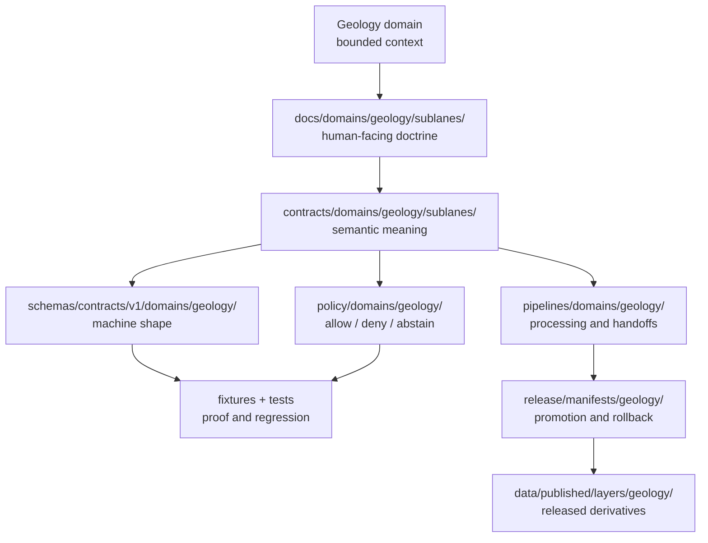

<!-- [KFM_META_BLOCK_V2]
doc_id: kfm://doc/contracts-domains-geology-sublanes-readme
title: Geology Contract Sublanes README
type: readme
version: v0.1
status: draft; PROPOSED; NEEDS VERIFICATION before promotion
owners:
  - OWNER_TBD — Geology domain steward
  - OWNER_TBD — Contract steward
  - OWNER_TBD — Docs steward
  - OWNER_TBD — Schema steward
  - OWNER_TBD — Policy steward
  - OWNER_TBD — Validation steward
  - OWNER_TBD — Release steward
created: 2026-06-21
updated: 2026-06-21
policy_label: public-with-gates; semantic-contracts; geology; sublanes; source-role-aware; release-gated
tags: [kfm, contracts, geology, sublanes, semantic-contracts, bounded-context, evidence, source-role, policy, release, rollback]
related:
  - ../README.md
  - ./surficial/README.md
  - ../../../../docs/domains/geology/SCOPE.md
  - ../../../../docs/domains/geology/CANONICAL_PATHS.md
  - ../../../../docs/domains/geology/sublanes/README.md
  - ../../../../docs/domains/geology/sublanes/surficial.md
  - ../../../../pipelines/domains/geology/surficial_units/README.md
  - ../../../../schemas/contracts/v1/domains/geology/
  - ../../../../policy/domains/geology/
  - ../../../../fixtures/domains/geology/
  - ../../../../tests/domains/geology/
  - ../../../../data/registry/sources/geology/
  - ../../../../release/manifests/geology/
notes:
  - "This README fills a previously blank repo file at contracts/domains/geology/sublanes/README.md."
  - "The file path is CONFIRMED present, but the broader sublanes/ convention remains PROPOSED / NEEDS VERIFICATION in Geology doctrine."
  - "A sublane is organizational only; it does not create a new domain, root, schema authority, policy authority, release authority, or public interface."
  - "This directory orients semantic contract groupings only. Machine shape, policy, tests, fixtures, lifecycle data, pipelines, source registry records, releases, and published layers stay in their own responsibility roots."
[/KFM_META_BLOCK_V2] -->

<a id="top"></a>

# Geology Contract Sublanes

> Parent README for Geology semantic-contract sublanes: an organizational layer that keeps contract meaning legible without creating new authority roots or bypassing KFM evidence, policy, release, correction, and rollback controls.

<p>
  
  
  
  
  
  
  
</p>

**Status:** Draft / PROPOSED contract sublane index  
**Path:** `contracts/domains/geology/sublanes/README.md`  
**Responsibility root:** `contracts/` — semantic object meaning, not machine validation  
**Domain lane:** Geology and Natural Resources  
**Repo evidence:** this README path is present in the repo; child sublane directories beyond `surficial/` and their contract files remain **NEEDS VERIFICATION** unless separately inspected  
**Placement caution:** the `sublanes/` segment is documented as **PROPOSED / NEEDS VERIFICATION** in the docs-side Geology sublane index and surficial doctrine; this README is not an ADR resolving the convention

---

## Quick jump

- [1. Purpose](#1-purpose)
- [2. What a contract sublane is](#2-what-a-contract-sublane-is)
- [3. Repo fit](#3-repo-fit)
- [4. Accepted inputs](#4-accepted-inputs)
- [5. Exclusions](#5-exclusions)
- [6. Current and proposed sublanes](#6-current-and-proposed-sublanes)
- [7. Contract-to-root handoff](#7-contract-to-root-handoff)
- [8. Anti-collapse rules](#8-anti-collapse-rules)
- [9. Directory map](#9-directory-map)
- [10. Validation and proof backlog](#10-validation-and-proof-backlog)
- [11. Rollback](#11-rollback)
- [12. Open questions](#12-open-questions)
- [13. Maintainer checklist](#13-maintainer-checklist)

---

## 1. Purpose

`contracts/domains/geology/sublanes/` is the contract-side orientation home for Geology sublane groupings.

It helps maintainers find and review semantic contracts for wide Geology object clusters without turning those clusters into new domains, roots, schemas, policy homes, release homes, or public APIs.

A contract sublane README should explain what its claims mean, what adjacent meanings they must not collapse into, and which evidence, source-role, temporal, spatial, sensitivity, release, correction, and rollback rules follow the claims.

> [!IMPORTANT]
> Contract files define **meaning**. They do not prove schema enforcement, source activation, data maturity, public release, runtime behavior, UI behavior, or AI answer authority.

[Back to top](#top)

---

## 2. What a contract sublane is

A **contract sublane** is an organizational grouping inside `contracts/domains/geology/`.

It is useful because Geology is broad: bedrock, surficial geology, stratigraphy, structures, subsurface evidence, geochemistry, geophysics, resource context, extraction, reclamation, and public-safe geology layers all need distinct meanings and review paths.

A sublane is **not** a new domain, a new repository root, a new schema home, a policy authority, a source registry, lifecycle data, release approval, a public map/API/UI path, or evidence by itself.

[Back to top](#top)

---

## 3. Repo fit

This README sits under the `contracts/` responsibility root, so its job is to orient **semantic meaning** only.

| Layer | Path / root | Owns | Status |
|---|---|---|---|
| Geology scope and boundary | `../../../../docs/domains/geology/SCOPE.md` | Bounded-context owns/does-not-own line | CONFIRMED present |
| Docs-side sublane index | `../../../../docs/domains/geology/sublanes/README.md` | Human-facing sublane navigation and proposed grouping | CONFIRMED present |
| Contract-side parent | `../README.md` | Geology contract lane orientation | CONFIRMED present; scaffold quality NEEDS REVIEW |
| Contract sublanes | `./` | Semantic grouping of Geology object contracts | This README path CONFIRMED; convention PROPOSED |
| Surficial contract sublane | `./surficial/README.md` | Surficial contract orientation | CONFIRMED present |
| Machine schemas | `../../../../schemas/contracts/v1/domains/geology/` | Machine-checkable shape | NEEDS VERIFICATION |
| Policy | `../../../../policy/domains/geology/` | Allow / deny / restrict / abstain decisions | NEEDS VERIFICATION |
| Fixtures and tests | `../../../../fixtures/domains/geology/`, `../../../../tests/domains/geology/` | Examples and proof | NEEDS VERIFICATION |
| Pipeline logic | `../../../../pipelines/domains/geology/` | Executable processing / handoff logic | Partly CONFIRMED by README evidence; behavior NEEDS VERIFICATION |
| Source registry | `../../../../data/registry/sources/geology/` | Source descriptors, rights, cadence, authority limits | NEEDS VERIFICATION |
| Release | `../../../../release/candidates/geology/`, `../../../../release/manifests/geology/` | Promotion decisions, manifests, rollback targets | NEEDS VERIFICATION |



[Back to top](#top)

---

## 4. Accepted inputs

Files belong under this parent when their primary purpose is to orient or define **semantic contract meaning** for a Geology sublane.

Accepted inputs include:

- sublane README files, such as `surficial/README.md`;
- semantic contracts for Geology object-family meanings;
- contract-level notes about source role, evidence, temporal support, spatial support, sensitivity posture, release expectations, correction, and rollback;
- contract-level cross-lane boundary rules where Geology provides context but does not own neighboring truth;
- contract-level open questions and backlog notes, only when they do not duplicate docs-side registers.

[Back to top](#top)

---

## 5. Exclusions

Do **not** put these here:

| Excluded material | Correct responsibility root | Reason |
|---|---|---|
| JSON Schema files | `schemas/contracts/v1/domains/geology/…` | Machine shape is not semantic Markdown. |
| Policy/rules code | `policy/domains/geology/` | Policy owns decisions and deny/abstain behavior. |
| Tests or validators | `tests/`, `tools/validators/`, or accepted validator homes | Proof and enforcement do not live in contracts. |
| Fixtures/examples | `fixtures/domains/geology/…` | Examples must be testable and separable from meaning. |
| Source fetchers | `connectors/<source_id>/` | Connectors are source-specific, not domain sublanes. |
| Source catalog profiles | `docs/sources/catalog/…` | Source authority, rights, terms, and cadence are source-governance concerns. |
| SourceDescriptor records | `data/registry/sources/geology/…` | Registry records are data/registry objects, not contract docs. |
| Pipeline code | `pipelines/domains/geology/…` | Executable transformation belongs in pipelines. |
| Lifecycle data | `data/raw`, `data/work`, `data/quarantine`, `data/processed`, `data/catalog`, `data/triplets`, `data/published` | Lifecycle phase controls remain separate. |
| Release decisions | `release/candidates/geology/`, `release/manifests/geology/` | Publication is a governed transition. |
| UI/API/map payloads | governed UI/API/layer roots | Delivery surfaces are downstream carriers, not contract authority. |

[Back to top](#top)

---

## 6. Current and proposed sublanes

The docs-side sublane index lists a proposed grouping for Geology. This contract-side README follows that grouping as orientation, not final ADR authority.

| Sublane | Contract-side status | Primary semantic-contract focus |
|---|---|---|
| `surficial/` | CONFIRMED README present | `SurficialUnit`, surficial boundary versions, public-safe surficial derivatives, source map-unit labels. |
| `bedrock/` or `bedrock-stratigraphy/` | PROPOSED / NEEDS VERIFICATION | `GeologicUnit`, lithology, stratigraphic interval, geologic age, correlation, cross-sections, hydrostratigraphic context. |
| `structures/` | PROPOSED / NEEDS VERIFICATION | Faults, structures, contacts, traces, confidence, and handoffs to Hazards without owning risk. |
| `subsurface/` or `boreholes-wells/` | PROPOSED / NEEDS VERIFICATION | Boreholes, well logs, cores, geophysical observations, geochemistry samples, and public-generalized views. |
| `resources/` or `natural-resources/` | PROPOSED / NEEDS VERIFICATION | Mineral occurrences, resource deposits, estimates, extraction sites, reclamation records, and People/Land boundary caution. |

> [!CAUTION]
> Do not create child directories simply because they appear here. Confirm the accepted slug, object-family names, schema paths, policy paths, source roles, and release gates first.

[Back to top](#top)

---

## 7. Contract-to-root handoff

Every sublane contract should state where its companion artifacts belong.

| If a contract says… | Companion proof belongs in… |
|---|---|
| This object has fields | `schemas/contracts/v1/domains/geology/…` |
| This object has valid/invalid examples | `fixtures/domains/geology/…` |
| This object is enforceable | `tests/domains/geology/…` and validator homes |
| This object is policy-sensitive | `policy/domains/geology/` |
| This object uses a source | `docs/sources/catalog/…` and `data/registry/sources/geology/…` |
| This object is processed | `pipelines/domains/geology/…` and lifecycle `data/…` roots |
| This object can be public | release candidate, ReleaseManifest, public-safe derivative, correction path, rollback target |
| AI may describe it | EvidenceBundle resolution, policy check, release state, and AI answer caveat |

[Back to top](#top)

---

## 8. Anti-collapse rules

Geology sublanes exist to prevent meaning collapse.

Disallowed collapses:

```text
bedrock unit -> surficial unit
surficial unit -> soil mapunit
surficial context -> hydrology measurement
fault or structure context -> hazards risk rating
mineral occurrence -> resource deposit
resource estimate -> observed reserve fact
extraction site -> permit / ownership / title proof
lease / parcel / operator relation -> deposit proof
source map -> released public layer
pipeline candidate -> catalog truth
catalog/triplet projection -> release approval
AI summary -> EvidenceBundle
```

Required distinctions:

- Geology object families remain source-bound, role-typed, time-aware, evidence-bound, reviewable, and correctable;
- cross-lane context preserves neighboring ownership: Soil owns soils, Hydrology owns measurements, Hazards owns risk, People/Land owns title/lease/ownership claims;
- public-safe derivatives require evidence, rights, sensitivity, validation, policy, release, correction, and rollback support;
- generated text, map tiles, dashboards, scenes, indexes, and summaries remain downstream carriers.

[Back to top](#top)

---

## 9. Directory map

Current / proposed shape:

```text
contracts/domains/geology/sublanes/
├── README.md                         # this parent orientation README
├── surficial/
│   └── README.md                     # CONFIRMED present
├── bedrock/                          # PROPOSED / NEEDS VERIFICATION
├── stratigraphy/                     # PROPOSED / NEEDS VERIFICATION
├── structures/                       # PROPOSED / NEEDS VERIFICATION
├── subsurface/                       # PROPOSED / NEEDS VERIFICATION
├── geophysics-geochemistry/          # PROPOSED / NEEDS VERIFICATION
└── resources/                        # PROPOSED / NEEDS VERIFICATION
```

> [!WARNING]
> The map above is an orientation sketch. It is not a directory-creation order and not proof that these paths exist. Use repo inspection, Directory Rules, and ADR review before adding new child homes.

[Back to top](#top)

---

## 10. Validation and proof backlog

Before this README is promoted beyond draft, maintainers should verify:

- [ ] the `sublanes/` placement convention is accepted or documented in an ADR / Directory Rules update;
- [ ] the docs-side and contracts-side sublane slugs agree;
- [ ] the parent `contracts/domains/geology/README.md` is updated so it does not overstate what belongs in `contracts/`;
- [ ] each child sublane README points to the correct docs, schemas, policy, fixtures, tests, pipelines, source registry, and release homes;
- [ ] no child contract claims schema enforcement, policy enforcement, release, source activation, public API behavior, UI behavior, or runtime maturity without proof;
- [ ] every public-facing contract route includes evidence, source role, sensitivity, validation, policy, release, correction, and rollback expectations;
- [ ] any slug/path conflict is logged in `docs/registers/DRIFT_REGISTER.md`.

Recommended finite outcomes:

| Condition | Outcome |
|---|---|
| Sublane convention is accepted, child docs align, and no authority boundaries are crossed | `ANSWER` / use the README as orientation |
| Convention, slug, schema home, source role, or release path is unresolved | `ABSTAIN` from promotion |
| Contract wording bypasses policy, release, evidence, or sensitivity controls | `DENY` promotion |
| Repo inspection, schema lookup, or validation tooling fails | `ERROR` / keep draft status |

[Back to top](#top)

---

## 11. Rollback

Rollback is required if this README causes maintainers or automation to treat sublanes as new authority roots, create parallel schema homes, bypass policy/release gates, or publish unsupported claims.

Rollback triggers include:

- accepted Directory Rules or ADR rejects `contracts/domains/geology/sublanes/`;
- child directories are created with conflicting slugs or duplicate authority;
- sublane contracts duplicate schema authority or policy authority;
- public API/UI/map paths read contracts, RAW/WORK/QUARANTINE, or pipeline outputs as public truth;
- release manifests point to contract docs instead of released public-safe artifacts.

Rollback artifacts should include the affected README commit, child paths, linked docs, related schema/policy/test paths, source registry refs, release refs, drift-register entry, correction notice, rollback card, and replacement placement decision.

[Back to top](#top)

---

## 12. Open questions

| Question | Status | Resolution path |
|---|---|---|
| Is `contracts/domains/geology/sublanes/` an accepted long-term home? | NEEDS VERIFICATION | ADR or Directory Rules update. |
| Should contracts mirror the docs-side sublane grouping exactly? | PROPOSED / NEEDS VERIFICATION | Geology steward + contract steward decision. |
| What are canonical child slugs? | NEEDS VERIFICATION | Compare docs-side slugs, pipeline slugs, schema homes, and future contract names. |
| Should bedrock and stratigraphy be one contract sublane or separate sublanes? | PROPOSED / NEEDS VERIFICATION | Object-family and schema review. |
| Should geophysics/geochemistry live with subsurface evidence or separate contract sublanes? | PROPOSED / NEEDS VERIFICATION | Steward decision and source-role matrix. |
| How should resource-context contracts protect People/Land boundaries and modeled-estimate caveats? | NEEDS VERIFICATION | Policy, release, and cross-lane review. |

[Back to top](#top)

---

## 13. Maintainer checklist

- [ ] Confirm this README against `docs/domains/geology/sublanes/README.md`, `docs/domains/geology/CANONICAL_PATHS.md`, and `docs/domains/geology/SCOPE.md`.
- [ ] Resolve or record the `sublanes/` placement convention.
- [ ] Keep contract Markdown limited to semantic meaning.
- [ ] Keep schemas, policy, tests, fixtures, pipelines, data, source registry, release, and published artifacts in their own responsibility roots.
- [ ] Do not create child contract homes until slug, object-family, schema, and policy boundaries are clear.
- [ ] Require evidence, source role, sensitivity, validation, policy, release, correction, and rollback posture for any public-facing derivative.
- [ ] Update parent/neighbor README links when child sublane contracts are added.
- [ ] Record any contract/schema/path/sublane conflict in `docs/registers/DRIFT_REGISTER.md`.

[Back to top](#top)
