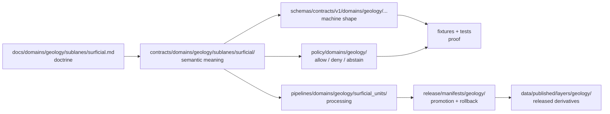

<!-- [KFM_META_BLOCK_V2]
doc_id: kfm://doc/contracts-domains-geology-sublanes-surficial-readme
title: Surficial Geology Contracts README
type: readme
version: v0.1
status: draft; PROPOSED; NEEDS VERIFICATION before promotion
owners:
  - OWNER_TBD — Geology domain steward
  - OWNER_TBD — Surficial geology steward
  - OWNER_TBD — Contract steward
  - OWNER_TBD — Source steward
  - OWNER_TBD — Schema steward
  - OWNER_TBD — Policy steward
  - OWNER_TBD — Validation steward
  - OWNER_TBD — Release steward
  - OWNER_TBD — Docs steward
created: 2026-06-21
updated: 2026-06-21
policy_label: public-with-gates; semantic-contracts; geology; surficial; release-gated; source-role-aware
tags: [kfm, contracts, geology, surficial, surficial-units, quaternary, unconsolidated-cover, map-units, boundary-version, evidence, source-role, policy, release, rollback]
related:
  - ../../README.md
  - ../../../../../docs/domains/geology/CANONICAL_PATHS.md
  - ../../../../../docs/domains/geology/SCOPE.md
  - ../../../../../docs/domains/geology/sublanes/surficial.md
  - ../../../../../pipelines/domains/geology/surficial_units/README.md
  - ../../../../../schemas/contracts/v1/domains/geology/
  - ../../../../../policy/domains/geology/
  - ../../../../../policy/sensitivity/geology/
  - ../../../../../fixtures/domains/geology/
  - ../../../../../tests/domains/geology/
  - ../../../../../data/registry/sources/geology/
  - ../../../../../release/manifests/geology/
notes:
  - "This README fills a previously blank repo file at contracts/domains/geology/sublanes/surficial/README.md."
  - "The target path is CONFIRMED present in the repo, but the broader sublanes/ convention is still PROPOSED / NEEDS VERIFICATION in the Geology doctrine."
  - "This directory is for semantic contract documentation only; schemas, policy, fixtures, tests, lifecycle data, pipelines, source registry records, and release decisions live under their own responsibility roots."
  - "Surficial geology contracts must not collapse into soil map units, bedrock units, hydrology measurements, hazards risk, archaeology-site truth, public map products, or AI-generated summaries."
[/KFM_META_BLOCK_V2] -->

<a id="top"></a>

# Surficial Geology Contracts

> Semantic-contract home for the Geology surficial sublane: `SurficialUnit`, surficial fractions of `GeologyBoundaryVersion`, and related meaning documents for Quaternary / unconsolidated near-surface geologic map-unit claims.

<p>
  
  
  
  
  
  
  
</p>

**Status:** Draft / PROPOSED sublane contract README  
**Path:** `contracts/domains/geology/sublanes/surficial/README.md`  
**Responsibility root:** `contracts/` — semantic object meaning, not machine validation  
**Domain lane:** Geology and Natural Resources  
**Sublane:** Surficial geology / Quaternary and unconsolidated cover  
**Repo evidence:** this README path is present in the repo; sibling contract files, schemas, validators, fixtures, policies, releases, and runtime behavior remain **NEEDS VERIFICATION** unless separately inspected  
**Placement caution:** the `sublanes/` segment is documented as **PROPOSED / NEEDS VERIFICATION** in the surficial doctrine; this README should not be treated as an ADR resolving that convention

---

## Quick jump

- [1. Purpose](#1-purpose)
- [2. Repo fit](#2-repo-fit)
- [3. Accepted inputs](#3-accepted-inputs)
- [4. Exclusions](#4-exclusions)
- [5. Contract boundary](#5-contract-boundary)
- [6. Surficial anti-collapse rules](#6-surficial-anti-collapse-rules)
- [7. Expected semantic object families](#7-expected-semantic-object-families)
- [8. Directory contract](#8-directory-contract)
- [9. Lifecycle and publication posture](#9-lifecycle-and-publication-posture)
- [10. Validation and proof backlog](#10-validation-and-proof-backlog)
- [11. Rollback](#11-rollback)
- [12. Open questions](#12-open-questions)
- [13. Maintainer checklist](#13-maintainer-checklist)

---

## 1. Purpose

This directory orients semantic contracts for **surficial geology** inside the Geology lane.

A file here should define the meaning of a surficial geology object or relationship, such as a map unit, boundary version, source-bound unit label, Quaternary/unconsolidated cover claim, or public-safe derivative contract. Contract Markdown explains **what a claim means** and which evidence, source-role, temporal, spatial, sensitivity, release, correction, and rollback rules must follow it.

It does not validate machine shape, fetch source data, execute pipelines, store lifecycle data, approve publication, or render maps.

> [!IMPORTANT]
> Surficial geology is evidence-bound context. A surficial polygon is not a soil map unit, not a bedrock unit, not an aquifer measurement, not a hazards risk rating, not archaeology-site truth, and not public release approval.

[Back to top](#top)

---

## 2. Repo fit

This README sits inside the `contracts/` responsibility root. That matters more than the topic name.

| Layer | Path / root | Owns | Status |
|---|---|---|---|
| Human-facing doctrine | `docs/domains/geology/sublanes/surficial.md` | Surficial sublane doctrine, source families, object-family narrative, lifecycle posture | CONFIRMED present |
| Semantic contracts | `contracts/domains/geology/sublanes/surficial/` | Meaning of surficial contract objects | This README path CONFIRMED; child contracts NEEDS VERIFICATION |
| Machine schemas | `schemas/contracts/v1/domains/geology/…` | JSON Schema / machine-checkable shape | PROPOSED / NEEDS VERIFICATION |
| Policy | `policy/domains/geology/`, `policy/sensitivity/geology/` | Allow, deny, restrict, abstain, sensitivity, release decisions | NEEDS VERIFICATION |
| Fixtures | `fixtures/domains/geology/…` | Valid, invalid, edge, quarantine, and public-safe examples | NEEDS VERIFICATION |
| Tests | `tests/domains/geology/…` | Enforceability proof for validators, policy, release gates, rollback | NEEDS VERIFICATION |
| Pipeline logic | `pipelines/domains/geology/surficial_units/` | Executable processing / handoff logic | CONFIRMED README present; behavior NEEDS VERIFICATION |
| Source registry | `data/registry/sources/geology/` | Source descriptors, rights, cadence, authority limits | NEEDS VERIFICATION |
| Published layers | `data/published/layers/geology/…` | Released public-safe artifacts only | NEEDS VERIFICATION |
| Release | `release/candidates/geology/`, `release/manifests/geology/` | Promotion decisions, manifests, rollback targets | NEEDS VERIFICATION |



[Back to top](#top)

---

## 3. Accepted inputs

Files belong here when their primary job is to define **semantic meaning** for surficial geology contract objects.

Accepted inputs include Markdown contracts for:

- `SurficialUnit` meaning and claim boundaries;
- source map-unit labels, map-unit symbols, unit descriptions, and source-native surficial categories;
- surficial portions of `GeologyBoundaryVersion` and boundary-version lineage;
- Quaternary alluvium, terrace deposits, eolian deposits, loess, colluvium, residuum, glacial materials where applicable, and other unconsolidated or semi-consolidated near-surface units;
- surficial lithology references when the contract clearly references shared Geology lithology instead of duplicating it;
- advisory parent-material context for Soil without owning Soil truth;
- advisory hydrostratigraphic context for Hydrology without owning measurement truth;
- public-safe derivative semantics for generalized surficial map-unit layers;
- correction, supersession, rollback, and release-candidate semantics that are specific to surficial objects.

[Back to top](#top)

---

## 4. Exclusions

Do **not** put these here:

| Do not place here | Correct responsibility root | Why |
|---|---|---|
| JSON schemas | `schemas/contracts/v1/domains/geology/…` | Machine shape belongs in schemas, not contracts. |
| Policy decisions or sensitivity rules | `policy/domains/geology/`, `policy/sensitivity/geology/` | Policy owns allow/deny/restrict/abstain behavior. |
| Validators or tests | `tests/`, `tools/validators/`, or accepted validator homes | Proof belongs in tests/tools, not semantic contract Markdown. |
| Example data / fixtures | `fixtures/domains/geology/…` | Examples must be testable and separable from meaning docs. |
| Source fetchers | `connectors/<source_id>/` | Connectors are source-specific, not domain-owned folders. |
| Source profiles / source descriptors | `docs/sources/catalog/…`, `data/registry/sources/geology/…` | Source authority, rights, and cadence are source-governance concerns. |
| Pipeline logic | `pipelines/domains/geology/surficial_units/` | Executable processing belongs in pipelines. |
| Lifecycle data | `data/raw`, `data/work`, `data/quarantine`, `data/processed`, `data/catalog`, `data/triplets`, `data/published` | Data lifecycle phases remain separate from contracts. |
| Release decisions | `release/candidates/geology/`, `release/manifests/geology/` | Publication is a governed transition, not contract-file presence. |
| Public UI or map payloads | governed API/UI/layer roots | Public clients consume released derivatives only. |

[Back to top](#top)

---

## 5. Contract boundary

A surficial contract should define meaning, not implementation.

| Contract may define | Contract must not claim unless separately verified |
|---|---|
| Object meaning and allowed claim scope | Schema enforcement exists |
| Source-role expectations | Source activation is approved |
| Evidence and citation requirements | EvidenceBundle resolution is implemented |
| Temporal support expectations | Runtime temporal validation exists |
| Spatial support expectations | Topology/CRS validators exist |
| Sensitivity and release gates | Policy engine is wired |
| Public-safe derivative requirements | Public layer has been released |
| Correction and rollback expectations | Rollback automation exists |

> [!CAUTION]
> A contract can say what must be true before publication. It cannot make the publication true by existing.

[Back to top](#top)

---

## 6. Surficial anti-collapse rules

The surficial sublane exists because Geology must keep nearby concepts distinct.

Disallowed collapses:

```text
surficial polygon -> soil mapunit
surficial unit -> bedrock unit
surficial parent-material context -> Soil canonical truth
surficial hydrostratigraphic context -> Hydrology measurement
surficial slope/terrain clue -> Hazards risk rating
Quaternary context -> archaeology-site truth
source map-unit symbol -> public-safe layer without transform/release proof
pipeline candidate -> catalog truth
catalog/triplet projection -> release approval
AI summary -> EvidenceBundle
```

Required distinctions:

- source identity, source role, source vintage, map scale, map-unit symbol, unit label, age, lithology text, geometry lineage, CRS, rights, and temporal support remain explicit;
- source / observed / valid / retrieval / release / correction times remain distinct where material;
- generalized, simplified, tiled, or public-safe geometry carries transform and release evidence;
- cross-lane edges preserve ownership: Soil owns soil objects, Hydrology owns measurements, Hazards owns risk, Archaeology owns site truth;
- public clients use released derivatives and governed interfaces, not RAW/WORK/QUARANTINE or internal stores.

[Back to top](#top)

---

## 7. Expected semantic object families

The surficial doctrine identifies these object families as relevant to the sublane. The table below is a README-level orientation, not a claim that each child contract currently exists.

| Object family | Contract role in this directory | Default posture |
|---|---|---|
| `SurficialUnit` | Primary meaning contract for surficial map units and source-bound near-surface geologic bodies. | PROPOSED / NEEDS VERIFICATION until child contract and schema exist. |
| `GeologyBoundaryVersion` *(surficial fraction)* | Versioned boundary snapshot semantics for surficial polygons. | Shared Geology object; local contract should reference, not fork, the family. |
| `Lithology` *(surficial reference)* | Material/composition reference for surficial units. | Shared Geology vocabulary; avoid duplication. |
| `HydrostratigraphicUnit` *(surficial portion)* | Advisory bridge to Hydrology for aquifer context. | Context only; Hydrology owns measurements. |
| `BoreholeReference` *(surficial intersection)* | Reference to logs/boreholes constraining surficial thickness/contacts. | Referenced only; borehole/well-log facet owns the record. |
| public-safe surficial derivative | Meaning contract for released generalized map-unit features, when adopted. | Requires evidence, policy, transform receipt, release manifest, correction path, rollback. |

[Back to top](#top)

---

## 8. Directory contract

Current file presence is confirmed for this README. Child file presence is **NEEDS VERIFICATION**.

Recommended future contents, if accepted by ADR/schema work:

```text
contracts/domains/geology/sublanes/surficial/
├── README.md                         # this orientation file
├── surficial_unit.md                 # PROPOSED semantic contract
├── surficial_boundary_version.md     # PROPOSED semantic contract or shared Geology reference
├── surficial_public_derivative.md    # PROPOSED released/public-safe derivative contract
├── surficial_source_unit_label.md    # PROPOSED source-native unit-label preservation contract
└── OPEN_QUESTIONS.md                 # PROPOSED local backlog, only if not duplicated elsewhere
```

> [!WARNING]
> Do not create new contract, schema, policy, source, registry, release, or proof homes just because this README lists a candidate. Use the responsibility root, existing repo evidence, and ADR path before promoting a new file family.

[Back to top](#top)

---

## 9. Lifecycle and publication posture

Surficial contract objects follow the KFM lifecycle membrane:

```text
RAW -> WORK / QUARANTINE -> PROCESSED -> CATALOG / TRIPLET -> PUBLISHED
```

| Phase | Surficial contract expectation |
|---|---|
| RAW | Source-native maps, symbols, labels, geometries, legends, metadata, scale, source vintage, and rights remain source-bound. |
| WORK / QUARANTINE | Candidate units are normalized, source-role checked, geometry/CRS checked, evidence-linked, rights/sensitivity-screened, and quarantined on ambiguity or drift. |
| PROCESSED | Reviewed records receive deterministic identity, source-role posture, boundary-version support, temporal support, evidence refs, quality flags, and correction posture. |
| CATALOG / TRIPLET | Claims may be projected only with evidence, source role, time, geometry lineage, and caveats preserved. |
| RELEASE CANDIDATE | Public derivatives require validation, policy outcome, transform receipt where geometry is generalized, release review, correction path, and rollback target. |
| PUBLISHED | Only released public-safe surficial artifacts are exposed to public clients. |
| CORRECTION | Source update, boundary-version change, geometry repair, rights change, sensitivity update, stale state, or transform bug triggers correction and possible rollback. |

[Back to top](#top)

---

## 10. Validation and proof backlog

Before any contract in this directory is promoted beyond draft, maintainers should add or verify:

- [ ] child semantic contracts for the adopted surficial object families;
- [ ] paired schemas under the accepted `schemas/contracts/v1/domains/geology/...` home;
- [ ] valid fixtures for alluvium, terrace, eolian/loess, colluvium, residuum, glacial material where applicable, and public-safe generalized derivative cases;
- [ ] invalid fixtures for missing source descriptor, missing map-unit key, invalid CRS, source-role collapse, bedrock/soil/hydrology/hazard collapse, rights uncertainty, missing transform receipt, missing release manifest, and missing rollback target;
- [ ] validators for deterministic identity, map-unit symbol preservation, boundary-version lineage, age/lithology support, CRS/topology, source role, evidence refs, policy refs, release refs, and correction lineage;
- [ ] policy tests for sensitive joins, private-well/subsurface exposure, archaeology adjacency, land/title leakage, and public-map claims;
- [ ] release tests proving public layers cannot read RAW, WORK, QUARANTINE, restricted, or direct pipeline output;
- [ ] rollback drills for source revision, geometry repair, source withdrawal, generalization bug, and stale public layer.

Recommended finite outcomes:

| Condition | Outcome |
|---|---|
| Evidence resolves, source role is clear, validation passes, policy allows, release exists | `ANSWER` / public-safe claim may be shown |
| Evidence missing, source role ambiguous, geometry invalid, rights unclear, or cross-lane ownership unresolved | `ABSTAIN` |
| Sensitive exposure, direct RAW/WORK/QUARANTINE access, rights denial, or public-risk overreach | `DENY` |
| Schema, validator, source-read, transform, or release-runtime failure | `ERROR` |

[Back to top](#top)

---

## 11. Rollback

Rollback is required when a released or review-authorized surficial claim weakens source integrity, leaks sensitive context, misstates source role, collapses adjacent-lane truth, violates rights, or depends on superseded boundaries.

Rollback triggers include:

- KGS/USGS/source map update, withdrawal, or changed rights;
- `GeologyBoundaryVersion` supersession or geometry repair;
- public derivative produced from unreleased or quarantined source;
- source map unit collapsed into soil mapunit, bedrock unit, hydrology measurement, hazards risk, or archaeology truth;
- public layer lacks transform receipt, release manifest, correction path, or rollback target;
- geometry simplification/generalization bug;
- private well, restricted source, sensitive subsurface, land/title, or archaeology-adjacent exposure;
- AI or map UI presents an uncited surficial interpretation as authoritative truth.

Rollback artifacts should identify affected surficial-unit IDs, boundary-version IDs, source records, map-unit keys, geometry refs, public derivative IDs, release IDs, layer/API/UI IDs, evidence refs, policy decisions, transform receipts, correction notices, rollback cards, replacement derivatives, and suppression/rebuild instructions.

[Back to top](#top)

---

## 12. Open questions

| Question | Status | Resolution path |
|---|---|---|
| Is `contracts/domains/geology/sublanes/surficial/` an accepted long-term home or only a provisional sublane layout? | NEEDS VERIFICATION | ADR or Directory Rules update. |
| What exact child contract names should be adopted for `SurficialUnit` and boundary-version semantics? | PROPOSED / NEEDS VERIFICATION | Schema/contract steward review. |
| Should public-safe surficial derivatives be their own contract or a release projection of `SurficialUnit`? | PROPOSED / NEEDS VERIFICATION | Release and schema review. |
| Which source families are approved for activation, and what rights/cadence constraints apply? | NEEDS VERIFICATION | Source registry and source-steward review. |
| How should GeMS/NGMDB conventions map into KFM contract fields without turning an exchange schema into KFM truth? | NEEDS VERIFICATION | Schema fixtures and source-role matrix. |
| What geometry precision/generalization thresholds are acceptable for public surficial layers? | NEEDS VERIFICATION | Policy, redaction/transform, and release fixtures. |

[Back to top](#top)

---

## 13. Maintainer checklist

- [ ] Confirm this README against `docs/domains/geology/CANONICAL_PATHS.md` and `docs/domains/geology/sublanes/surficial.md`.
- [ ] Resolve the `sublanes/` path convention with an ADR or Directory Rules update.
- [ ] Add or verify child contracts only after the object-family names are stable.
- [ ] Add paired schemas, fixtures, validators, and policy tests before any public output depends on these contracts.
- [ ] Confirm source descriptors and rights/cadence for KGS, KGS surficial maps, USGS NGMDB/GeMS, 3DEP/terrain, and related source families before activation.
- [ ] Confirm public API/UI/map surfaces label source role, source vintage, boundary version, geometry precision, and uncertainty clearly.
- [ ] Confirm every public derivative has evidence closure, policy decision, release manifest, correction path, and rollback target.
- [ ] Record any contract/schema/path/source-role conflict in `docs/registers/DRIFT_REGISTER.md`.

[Back to top](#top)
