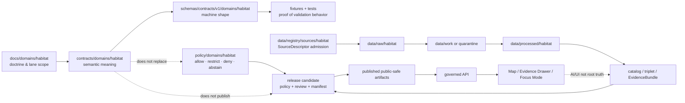

<!-- [KFM_META_BLOCK_V2]
doc_id: kfm://doc/contracts-domains-habitat-readme
title: Habitat Contracts README
type: readme
version: v0.2
status: draft; PROPOSED; NEEDS VERIFICATION before promotion
owners:
  - OWNER_TBD — Habitat domain steward
  - OWNER_TBD — Contract steward
  - OWNER_TBD — Source steward
  - OWNER_TBD — Policy steward
  - OWNER_TBD — Release steward
  - OWNER_TBD — Docs steward
created: 2026-06-21
updated: 2026-06-21
policy_label: public-with-gates; readme; semantic-contracts; habitat; evidence-bound; source-role-aware; release-gated; trust-membrane
tags: [kfm, contracts, habitat, README, semantic-contracts, land-cover, ecoregions, habitat-patch, suitability, connectivity, restoration, stewardship, evidence, source-role, policy, release, rollback]
related:
  - ../../../docs/domains/habitat/README.md
  - ../../../docs/domains/habitat/SOURCE_FAMILIES.md
  - ../../../docs/domains/habitat/sublanes/land_cover.md
  - ../../../docs/domains/habitat/sublanes/ecoregions.md
  - ./ecoregions/README.md
  - ./land_cover/observation.md
  - ./land_cover/class_scheme.md
  - ./land_cover/crosswalk.md
  - ./land_cover/change_summary.md
  - ./land_cover/model_run_receipt.md
  - ./land_cover/uncertainty.md
  - ../../../schemas/contracts/v1/domains/habitat/
  - ../../../policy/domains/habitat/
  - ../../../fixtures/domains/habitat/
  - ../../../tests/domains/habitat/
  - ../../../pipelines/domains/habitat/
  - ../../../pipeline_specs/habitat/
  - ../../../data/registry/sources/habitat/
  - ../../../release/manifests/habitat/
notes:
  - "Expanded from a greenfield scaffold into the parent Habitat contracts README."
  - "Corrects the scaffold's overbroad wording that suggested docs, schemas, policies, fixtures, tests, packages, pipelines, registries, or lifecycle data could belong under contracts/. Under KFM responsibility-root doctrine, this directory is for semantic-contract Markdown only."
  - "Child contract folders currently documented in this session include land_cover/ and ecoregions/. Other Habitat object families remain PROPOSED until their files/schemas are inspected or created."
  - "This README orients contract meaning. It is not a schema, validator, policy decision, source registry, lifecycle store, public layer, release manifest, or AI/UI surface."
[/KFM_META_BLOCK_V2] -->

<a id="top"></a>

# Habitat Contracts

> Parent semantic-contract home for Habitat object meanings: land-cover observations, ecoregion context, habitat patches, suitability, connectivity, corridors, restoration opportunity, stewardship zones, model-run receipts, uncertainty, evidence posture, correction, and rollback.

<p>
  
  
  
  
  
  
</p>

**Path:** `contracts/domains/habitat/README.md`  
**Status:** `draft` / `PROPOSED` / `NEEDS VERIFICATION before promotion`  
**Owners:** `OWNER_TBD — Habitat steward · Contract steward · Source/Policy/Release stewards`  
**Authority:** semantic contract orientation only. Machine shape, policy, fixtures, tests, pipelines, source registries, lifecycle data, and release decisions live in their own responsibility roots.

## Quick jumps

[Scope](#scope) · [Repo fit](#repo-fit) · [Accepted inputs](#accepted-inputs) · [Exclusions](#exclusions) · [Directory map](#directory-map) · [Current contract surface](#current-contract-surface) · [Habitat boundaries](#habitat-boundaries) · [Trust flow](#trust-flow) · [Source-role rules](#source-role-rules) · [Sensitivity and release](#sensitivity-and-release) · [Validation](#validation) · [Rollback](#rollback) · [Open questions](#open-questions)

---

## Scope

`contracts/domains/habitat/` is the Habitat lane's semantic-contract segment. It defines what Habitat objects **mean** before schemas, validators, pipelines, catalogs, triplets, public layers, Focus Mode, or AI summaries can use them.

Habitat models landscape context and habitat relationships. It owns landscape-facing objects such as habitat patches, land-cover observations, ecological systems, suitability models, connectivity/corridor outputs, restoration opportunities, stewardship zones, model-run receipts, and uncertainty surfaces. It does **not** own species occurrence truth, plant occurrence truth, hydrology measurements, soil horizons, hazards risk, agriculture crop truth, land/title claims, or release authority.

> [!IMPORTANT]
> **Contracts describe meaning.** They do not activate sources, validate schemas, run pipelines, publish layers, approve policy, expose public UI, or answer as AI. Every public or semi-public Habitat claim must still pass evidence, source role, rights, sensitivity, validation, policy, review, release, correction, and rollback gates.

---

## Repo fit

The Habitat lane appears as a domain segment under each KFM responsibility root. This file governs only the `contracts/` segment.

| Responsibility | Correct home | Status in this README |
|---|---|---|
| Habitat human-facing doctrine | `../../../docs/domains/habitat/` | Related evidence source |
| Habitat semantic contracts | `./` | **This root** |
| Habitat machine schemas | `../../../schemas/contracts/v1/domains/habitat/` | Separate root; not owned here |
| Habitat policy and sensitivity decisions | `../../../policy/domains/habitat/`, `../../../policy/sensitivity/habitat/` | Separate root; not owned here |
| Habitat fixtures and tests | `../../../fixtures/domains/habitat/`, `../../../tests/domains/habitat/` | Separate roots; not owned here |
| Habitat executable logic | `../../../pipelines/domains/habitat/`, `../../../packages/domains/habitat/` | Separate roots; not owned here |
| Habitat declarative pipeline specs | `../../../pipeline_specs/habitat/` | Separate root; not owned here |
| Source descriptors | `../../../data/registry/sources/habitat/` | Separate source authority; not owned here |
| Lifecycle data | `../../../data/raw/`, `../../../data/work/`, `../../../data/quarantine/`, `../../../data/processed/`, `../../../data/catalog/`, `../../../data/published/` | Separate lifecycle roots; not owned here |
| Release/correction/rollback | `../../../release/` | Separate release authority; not owned here |

> [!CAUTION]
> The previous scaffold said “docs, contracts, schemas, policies, fixtures, tests, packages, pipelines, registries, or data lifecycle artifacts” could belong here. That wording is corrected here: those artifacts belong in their responsibility roots, not under `contracts/domains/habitat/`.

---

## Accepted inputs

Place files here when the file's primary job is to define **Habitat semantic contract meaning**.

Accepted material includes:

- object-family contract Markdown;
- sublane contract README files;
- domain-specific semantic support contracts;
- object identity, evidence, lifecycle, release, correction, and rollback semantics;
- review vocabulary for Habitat contract authors;
- anti-collapse rules that prevent Habitat outputs from becoming Fauna, Flora, Hydrology, Soil, Hazards, Agriculture, People/Land, release, or AI truth.

A contract under this root should normally identify:

- what the object means;
- what it does not mean;
- source-role boundaries;
- evidence and EvidenceBundle expectations;
- temporal scope, including source / observed / valid / retrieval / release / correction times where material;
- sensitivity, rights, and public-safety posture;
- schema posture and validation expectations;
- release, correction, and rollback requirements.

---

## Exclusions

Do not put these materials under `contracts/domains/habitat/`.

| Do not place here | Correct home | Why |
|---|---|---|
| JSON Schema files | `../../../schemas/contracts/v1/domains/habitat/` | Schemas own machine shape. |
| Policy rules or decisions | `../../../policy/domains/habitat/`, `../../../policy/sensitivity/habitat/` | Policy owns allow/restrict/deny/abstain. |
| SourceDescriptor records | `../../../data/registry/sources/habitat/` | Source identity, rights, cadence, and authority belong to the source registry. |
| RAW/WORK/QUARANTINE/PROCESSED data | `../../../data/raw/`, `../../../data/work/`, `../../../data/quarantine/`, `../../../data/processed/` | Lifecycle data never belongs in contracts. |
| Catalog/triplet/EvidenceBundle records | `../../../data/catalog/`, accepted proof/catalog homes | Contracts may require evidence closure; they do not store it. |
| Public layer artifacts | `../../../data/published/layers/habitat/` after release | Render artifacts are downstream carriers. |
| Executable pipeline code | `../../../pipelines/domains/habitat/`, `../../../packages/domains/habitat/` | Code executes; contracts define meaning. |
| Declarative pipeline specs | `../../../pipeline_specs/habitat/` | Specs configure execution; contracts define object semantics. |
| Fixtures and tests | `../../../fixtures/domains/habitat/`, `../../../tests/domains/habitat/` | Fixtures/tests prove behavior elsewhere. |
| Release manifests, correction notices, rollback cards | `../../../release/` | Publication is a governed state transition, not a contract file. |
| Fauna/Flora occurrence truth | `../../../contracts/domains/fauna/`, `../../../contracts/domains/flora/` | Habitat can join context; it does not own occurrence truth. |
| Hydrology, Soil, Hazards, Agriculture, Land/title truth | Corresponding domain contract roots | Habitat consumes context through governed joins only. |

---

## Directory map

```text
contracts/domains/habitat/
├── README.md                         # this parent contract README
├── ecoregions/
│   └── README.md                     # regionalization-context contract directory
└── land_cover/
    ├── observation.md                # LandCoverObservation semantics
    ├── class_scheme.md               # ClassSchemeProfile semantics
    ├── crosswalk.md                  # CoverClassCrosswalk semantics
    ├── change_summary.md             # LandCoverChangeSummary semantics
    ├── model_run_receipt.md          # ModelRunReceipt semantics
    └── uncertainty.md                # UncertaintySurface semantics
```

The tree above reflects files verified or created in this session. Future Habitat contract files remain **PROPOSED** until created, schema-linked, reviewed, and validated.

---

## Current contract surface

| Area | Contract file | Meaning | Verification posture |
|---|---|---|---|
| Parent lane | `README.md` | Orientation for Habitat semantic-contract root. | Updated here; schema/policy/test coverage still separate. |
| Ecoregions | `ecoregions/README.md` | Ecoregion/regionalization context, not occurrence truth. | Directory README exists; child contracts still PROPOSED. |
| Land cover | `land_cover/observation.md` | `LandCoverObservation` evidence object. | Schema scaffold; field enforcement NEEDS VERIFICATION. |
| Land cover | `land_cover/class_scheme.md` | `ClassSchemeProfile` / versioned classification scheme. | Schema scaffold; naming NEEDS VERIFICATION. |
| Land cover | `land_cover/crosswalk.md` | `CoverClassCrosswalk` reviewed mapping between schemes. | Schema scaffold; no silent recode. |
| Land cover | `land_cover/change_summary.md` | `LandCoverChangeSummary` public-safe derived summary. | Schema scaffold; threshold policy NEEDS VERIFICATION. |
| Land cover | `land_cover/model_run_receipt.md` | `ModelRunReceipt` process receipt for modeled/derived outputs. | Expected schema not found in prior inspection; NEEDS VERIFICATION. |
| Land cover | `land_cover/uncertainty.md` | `UncertaintySurface` accuracy/footprint/source-vintage/crosswalk uncertainty. | Schema scaffold; field enforcement NEEDS VERIFICATION. |

---

## Habitat boundaries

Habitat has strong anti-collapse rules because many Habitat products look persuasive on a map.

| Boundary | Rule |
|---|---|
| Habitat ↔ Fauna | Habitat may cite public-safe occurrence context, but Fauna owns animal occurrence truth. |
| Habitat ↔ Flora | Habitat may cite vegetation/rare-plant context, but Flora owns plant taxon/specimen/rare-record truth. |
| Habitat ↔ Hydrology/Soil | Habitat consumes water/substrate context; Hydrology and Soil own their source truth. |
| Habitat ↔ Hazards | Habitat can support resilience/stress context; Hazards owns risk, alerts, and life-safety framing. |
| Habitat ↔ Agriculture | CDL and crop rotation are Agriculture-owned adjacency/context, not Habitat cover by convenience. |
| Habitat ↔ Spatial Foundation | CRS/generalization/basemap/tiling support lives in spatial roots; Habitat owns domain meaning. |
| Habitat ↔ Release | ReleaseManifest/PromotionDecision owns publication; contracts do not publish. |
| Habitat ↔ AI/UI | AI and UI can summarize released evidence, but cannot create source truth, policy, review, or release state. |

> [!WARNING]
> A modeled suitability surface is not a regulatory critical-habitat designation. A land-cover class is not a species occurrence. A public tile is not an EvidenceBundle. Any public surface that collapses these meanings should `DENY`, `ABSTAIN`, or return `ERROR` instead of producing an authoritative claim.

---

## Trust flow



---

## Source-role rules

Habitat contracts must preserve source-role identity. Source role is set at source admission and preserved through transforms, joins, summaries, and release.

| Source role | Habitat examples | Forbidden collapse |
|---|---|---|
| `observed` | NLCD land-cover observation, field survey, source observation product. | Do not relabel as regulatory or modeled. |
| `regulatory` | USFWS critical-habitat designation where source/admission supports it. | Do not relabel as observed land cover or modeled suitability. |
| `modeled` | GAP/LANDFIRE modeled products, suitability surfaces, corridor resistance surfaces. | Do not relabel as observed or regulatory. |
| `aggregate` | County summary, NatureServe-style summary, public-safe rollup. | Do not treat as per-place evidence. |
| `administrative` | PAD-US stewardship context or management boundary. | Do not collapse with ecological observation. |
| `candidate` | Unreviewed connector output, watcher proposal, model candidate. | No PUBLISHED edge. |
| `synthetic` | AI-generated note, reconstructed scene, simulated surface. | Must not be presented as observed reality. |

---

## Sensitivity and release

Habitat is often public-context data until it joins to sensitive occurrence, rare-plant, stewardship-sensitive, private-land, or protected-resource context. Those joins can raise the policy tier sharply.

Rules:

- Sensitive joins fail closed until geoprivacy/redaction, policy, review, release, correction, and rollback support exist.
- Public layer artifacts must be generated only from released public-safe derivatives.
- Exact sensitive geometry must be generalized, redacted, restricted, delayed, or denied before publication.
- Style filters are not sensitivity controls.
- Generated text cannot fill missing EvidenceBundle, PolicyDecision, ReviewRecord, ReleaseManifest, or RollbackCard fields.
- Public clients use governed APIs and released artifacts, not RAW/WORK/QUARANTINE/candidate stores.

---

## Validation

Before this parent contracts README is promoted beyond draft:

- [ ] Update this file whenever new Habitat semantic contract files are added or renamed.
- [ ] Confirm owner records or CODEOWNERS for Habitat contract files.
- [ ] Confirm paired schema files for every active Habitat contract.
- [ ] Confirm schema naming for `LandCoverObservation`, `ClassSchemeProfile`, `CoverClassCrosswalk`, `LandCoverChangeSummary`, `ModelRunReceipt`, and `UncertaintySurface`.
- [ ] Add fixtures and validators for object-family anti-collapse cases.
- [ ] Confirm `policy/domains/habitat/` and `policy/sensitivity/habitat/` behavior before any public release claims.
- [ ] Confirm release manifests, correction paths, and rollback cards exist before public UI/API use.
- [ ] Keep parent `docs/domains/habitat/README.md` and this contracts README aligned without duplicating authority.

Recommended finite outcomes:

| Condition | Outcome |
|---|---|
| Contract meaning, schema shape, source role, evidence, policy, review, release, and rollback all resolve | `ANSWER` / contract-backed public-safe claim may proceed through governed interfaces |
| Evidence, source role, schema, rights, sensitivity, release, or rollback support is incomplete | `ABSTAIN` / `HOLD` |
| Source-role collapse, sensitive leak, raw/candidate public path, or release bypass would occur | `DENY` |
| Schema, validator, source read, evidence lookup, policy lookup, release lookup, or artifact lookup fails | `ERROR` |

---

## Rollback

Rollback is required when a Habitat contract change weakens source integrity, creates schema/contract authority conflict, collapses object-family meaning, bypasses policy gates, or makes unsupported public claims appear authoritative.

Rollback triggers include:

- a contract is renamed without updating schema pointers and related docs;
- a contract claims schema/test/policy/release enforcement that is not verified;
- a child contract lets Habitat absorb Fauna, Flora, Hydrology, Soil, Hazards, Agriculture, or title truth;
- a land-cover contract allows silent class-scheme recode or modeled-as-observed output;
- ecoregion context is treated as species occurrence, patch quality, critical-habitat, or release truth;
- public API/UI/AI reads RAW/WORK/QUARANTINE/candidate Habitat records as public truth;
- a release/correction/rollback path is omitted from public-surface semantics.

Rollback artifacts should include affected contract paths, schema refs, source descriptor refs, evidence refs, policy decisions, release refs, correction notices, rollback cards, replacement contract refs, and public-cache/style invalidation notes where any public artifact depended on the contract.

---

## Open questions

| Question | Status | Resolution path |
|---|---|---|
| Which Habitat object-family contracts beyond land-cover and ecoregions should be created next? | NEEDS VERIFICATION | Habitat steward + docs/domain README review. |
| Should Habitat sublane folders exist under `contracts/domains/habitat/` for patches, suitability, connectivity, restoration, stewardship, and critical habitat? | PROPOSED / NEEDS VERIFICATION | Directory Rules + current repo structure + ADR review. |
| Which contract names should be PascalCase versus snake_case under Habitat? | NEEDS VERIFICATION | Schema naming review and drift-register entry if mixed. |
| Which Habitat schema scaffolds should be expanded first? | NEEDS VERIFICATION | Schema PR and fixture priority review. |
| Which public layer descriptors should live under Habitat versus cross-cutting Map/UI roots? | NEEDS VERIFICATION | Map/UI contract review. |
| Which Habitat source descriptors and rights reviews are active? | NEEDS VERIFICATION | `data/registry/sources/habitat/` and source validator inspection. |

---

## Related docs

- [`../../../docs/domains/habitat/README.md`](../../../docs/domains/habitat/README.md) — parent Habitat doctrine README.
- [`../../../docs/domains/habitat/SOURCE_FAMILIES.md`](../../../docs/domains/habitat/SOURCE_FAMILIES.md) — Habitat source-family dossiers.
- [`../../../docs/domains/habitat/sublanes/land_cover.md`](../../../docs/domains/habitat/sublanes/land_cover.md) — land-cover sublane doctrine.
- [`../../../docs/domains/habitat/sublanes/ecoregions.md`](../../../docs/domains/habitat/sublanes/ecoregions.md) — ecoregions/regionalization doctrine.
- [`./ecoregions/README.md`](./ecoregions/README.md) — Habitat ecoregions contracts directory.
- [`./land_cover/observation.md`](./land_cover/observation.md) — LandCoverObservation contract.
- [`./land_cover/class_scheme.md`](./land_cover/class_scheme.md) — ClassSchemeProfile contract.
- [`./land_cover/crosswalk.md`](./land_cover/crosswalk.md) — CoverClassCrosswalk contract.
- [`./land_cover/change_summary.md`](./land_cover/change_summary.md) — LandCoverChangeSummary contract.
- [`./land_cover/model_run_receipt.md`](./land_cover/model_run_receipt.md) — ModelRunReceipt contract.
- [`./land_cover/uncertainty.md`](./land_cover/uncertainty.md) — UncertaintySurface contract.

[Back to top](#top)
