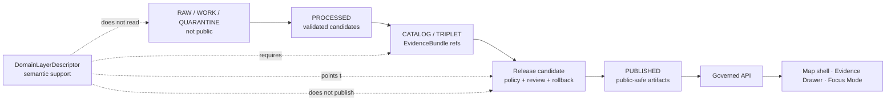

<!-- [KFM_META_BLOCK_V2]
doc_id: kfm://doc/contracts-domains-habitat-domain-layer-descriptor
title: Domain Layer Descriptor Contract — Habitat
type: semantic-contract
version: v0.2
status: draft; PROPOSED; NEEDS VERIFICATION before promotion
owners:
  - OWNER_TBD — Habitat domain steward
  - OWNER_TBD — Layer steward
  - OWNER_TBD — Contract steward
  - OWNER_TBD — Source steward
  - OWNER_TBD — Evidence steward
  - OWNER_TBD — Schema steward
  - OWNER_TBD — Policy steward
  - OWNER_TBD — Sensitivity reviewer
  - OWNER_TBD — Release steward
  - OWNER_TBD — Map/UI steward
  - OWNER_TBD — Docs steward
created: 2026-06-22
updated: 2026-06-22
policy_label: public-with-gates; semantic-contract; habitat; layer-descriptor; domain-layer; source-role-badges; evidence-bound; release-gated; public-safe-artifact-pointer
tags: [kfm, contracts, habitat, domain_layer_descriptor, DomainLayerDescriptor, layer-descriptor, LayerManifest, MapReleaseManifest, map-ui, EvidenceDrawer, FocusMode, public-safe-layer, source-role, sensitivity, geoprivacy, policy, release, correction, rollback]
related:
  - ./README.md
  - ./domain_feature_identity.md
  - ./SuitabilityModel.md
  - ./connectivity_edge.md
  - ./corridor.md
  - ./land_cover/observation.md
  - ./land_cover/uncertainty.md
  - ../../../docs/domains/habitat/README.md
  - ../../../docs/domains/habitat/MAP_UI_CONTRACTS.md
  - ../../../docs/domains/habitat/MODEL_VS_OBSERVATION.md
  - ../../../docs/domains/habitat/SOURCE_FAMILIES.md
  - ../../../schemas/contracts/v1/domains/habitat/domain_layer_descriptor.schema.json
  - ../../../policy/domains/habitat/
  - ../../../policy/sensitivity/habitat/
  - ../../../fixtures/domains/habitat/domain_layer_descriptor/
  - ../../../tests/domains/habitat/domain_layer_descriptor/
  - ../../../data/registry/sources/habitat/
  - ../../../data/published/layers/habitat/
  - ../../../release/manifests/habitat/
notes:
  - "Expanded from a greenfield scaffold at contracts/domains/habitat/domain_layer_descriptor.md."
  - "The paired schema exists at schemas/contracts/v1/domains/habitat/domain_layer_descriptor.schema.json, but it is still a PROPOSED scaffold that only defines spec_hash, id, and version, requires id, and allows additionalProperties=true; field-level enforcement remains NEEDS VERIFICATION."
  - "DomainLayerDescriptor describes Habitat-specific layer-support semantics and required pointers. It is not a LayerManifest, MapReleaseManifest, EvidenceBundle, PolicyDecision, ReleaseManifest, source registry, public tile, renderer style, or AI answer by itself."
  - "Public Habitat layer descriptors must point to released public-safe artifacts and carry source-role, evidence, policy, sensitivity, correction, stale-state, and rollback context."
[/KFM_META_BLOCK_V2] -->

# Domain Layer Descriptor — Habitat

> Semantic contract for Habitat `DomainLayerDescriptor`: the support object that describes how a Habitat object family may appear as a governed, released, public-safe map/API/UI layer without turning tiles, render styles, popups, graph projections, or AI text into source truth.

  
  
  
  
  
  
  

`contracts/domains/habitat/domain_layer_descriptor.md`

## Quick jumps

[Status](#status) · [Meaning](#meaning) · [Repo fit](#repo-fit) · [Schema posture](#schema-posture) · [Descriptor vs release objects](#descriptor-vs-release-objects) · [Assertions](#assertions) · [Exclusions](#exclusions) · [Recommended semantics](#recommended-semantics) · [Layer families](#layer-families) · [Trust membrane](#trust-membrane) · [Source-role display rules](#source-role-display-rules) · [Sensitivity and release](#sensitivity-and-release) · [Lifecycle](#lifecycle) · [Validation](#validation) · [Evidence basis](#evidence-basis) · [Rollback](#rollback) · [Open questions](#open-questions)

---

## Status

> [!IMPORTANT]
> **Status:** `draft` / semantic contract  
> **Contract path:** `contracts/domains/habitat/domain_layer_descriptor.md`  
> **Schema path:** `schemas/contracts/v1/domains/habitat/domain_layer_descriptor.schema.json`  
> **Schema posture:** paired schema exists, but is still a `PROPOSED` scaffold that defines only `spec_hash`, `id`, and `version`, requires only `id`, and allows `additionalProperties: true`.  
> **Truth posture:** Habitat map/UI doctrine defines public Habitat viewing products, source-role badges, governed API access, Evidence Drawer support, Focus Mode limits, sensitivity-redacted views, stale/correction state, and release gating. Field-level schema shape, fixtures, validators, policy runtime, release artifacts, MapLibre/UI implementation, Focus Mode adapter behavior, and CI/test coverage remain **NEEDS VERIFICATION**.

> [!CAUTION]
> `DomainLayerDescriptor` is a layer-support descriptor. It is **not** a `LayerManifest`, `MapReleaseManifest`, `ReleaseManifest`, `EvidenceBundle`, `PolicyDecision`, source registry record, data artifact, renderer style, popup, tile, or AI answer. It may describe what a public layer must carry, but it cannot publish or prove the layer by itself.

---

## Meaning

`DomainLayerDescriptor` records Habitat-specific metadata and guardrails for a layer candidate or released layer view.

It answers:

- Which Habitat object family or public-safe derivative does the layer expose?
- Which source role badge must the layer carry: observed, modeled, regulatory, derivative, aggregate, administrative, candidate, synthetic, or context?
- Which public-safe artifact, layer manifest, evidence bundle, policy decision, review state, release manifest, stale/correction state, and rollback target support the layer?
- Which sensitive geometry, occurrence-linked habitat, rare species, stewardship, or private-context detail has been generalized, redacted, withheld, delayed, restricted, or denied before tile/API exposure?
- Which UI behavior is required: Evidence Drawer link, Focus Mode finite outcome, uncertainty mode, time-aware state, source-vintage badge, trust badge, or public-safe-geometry notice?

A descriptor keeps layer meaning inspectable. It does not replace the underlying Habitat object, evidence, policy, release, or runtime envelope.

---

## Repo fit

| Responsibility | Path or root | This contract's role |
|---|---|---|
| Habitat layer semantics | `contracts/domains/habitat/domain_layer_descriptor.md` | Owned here |
| Machine schema shape | `schemas/contracts/v1/domains/habitat/domain_layer_descriptor.schema.json` | CONFIRMED scaffold; field shape not enforced |
| Habitat map/UI doctrine | `docs/domains/habitat/MAP_UI_CONTRACTS.md` | Defines viewing products, trust posture, Evidence Drawer, Focus Mode, finite outcomes, sensitivity, time, release, rollback visibility |
| Habitat lane doctrine | `docs/domains/habitat/README.md` | Defines object-family spine, lifecycle, sensitivity, cross-lane, map products, AI behavior |
| Parent contract root | `contracts/domains/habitat/README.md` | Confirms this root is semantic-contract Markdown only |
| Source registry | `data/registry/sources/habitat/` | Source identity, role, rights, cadence, activation |
| Published artifacts | `data/published/layers/habitat/` | Released public-safe artifacts; descriptor does not create them |
| Policy | `policy/domains/habitat/`, `policy/sensitivity/habitat/` | Allow/restrict/deny/abstain behavior and sensitivity posture |
| Release | `release/` / `release/manifests/habitat/` | Publication, correction, rollback authority; not owned here |
| Public clients | governed API / map shell roots | PROPOSED implementation details; this contract does not prove routes/components |

---

## Schema posture

| Schema fact | Current posture |
|---|---|
| Confirmed schema path | `schemas/contracts/v1/domains/habitat/domain_layer_descriptor.schema.json` |
| Schema status | `PROPOSED` |
| Schema title | `domain_layer_descriptor` |
| Visible properties | `spec_hash`, `id`, `version` |
| Required fields | `id` only |
| Additional properties | `true` |
| Field-level validation | NEEDS VERIFICATION |
| Contract pointer | `contracts/domains/habitat/domain_layer_descriptor.md` |
| Fixtures root pointer | `fixtures/domains/habitat/domain_layer_descriptor/` |
| Validator pointer | `tools/validators/domains/habitat/validate_domain_layer_descriptor.py` |
| Policy pointer | `policy/domains/habitat/` |

Until the schema expands and validators/fixtures are confirmed, this contract is semantic guidance and review vocabulary only.

---

## Descriptor vs release objects

| Object / artifact | What it owns | Relationship to `DomainLayerDescriptor` |
|---|---|---|
| `DomainLayerDescriptor` | Habitat-specific layer meaning, required pointers, display obligations, and anti-collapse posture. | This contract. |
| `LayerManifest` | Released layer metadata and artifact refs. | Descriptor may point to it; descriptor is not the manifest. |
| `MapReleaseManifest` | Map-level release bundle. | Required for public map loading. |
| `ReleaseManifest` / `PromotionDecision` | Publication authority. | Descriptor may cite it; descriptor does not publish. |
| `EvidenceBundle` | Evidence support for claims. | Descriptor requires links for consequential claims. |
| `PolicyDecision` | Allow/restrict/deny/abstain. | Descriptor must carry policy state where material. |
| `ReviewRecord` | Steward review. | Descriptor may cite review; it is not review approval. |
| Tile / vector layer / style | Delivery artifact and presentation. | Downstream carrier only. |
| Popup / Focus Mode / AI answer | Interpretive UI. | Must resolve released evidence and finite outcome. |

---

## Assertions

A reviewed `DomainLayerDescriptor` should semantically assert:

1. **Layer identity** — stable descriptor ID, layer key, object family, role, temporal scope, and digest basis.
2. **Backing object family** — HabitatPatch, LandCoverObservation, SuitabilityModel, ConnectivityEdge, Corridor, RestorationOpportunity, StewardshipZone, UncertaintySurface, or accepted derivative.
3. **Source-role badge** — observed, modeled, regulatory, derivative, aggregate, administrative, candidate, synthetic, or context display posture.
4. **Artifact refs** — released public-safe layer/table/tile/vector/raster artifact refs and digests.
5. **Evidence support** — EvidenceRef/EvidenceBundle refs required before consequential layer claims.
6. **Policy support** — PolicyDecision, sensitivity tier, geoprivacy/redaction/aggregation receipt refs where material.
7. **Release support** — LayerManifest, MapReleaseManifest, PromotionDecision/ReleaseManifest, stale/correction state, and rollback refs.
8. **UI obligations** — Evidence Drawer, Focus Mode outcome, trust badges, source-vintage badges, uncertainty mode, time-aware state, correction/stale markers, and public-safe-geometry caveats.
9. **Public-safe geometry** — exact geometry withheld, generalized, aggregated, redacted, delayed, restricted, or denied where needed.
10. **Anti-collapse posture** — the layer must not upgrade source role, hide uncertainty, bypass release, or turn rendering into truth.

---

## Exclusions

| Misuse | Why it is denied or abstained |
|---|---|
| Treating descriptor as release manifest | Release and map publication belong to release manifests and promotion decisions. |
| Treating descriptor as EvidenceBundle | EvidenceBundle carries proof support; descriptor only points to it. |
| Treating tile/style as truth | Tiles and styles are downstream carriers. |
| Treating popup as Evidence Drawer | Popups may summarize, but Evidence Drawer resolves evidence. |
| Treating modeled as regulatory | Suitability surfaces must stay modeled. |
| Treating habitat layer as occurrence truth | Fauna/Flora own occurrence truth. |
| Hiding sensitivity by style filter | Sensitive geometry must be transformed before tile/API release. |
| Showing candidate layer publicly | Candidate and WORK/QUARANTINE layers have no public edge. |
| Dropping stale/correction state | Public users must see correction/stale posture where material. |
| Letting AI infer missing evidence | AI must abstain or deny when evidence/policy/release is missing. |

---

## Recommended semantics

The following fields are **PROPOSED** targets for future schema expansion. They are not enforced by the current scaffold schema.

| Field | Meaning |
|---|---|
| `id` | Canonical KFM layer descriptor ID. |
| `version` | Contract/object version. |
| `spec_hash` | Normalized descriptor digest. |
| `domain` | Must resolve to `habitat`. |
| `object_family` | Habitat object family exposed by the layer. |
| `layer_key` | Stable layer key used by governed API/UI. |
| `layer_title` | Human-readable public-safe title. |
| `layer_role` | Source-role/display role: observed, modeled, regulatory, derivative, aggregate, administrative, candidate, synthetic, context. |
| `viewing_product` | Habitat patch map, suitability view, connectivity/corridor view, critical habitat view, uncertainty mode, redacted view, or accepted enum. |
| `source_descriptor_refs` | Source identity, role, rights, cadence, attribution, authority limits. |
| `backing_object_refs` | Habitat object refs behind the layer. |
| `artifact_refs` | Released public-safe artifact refs. |
| `artifact_digests` | Digests for public artifacts. |
| `layer_manifest_ref` | LayerManifest ref. |
| `map_release_manifest_ref` | MapReleaseManifest ref where map-loadable. |
| `release_ref` | ReleaseManifest or PromotionDecision ref. |
| `evidence_refs` | EvidenceRef links. |
| `evidence_bundle_refs` | EvidenceBundle refs behind layer claims. |
| `policy_decision_ref` | PolicyDecision where material. |
| `review_record_ref` | Steward review record. |
| `redaction_receipt_ref` | Required if sensitive detail is generalized/redacted. |
| `aggregation_receipt_ref` | Required if public output is aggregate-only. |
| `model_run_receipt_refs` | Required for model/derived layers where material. |
| `uncertainty_surface_refs` | Required for uncertainty-aware modeled/derived layers. |
| `source_time` | Source publication/assertion time for inputs. |
| `observed_time` | Observation/acquisition time where applicable. |
| `valid_time` | Valid interval for the layer claim. |
| `retrieval_time` | KFM retrieval/harvest time. |
| `release_time` | Public-safe release time. |
| `correction_time` | Correction/supersession time, if corrected. |
| `stale_state` | Current, stale, superseded, corrected, withdrawn, or accepted enum. |
| `public_geometry_role` | exact-public, generalized, aggregate-only, withheld, denied, or accepted enum. |
| `ui_badges` | Evidence, source role, policy, review, release, stale, correction, sensitivity, uncertainty badges. |
| `focus_mode_behavior` | ANSWER, ABSTAIN, DENY, ERROR routing guidance for this layer. |
| `correction_refs` | CorrectionNotice, supersession, replacement layer refs. |
| `rollback_refs` | Rollback target refs. |
| `quality_flags` | Missing evidence, missing release, unresolved sensitivity, role collapse, stale artifact, digest mismatch, candidate public edge. |

---

## Layer families

| Layer family | Backing objects | Required posture |
|---|---|---|
| Habitat patch map | `HabitatPatch`, `LandCoverObservation` | Source role, evidence, time scope, release state. |
| Land-cover observation layer | `LandCoverObservation`, `ClassSchemeProfile`, `UncertaintySurface` | Source vintage, class scheme, valid-pixel, uncertainty. |
| Suitability layer | `SuitabilityModel`, `HabitatQualityScore`, `UncertaintySurface` | Modeled badge, model card, receipt, uncertainty. |
| Connectivity/corridor layer | `ConnectivityEdge`, `Corridor` | Derived badge, public-safe geometry, sensitivity review. |
| Critical habitat view | regulatory Habitat object / authority source refs | Regulatory badge; never modeled-as-regulatory. |
| Restoration opportunity layer | `RestorationOpportunity`, `StewardshipZone` | Candidate/review/stewardship caveats. |
| Habitat-Fauna/Flora join layer | public-safe Habitat × occurrence summary | Geoprivacy/redaction and ownership-preserving join. |
| Uncertainty mode | `UncertaintySurface` | Confidence/coverage caveats visible. |
| Sensitivity-redacted view | any Habitat object touching sensitive context | Exact sensitive geometry denied/generalized before tile/API release. |

---

## Trust membrane

A Habitat layer descriptor can only participate in public UI after the backing artifact has moved through governed release. It cannot normalize direct reads from RAW, WORK, QUARANTINE, PROCESSED, or internal catalog stores as public behavior.

---

## Source-role display rules

| Role | Required display behavior | Deny condition |
|---|---|---|
| `observed` | Show observed/source-vintage/class-system badge. | If displayed as model or regulatory. |
| `modeled` | Show modeled/model-card/uncertainty badge. | If displayed as observed or regulatory. |
| `regulatory` | Show authority/designation/citation badge. | If displayed as biological fact or model. |
| `derivative` | Show method/receipt/uncertainty badge. | If displayed as direct source truth. |
| `aggregate` | Show aggregate/generalized badge. | If displayed as exact per-place geometry. |
| `administrative` | Show stewardship/admin-source caveat. | If displayed as title/ownership truth. |
| `candidate` | Do not show publicly. | Any public layer edge. |
| `synthetic` | Strong synthetic/AI/simulation labeling and review required. | If displayed as observed reality. |
| `context` | Show source-lane ownership and join caveat. | If Habitat adopts neighboring-lane truth. |

---

## Sensitivity and release

Habitat layers can expose sensitive ecological context even when the visible artifact looks generalized.

Rules:

- Exact sensitive occurrence-linked habitat outputs are denied or generalized before tile/API generation.
- Sensitive geometry must not be hidden only by style filters.
- Redaction/generalization/aggregation receipts must describe input class, output class, reason, policy, reviewer, and residual risk where material.
- Public layer descriptors must expose stale/correction state where material.
- Public map/UI/AI surfaces must cite released EvidenceBundles or abstain/deny.
- Public clients must read through governed APIs and released artifacts, never RAW/WORK/QUARANTINE/candidate layer records.

---

## Lifecycle

| Phase | Layer-descriptor handling |
|---|---|
| RAW | No public descriptor is created from raw source payloads. |
| WORK / QUARANTINE | Candidate descriptor may be drafted; unresolved evidence, role, sensitivity, artifact, or release gaps hold it. |
| PROCESSED | Descriptor binds object family, artifact digest, source role, time scope, evidence refs, policy refs, and UI obligations. |
| CATALOG / TRIPLET | Descriptor may be referenced only with EvidenceBundle refs and source-role caveats. |
| RELEASE CANDIDATE | Descriptor links LayerManifest/MapReleaseManifest, policy/review, public-safe geometry, correction path, and rollback target. |
| PUBLISHED | Only released public-safe descriptors/artifacts appear through governed APIs and UI surfaces. |
| CORRECTED / SUPERSEDED | Artifact digest change, source-role correction, policy update, sensitivity review, release withdrawal, or stale-source state triggers correction and possible rollback. |

---

## Validation

Before this contract is promoted beyond draft:

- [ ] Expand `schemas/contracts/v1/domains/habitat/domain_layer_descriptor.schema.json` beyond `id`, `version`, and `spec_hash`.
- [ ] Confirm exact relationship between `DomainLayerDescriptor`, `LayerManifest`, `MapReleaseManifest`, and any runtime envelope schemas.
- [ ] Add valid fixtures for patch, land-cover, suitability, connectivity/corridor, critical-habitat, restoration, redacted, uncertainty, and join layers.
- [ ] Add invalid fixtures for missing EvidenceBundle, missing release, candidate public layer, modeled-as-regulatory, observed-as-modeled, exact sensitive public geometry, style-filter-only sensitivity, stale state hidden, popup-as-evidence, and AI-inferred claims.
- [ ] Add validator checks for artifact digests, source roles, evidence refs, policy refs, release refs, stale/correction state, public geometry role, UI badges, and rollback refs.
- [ ] Add release tests proving public clients consume released artifacts only.
- [ ] Add UI/AI tests proving finite outcomes: `ANSWER`, `ABSTAIN`, `DENY`, `ERROR`.

Recommended finite outcomes:

| Condition | Outcome |
|---|---|
| Artifact, evidence, policy, review, release, public geometry, source role, stale state, and rollback all resolve | `ANSWER` / public-safe layer may be described or shown |
| Evidence, role, sensitivity, artifact, release, or rollback support is incomplete | `ABSTAIN` / `HOLD` |
| Candidate/public bypass, role collapse, sensitive leak, style-filter-only hiding, or tile-as-truth would occur | `DENY` |
| Schema, validator, artifact read, evidence lookup, policy lookup, release lookup, or API resolution fails | `ERROR` |

---

## Evidence basis

| Evidence class | Use | Limit |
|---|---|---|
| Current target scaffold | Confirms target existed as greenfield scaffold before replacement. | Does not prove contract maturity. |
| Paired schema scaffold | Confirms schema path and current limited schema posture. | Does not prove field-level validation. |
| Habitat contracts README | Confirms `contracts/` root owns semantic Markdown only, with schemas, policy, lifecycle data, and release in separate roots. | Does not prove runtime behavior. |
| Habitat MAP_UI_CONTRACTS | Defines Habitat map/UI trust posture, viewing products, governed API, Evidence Drawer, Focus Mode, sensitivity, time, release, stale/rollback behavior. | Habitat-specific routes/components remain PROPOSED / NEEDS VERIFICATION where not inspected. |
| Habitat README | Defines Habitat object families, lifecycle gates, sensitivity, cross-lane relations, map products, and governed AI behavior. | Some implementation claims remain PROPOSED. |
| Adjacent Habitat contracts | Provide object-family layer inputs and anti-collapse semantics. | Recent contract content is semantic documentation, not schema enforcement. |
| User-provided authoring role | Requires evidence-grounded, repo-ready Markdown and visible verification boundaries. | Authoring rule, not implementation proof. |

---

## Rollback

Rollback is required when a released or review-authorized layer descriptor weakens source-role separation, hides evidence/policy/release state, leaks sensitive geometry, or lets tiles/UI/AI appear more authoritative than their evidence.

Rollback triggers include:

- descriptor points to the wrong object family, source role, artifact digest, LayerManifest, MapReleaseManifest, or release ref;
- modeled, observed, regulatory, derivative, aggregate, candidate, synthetic, or context roles are collapsed;
- public layer reads RAW/WORK/QUARANTINE/candidate or unreleased artifacts;
- sensitive geometry was exposed or hidden only by style filter;
- Evidence Drawer / Focus Mode links fail to resolve EvidenceBundle refs;
- stale/correction state is omitted from public UI;
- AI summary or popup is treated as proof;
- rollback target, correction notice, or cache/style invalidation path is missing.

Rollback artifacts should include affected descriptor IDs, layer keys, object refs, artifact refs/digests, LayerManifest refs, MapReleaseManifest refs, source refs, evidence refs, validation reports, policy decisions, release refs, correction notices, rollback cards, replacement descriptors, and public-cache/style invalidation instructions.

---

## Open questions

| Question | Status | Resolution path |
|---|---|---|
| Which fields must be required in `domain_layer_descriptor.schema.json`? | NEEDS VERIFICATION | Schema PR and fixture review. |
| Is `DomainLayerDescriptor` Habitat-specific only, or should most behavior live in cross-cutting LayerManifest/MapReleaseManifest contracts? | NEEDS VERIFICATION | Map/UI steward + contract steward review. |
| Which Habitat layer families should be admitted first? | NEEDS VERIFICATION | Release plan and source activation review. |
| Which policy files enforce source-role badge and modeled-as-regulatory denial? | NEEDS VERIFICATION | Policy root and tests inspection. |
| How should public-safe geometry fingerprints link to restricted exact geometry? | NEEDS VERIFICATION | Geoprivacy/redaction design review. |
| How should layer descriptor corrections invalidate public caches, vector tiles, styles, and Focus Mode cards? | NEEDS VERIFICATION | Release/runtime/cache invalidation design. |

---

## Related contracts and docs

- [`./README.md`](./README.md) — Habitat contracts root.
- [`./domain_feature_identity.md`](./domain_feature_identity.md) — domain identity support.
- [`./SuitabilityModel.md`](./SuitabilityModel.md) — modeled suitability layer support.
- [`./connectivity_edge.md`](./connectivity_edge.md) — connectivity layer support.
- [`./corridor.md`](./corridor.md) — corridor layer support.
- [`./land_cover/observation.md`](./land_cover/observation.md) — land-cover layer support.
- [`./land_cover/uncertainty.md`](./land_cover/uncertainty.md) — uncertainty mode support.
- [`../../../docs/domains/habitat/README.md`](../../../docs/domains/habitat/README.md) — Habitat lane doctrine.
- [`../../../docs/domains/habitat/MAP_UI_CONTRACTS.md`](../../../docs/domains/habitat/MAP_UI_CONTRACTS.md) — Habitat map/UI trust contract.
- [`../../../schemas/contracts/v1/domains/habitat/domain_layer_descriptor.schema.json`](../../../schemas/contracts/v1/domains/habitat/domain_layer_descriptor.schema.json) — confirmed scaffold schema, pending expansion.

[Back to top](#top)
