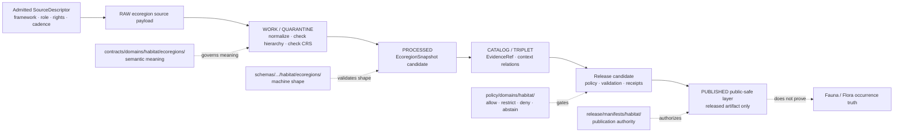

<!-- [KFM_META_BLOCK_V2]
doc_id: kfm://doc/contracts-domains-habitat-ecoregions-readme
title: Habitat Ecoregions Contracts README
type: readme
version: v0.1
status: draft; experimental; PROPOSED; NEEDS VERIFICATION before promotion
owners:
  - OWNER_TBD — Habitat domain steward
  - OWNER_TBD — Ecoregions steward
  - OWNER_TBD — Contract steward
  - OWNER_TBD — Spatial Foundation reviewer
  - OWNER_TBD — Source steward
  - OWNER_TBD — Policy steward
  - OWNER_TBD — Release steward
  - OWNER_TBD — Docs steward
created: 2026-06-21
updated: 2026-06-21
policy_label: public-with-gates; readme; semantic-contracts; habitat; ecoregions; regionalization-context; source-role-aware; evidence-bound; release-gated
tags: [kfm, contracts, habitat, ecoregions, README, regionalization, ecological-system, ecoregion-framework, ecoregion-snapshot, context-join, source-role, evidence, geoprivacy, policy, release, rollback]
related:
  - ../README.md
  - ../../../../docs/domains/habitat/README.md
  - ../../../../docs/domains/habitat/sublanes/ecoregions.md
  - ../../../../docs/domains/habitat/SOURCE_FAMILIES.md
  - ../../../../pipelines/domains/habitat/ecoregions/README.md
  - ../../../../pipeline_specs/habitat/ecoregions/README.md
  - ../../../../schemas/contracts/v1/domains/habitat/ecoregions/
  - ../../../../policy/domains/habitat/
  - ../../../../policy/sensitivity/habitat/
  - ../../../../fixtures/domains/habitat/ecoregions/
  - ../../../../tests/domains/habitat/ecoregions/
  - ../../../../data/registry/sources/habitat/
  - ../../../../release/manifests/habitat/
notes:
  - "Created over an empty file at contracts/domains/habitat/ecoregions/README.md."
  - "This README is a directory contract for Habitat ecoregion semantic-contract materials only. It does not own executable pipelines, declarative pipeline specs, schemas, policy, source descriptors, lifecycle data, public tiles, or release decisions."
  - "Ecoregions are regionalization context: they classify places by source framework/version and must not be treated as species occurrence, plant occurrence, HabitatPatch, critical habitat, hydrology, soil, hazards, agriculture, land/title, or release truth."
  - "Schema, validator, fixture, test, policy, and release paths are listed as expected responsibility homes and remain NEEDS VERIFICATION unless separately confirmed."
[/KFM_META_BLOCK_V2] -->

<a id="top"></a>

# Habitat Ecoregions Contracts

> Semantic-contract directory for Habitat ecoregion and biophysical regionalization meaning: framework identity, source version, hierarchy level, context-join rules, evidence posture, public-safe geometry, correction, and rollback.

<p>
  
  
  
  
  
  
</p>

**Path:** `contracts/domains/habitat/ecoregions/README.md`  
**Owners:** `OWNER_TBD — Habitat steward · Ecoregions steward · Contract steward · Source/Policy/Release stewards`  
**Status:** `experimental` / `draft` / `PROPOSED`  
**Authority:** semantic meaning and contract orientation only; not machine schema, executable pipeline, source registry, policy, lifecycle store, or release authority.

## Quick jumps

[Scope](#scope) · [Repo fit](#repo-fit) · [Accepted inputs](#accepted-inputs) · [Exclusions](#exclusions) · [Directory map](#directory-map) · [Contract candidates](#contract-candidates) · [Trust flow](#trust-flow) · [Source-role rules](#source-role-rules) · [Sensitivity and release](#sensitivity-and-release) · [Validation](#validation) · [Rollback](#rollback) · [Open questions](#open-questions)

---

## Scope

This directory is for **contract-bearing Markdown** that defines what Habitat ecoregion objects and relationships mean inside KFM.

It exists because ecoregions are useful, public-safe regionalization context, but they are easy to misuse. An ecoregion polygon can classify a place by a named framework and source version. It does **not** prove a species occurs there, a rare plant is present there, a habitat patch is high quality, a regulatory critical-habitat designation exists, or a public layer is approved for release.

> [!IMPORTANT]
> Ecoregion contracts describe **meaning**. They do not fetch source data, transform geometry, validate schemas, decide policy, publish artifacts, or authorize public UI/API exposure.

---

## Repo fit

`contracts/domains/habitat/ecoregions/` is a Habitat responsibility segment under the `contracts/` root.

| Concern | Correct home | Status |
|---|---|---|
| Human-facing Habitat doctrine | `../../../../docs/domains/habitat/` | CONFIRMED related docs exist |
| Ecoregions sublane charter | `../../../../docs/domains/habitat/sublanes/ecoregions.md` | CONFIRMED related doc exists |
| Ecoregion semantic contracts | `./` | THIS DIRECTORY |
| Machine schemas | `../../../../schemas/contracts/v1/domains/habitat/ecoregions/` | PROPOSED / NEEDS VERIFICATION |
| Executable ecoregion logic | `../../../../pipelines/domains/habitat/ecoregions/` | CONFIRMED README exists |
| Declarative ecoregion specs | `../../../../pipeline_specs/habitat/ecoregions/` | CONFIRMED README exists |
| Source descriptors / rights | `../../../../data/registry/sources/habitat/` | Expected registry home; contents NEED VERIFICATION |
| Policy and sensitivity | `../../../../policy/domains/habitat/`, `../../../../policy/sensitivity/habitat/` | Expected policy homes; contents NEED VERIFICATION |
| Fixtures/tests | `../../../../fixtures/domains/habitat/ecoregions/`, `../../../../tests/domains/habitat/ecoregions/` | PROPOSED / NEEDS VERIFICATION |
| Release decisions | `../../../../release/manifests/habitat/` | Expected release home; contents NEED VERIFICATION |

The parent `contracts/domains/habitat/README.md` is still a broad scaffold. This README narrows the ecoregions subdirectory to the KFM responsibility-root rule: contracts define semantic meaning; they do not absorb schemas, policies, fixtures, tests, packages, pipelines, registries, lifecycle data, or release artifacts.

---

## Accepted inputs

Files belong here when their primary job is to define **Habitat ecoregion contract meaning**.

Appropriate future files may include semantic contracts for:

- `EcoregionFramework` — classification authority and version, such as EPA/Omernik or USFS/Bailey, after source admission.
- `EcoregionSnapshot` — frozen framework × level × extent × source-version polygon set.
- `EcoregionLevel` — hierarchy level semantics and parent/child rules.
- `EcoregionContextJoin` — governed use of ecoregions as context for Habitat, Flora, Fauna, Hydrology, Soil, Hazards, Agriculture, or Spatial Foundation joins.
- `EcoregionBoundaryVersion` — geometry lineage, source vintage, and correction/supersession posture.
- `EcoregionLayerDescriptor` — Habitat-specific layer-description semantics where cross-cutting layer contracts need a domain profile.
- `DomainValidationReport`-like ecoregion validation report semantics, if not handled by a shared Habitat validation-report contract.

Each contract should preserve:

- source framework and source version;
- hierarchy level and parent/child relationship;
- source role and SourceDescriptor linkage;
- source time, valid time, retrieval time, release time, and correction time;
- geometry lineage, CRS, public-safe geometry posture, and transformation receipts where material;
- EvidenceRef/EvidenceBundle closure before consequential claims;
- policy, review, release, correction, and rollback references.

---

## Exclusions

Do not put these materials in this directory.

| Do not place here | Correct responsibility home | Why |
|---|---|---|
| Executable ecoregion pipeline code | `../../../../pipelines/domains/habitat/ecoregions/` | Pipelines own execution, not semantic meaning. |
| Declarative run specs | `../../../../pipeline_specs/habitat/ecoregions/` | Specs configure what should run; contracts define what objects mean. |
| JSON Schemas | `../../../../schemas/contracts/v1/domains/habitat/ecoregions/` | Schemas own machine shape. |
| SourceDescriptor records | `../../../../data/registry/sources/habitat/` | Source identity, role, rights, cadence, and authority belong in source registry. |
| RAW/WORK/QUARANTINE/PROCESSED data | `../../../../data/raw/`, `../../../../data/work/`, `../../../../data/quarantine/`, `../../../../data/processed/` | Lifecycle data never belongs in contracts. |
| Catalog/triplet records | `../../../../data/catalog/`, `../../../../data/triplets/` | Discovery and graph projection are downstream carriers. |
| PMTiles, MVT, GeoParquet, COG, or public layer artifacts | `../../../../data/published/layers/habitat/` after release | Render artifacts are not semantic contracts. |
| Policy decisions/rules | `../../../../policy/domains/habitat/`, `../../../../policy/sensitivity/habitat/` | Policy owns allow/restrict/deny/abstain behavior. |
| Release manifests, correction notices, rollback cards | `../../../../release/` | Publication is a governed state transition. |
| Fauna/Flora occurrence contracts | `../../../../contracts/domains/fauna/`, `../../../../contracts/domains/flora/` | Species/plant occurrence truth is not Habitat ecoregion truth. |
| Hydrology/Soil/Hazards/Agriculture/Land truth | Corresponding domain contract roots | Ecoregions can join as context only. |

---

## Directory map

```text
contracts/domains/habitat/ecoregions/
└── README.md                         # this directory contract
```

Expected future semantic-contract files are **PROPOSED** until created and reviewed. Do not create parallel schema, policy, source, fixture, test, release, or lifecycle homes under this directory.

---

## Contract candidates

| Candidate contract | Purpose | Status |
|---|---|---|
| `EcoregionFramework.md` | Names the classification authority, source role, source version, rights, and framework vocabulary. | PROPOSED |
| `EcoregionSnapshot.md` | Freezes a framework/version/level/extent geometry set with source and retrieval times. | PROPOSED |
| `EcoregionLevel.md` | Defines hierarchy semantics and parent/child rules. | PROPOSED |
| `EcoregionContextJoin.md` | Governs use of ecoregions as context for Habitat and adjacent domains. | PROPOSED |
| `EcoregionBoundaryVersion.md` | Tracks boundary geometry lineage, correction, supersession, and rollback. | PROPOSED |
| `EcoregionPublicLayer.md` | Describes public-safe layer semantics only when tied to release artifacts. | PROPOSED; may belong in a shared layer-descriptor contract instead |

> [!NOTE]
> Names above are contract candidates, not proof of current files or accepted schemas. Create them only after checking schema homes, adjacent docs, and any ADRs or drift entries.

---

## Trust flow



---

## Source-role rules

Ecoregion contracts must preserve source role from admitted SourceDescriptors.

| Source pattern | Likely role posture | Contract rule |
|---|---|---|
| EPA/Omernik ecoregion framework | authority/context; map to approved KFM role before claim-bearing use | Preserve framework/version/level; do not treat as occurrence truth. |
| USFS/Bailey ecoregions | authority/context; role NEEDS VERIFICATION | Keep framework separate from EPA/Omernik. |
| GAP/LANDFIRE / ecological-system products | modeled/context depending on product | Do not relabel model/classification output as observed occurrence. |
| NLCD/NWI land-cover/wetland context | observed or regulatory depending source family and descriptor | Adjacent context only; not ecoregion identity unless contract says so. |
| Cross-lane sensitive occurrence join | source role belongs to owning domain | Deny or generalize until geoprivacy, evidence, policy, review, release, and rollback resolve. |

Older notes may use words such as `authority`, `context`, or `model`. Those must be resolved into KFM's admitted source-role vocabulary before claim-bearing use.

---

## Sensitivity and release

Ecoregion polygons are usually low intrinsic sensitivity, but joins can raise sensitivity sharply.

Rules:

- Ecoregion polygons classify places, not species/plant presence.
- Joins to Fauna, Flora, rare species, sensitive habitat, cultural/resource-sensitive, private land, or exact occurrence records fail closed until public-safe transform and review support exist.
- Public layers need attribute include-lists, geometry precision rules, source-version pins, EvidenceBundle support, policy decision where material, release manifest, correction path, and rollback target.
- Public map/UI/AI surfaces must not read RAW, WORK, QUARANTINE, unpublished candidates, or direct source systems.
- Generated summaries cannot promote a source, fill evidence gaps, or approve release.

---

## Validation

Before this directory is promoted beyond experimental:

- [ ] Confirm the accepted schema path for Habitat ecoregion contracts.
- [ ] Decide whether ecoregion contracts live as individual files here or as a shared Habitat contract family elsewhere.
- [ ] Add semantic contracts for the accepted ecoregion object families.
- [ ] Add paired schemas, fixtures, and validators under their responsibility roots.
- [ ] Add tests for ecoregion/occurrence, ecoregion/patch, ecoregion/critical-habitat, ecoregion/hydrology, ecoregion/hazards, and ecoregion/release anti-collapse rules.
- [ ] Confirm source profiles and SourceDescriptors for EPA/Omernik, USFS/Bailey, or other admitted frameworks.
- [ ] Confirm public layer attribute include-lists, source-version fields, evidence refs, receipts, release manifests, correction notices, and rollback cards.
- [ ] Update the parent `contracts/domains/habitat/README.md` so it no longer suggests schemas, policies, fixtures, tests, packages, pipelines, registries, or lifecycle artifacts belong under `contracts/`.

Recommended finite outcomes:

| Condition | Outcome |
|---|---|
| Source, role, framework, level, evidence, policy, release, and rollback all resolve | `ANSWER` / public-safe context can be shown |
| Evidence, source role, rights, hierarchy, geometry, sensitivity, or release support is incomplete | `ABSTAIN` / `HOLD` |
| Ecoregion context would be used as occurrence/regulatory/hydrology/hazards/title/release truth | `DENY` |
| Schema, validator, source read, transform, evidence lookup, policy, or release lookup fails | `ERROR` |

---

## Rollback

Rollback is required if this directory or any future contract weakens Habitat governance by collapsing ecoregion context into occurrence truth, critical-habitat designation, habitat-patch quality, hydrology/soil/hazards/agriculture truth, land/title truth, or release authority.

Rollback triggers include:

- schema/contract path is superseded by ADR or schema PR;
- ecoregion framework, level, hierarchy, source version, or geometry lineage is corrected;
- public layer exposes attributes or geometry beyond the allowed include-list;
- source role is collapsed or upgraded during promotion;
- sensitive cross-lane join is published without geoprivacy/review/policy/release support;
- generated text or map rendering is treated as evidence;
- public client reads RAW/WORK/QUARANTINE or unpublished candidate records.

Rollback artifacts should include affected contract IDs, source descriptor refs, framework/version/level refs, geometry fingerprints, public layer artifact refs, evidence refs, policy decisions, receipts, release manifests, correction notices, rollback cards, replacement records, and cache/style invalidation instructions.

---

## Open questions

| Question | Status | Resolution path |
|---|---|---|
| Which ecoregion semantic contracts should be first-class files in this directory? | NEEDS VERIFICATION | Habitat steward + contract/schema review. |
| What is the accepted schema home for Habitat ecoregion contracts? | NEEDS VERIFICATION | Schema-root inspection and ADR-0001 alignment. |
| How should older `authority/context/model` wording map into KFM source-role enum values? | NEEDS VERIFICATION | SourceDescriptor/source-role ADR or validator rules. |
| Which public attribute include-list is accepted for ecoregion tiles? | NEEDS VERIFICATION | Map/UI + policy + release fixture review. |
| Which ecoregion joins require geoprivacy receipts? | NEEDS VERIFICATION | Habitat/Fauna/Flora policy review. |
| Should public ecoregion layer descriptors live here or under a shared Habitat layer-descriptor contract? | NEEDS VERIFICATION | Map/UI contract review. |

---

## Related docs

- [`../README.md`](../README.md) — parent Habitat contracts README, currently scaffolded.
- [`../../../../docs/domains/habitat/README.md`](../../../../docs/domains/habitat/README.md) — Habitat lane overview and responsibility-root map.
- [`../../../../docs/domains/habitat/sublanes/ecoregions.md`](../../../../docs/domains/habitat/sublanes/ecoregions.md) — ecoregions sublane doctrine.
- [`../../../../docs/domains/habitat/SOURCE_FAMILIES.md`](../../../../docs/domains/habitat/SOURCE_FAMILIES.md) — Habitat source-family dossiers.
- [`../../../../pipelines/domains/habitat/ecoregions/README.md`](../../../../pipelines/domains/habitat/ecoregions/README.md) — executable ecoregion pipeline lane.
- [`../../../../pipeline_specs/habitat/ecoregions/README.md`](../../../../pipeline_specs/habitat/ecoregions/README.md) — declarative ecoregion pipeline-spec lane.

[Back to top](#top)
