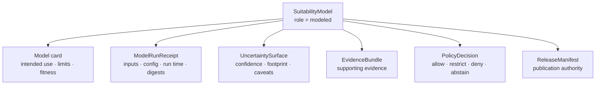

<!-- [KFM_META_BLOCK_V2]
doc_id: kfm://doc/contracts-domains-habitat-suitability-model-schema-aligned
title: SuitabilityModel Contract — Habitat
type: semantic-contract
version: v0.2
status: draft; PROPOSED; CONFLICTED path alias; NEEDS VERIFICATION before promotion
owners:
  - OWNER_TBD — Habitat domain steward
  - OWNER_TBD — Suitability steward
  - OWNER_TBD — Model steward
  - OWNER_TBD — Contract steward
  - OWNER_TBD — Source steward
  - OWNER_TBD — Evidence steward
  - OWNER_TBD — Schema steward
  - OWNER_TBD — Policy steward
  - OWNER_TBD — Sensitivity reviewer
  - OWNER_TBD — Release steward
  - OWNER_TBD — Docs steward
created: 2026-06-22
updated: 2026-06-22
policy_label: public-with-gates; semantic-contract; habitat; suitability; SuitabilityModel; modeled-habitat; schema-aligned; model-card-required; model-vs-observation; evidence-bound; uncertainty-bound; release-gated; no-regulatory-authority
tags: [kfm, contracts, habitat, SuitabilityModel, suitability_model, suitability-model, modeled-habitat, model-card, model-run-receipt, uncertainty-surface, habitat-quality-score, source-role, evidence, policy, sensitivity, release, correction, rollback, anti-collapse]
related:
  - ./README.md
  - ./SuitabilityModel.md
  - ./model_run_receipt.md
  - ./uncertainty_surface.md
  - ./habitat_quality_score.md
  - ./habitat_patch.md
  - ./land_cover_observation.md
  - ./ecological_system.md
  - ./domain_observation.md
  - ./domain_feature_identity.md
  - ./domain_layer_descriptor.md
  - ./domain_validation_report.md
  - ./land_cover/observation.md
  - ./land_cover/model_run_receipt.md
  - ./land_cover/uncertainty.md
  - ../../../docs/domains/habitat/README.md
  - ../../../docs/domains/habitat/CANONICAL_PATHS.md
  - ../../../docs/domains/habitat/sublanes/suitability.md
  - ../../../docs/domains/habitat/MODEL_VS_OBSERVATION.md
  - ../../../docs/domains/habitat/SOURCE_FAMILIES.md
  - ../../../schemas/contracts/v1/domains/habitat/suitability_model.schema.json
  - ../../../policy/domains/habitat/model_vs_observation.rego
  - ../../../policy/sensitivity/habitat/
  - ../../../fixtures/domains/habitat/suitability_model/
  - ../../../tests/domains/habitat/test_suitability_model.*
  - ../../../data/registry/sources/habitat/
  - ../../../release/manifests/habitat/
notes:
  - "Expanded from a scaffold at contracts/domains/habitat/suitability_model.md."
  - "This lowercase path is the contract_doc path currently referenced by schemas/contracts/v1/domains/habitat/suitability_model.schema.json and listed in docs/domains/habitat/CANONICAL_PATHS.md."
  - "CONFLICTED path alias: contracts/domains/habitat/SuitabilityModel.md also exists as an expanded sibling semantic contract. This update preserves both paths and does not delete or merge either file."
  - "The paired schema exists at schemas/contracts/v1/domains/habitat/suitability_model.schema.json, but it is still a PROPOSED scaffold with empty properties and additionalProperties=true; field-level enforcement remains NEEDS VERIFICATION."
  - "SuitabilityModel is modeled Habitat, not observed land cover, not species or plant occurrence truth, not regulatory critical habitat, not HabitatPatch truth, not a public layer by itself, not a management instruction, and not release authority."
[/KFM_META_BLOCK_V2] -->

# SuitabilityModel Contract — Habitat

> Schema-aligned semantic contract for `SuitabilityModel`: the Habitat object that defines a modeled suitability surface, suitability class, or score-family under stated assumptions, source support, model card, model-run receipt, uncertainty, validation, policy, release, correction, and rollback controls.

  
  
  
  
  
  
  
  

`contracts/domains/habitat/suitability_model.md`

## Quick jumps

[Status](#status) · [Meaning](#meaning) · [Repo fit](#repo-fit) · [Path and schema posture](#path-and-schema-posture) · [SuitabilityModel vs trust objects](#suitabilitymodel-vs-trust-objects) · [Assertions](#assertions) · [Exclusions](#exclusions) · [Recommended semantics](#recommended-semantics) · [Model-card burden](#model-card-burden) · [Model companions](#model-companions) · [Source-role rules](#source-role-rules) · [Sensitivity and release](#sensitivity-and-release) · [Lifecycle](#lifecycle) · [Validation](#validation) · [Evidence basis](#evidence-basis) · [Rollback](#rollback) · [Open questions](#open-questions)

---

## Status

> [!IMPORTANT]
> **Status:** `draft` / semantic contract  
> **Contract path:** `contracts/domains/habitat/suitability_model.md`  
> **Expanded sibling path:** `contracts/domains/habitat/SuitabilityModel.md` — already expanded and unresolved as an alias.  
> **Schema path:** `schemas/contracts/v1/domains/habitat/suitability_model.schema.json`  
> **Schema posture:** paired schema exists, but is still a `PROPOSED` scaffold with empty `properties` and `additionalProperties: true`.  
> **Truth posture:** Habitat doctrine names `SuitabilityModel` as a canonical Habitat object family and requires modeled-vs-observed-vs-regulatory separation. Field-level schema shape, fixtures, validators, policy runtime, release artifacts, map/UI behavior, Focus Mode behavior, and CI/test coverage remain **NEEDS VERIFICATION**.

> [!CAUTION]
> `SuitabilityModel` is modeled Habitat. It is not observed land cover, not species/plant occurrence truth, not regulatory critical habitat, not a public layer, not a management instruction, not a PolicyDecision, and not a ReleaseManifest. A suitability surface presented as regulatory critical habitat is a deny-level source-role collapse.

---

## Meaning

`SuitabilityModel` defines a modeled Habitat product: a suitability surface, score field, probability-like index, categorical suitability class, or related model family that describes how suitable a place is for a declared Habitat purpose under stated assumptions.

It answers:

- What habitat purpose, target concept, species/guild context, ecological system, patch class, or restoration/stewardship question is the model trying to evaluate?
- Which observations, class schemes, source vintages, ecoregions, land-cover products, soils, hydrology, hazards, stewardship context, or occurrence-context inputs support it?
- Which source roles do those inputs carry, and which source role may the model output claim?
- Which model card, model-run receipt, uncertainty surface, validation report, EvidenceBundle, policy decision, review state, release manifest, correction notice, and rollback target govern downstream use?
- Which public surface may show it, and how must it label modeled status, uncertainty, valid extent, stale state, and correction state?

A suitability model is an interpretive, evidence-supported artifact. It may support Habitat reasoning, but it must remain visibly **modeled** at every API, map, report, Focus Mode, and AI surface.

---

## Repo fit

| Responsibility | Path or root | This contract's role |
|---|---|---|
| Schema-aligned SuitabilityModel meaning | `contracts/domains/habitat/suitability_model.md` | This file; listed by schema and canonical-path table |
| Expanded sibling contract | `contracts/domains/habitat/SuitabilityModel.md` | CONFIRMED expanded alias; disposition NEEDS VERIFICATION |
| Machine schema shape | `schemas/contracts/v1/domains/habitat/suitability_model.schema.json` | CONFIRMED scaffold; field shape not enforced |
| Suitability doctrine | `docs/domains/habitat/sublanes/suitability.md` | Defines modeled-habitat sublane, model cards, receipts, uncertainty, sensitivity, and release posture |
| Model-vs-observation doctrine | `docs/domains/habitat/MODEL_VS_OBSERVATION.md` | Defines source-role anti-collapse, model-card burden, and modeled/observed/regulatory separation |
| Canonical path map | `docs/domains/habitat/CANONICAL_PATHS.md` | Lists lowercase contract/schema/policy/test paths while noting schema-home conflict |
| Model run receipt | `contracts/domains/habitat/model_run_receipt.md` and/or `contracts/domains/habitat/land_cover/model_run_receipt.md` | Required companion; exact hierarchy still NEEDS VERIFICATION |
| Uncertainty support | `contracts/domains/habitat/uncertainty_surface.md` and/or `contracts/domains/habitat/land_cover/uncertainty.md` | Required companion; exact hierarchy still NEEDS VERIFICATION |
| Source registry | `data/registry/sources/habitat/` | Source identity, role, rights, cadence, activation |
| Policy | `policy/domains/habitat/model_vs_observation.rego`, `policy/sensitivity/habitat/` | Expected role-collapse and sensitivity gates; implementation NEEDS VERIFICATION |
| Release | `release/` / `release/manifests/habitat/` | Expected release/correction/rollback authority; instances NEEDS VERIFICATION |

---

## Path and schema posture

| Item | Current evidence | Contract posture |
|---|---|---|
| Lowercase contract path | `contracts/domains/habitat/suitability_model.md` existed as scaffold. | Expanded here as schema-aligned candidate. |
| PascalCase sibling | `contracts/domains/habitat/SuitabilityModel.md` exists as expanded contract. | CONFLICTED / NEEDS VERIFICATION. |
| Snake-case schema | `schemas/contracts/v1/domains/habitat/suitability_model.schema.json` exists as scaffold. | CONFIRMED scaffold. |
| Schema properties | Empty object. | No field-level enforcement proven. |
| Schema `contract_doc` | Points to `contracts/domains/habitat/suitability_model.md`. | Aligned with this file. |
| Canonical path table | Lists lowercase path. | Supports this path as the candidate canonical home. |
| Schema-home slug | Canonical-paths note says segmented schema slug is CONFLICTED. | Keep visible until ADR-S-01 resolves. |

> [!WARNING]
> Do not promote both `suitability_model.md` and `SuitabilityModel.md` as separate authorities. This file is schema/canonical-map aligned; the PascalCase sibling remains an expanded alias until a steward resolves it by ADR, migration note, redirect, deprecation, or schema-pointer decision.

---

## SuitabilityModel vs trust objects

| Object / artifact | What it owns | Relationship to `SuitabilityModel` |
|---|---|---|
| `SuitabilityModel` | Modeled suitability meaning and output contract. | This contract. |
| `ModelRunReceipt` | Specific run inputs, params, digests, time, environment, and hash. | Required companion; not proof or release. |
| `UncertaintySurface` | Uncertainty/fitness/confidence/coverage support. | Required companion; never erased. |
| Model card | Intended use, inputs, scope, limits, validation metrics, failure modes. | Required for public suitability products; field set NEEDS VERIFICATION. |
| `EvidenceBundle` | Evidence support for claims. | Must resolve before consequential claims. |
| `PolicyDecision` | Allow/restrict/deny/abstain. | Required where policy or sensitivity is material. |
| `ReleaseManifest` / `PromotionDecision` | Publication authority. | Required for public exposure. |
| `LayerManifest` / UI layer | Public serving/rendering metadata. | May expose released model, but is not the model truth. |
| AI / Focus Mode answer | Interpretive explanation. | Must label modeled status and cite evidence; cannot become truth. |

---

## Assertions

A reviewed `SuitabilityModel` should semantically assert:

1. **Model identity** — stable `model_id`, `model_version`, object role, target habitat concept, and normalized digest.
2. **Modeled source role** — output role remains `modeled` or the accepted equivalent; it is never relabeled `observed` or `regulatory`.
3. **Intended and denied uses** — what the model is for and what it must not be used for.
4. **Spatial scope** — valid extent, analysis unit, resolution, CRS, delivery projection, and public geometry posture.
5. **Temporal scope** — source, observed, valid, retrieval, run, release, and correction times stay distinct where material.
6. **Input support** — source descriptors, LandCoverObservation refs, ecoregion/context refs, occurrence-context refs, hydrology/soil/context refs, and source-vintage refs.
7. **Run support** — model-run receipt refs, code/config/input/output digests, and environment summary.
8. **Uncertainty support** — uncertainty surface or uncertainty summary paired with the output.
9. **Model card** — intended use, input support, validation metrics, known limits, failure modes, and fitness caveats.
10. **Evidence support** — EvidenceRef/EvidenceBundle refs for evidence-dependent claims.
11. **Governance support** — validation report, policy decision, review record, release ref, correction ref, rollback ref.
12. **Display obligations** — map/API/UI/AI surfaces show modeled badge, uncertainty, source-role caveat, and stale/correction state where material.

---

## Exclusions

| Misuse | Why it is denied or abstained |
|---|---|
| Treating suitability as regulatory critical habitat | Invents authority KFM does not have. |
| Treating suitability as observed occurrence | Hides model assumptions and uncertainty. |
| Treating suitability as species/plant presence | Fauna/Flora own occurrence truth. |
| Treating suitability as HabitatPatch truth | Patch construction is a separate object family. |
| Treating quality score as management instruction | KFM is not a management, legal, emergency, or alert authority. |
| Treating model raster as EvidenceBundle | Raster is a downstream/artifact carrier; evidence support must resolve separately. |
| Treating model receipt as proof | Receipt records process; EvidenceBundle carries proof support. |
| Dropping uncertainty to simplify display | Misrepresents confidence and must be denied. |
| Using style filters as sensitivity controls | Sensitivity must be handled before publication, not hidden by style. |
| Letting AI infer exact sensitive locations | Sensitive inference from modeled habitat fails closed. |

---

## Recommended semantics

The following fields are **PROPOSED** targets for future schema expansion. They are not enforced by the confirmed snake-case scaffold schema.

| Field | Meaning |
|---|---|
| `id` | Canonical KFM suitability model ID. |
| `version` | Contract/object version. |
| `spec_hash` | Normalized model digest. |
| `domain` | Must resolve to `habitat`. |
| `object_family` | `SuitabilityModel`. |
| `model_id` | Stable model identifier. |
| `model_version` | Model version; material change creates a new version. |
| `source_role` | Must resolve to `modeled` or accepted equivalent for model output. |
| `target_habitat_concept` | Species, guild, ecological system, patch class, stewardship purpose, or other reviewed target. |
| `intended_use` | Approved use context. |
| `denied_uses` | Uses explicitly denied, such as regulatory designation or exact occurrence inference. |
| `input_refs` | Structured refs to source observations/context inputs. |
| `source_descriptor_refs` | Source identity, role, rights, cadence, attribution, and authority limits. |
| `source_vintage_refs` | Input product vintages. |
| `land_cover_observation_refs` | Land-cover observations used by the model. |
| `ecoregion_context_refs` | Ecoregion/regionalization context, if used. |
| `occurrence_context_refs` | Public-safe Fauna/Flora context refs, if used. |
| `soil_hydrology_context_refs` | Soil/Hydrology context refs, if used. |
| `hazards_context_refs` | Hazards/resilience context refs, if used. |
| `model_run_receipt_ref` | Required process receipt for the model run. |
| `model_card_ref` | Model-card ref describing support, scope, limits, and failure modes. |
| `uncertainty_surface_refs` | Required uncertainty support. |
| `output_artifact_refs` | Raster/vector/table/layer artifacts emitted by the model. |
| `output_artifact_digests` | Digests for output artifacts. |
| `spatial_scope_ref` | Valid extent or analysis unit. |
| `crs_analysis` / `crs_delivery` | Analysis and delivery CRS where material. |
| `resolution_analysis` / `resolution_delivery` | Analysis and delivery/generalized resolution. |
| `fitness_metrics_ref` | Validation/fitness/performance report ref. |
| `known_failure_modes` | Public-safe failure-mode summary. |
| `source_time` / `observed_time` / `valid_time` / `retrieval_time` / `run_time` / `release_time` / `correction_time` | Distinct time dimensions; do not collapse. |
| `evidence_refs` / `evidence_bundle_refs` | Evidence closure refs behind model claims. |
| `validation_report_ref` | ValidationReport for schema, model card, receipt, uncertainty, sensitivity, and release readiness. |
| `policy_decision_ref` | PolicyDecision where material. |
| `review_record_ref` | Steward review record. |
| `redaction_receipt_ref` | Required if sensitive geometry/detail is generalized or redacted. |
| `release_ref` | ReleaseManifest or PromotionDecision ref. |
| `correction_refs` | CorrectionNotice, supersession, replacement model refs. |
| `rollback_refs` | Rollback target refs. |
| `quality_flags` | Missing model card, missing receipt, missing uncertainty, role collapse, rights unknown, sensitive join, stale input, out-of-scope prediction, release missing. |

---

## Model-card burden

Every public or semi-public `SuitabilityModel` needs a model card or equivalent reviewed support record.

Minimum model-card topics are **PROPOSED / NEEDS VERIFICATION** until schema and validator fields are confirmed:

| Topic | Why it matters |
|---|---|
| `model_id` and `model_version` | Stable identity; material changes create new versions. |
| Intended use | Prevents overreading the model. |
| Denied use | Blocks regulatory, occurrence, management, or sensitive-location misuse. |
| Input support | Lists source families, source vintages, source roles, and EvidenceRefs. |
| Spatial scope | Tells users where model output is meaningful. |
| Temporal scope | Separates input vintages, run time, validity, release, and correction. |
| Validation/fitness metrics | Explains model performance and limits. |
| Known failure modes | Makes likely misuse visible. |
| `ModelRunReceipt` | Makes the exact run inspectable. |
| `UncertaintySurface` | Prevents false certainty. |
| Sensitivity posture | Records whether outputs are public, generalized, restricted, or withheld. |
| Release/rollback refs | Makes public use correctable. |

---

## Model companions

A `SuitabilityModel` is an aggregate-style object. It must not drift away from its required companions.

> [!IMPORTANT]
> The suitability surface, model card, model-run receipt, and uncertainty support are co-release obligations. Publishing the surface while dropping uncertainty or model-card support misrepresents confidence.

---

## Source-role rules

| Pattern | Required handling |
|---|---|
| Observed land-cover input | May support model, but model output remains modeled. |
| Public occurrence context | Owning domain remains Fauna/Flora; exact sensitive detail fails closed. |
| Ecoregion/soil/hydrology/hazards context | Context only; ownership and evidence stay with source lane. |
| GAP/LANDFIRE modeled products | Carry modeled role and uncertainty/receipt posture. |
| Regulatory critical habitat input | Stays regulatory; suitability output must not inherit regulatory authority. |
| Candidate model run | WORK/QUARANTINE until reviewed and released. |
| AI-generated suitability statement | Synthetic/interpretive only; cannot become model evidence. |

Finite outcomes:

| Condition | Outcome |
|---|---|
| Evidence, role, model card, receipt, uncertainty, policy, release, and rollback all resolve | `ANSWER` / public-safe modeled explanation may proceed |
| Evidence, model card, uncertainty, sensitivity, or release support is missing | `ABSTAIN` / `HOLD` |
| Model is framed as observed, regulatory, occurrence truth, management instruction, or exact sensitive-location inference | `DENY` |
| Schema, validator, source read, artifact read, evidence lookup, policy lookup, or release lookup fails | `ERROR` |

---

## Sensitivity and release

Suitability surfaces can expose sensitive ecological information indirectly. High suitability near sensitive occurrence context, nesting sites, dens, roosts, hibernacula, spawning areas, rare plants, or stewardship-sensitive areas can create disclosure risk even if the model output is derived.

Rules:

- Public exact exposure fails closed when suitability output can reveal sensitive occurrence or stewardship context.
- Generalized, redacted, buffered, aggregated, delayed, or steward-only access requires recorded transform metadata and review.
- Sensitive joins require policy decision, geoprivacy/redaction receipt, review state, release manifest, correction path, and rollback target.
- Model-vs-observation and model-vs-regulatory badges must remain visible in public map/UI/AI surfaces.
- Public clients use governed APIs and released artifacts, not RAW/WORK/QUARANTINE/candidate model outputs.

---

## Lifecycle

| Phase | SuitabilityModel handling |
|---|---|
| RAW | Source inputs, candidate model definitions, configs, training/source-support records, and source descriptors are captured with roles, rights, sensitivity, time, and hash. |
| WORK / QUARANTINE | Candidate model runs generate receipts, outputs, uncertainty, model cards, and validation findings; missing support, role collapse, or sensitive risk quarantines the candidate. |
| PROCESSED | Reviewed model objects bind model card, receipt, uncertainty, evidence refs, output digests, policy posture, and correction state. |
| CATALOG / TRIPLET | Model claims may be cataloged only with EvidenceBundle refs, source-role caveats, temporal scope, and sensitivity posture. |
| RELEASE CANDIDATE | Public suitability layers/cards/API payloads require validation, policy/review, redaction where material, release manifest, correction path, and rollback target. |
| PUBLISHED | Only released public-safe modeled outputs appear through governed APIs, MapLibre surfaces, Evidence Drawer, Focus Mode, or reports. |
| CORRECTED / SUPERSEDED | Source update, model version change, config correction, input digest change, uncertainty update, policy change, or sensitivity review triggers correction and possible rollback. |

---

## Validation

Before this contract is promoted beyond draft:

- [ ] Resolve lowercase vs PascalCase contract path drift; decide whether `suitability_model.md` supersedes, mirrors, or coexists with `SuitabilityModel.md`.
- [ ] Expand `schemas/contracts/v1/domains/habitat/suitability_model.schema.json` beyond empty scaffold.
- [ ] Confirm whether schema-home segmented slug remains or ADR-S-01 selects the flat form.
- [ ] Require `source_role = modeled` or accepted equivalent for suitability model outputs.
- [ ] Require `model_run_receipt_ref`, `model_card_ref`, and `uncertainty_surface_refs` for release candidates.
- [ ] Add valid fixtures for public-safe suitability surface, restricted/generalized sensitive model, candidate model, superseded model, and public derivative.
- [ ] Add invalid fixtures for modeled-as-critical, modeled-as-observed, missing model card, missing receipt, missing uncertainty, sensitive exact release, absent EvidenceBundle, no rollback target, and AI-generated evidence.
- [ ] Confirm policy rules such as modeled-vs-critical denial and model-card-required denial before claiming enforcement.
- [ ] Confirm map/UI badges and Focus Mode outcomes before public serving.

---

## Evidence basis

| Evidence class | Use | Limit |
|---|---|---|
| Target scaffold | Confirms lowercase `suitability_model.md` existed as scaffold before replacement. | Does not prove contract maturity. |
| Snake-case schema scaffold | Confirms schema path and current empty schema posture; schema points here. | Does not prove field-level validation. |
| Expanded PascalCase sibling | Confirms `SuitabilityModel.md` already carries an expanded semantic contract and alias warning. | Does not resolve canonical path. |
| Habitat canonical paths | Lists lowercase contract/schema/policy/test paths and marks schema-home slug conflict. | Does not prove implementation or tests exist. |
| Suitability sublane doc | Defines suitability scope, model cards, receipts, uncertainty, sensitivity, release, and rollback posture. | Some paths and sublane segment status remain PROPOSED. |
| Model-vs-observation doc | Confirms source-role anti-collapse, model-card burden, co-release companions, and publication-deny behavior for missing model card/receipt. | Several policy/schema enforcement claims remain PROPOSED / NEEDS VERIFICATION. |
| User-provided authoring role | Requires evidence-grounded, repo-ready Markdown and visible verification boundaries. | Authoring rule, not implementation proof. |

---

## Rollback

Rollback is required when a released or review-authorized `SuitabilityModel` weakens source-role integrity, hides model-card gaps, drops uncertainty, leaks sensitive context, or makes modeled habitat appear observed, regulatory, or authoritative beyond its evidence.

Rollback triggers include model output labeled as observed land cover, regulatory critical habitat, occurrence truth, or management instruction; `ModelRunReceipt`, model card, or `UncertaintySurface` missing from a release candidate; output artifact digest, input digest, config digest, or model version correction; sensitive occurrence-linked model output published without geoprivacy/redaction/review/release support; public layer dropping modeled/uncertainty badges; Focus Mode or AI inferring exact sensitive locations from suitability output; or lowercase/PascalCase contract alias drift causing schema or release references to point at the wrong contract.

Rollback artifacts should include affected model IDs, model versions, contract path, schema refs, model-card refs, model-run receipt refs, uncertainty refs, input/source refs, evidence refs, validation reports, policy decisions, release refs, correction notices, rollback cards, replacement models, and public-cache/style invalidation instructions.

---

## Open questions

| Question | Status | Resolution path |
|---|---|---|
| Is `suitability_model.md` now the canonical contract path, with `SuitabilityModel.md` retained as alias/history? | CONFLICTED / NEEDS VERIFICATION | Schema steward + contract steward decision; update docs or add migration note. |
| Which fields must be required in `suitability_model.schema.json`? | NEEDS VERIFICATION | Schema PR and fixture review. |
| What is the accepted model-card field set and which fields block publication? | NEEDS VERIFICATION | Contract/schema/policy review. |
| Should `ModelRunReceipt` and `UncertaintySurface` live under land-cover-specific contracts or Habitat-wide contracts? | NEEDS VERIFICATION | Habitat object-family placement review. |
| Which policy files enforce modeled-as-critical and model-card-required denial? | NEEDS VERIFICATION | Policy root inspection and tests. |
| How should public maps badge modeled suitability versus regulatory critical habitat? | NEEDS VERIFICATION | Map/UI contract and release fixture review. |

---

## Related contracts and docs

- [`./README.md`](./README.md) — Habitat contracts root.
- [`./SuitabilityModel.md`](./SuitabilityModel.md) — expanded PascalCase sibling; canonical disposition NEEDS VERIFICATION.
- [`./model_run_receipt.md`](./model_run_receipt.md) — Habitat-wide model-run receipt contract.
- [`./uncertainty_surface.md`](./uncertainty_surface.md) — Habitat-wide uncertainty surface contract, if present/expanded.
- [`./habitat_quality_score.md`](./habitat_quality_score.md) — habitat quality score contract.
- [`./habitat_patch.md`](./habitat_patch.md) — HabitatPatch contract.
- [`./land_cover_observation.md`](./land_cover_observation.md) — land-cover observation compatibility contract.
- [`../../../docs/domains/habitat/README.md`](../../../docs/domains/habitat/README.md) — Habitat lane doctrine.
- [`../../../docs/domains/habitat/CANONICAL_PATHS.md`](../../../docs/domains/habitat/CANONICAL_PATHS.md) — canonical path map.
- [`../../../docs/domains/habitat/sublanes/suitability.md`](../../../docs/domains/habitat/sublanes/suitability.md) — suitability sublane doctrine.
- [`../../../docs/domains/habitat/MODEL_VS_OBSERVATION.md`](../../../docs/domains/habitat/MODEL_VS_OBSERVATION.md) — source-role anti-collapse doctrine.
- [`../../../schemas/contracts/v1/domains/habitat/suitability_model.schema.json`](../../../schemas/contracts/v1/domains/habitat/suitability_model.schema.json) — confirmed scaffold schema, pending expansion.

[Back to top](#top)
