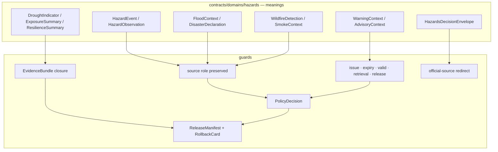

<!-- [KFM_META_BLOCK_V2]
doc_id: kfm://doc/contracts-domains-hazards-readme
title: Hazards Contracts — README
type: readme
version: v0.2
status: draft; PROPOSED; NEEDS VERIFICATION before promotion
owners:
  - OWNER_TBD — Hazards domain steward
  - OWNER_TBD — Contracts steward
  - OWNER_TBD — Source steward
  - OWNER_TBD — Evidence steward
  - OWNER_TBD — Schema steward
  - OWNER_TBD — Policy steward
  - OWNER_TBD — Release steward
  - OWNER_TBD — Docs steward
created: 2026-06-22
updated: 2026-06-22
policy_label: public; contract-root; hazards; not-for-life-safety; release-gated; evidence-bound
related:
  - ../../../docs/domains/hazards/README.md
  - ../../../docs/domains/hazards/PUBLICATION_AND_BOUNDARY.md
  - ../../../docs/domains/hazards/SOURCE_ROLE_MATRIX.md
  - ../../../docs/domains/hazards/SOURCE_REFRESH_RUNBOOK.md
  - ../../../docs/dashboards/domain/hazards.md
  - ../../../docs/architecture/hazards-trust-membrane.md
  - ../../../docs/doctrine/directory-rules.md
  - ../../../schemas/contracts/v1/domains/hazards/README.md
  - ../../../policy/domains/hazards/drawer.rego
  - ../../../pipeline_specs/hazards/
  - ../../../tools/validators/domains/hazards/
  - ../../../release/manifests/hazards-r0002.yaml
  - ./hazards_decision_envelope.md
  - ./domain_validation_report.md
tags: [kfm, contracts, hazards, DOM-HAZ, not-for-life-safety, alert-authority-deny, source-role, anti-collapse, freshness, expiry, evidence-bundle, release-manifest, rollback]
notes:
  - "Expanded from a greenfield scaffold at contracts/domains/hazards/README.md."
  - "Hazards is life-safety-adjacent but KFM is never an emergency alert authority; official sources own operational warnings and instructions."
  - "This directory owns human-readable object meanings for Hazards contracts. Machine shape stays in schemas/, admissibility in policy/, fixtures/tests in fixtures/ and tests/, release decisions in release/, and data lifecycle artifacts in data/."
  - "Most observed implementation-adjacent files remain scaffolds/placeholders; this README therefore separates CONFIRMED repo evidence from PROPOSED contract coverage and NEEDS VERIFICATION enforcement."
[/KFM_META_BLOCK_V2] -->

<a id="top"></a>

# Hazards Contracts

> Human-readable contract home for KFM Hazards object meanings, source-role boundaries, not-for-life-safety envelopes, validation expectations, and release/rollback obligations.

<p>
  
  
  
  
  
  
  
</p>

**Path:** `contracts/domains/hazards/`  
**Status:** draft / contract-root README  
**Owners:** `OWNER_TBD` — assign Hazards + Contracts + Source + Evidence + Policy + Release stewards before promotion.  
**Authority posture:** this directory defines **meaning**, not machine shape, source admission, policy, runtime behavior, or release authority.

## Quick jumps

[Mission](#mission) · [Non-negotiable boundary](#non-negotiable-boundary) · [Repo fit](#repo-fit) · [Accepted inputs](#accepted-inputs) · [Exclusions](#exclusions) · [Contract inventory](#contract-inventory) · [Object-family map](#object-family-map) · [Trust flow](#trust-flow) · [Source-role rules](#source-role-rules) · [Validation expectations](#validation-expectations) · [Rollback](#rollback) · [Evidence basis](#evidence-basis) · [Open questions](#open-questions)

---

## Mission

The `contracts/domains/hazards/` directory is the **contract meaning root** for Hazards domain objects and public-runtime envelopes. It explains what Hazards objects mean, which claims they may support, which source roles they preserve, which lifecycle gates they must pass, and what they must never imply.

Hazards content is high consequence because it is life-safety adjacent. Contract language in this directory therefore has a stricter posture than many slower domains: it must preserve evidence, time, source role, expiry, official-source attribution, release state, correction lineage, rollback targets, and visible not-for-life-safety boundaries.

---

## Non-negotiable boundary

> [!CAUTION]
> **KFM Hazards is not an emergency alert system and must not provide life-safety instructions.** Operational warnings, advisories, watches, detections, and modeled hazards may be represented only as governed context with official-source deferral, evidence/citation support, expiry/freshness posture, and release/rollback closure.

What that means here:

- Contracts may define `WarningContext` and `AdvisoryContext`, but they must not define KFM as the issuer of warnings.
- Contracts may describe NWS/FEMA/USGS/NOAA/NASA/Kansas-local source material, but official authorities retain operational authority.
- Contracts may support released public-safe layers and bounded Focus Mode explanations, but they must not authorize imperative language such as evacuation, sheltering, travel safety, or current operational response.
- Any object that resembles a live alert must carry the not-for-life-safety posture, official-source redirect, `issue_time`, `expiry_time`, source role, and stale/expired state where material.

---

## Repo fit

| Responsibility | Root | Hazards posture |
|---|---|---|
| Human-readable object meaning | `contracts/domains/hazards/` | This directory. Defines semantics and boundaries. |
| Machine-readable shape | `schemas/contracts/v1/domains/hazards/` | Shape only; observed README/schema files are mostly scaffolded. |
| Domain doctrine | `docs/domains/hazards/` | Operating doctrine, source-role matrix, publication boundary, source refresh, backlog. |
| Architecture boundary | `docs/architecture/hazards-trust-membrane.md` | Trust membrane and alert-authority boundary for Hazards. |
| Policy / admissibility | `policy/domains/hazards/` and possibly `policy/release/hazards/` | Policy bundles gate release/serving; observed files include scaffolds. |
| Fixtures/tests | `fixtures/domains/hazards/`, `tests/domains/hazards/` | Positive and negative proofs for source-role, expiry, disclaimer, rollback. |
| Validators | `tools/validators/domains/hazards/` | Validator homes; observed validator is placeholder. |
| Pipelines | `pipelines/domains/hazards/`, `pipeline_specs/hazards/` | Source pipeline homes; observed specs include placeholders. |
| Source registry | `data/registry/sources/hazards/` | SourceDescriptor, rights, role, freshness, cadence, activation. |
| Lifecycle data | `data/raw|work|quarantine|processed|catalog|published/.../hazards/` | Lifecycle roots; public clients do not read pre-publication state. |
| Release authority | `release/` | ReleaseManifest, CorrectionNotice, RollbackCard, PromotionDecision; placeholders observed. |
| Runtime/API | `apps/governed-api/`, public UI surfaces | Public path must be governed; no direct browser fetch to source endpoints. |

---

## Accepted inputs

Contract files here may define or cross-reference:

- Hazards object meanings such as `HazardEvent`, `HazardObservation`, `WarningContext`, `AdvisoryContext`, `DisasterDeclaration`, `FloodContext`, `WildfireDetection`, `SmokeContext`, `DroughtIndicator`, `EarthquakeEvent`, `HeatColdEvent`, `ExposureSummary`, `ResilienceSummary`, `HazardTimeline`, and `ImpactArea`.
- Hazards public-runtime envelopes, especially bounded decision/envelope contracts that carry disclaimers, official-source redirects, and finite outcomes.
- Domain validation/report semantics for source-role anti-collapse, operational expiry, freshness, disclaimer presence, evidence closure, policy, release, correction, and rollback.
- Human-readable constraints for schema fields, source-role preservation, temporal semantics, sensitivity posture, public-safe geometry, and stale/correction state.
- Contract links to source families including NOAA/NCEI Storm Events, NWS alerts, FEMA/OpenFEMA, FEMA NFHL/MSC, USGS Earthquake Catalog, NOAA HMS, NASA FIRMS, drought indicators, Kansas/local emergency context, and state resilience plans.

---

## Exclusions

Do **not** put these here:

| Exclusion | Correct responsibility root |
|---|---|
| JSON Schema source of truth | `schemas/contracts/v1/domains/hazards/` or cross-cutting schema roots |
| OPA/Rego policy implementation | `policy/domains/hazards/`, `policy/release/hazards/`, or cross-cutting policy roots |
| Test fixtures | `fixtures/domains/hazards/` |
| Validator code | `tools/validators/domains/hazards/` or shared validator roots |
| Runtime/API route code | `apps/governed-api/` or runtime/application roots |
| Connector code | `connectors/` under source-owned connector homes, not this contract root |
| RAW/WORK/QUARANTINE/PROCESSED/CATALOG/PUBLISHED data | `data/` lifecycle roots |
| Release manifests, corrections, rollback cards | `release/` roots |
| Emergency instructions or official warning issuance | Out of KFM scope; defer to official authorities |
| Canonical Hydrology/Air/Infrastructure/Roads truth | Owning domain/lane; Hazards cites, never absorbs |

---

## Contract inventory

### Confirmed contract files observed in this directory

| File | Current posture | Role |
|---|---|---|
| [`README.md`](./README.md) | Replaced scaffold with this README. | Contract-root orientation and review checklist. |
| [`hazards_decision_envelope.md`](./hazards_decision_envelope.md) | PROPOSED scaffold. | Planned bounded runtime/envelope semantics for Hazards answers. |
| [`domain_validation_report.md`](./domain_validation_report.md) | PROPOSED scaffold. | Planned Hazards validation-report semantics. |

### Planned or expected contract families

These object families are confirmed by Hazards domain doctrine, but individual contract files beyond the observed files above remain **NEEDS VERIFICATION** unless present in this directory.

| Contract family | Purpose | Required boundary |
|---|---|---|
| `HazardEvent` / `HazardObservation` | Historical or measured hazard records. | Evidence-backed, time-aware, source-role-labeled. |
| `WarningContext` / `AdvisoryContext` | Official operational messages as context. | Not life-safety guidance; issue/expiry required. |
| `DisasterDeclaration` | Administrative/regulatory declaration. | Not observed damage evidence by default. |
| `FloodContext` | Flood regulatory/observed/model context. | NFHL regulatory context is not observed flood. |
| `WildfireDetection` / `SmokeContext` | Detection/model smoke/fire context. | Detection is not confirmation; modeled is not observed. |
| `DroughtIndicator` | Modeled or aggregate drought context. | Aggregate is not per-place truth. |
| `EarthquakeEvent` / `HeatColdEvent` | Event or context objects. | Preserve observed/modeled/advisory source role. |
| `ExposureSummary` / `ResilienceSummary` | Aggregate analyses. | Sensitive infrastructure detail defaults to deny/restrict. |
| `HazardTimeline` / `ImpactArea` | Time-aware derivative or impact geometry. | Derived carrier, not source truth. |

---

## Object-family map



---

## Trust flow

Every Hazards contract should preserve this lane shape:

```text
Official source / source descriptor
  -> RAW source payload or reference
  -> WORK normalization or QUARANTINE with reason
  -> PROCESSED validated object + receipts
  -> CATALOG / TRIPLET with EvidenceBundle closure
  -> RELEASE CANDIDATE with review, policy, correction, rollback
  -> PUBLISHED public-safe artifact served only through governed API/UI
```

Hazards adds two extra gates at the public edge:

1. **Alert-authority gate:** deny anything that frames KFM as an emergency alert or instruction authority.
2. **Operational-expiry gate:** deny or stale-label any operational context that would appear current after expiry or after source-cadence failure.

---

## Source-role rules

Hazards contracts must preserve the seven source-role channels.

| Role | Hazards example | README consequence |
|---|---|---|
| `observed` | USGS earthquake reading, FIRMS detection, NWS storm report. | May support observed event/observation objects. |
| `regulatory` | NFHL flood-zone designation. | Context only; never observed flood event. |
| `modeled` | Smoke trajectory, drought surface, exposure analysis. | Requires model identity, receipt, uncertainty/bounds. |
| `aggregate` | Drought rollup, hazard-frequency summary. | Never per-place truth without aggregation semantics. |
| `administrative` | FEMA declaration, state proclamation. | Administrative context; not observed event by default. |
| `candidate` | Unmerged report, unconfirmed detection, connector output. | WORK/QUARANTINE only until governed transition. |
| `synthetic` | AI/reconstruction/simulation not grounded as observation. | Never observed reality; requires boundary note/receipt where allowed. |

> [!WARNING]
> Promotion never upgrades role. A modeled smoke surface does not become observed smoke by reaching `PUBLISHED`; an NFHL polygon does not become a flood event; a candidate detection does not become verified without a separate governed transition.

---

## Validation expectations

Before any Hazards contract leaves draft, reviewers should verify:

- [ ] The contract preserves the not-for-life-safety boundary and official-source deferral.
- [ ] Every object has source role, source authority, temporal scope, evidence refs, policy posture, release state, correction path, and rollback target where material.
- [ ] Operational warning/advisory/watch context has `issue_time`, `expiry_time`, stale/freshness handling, and disclaimer obligations.
- [ ] Regulatory context cannot be cited as observed event evidence.
- [ ] Modeled derivatives carry model identity, model-run receipt, bounds/uncertainty, and modeled label.
- [ ] Aggregate products cannot be cited as per-place truth without aggregation receipt/scope guard.
- [ ] Candidate and unknown/unclassified records remain in WORK/QUARANTINE until governed review resolves them.
- [ ] Public UI/API/AI surfaces cannot read RAW, WORK, QUARANTINE, source endpoints, or unreleased artifacts directly.
- [ ] Evidence Drawer payloads include the Hazards disclaimer and an official-source redirect where appropriate.
- [ ] Negative fixtures exist for expired-as-current, regulatory-as-observed, detection-as-confirmed, model-as-observed, aggregate-as-per-place, missing disclaimer, unknown role, and AI synthetic-warning cases.

Observed implementation boundary:

- `policy/domains/hazards/drawer.rego` currently defaults `allow := false` as a scaffold.
- `pipeline_specs/hazards/catalog.yaml` is an empty-stage scaffold.
- `pipeline_specs/hazards/nws_alerts_context.yaml` is a placeholder.
- `tools/validators/domains/hazards/validate_catalog_matrix.py` raises `NotImplementedError`.
- `packages/domains/hazards/src/hazards/layers.py` and `observations.py` are greenfield placeholders.
- At least one release manifest placeholder exists for Hazards, but release completeness remains **NEEDS VERIFICATION**.

---

## Rollback

Rollback is required when a Hazards contract or release weakens the not-for-life-safety boundary, source-role separation, temporal expiry, evidence closure, policy gate, public-safe geometry, correction path, or official-source deferral.

Rollback triggers include:

- KFM wording implies live alerting or emergency instruction;
- expired operational context appears current;
- regulatory context is used as event evidence;
- modeled derivative is shown as observation;
- aggregate summary is joined as per-place truth;
- candidate or unknown source reaches public edge;
- sensitive infrastructure or restricted geometry leaks through style-only hiding;
- public UI/API/AI bypasses governed interfaces;
- release lacks `ReleaseManifest`, rollback target, correction path, or EvidenceBundle closure.

Rollback artifacts should include affected contract path, schema refs, source descriptors, evidence bundle refs, validation reports, policy decisions, release manifests, correction notices, rollback cards, invalidated downstream derivatives, and public-cache/style invalidation steps.

---

## Evidence basis

| Source | Status | Supports | Limits |
|---|---|---|---|
| `contracts/domains/hazards/README.md` scaffold | CONFIRMED | Target existed as a greenfield scaffold. | Did not contain authoritative contract detail. |
| `docs/domains/hazards/README.md` | CONFIRMED | Hazards mission, object families, source families, lifecycle, map/AI behavior, validation, publication/rollback posture. | Some internal citations refer to Atlas/ENC lineage; implementation still needs repo proof. |
| `docs/domains/hazards/PUBLICATION_AND_BOUNDARY.md` | CONFIRMED | Publication boundary, not-for-life-safety rule, publishable object families, promotion gates. | States many routes/policies as proposed where not verified. |
| `docs/domains/hazards/SOURCE_ROLE_MATRIX.md` | CONFIRMED | Seven source-role enum, role/object matrix, DENY conditions, promotion-never-upgrades rule. | Matrix cells are partly proposed applications pending fixtures/schema enforcement. |
| `docs/architecture/hazards-trust-membrane.md` | CONFIRMED | Trust membrane, source families, official-source deferral, freshness/expiry, cross-lane ownership, AI BOUNDED posture. | It was authored as an architecture note and marks some paths proposed. |
| `docs/doctrine/directory-rules.md` | CONFIRMED doctrine | Responsibility-root placement: contracts = meaning, schemas = shape, policy = admissibility, release = decisions, data = lifecycle. | Some path claims in the doctrine remain proposed/verification-bound. |
| Repo scaffolds/placeholders | CONFIRMED | Existing schema/policy/pipeline/validator/package/release files show implementation-adjacent work is not mature. | Placeholders do not prove runtime behavior. |
| User-provided authoring role | CONFIRMED user instruction | Requires evidence-grounded, repo-ready Markdown and visible verification boundaries. | Authoring rule, not implementation proof. |

---

## Open questions

| Question | Status | Resolution path |
|---|---|---|
| Which individual Hazards object contracts should be expanded first after this README? | NEEDS VERIFICATION | Start with `hazards_decision_envelope.md`, `domain_validation_report.md`, then object-family contracts. |
| Is `policy/release/hazards/` or `policy/domains/hazards/` the canonical home for alert-authority release gates? | CONFLICTED / NEEDS VERIFICATION | ADR-HAZ-07 or policy-root decision. |
| Which source families have verified rights, cadence, and endpoint terms? | NEEDS VERIFICATION | SourceDescriptor and SourceActivationDecision review. |
| Which Hazards validators exist beyond scaffolds? | NEEDS VERIFICATION | Implement or inspect tests/validators and fixture outputs. |
| Which public UI payload is canonical for the disclaimer and official-source redirect? | NEEDS VERIFICATION | Expand `hazards_decision_envelope.md`, evidence-drawer payload schema, and UI fixtures. |

---

## Related docs

- [`../../../docs/domains/hazards/README.md`](../../../docs/domains/hazards/README.md) — Hazards domain operating doctrine.
- [`../../../docs/domains/hazards/PUBLICATION_AND_BOUNDARY.md`](../../../docs/domains/hazards/PUBLICATION_AND_BOUNDARY.md) — publication path and not-for-life-safety boundary.
- [`../../../docs/domains/hazards/SOURCE_ROLE_MATRIX.md`](../../../docs/domains/hazards/SOURCE_ROLE_MATRIX.md) — source-role anti-collapse matrix.
- [`../../../docs/domains/hazards/SOURCE_REFRESH_RUNBOOK.md`](../../../docs/domains/hazards/SOURCE_REFRESH_RUNBOOK.md) — observed runbook file; its own placement note says canonical runbook home should be under `docs/runbooks/`.
- [`../../../docs/architecture/hazards-trust-membrane.md`](../../../docs/architecture/hazards-trust-membrane.md) — Hazards trust-membrane architecture note.
- [`../../../docs/dashboards/domain/hazards.md`](../../../docs/dashboards/domain/hazards.md) — Hazards dashboard specification.
- [`../../../schemas/contracts/v1/domains/hazards/README.md`](../../../schemas/contracts/v1/domains/hazards/README.md) — Hazards schema-root README scaffold.
- [`./hazards_decision_envelope.md`](./hazards_decision_envelope.md) — planned decision-envelope contract scaffold.
- [`./domain_validation_report.md`](./domain_validation_report.md) — planned validation-report contract scaffold.

[Back to top](#top)
