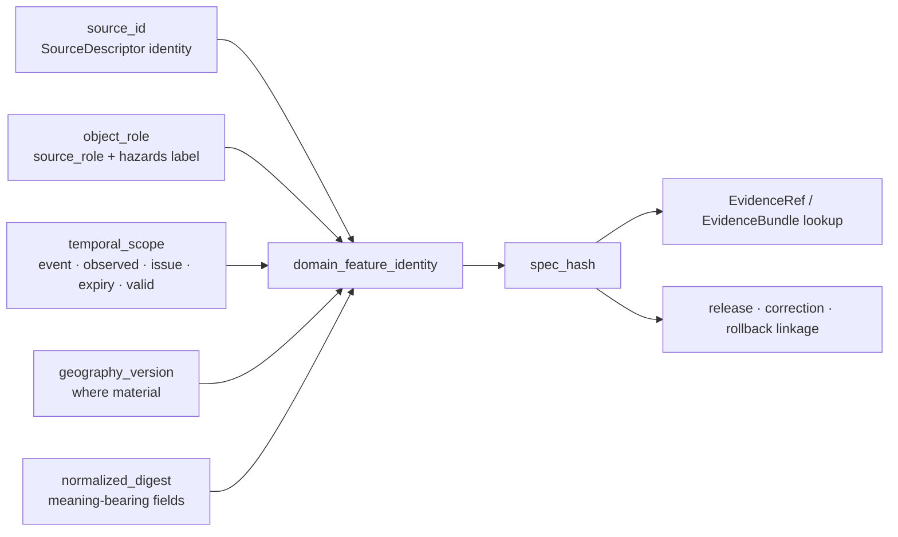

<!-- [KFM_META_BLOCK_V2]
doc_id: kfm://doc/contracts-domains-hazards-domain-feature-identity
title: Domain Feature Identity Contract — Hazards
type: semantic-contract
version: v0.2
status: draft; PROPOSED; NEEDS VERIFICATION before promotion
owners:
  - OWNER_TBD — Hazards domain steward
  - OWNER_TBD — Identity steward
  - OWNER_TBD — Contract steward
  - OWNER_TBD — Source steward
  - OWNER_TBD — Evidence steward
  - OWNER_TBD — Schema steward
  - OWNER_TBD — Policy steward
  - OWNER_TBD — Release steward
  - OWNER_TBD — Docs steward
created: 2026-06-22
updated: 2026-06-22
policy_label: public; semantic-contract; hazards; identity; source-role-aware; time-aware; not-for-life-safety; release-gated; rollback-aware
tags: [kfm, contracts, hazards, domain_feature_identity, feature-identity, deterministic-id, source-role, anti-collapse, temporal-scope, evidence-ref, evidence-bundle, spec-hash, correction, rollback, not-for-life-safety]
related:
  - ./README.md
  - ./domain_validation_report.md
  - ./hazards_decision_envelope.md
  - ../../../docs/domains/hazards/README.md
  - ../../../docs/domains/hazards/IDENTITY_MODEL.md
  - ../../../docs/domains/hazards/SOURCE_ROLE_MATRIX.md
  - ../../../docs/domains/hazards/PUBLICATION_AND_BOUNDARY.md
  - ../../../docs/domains/hazards/DATA_LIFECYCLE.md
  - ../../../docs/domains/hazards/GLOSSARY.md
  - ../../../docs/architecture/hazards-trust-membrane.md
  - ../../../docs/doctrine/directory-rules.md
  - ../../../schemas/contracts/v1/domains/hazards/domain_feature_identity.schema.json
  - ../../../policy/domains/hazards/
  - ../../../fixtures/domains/hazards/domain_feature_identity/
  - ../../../tests/domains/hazards/test_domain_feature_identity.*
  - ../../../data/registry/sources/hazards/
  - ../../../release/manifests/
notes:
  - "Expanded from a thin scaffold at contracts/domains/hazards/domain_feature_identity.md."
  - "The paired schema exists at schemas/contracts/v1/domains/hazards/domain_feature_identity.schema.json, but remains a PROPOSED scaffold with only spec_hash, id, and version fields plus additionalProperties=true."
  - "This contract is grounded in docs/domains/hazards/IDENTITY_MODEL.md and SOURCE_ROLE_MATRIX.md. It keeps deterministic ID derivation PROPOSED where doctrine flags it as unresolved."
  - "Operational warning/advisory role mapping remains CONFLICTED across Hazards docs; this file preserves that conflict rather than resolving it silently."
  - "Hazards identity does not authorize alerting, public release, life-safety guidance, or source-role upgrades."
[/KFM_META_BLOCK_V2] -->

<a id="top"></a>

# Domain Feature Identity Contract — Hazards

> Semantic contract for `domain_feature_identity`: the Hazards identity object that binds source, source role, object family, temporal scope, geography version, and normalized digest so hazard records can be de-duplicated, cited, validated, corrected, superseded, and rolled back without collapsing observed, regulatory, modeled, aggregate, administrative, candidate, or synthetic truth.

<p>
  
  
  
  
  
  
  
</p>

`contracts/domains/hazards/domain_feature_identity.md`

## Quick jumps

[Status](#status) · [Meaning](#meaning) · [Repo fit](#repo-fit) · [Schema posture](#schema-posture) · [Identity tuple](#identity-tuple) · [Source-role anti-collapse](#source-role-anti-collapse) · [Temporal identity rules](#temporal-identity-rules) · [Object-family identity matrix](#object-family-identity-matrix) · [Assertions](#assertions) · [Exclusions](#exclusions) · [Recommended fields](#recommended-fields) · [Lifecycle](#lifecycle) · [Validation](#validation) · [Rollback](#rollback) · [Evidence basis](#evidence-basis) · [Open questions](#open-questions)

---

## Status

> [!IMPORTANT]
> **Status:** `draft` / semantic contract  
> **Contract path:** `contracts/domains/hazards/domain_feature_identity.md`  
> **Schema path:** `schemas/contracts/v1/domains/hazards/domain_feature_identity.schema.json`  
> **Schema posture:** paired schema exists, but remains a `PROPOSED` scaffold with only `spec_hash`, `id`, and `version` visible and `additionalProperties: true`.  
> **Truth posture:** Hazards identity doctrine is rich and current in `docs/domains/hazards/IDENTITY_MODEL.md`; field-level schema shape, validator enforcement, fixtures, policy runtime, release artifacts, and public API behavior remain **NEEDS VERIFICATION**.

> [!CAUTION]
> Feature identity is not alert authority. Stable IDs help KFM cite, de-duplicate, correct, and roll back hazard knowledge. They do **not** turn KFM into a live warning source, life-safety instruction surface, or official emergency authority.

---

## Meaning

`domain_feature_identity` defines how a Hazards record becomes the **same object** or a **different object** across source systems, roles, time windows, geography versions, corrections, and releases.

In Hazards, two records may describe the same physical phenomenon but still be different KFM objects:

- a NOAA Storm Events record of a tornado;
- a FEMA disaster declaration associated with the same time period;
- a modeled reconstruction of a path or swath;
- an exposure summary derived from the event;
- a corrected source record after upstream revision.

They may cite the same underlying phenomenon, but they carry different source roles, evidence burdens, temporal scopes, and rollback behavior. Identity must preserve those differences.

The governing rule is:

```text
source_id + object_role + temporal_scope + normalized_digest
```

The confirmed doctrine says the primitives matter; the exact serialization, hash prefix, ID length, and canonicalization algorithm remain **PROPOSED / NEEDS VERIFICATION** until schema, validator, and ADR support settle them.

---

## Repo fit

| Responsibility | Path or root | This contract's role |
|---|---|---|
| Human-readable identity meaning | `contracts/domains/hazards/domain_feature_identity.md` | This file; semantic contract for Hazards feature identity. |
| Machine schema | `schemas/contracts/v1/domains/hazards/domain_feature_identity.schema.json` | CONFIRMED scaffold; field-level shape still thin. |
| Domain identity doctrine | `docs/domains/hazards/IDENTITY_MODEL.md` | Richer identity model and open questions. |
| Source-role doctrine | `docs/domains/hazards/SOURCE_ROLE_MATRIX.md` | Seven source-role channels and DENY patterns. |
| Publication boundary | `docs/domains/hazards/PUBLICATION_AND_BOUNDARY.md` | Not-for-life-safety boundary, publishable families, release gates. |
| Trust membrane | `docs/architecture/hazards-trust-membrane.md` | Official-source deferral, freshness/expiry, cross-lane ownership. |
| Contract root | `contracts/domains/hazards/README.md` | Directory contract meaning root and inventory. |
| Source registry | `data/registry/sources/hazards/` | Expected SourceDescriptor and activation records; implementation NEEDS VERIFICATION. |
| Policy | `policy/domains/hazards/` and possibly `policy/release/hazards/` | Expected anti-collapse, expiry, alert-authority, disclaimer, release gates. |
| Release | `release/` | ReleaseManifest, CorrectionNotice, RollbackCard, PromotionDecision. |

---

## Schema posture

| Schema fact | Current posture |
|---|---|
| Confirmed schema path | `schemas/contracts/v1/domains/hazards/domain_feature_identity.schema.json` |
| Schema status | `PROPOSED` |
| Schema title | `domain_feature_identity` |
| Visible properties | `spec_hash`, `id`, `version` |
| Required fields | `id` only |
| Additional properties | `true` |
| Contract pointer | `contracts/domains/hazards/domain_feature_identity.md` |
| Fixtures root | `fixtures/domains/hazards/domain_feature_identity/` |
| Validator pointer | `tools/validators/domains/hazards/validate_domain_feature_identity.py` |
| Policy pointer | `policy/domains/hazards/` |
| Field-level enforcement | NEEDS VERIFICATION |

This means the Markdown contract defines intended semantics, while the schema does not yet enforce the full identity tuple.

---

## Identity tuple

A Hazards feature identity is not a source-native ID alone. It is a governed tuple.



| Primitive | Meaning | Status |
|---|---|---|
| `source_id` | Stable source descriptor identity and authority context. | CONFIRMED doctrine / field shape PROPOSED. |
| `object_family` | Hazard family such as `HazardEvent`, `WarningContext`, `FloodContext`, `SmokeContext`. | CONFIRMED object vocabulary / file coverage NEEDS VERIFICATION. |
| `object_role` | Canonical seven-role source class plus hazards knowledge-character label. | CONFIRMED concept / operational-context mapping CONFLICTED. |
| `temporal_scope` | The time values that make this object this object. | CONFIRMED concept / field shape PROPOSED. |
| `geography_version` | Geography or regulatory panel/version when geometry participates in identity. | CONFIRMED concept / field shape PROPOSED. |
| `normalized_digest` | Deterministic digest over meaning-bearing normalized content. | CONFIRMED concept / algorithm details PROPOSED. |
| `spec_hash` | Hash used for identity/evidence matching. | CONFIRMED scaffold property / calculation NEEDS VERIFICATION. |

---

## Source-role anti-collapse

Source role is identity-bearing. A role change is not a metadata edit; it is a new or corrected governed object.

| Source role | Hazards example | Identity consequence |
|---|---|---|
| `observed` | USGS earthquake reading; NOAA Storm Events record; FIRMS hotspot. | Binds to observed/source time and observing source. |
| `regulatory` | FEMA NFHL flood-zone designation. | Binds to issuing authority, effective window, panel/version. |
| `modeled` | Smoke trajectory, drought surface, reconstructed swath. | Binds to model run receipt, inputs, model version, and bounds. |
| `aggregate` | County-year hazard frequency, drought rollup. | Binds to aggregation unit, window, source vintage, and receipt. |
| `administrative` | FEMA declaration, state proclamation, possibly operational warning issuance. | Binds to issuing authority and official record window. |
| `candidate` | Unmerged report or unreviewed connector output. | Identity may exist, but no public edge before governed transition. |
| `synthetic` | AI summary, simulated scene, reconstructed visualization. | Requires representation/reality-boundary context; never observed reality. |

> [!WARNING]
> The operational-warning/advisory/watch role mapping remains **CONFLICTED / NEEDS VERIFICATION** across Hazards docs. The canonical seven-role enum does not include `context`, while Hazards knowledge-character labels include `operational_warning`, `operational_advisory`, and `operational_watch`. This contract preserves the conflict and requires ADR/schema resolution before treating any mapping as final.

Denied collapses include:

- regulatory flood context as observed flood event;
- modeled smoke or flood surface as observed reading;
- aggregate drought/hazard summary as per-place truth;
- administrative declaration as observed damage event;
- candidate detection as verified public event;
- synthetic or AI content as observed reality;
- KFM warning context as KFM-issued emergency instruction.

---

## Temporal identity rules

Hazards identity is time-aware. Retrieval and release churn must not rotate object identity, but source/event/issue/expiry/effective windows often do.

| Time field | Participates in identity? | Why |
|---|---:|---|
| `event_time` / `observed_time` | Yes for observed records. | Distinguishes actual observed events or observations. |
| `issue_time` | Yes for warnings/advisories/watches. | Revised operational products may be new identities. |
| `expiry_time` | Yes for operational context. | Expiry bounds the official context window. |
| `valid_from` / `valid_to` | Yes for regulatory, modeled, forecast-like, or administrative validity. | Defines when the assertion applies. |
| `source_time` | Sometimes. | Used when source uses it as canonical assertion timestamp. |
| `retrieval_time` | No. | KFM fetch timing must not create new objects. |
| `release_time` | No. | Release scheduling must not create new objects. |
| `correction_time` | No at identity layer. | Correction is a governed relation, not silent mutation. |

> [!IMPORTANT]
> A record passing its `expiry_time` does not become a different identity. Its **state** changes. Serving it as current after expiry is a publication/policy failure, not an identity rotation.

---

## Object-family identity matrix

| Object family | Identity basis | Source-role pressure point | Temporal pressure point |
|---|---|---|---|
| `HazardEvent` | Source + role + event window + digest. | Observed vs reconstructed modeled event. | Event time/window. |
| `HazardObservation` | Source + observed time + observation digest. | Observation vs model estimate. | Observed/sampling time. |
| `WarningContext` | Source + operational label + issue/expiry + digest. | Administrative/observed/context conflict unresolved. | Issue/expiry. |
| `AdvisoryContext` | Same as warning context. | Same conflict unresolved. | Issue/expiry. |
| `DisasterDeclaration` | Issuer + declaration/incident period + digest. | Administrative vs regulatory where binding. | Declaration and incident period. |
| `FloodContext` | Source + regulatory/model/observed role + version/time + digest. | NFHL regulatory must not become observed flood. | Panel/effective date or model valid window. |
| `WildfireDetection` | Sensor/source + detection time + product tier + digest. | Detection is not ground-truth confirmation. | Acquisition/detection time. |
| `SmokeContext` | Source + role + analysis/valid time + digest. | Modeled trajectory vs observed smoke. | Analysis/valid window. |
| `DroughtIndicator` | Source + aggregation/model role + unit/window + digest. | Aggregate/model not per-place truth. | Indicator week/month/window. |
| `EarthquakeEvent` | USGS/source event ID + origin time + revision support + digest. | Observed event with modeled magnitude/location estimates. | Origin and revision. |
| `HeatColdEvent` | Source + observed/advisory/model role + event/valid window. | Advisory context vs observed event. | Event or advisory window. |
| `ExposureSummary` | Source/method + aggregation unit + input refs + digest. | Aggregate/model not asset-level truth. | Analysis/aggregation window. |
| `ResilienceSummary` | Source/method + unit/window + input refs + digest. | Administrative/model/aggregate inputs must remain visible. | Analysis window. |
| `HazardTimeline` | Composition spec + member identities + window + digest. | Timeline is derivative, not member truth. | Composition window. |
| `ImpactArea` | Source/method + geography version + event/model/effective window + digest. | Modeled/regulatory/observed distinction. | Effective/valid/event window. |

---

## Assertions

A reviewed `domain_feature_identity` object should assert:

1. **Stable identity** — the canonical ID is derived from the governed identity tuple, not from file path, display label, map style, or AI summary.
2. **Source-role integrity** — source role is fixed at admission and preserved through lifecycle transitions.
3. **Knowledge-character visibility** — Hazards-specific labels remain visible alongside the canonical role vocabulary.
4. **Temporal precision** — event/observed/issue/expiry/valid/source/retrieval/release/correction times are not collapsed.
5. **Geography-version awareness** — panel versions, boundary versions, aggregation units, and geometry revisions participate where material.
6. **Evidence resolution** — identity can support EvidenceRef/EvidenceBundle lookup without becoming evidence itself.
7. **Correction lineage** — correction and supersession retain prior identities and never silently overwrite them.
8. **Release separation** — publication state is not identity state; release is governed separately.
9. **Alert boundary** — no identity state authorizes KFM emergency alerting, safety instructions, or current operational authority.
10. **Rollback support** — affected identities can be traced into releases, derivatives, caches, and correction notices.

---

## Exclusions

| Misuse | Why it is denied or abstained |
|---|---|
| Source-native ID alone as KFM identity | Source IDs may collide, change, or omit role/time/evidence context. |
| Retrieval time as identity | Fetch cadence would create false object churn. |
| Release time as identity | Publication scheduling would create false object churn. |
| Role upgrade by promotion | Promotion is a governed transition, not source-role mutation. |
| Regulatory context as observed event | Source-role collapse; misleading hazard claim. |
| Modeled derivative as observation | Hides method, receipt, and uncertainty. |
| Aggregate as per-place truth | Breaks geometry and aggregation scope. |
| Candidate as public verified object | Bypasses review and quarantine. |
| Synthetic/AI summary as observed reality | Generated language is interpretive, not root truth. |
| Identity as release authority | ReleaseManifest and policy/review gates are separate. |
| Identity as life-safety permission | Hazards remains not-for-life-safety. |

---

## Recommended fields

The following fields are **PROPOSED** targets for future schema expansion. They are not enforced by the confirmed scaffold schema.

| Field | Meaning |
|---|---|
| `id` | Canonical Hazards feature identity ID. |
| `version` | Contract/object version. |
| `spec_hash` | Deterministic hash over normalized meaning-bearing identity spec. |
| `domain` | Must resolve to `hazards`. |
| `object_family` | Hazards object family. |
| `source_descriptor_ref` | SourceDescriptor identity, source role, authority, rights, cadence. |
| `source_record_ref` | Source-native ID/URL/table row where allowed. |
| `source_role` | Canonical seven-role source class. |
| `knowledge_character` | Hazards-specific label such as `operational_warning`, `remote_sensing_detection`, `regulatory_context`, etc. |
| `object_role` | Combined role object or stable role tuple. |
| `temporal_scope` | Identity-bearing time tuple. |
| `geography_version_ref` | Geography/panel/boundary version where material. |
| `normalized_digest` | Digest of normalized meaning-bearing content before ID derivation. |
| `canonicalization_profile` | Hash/canonicalization profile, e.g. JCS/URDNA decision once settled. |
| `evidence_ref_ids` | EvidenceRef IDs supported by or supporting this identity. |
| `evidence_bundle_ids` | Resolved EvidenceBundle IDs where available. |
| `policy_decision_refs` | Policy decisions affecting admissibility/release. |
| `release_refs` | ReleaseManifest/PromotionDecision refs. |
| `correction_refs` | CorrectionNotice/supersession refs. |
| `rollback_refs` | RollbackCard/rollback target refs. |
| `quality_flags` | Role conflict, missing source descriptor, missing time field, hash mismatch, stale state, sensitive join, release missing. |

---

## Lifecycle

| Phase | Identity handling |
|---|---|
| RAW | SourceDescriptor, source-native IDs, role, rights, source timestamps, payload/reference hash are captured. |
| WORK / QUARANTINE | Identity tuple is normalized; unresolved source role, missing temporal scope, hash errors, or unknown/unclassified records remain quarantined. |
| PROCESSED | Stable identities bind to normalized objects, receipts, validation reports, and evidence refs. |
| CATALOG / TRIPLET | EvidenceRef/EvidenceBundle lookup by spec/hash is possible; graph/triplet projections cite identity without replacing it. |
| RELEASE CANDIDATE | Release candidates confirm identity stability, source-role preservation, evidence closure, policy, review, correction path, and rollback target. |
| PUBLISHED | Public-safe artifacts serve identities through governed API/UI only; identity does not authorize alerting. |
| CORRECTED / SUPERSEDED | New or corrected identities link to prior identities with CorrectionNotice/supersession; prior evidence remains auditable. |

---

## Validation

Before this contract is promoted beyond draft:

- [ ] Expand `schemas/contracts/v1/domains/hazards/domain_feature_identity.schema.json` beyond the three visible scaffold fields.
- [ ] Confirm canonical field names for `source_role`, `knowledge_character`, `object_role`, `temporal_scope`, `geography_version_ref`, and `canonicalization_profile`.
- [ ] Resolve the operational warning/advisory/watch role mapping conflict by ADR or schema/policy decision.
- [ ] Add positive fixtures for observed events, regulatory flood context, modeled smoke context, administrative declaration, aggregate drought indicator, candidate detection, and corrected/superseded identities.
- [ ] Add negative fixtures for regulatory-as-observed, modeled-as-observed, aggregate-as-per-place, candidate-as-published, synthetic-as-observed, missing issue/expiry, retrieval-time identity churn, and missing EvidenceBundle resolution.
- [ ] Add validator coverage for deterministic digest, role preservation, temporal scope, geography-version participation, source descriptor resolution, evidence bundle resolution, correction lineage, release refs, and rollback refs.
- [ ] Confirm that Focus Mode and governed API deny or abstain on identity/source-role failures rather than generating fluent unsupported answers.
- [ ] Confirm every public Hazards payload with operational context includes not-for-life-safety disclaimer and official-source redirect.

Recommended finite outcomes:

| Condition | Outcome |
|---|---|
| Identity tuple, role, temporal scope, digest, evidence, policy, release, correction, and rollback resolve | `ANSWER` or allow public-safe reference |
| Evidence, role, time, geography version, or release support is incomplete | `ABSTAIN` / `HOLD` |
| Role collapse, live-alert framing, candidate public exposure, synthetic-as-observed, or stale-as-current would occur | `DENY` |
| Schema, validator, source read, canonicalization, hash, evidence lookup, or release lookup fails | `ERROR` |

---

## Rollback

Rollback is required when identity logic weakens source integrity, source-role separation, temporal stability, evidence resolution, correction lineage, release governance, or the not-for-life-safety boundary.

Rollback triggers include source-role reclassification without new SourceDescriptor/CorrectionNotice; identity hash algorithm drift; digest mismatch; retrieval-time or release-time churn rotating identities; operational warning shown current after expiry; NFHL/regulatory context presented as observed event; modeled smoke/flood/drought product presented as observed; candidate record published; synthetic/AI content treated as observed reality; public API/UI/AI bypassing governed interfaces; or release without EvidenceBundle, ReleaseManifest, correction path, and rollback target.

Rollback artifacts should include affected identity IDs, source descriptors, source-native refs, object-family refs, source-role refs, temporal scope, geography-version refs, normalized digest/spec hash, evidence refs/bundles, validation reports, policy decisions, release refs, correction notices, supersession links, rollback cards, invalidated downstream derivatives, and public-cache/style invalidation instructions.

---

## Evidence basis

| Source | Status | Supports | Limits |
|---|---|---|---|
| `contracts/domains/hazards/domain_feature_identity.md` scaffold | CONFIRMED | Target existed as a greenfield scaffold. | Did not contain authoritative identity details. |
| `schemas/contracts/v1/domains/hazards/domain_feature_identity.schema.json` | CONFIRMED | Schema pointer, current scaffold fields, fixtures/validator/policy pointers. | Does not enforce full identity model. |
| `docs/domains/hazards/IDENTITY_MODEL.md` | CONFIRMED | Identity primitives, object-family identity rules, temporal scope, geography versioning, failure modes, open role conflict. | Deterministic ID derivation is partly PROPOSED. |
| `docs/domains/hazards/SOURCE_ROLE_MATRIX.md` | CONFIRMED | Seven source-role channels, denied collapses, promotion-never-upgrades rule. | Some matrix cells remain proposed applications until fixtures enforce them. |
| `docs/domains/hazards/README.md` | CONFIRMED | Object families, source families, lifecycle, map/AI posture, validator expectations. | Some claims cite Atlas/ENC lineage and implementation remains verification-bound. |
| `docs/domains/hazards/PUBLICATION_AND_BOUNDARY.md` | CONFIRMED | Not-for-life-safety rule, publishable families, promotion gates, governed publication path. | It states many route/policy paths as PROPOSED where implementation was not proven. |
| `docs/architecture/hazards-trust-membrane.md` | CONFIRMED | Trust membrane, source families, expiry/freshness, anti-collapse, AI BOUNDED posture. | Architecture note marks some path claims as proposed. |
| `contracts/domains/hazards/README.md` | CONFIRMED | Contract-root boundaries and current contract inventory. | It is an orientation doc, not schema enforcement. |
| User-provided authoring role | CONFIRMED user instruction | Requires evidence-grounded, repo-ready Markdown and visible verification boundaries. | Authoring rule, not implementation proof. |

---

## Open questions

| Question | Status | Resolution path |
|---|---|---|
| What exact canonicalization profile should generate Hazards `spec_hash` values? | NEEDS VERIFICATION | Canonicalization ADR / schema steward decision. |
| Are hazards knowledge-character labels separate from `source_role`, or part of the canonical enum? | CONFLICTED / NEEDS VERIFICATION | ADR-S-04 / source-role schema review. |
| Which role should `WarningContext` and `AdvisoryContext` use: administrative, observed, context-posture carrier, or another approved mapping? | CONFLICTED / NEEDS VERIFICATION | Hazards ADR and fixture review. |
| Which fields must be required in `domain_feature_identity.schema.json`? | NEEDS VERIFICATION | Schema PR with valid/invalid fixtures. |
| Where should role-collapse policy live: `policy/domains/hazards/`, `policy/release/hazards/`, or shared source-role policy? | CONFLICTED / NEEDS VERIFICATION | Policy-root ADR / implementation review. |
| Which validator proves retrieval/release times do not rotate identity? | NEEDS VERIFICATION | Validator/test implementation. |

---

## Related contracts and docs

- [`./README.md`](./README.md) — Hazards contract-root README.
- [`./domain_validation_report.md`](./domain_validation_report.md) — planned validation-report contract scaffold.
- [`./hazards_decision_envelope.md`](./hazards_decision_envelope.md) — planned bounded runtime envelope scaffold.
- [`../../../docs/domains/hazards/IDENTITY_MODEL.md`](../../../docs/domains/hazards/IDENTITY_MODEL.md) — rich Hazards identity doctrine.
- [`../../../docs/domains/hazards/SOURCE_ROLE_MATRIX.md`](../../../docs/domains/hazards/SOURCE_ROLE_MATRIX.md) — source-role anti-collapse matrix.
- [`../../../docs/domains/hazards/README.md`](../../../docs/domains/hazards/README.md) — Hazards domain operating doctrine.
- [`../../../docs/domains/hazards/PUBLICATION_AND_BOUNDARY.md`](../../../docs/domains/hazards/PUBLICATION_AND_BOUNDARY.md) — publication and not-for-life-safety boundary.
- [`../../../docs/architecture/hazards-trust-membrane.md`](../../../docs/architecture/hazards-trust-membrane.md) — hazards trust-membrane architecture note.
- [`../../../schemas/contracts/v1/domains/hazards/domain_feature_identity.schema.json`](../../../schemas/contracts/v1/domains/hazards/domain_feature_identity.schema.json) — confirmed scaffold schema, pending expansion.

[Back to top](#top)
