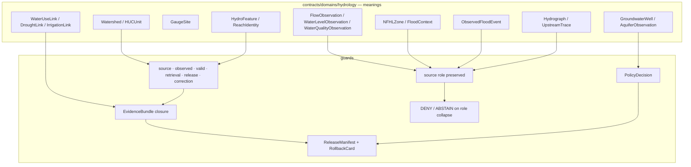

<!-- [KFM_META_BLOCK_V2]
doc_id: kfm://doc/contracts-domains-hydrology-readme
title: Hydrology Contracts — README
type: readme
version: v0.2
status: draft; PROPOSED; CONFLICTED path form; NEEDS VERIFICATION before promotion
owners:
  - OWNER_TBD — Hydrology domain steward
  - OWNER_TBD — Contracts steward
  - OWNER_TBD — Source steward
  - OWNER_TBD — Evidence steward
  - OWNER_TBD — Schema steward
  - OWNER_TBD — Policy steward
  - OWNER_TBD — Release steward
  - OWNER_TBD — Docs steward
created: 2026-06-22
updated: 2026-06-22
policy_label: public; contract-root; hydrology; evidence-bound; source-role-aware; not-for-life-safety; release-gated; rollback-aware
related:
  - ../../../docs/domains/hydrology/README.md
  - ../../../docs/domains/hydrology/BOUNDARY.md
  - ../../../docs/domains/hydrology/SOURCE_ROLE_MATRIX.md
  - ../../../docs/domains/hydrology/SOURCE_FAMILIES.md
  - ../../../docs/domains/hydrology/OBJECT_FAMILIES.md
  - ../../../docs/domains/hydrology/API_CONTRACTS.md
  - ../../../docs/domains/hydrology/CANONICAL_PATHS.md
  - ../../../docs/domains/hydrology/DATA_LIFECYCLE.md
  - ../../../docs/domains/hydrology/IDENTITY_MODEL.md
  - ../../../schemas/contracts/v1/domains/hydrology/README.md
  - ../../../policy/domains/hydrology/
  - ../../../fixtures/domains/hydrology/
  - ../../../tests/domains/hydrology/
  - ../../../pipelines/domains/hydrology/
  - ../../../pipeline_specs/hydrology/
  - ../../../data/registry/sources/hydrology/
  - ../../../release/candidates/hydrology/
tags: [kfm, contracts, hydrology, DOM-HYD, watershed, huc, gauge, flow-observation, water-level, water-quality, nfhl, source-role, evidence-bundle, release-manifest, rollback]
notes:
  - "Expanded from a generic greenfield scaffold at contracts/domains/hydrology/README.md."
  - "This directory owns human-readable Hydrology contract meanings. Machine shape stays in schemas/, policy in policy/, fixtures/tests in fixtures/ and tests/, lifecycle data in data/, and release decisions in release/."
  - "Hydrology doctrine confirms the lane is evidence-bound, time-aware, and an early proof-bearing thin slice. Implementation maturity remains PROPOSED / NEEDS VERIFICATION unless verified from current repo evidence."
  - "Hydrology is not an emergency flood-warning or life-safety instruction system. NFHL is regulatory context only and must never be presented as observed flooding."
  - "Path form remains CONFLICTED: Directory Rules / current mounted repo use contracts/domains/hydrology/ and schemas/contracts/v1/domains/hydrology/, while some Atlas/crosswalk material proposes flat contracts/hydrology/ and schemas/contracts/v1/hydrology/."
[/KFM_META_BLOCK_V2] -->

<a id="top"></a>

# Hydrology Contracts

> Contract-root README for KFM Hydrology object meanings: watersheds, HUC units, hydro features, gauges, observations, NFHL regulatory context, hydrographs, upstream traces, cross-domain links, and the governance boundaries that keep those claims evidence-bound, time-aware, source-role-safe, release-gated, and rollback-ready.

<p>
  
  
  
  
  
  
</p>

**Path:** `contracts/domains/hydrology/`  
**Status:** draft / contract-root README  
**Owners:** `OWNER_TBD` — assign Hydrology + Contracts + Source + Evidence + Policy + Release stewards before promotion.  
**Authority posture:** this directory defines **human-readable meaning**. It does not own schemas, policy, data, runtime, release authority, or emergency guidance.

## Quick jumps

[Mission](#mission) · [Non-negotiable boundaries](#non-negotiable-boundaries) · [Repo fit](#repo-fit) · [Accepted inputs](#accepted-inputs) · [Exclusions](#exclusions) · [Contract inventory](#contract-inventory) · [Object-family map](#object-family-map) · [Trust flow](#trust-flow) · [Source-role rules](#source-role-rules) · [Validation expectations](#validation-expectations) · [Rollback](#rollback) · [Evidence basis](#evidence-basis) · [Open questions](#open-questions)

---

## Mission

The `contracts/domains/hydrology/` directory is the **semantic contract root** for Hydrology-domain objects. It explains what Hydrology objects mean, how source role and temporal scope constrain them, what they can and cannot prove, how they relate to schemas/policy/tests/release artifacts, and what must fail closed before a public surface can answer.

Hydrology is an early proof-bearing lane because it exercises many core KFM primitives in one narrow slice: source-role discipline, HUC identity, gauge observations, NFHL regulatory context, hydrographic network identity, EvidenceBundle closure, governed API boundaries, publication review, correction, and rollback.

This README orients maintainers before they edit individual object contracts.

---

## Non-negotiable boundaries

> [!CAUTION]
> **KFM Hydrology is not an emergency flood-warning system.** It may expose cited, released, time-stamped water evidence and regulatory context, but it must not provide life-safety instructions, evacuation advice, current emergency warnings, or operational alert replacement.

> [!WARNING]
> **NFHL is regulatory context only.** FEMA NFHL / MSC material must not be presented as observed flooding, forecast inundation, hydraulic-model output, or real-time flood status.

> [!IMPORTANT]
> **Source role is fixed at admission.** An observed gauge reading does not become a regulatory determination; a modeled hydrograph does not become an observation; a HUC rollup does not become per-place truth; a candidate watcher output does not become public by being moved forward in the lifecycle.

---

## Repo fit

| Responsibility | Root | Hydrology posture |
|---|---|---|
| Human-readable object meaning | `contracts/domains/hydrology/` | This directory. Defines contract semantics and boundaries. |
| Machine-readable shape | `schemas/contracts/v1/domains/hydrology/` | JSON Schema home for Hydrology object shapes. Observed root README is still scaffolded. |
| Domain doctrine | `docs/domains/hydrology/` | Mission, scope, boundary, source roles, object families, APIs, paths, lifecycle, runbooks. |
| Source role / allowed claims | `docs/domains/hydrology/SOURCE_ROLE_MATRIX.md` | Human-readable matrix; SourceDescriptor/EvidenceBundle/policy remain machine authority. |
| Policy / admissibility | `policy/domains/hydrology/` | Expected OPA/policy gate home; enforcement remains NEEDS VERIFICATION unless tested. |
| Fixtures/tests | `fixtures/domains/hydrology/`, `tests/domains/hydrology/` | Expected valid/invalid contract fixtures and negative-path role-collapse tests. |
| Pipelines | `pipelines/domains/hydrology/`, `pipeline_specs/hydrology/` | Expected pipeline logic/spec homes. |
| Source registry | `data/registry/sources/hydrology/` | Expected SourceDescriptor home: source role, rights, cadence, activation. |
| Lifecycle data | `data/raw|work|quarantine|processed|catalog|published/.../hydrology/` | Lifecycle roots; public clients must not read pre-publication states directly. |
| Release authority | `release/candidates/hydrology/` and release roots | ReleaseManifest, PromotionDecision, CorrectionNotice, RollbackCard. |
| Runtime/API | `apps/governed-api/`, public UI surfaces | Public path must be governed API + released artifacts only. |

---

## Accepted inputs

Contract files here may define or cross-reference:

- Hydrology object meanings: `Watershed`, `HUCUnit`, `HydroFeature`, `ReachIdentity`, `GaugeSite`, `FlowObservation`, `WaterLevelObservation`, `WaterQualityObservation`, `GroundwaterWell`, `AquiferObservation`, `NFHLZone`, `ObservedFloodEvent`, `FloodContext`, `Hydrograph`, `UpstreamTrace`, `WaterUseLink`, `DroughtLink`, and `IrrigationLink`.
- Domain-wide envelopes such as feature identity, observation envelopes, layer descriptors, validation reports, decision envelopes, release/manifest references, and source descriptors where they are Hydrology-profiled.
- Human-readable constraints for source role, temporal basis, evidence support, valid scope, CRS/geometry posture, sensitivity, publication state, correction lineage, and rollback.
- Contract links to source families including USGS Water Data / NWIS, WBD / HUC, NHDPlus HR / 3DHP, FEMA NFHL / MSC, 3DEP terrain, state water offices, water-quality and groundwater programs, irrigation/drought sources, and historical observed flood evidence.
- Negative examples that protect the lane: NFHL-as-observed-flood, modeled-hydrograph-as-observation, aggregate-as-per-place, direct RAW/WORK public read, emergency warning replacement, and private-property/well-owner inference.

---

## Exclusions

Do **not** put these here:

| Exclusion | Correct responsibility root |
|---|---|
| JSON Schema source of truth | `schemas/contracts/v1/domains/hydrology/` |
| OPA/Rego or policy implementation | `policy/domains/hydrology/` or cross-cutting policy roots |
| Test fixtures | `fixtures/domains/hydrology/` |
| Test code | `tests/domains/hydrology/` |
| Runtime/API route code | `apps/governed-api/` or runtime/application roots |
| Connector code | `connectors/` under source-specific connector homes, not this contract root |
| RAW/WORK/QUARANTINE/PROCESSED/CATALOG/PUBLISHED data | `data/` lifecycle roots |
| Release manifests, release candidates, correction notices, rollback cards | `release/` roots |
| Emergency flood warnings, evacuation advice, or life-safety guidance | Out of KFM Hydrology scope; defer to official authorities |
| Canonical Soil, Agriculture, Geology, Infrastructure, Habitat, Fauna, Flora, land/title, or Spatial Foundation truth | Owning domain/lane; Hydrology cites or borrows context only |

---

## Contract inventory

### Confirmed contract files observed by repo search

| File | Current posture | Role |
|---|---|---|
| [`README.md`](./README.md) | Replaced scaffold with this README. | Contract-root orientation and governance checklist. |
| [`huc_unit.md`](./huc_unit.md) | CONFIRMED path from repo search; content not inspected in this pass. | HUCUnit semantic contract candidate. |
| [`hydrograph.md`](./hydrograph.md) | CONFIRMED path from repo search; content not inspected in this pass. | Hydrograph semantic contract candidate. |
| [`irrigation_link.md`](./irrigation_link.md) | CONFIRMED path from repo search; content not inspected in this pass. | Irrigation cross-domain link contract candidate. |
| [`nfhl_zone.md`](./nfhl_zone.md) | CONFIRMED path from repo search; content not inspected in this pass. | NFHL regulatory context contract candidate. |

### Expected contract families

The Hydrology doctrine names additional object families that should have or may need contracts here. Presence, completeness, and schema alignment remain **NEEDS VERIFICATION** unless inspected file-by-file.

| Contract family | Purpose | Required boundary |
|---|---|---|
| `Watershed` / `HUCUnit` | Drainage-area and HUC identity anchors. | Vintage-aware WBD/HUC context; not parcel/title truth. |
| `HydroFeature` / `ReachIdentity` | Hydrographic feature and stable reach identity. | Ambiguous reach identity must ABSTAIN, not guess. |
| `GaugeSite` | Monitoring-location identity. | Site metadata is separate from observations. |
| `FlowObservation` / `WaterLevelObservation` / `WaterQualityObservation` | Observed readings with time, unit, qualifier, and source role. | Observed ≠ forecast/model/regulatory. |
| `GroundwaterWell` / `AquiferObservation` | Well/aquifer-state context. | Private-property/well-owner implications require review/generalization. |
| `NFHLZone` / `FloodContext` | FEMA regulatory flood-hazard context. | Regulatory only; never observed inundation. |
| `ObservedFloodEvent` | Observed inundation record with evidence. | Cannot be derived from NFHL alone. |
| `Hydrograph` | Time-series projection, observed or modeled. | Must carry role flag and receipt/uncertainty where modeled. |
| `UpstreamTrace` | Network traversal result. | Derived result; not source truth. |
| `WaterUseLink` / `DroughtLink` / `IrrigationLink` | Cross-domain link objects. | Preserve ownership, source role, sensitivity, and evidence on both sides. |

---

## Object-family map



---

## Trust flow

Every Hydrology contract should preserve this lane shape:

```text
SourceDescriptor / source payload or source reference
  -> RAW immutable capture
  -> WORK normalization or QUARANTINE with reason
  -> PROCESSED validated object + EvidenceRef + ValidationReport
  -> CATALOG / TRIPLET with EvidenceBundle closure
  -> RELEASE CANDIDATE with PolicyDecision + ReviewRecord + ReleaseManifest + RollbackCard
  -> PUBLISHED public-safe artifact served only through governed API/UI
```

Contract files here define the object meaning at the center of the flow. They do not own the lifecycle storage or the promotion gate.

---

## Source-role rules

Hydrology contracts must preserve the source-role matrix. Role mismatch is a publication-blocking condition, not a minor quality issue.

| Role | Hydrology example | Contract consequence |
|---|---|---|
| `observed` | USGS gauge reading, water-quality measurement, observed flood evidence. | May support observation contracts if time, unit, qualifier, and evidence resolve. |
| `regulatory` | FEMA NFHL flood-zone designation. | May support `NFHLZone` / `FloodContext`; must not become observed flood. |
| `modeled` | Hydrograph reconstruction, derived catchment, terrain-derived hydro surface. | Requires model/run/uncertainty support; must not become observation. |
| `aggregate` | HUC rollup, drought/irrigation summary. | Must keep aggregation unit/window; must not become per-place truth. |
| `administrative` | State water-right roster, well registry, allocation summary. | Administrative context only unless separate observed evidence supports a claim. |
| `candidate` | Quarantined flood mark, unmerged watcher output. | No public edge before governed review/promotion. |
| `synthetic` | AI-drafted summary or reconstruction. | Never observed reality; belongs to governed AI/representation posture, not source admission. |

---

## Validation expectations

Before this contract root is treated as more than draft, reviewers should verify:

- [ ] This directory contains one contract per confirmed Hydrology object family, or an explicit backlog entry for missing contracts.
- [ ] Every contract states source role, identity, temporal scope, evidence support, sensitivity posture, release posture, correction path, and rollback target.
- [ ] `NFHLZone` and `ObservedFloodEvent` remain separate contract families and cannot cite each other as equivalent truth.
- [ ] `Hydrograph` explicitly distinguishes observed series from modeled series and requires receipt/uncertainty for modeled outputs.
- [ ] Groundwater/well/private-property-sensitive contracts include redaction/generalization/review rules.
- [ ] Cross-domain link contracts preserve owning-lane truth and EvidenceBundle support on both sides.
- [ ] Schema files in `schemas/contracts/v1/domains/hydrology/` match contract intent, or drift is logged.
- [ ] Policy and tests cover negative paths: NFHL-as-observed, modeled-as-observed, aggregate-as-per-place, candidate-as-public, emergency-warning replacement, uncited AI answer, and direct RAW/WORK public read.
- [ ] Release artifacts can roll back published Hydrology layers and invalidate downstream derivatives.

Observed implementation boundary from current inspection:

- This contract README was a generic scaffold before replacement.
- `schemas/contracts/v1/domains/hydrology/README.md` is also a generic scaffold.
- Repo search confirms several Hydrology contracts and schemas exist, but this pass did not inspect each file's maturity.
- Hydrology docs repeatedly mark implementation, validators, routes, fixtures, and schema field realization as **PROPOSED / NEEDS VERIFICATION**.

---

## Rollback

Rollback is required when a Hydrology contract weakens source-role integrity, creates schema/contract drift, hides path conflicts, bypasses release gates, or permits public interpretation that outruns evidence.

Rollback triggers include:

- NFHL regulatory context presented as observed flooding, forecast inundation, hydraulic-model output, or real-time flood status;
- observed gauge readings used as modeled/forecast outputs without model receipt;
- modeled hydrographs presented as observations;
- aggregate HUC/drought/irrigation outputs treated as per-place facts;
- private well / owner / infrastructure-sensitive details exposed without review/generalization;
- public API/UI/AI surfaces reading RAW, WORK, QUARANTINE, or unreleased candidates directly;
- KFM Hydrology answer framed as flood warning, evacuation advice, or other life-safety instruction;
- schema/path migration creates parallel authority between `contracts/domains/hydrology/` and `contracts/hydrology/`;
- release lacks EvidenceBundle, PolicyDecision, ReleaseManifest, CorrectionNotice path, or RollbackCard.

Rollback artifacts should include affected contract path, schema refs, source descriptors, evidence refs/bundles, validation reports, policy decisions, release refs, correction notices, rollback cards, invalidated layer descriptors, invalidated public artifacts, and cache/style invalidation instructions.

---

## Evidence basis

| Source | Status | Supports | Limits |
|---|---|---|---|
| `contracts/domains/hydrology/README.md` scaffold | CONFIRMED | Target existed as a generic greenfield scaffold. | Did not contain domain-specific contract-root detail. |
| `docs/domains/hydrology/README.md` | CONFIRMED | Hydrology mission, scope, owned/not-owned objects, path pattern, lifecycle, AI posture, publication/rollback posture, path conflict. | Several implementation claims remain PROPOSED / NEEDS VERIFICATION. |
| `docs/domains/hydrology/SOURCE_ROLE_MATRIX.md` | CONFIRMED | Seven role vocabulary, permitted/cannot-prove matrix, NFHL-as-observed DENY, promotion-never-upgrades rule. | Matrix is navigational; SourceDescriptor/EvidenceBundle/policy are machine authority. |
| `docs/domains/hydrology/OBJECT_FAMILIES.md` | CONFIRMED | Object-family spine, shared invariants, observation/flood/derived families, field-realization posture. | It notes some object-family and field details are inferred/proposed. |
| `docs/domains/hydrology/BOUNDARY.md` | CONFIRMED | Bounded-context owns/does-not-own rules, three hard seams, cross-lane edges, deny-by-default boundary. | It states many path-shaped claims as proposed pending repo inspection. |
| `docs/domains/hydrology/API_CONTRACTS.md` | CONFIRMED | Governed API/trust-membrane posture, finite outcomes, Hydrology surfaces, excluded public paths, AI/API boundaries. | It marks route names and implementation as PROPOSED / NEEDS VERIFICATION. |
| `docs/domains/hydrology/CANONICAL_PATHS.md` | CONFIRMED | Responsibility-root path law for Hydrology and path-form conflict. | It is path doctrine, not proof that every path is materialized. |
| `schemas/contracts/v1/domains/hydrology/README.md` scaffold | CONFIRMED | Adjacent schema root exists but is still generic. | Does not prove schema completeness. |
| Repo search for `contracts/domains/hydrology` | CONFIRMED search result | Several contract and schema paths exist. | Search result alone does not prove content quality or validator maturity. |
| User-provided authoring role | CONFIRMED user instruction | Requires evidence-grounded, repo-ready Markdown and visible verification boundaries. | Authoring rule, not implementation proof. |

---

## Open questions

| Question | Status | Resolution path |
|---|---|---|
| Which Hydrology object contracts are already fully expanded vs still scaffolded? | NEEDS VERIFICATION | Inspect each contract and paired schema. |
| Should the canonical contract path remain `contracts/domains/hydrology/` or migrate to flat `contracts/hydrology/`? | CONFLICTED / NEEDS VERIFICATION | Directory Rules / Atlas reconciliation, ADR-S-01 / ADR-0001 / drift register. |
| Which fields must be required across all Hydrology schemas? | NEEDS VERIFICATION | Schema review with valid/invalid fixtures. |
| Which policy files enforce source-role anti-collapse and public-release gates? | NEEDS VERIFICATION | Inspect `policy/domains/hydrology/` and tests. |
| Which validators prove NFHL regulatory context cannot be published as observed flooding? | NEEDS VERIFICATION | Validator/test implementation review. |
| Which release manifests and rollback cards exist for the first Hydrology proof slice? | NEEDS VERIFICATION | Inspect release candidates and published artifacts. |

---

## Related docs

- [`../../../docs/domains/hydrology/README.md`](../../../docs/domains/hydrology/README.md) — Hydrology domain landing page.
- [`../../../docs/domains/hydrology/BOUNDARY.md`](../../../docs/domains/hydrology/BOUNDARY.md) — Hydrology bounded-context boundary.
- [`../../../docs/domains/hydrology/SOURCE_ROLE_MATRIX.md`](../../../docs/domains/hydrology/SOURCE_ROLE_MATRIX.md) — source-role prove/cannot-prove grid.
- [`../../../docs/domains/hydrology/SOURCE_FAMILIES.md`](../../../docs/domains/hydrology/SOURCE_FAMILIES.md) — source-family catalog.
- [`../../../docs/domains/hydrology/OBJECT_FAMILIES.md`](../../../docs/domains/hydrology/OBJECT_FAMILIES.md) — Hydrology object catalog.
- [`../../../docs/domains/hydrology/API_CONTRACTS.md`](../../../docs/domains/hydrology/API_CONTRACTS.md) — governed API posture and finite outcomes.
- [`../../../docs/domains/hydrology/CANONICAL_PATHS.md`](../../../docs/domains/hydrology/CANONICAL_PATHS.md) — responsibility-root path map.
- [`../../../schemas/contracts/v1/domains/hydrology/README.md`](../../../schemas/contracts/v1/domains/hydrology/README.md) — schema-root README scaffold.
- [`../../../docs/runbooks/hydrology/PROMOTION_RUNBOOK.md`](../../../docs/runbooks/hydrology/PROMOTION_RUNBOOK.md) — Hydrology promotion runbook, if maintained.
- [`../../../docs/runbooks/hydrology/ROLLBACK_RUNBOOK.md`](../../../docs/runbooks/hydrology/ROLLBACK_RUNBOOK.md) — Hydrology rollback runbook, if maintained.

[Back to top](#top)
