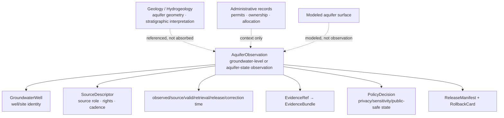

<!-- [KFM_META_BLOCK_V2]
doc_id: kfm://doc/contracts-domains-hydrology-aquifer-observation
title: Aquifer Observation Contract — Hydrology
type: semantic-contract
version: v0.2
status: draft; PROPOSED; schema-missing; NEEDS VERIFICATION before promotion
owners:
  - OWNER_TBD — Hydrology domain steward
  - OWNER_TBD — Groundwater/aquifer steward
  - OWNER_TBD — Contracts steward
  - OWNER_TBD — Source steward
  - OWNER_TBD — Evidence steward
  - OWNER_TBD — Schema steward
  - OWNER_TBD — Policy steward
  - OWNER_TBD — Sensitivity reviewer
  - OWNER_TBD — Release steward
  - OWNER_TBD — Docs steward
created: 2026-06-22
updated: 2026-06-22
policy_label: public-with-gates; semantic-contract; hydrology; aquifer-observation; groundwater; observed-role; private-property-risk; evidence-bound; release-gated; rollback-aware
related:
  - ./README.md
  - ./groundwater_well.md
  - ../../../docs/domains/hydrology/README.md
  - ../../../docs/domains/hydrology/GLOSSARY.md
  - ../../../docs/domains/hydrology/OBJECT_FAMILIES.md
  - ../../../docs/domains/hydrology/SOURCE_ROLE_MATRIX.md
  - ../../../docs/domains/hydrology/BOUNDARY.md
  - ../../../docs/domains/hydrology/API_CONTRACTS.md
  - ../../../docs/domains/hydrology/FILE_SYSTEM_PLAN.md
  - ../../../schemas/contracts/v1/domains/hydrology/aquifer_observation.schema.json
  - ../../../schemas/contracts/v1/domains/hydrology/groundwater_well.schema.json
  - ../../../policy/domains/hydrology/
  - ../../../fixtures/domains/hydrology/aquifer_observation/
  - ../../../tests/domains/hydrology/test_aquifer_observation.*
  - ../../../data/registry/sources/hydrology/
  - ../../../release/candidates/hydrology/
tags: [kfm, contracts, hydrology, aquifer-observation, groundwater, groundwater-well, source-role, observed, administrative, aggregate, modeled, sensitivity, evidence-bundle, policy-decision, release-manifest, rollback]
notes:
  - "Expanded from a thin scaffold at contracts/domains/hydrology/aquifer_observation.md."
  - "The exact paired schema path schemas/contracts/v1/domains/hydrology/aquifer_observation.schema.json was not found in this session. Schema shape remains MISSING / NEEDS VERIFICATION."
  - "GroundwaterWell schema exists, but is only a PROPOSED scaffold and does not enforce AquiferObservation fields."
  - "AquiferObservation is treated as a Hydrology observation envelope for groundwater-level or aquifer-state readings; aquifer geometry/geologic interpretation remains cross-lane with Geology/Hydrogeology and must not be silently absorbed."
  - "Private well, parcel, owner, infrastructure, and sensitive groundwater joins fail closed or require review/generalization before publication."
[/KFM_META_BLOCK_V2] -->

# Aquifer Observation Contract — Hydrology

> Semantic contract for `AquiferObservation`: a source-role-aware, time-scoped groundwater-level or aquifer-state observation in the Hydrology lane, linked to a well, aquifer context, source record, evidence bundle, policy decision, release state, correction path, and rollback target without exposing private-property-sensitive detail or absorbing Geology's aquifer-geometry authority.

  
  
  
  
  
  
  

`contracts/domains/hydrology/aquifer_observation.md`

## Quick jumps

[Status](#status) · [Meaning](#meaning) · [Repo fit](#repo-fit) · [Schema posture](#schema-posture) · [Observation boundaries](#observation-boundaries) · [Assertions](#assertions) · [Exclusions](#exclusions) · [Recommended fields](#recommended-fields) · [Source-role rules](#source-role-rules) · [Temporal rules](#temporal-rules) · [Sensitivity and publication](#sensitivity-and-publication) · [Lifecycle](#lifecycle) · [Validation](#validation) · [Rollback](#rollback) · [Evidence basis](#evidence-basis) · [Open questions](#open-questions)

---

## Status

> [!IMPORTANT]
> **Status:** `draft` / semantic contract  
> **Contract path:** `contracts/domains/hydrology/aquifer_observation.md`  
> **Expected schema path:** `schemas/contracts/v1/domains/hydrology/aquifer_observation.schema.json`  
> **Schema posture:** exact paired schema was **not found** in this session. The nearest inspected schema, `groundwater_well.schema.json`, exists but is only a `PROPOSED` scaffold with empty `properties` and `additionalProperties: true`.  
> **Truth posture:** `AquiferObservation` is confirmed as a Hydrology term in the glossary and described as a groundwater-level or aquifer-state observation. Field-level schema shape, validators, fixtures, policy enforcement, release artifacts, and public API behavior remain **NEEDS VERIFICATION**.

> [!CAUTION]
> An `AquiferObservation` is not a water-right claim, not a parcel/title claim, not a private-well owner record, not a full aquifer geometry model, not a withdrawal/allocation authority, not a model forecast, and not an emergency water-supply instruction.

---

## Meaning

`AquiferObservation` represents a groundwater-level or aquifer-state observation admitted into the Hydrology lane with source role, time, place, unit, method/qualifier, evidence support, and policy posture preserved.

It may describe observations such as:

- groundwater level or depth-to-water at a monitored well;
- aquifer-state readings linked to a `GroundwaterWell` or monitoring site;
- water-level change where the source provides observation time and measurement basis;
- quality-controlled or provisional aquifer-state readings where qualifier/provisional status is preserved;
- public-safe generalized derivatives of an aquifer observation after release review.

It must remain distinct from:

- `GroundwaterWell` identity and construction metadata;
- aquifer geometry or stratigraphic/hydrogeologic interpretation owned by Geology/Hydrogeology;
- water-right, permit, allocation, or ownership/parcel records;
- modeled aquifer surfaces, reconstructions, forecasts, or interpolations;
- aggregate HUC/county/aquifer summaries;
- AI summaries or synthetic reconstructions.

---

## Repo fit

| Responsibility | Path or root | This contract's role |
|---|---|---|
| Human-readable object meaning | `contracts/domains/hydrology/aquifer_observation.md` | This file; semantic contract for AquiferObservation. |
| Contract root | `contracts/domains/hydrology/README.md` | Defines Hydrology contract-root boundaries and object-family expectations. |
| Related well identity contract | `contracts/domains/hydrology/groundwater_well.md` | Expected companion for well/site identity; presence/content NEEDS VERIFICATION. |
| Machine schema | `schemas/contracts/v1/domains/hydrology/aquifer_observation.schema.json` | Expected path, but **not found** in this session. |
| Nearest inspected schema | `schemas/contracts/v1/domains/hydrology/groundwater_well.schema.json` | Exists as a scaffold only; not AquiferObservation shape. |
| Domain doctrine | `docs/domains/hydrology/README.md` | Hydrology scope, object families, source roles, lifecycle, publication, AI posture. |
| Object catalog | `docs/domains/hydrology/OBJECT_FAMILIES.md` | GroundwaterWell/AquiferObservation context and shared invariants. |
| Glossary | `docs/domains/hydrology/GLOSSARY.md` | Ubiquitous-language definition. |
| Source-role matrix | `docs/domains/hydrology/SOURCE_ROLE_MATRIX.md` | Observed/admin/model/aggregate/candidate/synthetic role boundaries. |
| Policy | `policy/domains/hydrology/` | Expected exposure and role-collapse gates. |
| Fixtures/tests | `fixtures/domains/hydrology/aquifer_observation/`, `tests/domains/hydrology/` | Expected proof of field shape and negative cases. |
| Release | `release/candidates/hydrology/` and release roots | ReleaseManifest, CorrectionNotice, RollbackCard. |

---

## Schema posture

| Schema fact | Current posture |
|---|---|
| Expected schema path | `schemas/contracts/v1/domains/hydrology/aquifer_observation.schema.json` |
| Exact schema found? | **No** — GitHub fetch returned not found in this session. |
| Related inspected schema | `schemas/contracts/v1/domains/hydrology/groundwater_well.schema.json` |
| Related schema status | `PROPOSED` scaffold |
| Related schema visible fields | Empty `properties`, `additionalProperties: true` |
| Field-level enforcement | MISSING / NEEDS VERIFICATION |
| Contract promotion status | HOLD until schema, fixtures, validators, policy, and release tests exist |

This Markdown file therefore defines intended semantics for review and future schema work. It does not prove machine validation.

---

## Observation boundaries

The observation is the measured or source-reported aquifer-state fact. It does not make the well/site, the geologic aquifer body, the modeled groundwater surface, the permit, or the private property record sovereign truth inside Hydrology.

---

## Assertions

A reviewed `AquiferObservation` should assert:

1. **Observation identity** — stable object ID and `spec_hash` over source, role, time, linked well/aquifer context, measurement basis, and normalized digest.
2. **Source role** — usually `observed`, with any `candidate`, `administrative`, `aggregate`, `modeled`, or `synthetic` material kept separate and labeled.
3. **Linked well/site** — reference to `GroundwaterWell`, monitoring site, or source-provided well identity where allowed.
4. **Aquifer context** — aquifer or hydrogeologic context by reference only, not redefined geometry.
5. **Measurement basis** — observed value, unit, datum/reference point, method, qualifier/provisional state, and no-data flags where available.
6. **Temporal scope** — observed time, source time, valid time, retrieval time, release time, and correction time kept distinct.
7. **Spatial posture** — source geometry and public geometry role recorded separately; private or sensitive detail generalized/redacted where required.
8. **Evidence closure** — EvidenceRef resolves to EvidenceBundle before public claims.
9. **Policy/review support** — private-property, well-owner, sensitive infrastructure, and restricted-data risks route through policy/review.
10. **Release separation** — ReleaseManifest, CorrectionNotice path, and RollbackCard are required before public release.

---

## Exclusions

| Misuse | Why it is denied or abstained |
|---|---|
| Treating a well registry row as an aquifer observation | Administrative/site identity is not a measurement unless the source supplies a measured aquifer-state value. |
| Treating aquifer geometry as Hydrology-owned truth | Aquifer geometry/stratigraphy belongs to Geology/Hydrogeology context; Hydrology may reference it. |
| Treating modeled groundwater surfaces as observed aquifer readings | Modeled products require model/run/uncertainty support and must not be relabeled observed. |
| Treating aggregate aquifer summaries as per-well truth | Aggregate loses per-record fidelity. |
| Exposing private-well or owner/parcel inference | Private-property/living-person-adjacent risks fail closed or require review/generalization. |
| Treating retrieval/release time as observation time | KFM fetch or publication timing is not source observation timing. |
| Public direct read from RAW/WORK/QUARANTINE | Public clients use governed APIs and released artifacts only. |
| AI summary as evidence | AI is interpretive; EvidenceBundle is the admissible support. |
| Emergency or operational water-supply instruction | KFM Hydrology is not life-safety guidance. |

---

## Recommended fields

The following fields are **PROPOSED** targets for future schema expansion. They are not enforced by a confirmed AquiferObservation schema in this session.

| Field | Meaning |
|---|---|
| `id` | Canonical AquiferObservation ID. |
| `version` | Contract/object version. |
| `spec_hash` | Deterministic digest over normalized observation semantics. |
| `domain` | Must resolve to `hydrology`. |
| `object_type` | `AquiferObservation`. |
| `source_descriptor_ref` | SourceDescriptor identity, role, rights, cadence, attribution, authority limits. |
| `source_record_ref` | Source-native record, row, URL, or measurement ID where allowed. |
| `source_role` | Usually `observed`; other roles must not be relabeled observation. |
| `linked_groundwater_well_ref` | `GroundwaterWell` or monitoring-site reference. |
| `aquifer_context_ref` | Aquifer/hydrogeologic context reference, likely cross-lane with Geology. |
| `measurement_type` | groundwater_level, depth_to_water, head, storage_indicator, withdrawal_context, or accepted enum. |
| `measurement_value` | Numeric or coded value as supplied. |
| `unit` | Source unit, normalized unit, and conversion receipt where converted. |
| `datum_or_reference_point` | Vertical datum, land-surface datum, measuring point, or source reference basis where available. |
| `qualifier` | Provisional/final, estimated, censored, no-data, QA flags, source caveats. |
| `observed_time` | When the aquifer-state value was observed/measured. |
| `source_time` | When the source published/updated/asserted the record. |
| `valid_time` | Validity window when source provides one. |
| `retrieval_time` | KFM fetch time; not observation truth. |
| `release_time` | KFM release time; not observation truth. |
| `correction_time` | Correction/supersession time; never silent mutation. |
| `spatial_scope_ref` | Source location, generalized public location, or withheld geometry reference. |
| `geometry_role` | exact_internal, generalized_public, aggregate_public, withheld, restricted, or accepted enum. |
| `evidence_ref_ids` | EvidenceRefs supporting the observation. |
| `evidence_bundle_ids` | Resolved EvidenceBundles for claims/release. |
| `policy_decision_refs` | Policy decisions for rights/sensitivity/public exposure. |
| `review_record_refs` | Steward/sensitivity review decisions. |
| `release_refs` | ReleaseManifest/PromotionDecision refs if public. |
| `correction_refs` | CorrectionNotice/supersession refs. |
| `rollback_refs` | RollbackCard/rollback target refs. |
| `quality_flags` | missing_source_role, missing_unit, missing_datum, provisional_only, private_property_risk, sensitive_geometry, modeled_as_observed, aggregate_as_per_well, schema_missing, release_missing. |

---

## Source-role rules

| Role | AquiferObservation handling |
|---|---|
| `observed` | Valid basis for measured aquifer-state observations when source/time/unit/evidence resolve. |
| `candidate` | May exist before validation, but no public edge before governed review/promotion. |
| `administrative` | May identify well/site/permit context; not an aquifer-state observation by itself. |
| `aggregate` | May support aquifer/HUC/county summaries; not per-well observation truth. |
| `modeled` | May support modeled groundwater/aquifer surfaces; must remain modeled with receipt/uncertainty. |
| `regulatory` | May support regulatory/admin context; not observed aquifer-state measurement unless separately evidenced. |
| `synthetic` | Never observed reality; requires representation/AI boundary if used. |

---

## Temporal rules

| Time field | Rule |
|---|---|
| `observed_time` | Required for observation claims where source supplies measurement time. |
| `source_time` | Required where source update/publication time matters. |
| `valid_time` | Required where source supplies an effective/valid window. |
| `retrieval_time` | KFM fetch time; never substitutes for observed time. |
| `release_time` | KFM publication time; never substitutes for source/observed time. |
| `correction_time` | Correction lineage; never silent overwrite. |

If the source provides only partial temporal support, the observation should be held, narrowed, or public-framed with explicit uncertainty rather than treated as a complete time-scoped claim.

---

## Sensitivity and publication

Aquifer observations are not automatically restricted, but they are **review-required** when they expose or enable:

- private well locations;
- owner/parcel/property inference;
- sensitive infrastructure exposure;
- restricted groundwater source terms;
- precise location joins to land/title/living-person data;
- vulnerable resource, drought, extraction, or water-supply risk claims;
- unpublished candidate measurements or unreviewed source records.

Public release should prefer generalized or aggregate geometry when exact location is unnecessary. If precise internal geometry is retained, public derivatives must separate `source_geometry` from `public_geometry` and carry policy/redaction/review receipts.

---

## Lifecycle

| Phase | AquiferObservation handling |
|---|---|
| RAW | Capture source payload/reference, source role, source-native record ID, observed/source times, value, unit, datum/reference basis, location, and rights/sensitivity metadata. |
| WORK / QUARANTINE | Normalize measurement, unit, datum, well link, aquifer context, geometry role, and evidence refs; quarantine missing role/time/unit/datum, rights gaps, private-property risk, or model/aggregate/candidate confusion. |
| PROCESSED | Emit validated observation candidate with EvidenceRef, ValidationReport, source-role posture, and quality flags. |
| CATALOG / TRIPLET | Catalog/triplet projections cite the observation by identity and evidence; projections do not become truth. |
| RELEASE CANDIDATE | Public-safe derivative resolves EvidenceBundle, PolicyDecision, ReviewRecord where needed, ReleaseManifest, CorrectionNotice path, and RollbackCard. |
| PUBLISHED | Governed API/UI may serve public-safe observation or aggregate/generalized derivative; public clients do not read RAW/WORK/QUARANTINE directly. |
| CORRECTED / SUPERSEDED | Source correction, unit/datum correction, well-link correction, geometry redaction, or policy change creates correction/supersession lineage and invalidates affected derivatives. |

---

## Validation

Before this contract is promoted beyond draft:

- [ ] Create or verify `schemas/contracts/v1/domains/hydrology/aquifer_observation.schema.json`.
- [ ] Decide required fields for observed value, unit, datum/reference point, observed time, linked well, aquifer context, geometry role, evidence refs, policy refs, and release refs.
- [ ] Confirm whether `AquiferObservation` is a first-class schema object or a subtype/profile of `GroundwaterWell` / `WaterLevelObservation`.
- [ ] Add positive fixtures for observed aquifer-state measurement, provisional reading, generalized public derivative, and corrected observation.
- [ ] Add negative fixtures for administrative well row as observation, modeled surface as observation, aggregate as per-well truth, missing unit, missing datum/reference point, missing observed time, private well exact-location public exposure, and missing EvidenceBundle.
- [ ] Add validator coverage for source role, value/unit/datum, temporal fields, linked well, aquifer context, geometry role, sensitive join, evidence, policy, release, correction, and rollback.
- [ ] Confirm `policy/domains/hydrology/` denies or restricts private-property and sensitive infrastructure exposures.
- [ ] Confirm public UI/API uses governed API and released artifacts only.

Recommended finite outcomes:

| Condition | Outcome |
|---|---|
| Observation, source role, value/unit/datum, time, evidence, policy, release, correction, and rollback resolve | `ANSWER` or allow public-safe reference |
| Evidence, time, unit, datum, source role, well link, aquifer context, or release support is incomplete | `ABSTAIN` / `HOLD` |
| Private-property/sensitive exposure, modeled-as-observed, aggregate-as-per-well, candidate-as-public, or direct RAW/WORK read would occur | `DENY` |
| Schema, validator, evidence lookup, source read, policy lookup, or release lookup fails | `ERROR` |

---

## Rollback

Rollback is required when aquifer observation handling weakens source integrity, role separation, time/unit/datum correctness, sensitivity posture, evidence closure, release governance, or correction lineage.

Rollback triggers include missing or invalid schema; observation published without unit/datum/reference basis; observed time collapsed with retrieval or release time; private well or owner/parcel inference exposed; aquifer geometry redefined as Hydrology-owned truth; modeled groundwater surface presented as observed; aggregate summary presented as per-well observation; administrative well registry row presented as aquifer-state measurement; candidate record published; EvidenceBundle, PolicyDecision, ReviewRecord, ReleaseManifest, CorrectionNotice, or RollbackCard missing; source correction invalidates a value/unit/time/well link; or public UI/API reads RAW/WORK/QUARANTINE directly.

Rollback artifacts should include affected AquiferObservation IDs, linked well refs, aquifer context refs, source descriptors, source-native refs, value/unit/datum fields, temporal scope, geometry refs, evidence refs/bundles, validation reports, policy decisions, review records, release refs, correction notices, rollback cards, invalidated downstream derivatives, and public-cache/style invalidation instructions.

---

## Evidence basis

| Source | Status | Supports | Limits |
|---|---|---|---|
| `contracts/domains/hydrology/aquifer_observation.md` scaffold | CONFIRMED | Target existed as a planned scaffold from the file-system plan. | Did not contain authoritative semantics. |
| `schemas/contracts/v1/domains/hydrology/aquifer_observation.schema.json` fetch | CONFIRMED missing in this session | Exact paired schema was not found at expected path. | Does not prove no schema exists elsewhere. |
| `schemas/contracts/v1/domains/hydrology/groundwater_well.schema.json` | CONFIRMED | Related groundwater schema path exists. | It is only a PROPOSED scaffold and does not define AquiferObservation. |
| `docs/domains/hydrology/GLOSSARY.md` | CONFIRMED | Defines AquiferObservation as groundwater-level or aquifer-state observation and notes Geology cross-lane boundary. | Field realization remains PROPOSED. |
| `docs/domains/hydrology/OBJECT_FAMILIES.md` | CONFIRMED | Places GroundwaterWell among observation families and states shared invariants: identity, temporal handling, source role, cite-or-abstain. | Some field details are inferred/proposed. |
| `docs/domains/hydrology/SOURCE_ROLE_MATRIX.md` | CONFIRMED | Seven source roles and anti-collapse rules: observed, regulatory, modeled, aggregate, administrative, candidate, synthetic. | Matrix is navigational; machine authority is SourceDescriptor/EvidenceBundle/policy. |
| `docs/domains/hydrology/README.md` | CONFIRMED | Hydrology owns groundwater well/aquifer observations, source-role rules, lifecycle, AI, publication/rollback posture. | Several implementation details remain PROPOSED / NEEDS VERIFICATION. |
| `docs/domains/hydrology/BOUNDARY.md` | CONFIRMED | Bounded-context seams, sensitive/private-property implications, cross-lane boundaries. | Path-shaped claims are partly proposed. |
| `contracts/domains/hydrology/README.md` | CONFIRMED | Contract-root boundaries and validation expectations. | It is an orientation doc, not schema enforcement. |
| User-provided authoring role | CONFIRMED user instruction | Requires evidence-grounded, repo-ready Markdown and visible verification boundaries. | Authoring rule, not implementation proof. |

---

## Open questions

| Question | Status | Resolution path |
|---|---|---|
| Should `AquiferObservation` have its own schema or be modeled as a profile/subtype of `GroundwaterWell` or `WaterLevelObservation`? | NEEDS VERIFICATION | Schema steward + Hydrology/Geology review. |
| Which datum/reference-point fields are required before public release? | NEEDS VERIFICATION | Source analysis and schema/fixture design. |
| Which aquifer-context field points to Geology/Hydrogeology without absorbing geologic truth? | NEEDS VERIFICATION | Cross-lane contract review. |
| Which exact geometry roles are allowed for public aquifer observations? | NEEDS VERIFICATION | Policy/sensitivity review. |
| Which source families can provide admissible aquifer observations under reviewed rights/cadence? | NEEDS VERIFICATION | SourceDescriptor registry review. |
| Which validator proves modeled/aggregate/admin groundwater records cannot become observed AquiferObservation? | NEEDS VERIFICATION | Negative fixtures and validator implementation. |

---

## Related contracts and docs

- [`./README.md`](./README.md) — Hydrology contract-root README.
- [`./groundwater_well.md`](./groundwater_well.md) — expected companion for well identity; verify presence/content before relying on it.
- [`../../../docs/domains/hydrology/GLOSSARY.md`](../../../docs/domains/hydrology/GLOSSARY.md) — Hydrology vocabulary.
- [`../../../docs/domains/hydrology/OBJECT_FAMILIES.md`](../../../docs/domains/hydrology/OBJECT_FAMILIES.md) — object-family catalog.
- [`../../../docs/domains/hydrology/SOURCE_ROLE_MATRIX.md`](../../../docs/domains/hydrology/SOURCE_ROLE_MATRIX.md) — source-role anti-collapse matrix.
- [`../../../docs/domains/hydrology/README.md`](../../../docs/domains/hydrology/README.md) — Hydrology domain landing page.
- [`../../../docs/domains/hydrology/BOUNDARY.md`](../../../docs/domains/hydrology/BOUNDARY.md) — bounded-context boundary.
- [`../../../docs/domains/hydrology/FILE_SYSTEM_PLAN.md`](../../../docs/domains/hydrology/FILE_SYSTEM_PLAN.md) — planned path source for this scaffold.
- [`../../../schemas/contracts/v1/domains/hydrology/groundwater_well.schema.json`](../../../schemas/contracts/v1/domains/hydrology/groundwater_well.schema.json) — related scaffold schema.

[Back to top](#top)
