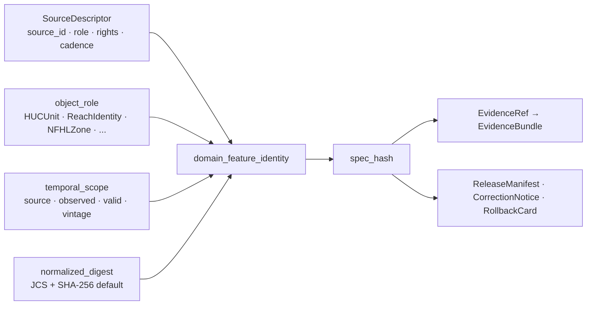

<!-- [KFM_META_BLOCK_V2]
doc_id: kfm://doc/contracts-domains-hydrology-domain-feature-identity
title: Domain Feature Identity Contract — Hydrology
type: semantic-contract
version: v0.2
status: draft; PROPOSED; NEEDS VERIFICATION before promotion
owners:
  - OWNER_TBD — Hydrology domain steward
  - OWNER_TBD — Identity steward
  - OWNER_TBD — Contracts steward
  - OWNER_TBD — Source steward
  - OWNER_TBD — Evidence steward
  - OWNER_TBD — Schema steward
  - OWNER_TBD — Policy steward
  - OWNER_TBD — Release steward
  - OWNER_TBD — Docs steward
created: 2026-06-22
updated: 2026-06-22
policy_label: public-with-gates; semantic-contract; hydrology; feature-identity; deterministic-id; source-role-aware; time-aware; evidence-bound; release-gated; rollback-aware
related:
  - ./README.md
  - ./decision_envelope.md
  - ./domain_layer_descriptor.md
  - ./domain_observation.md
  - ./domain_validation_report.md
  - ./huc_unit.md
  - ./hydrograph.md
  - ./nfhl_zone.md
  - ./aquifer_observation.md
  - ../../../docs/domains/hydrology/IDENTITY_MODEL.md
  - ../../../docs/domains/hydrology/SOURCE_ROLE_MATRIX.md
  - ../../../docs/domains/hydrology/OBJECT_FAMILIES.md
  - ../../../docs/domains/hydrology/README.md
  - ../../../docs/domains/hydrology/CANONICAL_PATHS.md
  - ../../../schemas/contracts/v1/domains/hydrology/domain_feature_identity.schema.json
  - ../../../policy/domains/hydrology/
  - ../../../fixtures/domains/hydrology/domain_feature_identity/
  - ../../../tests/domains/hydrology/test_domain_feature_identity.*
  - ../../../data/registry/sources/hydrology/
  - ../../../release/candidates/hydrology/
tags: [kfm, contracts, hydrology, domain-feature-identity, deterministic-identity, spec-hash, source-role, temporal-scope, EvidenceRef, EvidenceBundle, SourceDescriptor, NFHL, HUC, ReachIdentity, rollback]
notes:
  - "Expanded from a greenfield scaffold at contracts/domains/hydrology/domain_feature_identity.md."
  - "The paired schema exists at schemas/contracts/v1/domains/hydrology/domain_feature_identity.schema.json, but it remains a PROPOSED stub with only spec_hash, id, and version properties; only id is required and additionalProperties=true."
  - "Hydrology identity doctrine confirms the rule shape source_id + object_role + temporal_scope + normalized_digest; field-level realization and per-object normalization remain PROPOSED / NEEDS VERIFICATION."
  - "This contract preserves source-role anti-collapse: NFHL regulatory context is not observed flooding, modeled hydrographs are not observations, and aggregate HUC rollups are not per-place truth."
  - "Identity supports EvidenceRef/EvidenceBundle, release, correction, and rollback lookup; it is not source truth, proof, release authority, policy, public layer, or emergency guidance."
[/KFM_META_BLOCK_V2] -->

<a id="top"></a>

# Domain Feature Identity Contract — Hydrology

> Semantic contract for `domain_feature_identity`: the Hydrology identity object that binds source, source role, object family, temporal scope, geography/version context, and normalized digest so Hydrology claims can be deduplicated, cited, validated, corrected, superseded, released, and rolled back without collapsing regulatory, observed, modeled, aggregate, administrative, candidate, or synthetic truth.

<p>
  
  
  
  
  
  
  
</p>

`contracts/domains/hydrology/domain_feature_identity.md`

## Quick jumps

[Status](#status) · [Meaning](#meaning) · [Repo fit](#repo-fit) · [Schema posture](#schema-posture) · [Identity tuple](#identity-tuple) · [Source-role anti-collapse](#source-role-anti-collapse) · [Object-family identity map](#object-family-identity-map) · [Temporal rules](#temporal-rules) · [Hash posture](#hash-posture) · [Assertions](#assertions) · [Exclusions](#exclusions) · [Recommended fields](#recommended-fields) · [Lifecycle](#lifecycle) · [Validation](#validation) · [Rollback](#rollback) · [Evidence basis](#evidence-basis) · [Open questions](#open-questions)

---

## Status

> [!IMPORTANT]
> **Status:** `draft` / semantic contract  
> **Contract path:** `contracts/domains/hydrology/domain_feature_identity.md`  
> **Schema path:** `schemas/contracts/v1/domains/hydrology/domain_feature_identity.schema.json`  
> **Schema posture:** paired schema exists, but remains a `PROPOSED` stub with only `spec_hash`, `id`, and `version` visible. Only `id` is required and `additionalProperties: true` is still allowed.  
> **Truth posture:** Hydrology identity doctrine is strong and explicit; implementation-specific field names, per-object normalization, validators, fixtures, policy enforcement, emitted identities, API routing, release artifacts, and CI/test coverage remain **NEEDS VERIFICATION**.

> [!CAUTION]
> `domain_feature_identity` is not the feature payload, not source truth, not an EvidenceBundle, not a ReleaseManifest, not a public layer, and not emergency flood guidance. It is the stable identity scaffold that lets Hydrology claims be traced, compared, corrected, and rolled back without role collapse.

---

## Meaning

Hydrology `domain_feature_identity` defines how KFM decides that a Hydrology object is the **same object** or a **different object** across source vintages, roles, temporal scopes, geometry versions, corrections, and releases.

Two Hydrology records may overlap spatially or describe the same physical area while remaining distinct identities:

- a FEMA `NFHLZone` regulatory polygon and an `ObservedFloodEvent` are not the same fact;
- an NWIS gauge reading and a modeled hydrograph segment are not the same fact;
- a HUC-level rollup and a per-place observation are not the same fact;
- a corrected source record may supersede a prior identity without silently overwriting audit history.

Hydrology identity is therefore not a display ID, file path, internal database key, or map feature handle. It is a deterministic evidence-governance object.

---

## Repo fit

| Responsibility | Path or root | This contract's role |
|---|---|---|
| Human-readable identity meaning | `contracts/domains/hydrology/domain_feature_identity.md` | This file; semantic contract for Hydrology feature identity. |
| Machine schema | `schemas/contracts/v1/domains/hydrology/domain_feature_identity.schema.json` | Confirmed stub; field-level identity tuple is not enforced yet. |
| Hydrology identity doctrine | `docs/domains/hydrology/IDENTITY_MODEL.md` | Governs deterministic identity rule, temporal rules, hash posture, edge cases, and lifecycle. |
| Source-role doctrine | `docs/domains/hydrology/SOURCE_ROLE_MATRIX.md` | Defines role vocabulary and anti-collapse behavior. |
| Contract root | `contracts/domains/hydrology/README.md` | Directory root and object-family boundaries. |
| Decision envelope | `contracts/domains/hydrology/decision_envelope.md` | Runtime finite-outcome carrier for `ANSWER`, `ABSTAIN`, `DENY`, and `ERROR`. |
| Source registry | `data/registry/sources/hydrology/` | Expected SourceDescriptor instances that supply source identity, role, rights, cadence, and authority. |
| Policy | `policy/domains/hydrology/` | Expected role-collapse, access, sensitivity, and release gates. |
| Fixtures/tests | `fixtures/domains/hydrology/domain_feature_identity/`, `tests/domains/hydrology/` | Expected proof for valid identities and negative cases. |
| Release | `release/candidates/hydrology/` and release roots | ReleaseManifest, CorrectionNotice, RollbackCard, and promotion decisions. |

---

## Schema posture

| Schema fact | Current posture |
|---|---|
| Confirmed schema path | `schemas/contracts/v1/domains/hydrology/domain_feature_identity.schema.json` |
| Schema status | `PROPOSED` |
| Schema title | `domain_feature_identity` |
| Visible properties | `spec_hash`, `id`, `version` |
| Required fields | `id` only |
| Additional properties | `true` |
| Contract pointer | `contracts/domains/hydrology/domain_feature_identity.md` |
| Fixtures pointer | `fixtures/domains/hydrology/domain_feature_identity/` |
| Validator pointer | `tools/validators/domains/hydrology/validate_domain_feature_identity.py` |
| Policy pointer | `policy/domains/hydrology/` |
| Full identity tuple enforcement | NEEDS VERIFICATION |

This Markdown file defines meaning. The schema currently does not prove enforcement of `source_id`, `object_role`, `temporal_scope`, normalized digest construction, source-role anti-collapse, evidence closure, release closure, or rollback linkage.

---

## Identity tuple

Hydrology doctrine defines the identity rule shape as:

```text
identity(object) = f(source_id, object_role, temporal_scope, normalized_digest)
```

| Component | Meaning | Current posture |
|---|---|---|
| `source_id` | Registered source identity, source family, source role, rights, cadence, and authority context. | CONFIRMED doctrine; schema field realization PROPOSED. |
| `object_role` | Hydrology object family, such as `HUCUnit`, `ReachIdentity`, `GaugeSite`, `FlowObservation`, `NFHLZone`, or `Hydrograph`. | CONFIRMED vocabulary; schema field realization PROPOSED. |
| `temporal_scope` | Source, observed, valid, vintage, or event window that participates in identity. | CONFIRMED doctrine; schema field realization PROPOSED. |
| `normalized_digest` | Digest over canonicalized identity-bearing content. | CONFIRMED default approach; per-object normalization NEEDS VERIFICATION. |
| `spec_hash` | Stored hash/digest field for deterministic comparison. | Confirmed schema property; exact semantics NEEDS VERIFICATION. |
| `id` | Canonical identifier. | Confirmed required schema property; derivation NEEDS VERIFICATION. |
| `version` | Contract/object version. | Confirmed optional schema property. |



---

## Source-role anti-collapse

Source role is identity-bearing. Changing role changes the meaning of the identity.

| Role | Hydrology exemplar | Identity consequence |
|---|---|---|
| `observed` | NWIS stream-gauge stage, flow, water-quality, groundwater/aquifer observation. | Binds to observed/source time, unit/qualifier, source record, and EvidenceBundle. |
| `regulatory` | FEMA NFHL flood-zone designation. | Separate identity from observed flood event even where geometry overlaps. |
| `modeled` | Hydrograph reconstruction, terrain-derived catchment, modeled hydro surface. | Requires model/run/uncertainty support; never relabeled observed. |
| `aggregate` | HUC rollup, drought class by county, watershed summary. | Identity binds aggregation unit/window; never per-place truth. |
| `administrative` | Well registry, water-right roster, allocation summary. | Administrative context; not observation unless separate observed evidence exists. |
| `candidate` | Quarantined flood mark, unmerged watcher output. | No public identity edge until governed admission/review. |
| `synthetic` | AI-drafted summary or simulation. | Never observed reality; generated text is interpretive only. |

> [!WARNING]
> NFHL regulatory context and observed inundation cannot share an identity. Even if geometries overlap, their source roles, EvidenceBundles, release manifests, UI badges, and rollback paths are separate.

---

## Object-family identity map

| Object family | What identity distinguishes | Typical source anchor | Temporal scope |
|---|---|---|---|
| `Watershed` | Drainage-area evidence or released derivative. | WBD/HUC source vintage. | Snapshot vintage / valid interval. |
| `HUCUnit` | HUC2–HUC12 accounting unit. | WBD snapshot. | Snapshot vintage. |
| `HydroFeature` | Flowline, waterbody, or hydrographic feature. | NHDPlus / 3DHP source version. | Vintage band. |
| `ReachIdentity` | Stable reach across source vintages. | NHDPlus/3DHP identifier plus version. | Vintage band / valid interval. |
| `GaugeSite` | Monitoring site identity. | NWIS/state station ID. | Site lifetime. |
| `FlowObservation` | Discharge or streamflow reading. | NWIS series + parameter. | Instant or aggregation window. |
| `WaterLevelObservation` | Stage/gage-height reading. | NWIS series + parameter. | Instant or aggregation window. |
| `WaterQualityObservation` | Parameter measurement. | Program/station/sample ID. | Sampling instant/window. |
| `GroundwaterWell` | Well/site of record. | State/NWIS well registry. | Well lifetime. |
| `AquiferObservation` | Groundwater-level or aquifer-state observation. | Source reading + well/site ref. | Measurement instant/window. |
| `NFHLZone` / `FloodContext` | Regulatory flood-hazard context. | NFHL panel + effective date. | Effective interval. |
| `ObservedFloodEvent` | Observed inundation evidence. | Historical/observed source family. | Event interval. |
| `Hydrograph` | Time-series view or derivative. | Composition of source observations/models. | Inherited from inputs. |
| `UpstreamTrace` | Network traversal result. | Source graph/version + algorithm. | Input/source vintage. |
| `WaterUseLink` / `DroughtLink` / `IrrigationLink` | Cross-domain relation. | Both owning lanes' identities. | Relation window / source vintage. |

---

## Temporal rules

Hydrology identity keeps six time dimensions separate where material.

| Time | Identity role | Contract rule |
|---|---|---|
| `source_time` | Source vintage/update/assertion. | May participate in source/vintage identity. |
| `observed_time` | When phenomenon or measurement occurred. | Required for observation identities where available. |
| `valid_time` | When a claim or regulatory assertion applies. | Required for NFHL/regulatory/model validity windows. |
| `retrieval_time` | When KFM fetched the bytes. | Does not rotate identity by itself. |
| `release_time` | When KFM published a public artifact. | Release-plane event; not source/object identity by itself. |
| `correction_time` | When a correction/supersession was recorded. | Rotates identity only when evidentiary content changes. |

Collapsing source, observed, valid, retrieval, release, and correction times is an identity-corruption risk and should fail closed.

---

## Hash posture

Hydrology identity uses KFM's deterministic `spec_hash` posture, but per-object normalization remains review work.

| Hash concern | Current posture |
|---|---|
| Default canonicalization | RFC 8785 JSON Canonicalization Scheme (JCS). |
| Default digest | SHA-256 with explicit prefix, e.g. `jcs:sha256:<hex>`. |
| URDNA2015 | Reserved for RDF-semantic equivalence cases. |
| Derived `eb-` / `er-` prefix scheme | PROPOSED / NEEDS VERIFICATION. |
| Per-object field inclusion | NEEDS VERIFICATION by schema/fixture/validator. |
| Hash-policy ADR | NEEDS VERIFICATION before alternate digest algorithms are treated as canonical. |

Included identity-bearing fields should be limited to evidentiary meaning. Retrieval timestamp, storage path, serializer formatting, run nonce, and transport encoding must not rotate identity.

---

## Assertions

A reviewed `domain_feature_identity` should assert:

1. **Stable identity** — `id` is tied to source, role, temporal scope, and normalized digest, not path or display label.
2. **Digest support** — `spec_hash` records algorithm-prefixed deterministic content hash.
3. **SourceDescriptor link** — source identity, role, rights, cadence, and authority limits are resolvable.
4. **Source-role integrity** — role is fixed at admission and preserved through promotion.
5. **Object-family boundary** — HUC, reach, gauge, observation, NFHL, hydrograph, groundwater, and cross-link identities do not collapse.
6. **Temporal separation** — source, observed, valid, retrieval, release, and correction times remain distinct.
7. **Evidence support** — EvidenceRef/EvidenceBundle can resolve from or cite the identity where claims depend on evidence.
8. **Policy/release support** — PolicyDecision, ReviewRecord, ReleaseManifest, CorrectionNotice, and RollbackCard can reference the identity.
9. **Public-surface safety** — public API/UI/AI surfaces expose identity only through governed APIs and released artifacts.
10. **Correction lineage** — superseded identities remain auditable; corrections do not silently mutate past claims.

---

## Exclusions

| Misuse | Why it is denied or abstained |
|---|---|
| File path or storage URL as identity | Paths can move and are excluded from the digest. |
| Retrieval time as identity | Fetch cadence must not create object churn. |
| Release time as identity | Publication timing is not source/object truth. |
| NFHL identity reused for observed flood | Regulatory and observed facts are separate identities. |
| Modeled hydrograph identity reused for observation | Modeled and observed source roles differ. |
| HUC aggregate as per-place observation | Aggregate identity cannot prove a point fact. |
| Candidate watcher output as public identity | Watchers are non-publishers; admission/promotion is governed. |
| AI summary as identity evidence | AI is interpretive and cannot become source truth. |
| Cross-domain object absorbed into Hydrology | Owning lane keeps canonical identity; Hydrology cites via relation. |
| Identity as release authority | ReleaseManifest/PromotionDecision remains separate. |

---

## Recommended fields

The following fields are **PROPOSED** targets for future schema expansion. They are not enforced by the current schema stub.

| Field | Meaning |
|---|---|
| `id` | Canonical Hydrology identity ID. |
| `version` | Contract/object version. |
| `spec_hash` | Algorithm-prefixed deterministic digest over normalized identity-bearing fields. |
| `domain` | Must resolve to `hydrology`. |
| `object_family` | Hydrology object family, e.g. `HUCUnit`, `ReachIdentity`, `NFHLZone`. |
| `source_descriptor_ref` | SourceDescriptor ref supplying source ID, role, rights, cadence, and authority. |
| `source_record_ref` | Source-native record ID/ref where allowed. |
| `source_role` | Canonical role: observed, regulatory, modeled, aggregate, administrative, candidate, synthetic. |
| `object_role` | Object-family role used in the deterministic tuple. |
| `temporal_scope` | Source/observed/valid/vintage/event window participating in identity. |
| `geography_version_ref` | WBD/NHDPlus/NFHL/panel/snapshot/version ref where material. |
| `normalized_digest` | Digest over normalized identity content if distinct from `spec_hash`. |
| `canonicalization_profile` | JCS/SHA-256 or ADR-approved profile. |
| `evidence_ref_ids` | EvidenceRefs linked to identity. |
| `evidence_bundle_ids` | EvidenceBundles supporting claims tied to identity. |
| `policy_decision_refs` | Policy decisions affecting admission/publication. |
| `release_refs` | ReleaseManifest / PromotionDecision refs. |
| `correction_refs` | CorrectionNotice/supersession refs. |
| `rollback_refs` | RollbackCard/rollback target refs. |
| `quality_flags` | role_conflict, missing_source_descriptor, missing_temporal_scope, digest_mismatch, ambiguous_reach, nfhl_observed_collapse, schema_stub, release_missing. |

---

## Lifecycle

| Phase | Identity handling |
|---|---|
| Pre-RAW | Watcher signals may exist, but no public identity is minted. |
| RAW | Source payload/reference and SourceDescriptor context are captured. |
| WORK / QUARANTINE | Identity tuple is normalized; failures such as missing role, ambiguous reach, digest mismatch, or source-rights gaps are held. |
| PROCESSED | Stable identity, `spec_hash`, EvidenceRef, ValidationReport, and quality flags are emitted where validation passes. |
| CATALOG / TRIPLET | Identity can participate in EvidenceBundle and graph/triplet projections; projections do not become sovereign truth. |
| RELEASE CANDIDATE | Release state, evidence closure, policy/review, correction path, and rollback target are checked. |
| PUBLISHED | Public surfaces see identity through governed APIs and released artifacts only. |
| CORRECTED / SUPERSEDED | CorrectionNotice links old/new identity state; identity rotates only when evidentiary content changes. |

---

## Validation

Before this contract is promoted beyond draft:

- [ ] Expand `schemas/contracts/v1/domains/hydrology/domain_feature_identity.schema.json` beyond `spec_hash`, `id`, and `version`.
- [ ] Decide required identity fields for `source_descriptor_ref`, `source_role`, `object_family`, `object_role`, `temporal_scope`, `geography_version_ref`, and `canonicalization_profile`.
- [ ] Confirm per-object normalization rules for HUC, reach, gauge, observation, NFHL, hydrograph, groundwater, and cross-link identities.
- [ ] Add valid fixtures for HUCUnit, ReachIdentity, GaugeSite, FlowObservation, WaterLevelObservation, GroundwaterWell, AquiferObservation, NFHLZone, ObservedFloodEvent, Hydrograph, and UpstreamTrace identities.
- [ ] Add invalid fixtures for NFHL-as-observed, modeled-as-observed, aggregate-as-per-place, candidate-as-published, missing SourceDescriptor, missing temporal scope, missing algorithm prefix, retrieval-time identity churn, and ambiguous reach identity.
- [ ] Confirm validator behavior for `ANSWER`, `ABSTAIN`, `DENY`, and `ERROR` alignment with `decision_envelope` and API doctrine.
- [ ] Confirm source-role policy and fixtures prove promotion never upgrades role.
- [ ] Confirm release artifacts can locate and roll back every published identity.

Recommended finite outcomes:

| Condition | Outcome |
|---|---|
| Identity tuple, source role, temporal scope, digest, evidence, policy, release, correction, and rollback resolve | `ANSWER` or release-eligible reference |
| Identity is ambiguous, evidence insufficient, source role unresolved, temporal scope incomplete, or reach crosswalk unsupported | `ABSTAIN` / `HOLD` |
| Role collapse, policy denial, sensitive exposure, candidate public release, or life-safety/public-path bypass would occur | `DENY` |
| Schema, canonicalization, hash, source lookup, validator, evidence lookup, policy, or release lookup fails | `ERROR` |

---

## Rollback

Rollback is required when Hydrology identity handling weakens source-role integrity, deterministic hashing, evidence closure, release governance, path/schema authority, or public trust boundaries.

Rollback triggers include `spec_hash` algorithm drift; missing algorithm prefix; per-object normalization change without migration; identity churn due to retrieval/release time; NFHL regulatory context merged with observed flood identity; modeled hydrograph identity reused as observation; HUC aggregate reused as per-place fact; candidate watcher output published; SourceDescriptor missing or role changed without CorrectionNotice; cross-lane identity absorbed into Hydrology; public API/UI/AI bypassing governed surfaces; release without EvidenceBundle, ReleaseManifest, CorrectionNotice path, and RollbackCard; or schema/contract mismatch after a migration.

Rollback artifacts should include affected identity IDs, object-family refs, SourceDescriptor refs, source-native refs, temporal scope, geography/version refs, canonicalization profile, `spec_hash`, EvidenceRefs/EvidenceBundles, ValidationReports, PolicyDecisions, ReleaseManifests, CorrectionNotices, RollbackCards, invalidated layer descriptors, invalidated decision envelopes, invalidated public artifacts, and cache/style invalidation instructions.

---

## Evidence basis

| Source | Status | Supports | Limits |
|---|---|---|---|
| `contracts/domains/hydrology/domain_feature_identity.md` scaffold | CONFIRMED | Target existed as a greenfield scaffold. | Did not contain Hydrology-specific identity semantics. |
| `schemas/contracts/v1/domains/hydrology/domain_feature_identity.schema.json` | CONFIRMED | Schema pointer, current stub fields, fixtures/validator/policy pointers. | Does not enforce full identity tuple. |
| `docs/domains/hydrology/IDENTITY_MODEL.md` | CONFIRMED | Deterministic identity rule, temporal handling, hash posture, object-family identity, ABSTAIN cases, source-role identity, lifecycle, and path doctrine. | Per-object field realization remains PROPOSED / NEEDS VERIFICATION. |
| `docs/domains/hydrology/SOURCE_ROLE_MATRIX.md` | CONFIRMED | Source role is first-class identity attribute; seven-role vocabulary; role never upgrades by promotion; NFHL-as-observed is DENY/ABSTAIN. | Machine authority depends on SourceDescriptor, EvidenceBundle, policy, and tests. |
| `contracts/domains/hydrology/README.md` | CONFIRMED | Contract-root object families, trust flow, source-role rules, validation and rollback expectations. | Orientation doc, not schema enforcement. |
| `docs/domains/hydrology/CANONICAL_PATHS.md` | CONFIRMED | Responsibility-root path doctrine and schema-home rule. | Some path claims are path-as-applied PROPOSED until materialized; current target is directly verified. |
| User-provided authoring role | CONFIRMED user instruction | Requires evidence-grounded, repo-ready Markdown and visible verification boundaries. | Authoring rule, not implementation proof. |

---

## Open questions

| Question | Status | Resolution path |
|---|---|---|
| Which fields must be required in `domain_feature_identity.schema.json`? | NEEDS VERIFICATION | Schema PR with valid/invalid fixtures. |
| Is `spec_hash` the canonical identity digest field, or should `normalized_digest` be separate? | NEEDS VERIFICATION | Schema/runtime identity review. |
| Which exact ID prefix/length conventions are accepted for Hydrology identities, EvidenceRefs, and EvidenceBundles? | PROPOSED / NEEDS VERIFICATION | Hash/identity ADR. |
| Which per-object normalization profiles exist for HUC, reach, gauge, observations, NFHL, hydrograph, groundwater, and links? | NEEDS VERIFICATION | Contract/schema/validator review. |
| Which validator proves retrieval/release timestamps do not rotate identity? | NEEDS VERIFICATION | Validator + negative fixture implementation. |
| Where should cross-cutting reach/HUC crosswalk validator code live? | CONFLICTED / NEEDS VERIFICATION | ADR-S-CWV-01 / Directory Rules review. |

---

## Related contracts and docs

- [`./README.md`](./README.md) — Hydrology contract-root README.
- [`./decision_envelope.md`](./decision_envelope.md) — Hydrology runtime decision-envelope alias.
- [`./domain_observation.md`](./domain_observation.md) — Hydrology observation envelope, if present/expanded.
- [`./domain_layer_descriptor.md`](./domain_layer_descriptor.md) — Hydrology layer descriptor, if present/expanded.
- [`./domain_validation_report.md`](./domain_validation_report.md) — Hydrology validation report, if present/expanded.
- [`../../../docs/domains/hydrology/IDENTITY_MODEL.md`](../../../docs/domains/hydrology/IDENTITY_MODEL.md) — Hydrology identity doctrine.
- [`../../../docs/domains/hydrology/SOURCE_ROLE_MATRIX.md`](../../../docs/domains/hydrology/SOURCE_ROLE_MATRIX.md) — source-role anti-collapse matrix.
- [`../../../docs/domains/hydrology/OBJECT_FAMILIES.md`](../../../docs/domains/hydrology/OBJECT_FAMILIES.md) — Hydrology object-family catalog.
- [`../../../docs/domains/hydrology/CANONICAL_PATHS.md`](../../../docs/domains/hydrology/CANONICAL_PATHS.md) — canonical path map.
- [`../../../schemas/contracts/v1/domains/hydrology/domain_feature_identity.schema.json`](../../../schemas/contracts/v1/domains/hydrology/domain_feature_identity.schema.json) — current schema stub.

[Back to top](#top)
