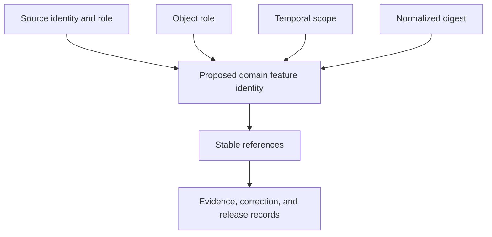

<!-- [KFM_META_BLOCK_V2]
doc_id: kfm://doc/contracts-domains-hydrology-domain-feature-identity
title: Domain Feature Identity Contract — Hydrology
type: semantic-contract
version: v0.2
status: draft; PROPOSED; PLACE; minimal id envelope; dedicated validation absent; no publication authority
owners:
  - "@bartytime4life — CODEOWNERS review route"
  - "Hydrology semantic and identity steward assignment — NEEDS VERIFICATION"
created: 2026-06-22
updated: 2026-07-30
policy_label: public-with-gates; semantic-contract; hydrology; feature-identity; deterministic-id; source-role-aware; time-aware; evidence-bound; release-gated; rollback-aware
related:
  - ./README.md
  - ./decision_envelope.md
  - ./domain_layer_descriptor.md
  - ./domain_observation.md
  - ./domain_validation_report.md
  - ./huc_unit.md
  - ./hydrograph.md
  - ./nfhl_zone.md
  - ./aquifer_observation.md
  - ../../../docs/domains/hydrology/IDENTITY_MODEL.md
  - ../../../docs/domains/hydrology/SOURCE_ROLE_MATRIX.md
  - ../../../docs/domains/hydrology/OBJECT_FAMILIES.md
  - ../../../docs/domains/hydrology/README.md
  - ../../../docs/domains/hydrology/CANONICAL_PATHS.md
  - ../../../schemas/contracts/v1/domains/hydrology/domain_feature_identity.schema.json
  - ../../../fixtures/domains/hydrology/README.md
  - ../../../tests/domains/hydrology/README.md
  - ../../../tools/validators/domains/hydrology/README.md
  - ../../../policy/domains/hydrology/README.md
  - ../../../data/registry/sources/hydrology/README.md
  - ../../../release/candidates/hydrology/README.md
  - ../../../docs/doctrine/directory-rules.md
  - ../../../docs/adr/ADR-0029-adopt-directory-governance-standard-v2.md
  - ../../../.github/workflows/domain-hydrology.yml
  - ../../../.github/workflows/hydrology-proof-slice.yml
  - ../../../.github/CODEOWNERS
tags: [kfm, contracts, hydrology, domain-feature-identity, deterministic-identity, spec-hash, source-role, temporal-scope, EvidenceRef, EvidenceBundle, SourceDescriptor, NFHL, HUC, ReachIdentity, rollback]
notes:
  - "The prior contract records that it was expanded from a greenfield scaffold at this same path."
  - "Same-path semantic-contract modernization grounded in main@934f6eb743691a8e3b1c49d65d1a293f2159e825."
  - "Accepted Directory Rules v2 returns PLACE for semantic Markdown under contracts/domains/hydrology/."
  - "The paired schema is a PROPOSED minimal identity envelope: spec_hash, id, and version are the only declared properties; only id is required; additionalProperties remains true."
  - "The schema-declared dedicated fixture, validator, and test surfaces for domain_feature_identity were not found at the pinned snapshot."
  - "The draft Hydrology identity model describes the common tuple as both CONFIRMED doctrine and a PROPOSED deterministic basis; this contract preserves the tuple as a PROPOSED semantic rule until machine shape and executable validation close the ambiguity."
  - "Current Hydrology CI proves only bounded EvidenceBundle alias shape, fixture polarity, and process-level network denial; the proof-slice workflow remains an explicit hold."
[/KFM_META_BLOCK_V2] -->

<a id="top"></a>

# Domain Feature Identity Contract — Hydrology

[](#status)
[](#repo-fit)
[](../../../schemas/contracts/v1/domains/hydrology/domain_feature_identity.schema.json)

Semantic boundary for the proposed Hydrology `domain_feature_identity` profile:
how a Hydrology record remains distinguishable across source, object role,
temporal scope, normalized content, correction, and release context.

> [!IMPORTANT]
> This file defines human-readable meaning only. The paired schema currently
> requires only `id`, permits arbitrary additional properties, and does not
> enforce the identity tuple documented here. No dedicated
> `domain_feature_identity` fixture family, validator, or test was found at the
> pinned snapshot.
>
> Identity is not evidence, policy, review, release, publication, or emergency
> guidance. It may help those authorities refer to the same object state, but it
> cannot replace any of them.

## Quick jumps

- [Status](#status)
- [Meaning](#meaning)
- [Repo fit](#repo-fit)
- [Schema posture](#schema-posture)
- [Identity tuple](#identity-tuple)
- [Source-role anti-collapse](#source-role-anti-collapse)
- [Object-family identity map](#object-family-identity-map)
- [Temporal rules](#temporal-rules)
- [Hash posture](#hash-posture)
- [Assertions](#assertions)
- [Exclusions](#exclusions)
- [Recommended fields](#recommended-fields)
- [Lifecycle](#lifecycle)
- [Validation](#validation)
- [Compatibility and versioning](#compatibility-and-versioning)
- [Rollback](#rollback)
- [Evidence basis](#evidence-basis)
- [Open questions](#open-questions)
- [Related contracts and docs](#related-contracts-and-docs)

## Status

| Surface | Confirmed posture at the pinned snapshot | Consequence |
| --- | --- | --- |
| Semantic contract | v0.2; `draft`; `PROPOSED` | Defines a reviewable meaning boundary; it is not accepted runtime behavior. |
| Canonical path | `contracts/domains/hydrology/domain_feature_identity.md`; `PLACE` | Keep semantic edits at this path; do not create a flat or parallel contract. |
| Paired schema | Present; `PROPOSED`; minimal `id` envelope | Does not enforce the common tuple, role integrity, temporal separation, digest construction, evidence, or release relationships. |
| Dedicated fixtures | Not found at `fixtures/domains/hydrology/domain_feature_identity/` | No representative valid, invalid, ambiguity, correction, or migration case is proven. |
| Dedicated validator | Not found at the schema-declared validator path | No executable identity decision or reason-code contract is established. |
| Dedicated test | Not found at the expected domain test path | No object-specific positive or negative behavior is proven. |
| Current Hydrology CI | Bounded EvidenceBundle alias shape/polarity and process-level network denial | Does not validate this contract or construct a Hydrology identity. |
| Policy | Hydrology policy README remains a `PROPOSED` scaffold | No accepted object-specific admission, denial, exposure, or release behavior is claimed here. |
| Release and publication | No authority created by this contract, schema, branch, pull request, or workflow | Separate evidence, policy, review, release, correction, and rollback closure remains required. |

[`CODEOWNERS`](../../../.github/CODEOWNERS) routes `contracts/` review to
`@bartytime4life`. That is a repository review route, not a Hydrology
stewardship assignment, independent approval, policy decision, release
approval, or proof that review occurred.

[Back to top](#top)

## Meaning

`domain_feature_identity` is the proposed shared identity profile for
Hydrology records. It answers a narrow semantic question:

> When should two Hydrology records be treated as the same identity-bearing
> state, and when must they remain distinct?

It is not itself a Hydrology feature family. Per-family contracts such as
`HUCUnit`, `ReachIdentity`, `GaugeSite`, observations, `NFHLZone`, and
`Hydrograph` refine what fills the shared identity slots.

Spatial overlap, similar labels, or a shared real-world subject do not establish
identity equivalence:

- an NFHL regulatory zone and an observed flood event remain distinct;
- a gauge site and any observation recorded at that site remain distinct;
- an observed hydrograph and a modeled hydrograph remain role-distinct;
- a HUC aggregate and a per-place observation remain distinct;
- a source correction may supersede a prior state without rewriting its audit
  history;
- cross-domain links reference each owning lane's identity instead of absorbing
  it into Hydrology.

Identity is therefore distinct from a display label, map feature handle,
database row key, file path, storage URL, source payload, or release identifier.

[Back to top](#top)

## Repo fit

Accepted [Directory Rules v2](../../../docs/doctrine/directory-rules.md) and
[ADR-0029](../../../docs/adr/ADR-0029-adopt-directory-governance-standard-v2.md)
separate three authority questions:

| Question | Owning root | Relationship to this contract |
| --- | --- | --- |
| What does the identity profile mean? | `contracts/` | This file owns the proposed Hydrology semantic boundary. |
| What machine shape is valid? | `schemas/` | The paired JSON Schema owns fields, requiredness, patterns, and closure. |
| When is a record allowed, denied, held, restricted, or abstained? | `policy/` | Policy owns admissibility and exposure decisions. |

Path decision:

- Artifact kind: semantic Markdown contract.
- Authority owner: object/interface meaning.
- Lifecycle stage: not applicable to the document; the identity it describes
  may be referenced across governed lifecycle states.
- Execution role: none.
- Scope kind and ID: domain, `hydrology`.
- Exposure: public repository documentation with gated downstream use.
- Mutability: versioned, reviewable replacement.
- Outcome: `PLACE`.
- Governing rules: `DIR-AUTHROOT-002`, `DIR-SCOPELANE-001` through
  `DIR-SCOPELANE-004`, and `DIR-DEP-001`.

This path may reference schema, policy, fixtures, tests, validators, source
registry, evidence, and release authorities. It must not duplicate or absorb
them.

[Back to top](#top)

## Schema posture

The paired schema currently declares:

| Schema element | Current value | Limit |
| --- | --- | --- |
| `$id` | `https://schemas.kfm.local/contracts/v1/domains/hydrology/domain_feature_identity.schema.json` | Stable schema identifier does not prove semantic completeness. |
| `type` | `object` | No object-family discriminator is enforced. |
| `id` | Optional property declaration; required by the schema | Type is `string`; no derivation, prefix, pattern, or uniqueness rule is defined. |
| `spec_hash` | Optional string | No algorithm, prefix, length, canonicalization profile, or covered-field rule is enforced. |
| `version` | Optional string | No version grammar or compatibility rule is enforced. |
| `required` | `id` only | Source, role, time, digest, and evidence context may be absent while the instance remains schema-valid. |
| `additionalProperties` | `true` | Unknown and misspelled fields are accepted. |
| `x-kfm.status` | `PROPOSED` | The schema is explicitly a scaffold. |
| Fixture pointer | `fixtures/domains/hydrology/domain_feature_identity/` | Pointer exists in schema metadata; the dedicated lane was not found. |
| Validator pointer | `tools/validators/domains/hydrology/validate_domain_feature_identity.py` | Pointer exists in schema metadata; the file was not found. |

This contract must not be read as a second embedded schema. Every field beyond
`id`, `spec_hash`, and `version` remains proposed until the paired schema is
revised through its own review boundary.

[Back to top](#top)

## Identity tuple

The draft Hydrology identity model records this common rule shape:

```text
identity_candidate =
  f(source_id, object_role, temporal_scope, normalized_digest)
```

That source is internally mixed: its metadata calls the rule shape
`CONFIRMED` doctrine, while the operative section calls it a `PROPOSED
deterministic basis`. The paired schema does not enforce any of the four slots.
This contract therefore treats the tuple as a **PROPOSED semantic rule** pending
schema, fixture, validator, test, and consumer closure.

| Component | Proposed semantic responsibility | Current machine posture |
| --- | --- | --- |
| `source_id` | Resolve a stable, versioned source identity and its authority, rights, cadence, and source-role context. | Not declared by the paired schema. |
| `object_role` | Distinguish the owning Hydrology object family or explicitly reviewed link role. | Not declared by the paired schema. |
| `temporal_scope` | Bind the time or vintage dimensions that are identity-bearing for the family. | Not declared by the paired schema. |
| `normalized_digest` | Represent canonicalized identity-bearing content with an explicit digest profile. | Not declared by the paired schema. |
| `id` | Carry the canonical identifier produced or assigned under the accepted profile. | Required string; derivation is undefined. |
| `spec_hash` | Carry a deterministic content hash if the accepted design uses this field for identity or conformance. | Optional string; semantics are undefined. |
| `version` | Identify the object or contract version used for interpretation. | Optional string; grammar is undefined. |


```mermaid
flowchart TD
  S["Source identity and role"] --> I["Proposed domain feature identity"]
  O["Object role"] --> I
  T["Temporal scope"] --> I
  D["Normalized digest"] --> I
  I --> R["Stable references"]
  R --> E["Evidence, correction, and release records"]
```

The diagram shows reference relationships only. It does not assert that a
runtime identity builder or downstream closure path exists.

[Back to top](#top)

## Source-role anti-collapse

Source role is identity context and must not be silently rewritten. The current
draft source-role matrix names seven roles, but object-specific machine
enforcement remains absent.

| Role | Hydrology exemplar | Identity consequence |
| --- | --- | --- |
| `observed` | Gauge, flow, water-level, water-quality, or groundwater measurement | Must retain observation basis, time, unit/qualifier where applicable, and source evidence. |
| `regulatory` | FEMA NFHL flood-zone designation | Remains separate from observed or modeled flood state even when geometry overlaps. |
| `modeled` | Reconstructed hydrograph or terrain-derived hydro surface | Must preserve model/run/uncertainty lineage; never relabel as observed. |
| `aggregate` | HUC, county, drought, or irrigation rollup | Must retain aggregation unit and window; never become per-place truth. |
| `administrative` | Well, permit, allocation, or water-right registry context | Administrative state is not an observation without separate observed support. |
| `candidate` | Watcher output or quarantined record | Has no public identity edge until governed admission and promotion. |
| `synthetic` | Fixture, simulation, or generated summary | Test or interpretive material only; never observed reality. |

The exact carrier is unresolved: a future schema may store `source_role`
directly, resolve it through an immutable/versioned `SourceDescriptor`, or do
both with a parity rule. Whichever design is accepted, a role change must not
reuse an identity in a way that hides semantic change.

> [!WARNING]
> NFHL regulatory context and observed inundation cannot share one
> identity-bearing state. Their source roles, evidence, review, release,
> correction, and rollback lineages remain separate.

[Back to top](#top)

## Object-family identity map

The draft object-family catalog and current contract index support this bounded
grouping:

| Group | Examples | Shared identity obligation | Current limitation |
| --- | --- | --- | --- |
| Accounting and network | `Watershed`, `HUCUnit`, `HydroFeature`, `ReachIdentity` | Preserve source/version, object role, temporal scope, and geometry/network identity. | Per-family normalization is not enforced by this schema. |
| Sites and observations | `GaugeSite`, `FlowObservation`, `WaterLevelObservation`, `WaterQualityObservation`, `AquiferObservation`, `GroundwaterWell` | Keep site identity separate from measurements and preserve observation time and basis. | `AquiferObservation` has a bounded closed shape; most related schemas remain minimal or permissive scaffolds. |
| Flood context and evidence | `NFHLZone` / `FloodContext`, proposed `ObservedFloodEvent` | Keep regulatory, observed, modeled, and emergency-authority classes separate. | No `ObservedFloodEvent` contract or schema was found at the pinned snapshot. |
| Derived views | `Hydrograph`, `UpstreamTrace` | Inherit input identity, source version, algorithm/model lineage, and ambiguity posture. | Dedicated semantic validation remains held or missing. |
| Proposed cross-lane links | `AquiferContextLink`, `WaterUseLink`, `DroughtLink`, `IrrigationLink` | Reference each neighboring lane's canonical identity without absorbing it. | The aquifer seam now has a separate bounded shape; treatment of the other links remains open. |

This contract supplies a common profile, not a universal normalization
algorithm. Every family still needs an explicit profile that states which
fields are identity-bearing, which changes rotate identity, and which
ambiguities require a fail-closed result.

The following family cues preserve the existing contract's more detailed
design inventory. They are **PROPOSED profile inputs**, not requirements
enforced by the current schema:

| Family | Identity distinction | Source or version cue | Temporal cue |
| --- | --- | --- | --- |
| `Watershed` | Drainage-area evidence or released derivative | WBD/HUC source vintage | Snapshot vintage or valid interval |
| `HUCUnit` | HUC2 through HUC12 accounting unit | WBD snapshot | Snapshot vintage |
| `HydroFeature` | Flowline, waterbody, or hydrographic feature | NHDPlus or 3DHP source version | Vintage band |
| `ReachIdentity` | Stable reach across source vintages | Source reach identifier plus version | Vintage band or valid interval |
| `GaugeSite` | Monitoring site, separate from its observations | NWIS or state station identifier | Site lifetime |
| `FlowObservation` | Discharge or streamflow reading | Series plus parameter | Instant or aggregation window |
| `WaterLevelObservation` | Stage or gage-height reading | Series plus parameter | Instant or aggregation window |
| `WaterQualityObservation` | Parameter measurement | Program, station, and sample reference | Sampling instant or window |
| `GroundwaterWell` | Well or site of record | State or NWIS well registry | Well lifetime |
| `AquiferObservation` | Groundwater-level or aquifer-state observation | Source reading plus well or site reference | Measurement instant or window |
| `AquiferContextLink` | Hydrology subject to Geology hydrostratigraphic relation | Typed endpoints plus interpretation basis | Relationship source/valid interval |
| `NFHLZone` / `FloodContext` | Regulatory flood-hazard context | NFHL panel plus effective date | Effective interval |
| Proposed `ObservedFloodEvent` | Observed inundation evidence | Historical or observed source family | Event interval |
| `Hydrograph` | Time-series view or derivative | Composition of source observations or models | Inherited from inputs |
| `UpstreamTrace` | Network traversal result | Source graph/version plus algorithm | Input or source vintage |
| `WaterUseLink` / `DroughtLink` / `IrrigationLink` | Cross-domain relation | Both owning lanes' identities | Relation window or source vintage |

[Back to top](#top)

## Temporal rules

Hydrology identity keeps six time concepts separate where material:

| Time | Proposed identity role | Must not be confused with |
| --- | --- | --- |
| `source_time` | Source vintage, update, or assertion time; may participate in source/version identity. | Retrieval or release time. |
| `observed_time` | When a phenomenon or measurement occurred; identity-bearing for observations as the family profile defines. | Source publication or fetch time. |
| `valid_time` | Interval during which a regulatory, modeled, or other assertion applies. | Observation or release time. |
| `retrieval_time` | When KFM fetched bytes; normally excluded from identity. | A new source fact or corrected observation. |
| `release_time` | When a governed public carrier was released; normally a release-plane event. | Source/object identity. |
| `correction_time` | When correction or supersession was recorded; rotates identity only when the accepted profile says evidentiary content changed. | Silent mutation of the prior state. |

Collapsing these concepts may corrupt identity, freshness, validity, correction,
or release interpretation and must fail closed at the applicable validator,
policy, or response boundary.

[Back to top](#top)

## Hash posture

The draft identity model recommends RFC 8785 JCS plus SHA-256 and an explicit
`jcs:sha256:<hex>` prefix. It also says hash policy is ADR-class and leaves
per-object normalization unresolved. The paired schema accepts any string for
`spec_hash`.

Accordingly:

- JCS plus SHA-256 is a **PROPOSED documented default**, not enforced machine
  behavior for `domain_feature_identity`;
- every accepted digest profile must name its canonicalization and algorithm;
- `spec_hash` versus a distinct `normalized_digest` remains unresolved;
- the prior draft's proposed `eb-` and `er-` prefixes belong to evidence-object
  identity and are not established or owned by this Hydrology contract;
- a profile change requires compatibility and migration analysis;
- URDNA2015 or another algorithm must not be substituted without the decision
  and profile required by the owning authority.

| Candidate identity-bearing content | Normally excluded incidental content |
| --- | --- |
| Source identity and immutable/versioned source-role context | Retrieval timestamp |
| Object-family or link role | File path, storage URL, or database key |
| Family-specific temporal scope | Release timestamp by itself |
| Accepted geometry/version fingerprint where material | Serializer whitespace or object-key order before canonicalization |
| Accepted normalized semantic fields | Run nonce, session ID, or transport encoding |
| Schema/profile version when the profile requires it | Signatures or attestations attached as separate records |

Exact inclusion is per-family review work. This table does not itself authorize
a digest implementation.

[Back to top](#top)

## Assertions

A future accepted implementation of this contract should prove:

1. **Stable identity** — path movement, serializer formatting, retrieval time,
   and display-label changes do not rotate identity by themselves.
2. **Meaningful rotation** — changes to accepted identity-bearing content do
   not silently reuse the prior identity.
3. **Source resolution** — source identity, role, version, rights, cadence, and
   authority limits resolve through an accepted source profile.
4. **Role integrity** — regulatory, observed, modeled, aggregate,
   administrative, candidate, and synthetic states do not collapse.
5. **Object-family separation** — HUC, reach, site, observation, flood,
   hydrograph, groundwater, and cross-lane identities remain distinguishable.
6. **Temporal separation** — source, observed, valid, retrieval, release, and
   correction time retain their distinct meanings.
7. **Digest reproducibility** — the accepted canonicalization and digest
   profile is deterministic and algorithm-prefixed.
8. **Evidence referenceability** — EvidenceRef/EvidenceBundle records may cite
   identity without identity becoming evidence.
9. **Correction lineage** — superseded states remain auditable and downstream
   reliance can be identified.
10. **Public-boundary discipline** — public surfaces use governed interfaces
    and release-approved carriers; identity never authorizes direct internal
    store access.

These are semantic acceptance obligations. None is proven by the current
minimal schema alone.

[Back to top](#top)

## Exclusions

| Misuse | Required interpretation |
| --- | --- |
| File path, storage URL, or map feature handle used as canonical identity | Reject; those values can move or are presentation-specific. |
| Retrieval or release time used to manufacture a new source/object identity | Reject unless an accepted family profile makes the underlying evidentiary state distinct. |
| NFHL identity reused for an observed flood event | Deny the role collapse; retain separate identities and evidence. |
| Modeled hydrograph identity reused for an observation | Deny or abstain at the applicable surface; preserve model identity and uncertainty. |
| HUC aggregate reused as a per-place observation | Deny the scope collapse. |
| Administrative record reused as observed fact | Require separate observed evidence or return a finite non-answer. |
| Candidate or watcher output treated as public identity | Hold or deny until governed admission and promotion close. |
| AI summary, fixture, or simulation used as identity evidence | Reject; generated or synthetic material is not source truth. |
| Neighboring-domain identity absorbed into Hydrology | Preserve the owning lane's identity and use a typed relation. |
| Identity treated as evidence, proof, policy, review, release, or publication authority | Reject; keep object families and authority planes distinct. |

[Back to top](#top)

## Recommended fields

Only `id`, `spec_hash`, and `version` are present in the current schema. The
remaining rows are **PROPOSED semantic candidates**, not machine-enforced
fields:

| Field or field family | Current status | Proposed meaning |
| --- | --- | --- |
| `id` | Required string | Canonical Hydrology identity under an accepted derivation/profile. |
| `version` | Optional string | Object or profile version used for interpretation and migration. |
| `spec_hash` | Optional string | Algorithm-prefixed deterministic digest if accepted as the canonical conformance or identity hash. |
| `domain` | Not in schema | Domain discriminator constrained to Hydrology. |
| `object_family` / `object_role` | Not in schema | Owning family or reviewed link role that prevents cross-family collisions. |
| `source_descriptor_ref` / `source_id` | Not in schema | Reference to accepted source identity, version, role, rights, cadence, and authority limits. |
| `source_record_ref` | Not in schema | Source-native record reference where rights and sensitivity permit. |
| `source_role` | Not in schema | Direct role value if the accepted design does not rely solely on descriptor resolution. |
| `temporal_scope` | Not in schema | Identity-bearing source, observation, validity, vintage, or event scope. |
| `geography_version_ref` | Not in schema | WBD, NHDPlus, NFHL panel, model, or other geography/version reference where material. |
| `normalized_digest` | Not in schema | Digest over the accepted normalized identity content if distinct from `spec_hash`. |
| `canonicalization_profile` | Not in schema | Versioned canonicalization and digest algorithm profile. |
| `evidence_ref_ids` / `evidence_bundle_ids` | Not in schema | References that support claims about the identified object state. |
| `policy_decision_refs` | Not in schema | Decisions affecting admission, use, sensitivity, or exposure. |
| `release_refs` | Not in schema | Promotion or release records that cite this identity. |
| `correction_refs` | Not in schema | Correction, withdrawal, or supersession lineage. |
| `rollback_refs` | Not in schema | Rollback decision and target references. |
| `quality_flags` | Not in schema | Reviewable findings such as role conflict, missing source identity, missing time, digest mismatch, ambiguous reach, or release gap. |

Before adding fields, decide whether `source_role` is stored directly,
descriptor-resolved, or parity-checked in both places; whether `spec_hash` and
`normalized_digest` are one concept; and which references belong on the
identity object rather than downstream evidence or release records.

[Back to top](#top)

## Lifecycle

| Phase | Identity posture |
| --- | --- |
| Pre-RAW | A watcher or intake signal may identify a source event, but it does not mint a public Hydrology identity. |
| RAW | Capture source bytes or a governed locator plus source identity/version context; no public identity edge exists. |
| WORK / QUARANTINE | Compute or reconcile the proposed identity profile; hold missing source, role, time, digest, rights, sensitivity, or ambiguity support. |
| PROCESSED | Emit a validated identity-bearing candidate only under an accepted schema/profile with deterministic lineage. |
| CATALOG / TRIPLET | Reference the identity and evidence in derived projections; projections do not become canonical truth. |
| RELEASE CANDIDATE | Check evidence, policy, review, validation, correction, withdrawal, and rollback support for the intended public carrier. |
| PUBLISHED | Serve only release-approved, public-safe identity references through governed interfaces. |
| CORRECTED / SUPERSEDED | Preserve prior identity and reliance; link the corrected or superseding state without silent overwrite. |

Promotion is a governed state transition, not a file move, schema pass,
workflow result, pull request, merge, or badge change.

[Back to top](#top)

## Validation

### Current implementation boundary

| Surface | Result at the pinned snapshot | What remains unproven |
| --- | --- | --- |
| Paired schema | Present; parses as a `PROPOSED` minimal `id` envelope | Tuple, normalization, role, time, digest, references, closure, and rejection behavior |
| Dedicated fixture lane | Not found | Valid, invalid, ambiguity, correction, migration, and sensitive-join cases |
| Dedicated validator | Not found | Deterministic construction, comparison, finite results, and stable reason codes |
| Dedicated test | Not found | Positive, negative, idempotency, migration, and no-network behavior |
| Hydrology smoke test | Three executable tests for EvidenceBundle alias shape/polarity and process-level network denial | Any `domain_feature_identity` behavior |
| `domain-hydrology` workflow | Runs the bounded Hydrology readiness and EvidenceBundle slice with read-only contents permission | Source truth, identity semantics, evidence closure, policy, proof, release, or publication |
| `hydrology-proof-slice` workflow | Explicit governed hold and readiness inspection | Proof production, EvidenceBundle closure, CatalogMatrix closure, promotion, or publication |

No repository-native command currently proves this contract. Do not relabel the
EvidenceBundle smoke command as identity validation.

### Required closure sequence

1. Reconcile the draft identity model's `CONFIRMED` versus `PROPOSED` wording
   and accept the semantic status of the tuple.
2. Resolve `SourceDescriptor` identity, versioning, source-role immutability,
   and the direct-versus-resolved role carrier.
3. Decide `id` derivation, `spec_hash` versus `normalized_digest`,
   canonicalization, digest algorithm, prefix, and profile versioning.
4. Define per-family identity-bearing and excluded fields, including ambiguity
   and correction behavior.
5. Expand the paired schema without embedding policy, evidence, or release
   authority in machine shape.
6. Add public-safe synthetic fixtures for stable equivalence, meaningful
   rotation, role separation, time separation, ambiguity, correction, and
   migration.
7. Add a dedicated deterministic, no-network validator and tests that reject
   role collapse, missing source/time/profile support, digest mismatch,
   retrieval-time churn, and unsupported cross-lane absorption.
8. Add or link the policy, evidence, review, release, correction, withdrawal,
   and rollback checks required by each consumer.
9. Wire bounded CI and known consumers without treating a passing check as
   source admission, proof, release, or publication.

Minimum executable coverage should retain the prior contract's concrete cases:

| Coverage class | Minimum cases |
| --- | --- |
| Valid family identities | HUC unit, reach, gauge site, flow observation, water-level observation, groundwater well, aquifer observation, NFHL zone, observed flood event if adopted, hydrograph, and upstream trace |
| Role separation | NFHL-as-observed, modeled-as-observed, aggregate-as-per-place, administrative-as-observed, synthetic-as-source, and candidate-as-published |
| Required context | Missing or unresolved source descriptor, source role, temporal scope, geography/version cue, canonicalization profile, or algorithm prefix |
| Determinism | Equivalent canonical content, meaningful content rotation, retrieval-time churn, release-time churn, serializer variance, and digest mismatch |
| Ambiguity and correction | Ambiguous reach, source correction, supersession, migration, cross-lane relation, and prior-consumer reliance |

### Outcome vocabularies stay separate

| Surface | Vocabulary currently documented elsewhere | Identity-related use |
| --- | --- | --- |
| Validator | `PASS`, `FAIL`, `ERROR` | Shape, digest, equivalence, ambiguity, and invariant checks once a validator exists. |
| Governed runtime response | `ANSWER`, `ABSTAIN`, `DENY`, `ERROR` | `ABSTAIN` for unsupported or ambiguous identity; `DENY` for policy or trust-boundary violations. |
| Promotion/release gate | `ALLOW`, `DENY`, `HOLD`, `ERROR` in draft Hydrology doctrine | `HOLD` while identity or closure evidence is incomplete; exact accepted release vocabulary remains owned by release contracts. |

This contract does not redefine any of those enums. A validator `FAIL`, runtime
`ABSTAIN`, policy `DENY`, and release `HOLD` are different results on different
authority surfaces.

[Back to top](#top)

## Compatibility and versioning

The following changes are compatibility-significant:

- changing the identity tuple or removing a slot;
- changing which fields are identity-bearing for an object family;
- changing `id` derivation, prefix, length, or uniqueness scope;
- merging or splitting `spec_hash` and `normalized_digest`;
- changing canonicalization, digest algorithm, or algorithm-prefix grammar;
- changing source-role storage or `SourceDescriptor` resolution behavior;
- changing time inclusion or correction-rotation rules;
- reclassifying a core object family as a link record or the reverse;
- changing public exposure of source-native or geography references.

Each such change requires a versioned profile, fixture parity, consumer
inventory, migration mapping, correction analysis, and rollback or forward-fix
plan. Moving a file or changing a serializer must not silently change object
identity.

[Back to top](#top)

## Rollback

Identity correction and documentation rollback are separate:

- **Identity correction:** preserve the prior ID, digest/profile, source and
  temporal context, evidence references, downstream consumers, release
  references, and the reason a new state supersedes it.
- **Before merge:** close the unmerged draft pull request and abandon the scoped
  branch.
- **After an independently authorized merge:** use a focused revert or
  corrective pull request against the actual merge commit; do not rewrite
  shared history.
- **If consumers already rely on changed semantics:** prefer a versioned
  forward fix when a simple revert would recreate two meanings under one
  identity.

Rollback is required when this documentation presents proposed fields as
enforced, turns identity into evidence or release authority, weakens
source-role or temporal separation, adopts an unreviewed hash/profile change,
absorbs a neighboring lane's identity, or implies publication from repository
state.

Reverting this Markdown file does not roll back a source record, computed
identity, EvidenceBundle, policy decision, release, published carrier, cache,
or external consumer.

A governed identity correction or rollback record should identify, as
applicable, the affected identities and object families; source descriptor and
source-native references; temporal and geography/version scope;
canonicalization profile and digest; evidence, validation, policy, release,
correction, and rollback references; downstream reliance; and any invalidated
layer descriptors, decision envelopes, public carriers, caches, or styles.

[Back to top](#top)

## Evidence basis

| Evidence | Status | Supports | Limit |
| --- | --- | --- | --- |
| Accepted [Directory Rules v2](../../../docs/doctrine/directory-rules.md) through [ADR-0029](../../../docs/adr/ADR-0029-adopt-directory-governance-standard-v2.md) | CONFIRMED / ACCEPTED placement authority | `contracts/` owns meaning; Hydrology is a domain lane; parallel contract/schema/policy authority is denied. | Placement does not implement identity or grant trust. |
| [Hydrology contract index](./README.md) at the pinned snapshot | CONFIRMED | Classifies this file as the shared deterministic-reference boundary and the schema as a minimal `id` envelope. | Index and prose do not prove runtime behavior. |
| [Paired schema](../../../schemas/contracts/v1/domains/hydrology/domain_feature_identity.schema.json) | CONFIRMED / `PROPOSED` | Declares `id`, `spec_hash`, `version`, metadata pointers, and `id` as the only required property. | Allows arbitrary properties and does not enforce the documented tuple. |
| [Hydrology identity model](../../../docs/domains/hydrology/IDENTITY_MODEL.md) | CONFIRMED draft repository evidence; semantic status mixed | Documents the tuple, time separation, digest proposal, role boundary, lifecycle, and open questions. | Calls the tuple both `CONFIRMED` doctrine and `PROPOSED` basis; contains stale repository-verification language and unresolved paths. |
| [Source-role matrix](../../../docs/domains/hydrology/SOURCE_ROLE_MATRIX.md) | CONFIRMED draft repository evidence | Documents the seven-role vocabulary and anti-collapse rules. | Machine enforcement and source-registry population remain proposed or unverified. |
| [Object-family catalog](../../../docs/domains/hydrology/OBJECT_FAMILIES.md) | CONFIRMED draft repository evidence | Names the core family spine, shared identity obligations, and proposed cross-lane links. | Aquifer measurement/link responsibilities are resolved; other per-field and link-family decisions remain open. |
| [Hydrology canonical paths](../../../docs/domains/hydrology/CANONICAL_PATHS.md) | CONFIRMED draft repository evidence | Records Hydrology responsibility-root and schema-home guidance. | Accepted Directory Rules and ADR-0029 control where the sources differ; some path claims remain proposed or stale. |
| [Hydrology tests](../../../tests/domains/hydrology/README.md), [validator index](../../../tools/validators/domains/hydrology/README.md), and [workflows](../../../.github/workflows/domain-hydrology.yml) | CONFIRMED bounded implementation evidence | One EvidenceBundle alias slice and process-level network denial are executable; broader identity validation is held. | No dedicated `domain_feature_identity` behavior. |
| Direct reads of the schema-declared fixture and validator paths plus the expected test path | CONFIRMED missing at the pinned snapshot | Dedicated implementation support is absent at those paths. | Does not prove that no experimental identity logic exists elsewhere. |
| [`CODEOWNERS`](../../../.github/CODEOWNERS) | CONFIRMED review route | Routes `contracts/` changes to `@bartytime4life`. | Not stewardship assignment, independent approval, policy, release, or publication authority. |

[Back to top](#top)

## Open questions

| ID | Status | Required closure |
| --- | --- | --- |
| `HYD-DFI-01` | `CONFLICTED` | Reconcile the identity model's `CONFIRMED doctrine` metadata with its `PROPOSED deterministic basis` section and record the accepted semantic status. |
| `HYD-DFI-02` | `NEEDS VERIFICATION` | Select the accepted `SourceDescriptor` schema/identity profile and define immutable or versioned source-role behavior. |
| `HYD-DFI-03` | `OPEN` | Decide whether source role is stored directly, resolved through `source_id`, or carried in both places with parity validation. |
| `HYD-DFI-04` | `OPEN` | Decide whether `spec_hash` is the normalized identity digest or a distinct conformance hash. |
| `HYD-DFI-05` | `OPEN` | Accept canonicalization, digest algorithm, algorithm prefix, ID derivation, and profile-version rules. |
| `HYD-DFI-06` | `NEEDS VERIFICATION` | Define per-family identity-bearing fields, ambiguity behavior, and correction rotation for core Hydrology families. |
| `HYD-DFI-07` | `PARTIALLY RESOLVED` | `AquiferObservation` is the measurement family and `AquiferContextLink` is its separate Geology seam record. Resolve treatment of `WaterUseLink`, `DroughtLink`, and `IrrigationLink` independently. |
| `HYD-DFI-08` | `MISSING` | Expand the schema and add dedicated public-safe fixtures, validator, tests, and stable validation reason codes. |
| `HYD-DFI-09` | `HELD` | Prove evidence, policy, review, release, correction, withdrawal, rollback, and governed-consumer closure before any public identity edge. |
| `HYD-DFI-10` | `NEEDS VERIFICATION` | Assign the cross-cutting reach/HUC crosswalk validator to an accepted execution lane without creating parallel semantic authority. |

Re-review this contract when the paired schema, identity model, object-family
catalog, source-role matrix, source registry, fixture lane, validator, tests,
policy, consumers, workflow coverage, correction behavior, or release posture
changes.

[Back to top](#top)

## Related contracts and docs

- [Hydrology contract index](./README.md)
- [Decision envelope](./decision_envelope.md)
- [Domain observation](./domain_observation.md)
- [Domain layer descriptor](./domain_layer_descriptor.md)
- [Domain validation report](./domain_validation_report.md)
- [HUC unit contract](./huc_unit.md)
- [Hydrograph contract](./hydrograph.md)
- [NFHL zone contract](./nfhl_zone.md)
- [Aquifer observation contract](./aquifer_observation.md)
- [Hydrology identity model](../../../docs/domains/hydrology/IDENTITY_MODEL.md)
- [Hydrology source-role matrix](../../../docs/domains/hydrology/SOURCE_ROLE_MATRIX.md)
- [Hydrology object-family catalog](../../../docs/domains/hydrology/OBJECT_FAMILIES.md)
- [Hydrology domain documentation](../../../docs/domains/hydrology/README.md)
- [Hydrology canonical paths](../../../docs/domains/hydrology/CANONICAL_PATHS.md)
- [Paired domain feature identity schema](../../../schemas/contracts/v1/domains/hydrology/domain_feature_identity.schema.json)
- [Hydrology fixtures index](../../../fixtures/domains/hydrology/README.md)
- [Hydrology tests index](../../../tests/domains/hydrology/README.md)
- [Hydrology validator index](../../../tools/validators/domains/hydrology/README.md)
- [Hydrology policy index](../../../policy/domains/hydrology/README.md)
- [Hydrology source registry](../../../data/registry/sources/hydrology/README.md)
- [Hydrology release-candidate guidance](../../../release/candidates/hydrology/README.md)
- [Accepted Directory Rules v2](../../../docs/doctrine/directory-rules.md)
- [ADR-0029](../../../docs/adr/ADR-0029-adopt-directory-governance-standard-v2.md)

[Back to top](#top)
