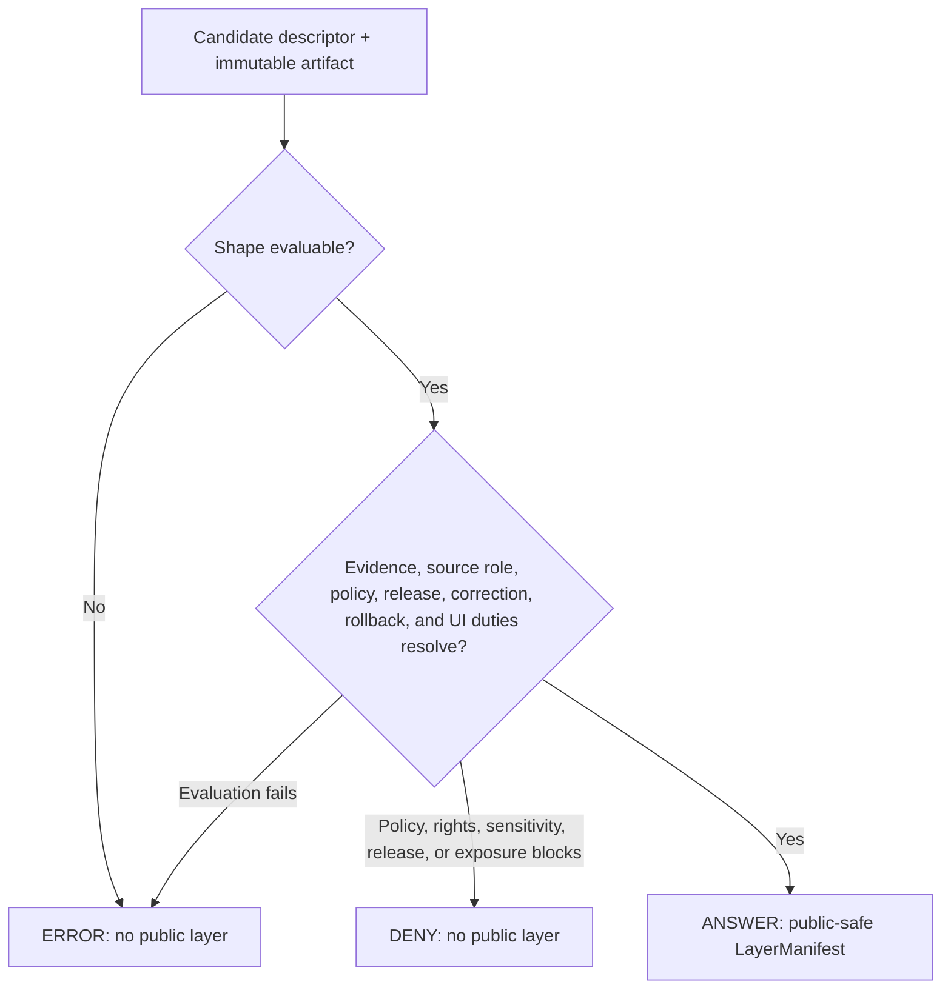

<!-- [KFM_META_BLOCK_V2]
doc_id: kfm://doc/contracts-domains-hydrology-domain-layer-descriptor
title: Domain Layer Descriptor Contract — Hydrology
type: semantic-contract
version: v0.2
status: draft; PROPOSED; schema stub; dedicated validation absent; published-layer topology conflicted; NEEDS VERIFICATION before promotion
owners:
  - "@bartytime4life — CODEOWNERS review route"
  - "Hydrology semantic steward assignment — NEEDS VERIFICATION"
  - "Map/UI stewardship assignment — NEEDS VERIFICATION"
  - "Governed API stewardship assignment — NEEDS VERIFICATION"
created: 2026-06-22
updated: 2026-07-30
policy_label: public-with-gates; semantic-contract; hydrology; layer-descriptor; map-ui-profile; source-role-aware; evidence-bound; release-gated; rollback-aware; not-for-life-safety
tags: [kfm, contracts, hydrology, domain-layer-descriptor, LayerManifest, MapReleaseManifest, MapLibre, EvidenceDrawerPayload, source-role, NFHL, regulatory-context, observed-flood, hydrograph, release-manifest, rollback, schema-stub, topology-drift]
related:
  - ./README.md
  - ./decision_envelope.md
  - ./domain_feature_identity.md
  - ./domain_observation.md
  - ./domain_validation_report.md
  - ./huc_unit.md
  - ./hydrograph.md
  - ./nfhl_zone.md
  - ./aquifer_observation.md
  - ../../../docs/domains/hydrology/API_CONTRACTS.md
  - ../../../docs/domains/hydrology/README.md
  - ../../../docs/domains/hydrology/SOURCE_ROLE_MATRIX.md
  - ../../../docs/domains/hydrology/IDENTITY_MODEL.md
  - ../../../docs/domains/hydrology/CANONICAL_PATHS.md
  - ../../../schemas/contracts/v1/domains/hydrology/domain_layer_descriptor.schema.json
  - ../../../fixtures/domains/hydrology/README.md
  - ../../../tests/domains/hydrology/README.md
  - ../../../tools/validators/domains/hydrology/README.md
  - ../../../policy/domains/hydrology/README.md
  - ../../../data/registry/sources/hydrology/README.md
  - ../../../data/published/hydrology/README.md
  - ../../../data/published/layers/hydrology/README.md
  - ../../../release/candidates/hydrology/README.md
  - ../../../docs/doctrine/directory-rules.md
  - ../../../docs/adr/ADR-0029-adopt-directory-governance-standard-v2.md
  - ../../../.github/workflows/domain-hydrology.yml
  - ../../../.github/CODEOWNERS
notes:
  - "Same-path semantic-contract modernization grounded in main@54a5e22c9c6bb256e1c2c511b1dcc5db3f78f81f."
  - "Accepted Directory Rules v2 returns PLACE for this semantic Markdown under contracts/domains/hydrology/."
  - "The paired schema remains a PROPOSED stub with spec_hash, id, and version properties; only id is required and additionalProperties=true."
  - "The schema-declared dedicated fixture root and validator, plus a dedicated test module, were absent at the pinned snapshot."
  - "Both data/published/hydrology/ and data/published/layers/hydrology/ exist; their authority and migration relationship is CONFLICTED / NEEDS VERIFICATION."
  - "Hydrology API doctrine defines the PROPOSED layer-manifest resolver as ANSWER / DENY / ERROR; ABSTAIN belongs to evidence-bearing feature, drawer, focus, or answer surfaces where defined."
  - "This descriptor profiles public/release layer delivery. It is not source truth, EvidenceBundle proof, PolicyDecision, ReleaseManifest, RunReceipt, public API implementation, emergency warning, or life-safety instruction."
[/KFM_META_BLOCK_V2] -->

<a id="top"></a>

# Domain Layer Descriptor Contract — Hydrology

Semantic contract for the proposed Hydrology `domain_layer_descriptor`: a
layer/view descriptor that binds governed map, API, and UI delivery to artifact
identity, source role, evidence, policy, release state, display obligations,
correction lineage, and rollback support without turning the layer into source
truth, proof, policy, publication authority, or flood-warning guidance.

[](#status)
[](../../../docs/doctrine/directory-rules.md#93-contracts-schemas-and-policy)
[](../../../schemas/contracts/v1/domains/hydrology/domain_layer_descriptor.schema.json)

> [!IMPORTANT]
> The checked-in schema currently proves only that an instance is an object
> with a string `id`; it does not enforce the semantic obligations in this
> contract. No dedicated fixture family, validator, or test for this descriptor
> was found at the pinned snapshot.

## Quick jumps

- [Status](#status) · [Meaning](#meaning) · [Repo fit](#repo-fit) · [Schema posture](#schema-posture)
- [Layer descriptor vs trust objects](#layer-descriptor-vs-trust-objects) · [Assertions](#assertions) · [Exclusions](#exclusions)
- [Recommended fields](#recommended-fields) · [Layer classes](#layer-classes) · [Display obligations](#display-obligations)
- [Layer-load decision flow](#layer-load-decision-flow) · [Source-role rules](#source-role-rules) · [Lifecycle](#lifecycle)
- [Validation](#validation) · [Rollback](#rollback) · [Evidence basis](#evidence-basis) · [Open questions](#open-questions)

---

## Status

| Surface | Confirmed posture at the pinned snapshot | Consequence |
|---|---|---|
| Semantic contract | v0.2; `draft`; `PROPOSED` | Defines a reviewable semantic boundary only. |
| Canonical path | `contracts/domains/hydrology/domain_layer_descriptor.md`; `PLACE` | Keep semantic edits here; do not create a flat or parallel contract. |
| Paired schema | Present, `PROPOSED`, and permissive | Only `id` is required; the proposed layer envelope is not machine-enforced. |
| Dedicated fixtures, validator, and test | Schema-declared fixture root and validator are absent; `test_domain_layer_descriptor.py` is absent | No dedicated positive, negative, or cross-field behavior is proven. |
| Governed API surface | H-API-02 is documented as `PROPOSED`; route and implementation remain unverified | `ANSWER`, `DENY`, and `ERROR` are contract-level outcomes, not observed runtime behavior. |
| Published-layer topology | `data/published/hydrology/` and `data/published/layers/hydrology/` both exist | Writer, canonical-target, compatibility, and migration relationships remain unresolved. |
| Review route | `CODEOWNERS` routes `contracts/` to `@bartytime4life` | Review routing is not semantic stewardship, independent approval, policy, or release authority. |
| Proof and release | Hydrology proof and release workflows retain explicit holds | No public-ready descriptor, released layer, deployment, or publication is asserted. |

> [!CAUTION]
> A Hydrology layer descriptor is not the layer's evidence, source feed,
> release approval, sensitivity control, or emergency guidance. It is a
> downstream descriptor for governed delivery of released or release-candidate
> Hydrology views.

[Back to top](#top)

## Meaning

`domain_layer_descriptor` records how a Hydrology map/API/UI layer may be
described and, only after all applicable gates close, presented safely.

It answers:

- Which Hydrology layer is being described?
- Which immutable released or release-candidate artifact is bound to it?
- Which object family, source role, temporal scope, and geometry posture does
  the layer represent?
- Does the layer contain observed readings, regulatory context, modeled
  derivatives, aggregate summaries, administrative context, candidates, or
  synthetic content?
- Which EvidenceRefs, EvidenceBundles, PolicyDecisions, ReleaseManifests,
  CorrectionNotices, and RollbackCards must resolve before public use?
- Which display duties apply, including regulatory, provisional, modeled,
  generalized-geometry, stale-source, correction, citation, and
  not-for-life-safety notices?

The descriptor is a semantic bridge between Hydrology object contracts and a
governed renderer/API surface. It does not replace either side.

[Back to top](#top)

## Repo fit

Accepted [Directory Rules v2](../../../docs/doctrine/directory-rules.md) and
[ADR-0029](../../../docs/adr/ADR-0029-adopt-directory-governance-standard-v2.md)
separate meaning, machine shape, policy, lifecycle data, and release decisions.

| Responsibility | Owning path or root | This contract's relationship |
|---|---|---|
| Human-readable layer meaning | `contracts/domains/hydrology/domain_layer_descriptor.md` | This file owns the proposed Hydrology descriptor semantics. |
| Machine shape | `schemas/contracts/v1/domains/hydrology/domain_layer_descriptor.schema.json` | Present stub; does not yet enforce the semantic envelope. |
| Policy decisions | `policy/domains/hydrology/` | Owns allow, deny, restrict, hold, or abstain rules where applicable. |
| Hydrology API doctrine | `docs/domains/hydrology/API_CONTRACTS.md` | Defines H-API-02, finite outcomes, public-layer gates, and trust-membrane constraints. |
| Contract inventory | `contracts/domains/hydrology/README.md` | Indexes this object family and records broader Hydrology holds. |
| Feature identity | `contracts/domains/hydrology/domain_feature_identity.md` | Owns stable identity, source role, temporal scope, and digest companion semantics. |
| Decision envelope | `contracts/domains/hydrology/decision_envelope.md` | Owns the runtime finite-outcome carrier; this descriptor does not redefine it. |
| Validation report | `contracts/domains/hydrology/domain_validation_report.md` | Owns inspectable gate results; this descriptor may reference, not replace, them. |
| Source registry | `data/registry/sources/hydrology/` | Carries source identity, role, rights, cadence, and claim limits. |
| Published Hydrology data | `data/published/hydrology/` | Directory Rules-conforming domain lane; its README proposes a `layers/` child. |
| Existing layer-first published lane | `data/published/layers/hydrology/` | Existing competing topology; treat as `CONFLICTED / NEEDS VERIFICATION`, not a second writer by assumption. |
| Release candidates and decisions | `release/candidates/hydrology/` and accepted release object families | Candidate review, release, correction, withdrawal, and rollback remain distinct from carrier bytes. |

Path decision:

- Artifact kind: semantic Markdown contract.
- Authority owner: object and interface meaning.
- Responsibility root: `contracts/`.
- Scope kind and ID: domain, `hydrology`.
- Existing home: `contracts/domains/hydrology/`.
- Outcome: `PLACE`.
- Governing rules: `DIR-AUTHROOT-002` and `DIR-SCOPELANE-001` through
  `DIR-SCOPELANE-004`.

The same contract may reference many trust objects. It must not absorb their
authority or settle the published-lane migration through prose.

[Back to top](#top)

## Schema posture

| Schema fact | Current posture |
|---|---|
| Confirmed schema path | `schemas/contracts/v1/domains/hydrology/domain_layer_descriptor.schema.json` |
| Schema `$id` | `https://schemas.kfm.local/contracts/v1/domains/hydrology/domain_layer_descriptor.schema.json` |
| Schema title | `domain_layer_descriptor` |
| Schema status | `PROPOSED` |
| JSON type | `object` |
| Defined properties | `spec_hash`, `id`, `version` |
| Required fields | `id` only |
| Additional properties | `true` |
| Contract pointer | Resolves to this file |
| Fixtures pointer | Declares `fixtures/domains/hydrology/domain_layer_descriptor/`; path absent at the pinned snapshot |
| Validator pointer | Declares `tools/validators/domains/hydrology/validate_domain_layer_descriptor.py`; file absent at the pinned snapshot |
| Dedicated test | `tests/domains/hydrology/test_domain_layer_descriptor.py` absent at the pinned snapshot |
| Policy pointer | Resolves to the Hydrology policy lane; object-specific enforcement is not established |
| Full descriptor enforcement | `NEEDS VERIFICATION` |

This object satisfies the current schema shape:

```json
{
  "id": "illustrative-schema-only"
}
```

That example is intentionally insufficient. The schema does not define an ID
format or enforce layer identity, artifact refs, source role, evidence,
validation, policy, release, UI duties, public-safe geometry, correction, or
rollback. Schema acceptance must not be reported as semantic conformance or
public readiness.

[Back to top](#top)

## Layer descriptor vs trust objects

| Object or artifact | What it owns | Boundary |
|---|---|---|
| `domain_layer_descriptor` | Layer meaning, source-role posture, artifact binding, display duties, and public-delivery constraints | This contract |
| `LayerManifest` | Cross-cutting layer-manifest payload returned by a resolver | This descriptor profiles Hydrology requirements; it does not redefine the shared manifest |
| `MapReleaseManifest` | Active map/layer release set and version lock | Required by API doctrine for public layer load; this descriptor does not publish |
| `EvidenceBundle` | Evidence support and citation scope | Descriptor cites it; descriptor is not proof |
| `PolicyDecision` | Allowed, restricted, denied, held, or abstained posture according to the applicable policy | Descriptor cites it; descriptor does not decide policy |
| `DomainValidationReport` | Deterministic gate results and failed checks | Descriptor may reference it; a report is not proof or release authority |
| `ReleaseManifest` | Publication authority and immutable rollback target | Descriptor cites it; descriptor is not release approval |
| `RunReceipt` | Build, tile, or pipeline process memory | Descriptor may cite an artifact from a run; it is not the receipt |
| `CorrectionNotice` | Correction, withdrawal, or supersession lineage | Descriptor must expose material correction state |
| Map tiles and styles | Delivery artifacts | Never evidence, proof, release, source truth, or redaction policy by themselves |
| `EvidenceDrawerPayload` | UI projection of evidence | Descriptor must permit resolution; the drawer owns the projection |

[Back to top](#top)

## Assertions

Within this draft contract, **must** denotes a proposed semantic requirement
for review. It does not claim that the current schema, validator, workflow, API,
or client enforces the requirement.

A reviewable `domain_layer_descriptor` must assert:

1. **Layer identity** — stable descriptor ID, layer ID, Hydrology domain,
   layer class, version, and deterministic digest posture.
2. **Artifact binding** — artifact refs, digests, media type, CRS, bounds,
   zoom or resolution, temporal extent, and public-safe posture.
3. **Source-role binding** — observed, regulatory, modeled, aggregate,
   administrative, candidate, and synthetic roles remain visible and do not
   collapse.
4. **Evidence binding** — EvidenceRefs and EvidenceBundles resolve for material
   layer claims and Evidence Drawer inspection.
5. **Validation binding** — applicable validation reports identify the checked
   revision, gates, results, and unresolved holds.
6. **Policy binding** — PolicyDecision refs and exposure/restriction state
   travel with the descriptor.
7. **Release binding** — ReleaseManifest or MapReleaseManifest, correction
   path, and rollback target exist before public layer loading.
8. **Temporal posture** — source, observed, valid, retrieval, release,
   correction, and stale/freshness states are not collapsed.
9. **Display duties** — regulatory, provisional, modeled, aggregate,
   generalized, sensitive, stale, correction, and not-for-life-safety notices
   are machine-inspectable where material.
10. **Public path safety** — public clients load only through governed
    interfaces and released artifacts, never RAW, WORK, QUARANTINE, source
    endpoints, or release candidates.
11. **Correction and rollback readiness** — a source, artifact, evidence,
    policy, or release change can invalidate the descriptor and every
    downstream cache, export, or view.

[Back to top](#top)

## Exclusions

| Misuse | Why it is denied or requires abstention |
|---|---|
| Layer descriptor as source truth | SourceDescriptor and source payloads own source authority. |
| Layer descriptor as evidence proof | EvidenceBundle and proof support remain separate. |
| Layer descriptor as policy decision | Policy source and decision records remain separate. |
| Layer descriptor as release authority | ReleaseManifest and MapReleaseManifest own publication decisions. |
| Tile URL as public release | Tile artifacts require digest, evidence, policy, release, correction, and rollback closure. |
| Map style as sensitivity control | Styling is delivery; redaction or generalization requires policy and receipt support. |
| NFHL layer as observed flood extent | Regulatory context is not observed inundation. |
| Modeled hydrograph layer as observed series | Modeled source role and run/uncertainty lineage must remain visible. |
| Aggregate HUC layer as per-place truth | Aggregation unit and window must remain visible. |
| Candidate layer as public layer | WORK, QUARANTINE, and release-candidate material is not public. |
| Emergency warning or life-safety layer | KFM Hydrology is not an alert authority. |
| AI or Focus Mode answer inferred from a layer alone | Answers require released EvidenceBundle support and citation/AI receipt closure. |

[Back to top](#top)

## Recommended fields

The following fields are **PROPOSED** targets for future schema work. They are
not enforced by the current schema stub.

| Field | Proposed semantic meaning |
|---|---|
| `id` | Canonical Hydrology layer-descriptor ID. |
| `version` | Contract or object version. |
| `spec_hash` | Deterministic digest over normalized descriptor semantics. |
| `domain` | Hydrology domain binding. |
| `layer_id` | Stable layer identifier used by governed API and UI surfaces. |
| `layer_class` | HUC/watershed, reach, gauge, observation, NFHL regulatory, hydrograph, upstream trace, groundwater, cross-link, aggregate, or an accepted enum. |
| `object_family_refs` | Hydrology object families represented by the layer. |
| `artifact_refs` | Immutable refs for PMTiles, vector tiles, COG, GeoParquet, API payload, report, or export artifacts. |
| `artifact_digests` | Content digests for each bound artifact. |
| `artifact_profile` | Media type, CRS, bounds, zoom/resolution, and other delivery properties. |
| `source_descriptor_refs` | Source identity, role, rights, cadence, authority, and citation refs. |
| `source_role_summary` | Role set represented by the layer. |
| `temporal_extent` | Source, observed, valid, retrieval, release, and correction coverage. |
| `freshness_state` | Current, historical, stale-source, superseded, withdrawn, provisional, unknown, or an accepted enum. |
| `geometry_role` | Exact internal, source scale, generalized public, aggregate public, withheld, restricted, or an accepted enum. |
| `evidence_ref_ids` | EvidenceRefs available for feature and drawer resolution. |
| `evidence_bundle_ids` | EvidenceBundles supporting material public claims. |
| `validation_report_refs` | Validation reports bound to the descriptor and artifact revision. |
| `policy_decision_refs` | Policy decisions controlling exposure and interaction. |
| `release_refs` | ReleaseManifest, MapReleaseManifest, or PromotionDecision refs as accepted by the owning contracts. |
| `correction_refs` | CorrectionNotice, withdrawal, or supersession refs. |
| `rollback_refs` | RollbackCard or immutable rollback-target refs. |
| `ui_obligations` | Required legend badges, caveats, disclaimers, drawer links, and export notes. |
| `interaction_policy` | View, click, drawer, focus context, export, download, denied, or an accepted enum. |
| `quality_flags` | Missing evidence, missing release, stale source, role conflict, NFHL/observed collapse, modeled/observed collapse, aggregate/per-place collapse, sensitive join, or schema-stub state. |

Field names, requiredness, enums, formats, reference syntax, and cross-field
rules remain subject to schema, policy, fixture, and validator review.

[Back to top](#top)

## Layer classes

| Layer class | Proposed publishable posture | Required display behavior |
|---|---|---|
| `huc_unit` or `watershed` | Boundary and accounting context | Snapshot or vintage and source role visible |
| `hydro_feature` or `reach_identity` | Hydrographic network context | Source version, ambiguity/abstention state, and evidence support visible |
| `gauge_site` | Monitoring-site identity | Site metadata remains separate from observations |
| `flow_observation` or `water_level_observation` | Observed reading layer | Unit, qualifier/provisional status, observed/source time, and Evidence Drawer |
| `water_quality_observation` | Observed parameter layer | Parameter, unit, qualifier, sampling method/window |
| `groundwater_well` or `aquifer_observation` | Groundwater context or observation | Private-property and sensitivity review; public geometry generalized where policy requires |
| `nfhl_zone` or `flood_context` | Regulatory flood-hazard context | Regulatory notice; never observed flooding |
| `observed_flood_event` | Observed inundation evidence | Event time, source evidence, and explicit distinction from NFHL |
| `hydrograph` | Observed, modeled, or explicitly mixed time series | Role notice; model, run, and uncertainty for modeled outputs |
| `upstream_trace` | Derived network traversal | Source graph/version, algorithm, evidence, and process receipt |
| `water_use_link`, `drought_link`, or `irrigation_link` | Cross-domain relationship | Both lanes' source roles and evidence; sensitive joins reviewed |

These values are semantic candidates, not an accepted machine enum.

[Back to top](#top)

## Display obligations

Before the proposed layer-manifest resolver can return `ANSWER`, a public
Hydrology descriptor must make these applicable duties machine-inspectable:

- release state and ReleaseManifest or MapReleaseManifest reference;
- EvidenceBundle or EvidenceRef resolution path;
- source-role notices for observed, regulatory, modeled, aggregate,
  administrative, candidate, or synthetic content;
- NFHL regulatory caveat wherever NFHL or flood-regulatory context appears;
- provisional or final status for observations where material;
- model, run, and uncertainty caveat for modeled hydrographs or derivatives;
- generalized or restricted geometry notice where public geometry differs from
  source or internal geometry;
- stale, superseded, withdrawn, or corrected state where material;
- immutable rollback target for released layer artifacts;
- not-for-life-safety notice where a layer could be mistaken for emergency
  flood guidance.

A layer that cannot satisfy its applicable duties may remain useful internally,
but this contract does not classify it as public-ready.

[Back to top](#top)

## Layer-load decision flow

The documented H-API-02 surface separates successful layer serving from policy
denial and evaluation failure:



`ABSTAIN` remains available on evidence-bearing feature, drawer, Focus Mode, or
answer surfaces where their contracts define it. It is not listed as an H-API-02
layer-load outcome in the inspected API contract.

[Back to top](#top)

## Source-role rules

| Source role | Required descriptor behavior |
|---|---|
| `observed` | May support observed readings or events only when identity, time, unit, qualifier, evidence, policy, and release resolve. |
| `regulatory` | May support NFHL or FloodContext as regulatory context only; observed-flood framing is denied. |
| `modeled` | May support modeled hydrograph or derived surfaces with model, run, receipt, and uncertainty lineage; observed framing is denied. |
| `aggregate` | May support HUC, watershed, or county rollups with aggregation unit and window; per-place framing is denied. |
| `administrative` | May support registry, allocation, or accounting context; it is not an observation unless separately evidenced. |
| `candidate` | No public layer serving before governed promotion. |
| `synthetic` | Never observed reality; fixture, simulation, reconstruction, or AI boundaries remain visible. |

[Back to top](#top)

## Lifecycle

| Phase | Descriptor handling |
|---|---|
| RAW | Source metadata or artifact refs may be captured; no public descriptor is served. |
| WORK or QUARANTINE | Candidate descriptor is normalized; missing role, evidence, release, rights, sensitivity, or role-collapse findings are held. |
| PROCESSED | Descriptor may bind a candidate artifact, digest, time extent, role summary, EvidenceRefs, validation report, and quality flags. |
| CATALOG or TRIPLET | Descriptor may support discovery and relationship projections; this does not authorize public serving. |
| RELEASE CANDIDATE | Evidence, policy, review, release, correction, rollback, artifact integrity, and UI obligations are evaluated. |
| PUBLISHED | Governed interfaces may return a descriptor or LayerManifest for released public-safe artifacts only. |
| CORRECTED, WITHDRAWN, or SUPERSEDED | Source, artifact, evidence, policy, correction, withdrawal, or rollback changes invalidate affected descriptors and downstream caches. |

Promotion is a governed state transition, not a copy, file move, branch, commit,
pull request, merge, badge, or GitHub release.

[Back to top](#top)

## Validation

### Current executable boundary

The checked-in `domain-hydrology` workflow:

- inventories the exact Hydrology validator lane and does not include a
  domain-layer-descriptor validator;
- reserves executable coverage for the bounded Hydrology EvidenceBundle alias
  shape/polarity slice and process-level network denial;
- keeps broader Hydrology semantics, evidence closure, proof, and release on
  explicit hold.

No repository-native command was found that validates this descriptor family.
Do not invent one or cite the current Hydrology workflow as proof of descriptor
conformance.

### Required promotion work

- [ ] Reconcile the schema's absent `fixtures_root` and `validator` pointers
      with actual, reviewed repository paths.
- [ ] Expand the paired schema beyond `spec_hash`, `id`, and `version`.
- [ ] Decide whether this descriptor is a Hydrology profile of shared
      `LayerManifest` or an independent domain DTO.
- [ ] Define canonical `layer_class`, `geometry_role`, `freshness_state`,
      `interaction_policy`, `ui_obligations`, and `quality_flags` values.
- [ ] Add synthetic positive fixtures for boundary, site, provisional
      observation, regulatory context, observed event, modeled hydrograph,
      derived trace, and generalized groundwater cases.
- [ ] Add synthetic negative fixtures for NFHL-as-observed, modeled-as-observed,
      aggregate-as-per-place, unreleased load, internal-path exposure,
      candidate-as-public, missing evidence, missing release, missing rollback,
      and life-safety framing.
- [ ] Add a dedicated validator and deterministic no-network tests that fail
      closed with finite reason codes.
- [ ] Confirm policy can deny or restrict sensitive groundwater,
      private-property, infrastructure, and cross-lane joins.
- [ ] Confirm the layer-manifest resolver returns `ANSWER`, `DENY`, or `ERROR`
      and cannot fall through to source or lifecycle-internal endpoints.
- [ ] Confirm public clients render negative and stale/corrected states rather
      than blank or generic error states.
- [ ] Resolve the two published-layer topologies through the adopted
      placement/migration process before authorizing a writer.

### Surface outcomes

| Condition | Contract-level outcome |
|---|---|
| Descriptor, artifact, evidence, source role, policy, release, correction, rollback, and display duties resolve | `ANSWER` with a public-safe LayerManifest |
| Policy, rights, sensitivity, role-collapse, release, or public-path rule blocks the layer | `DENY` |
| Shape, artifact, evidence, policy, release, or resolver failure prevents evaluation | `ERROR` |
| A feature, drawer, or answer request lacks evidence or citation support | `ABSTAIN` on that surface; not an H-API-02 layer-load outcome |

[Back to top](#top)

## Rollback

Semantic rollback is required when a Hydrology layer descriptor weakens source
role, evidence closure, validation, policy/release state, sensitivity posture,
correction lineage, or the public trust membrane.

Triggers include:

- serving without an applicable ReleaseManifest or MapReleaseManifest;
- a missing or mismatched artifact digest;
- unresolved EvidenceBundle, validation, policy, correction, or rollback refs;
- NFHL regulatory context rendered as observed flood extent;
- modeled hydrograph rendered as an observation;
- aggregate rollup rendered as a per-place observation;
- private-property or sensitive infrastructure join exposed without review;
- a public client reading RAW, WORK, QUARANTINE, source, or candidate paths;
- a Focus Mode answer derived from a layer without citation validation;
- tile or style artifacts used as sensitivity policy or proof;
- correction, withdrawal, or supersession not propagated;
- a second published-layer writer created before topology resolution; or
- schema/contract drift after migration.

Rollback records should identify affected descriptor and layer IDs, artifact
refs/digests, object-family refs, source descriptors, role summaries, temporal
extents, geometry roles, evidence, validation reports, policy decisions,
release manifests, corrections, rollback cards, invalidated envelopes,
exports, caches, and style versions.

For this documentation change, rollback before merge is to close the draft pull
request and abandon its scoped branch. After merge, use a focused revert or
corrective pull request against the actual merge commit. A documentation revert
does not alter source data, evidence, policy decisions, release state, caches,
deployed artifacts, or publication state.

[Back to top](#top)

## Evidence basis

| Evidence | Status | Supports | Limits |
|---|---|---|---|
| Pre-modernization target at blob `04de489fa0d6e05607b86c13f1fc4072b882753b` | CONFIRMED | Same-path v0.2 semantic identity and the strong anti-collapse, lifecycle, display, validation, and rollback baseline | Does not prove runtime implementation |
| [Directory Rules v2](../../../docs/doctrine/directory-rules.md) at blob `fd49a0b83e55cef52c1124281f093e263526898d` and [ADR-0029](../../../docs/adr/ADR-0029-adopt-directory-governance-standard-v2.md) | CONFIRMED / accepted | `contracts/` owns semantic meaning; domain lanes follow responsibility; `data/<lane>/<domain>/` is the illustrative domain pattern | Placement does not prove truth, policy, release, or implementation |
| [Paired schema](../../../schemas/contracts/v1/domains/hydrology/domain_layer_descriptor.schema.json) at blob `f998ee7a7409bcaa2b3164f51ad73e030e720295` | CONFIRMED | Object shape, three visible properties, `id` required, permissive additional properties, and declared companion paths | Does not enforce the proposed descriptor envelope |
| Missing dedicated fixture root, validator, and test reads at the pinned snapshot | CONFIRMED | Dedicated descriptor validation is absent | Does not rule out unrelated generic validation |
| [Hydrology API contracts](../../../docs/domains/hydrology/API_CONTRACTS.md) at blob `f741ef5da9752977aae4a8d4c5a5e6d08fc5fbe0` | CONFIRMED doctrine; implementation PROPOSED | H-API-02, `LayerManifest`, `ANSWER / DENY / ERROR`, no unreleased layer load, Evidence Drawer and life-safety boundaries | Route, DTO, policy runtime, clients, and release behavior remain unverified |
| [Hydrology contract README](./README.md) at blob `2dd051df101407d54402f8c6e4c271ca45f8ba31` | CONFIRMED orientation | Object-family inventory, role separation, bounded workflow evidence, and current holds | README prose is not schema or runtime enforcement |
| [Hydrology workflow](../../../.github/workflows/domain-hydrology.yml) | CONFIRMED executable boundary | Exact validator inventory, bounded EvidenceBundle checks, and explicit proof/release holds | Does not validate this descriptor |
| [`data/published/hydrology/`](../../../data/published/hydrology/README.md) and [`data/published/layers/hydrology/`](../../../data/published/layers/hydrology/README.md) | CONFIRMED competing repository homes | Both paths and their README claims exist | Canonical writer, alias, migration, and consumer closure remain unresolved |
| [`CODEOWNERS`](../../../.github/CODEOWNERS) | CONFIRMED review route | `@bartytime4life` is the GitHub review route for `contracts/` | Not a stewardship assignment, review record, policy decision, or release approval |

[Back to top](#top)

## Open questions

| ID | Question | Status | Resolution path |
|---|---|---|---|
| `HYD-LAYER-01` | Is `domain_layer_descriptor` a Hydrology profile of shared `LayerManifest` or a separate DTO? | NEEDS VERIFICATION | Contract, schema, and governed-API review |
| `HYD-LAYER-02` | Which fields are required, and which refs and cross-field constraints fail closed? | NEEDS VERIFICATION | Schema, synthetic fixtures, validator, and tests |
| `HYD-LAYER-03` | Which layer classes, geometry roles, freshness states, interaction policies, UI duties, and quality flags are canonical? | NEEDS VERIFICATION | Contract/schema/policy review |
| `HYD-LAYER-04` | Which public UI notices are mandatory for NFHL, provisional observations, modeled hydrographs, generalized geometry, corrections, and stale sources? | NEEDS VERIFICATION | Map/UI and policy fixture review |
| `HYD-LAYER-05` | Which validator proves that a layer cannot load without evidence, release, correction, and rollback closure? | NEEDS VERIFICATION | Validator and deterministic negative-test slice |
| `HYD-LAYER-06` | Which MapReleaseManifest contract and release object family is canonical for Hydrology layer sets? | NEEDS VERIFICATION | Release contract/schema/ADR review |
| `HYD-LAYER-07` | Is `data/published/layers/hydrology/` a compatibility path, migration source, or unauthorized parallel topology relative to `data/published/hydrology/`? | CONFLICTED / NEEDS VERIFICATION | Inventory writers/consumers, record path decision, and apply a reversible migration |
| `HYD-LAYER-08` | Should the schema's unresolved fixture and validator pointers be implemented at those exact paths or corrected through a versioned schema change? | NEEDS VERIFICATION | Schema-owner and validation-owner review |
| `HYD-LAYER-09` | Who holds verified Hydrology semantic, Map/UI, governed API, policy, sensitivity, and release stewardship? | NEEDS VERIFICATION | Stewardship assignment; do not infer from CODEOWNERS |

[Back to top](#top)

## Related contracts and docs

- [`./README.md`](./README.md) — Hydrology contract inventory and current holds.
- [`./decision_envelope.md`](./decision_envelope.md) — runtime outcome carrier.
- [`./domain_feature_identity.md`](./domain_feature_identity.md) — stable feature identity and role/time/digest semantics.
- [`./domain_observation.md`](./domain_observation.md) — Hydrology observation boundary.
- [`./domain_validation_report.md`](./domain_validation_report.md) — inspectable validation-report meaning.
- [`../../../docs/domains/hydrology/API_CONTRACTS.md`](../../../docs/domains/hydrology/API_CONTRACTS.md) — governed API and layer-manifest doctrine.
- [`../../../docs/domains/hydrology/SOURCE_ROLE_MATRIX.md`](../../../docs/domains/hydrology/SOURCE_ROLE_MATRIX.md) — source-role anti-collapse matrix.
- [`../../../docs/domains/hydrology/IDENTITY_MODEL.md`](../../../docs/domains/hydrology/IDENTITY_MODEL.md) — deterministic identity doctrine.
- [`../../../schemas/contracts/v1/domains/hydrology/domain_layer_descriptor.schema.json`](../../../schemas/contracts/v1/domains/hydrology/domain_layer_descriptor.schema.json) — current schema stub.
- [`../../../docs/doctrine/directory-rules.md`](../../../docs/doctrine/directory-rules.md) — accepted responsibility-root and domain-lane law.
- [`../../../docs/adr/ADR-0029-adopt-directory-governance-standard-v2.md`](../../../docs/adr/ADR-0029-adopt-directory-governance-standard-v2.md) — Directory Rules v2 adoption decision.
- [`../../../data/published/hydrology/README.md`](../../../data/published/hydrology/README.md) — domain-first published Hydrology lane.
- [`../../../data/published/layers/hydrology/README.md`](../../../data/published/layers/hydrology/README.md) — existing layer-first published Hydrology lane requiring reconciliation.
- [`../../../release/candidates/hydrology/README.md`](../../../release/candidates/hydrology/README.md) — candidate review boundary.
- [`../../../.github/workflows/domain-hydrology.yml`](../../../.github/workflows/domain-hydrology.yml) — bounded executable checks and explicit holds.

[Back to top](#top)
